<h1 style="color:skyblue;text-align:center">---SpringCloud学习笔记---</h1>


----

# 服务架构演变

## 单体架构

单体架构，就是将业务的所有功能集中在一个项目中开发，打成一个包部署

优点：

* 架构简单
* 部署成本低

缺点：

* 耦合度高


## 分布式架构

分布式架构，根据业务功能对系统进行拆分，每个业务模块作为独立项目开发，称为一个服务

比如一个应用拆分为订单模块、用户模块、商品功能模块、支付模块。

优点：

* 降低服务耦合
* 有利于服务升级拓展


分布式架构的要考虑的问题：

* 服务拆分粒度如何？
* 服务集群地址如何维护？
* 服务之间如何实现远程调用？
* 服务健康状态如何感知？


## 微服务

微服务是一种经过良好架构设计的分布式架构方案，微服务架构特征：

* 单一职责：微服务拆分粒度更小，每一个服务都对应唯一的业务能力，做到单一职责，避免重复业务开发
* 面向服务：微服务对外暴露业务接口
* 自治：团队独立、技术独立、数据独立、部署独立
* 隔离性强：服务调用做好隔离、容错、降级，避免出现级联问题


优点：

* 拆分粒度更小
* 服务更独立
* 耦合度更低


缺点：

* 架构非常复杂
* 运维、监控、部署难度提高


# SpringCloud

SpringCloud是目前国内使用最广泛的微服务框架

官网：[Spring Cloud](https://spring.io/projects/spring-cloud)

SpringCloud集成了各种微服务功能组件，并基于SpringBoot实现了这些组件的自动装配，从而提供了良好的开 箱即用体验


服务注册发现：

* Eureka
* Nacos
* Consul


统一配置管理：

* SpringCloudConfig
* Nacos


服务远程调用：

* OpenFeign
* Dubbo


统一网关路由：

* SpringCloudGateway
* Zuul


服务链路监控：

* Zipkin
* Sleuth


流控、降级、保护：

* Hystix
* Sentinel


SpringCloud与SpringBoot的版本兼容关系如下：

|                        Release Train                         |             Boot Version              |
| :----------------------------------------------------------: | :-----------------------------------: |
| [2021.0.x](https://github.com/spring-cloud/spring-cloud-release/wiki/Spring-Cloud-2021.0-Release-Notes) aka Jubilee |                 2.6.x                 |
| [2020.0.x](https://github.com/spring-cloud/spring-cloud-release/wiki/Spring-Cloud-2020.0-Release-Notes) aka Ilford | 2.4.x, 2.5.x (Starting with 2020.0.3) |
| [Hoxton](https://github.com/spring-cloud/spring-cloud-release/wiki/Spring-Cloud-Hoxton-Release-Notes) |   2.2.x, 2.3.x (Starting with SR5)    |
| [Greenwich](https://github.com/spring-projects/spring-cloud/wiki/Spring-Cloud-Greenwich-Release-Notes) |                 2.1.x                 |
| [Finchley](https://github.com/spring-projects/spring-cloud/wiki/Spring-Cloud-Finchley-Release-Notes) |                 2.0.x                 |
| [Edgware](https://github.com/spring-projects/spring-cloud/wiki/Spring-Cloud-Edgware-Release-Notes) |                 1.5.x                 |
| [Dalston](https://github.com/spring-projects/spring-cloud/wiki/Spring-Cloud-Dalston-Release-Notes) |                 1.5.x                 |


Spring Cloud Dalston、Edgware、Finchley和Greenwich都已达到生命终止状态，不再受支持。


学习的版本是 Hoxton.SR10，因此对应的SpringBoot版本是2.3.x版本


# 服务拆分及远程调用

服务拆分注意事项：

* 单一职责：不同微服务，不要重复开发相同业务
* 数据独立：不要访问其它微服务的数据库
* 面向服务：将自己的业务暴露为接口，供其它微服务调用


## 项目准备


spring_cloud_demo：父工程，管理依赖

- order_service：订单微服务，负责订单相关业务
- user_service：用户微服务，负责用户相关业务


要求：

- 订单微服务和用户微服务都必须有各自的数据库，相互独立
- 订单服务和用户服务都对外暴露Restful的接口
- 订单服务如果需要查询用户信息，只能调用用户服务的Restful接口，不能查询用户数据库


### 导入sql文件

创建数据库cloud_order

导入以下数据：

```sql

SET NAMES utf8mb4;
SET FOREIGN_KEY_CHECKS = 0;

-- ----------------------------
-- Table structure for tb_order
-- ----------------------------
DROP TABLE IF EXISTS `tb_order`;
CREATE TABLE `tb_order`  (
  `id` bigint(20) NOT NULL AUTO_INCREMENT COMMENT '订单id',
  `user_id` bigint(20) NOT NULL COMMENT '用户id',
  `name` varchar(100) CHARACTER SET utf8 COLLATE utf8_general_ci NULL DEFAULT NULL COMMENT '商品名称',
  `price` bigint(20) NOT NULL COMMENT '商品价格',
  `num` int(10) NULL DEFAULT 0 COMMENT '商品数量',
  PRIMARY KEY (`id`) USING BTREE,
  UNIQUE INDEX `username`(`name`) USING BTREE
) ENGINE = InnoDB AUTO_INCREMENT = 109 CHARACTER SET = utf8 COLLATE = utf8_general_ci ROW_FORMAT = Compact;

-- ----------------------------
-- Records of tb_order
-- ----------------------------
INSERT INTO `tb_order` VALUES (101, 1, 'Apple 苹果 iPhone 12 ', 699900, 1);
INSERT INTO `tb_order` VALUES (102, 2, '雅迪 yadea 新国标电动车', 209900, 1);
INSERT INTO `tb_order` VALUES (103, 3, '骆驼（CAMEL）休闲运动鞋女', 43900, 1);
INSERT INTO `tb_order` VALUES (104, 4, '小米10 双模5G 骁龙865', 359900, 1);
INSERT INTO `tb_order` VALUES (105, 5, 'OPPO Reno3 Pro 双模5G 视频双防抖', 299900, 1);
INSERT INTO `tb_order` VALUES (106, 6, '美的（Midea) 新能效 冷静星II ', 544900, 1);
INSERT INTO `tb_order` VALUES (107, 2, '西昊/SIHOO 人体工学电脑椅子', 79900, 1);
INSERT INTO `tb_order` VALUES (108, 3, '梵班（FAMDBANN）休闲男鞋', 31900, 1);

SET FOREIGN_KEY_CHECKS = 1;
```


创建数据库cloud_user

导入以下数据：

```sql

SET NAMES utf8mb4;
SET FOREIGN_KEY_CHECKS = 0;

-- ----------------------------
-- Table structure for tb_user
-- ----------------------------
DROP TABLE IF EXISTS `tb_user`;
CREATE TABLE `tb_user`  (
  `id` bigint(20) NOT NULL AUTO_INCREMENT,
  `username` varchar(100) CHARACTER SET utf8 COLLATE utf8_general_ci NULL DEFAULT NULL COMMENT '收件人',
  `address` varchar(255) CHARACTER SET utf8 COLLATE utf8_general_ci NULL DEFAULT NULL COMMENT '地址',
  PRIMARY KEY (`id`) USING BTREE,
  UNIQUE INDEX `username`(`username`) USING BTREE
) ENGINE = InnoDB AUTO_INCREMENT = 109 CHARACTER SET = utf8 COLLATE = utf8_general_ci ROW_FORMAT = Compact;

-- ----------------------------
-- Records of tb_user
-- ----------------------------
INSERT INTO `tb_user` VALUES (1, '柳岩', '湖南省衡阳市');
INSERT INTO `tb_user` VALUES (2, '文二狗', '陕西省西安市');
INSERT INTO `tb_user` VALUES (3, '华沉鱼', '湖北省十堰市');
INSERT INTO `tb_user` VALUES (4, '张必沉', '天津市');
INSERT INTO `tb_user` VALUES (5, '郑爽爽', '辽宁省沈阳市大东区');
INSERT INTO `tb_user` VALUES (6, '范兵兵', '山东省青岛市');

SET FOREIGN_KEY_CHECKS = 1;
```


因为没有多个数据库，所以只能用一个数据库的多个库代替


```sh
mysql> show databases
    -> ;
+--------------------+
| Database           |
+--------------------+
| cloud_order        |
| cloud_user         |
| hotel              |
| information_schema |
| mysql              |
| performance_schema |
| sakila             |
| shop               |
| student            |
| student1           |
| student_test       |
| sys                |
| test               |
| tx                 |
| world              |
+--------------------+
15 rows in set (0.00 sec)

mysql>
```


```sh
mysql> use cloud_order
Database changed
mysql> show tables;
+-----------------------+
| Tables_in_cloud_order |
+-----------------------+
| tb_order              |
+-----------------------+
1 row in set (0.00 sec)

mysql> select * from tb_order;
+-----+---------+----------------------------------+--------+------+
| id  | user_id | name                             | price  | num  |
+-----+---------+----------------------------------+--------+------+
| 101 |       1 | Apple 苹果 iPhone 12             | 699900 |    1 |
| 102 |       2 | 雅迪 yadea 新国标电动车          | 209900 |    1 |
| 103 |       3 | 骆驼（CAMEL）休闲运动鞋女        |  43900 |    1 |
| 104 |       4 | 小米10 双模5G 骁龙865            | 359900 |    1 |
| 105 |       5 | OPPO Reno3 Pro 双模5G 视频双防抖 | 299900 |    1 |
| 106 |       6 | 美的（Midea) 新能效 冷静星II     | 544900 |    1 |
| 107 |       2 | 西昊/SIHOO 人体工学电脑椅子      |  79900 |    1 |
| 108 |       3 | 梵班（FAMDBANN）休闲男鞋         |  31900 |    1 |
+-----+---------+----------------------------------+--------+------+
8 rows in set (0.00 sec)

mysql>
```


```sh
mysql> use cloud_user
Database changed
mysql> show tables;
+----------------------+
| Tables_in_cloud_user |
+----------------------+
| tb_user              |
+----------------------+
1 row in set (0.00 sec)

mysql> select * from tb_user;
+----+----------+--------------------+
| id | username | address            |
+----+----------+--------------------+
|  1 | 柳岩     | 湖南省衡阳市       |
|  2 | 文二狗   | 陕西省西安市       |
|  3 | 华沉鱼   | 湖北省十堰市       |
|  4 | 张必沉   | 天津市             |
|  5 | 郑爽爽   | 辽宁省沈阳市大东区 |
|  6 | 范兵兵   | 山东省青岛市       |
+----+----------+--------------------+
6 rows in set (0.00 sec)

mysql>
```


### 创建项目


创建项目 ，名字为spring_cloud_demo


pom.xml文件如下：

```xml
<?xml version="1.0" encoding="UTF-8"?>
<project xmlns="http://maven.apache.org/POM/4.0.0" xmlns:xsi="http://www.w3.org/2001/XMLSchema-instance"
         xsi:schemaLocation="http://maven.apache.org/POM/4.0.0 https://maven.apache.org/xsd/maven-4.0.0.xsd">
    <modelVersion>4.0.0</modelVersion>


    <parent>
        <groupId>org.springframework.boot</groupId>
        <artifactId>spring-boot-starter-parent</artifactId>
        <version>2.3.9.RELEASE</version>
        <relativePath/> <!-- lookup parent from repository -->
    </parent>

    <groupId>mao</groupId>
    <artifactId>spring_cloud_demo</artifactId>
    <version>0.0.1</version>
    <packaging>pom</packaging>

    <properties>
        <project.build.sourceEncoding>UTF-8</project.build.sourceEncoding>
        <project.reporting.outputEncoding>UTF-8</project.reporting.outputEncoding>
        <java.version>11</java.version>
    </properties>

    <modules>
        <module>user_service</module>
        <module>order_service</module>
    </modules>


    <dependencyManagement>
        <dependencies>
            <!--spring-cloud项目依赖-->
            <dependency>
                <groupId>org.springframework.cloud</groupId>
                <artifactId>spring-cloud-dependencies</artifactId>
                <version>Hoxton.SR10</version>
                <type>pom</type>
                <scope>import</scope>
            </dependency>

            <!--spring-boot druid连接池依赖-->
            <dependency>
                <groupId>com.alibaba</groupId>
                <artifactId>druid-spring-boot-starter</artifactId>
                <version>1.2.8</version>
            </dependency>

            <!--mysql依赖 spring-boot-->
            <dependency>
                <groupId>mysql</groupId>
                <artifactId>mysql-connector-java</artifactId>
                <version>8.0.27</version>
                <scope>runtime</scope>
            </dependency>

            <!--spring-boot mybatis依赖-->
            <dependency>
                <groupId>org.mybatis.spring.boot</groupId>
                <artifactId>mybatis-spring-boot-starter</artifactId>
                <version>2.2.2</version>
            </dependency>
        </dependencies>
    </dependencyManagement>


    <dependencies>
        <!--spring-boot lombok-->
        <dependency>
            <groupId>org.projectlombok</groupId>
            <artifactId>lombok</artifactId>
            <version>1.18.20</version>
            <optional>true</optional>
        </dependency>
    </dependencies>


</project>
```


### 创建子模块

创建一个子模块，模块名为user_service

pom.xml文件如下：

```xml
<?xml version="1.0" encoding="UTF-8"?>
<project xmlns="http://maven.apache.org/POM/4.0.0" xmlns:xsi="http://www.w3.org/2001/XMLSchema-instance"
         xsi:schemaLocation="http://maven.apache.org/POM/4.0.0 https://maven.apache.org/xsd/maven-4.0.0.xsd">
    <modelVersion>4.0.0</modelVersion>


    <parent>
        <groupId>mao</groupId>
        <artifactId>spring_cloud_demo</artifactId>
        <version>0.0.1</version>
        <relativePath>../pom.xml</relativePath> <!-- lookup parent from repository -->
    </parent>


    <artifactId>user_service</artifactId>
    <version>0.0.1</version>
    <name>user_service</name>
    <description>user_service</description>

    <properties>
        <java.version>11</java.version>
    </properties>

    <dependencies>

        <dependency>
            <groupId>org.springframework.boot</groupId>
            <artifactId>spring-boot-starter-web</artifactId>
        </dependency>

        <!--mysql依赖 spring-boot-->
        <dependency>
            <groupId>mysql</groupId>
            <artifactId>mysql-connector-java</artifactId>
        </dependency>

        <!--spring-boot druid连接池依赖-->
        <dependency>
            <groupId>com.alibaba</groupId>
            <artifactId>druid-spring-boot-starter</artifactId>
        </dependency>

        <!--spring-boot mybatis依赖-->
        <dependency>
            <groupId>org.mybatis.spring.boot</groupId>
            <artifactId>mybatis-spring-boot-starter</artifactId>
        </dependency>

        <dependency>
            <groupId>org.springframework.boot</groupId>
            <artifactId>spring-boot-starter-test</artifactId>
            <scope>test</scope>
        </dependency>

    </dependencies>

    <build>
        <plugins>
            <plugin>
                <groupId>org.springframework.boot</groupId>
                <artifactId>spring-boot-maven-plugin</artifactId>
            </plugin>
        </plugins>
    </build>

</project>
```


创建一个新模块，模块名字为order_service

pom.xml文件如下：

```xml
<?xml version="1.0" encoding="UTF-8"?>
<project xmlns="http://maven.apache.org/POM/4.0.0" xmlns:xsi="http://www.w3.org/2001/XMLSchema-instance"
         xsi:schemaLocation="http://maven.apache.org/POM/4.0.0 https://maven.apache.org/xsd/maven-4.0.0.xsd">
    <modelVersion>4.0.0</modelVersion>

    <parent>
        <groupId>mao</groupId>
        <artifactId>spring_cloud_demo</artifactId>
        <version>0.0.1</version>
        <relativePath>../pom.xml</relativePath> <!-- lookup parent from repository -->
    </parent>

    <artifactId>order_service</artifactId>
    <version>0.0.1</version>
    <name>order_service</name>
    <description>order_service</description>

    <properties>
        <java.version>11</java.version>
    </properties>

    <dependencies>

        <dependency>
            <groupId>org.springframework.boot</groupId>
            <artifactId>spring-boot-starter-web</artifactId>
        </dependency>

        <!--mysql依赖 spring-boot-->
        <dependency>
            <groupId>mysql</groupId>
            <artifactId>mysql-connector-java</artifactId>
        </dependency>

        <!--spring-boot druid连接池依赖-->
        <dependency>
            <groupId>com.alibaba</groupId>
            <artifactId>druid-spring-boot-starter</artifactId>
        </dependency>

        <!--spring-boot mybatis依赖-->
        <dependency>
            <groupId>org.mybatis.spring.boot</groupId>
            <artifactId>mybatis-spring-boot-starter</artifactId>
        </dependency>

        <dependency>
            <groupId>org.springframework.boot</groupId>
            <artifactId>spring-boot-starter-test</artifactId>
            <scope>test</scope>
        </dependency>

    </dependencies>

    <build>
        <plugins>
            <plugin>
                <groupId>org.springframework.boot</groupId>
                <artifactId>spring-boot-maven-plugin</artifactId>
            </plugin>
        </plugins>
    </build>

</project>
```


### 配置文件

将配置文件的格式改为yml格式


order_service的配置文件：

```yaml
# order 业务 配置文件

spring:


  # 配置数据源
  datasource:

    druid:
      driver-class-name: com.mysql.cj.jdbc.Driver
      url: jdbc:mysql://localhost:3306/cloud_order
      username: root
      password: 20010713


# 开启debug模式，输出调试信息，常用于检查系统运行状况
#debug: true

# 设置日志级别，root表示根节点，即整体应用日志级别
logging:
 # 日志输出到文件的文件名
  file:
     name: orer_server.log
  # 设置日志组
  group:
  # 自定义组名，设置当前组中所包含的包
    mao_pro: mao
  level:
    root: info
    # 为对应组设置日志级别
    mao_pro: debug
    # 日志输出格式
# pattern:
  # console: "%d %clr(%p) --- [%16t] %clr(%-40.40c){cyan} : %m %n"


server:
  port: 8081


mybatis:
  type-aliases-package: mao.order_service
  configuration:
    map-underscore-to-camel-case: true

```


user_service的配置文件：

```yaml
# user 业务 配置文件


spring:


  # 配置数据源
  datasource:

    druid:
      driver-class-name: com.mysql.cj.jdbc.Driver
      url: jdbc:mysql://localhost:3306/cloud_user
      username: root
      password: 20010713


# 开启debug模式，输出调试信息，常用于检查系统运行状况
#debug: true

# 设置日志级别，root表示根节点，即整体应用日志级别
logging:
  # 日志输出到文件的文件名
  file:
    name: user_server.log
  # 设置日志组
  group:
    # 自定义组名，设置当前组中所包含的包
    mao_pro: mao
  level:
    root: info
    # 为对应组设置日志级别
    mao_pro: debug
    # 日志输出格式
  # pattern:
  # console: "%d %clr(%p) --- [%16t] %clr(%-40.40c){cyan} : %m %n"


server:
  port: 8082


mybatis:
  type-aliases-package: mao.user_service
  configuration:
    map-underscore-to-camel-case: true
```


### 在user_service中创建类


#### 实体类User

位于mao.user_service.entity

```java
package mao.user_service.entity;

/**
 * Project name(项目名称)：spring_cloud_demo
 * Package(包名): mao.user_service.entity
 * Class(类名): User
 * Author(作者）: mao
 * Author QQ：1296193245
 * GitHub：https://github.com/maomao124/
 * Date(创建日期)： 2022/7/9
 * Time(创建时间)： 13:47
 * Version(版本): 1.0
 * Description(描述)： 实体类user
 */


public class User
{
    private Long id;
    private String username;
    private String address;

    /**
     * Instantiates a new User.
     */
    public User()
    {

    }

    /**
     * Instantiates a new User.
     *
     * @param id       the id
     * @param username the username
     * @param address  the address
     */
    public User(Long id, String username, String address)
    {
        this.id = id;
        this.username = username;
        this.address = address;
    }

    /**
     * Gets id.
     *
     * @return the id
     */
    public Long getId()
    {
        return id;
    }

    /**
     * Sets id.
     *
     * @param id the id
     */
    public void setId(Long id)
    {
        this.id = id;
    }

    /**
     * Gets username.
     *
     * @return the username
     */
    public String getUsername()
    {
        return username;
    }

    /**
     * Sets username.
     *
     * @param username the username
     */
    public void setUsername(String username)
    {
        this.username = username;
    }

    /**
     * Gets address.
     *
     * @return the address
     */
    public String getAddress()
    {
        return address;
    }

    /**
     * Sets address.
     *
     * @param address the address
     */
    public void setAddress(String address)
    {
        this.address = address;
    }

    @Override
    @SuppressWarnings("all")
    public String toString()
    {
        final StringBuilder stringbuilder = new StringBuilder();
        stringbuilder.append("id：").append(id).append('\n');
        stringbuilder.append("username：").append(username).append('\n');
        stringbuilder.append("address：").append(address).append('\n');
        return stringbuilder.toString();
    }
}
```


#### UserMapper

```java
package mao.user_service.mapper;

import mao.user_service.entity.User;
import org.apache.ibatis.annotations.Mapper;
import org.apache.ibatis.annotations.Param;
import org.apache.ibatis.annotations.Select;

/**
 * Project name(项目名称)：spring_cloud_demo
 * Package(包名): mao.user_service.mapper
 * Interface(接口名): UserMapper
 * Author(作者）: mao
 * Author QQ：1296193245
 * GitHub：https://github.com/maomao124/
 * Date(创建日期)： 2022/7/9
 * Time(创建时间)： 13:45
 * Version(版本): 1.0
 * Description(描述)： mybatis mapper接口
 */

@Mapper
public interface UserMapper
{
    @Select("select * from tb_user where id = #{id}")
    User findById(@Param("id") Long id);
}
```


#### UserService

```java
package mao.user_service.service;

import mao.user_service.entity.User;
import mao.user_service.mapper.UserMapper;
import org.springframework.beans.factory.annotation.Autowired;
import org.springframework.stereotype.Service;

/**
 * Project name(项目名称)：spring_cloud_demo
 * Package(包名): mao.user_service.service
 * Class(类名): UserService
 * Author(作者）: mao
 * Author QQ：1296193245
 * GitHub：https://github.com/maomao124/
 * Date(创建日期)： 2022/7/9
 * Time(创建时间)： 13:49
 * Version(版本): 1.0
 * Description(描述)： service层，不想写接口再实现接口
 */

@Service
public class UserService
{
    @Autowired
    private UserMapper userMapper;

    /**
     * 从数据库里查询用户信息
     *
     * @param id 用户的id
     * @return User
     */
    public User queryById(Long id)
    {
        return userMapper.findById(id);
    }
}
```


#### UserController

```java
package mao.user_service.controller;

import lombok.extern.slf4j.Slf4j;

import mao.user_service.entity.User;
import mao.user_service.service.UserService;
import org.springframework.web.bind.annotation.GetMapping;
import org.springframework.web.bind.annotation.PathVariable;
import org.springframework.web.bind.annotation.RequestMapping;
import org.springframework.web.bind.annotation.RestController;

import javax.annotation.Resource;

/**
 * Project name(项目名称)：spring_cloud_demo
 * Package(包名): mao.user_service.controller
 * Class(类名): UserController
 * Author(作者）: mao
 * Author QQ：1296193245
 * GitHub：https://github.com/maomao124/
 * Date(创建日期)： 2022/7/9
 * Time(创建时间)： 13:51
 * Version(版本): 1.0
 * Description(描述)： UserController
 */

@Slf4j
@RestController
@RequestMapping("/user")
public class UserController
{
    @Resource
    private UserService userService;

    /**
     * 获取用户信息
     *
     * @param id 用户的id
     * @return User
     */
    @GetMapping("/{id}")
    public User queryById(@PathVariable("id") Long id)
    {
        return userService.queryById(id);
    }
}
```


#### 启动类

```java
package mao.user_service;

import org.springframework.boot.SpringApplication;
import org.springframework.boot.autoconfigure.SpringBootApplication;

@SpringBootApplication
public class UserServiceApplication
{

    public static void main(String[] args)
    {
        SpringApplication.run(UserServiceApplication.class, args);
    }

}
```


### 在order_service中创建类

#### 实体类User

```java
package mao.order_service.entity;

/**
 * Project name(项目名称)：spring_cloud_demo
 * Package(包名): mao.user_service.entity
 * Class(类名): User
 * Author(作者）: mao
 * Author QQ：1296193245
 * GitHub：https://github.com/maomao124/
 * Date(创建日期)： 2022/7/9
 * Time(创建时间)： 13:47
 * Version(版本): 1.0
 * Description(描述)： 实体类user
 */


public class User
{
    private Long id;
    private String username;
    private String address;

    /**
     * Instantiates a new User.
     */
    public User()
    {

    }

    /**
     * Instantiates a new User.
     *
     * @param id       the id
     * @param username the username
     * @param address  the address
     */
    public User(Long id, String username, String address)
    {
        this.id = id;
        this.username = username;
        this.address = address;
    }

    /**
     * Gets id.
     *
     * @return the id
     */
    public Long getId()
    {
        return id;
    }

    /**
     * Sets id.
     *
     * @param id the id
     */
    public void setId(Long id)
    {
        this.id = id;
    }

    /**
     * Gets username.
     *
     * @return the username
     */
    public String getUsername()
    {
        return username;
    }

    /**
     * Sets username.
     *
     * @param username the username
     */
    public void setUsername(String username)
    {
        this.username = username;
    }

    /**
     * Gets address.
     *
     * @return the address
     */
    public String getAddress()
    {
        return address;
    }

    /**
     * Sets address.
     *
     * @param address the address
     */
    public void setAddress(String address)
    {
        this.address = address;
    }

    @Override
    @SuppressWarnings("all")
    public String toString()
    {
        final StringBuilder stringbuilder = new StringBuilder();
        stringbuilder.append("id：").append(id).append('\n');
        stringbuilder.append("username：").append(username).append('\n');
        stringbuilder.append("address：").append(address).append('\n');
        return stringbuilder.toString();
    }
}
```


#### 实体类order

```java
package mao.order_service.entity;

/**
 * Project name(项目名称)：spring_cloud_demo
 * Package(包名): mao.order_service.entity
 * Class(类名): Order
 * Author(作者）: mao
 * Author QQ：1296193245
 * GitHub：https://github.com/maomao124/
 * Date(创建日期)： 2022/7/9
 * Time(创建时间)： 13:55
 * Version(版本): 1.0
 * Description(描述)： 实体类order
 */


public class Order
{
    private Long id;
    private Long price;
    private String name;
    private Integer num;
    private Long userId;
    private User user;

    /**
     * Instantiates a new Order.
     */
    public Order()
    {

    }

    /**
     * Instantiates a new Order.
     *
     * @param id     the id
     * @param price  the price
     * @param name   the name
     * @param num    the num
     * @param userId the user id
     * @param user   the user
     */
    public Order(Long id, Long price, String name, Integer num, Long userId, User user)
    {
        this.id = id;
        this.price = price;
        this.name = name;
        this.num = num;
        this.userId = userId;
        this.user = user;
    }

    /**
     * Gets id.
     *
     * @return the id
     */
    public Long getId()
    {
        return id;
    }

    /**
     * Sets id.
     *
     * @param id the id
     */
    public void setId(Long id)
    {
        this.id = id;
    }

    /**
     * Gets price.
     *
     * @return the price
     */
    public Long getPrice()
    {
        return price;
    }

    /**
     * Sets price.
     *
     * @param price the price
     */
    public void setPrice(Long price)
    {
        this.price = price;
    }

    /**
     * Gets name.
     *
     * @return the name
     */
    public String getName()
    {
        return name;
    }

    /**
     * Sets name.
     *
     * @param name the name
     */
    public void setName(String name)
    {
        this.name = name;
    }

    /**
     * Gets num.
     *
     * @return the num
     */
    public Integer getNum()
    {
        return num;
    }

    /**
     * Sets num.
     *
     * @param num the num
     */
    public void setNum(Integer num)
    {
        this.num = num;
    }

    /**
     * Gets user id.
     *
     * @return the user id
     */
    public Long getUserId()
    {
        return userId;
    }

    /**
     * Sets user id.
     *
     * @param userId the user id
     */
    public void setUserId(Long userId)
    {
        this.userId = userId;
    }

    /**
     * Gets user.
     *
     * @return the user
     */
    public User getUser()
    {
        return user;
    }

    /**
     * Sets user.
     *
     * @param user the user
     */
    public void setUser(User user)
    {
        this.user = user;
    }

    @Override
    @SuppressWarnings("all")
    public String toString()
    {
        final StringBuilder stringbuilder = new StringBuilder();
        stringbuilder.append("id：").append(id).append('\n');
        stringbuilder.append("price：").append(price).append('\n');
        stringbuilder.append("name：").append(name).append('\n');
        stringbuilder.append("num：").append(num).append('\n');
        stringbuilder.append("userId：").append(userId).append('\n');
        stringbuilder.append("user：").append(user).append('\n');
        return stringbuilder.toString();
    }
}
```


#### OrderMapper

```java
package mao.order_service.mapper;

import mao.order_service.entity.Order;
import org.apache.ibatis.annotations.Mapper;
import org.apache.ibatis.annotations.Select;

/**
 * Project name(项目名称)：spring_cloud_demo
 * Package(包名): mao.order_service.mapper
 * Interface(接口名): OrderMapper
 * Author(作者）: mao
 * Author QQ：1296193245
 * GitHub：https://github.com/maomao124/
 * Date(创建日期)： 2022/7/9
 * Time(创建时间)： 13:54
 * Version(版本): 1.0
 * Description(描述)： Mapper接口
 */

@Mapper
public interface OrderMapper
{
    @Select("select * from tb_order where id = #{id}")
    Order findById(Long id);
}
```


#### OrderService

```java
package mao.order_service.service;

import mao.order_service.entity.Order;
import mao.order_service.mapper.OrderMapper;
import org.springframework.beans.factory.annotation.Autowired;
import org.springframework.stereotype.Service;

/**
 * Project name(项目名称)：spring_cloud_demo
 * Package(包名): mao.order_service.service
 * Class(类名): OrderService
 * Author(作者）: mao
 * Author QQ：1296193245
 * GitHub：https://github.com/maomao124/
 * Date(创建日期)： 2022/7/9
 * Time(创建时间)： 13:57
 * Version(版本): 1.0
 * Description(描述)： OrderService
 */

@Service
public class OrderService
{
    @Autowired
    private OrderMapper orderMapper;

    /**
     * 获取订单数据
     *
     * @param orderId 订单的id
     * @return Order
     */
    public Order queryOrderById(Long orderId)
    {
        // 根据orderId获取订单数据
        Order order = orderMapper.findById(orderId);
        //返回数据
        return order;
    }
}

```


#### OrderController

```java
package mao.order_service.controller;

import mao.order_service.entity.Order;
import mao.order_service.service.OrderService;
import org.springframework.beans.factory.annotation.Autowired;
import org.springframework.web.bind.annotation.GetMapping;
import org.springframework.web.bind.annotation.PathVariable;
import org.springframework.web.bind.annotation.RequestMapping;
import org.springframework.web.bind.annotation.RestController;

/**
 * Project name(项目名称)：spring_cloud_demo
 * Package(包名): mao.order_service.controller
 * Class(类名): OrderController
 * Author(作者）: mao
 * Author QQ：1296193245
 * GitHub：https://github.com/maomao124/
 * Date(创建日期)： 2022/7/9
 * Time(创建时间)： 13:59
 * Version(版本): 1.0
 * Description(描述)： OrderController
 */

@RestController
@RequestMapping("order")
public class OrderController
{
    @Autowired
    private OrderService orderService;


    /**
     * 获取订单数据
     * @param orderId 订单的id
     * @return Order
     */
    @GetMapping("{orderId}")
    public Order queryOrderByUserId(@PathVariable("orderId") Long orderId)
    {
        return orderService.queryOrderById(orderId);
    }
}
```


#### 启动类

```java
package mao.order_service;

import org.springframework.boot.SpringApplication;
import org.springframework.boot.autoconfigure.SpringBootApplication;

@SpringBootApplication
public class OrderServiceApplication
{

    public static void main(String[] args)
    {
        SpringApplication.run(OrderServiceApplication.class, args);
    }

}
```


### 测试类

user_service：

```java
package mao.user_service.service;

import mao.user_service.entity.User;
import org.junit.jupiter.api.Test;
import org.springframework.boot.test.context.SpringBootTest;

import javax.annotation.Resource;

import static org.junit.jupiter.api.Assertions.*;

/**
 * Project name(项目名称)：spring_cloud_demo
 * Package(包名): mao.user_service.service
 * Class(测试类名): UserServiceTest
 * Author(作者）: mao
 * Author QQ：1296193245
 * GitHub：https://github.com/maomao124/
 * Date(创建日期)： 2022/7/9
 * Time(创建时间)： 14:17
 * Version(版本): 1.0
 * Description(描述)： 测试类
 */

@SpringBootTest
class UserServiceTest
{

    @Resource
    private UserService userService;

    @Test
    void queryById()
    {
        User user = userService.queryById(1L);
        System.out.println(user);
    }
}
```


order_service：

```java
package mao.order_service.service;

import mao.order_service.entity.Order;
import org.junit.jupiter.api.Test;
import org.springframework.boot.test.context.SpringBootTest;

import javax.annotation.Resource;

import static org.junit.jupiter.api.Assertions.*;

/**
 * Project name(项目名称)：spring_cloud_demo
 * Package(包名): mao.order_service.service
 * Class(测试类名): OrderServiceTest
 * Author(作者）: mao
 * Author QQ：1296193245
 * GitHub：https://github.com/maomao124/
 * Date(创建日期)： 2022/7/9
 * Time(创建时间)： 14:20
 * Version(版本): 1.0
 * Description(描述)： 测试类
 */

@SpringBootTest
class OrderServiceTest
{

    @Resource
    private OrderService orderService;

    @Test
    void queryOrderById()
    {
        Order order = orderService.queryOrderById(101L);
        System.out.println(order);
    }
}
```


### 测试

user_service：

```sh
2022-07-09 14:22:05.829 DEBUG 13836 --- [           main] m.u.mapper.UserMapper.findById           : ==>  Preparing: select * from tb_user where id = ?
2022-07-09 14:22:05.869 DEBUG 13836 --- [           main] m.u.mapper.UserMapper.findById           : ==> Parameters: 1(Long)
2022-07-09 14:22:05.907 DEBUG 13836 --- [           main] m.u.mapper.UserMapper.findById           : <==      Total: 1
id：1
username：柳岩
address：湖南省衡阳市

```


order_service：

```sh
2022-07-09 14:23:06.999 DEBUG 15136 --- [           main] m.o.mapper.OrderMapper.findById          : ==>  Preparing: select * from tb_order where id = ?
2022-07-09 14:23:07.041 DEBUG 15136 --- [           main] m.o.mapper.OrderMapper.findById          : ==> Parameters: 101(Long)
2022-07-09 14:23:07.098 DEBUG 15136 --- [           main] m.o.mapper.OrderMapper.findById          : <==      Total: 1
id：101
price：699900
name：Apple 苹果 iPhone 12 
num：1
userId：1
user：null

```


功能正常


### 启动

user_service：

```sh
C:\Users\mao\.jdks\openjdk-16.0.2\bin\java.exe -XX:TieredStopAtLevel=1 -noverify -Dspring.output.ansi.enabled=always "-javaagent:C:\Program Files\JetBrains\IntelliJ IDEA 2021.2.2\lib\idea_rt.jar=49632:C:\Program Files\JetBrains\IntelliJ IDEA 2021.2.2\bin" -Dcom.sun.management.jmxremote -Dspring.jmx.enabled=true -Dspring.liveBeansView.mbeanDomain -Dspring.application.admin.enabled=true -Dfile.encoding=UTF-8 -classpath H:\程序\大三暑假\spring_cloud_demo\user_service\target\classes;C:\Users\mao\.m2\repository\org\springframework\boot\spring-boot-starter-web\2.3.9.RELEASE\spring-boot-starter-web-2.3.9.RELEASE.jar;C:\Users\mao\.m2\repository\org\springframework\boot\spring-boot-starter\2.3.9.RELEASE\spring-boot-starter-2.3.9.RELEASE.jar;C:\Users\mao\.m2\repository\org\springframework\boot\spring-boot\2.3.9.RELEASE\spring-boot-2.3.9.RELEASE.jar;C:\Users\mao\.m2\repository\org\springframework\boot\spring-boot-starter-logging\2.3.9.RELEASE\spring-boot-starter-logging-2.3.9.RELEASE.jar;C:\Users\mao\.m2\repository\ch\qos\logback\logback-classic\1.2.3\logback-classic-1.2.3.jar;C:\Users\mao\.m2\repository\ch\qos\logback\logback-core\1.2.3\logback-core-1.2.3.jar;C:\Users\mao\.m2\repository\org\apache\logging\log4j\log4j-to-slf4j\2.13.3\log4j-to-slf4j-2.13.3.jar;C:\Users\mao\.m2\repository\org\apache\logging\log4j\log4j-api\2.13.3\log4j-api-2.13.3.jar;C:\Users\mao\.m2\repository\org\slf4j\jul-to-slf4j\1.7.30\jul-to-slf4j-1.7.30.jar;C:\Users\mao\.m2\repository\jakarta\annotation\jakarta.annotation-api\1.3.5\jakarta.annotation-api-1.3.5.jar;C:\Users\mao\.m2\repository\org\yaml\snakeyaml\1.26\snakeyaml-1.26.jar;C:\Users\mao\.m2\repository\org\springframework\boot\spring-boot-starter-json\2.3.9.RELEASE\spring-boot-starter-json-2.3.9.RELEASE.jar;C:\Users\mao\.m2\repository\com\fasterxml\jackson\core\jackson-databind\2.11.4\jackson-databind-2.11.4.jar;C:\Users\mao\.m2\repository\com\fasterxml\jackson\core\jackson-annotations\2.11.4\jackson-annotations-2.11.4.jar;C:\Users\mao\.m2\repository\com\fasterxml\jackson\core\jackson-core\2.11.4\jackson-core-2.11.4.jar;C:\Users\mao\.m2\repository\com\fasterxml\jackson\datatype\jackson-datatype-jdk8\2.11.4\jackson-datatype-jdk8-2.11.4.jar;C:\Users\mao\.m2\repository\com\fasterxml\jackson\datatype\jackson-datatype-jsr310\2.11.4\jackson-datatype-jsr310-2.11.4.jar;C:\Users\mao\.m2\repository\com\fasterxml\jackson\module\jackson-module-parameter-names\2.11.4\jackson-module-parameter-names-2.11.4.jar;C:\Users\mao\.m2\repository\org\springframework\boot\spring-boot-starter-tomcat\2.3.9.RELEASE\spring-boot-starter-tomcat-2.3.9.RELEASE.jar;C:\Users\mao\.m2\repository\org\apache\tomcat\embed\tomcat-embed-core\9.0.43\tomcat-embed-core-9.0.43.jar;C:\Users\mao\.m2\repository\org\glassfish\jakarta.el\3.0.3\jakarta.el-3.0.3.jar;C:\Users\mao\.m2\repository\org\apache\tomcat\embed\tomcat-embed-websocket\9.0.43\tomcat-embed-websocket-9.0.43.jar;C:\Users\mao\.m2\repository\org\springframework\spring-web\5.2.13.RELEASE\spring-web-5.2.13.RELEASE.jar;C:\Users\mao\.m2\repository\org\springframework\spring-beans\5.2.13.RELEASE\spring-beans-5.2.13.RELEASE.jar;C:\Users\mao\.m2\repository\org\springframework\spring-webmvc\5.2.13.RELEASE\spring-webmvc-5.2.13.RELEASE.jar;C:\Users\mao\.m2\repository\org\springframework\spring-aop\5.2.13.RELEASE\spring-aop-5.2.13.RELEASE.jar;C:\Users\mao\.m2\repository\org\springframework\spring-context\5.2.13.RELEASE\spring-context-5.2.13.RELEASE.jar;C:\Users\mao\.m2\repository\org\springframework\spring-expression\5.2.13.RELEASE\spring-expression-5.2.13.RELEASE.jar;C:\Users\mao\.m2\repository\mysql\mysql-connector-java\8.0.27\mysql-connector-java-8.0.27.jar;C:\Users\mao\.m2\repository\com\google\protobuf\protobuf-java\3.13.0\protobuf-java-3.13.0.jar;C:\Users\mao\.m2\repository\com\alibaba\druid-spring-boot-starter\1.2.8\druid-spring-boot-starter-1.2.8.jar;C:\Users\mao\.m2\repository\com\alibaba\druid\1.2.8\druid-1.2.8.jar;C:\Users\mao\.m2\repository\javax\annotation\javax.annotation-api\1.3.2\javax.annotation-api-1.3.2.jar;C:\Users\mao\.m2\repository\org\slf4j\slf4j-api\1.7.30\slf4j-api-1.7.30.jar;C:\Users\mao\.m2\repository\org\springframework\boot\spring-boot-autoconfigure\2.3.9.RELEASE\spring-boot-autoconfigure-2.3.9.RELEASE.jar;C:\Users\mao\.m2\repository\org\mybatis\spring\boot\mybatis-spring-boot-starter\2.2.2\mybatis-spring-boot-starter-2.2.2.jar;C:\Users\mao\.m2\repository\org\springframework\boot\spring-boot-starter-jdbc\2.3.9.RELEASE\spring-boot-starter-jdbc-2.3.9.RELEASE.jar;C:\Users\mao\.m2\repository\com\zaxxer\HikariCP\3.4.5\HikariCP-3.4.5.jar;C:\Users\mao\.m2\repository\org\springframework\spring-jdbc\5.2.13.RELEASE\spring-jdbc-5.2.13.RELEASE.jar;C:\Users\mao\.m2\repository\org\springframework\spring-tx\5.2.13.RELEASE\spring-tx-5.2.13.RELEASE.jar;C:\Users\mao\.m2\repository\org\mybatis\spring\boot\mybatis-spring-boot-autoconfigure\2.2.2\mybatis-spring-boot-autoconfigure-2.2.2.jar;C:\Users\mao\.m2\repository\org\mybatis\mybatis\3.5.9\mybatis-3.5.9.jar;C:\Users\mao\.m2\repository\org\mybatis\mybatis-spring\2.0.7\mybatis-spring-2.0.7.jar;C:\Users\mao\.m2\repository\org\springframework\spring-core\5.2.13.RELEASE\spring-core-5.2.13.RELEASE.jar;C:\Users\mao\.m2\repository\org\springframework\spring-jcl\5.2.13.RELEASE\spring-jcl-5.2.13.RELEASE.jar;C:\Users\mao\.m2\repository\org\projectlombok\lombok\1.18.18\lombok-1.18.18.jar mao.user_service.UserServiceApplication
OpenJDK 64-Bit Server VM warning: Options -Xverify:none and -noverify were deprecated in JDK 13 and will likely be removed in a future release.

  .   ____          _            __ _ _
 /\\ / ___'_ __ _ _(_)_ __  __ _ \ \ \ \
( ( )\___ | '_ | '_| | '_ \/ _` | \ \ \ \
 \\/  ___)| |_)| | | | | || (_| |  ) ) ) )
  '  |____| .__|_| |_|_| |_\__, | / / / /
 =========|_|==============|___/=/_/_/_/
 :: Spring Boot ::        (v2.3.9.RELEASE)

2022-07-09 14:16:06.113  INFO 2280 --- [           main] mao.user_service.UserServiceApplication  : Starting UserServiceApplication on mao with PID 2280 (H:\程序\大三暑假\spring_cloud_demo\user_service\target\classes started by mao in H:\程序\大三暑假\spring_cloud_demo)
2022-07-09 14:16:06.115 DEBUG 2280 --- [           main] mao.user_service.UserServiceApplication  : Running with Spring Boot v2.3.9.RELEASE, Spring v5.2.13.RELEASE
2022-07-09 14:16:06.116  INFO 2280 --- [           main] mao.user_service.UserServiceApplication  : No active profile set, falling back to default profiles: default
2022-07-09 14:16:06.825  INFO 2280 --- [           main] o.s.b.w.embedded.tomcat.TomcatWebServer  : Tomcat initialized with port(s): 8082 (http)
2022-07-09 14:16:06.835  INFO 2280 --- [           main] o.apache.catalina.core.StandardService   : Starting service [Tomcat]
2022-07-09 14:16:06.835  INFO 2280 --- [           main] org.apache.catalina.core.StandardEngine  : Starting Servlet engine: [Apache Tomcat/9.0.43]
2022-07-09 14:16:06.899  INFO 2280 --- [           main] o.a.c.c.C.[Tomcat].[localhost].[/]       : Initializing Spring embedded WebApplicationContext
2022-07-09 14:16:06.899  INFO 2280 --- [           main] w.s.c.ServletWebServerApplicationContext : Root WebApplicationContext: initialization completed in 741 ms
2022-07-09 14:16:06.986  INFO 2280 --- [           main] c.a.d.s.b.a.DruidDataSourceAutoConfigure : Init DruidDataSource
2022-07-09 14:16:07.083  INFO 2280 --- [           main] com.alibaba.druid.pool.DruidDataSource   : {dataSource-1} inited
2022-07-09 14:16:07.207  INFO 2280 --- [           main] o.s.s.concurrent.ThreadPoolTaskExecutor  : Initializing ExecutorService 'applicationTaskExecutor'
2022-07-09 14:16:07.380  INFO 2280 --- [           main] o.s.b.w.embedded.tomcat.TomcatWebServer  : Tomcat started on port(s): 8082 (http) with context path ''
2022-07-09 14:16:07.389  INFO 2280 --- [           main] mao.user_service.UserServiceApplication  : Started UserServiceApplication in 1.554 seconds (JVM running for 2.034)
```


order_service：

```sh
C:\Users\mao\.jdks\openjdk-16.0.2\bin\java.exe -XX:TieredStopAtLevel=1 -noverify -Dspring.output.ansi.enabled=always "-javaagent:C:\Program Files\JetBrains\IntelliJ IDEA 2021.2.2\lib\idea_rt.jar=49703:C:\Program Files\JetBrains\IntelliJ IDEA 2021.2.2\bin" -Dcom.sun.management.jmxremote -Dspring.jmx.enabled=true -Dspring.liveBeansView.mbeanDomain -Dspring.application.admin.enabled=true -Dfile.encoding=UTF-8 -classpath H:\程序\大三暑假\spring_cloud_demo\order_service\target\classes;C:\Users\mao\.m2\repository\org\springframework\boot\spring-boot-starter-web\2.3.9.RELEASE\spring-boot-starter-web-2.3.9.RELEASE.jar;C:\Users\mao\.m2\repository\org\springframework\boot\spring-boot-starter\2.3.9.RELEASE\spring-boot-starter-2.3.9.RELEASE.jar;C:\Users\mao\.m2\repository\org\springframework\boot\spring-boot\2.3.9.RELEASE\spring-boot-2.3.9.RELEASE.jar;C:\Users\mao\.m2\repository\org\springframework\boot\spring-boot-starter-logging\2.3.9.RELEASE\spring-boot-starter-logging-2.3.9.RELEASE.jar;C:\Users\mao\.m2\repository\ch\qos\logback\logback-classic\1.2.3\logback-classic-1.2.3.jar;C:\Users\mao\.m2\repository\ch\qos\logback\logback-core\1.2.3\logback-core-1.2.3.jar;C:\Users\mao\.m2\repository\org\apache\logging\log4j\log4j-to-slf4j\2.13.3\log4j-to-slf4j-2.13.3.jar;C:\Users\mao\.m2\repository\org\apache\logging\log4j\log4j-api\2.13.3\log4j-api-2.13.3.jar;C:\Users\mao\.m2\repository\org\slf4j\jul-to-slf4j\1.7.30\jul-to-slf4j-1.7.30.jar;C:\Users\mao\.m2\repository\jakarta\annotation\jakarta.annotation-api\1.3.5\jakarta.annotation-api-1.3.5.jar;C:\Users\mao\.m2\repository\org\yaml\snakeyaml\1.26\snakeyaml-1.26.jar;C:\Users\mao\.m2\repository\org\springframework\boot\spring-boot-starter-json\2.3.9.RELEASE\spring-boot-starter-json-2.3.9.RELEASE.jar;C:\Users\mao\.m2\repository\com\fasterxml\jackson\core\jackson-databind\2.11.4\jackson-databind-2.11.4.jar;C:\Users\mao\.m2\repository\com\fasterxml\jackson\core\jackson-annotations\2.11.4\jackson-annotations-2.11.4.jar;C:\Users\mao\.m2\repository\com\fasterxml\jackson\core\jackson-core\2.11.4\jackson-core-2.11.4.jar;C:\Users\mao\.m2\repository\com\fasterxml\jackson\datatype\jackson-datatype-jdk8\2.11.4\jackson-datatype-jdk8-2.11.4.jar;C:\Users\mao\.m2\repository\com\fasterxml\jackson\datatype\jackson-datatype-jsr310\2.11.4\jackson-datatype-jsr310-2.11.4.jar;C:\Users\mao\.m2\repository\com\fasterxml\jackson\module\jackson-module-parameter-names\2.11.4\jackson-module-parameter-names-2.11.4.jar;C:\Users\mao\.m2\repository\org\springframework\boot\spring-boot-starter-tomcat\2.3.9.RELEASE\spring-boot-starter-tomcat-2.3.9.RELEASE.jar;C:\Users\mao\.m2\repository\org\apache\tomcat\embed\tomcat-embed-core\9.0.43\tomcat-embed-core-9.0.43.jar;C:\Users\mao\.m2\repository\org\glassfish\jakarta.el\3.0.3\jakarta.el-3.0.3.jar;C:\Users\mao\.m2\repository\org\apache\tomcat\embed\tomcat-embed-websocket\9.0.43\tomcat-embed-websocket-9.0.43.jar;C:\Users\mao\.m2\repository\org\springframework\spring-web\5.2.13.RELEASE\spring-web-5.2.13.RELEASE.jar;C:\Users\mao\.m2\repository\org\springframework\spring-beans\5.2.13.RELEASE\spring-beans-5.2.13.RELEASE.jar;C:\Users\mao\.m2\repository\org\springframework\spring-webmvc\5.2.13.RELEASE\spring-webmvc-5.2.13.RELEASE.jar;C:\Users\mao\.m2\repository\org\springframework\spring-aop\5.2.13.RELEASE\spring-aop-5.2.13.RELEASE.jar;C:\Users\mao\.m2\repository\org\springframework\spring-context\5.2.13.RELEASE\spring-context-5.2.13.RELEASE.jar;C:\Users\mao\.m2\repository\org\springframework\spring-expression\5.2.13.RELEASE\spring-expression-5.2.13.RELEASE.jar;C:\Users\mao\.m2\repository\mysql\mysql-connector-java\8.0.27\mysql-connector-java-8.0.27.jar;C:\Users\mao\.m2\repository\com\google\protobuf\protobuf-java\3.13.0\protobuf-java-3.13.0.jar;C:\Users\mao\.m2\repository\com\alibaba\druid-spring-boot-starter\1.2.8\druid-spring-boot-starter-1.2.8.jar;C:\Users\mao\.m2\repository\com\alibaba\druid\1.2.8\druid-1.2.8.jar;C:\Users\mao\.m2\repository\javax\annotation\javax.annotation-api\1.3.2\javax.annotation-api-1.3.2.jar;C:\Users\mao\.m2\repository\org\slf4j\slf4j-api\1.7.30\slf4j-api-1.7.30.jar;C:\Users\mao\.m2\repository\org\springframework\boot\spring-boot-autoconfigure\2.3.9.RELEASE\spring-boot-autoconfigure-2.3.9.RELEASE.jar;C:\Users\mao\.m2\repository\org\mybatis\spring\boot\mybatis-spring-boot-starter\2.2.2\mybatis-spring-boot-starter-2.2.2.jar;C:\Users\mao\.m2\repository\org\springframework\boot\spring-boot-starter-jdbc\2.3.9.RELEASE\spring-boot-starter-jdbc-2.3.9.RELEASE.jar;C:\Users\mao\.m2\repository\com\zaxxer\HikariCP\3.4.5\HikariCP-3.4.5.jar;C:\Users\mao\.m2\repository\org\springframework\spring-jdbc\5.2.13.RELEASE\spring-jdbc-5.2.13.RELEASE.jar;C:\Users\mao\.m2\repository\org\springframework\spring-tx\5.2.13.RELEASE\spring-tx-5.2.13.RELEASE.jar;C:\Users\mao\.m2\repository\org\mybatis\spring\boot\mybatis-spring-boot-autoconfigure\2.2.2\mybatis-spring-boot-autoconfigure-2.2.2.jar;C:\Users\mao\.m2\repository\org\mybatis\mybatis\3.5.9\mybatis-3.5.9.jar;C:\Users\mao\.m2\repository\org\mybatis\mybatis-spring\2.0.7\mybatis-spring-2.0.7.jar;C:\Users\mao\.m2\repository\org\springframework\spring-core\5.2.13.RELEASE\spring-core-5.2.13.RELEASE.jar;C:\Users\mao\.m2\repository\org\springframework\spring-jcl\5.2.13.RELEASE\spring-jcl-5.2.13.RELEASE.jar;C:\Users\mao\.m2\repository\org\projectlombok\lombok\1.18.18\lombok-1.18.18.jar mao.order_service.OrderServiceApplication
OpenJDK 64-Bit Server VM warning: Options -Xverify:none and -noverify were deprecated in JDK 13 and will likely be removed in a future release.

  .   ____          _            __ _ _
 /\\ / ___'_ __ _ _(_)_ __  __ _ \ \ \ \
( ( )\___ | '_ | '_| | '_ \/ _` | \ \ \ \
 \\/  ___)| |_)| | | | | || (_| |  ) ) ) )
  '  |____| .__|_| |_|_| |_\__, | / / / /
 =========|_|==============|___/=/_/_/_/
 :: Spring Boot ::        (v2.3.9.RELEASE)

2022-07-09 14:16:55.692  INFO 4796 --- [           main] m.order_service.OrderServiceApplication  : Starting OrderServiceApplication on mao with PID 4796 (H:\程序\大三暑假\spring_cloud_demo\order_service\target\classes started by mao in H:\程序\大三暑假\spring_cloud_demo)
2022-07-09 14:16:55.695 DEBUG 4796 --- [           main] m.order_service.OrderServiceApplication  : Running with Spring Boot v2.3.9.RELEASE, Spring v5.2.13.RELEASE
2022-07-09 14:16:55.695  INFO 4796 --- [           main] m.order_service.OrderServiceApplication  : No active profile set, falling back to default profiles: default
2022-07-09 14:16:56.381  INFO 4796 --- [           main] o.s.b.w.embedded.tomcat.TomcatWebServer  : Tomcat initialized with port(s): 8081 (http)
2022-07-09 14:16:56.393  INFO 4796 --- [           main] o.apache.catalina.core.StandardService   : Starting service [Tomcat]
2022-07-09 14:16:56.395  INFO 4796 --- [           main] org.apache.catalina.core.StandardEngine  : Starting Servlet engine: [Apache Tomcat/9.0.43]
2022-07-09 14:16:56.456  INFO 4796 --- [           main] o.a.c.c.C.[Tomcat].[localhost].[/]       : Initializing Spring embedded WebApplicationContext
2022-07-09 14:16:56.456  INFO 4796 --- [           main] w.s.c.ServletWebServerApplicationContext : Root WebApplicationContext: initialization completed in 716 ms
2022-07-09 14:16:56.542  INFO 4796 --- [           main] c.a.d.s.b.a.DruidDataSourceAutoConfigure : Init DruidDataSource
2022-07-09 14:16:56.641  INFO 4796 --- [           main] com.alibaba.druid.pool.DruidDataSource   : {dataSource-1} inited
2022-07-09 14:16:56.764  INFO 4796 --- [           main] o.s.s.concurrent.ThreadPoolTaskExecutor  : Initializing ExecutorService 'applicationTaskExecutor'
2022-07-09 14:16:56.935  INFO 4796 --- [           main] o.s.b.w.embedded.tomcat.TomcatWebServer  : Tomcat started on port(s): 8081 (http) with context path ''
2022-07-09 14:16:56.945  INFO 4796 --- [           main] m.order_service.OrderServiceApplication  : Started OrderServiceApplication in 1.529 seconds (JVM running for 2.007)
```


成功启动


### 访问测试

user_service：

http://localhost:8082/user/1


响应结果：

```json
{"id":1,"username":"柳岩","address":"湖南省衡阳市"}
```


order_service：

http://localhost:8081/order/101


响应结果：

```json
{"id":101,"price":699900,"name":"Apple 苹果 iPhone 12 ","num":1,"userId":1,"user":null}
```


访问正常


### 项目地址

https://github.com/maomao124/spring_cloud_demo.git


## 远程调用

需求：根据订单id查询订单的同时，把订单所属的用户信息一起返回。就是把order模块返回的json数据的user字段填充数据，用户查询订单的同时订单模块查询用户信息，用户模块返回数据后再拼接再返回。


可以使用RestTemplate来实现


### 实现步骤

在order_service子项目中创建一个配置类RestTemplateConfig：

```java
package mao.order_service.config;

import org.springframework.context.annotation.Bean;
import org.springframework.context.annotation.Configuration;
import org.springframework.web.client.RestTemplate;

/**
 * Project name(项目名称)：spring_cloud_demo_implement_remote_invocation_of_microservices
 * Package(包名): mao.order_service.config
 * Class(类名): RestTemplateConfig
 * Author(作者）: mao
 * Author QQ：1296193245
 * GitHub：https://github.com/maomao124/
 * Date(创建日期)： 2022/7/9
 * Time(创建时间)： 20:08
 * Version(版本): 1.0
 * Description(描述)： RestTemplate的配置类，位于子项目order_service
 */

@Configuration
public class RestTemplateConfig
{

    /**
     * 注入RestTemplate到spring容器
     *
     * @return restTemplate
     */
    @Bean
    public RestTemplate restTemplate()
    {
        return new RestTemplate();
    }
}
```


修改order_service服务中的mao.order_service.service包中的OrderService类中的queryOrderById方法：


```java
package mao.order_service.service;

import mao.order_service.entity.Order;
import mao.order_service.entity.User;
import mao.order_service.mapper.OrderMapper;
import org.springframework.beans.factory.annotation.Autowired;
import org.springframework.stereotype.Service;
import org.springframework.web.client.RestTemplate;

/**
 * Project name(项目名称)：spring_cloud_demo
 * Package(包名): mao.order_service.service
 * Class(类名): OrderService
 * Author(作者）: mao
 * Author QQ：1296193245
 * GitHub：https://github.com/maomao124/
 * Date(创建日期)： 2022/7/9
 * Time(创建时间)： 13:57
 * Version(版本): 1.0
 * Description(描述)： OrderService
 */

@Service
public class OrderService
{
    @Autowired
    private OrderMapper orderMapper;

    @Autowired
    private RestTemplate restTemplate;

    /**
     * 获取订单数据
     *
     * @param orderId 订单的id
     * @return Order
     */
    public Order queryOrderById(Long orderId)
    {
        // 根据orderId获取订单数据
        Order order = orderMapper.findById(orderId);
        //获得用户的id
        Long userId = order.getUserId();
        //发起远程调用
        //url
        String url = "http://localhost:8082/user/" + userId;
        User user = restTemplate.getForObject(url, User.class);
        //放入order里
        order.setUser(user);
        //返回数据
        return order;
    }
}
```


启动：

order_service：

```sh
C:\Users\mao\.jdks\openjdk-16.0.2\bin\java.exe -XX:TieredStopAtLevel=1 -noverify -Dspring.output.ansi.enabled=always "-javaagent:C:\Program Files\JetBrains\IntelliJ IDEA 2021.2.2\lib\idea_rt.jar=60546:C:\Program Files\JetBrains\IntelliJ IDEA 2021.2.2\bin" -Dcom.sun.management.jmxremote -Dspring.jmx.enabled=true -Dspring.liveBeansView.mbeanDomain -Dspring.application.admin.enabled=true -Dfile.encoding=UTF-8 -classpath H:\程序\大三暑假\spring_cloud_demo实现微服务远程调用\order_service\target\classes;C:\Users\mao\.m2\repository\org\springframework\boot\spring-boot-starter-web\2.3.9.RELEASE\spring-boot-starter-web-2.3.9.RELEASE.jar;C:\Users\mao\.m2\repository\org\springframework\boot\spring-boot-starter\2.3.9.RELEASE\spring-boot-starter-2.3.9.RELEASE.jar;C:\Users\mao\.m2\repository\org\springframework\boot\spring-boot\2.3.9.RELEASE\spring-boot-2.3.9.RELEASE.jar;C:\Users\mao\.m2\repository\org\springframework\boot\spring-boot-starter-logging\2.3.9.RELEASE\spring-boot-starter-logging-2.3.9.RELEASE.jar;C:\Users\mao\.m2\repository\ch\qos\logback\logback-classic\1.2.3\logback-classic-1.2.3.jar;C:\Users\mao\.m2\repository\ch\qos\logback\logback-core\1.2.3\logback-core-1.2.3.jar;C:\Users\mao\.m2\repository\org\apache\logging\log4j\log4j-to-slf4j\2.13.3\log4j-to-slf4j-2.13.3.jar;C:\Users\mao\.m2\repository\org\apache\logging\log4j\log4j-api\2.13.3\log4j-api-2.13.3.jar;C:\Users\mao\.m2\repository\org\slf4j\jul-to-slf4j\1.7.30\jul-to-slf4j-1.7.30.jar;C:\Users\mao\.m2\repository\jakarta\annotation\jakarta.annotation-api\1.3.5\jakarta.annotation-api-1.3.5.jar;C:\Users\mao\.m2\repository\org\yaml\snakeyaml\1.26\snakeyaml-1.26.jar;C:\Users\mao\.m2\repository\org\springframework\boot\spring-boot-starter-json\2.3.9.RELEASE\spring-boot-starter-json-2.3.9.RELEASE.jar;C:\Users\mao\.m2\repository\com\fasterxml\jackson\core\jackson-databind\2.11.4\jackson-databind-2.11.4.jar;C:\Users\mao\.m2\repository\com\fasterxml\jackson\core\jackson-annotations\2.11.4\jackson-annotations-2.11.4.jar;C:\Users\mao\.m2\repository\com\fasterxml\jackson\core\jackson-core\2.11.4\jackson-core-2.11.4.jar;C:\Users\mao\.m2\repository\com\fasterxml\jackson\datatype\jackson-datatype-jdk8\2.11.4\jackson-datatype-jdk8-2.11.4.jar;C:\Users\mao\.m2\repository\com\fasterxml\jackson\datatype\jackson-datatype-jsr310\2.11.4\jackson-datatype-jsr310-2.11.4.jar;C:\Users\mao\.m2\repository\com\fasterxml\jackson\module\jackson-module-parameter-names\2.11.4\jackson-module-parameter-names-2.11.4.jar;C:\Users\mao\.m2\repository\org\springframework\boot\spring-boot-starter-tomcat\2.3.9.RELEASE\spring-boot-starter-tomcat-2.3.9.RELEASE.jar;C:\Users\mao\.m2\repository\org\apache\tomcat\embed\tomcat-embed-core\9.0.43\tomcat-embed-core-9.0.43.jar;C:\Users\mao\.m2\repository\org\glassfish\jakarta.el\3.0.3\jakarta.el-3.0.3.jar;C:\Users\mao\.m2\repository\org\apache\tomcat\embed\tomcat-embed-websocket\9.0.43\tomcat-embed-websocket-9.0.43.jar;C:\Users\mao\.m2\repository\org\springframework\spring-web\5.2.13.RELEASE\spring-web-5.2.13.RELEASE.jar;C:\Users\mao\.m2\repository\org\springframework\spring-beans\5.2.13.RELEASE\spring-beans-5.2.13.RELEASE.jar;C:\Users\mao\.m2\repository\org\springframework\spring-webmvc\5.2.13.RELEASE\spring-webmvc-5.2.13.RELEASE.jar;C:\Users\mao\.m2\repository\org\springframework\spring-aop\5.2.13.RELEASE\spring-aop-5.2.13.RELEASE.jar;C:\Users\mao\.m2\repository\org\springframework\spring-context\5.2.13.RELEASE\spring-context-5.2.13.RELEASE.jar;C:\Users\mao\.m2\repository\org\springframework\spring-expression\5.2.13.RELEASE\spring-expression-5.2.13.RELEASE.jar;C:\Users\mao\.m2\repository\mysql\mysql-connector-java\8.0.27\mysql-connector-java-8.0.27.jar;C:\Users\mao\.m2\repository\com\google\protobuf\protobuf-java\3.13.0\protobuf-java-3.13.0.jar;C:\Users\mao\.m2\repository\com\alibaba\druid-spring-boot-starter\1.2.8\druid-spring-boot-starter-1.2.8.jar;C:\Users\mao\.m2\repository\com\alibaba\druid\1.2.8\druid-1.2.8.jar;C:\Users\mao\.m2\repository\javax\annotation\javax.annotation-api\1.3.2\javax.annotation-api-1.3.2.jar;C:\Users\mao\.m2\repository\org\slf4j\slf4j-api\1.7.30\slf4j-api-1.7.30.jar;C:\Users\mao\.m2\repository\org\springframework\boot\spring-boot-autoconfigure\2.3.9.RELEASE\spring-boot-autoconfigure-2.3.9.RELEASE.jar;C:\Users\mao\.m2\repository\org\mybatis\spring\boot\mybatis-spring-boot-starter\2.2.2\mybatis-spring-boot-starter-2.2.2.jar;C:\Users\mao\.m2\repository\org\springframework\boot\spring-boot-starter-jdbc\2.3.9.RELEASE\spring-boot-starter-jdbc-2.3.9.RELEASE.jar;C:\Users\mao\.m2\repository\com\zaxxer\HikariCP\3.4.5\HikariCP-3.4.5.jar;C:\Users\mao\.m2\repository\org\springframework\spring-jdbc\5.2.13.RELEASE\spring-jdbc-5.2.13.RELEASE.jar;C:\Users\mao\.m2\repository\org\springframework\spring-tx\5.2.13.RELEASE\spring-tx-5.2.13.RELEASE.jar;C:\Users\mao\.m2\repository\org\mybatis\spring\boot\mybatis-spring-boot-autoconfigure\2.2.2\mybatis-spring-boot-autoconfigure-2.2.2.jar;C:\Users\mao\.m2\repository\org\mybatis\mybatis\3.5.9\mybatis-3.5.9.jar;C:\Users\mao\.m2\repository\org\mybatis\mybatis-spring\2.0.7\mybatis-spring-2.0.7.jar;C:\Users\mao\.m2\repository\org\springframework\spring-core\5.2.13.RELEASE\spring-core-5.2.13.RELEASE.jar;C:\Users\mao\.m2\repository\org\springframework\spring-jcl\5.2.13.RELEASE\spring-jcl-5.2.13.RELEASE.jar;C:\Users\mao\.m2\repository\org\projectlombok\lombok\1.18.20\lombok-1.18.20.jar mao.order_service.OrderServiceApplication
OpenJDK 64-Bit Server VM warning: Options -Xverify:none and -noverify were deprecated in JDK 13 and will likely be removed in a future release.

  .   ____          _            __ _ _
 /\\ / ___'_ __ _ _(_)_ __  __ _ \ \ \ \
( ( )\___ | '_ | '_| | '_ \/ _` | \ \ \ \
 \\/  ___)| |_)| | | | | || (_| |  ) ) ) )
  '  |____| .__|_| |_|_| |_\__, | / / / /
 =========|_|==============|___/=/_/_/_/
 :: Spring Boot ::        (v2.3.9.RELEASE)

2022-07-09 20:20:17.754  INFO 8220 --- [           main] m.order_service.OrderServiceApplication  : Starting OrderServiceApplication on mao with PID 8220 (H:\程序\大三暑假\spring_cloud_demo实现微服务远程调用\order_service\target\classes started by mao in H:\程序\大三暑假\spring_cloud_demo实现微服务远程调用)
2022-07-09 20:20:17.756 DEBUG 8220 --- [           main] m.order_service.OrderServiceApplication  : Running with Spring Boot v2.3.9.RELEASE, Spring v5.2.13.RELEASE
2022-07-09 20:20:17.756  INFO 8220 --- [           main] m.order_service.OrderServiceApplication  : No active profile set, falling back to default profiles: default
2022-07-09 20:20:18.453  INFO 8220 --- [           main] o.s.b.w.embedded.tomcat.TomcatWebServer  : Tomcat initialized with port(s): 8081 (http)
2022-07-09 20:20:18.462  INFO 8220 --- [           main] o.apache.catalina.core.StandardService   : Starting service [Tomcat]
2022-07-09 20:20:18.462  INFO 8220 --- [           main] org.apache.catalina.core.StandardEngine  : Starting Servlet engine: [Apache Tomcat/9.0.43]
2022-07-09 20:20:18.524  INFO 8220 --- [           main] o.a.c.c.C.[Tomcat].[localhost].[/]       : Initializing Spring embedded WebApplicationContext
2022-07-09 20:20:18.524  INFO 8220 --- [           main] w.s.c.ServletWebServerApplicationContext : Root WebApplicationContext: initialization completed in 729 ms
2022-07-09 20:20:18.610  INFO 8220 --- [           main] c.a.d.s.b.a.DruidDataSourceAutoConfigure : Init DruidDataSource
2022-07-09 20:20:18.705  INFO 8220 --- [           main] com.alibaba.druid.pool.DruidDataSource   : {dataSource-1} inited
2022-07-09 20:20:18.834  INFO 8220 --- [           main] o.s.s.concurrent.ThreadPoolTaskExecutor  : Initializing ExecutorService 'applicationTaskExecutor'
2022-07-09 20:20:19.001  INFO 8220 --- [           main] o.s.b.w.embedded.tomcat.TomcatWebServer  : Tomcat started on port(s): 8081 (http) with context path ''
2022-07-09 20:20:19.010  INFO 8220 --- [           main] m.order_service.OrderServiceApplication  : Started OrderServiceApplication in 1.533 seconds (JVM running for 2.012)
```


user_service：

```sh
C:\Users\mao\.jdks\openjdk-16.0.2\bin\java.exe -XX:TieredStopAtLevel=1 -noverify -Dspring.output.ansi.enabled=always "-javaagent:C:\Program Files\JetBrains\IntelliJ IDEA 2021.2.2\lib\idea_rt.jar=60552:C:\Program Files\JetBrains\IntelliJ IDEA 2021.2.2\bin" -Dcom.sun.management.jmxremote -Dspring.jmx.enabled=true -Dspring.liveBeansView.mbeanDomain -Dspring.application.admin.enabled=true -Dfile.encoding=UTF-8 -classpath H:\程序\大三暑假\spring_cloud_demo实现微服务远程调用\user_service\target\classes;C:\Users\mao\.m2\repository\org\springframework\boot\spring-boot-starter-web\2.3.9.RELEASE\spring-boot-starter-web-2.3.9.RELEASE.jar;C:\Users\mao\.m2\repository\org\springframework\boot\spring-boot-starter\2.3.9.RELEASE\spring-boot-starter-2.3.9.RELEASE.jar;C:\Users\mao\.m2\repository\org\springframework\boot\spring-boot\2.3.9.RELEASE\spring-boot-2.3.9.RELEASE.jar;C:\Users\mao\.m2\repository\org\springframework\boot\spring-boot-starter-logging\2.3.9.RELEASE\spring-boot-starter-logging-2.3.9.RELEASE.jar;C:\Users\mao\.m2\repository\ch\qos\logback\logback-classic\1.2.3\logback-classic-1.2.3.jar;C:\Users\mao\.m2\repository\ch\qos\logback\logback-core\1.2.3\logback-core-1.2.3.jar;C:\Users\mao\.m2\repository\org\apache\logging\log4j\log4j-to-slf4j\2.13.3\log4j-to-slf4j-2.13.3.jar;C:\Users\mao\.m2\repository\org\apache\logging\log4j\log4j-api\2.13.3\log4j-api-2.13.3.jar;C:\Users\mao\.m2\repository\org\slf4j\jul-to-slf4j\1.7.30\jul-to-slf4j-1.7.30.jar;C:\Users\mao\.m2\repository\jakarta\annotation\jakarta.annotation-api\1.3.5\jakarta.annotation-api-1.3.5.jar;C:\Users\mao\.m2\repository\org\yaml\snakeyaml\1.26\snakeyaml-1.26.jar;C:\Users\mao\.m2\repository\org\springframework\boot\spring-boot-starter-json\2.3.9.RELEASE\spring-boot-starter-json-2.3.9.RELEASE.jar;C:\Users\mao\.m2\repository\com\fasterxml\jackson\core\jackson-databind\2.11.4\jackson-databind-2.11.4.jar;C:\Users\mao\.m2\repository\com\fasterxml\jackson\core\jackson-annotations\2.11.4\jackson-annotations-2.11.4.jar;C:\Users\mao\.m2\repository\com\fasterxml\jackson\core\jackson-core\2.11.4\jackson-core-2.11.4.jar;C:\Users\mao\.m2\repository\com\fasterxml\jackson\datatype\jackson-datatype-jdk8\2.11.4\jackson-datatype-jdk8-2.11.4.jar;C:\Users\mao\.m2\repository\com\fasterxml\jackson\datatype\jackson-datatype-jsr310\2.11.4\jackson-datatype-jsr310-2.11.4.jar;C:\Users\mao\.m2\repository\com\fasterxml\jackson\module\jackson-module-parameter-names\2.11.4\jackson-module-parameter-names-2.11.4.jar;C:\Users\mao\.m2\repository\org\springframework\boot\spring-boot-starter-tomcat\2.3.9.RELEASE\spring-boot-starter-tomcat-2.3.9.RELEASE.jar;C:\Users\mao\.m2\repository\org\apache\tomcat\embed\tomcat-embed-core\9.0.43\tomcat-embed-core-9.0.43.jar;C:\Users\mao\.m2\repository\org\glassfish\jakarta.el\3.0.3\jakarta.el-3.0.3.jar;C:\Users\mao\.m2\repository\org\apache\tomcat\embed\tomcat-embed-websocket\9.0.43\tomcat-embed-websocket-9.0.43.jar;C:\Users\mao\.m2\repository\org\springframework\spring-web\5.2.13.RELEASE\spring-web-5.2.13.RELEASE.jar;C:\Users\mao\.m2\repository\org\springframework\spring-beans\5.2.13.RELEASE\spring-beans-5.2.13.RELEASE.jar;C:\Users\mao\.m2\repository\org\springframework\spring-webmvc\5.2.13.RELEASE\spring-webmvc-5.2.13.RELEASE.jar;C:\Users\mao\.m2\repository\org\springframework\spring-aop\5.2.13.RELEASE\spring-aop-5.2.13.RELEASE.jar;C:\Users\mao\.m2\repository\org\springframework\spring-context\5.2.13.RELEASE\spring-context-5.2.13.RELEASE.jar;C:\Users\mao\.m2\repository\org\springframework\spring-expression\5.2.13.RELEASE\spring-expression-5.2.13.RELEASE.jar;C:\Users\mao\.m2\repository\mysql\mysql-connector-java\8.0.27\mysql-connector-java-8.0.27.jar;C:\Users\mao\.m2\repository\com\google\protobuf\protobuf-java\3.13.0\protobuf-java-3.13.0.jar;C:\Users\mao\.m2\repository\com\alibaba\druid-spring-boot-starter\1.2.8\druid-spring-boot-starter-1.2.8.jar;C:\Users\mao\.m2\repository\com\alibaba\druid\1.2.8\druid-1.2.8.jar;C:\Users\mao\.m2\repository\javax\annotation\javax.annotation-api\1.3.2\javax.annotation-api-1.3.2.jar;C:\Users\mao\.m2\repository\org\slf4j\slf4j-api\1.7.30\slf4j-api-1.7.30.jar;C:\Users\mao\.m2\repository\org\springframework\boot\spring-boot-autoconfigure\2.3.9.RELEASE\spring-boot-autoconfigure-2.3.9.RELEASE.jar;C:\Users\mao\.m2\repository\org\mybatis\spring\boot\mybatis-spring-boot-starter\2.2.2\mybatis-spring-boot-starter-2.2.2.jar;C:\Users\mao\.m2\repository\org\springframework\boot\spring-boot-starter-jdbc\2.3.9.RELEASE\spring-boot-starter-jdbc-2.3.9.RELEASE.jar;C:\Users\mao\.m2\repository\com\zaxxer\HikariCP\3.4.5\HikariCP-3.4.5.jar;C:\Users\mao\.m2\repository\org\springframework\spring-jdbc\5.2.13.RELEASE\spring-jdbc-5.2.13.RELEASE.jar;C:\Users\mao\.m2\repository\org\springframework\spring-tx\5.2.13.RELEASE\spring-tx-5.2.13.RELEASE.jar;C:\Users\mao\.m2\repository\org\mybatis\spring\boot\mybatis-spring-boot-autoconfigure\2.2.2\mybatis-spring-boot-autoconfigure-2.2.2.jar;C:\Users\mao\.m2\repository\org\mybatis\mybatis\3.5.9\mybatis-3.5.9.jar;C:\Users\mao\.m2\repository\org\mybatis\mybatis-spring\2.0.7\mybatis-spring-2.0.7.jar;C:\Users\mao\.m2\repository\org\springframework\spring-core\5.2.13.RELEASE\spring-core-5.2.13.RELEASE.jar;C:\Users\mao\.m2\repository\org\springframework\spring-jcl\5.2.13.RELEASE\spring-jcl-5.2.13.RELEASE.jar;C:\Users\mao\.m2\repository\org\projectlombok\lombok\1.18.20\lombok-1.18.20.jar mao.user_service.UserServiceApplication
OpenJDK 64-Bit Server VM warning: Options -Xverify:none and -noverify were deprecated in JDK 13 and will likely be removed in a future release.

  .   ____          _            __ _ _
 /\\ / ___'_ __ _ _(_)_ __  __ _ \ \ \ \
( ( )\___ | '_ | '_| | '_ \/ _` | \ \ \ \
 \\/  ___)| |_)| | | | | || (_| |  ) ) ) )
  '  |____| .__|_| |_|_| |_\__, | / / / /
 =========|_|==============|___/=/_/_/_/
 :: Spring Boot ::        (v2.3.9.RELEASE)

2022-07-09 20:20:20.956  INFO 2676 --- [           main] mao.user_service.UserServiceApplication  : Starting UserServiceApplication on mao with PID 2676 (H:\程序\大三暑假\spring_cloud_demo实现微服务远程调用\user_service\target\classes started by mao in H:\程序\大三暑假\spring_cloud_demo实现微服务远程调用)
2022-07-09 20:20:20.959 DEBUG 2676 --- [           main] mao.user_service.UserServiceApplication  : Running with Spring Boot v2.3.9.RELEASE, Spring v5.2.13.RELEASE
2022-07-09 20:20:20.959  INFO 2676 --- [           main] mao.user_service.UserServiceApplication  : No active profile set, falling back to default profiles: default
2022-07-09 20:20:21.660  INFO 2676 --- [           main] o.s.b.w.embedded.tomcat.TomcatWebServer  : Tomcat initialized with port(s): 8082 (http)
2022-07-09 20:20:21.667  INFO 2676 --- [           main] o.apache.catalina.core.StandardService   : Starting service [Tomcat]
2022-07-09 20:20:21.667  INFO 2676 --- [           main] org.apache.catalina.core.StandardEngine  : Starting Servlet engine: [Apache Tomcat/9.0.43]
2022-07-09 20:20:21.727  INFO 2676 --- [           main] o.a.c.c.C.[Tomcat].[localhost].[/]       : Initializing Spring embedded WebApplicationContext
2022-07-09 20:20:21.727  INFO 2676 --- [           main] w.s.c.ServletWebServerApplicationContext : Root WebApplicationContext: initialization completed in 727 ms
2022-07-09 20:20:21.815  INFO 2676 --- [           main] c.a.d.s.b.a.DruidDataSourceAutoConfigure : Init DruidDataSource
2022-07-09 20:20:21.910  INFO 2676 --- [           main] com.alibaba.druid.pool.DruidDataSource   : {dataSource-1} inited
2022-07-09 20:20:22.033  INFO 2676 --- [           main] o.s.s.concurrent.ThreadPoolTaskExecutor  : Initializing ExecutorService 'applicationTaskExecutor'
2022-07-09 20:20:22.198  INFO 2676 --- [           main] o.s.b.w.embedded.tomcat.TomcatWebServer  : Tomcat started on port(s): 8082 (http) with context path ''
2022-07-09 20:20:22.206  INFO 2676 --- [           main] mao.user_service.UserServiceApplication  : Started UserServiceApplication in 1.52 seconds (JVM running for 1.97)
```


正常


访问测试：

http://localhost:8081/order/101


结果：

```json
{"id":101,"price":699900,"name":"Apple 苹果 iPhone 12 ","num":1,"userId":1,"user":{"id":1,"username":"柳岩","address":"湖南省衡阳市"}}
```


http://localhost:8081/order/102


结果：

```json
{"id":102,"price":209900,"name":"雅迪 yadea 新国标电动车","num":1,"userId":2,"user":{"id":2,"username":"文二狗","address":"陕西省西安市"}}
```


控制台打印内容：

order_service：

```sh
OpenJDK 64-Bit Server VM warning: Options -Xverify:none and -noverify were deprecated in JDK 13 and will likely be removed in a future release.

  .   ____          _            __ _ _
 /\\ / ___'_ __ _ _(_)_ __  __ _ \ \ \ \
( ( )\___ | '_ | '_| | '_ \/ _` | \ \ \ \
 \\/  ___)| |_)| | | | | || (_| |  ) ) ) )
  '  |____| .__|_| |_|_| |_\__, | / / / /
 =========|_|==============|___/=/_/_/_/
 :: Spring Boot ::        (v2.3.9.RELEASE)

2022-07-09 20:20:17.754  INFO 8220 --- [           main] m.order_service.OrderServiceApplication  : Starting OrderServiceApplication on mao with PID 8220 (H:\程序\大三暑假\spring_cloud_demo实现微服务远程调用\order_service\target\classes started by mao in H:\程序\大三暑假\spring_cloud_demo实现微服务远程调用)
2022-07-09 20:20:17.756 DEBUG 8220 --- [           main] m.order_service.OrderServiceApplication  : Running with Spring Boot v2.3.9.RELEASE, Spring v5.2.13.RELEASE
2022-07-09 20:20:17.756  INFO 8220 --- [           main] m.order_service.OrderServiceApplication  : No active profile set, falling back to default profiles: default
2022-07-09 20:20:18.453  INFO 8220 --- [           main] o.s.b.w.embedded.tomcat.TomcatWebServer  : Tomcat initialized with port(s): 8081 (http)
2022-07-09 20:20:18.462  INFO 8220 --- [           main] o.apache.catalina.core.StandardService   : Starting service [Tomcat]
2022-07-09 20:20:18.462  INFO 8220 --- [           main] org.apache.catalina.core.StandardEngine  : Starting Servlet engine: [Apache Tomcat/9.0.43]
2022-07-09 20:20:18.524  INFO 8220 --- [           main] o.a.c.c.C.[Tomcat].[localhost].[/]       : Initializing Spring embedded WebApplicationContext
2022-07-09 20:20:18.524  INFO 8220 --- [           main] w.s.c.ServletWebServerApplicationContext : Root WebApplicationContext: initialization completed in 729 ms
2022-07-09 20:20:18.610  INFO 8220 --- [           main] c.a.d.s.b.a.DruidDataSourceAutoConfigure : Init DruidDataSource
2022-07-09 20:20:18.705  INFO 8220 --- [           main] com.alibaba.druid.pool.DruidDataSource   : {dataSource-1} inited
2022-07-09 20:20:18.834  INFO 8220 --- [           main] o.s.s.concurrent.ThreadPoolTaskExecutor  : Initializing ExecutorService 'applicationTaskExecutor'
2022-07-09 20:20:19.001  INFO 8220 --- [           main] o.s.b.w.embedded.tomcat.TomcatWebServer  : Tomcat started on port(s): 8081 (http) with context path ''
2022-07-09 20:20:19.010  INFO 8220 --- [           main] m.order_service.OrderServiceApplication  : Started OrderServiceApplication in 1.533 seconds (JVM running for 2.012)
2022-07-09 20:21:46.954  INFO 8220 --- [nio-8081-exec-1] o.a.c.c.C.[Tomcat].[localhost].[/]       : Initializing Spring DispatcherServlet 'dispatcherServlet'
2022-07-09 20:21:46.954  INFO 8220 --- [nio-8081-exec-1] o.s.web.servlet.DispatcherServlet        : Initializing Servlet 'dispatcherServlet'
2022-07-09 20:21:46.958  INFO 8220 --- [nio-8081-exec-1] o.s.web.servlet.DispatcherServlet        : Completed initialization in 4 ms
2022-07-09 20:21:47.185 DEBUG 8220 --- [nio-8081-exec-1] m.o.mapper.OrderMapper.findById          : ==>  Preparing: select * from tb_order where id = ?
2022-07-09 20:21:47.205 DEBUG 8220 --- [nio-8081-exec-1] m.o.mapper.OrderMapper.findById          : ==> Parameters: 101(Long)
2022-07-09 20:21:47.226 DEBUG 8220 --- [nio-8081-exec-1] m.o.mapper.OrderMapper.findById          : <==      Total: 1
2022-07-09 20:22:04.822 DEBUG 8220 --- [nio-8081-exec-2] m.o.mapper.OrderMapper.findById          : ==>  Preparing: select * from tb_order where id = ?
2022-07-09 20:22:04.822 DEBUG 8220 --- [nio-8081-exec-2] m.o.mapper.OrderMapper.findById          : ==> Parameters: 102(Long)
2022-07-09 20:22:04.823 DEBUG 8220 --- [nio-8081-exec-2] m.o.mapper.OrderMapper.findById          : <==      Total: 1
```


user_service：

```sh
OpenJDK 64-Bit Server VM warning: Options -Xverify:none and -noverify were deprecated in JDK 13 and will likely be removed in a future release.

  .   ____          _            __ _ _
 /\\ / ___'_ __ _ _(_)_ __  __ _ \ \ \ \
( ( )\___ | '_ | '_| | '_ \/ _` | \ \ \ \
 \\/  ___)| |_)| | | | | || (_| |  ) ) ) )
  '  |____| .__|_| |_|_| |_\__, | / / / /
 =========|_|==============|___/=/_/_/_/
 :: Spring Boot ::        (v2.3.9.RELEASE)

2022-07-09 20:20:20.956  INFO 2676 --- [           main] mao.user_service.UserServiceApplication  : Starting UserServiceApplication on mao with PID 2676 (H:\程序\大三暑假\spring_cloud_demo实现微服务远程调用\user_service\target\classes started by mao in H:\程序\大三暑假\spring_cloud_demo实现微服务远程调用)
2022-07-09 20:20:20.959 DEBUG 2676 --- [           main] mao.user_service.UserServiceApplication  : Running with Spring Boot v2.3.9.RELEASE, Spring v5.2.13.RELEASE
2022-07-09 20:20:20.959  INFO 2676 --- [           main] mao.user_service.UserServiceApplication  : No active profile set, falling back to default profiles: default
2022-07-09 20:20:21.660  INFO 2676 --- [           main] o.s.b.w.embedded.tomcat.TomcatWebServer  : Tomcat initialized with port(s): 8082 (http)
2022-07-09 20:20:21.667  INFO 2676 --- [           main] o.apache.catalina.core.StandardService   : Starting service [Tomcat]
2022-07-09 20:20:21.667  INFO 2676 --- [           main] org.apache.catalina.core.StandardEngine  : Starting Servlet engine: [Apache Tomcat/9.0.43]
2022-07-09 20:20:21.727  INFO 2676 --- [           main] o.a.c.c.C.[Tomcat].[localhost].[/]       : Initializing Spring embedded WebApplicationContext
2022-07-09 20:20:21.727  INFO 2676 --- [           main] w.s.c.ServletWebServerApplicationContext : Root WebApplicationContext: initialization completed in 727 ms
2022-07-09 20:20:21.815  INFO 2676 --- [           main] c.a.d.s.b.a.DruidDataSourceAutoConfigure : Init DruidDataSource
2022-07-09 20:20:21.910  INFO 2676 --- [           main] com.alibaba.druid.pool.DruidDataSource   : {dataSource-1} inited
2022-07-09 20:20:22.033  INFO 2676 --- [           main] o.s.s.concurrent.ThreadPoolTaskExecutor  : Initializing ExecutorService 'applicationTaskExecutor'
2022-07-09 20:20:22.198  INFO 2676 --- [           main] o.s.b.w.embedded.tomcat.TomcatWebServer  : Tomcat started on port(s): 8082 (http) with context path ''
2022-07-09 20:20:22.206  INFO 2676 --- [           main] mao.user_service.UserServiceApplication  : Started UserServiceApplication in 1.52 seconds (JVM running for 1.97)
2022-07-09 20:21:47.303  INFO 2676 --- [nio-8082-exec-1] o.a.c.c.C.[Tomcat].[localhost].[/]       : Initializing Spring DispatcherServlet 'dispatcherServlet'
2022-07-09 20:21:47.303  INFO 2676 --- [nio-8082-exec-1] o.s.web.servlet.DispatcherServlet        : Initializing Servlet 'dispatcherServlet'
2022-07-09 20:21:47.306  INFO 2676 --- [nio-8082-exec-1] o.s.web.servlet.DispatcherServlet        : Completed initialization in 3 ms
2022-07-09 20:21:47.542 DEBUG 2676 --- [nio-8082-exec-1] m.u.mapper.UserMapper.findById           : ==>  Preparing: select * from tb_user where id = ?
2022-07-09 20:21:47.561 DEBUG 2676 --- [nio-8082-exec-1] m.u.mapper.UserMapper.findById           : ==> Parameters: 1(Long)
2022-07-09 20:21:47.584 DEBUG 2676 --- [nio-8082-exec-1] m.u.mapper.UserMapper.findById           : <==      Total: 1
2022-07-09 20:22:04.825 DEBUG 2676 --- [nio-8082-exec-2] m.u.mapper.UserMapper.findById           : ==>  Preparing: select * from tb_user where id = ?
2022-07-09 20:22:04.826 DEBUG 2676 --- [nio-8082-exec-2] m.u.mapper.UserMapper.findById           : ==> Parameters: 2(Long)
2022-07-09 20:22:04.827 DEBUG 2676 --- [nio-8082-exec-2] m.u.mapper.UserMapper.findById           : <==      Total: 1
```


### 项目地址

https://github.com/maomao124/spring_cloud_demo_implement_remote_invocation_of_microservices.git/


## 提供者与消费者

在服务调用关系中，会有两个不同的角色：

**服务提供者**：一次业务中，被其它微服务调用的服务。（提供接口给其它微服务）

**服务消费者**：一次业务中，调用其它微服务的服务。（调用其它微服务提供的接口）


但是，服务提供者与服务消费者的角色并不是绝对的，而是相对于业务而言。

如果服务A调用了服务B，而服务B又调用了服务C，服务B的角色是什么？

- 对于A调用B的业务而言：A是服务消费者，B是服务提供者
- 对于B调用C的业务而言：B是服务消费者，C是服务提供者

因此，服务B既可以是服务提供者，也可以是服务消费者。


# Eureka注册中心

问题：

* 服务消费者该如何获取服务提供者的地址信息？
  * 服务提供者启动时向eureka注册自己的信息
  * eureka保存这些信息
  * 消费者根据服务名称向eureka拉取提供者信息
* 如果有多个服务提供者，消费者该如何选择？
  * 服务消费者利用负载均衡算法，从服务列表中挑选一个
* 消费者如何得知服务提供者的健康状态？
  * 服务提供者会每隔30秒向EurekaServer发送心跳请求，报告健康状态
  * eureka会更新记录服务列表信息，心跳不正常会被剔除
  * 消费者就可以拉取到最新的信息


在Eureka架构中，微服务角色有两类：

* EurekaServer：服务端，注册中心
* EurekaClient：客户端


## 实践内容

* 搭建EurekaServer
* 将user_service、order_service都注册到eureka
* 在order_service中完成服务拉取，然后通过负载均衡挑选一个服务，实现远程调用


## 实现步骤

### 准备

1. 使用刚才的项目或者拷贝出一个和刚才一样的项目
2. 在idea中，点击服务选项卡
3. 右键user_service
4. 按ctrl+D键
5. 点击环境
6. 在程序实参中填入--server.port=8083
7. 名称为UserServiceApplication2
8. 点击确定
9. 运行


### 搭建EurekaServer


#### 创建子项目

项目名称为eureka_server，为spring boot项目


#### 更改maven  pom文件

主要的依赖：

```xml
<!--eureka-server依赖-->
        <dependency>
            <groupId>org.springframework.cloud</groupId>
            <artifactId>spring-cloud-starter-netflix-eureka-server</artifactId>
        </dependency>
```


eureka_server的pom.xml文件：

```xml
<?xml version="1.0" encoding="UTF-8"?>
<project xmlns="http://maven.apache.org/POM/4.0.0" xmlns:xsi="http://www.w3.org/2001/XMLSchema-instance"
         xsi:schemaLocation="http://maven.apache.org/POM/4.0.0 https://maven.apache.org/xsd/maven-4.0.0.xsd">
    <modelVersion>4.0.0</modelVersion>
    <parent>
        <groupId>mao</groupId>
        <artifactId>spring_cloud_demo</artifactId>
        <version>0.0.1</version>
        <relativePath>../pom.xml</relativePath> <!-- lookup parent from repository -->
    </parent>


    <artifactId>eureka_server</artifactId>
    <version>0.0.1</version>
    <name>eureka_server</name>
    <description>eureka_server</description>


    <properties>
        <java.version>11</java.version>
    </properties>

    <dependencies>

        <dependency>
            <groupId>org.springframework.boot</groupId>
            <artifactId>spring-boot-starter-web</artifactId>
        </dependency>

        <!--eureka-server依赖-->
        <dependency>
            <groupId>org.springframework.cloud</groupId>
            <artifactId>spring-cloud-starter-netflix-eureka-server</artifactId>
        </dependency>

        <dependency>
            <groupId>org.springframework.boot</groupId>
            <artifactId>spring-boot-starter-test</artifactId>
            <scope>test</scope>
        </dependency>

    </dependencies>

    <build>
        <plugins>
            <plugin>
                <groupId>org.springframework.boot</groupId>
                <artifactId>spring-boot-maven-plugin</artifactId>
            </plugin>
        </plugins>
    </build>

</project>

```


需要更改父工程的pom.xml文件：

```xml
<?xml version="1.0" encoding="UTF-8"?>
<project xmlns="http://maven.apache.org/POM/4.0.0"
         xmlns:xsi="http://www.w3.org/2001/XMLSchema-instance"
         xsi:schemaLocation="http://maven.apache.org/POM/4.0.0 http://maven.apache.org/xsd/maven-4.0.0.xsd">
    <modelVersion>4.0.0</modelVersion>
    <!--
      -maven项目核心配置文件-
    Project name(项目名称)：spring_cloud_demo_eureka
    Author(作者）: mao
    Author QQ：1296193245
    GitHub：https://github.com/maomao124/
    Date(创建日期)： 2022/7/11
    Time(创建时间)： 13:08
    -->
    <groupId>mao</groupId>
    <artifactId>spring_cloud_demo</artifactId>
    <packaging>pom</packaging>
    <version>0.0.1</version>


    <parent>
        <groupId>org.springframework.boot</groupId>
        <artifactId>spring-boot-starter-parent</artifactId>
        <version>2.3.9.RELEASE</version>
        <relativePath/> <!-- lookup parent from repository -->
    </parent>

    <properties>
        <project.build.sourceEncoding>UTF-8</project.build.sourceEncoding>
        <project.reporting.outputEncoding>UTF-8</project.reporting.outputEncoding>
        <java.version>11</java.version>
    </properties>

    <modules>
        <module>user_service</module>
        <module>order_service</module>
        <module>eureka_server</module>
    </modules>


    <dependencyManagement>
        <dependencies>
            <!--spring-cloud项目依赖-->
            <dependency>
                <groupId>org.springframework.cloud</groupId>
                <artifactId>spring-cloud-dependencies</artifactId>
                <version>Hoxton.SR10</version>
                <type>pom</type>
                <scope>import</scope>
            </dependency>

            <!--spring-boot druid连接池依赖-->
            <dependency>
                <groupId>com.alibaba</groupId>
                <artifactId>druid-spring-boot-starter</artifactId>
                <version>1.2.8</version>
            </dependency>

            <!--mysql依赖 spring-boot-->
            <dependency>
                <groupId>mysql</groupId>
                <artifactId>mysql-connector-java</artifactId>
                <version>8.0.27</version>
                <scope>runtime</scope>
            </dependency>

            <!--spring-boot mybatis依赖-->
            <dependency>
                <groupId>org.mybatis.spring.boot</groupId>
                <artifactId>mybatis-spring-boot-starter</artifactId>
                <version>2.2.2</version>
            </dependency>
        </dependencies>
    </dependencyManagement>


    <dependencies>
        <!--spring-boot lombok-->
        <dependency>
            <groupId>org.projectlombok</groupId>
            <artifactId>lombok</artifactId>
            <version>1.18.20</version>
            <optional>true</optional>
        </dependency>
    </dependencies>


</project>
```


添加了一个模块eureka_server


#### 编写启动类


在eureka_server中，添加@EnableEurekaServer注解

```java
package mao.eureka_server;

import org.springframework.boot.SpringApplication;
import org.springframework.boot.autoconfigure.SpringBootApplication;
import org.springframework.cloud.netflix.eureka.server.EnableEurekaServer;

@SpringBootApplication
@EnableEurekaServer
public class EurekaServerApplication
{

    public static void main(String[] args)
    {
        SpringApplication.run(EurekaServerApplication.class, args);
    }

}
```


#### 更改配置文件

将配置文件更改为yml格式


配置内容：

```yaml
# eureka_server 配置文件

server:
  port: 10080

spring:
  application:
    name: eurekaserver

# eureka相关配置
eureka:
  client:
    # 自己本身也是，使用要配置
    service-url:
      defaultZone: http://127.0.0.1:10080/eureka/


# 设置日志级别，root表示根节点，即整体应用日志级别
logging:
  # 日志输出到文件的文件名
  file:
    name: eureka_server.log
  # 设置日志组
  group:
    # 自定义组名，设置当前组中所包含的包
    mao_pro: mao
  level:
    root: info
    # 为对应组设置日志级别
    mao_pro: debug
    # 日志输出格式
  # pattern:
  # console: "%d %clr(%p) --- [%16t] %clr(%-40.40c){cyan} : %m %n"
```


### 注册user_service


#### 加入依赖

在user_service项目引入spring-cloud-starter-netflix-eureka-client的依赖：

```xml
 <!--eureka-client 依赖-->
        <dependency>
            <groupId>org.springframework.cloud</groupId>
            <artifactId>spring-cloud-starter-netflix-eureka-client</artifactId>
        </dependency>
```


```xml
<?xml version="1.0" encoding="UTF-8"?>
<project xmlns="http://maven.apache.org/POM/4.0.0" xmlns:xsi="http://www.w3.org/2001/XMLSchema-instance"
         xsi:schemaLocation="http://maven.apache.org/POM/4.0.0 https://maven.apache.org/xsd/maven-4.0.0.xsd">
    <modelVersion>4.0.0</modelVersion>


    <parent>
        <groupId>mao</groupId>
        <artifactId>spring_cloud_demo</artifactId>
        <version>0.0.1</version>
        <relativePath>../pom.xml</relativePath> <!-- lookup parent from repository -->
    </parent>


    <artifactId>user_service</artifactId>
    <version>0.0.1</version>
    <name>user_service</name>
    <description>user_service</description>

    <properties>
        <java.version>11</java.version>
    </properties>

    <dependencies>

        <dependency>
            <groupId>org.springframework.boot</groupId>
            <artifactId>spring-boot-starter-web</artifactId>
        </dependency>

        <!--mysql依赖 spring-boot-->
        <dependency>
            <groupId>mysql</groupId>
            <artifactId>mysql-connector-java</artifactId>
        </dependency>

        <!--spring-boot druid连接池依赖-->
        <dependency>
            <groupId>com.alibaba</groupId>
            <artifactId>druid-spring-boot-starter</artifactId>
        </dependency>

        <!--spring-boot mybatis依赖-->
        <dependency>
            <groupId>org.mybatis.spring.boot</groupId>
            <artifactId>mybatis-spring-boot-starter</artifactId>
        </dependency>

        <dependency>
            <groupId>org.springframework.boot</groupId>
            <artifactId>spring-boot-starter-test</artifactId>
            <scope>test</scope>
        </dependency>

        <!--eureka-client 依赖-->
        <dependency>
            <groupId>org.springframework.cloud</groupId>
            <artifactId>spring-cloud-starter-netflix-eureka-client</artifactId>
        </dependency>

    </dependencies>

    <build>
        <plugins>
            <plugin>
                <groupId>org.springframework.boot</groupId>
                <artifactId>spring-boot-maven-plugin</artifactId>
            </plugin>
        </plugins>
    </build>

</project>
```


#### 更改配置

```yaml
# user 业务 配置文件


spring:


  # 配置数据源
  datasource:

    druid:
      driver-class-name: com.mysql.cj.jdbc.Driver
      url: jdbc:mysql://localhost:3306/cloud_user
      username: root
      password: 20010713


  application:
    name: userservice

eureka:
  client:
    service-url:
      defaultZone: http://127.0.0.1:10080/eureka/


# 开启debug模式，输出调试信息，常用于检查系统运行状况
#debug: true

# 设置日志级别，root表示根节点，即整体应用日志级别
logging:
  # 日志输出到文件的文件名
  file:
    name: user_server.log
  # 设置日志组
  group:
    # 自定义组名，设置当前组中所包含的包
    mao_pro: mao
  level:
    root: info
    # 为对应组设置日志级别
    mao_pro: debug
    # 日志输出格式
  # pattern:
  # console: "%d %clr(%p) --- [%16t] %clr(%-40.40c){cyan} : %m %n"


server:
  port: 8082


mybatis:
  type-aliases-package: mao.user_service
  configuration:
    map-underscore-to-camel-case: true
```


###  注册order_service

#### 加入依赖

在order_service项目引入spring-cloud-starter-netflix-eureka-client的依赖：

```xml
 <!--eureka-client 依赖-->
        <dependency>
            <groupId>org.springframework.cloud</groupId>
            <artifactId>spring-cloud-starter-netflix-eureka-client</artifactId>
        </dependency>
```


```xml
<?xml version="1.0" encoding="UTF-8"?>
<project xmlns="http://maven.apache.org/POM/4.0.0" xmlns:xsi="http://www.w3.org/2001/XMLSchema-instance"
         xsi:schemaLocation="http://maven.apache.org/POM/4.0.0 https://maven.apache.org/xsd/maven-4.0.0.xsd">
    <modelVersion>4.0.0</modelVersion>

    <parent>
        <groupId>mao</groupId>
        <artifactId>spring_cloud_demo</artifactId>
        <version>0.0.1</version>
        <relativePath>../pom.xml</relativePath> <!-- lookup parent from repository -->
    </parent>

    <artifactId>order_service</artifactId>
    <version>0.0.1</version>
    <name>order_service</name>
    <description>order_service</description>

    <properties>
        <java.version>11</java.version>
    </properties>

    <dependencies>

        <dependency>
            <groupId>org.springframework.boot</groupId>
            <artifactId>spring-boot-starter-web</artifactId>
        </dependency>

        <!--mysql依赖 spring-boot-->
        <dependency>
            <groupId>mysql</groupId>
            <artifactId>mysql-connector-java</artifactId>
        </dependency>

        <!--spring-boot druid连接池依赖-->
        <dependency>
            <groupId>com.alibaba</groupId>
            <artifactId>druid-spring-boot-starter</artifactId>
        </dependency>

        <!--spring-boot mybatis依赖-->
        <dependency>
            <groupId>org.mybatis.spring.boot</groupId>
            <artifactId>mybatis-spring-boot-starter</artifactId>
        </dependency>

        <dependency>
            <groupId>org.springframework.boot</groupId>
            <artifactId>spring-boot-starter-test</artifactId>
            <scope>test</scope>
        </dependency>

        <!--eureka-client 依赖-->
        <dependency>
            <groupId>org.springframework.cloud</groupId>
            <artifactId>spring-cloud-starter-netflix-eureka-client</artifactId>
        </dependency>

    </dependencies>

    <build>
        <plugins>
            <plugin>
                <groupId>org.springframework.boot</groupId>
                <artifactId>spring-boot-maven-plugin</artifactId>
            </plugin>
        </plugins>
    </build>

</project>
```


#### 更改配置

```yaml
# order 业务 配置文件

spring:


  # 配置数据源
  datasource:

    druid:
      driver-class-name: com.mysql.cj.jdbc.Driver
      url: jdbc:mysql://localhost:3306/cloud_order
      username: root
      password: 20010713


  application:
    name: orderservice

eureka:
  client:
    service-url:
      defaultZone: http://127.0.0.1:10080/eureka/


# 开启debug模式，输出调试信息，常用于检查系统运行状况
#debug: true

# 设置日志级别，root表示根节点，即整体应用日志级别
logging:
 # 日志输出到文件的文件名
  file:
     name: orer_server.log
  # 设置日志组
  group:
  # 自定义组名，设置当前组中所包含的包
    mao_pro: mao
  level:
    root: info
    # 为对应组设置日志级别
    mao_pro: debug
    # 日志输出格式
# pattern:
  # console: "%d %clr(%p) --- [%16t] %clr(%-40.40c){cyan} : %m %n"


server:
  port: 8081


mybatis:
  type-aliases-package: mao.order_service
  configuration:
    map-underscore-to-camel-case: true
```


### 启动测试

将使用实例都启动，查看是否能成功启动


#### eureka_server

```sh
OpenJDK 64-Bit Server VM warning: Options -Xverify:none and -noverify were deprecated in JDK 13 and will likely be removed in a future release.

  .   ____          _            __ _ _
 /\\ / ___'_ __ _ _(_)_ __  __ _ \ \ \ \
( ( )\___ | '_ | '_| | '_ \/ _` | \ \ \ \
 \\/  ___)| |_)| | | | | || (_| |  ) ) ) )
  '  |____| .__|_| |_|_| |_\__, | / / / /
 =========|_|==============|___/=/_/_/_/
 :: Spring Boot ::        (v2.3.9.RELEASE)

2022-07-11 14:43:27.578  INFO 10804 --- [           main] m.eureka_server.EurekaServerApplication  : No active profile set, falling back to default profiles: default
2022-07-11 14:43:28.099  WARN 10804 --- [           main] o.s.boot.actuate.endpoint.EndpointId     : Endpoint ID 'service-registry' contains invalid characters, please migrate to a valid format.
2022-07-11 14:43:28.180  INFO 10804 --- [           main] o.s.cloud.context.scope.GenericScope     : BeanFactory id=eab41717-91c5-31b2-ac05-97d9556dfb28
2022-07-11 14:43:28.392  INFO 10804 --- [           main] o.s.b.w.embedded.tomcat.TomcatWebServer  : Tomcat initialized with port(s): 10080 (http)
2022-07-11 14:43:28.399  INFO 10804 --- [           main] o.apache.catalina.core.StandardService   : Starting service [Tomcat]
2022-07-11 14:43:28.399  INFO 10804 --- [           main] org.apache.catalina.core.StandardEngine  : Starting Servlet engine: [Apache Tomcat/9.0.43]
2022-07-11 14:43:28.509  INFO 10804 --- [           main] o.a.c.c.C.[Tomcat].[localhost].[/]       : Initializing Spring embedded WebApplicationContext
2022-07-11 14:43:28.509  INFO 10804 --- [           main] w.s.c.ServletWebServerApplicationContext : Root WebApplicationContext: initialization completed in 918 ms
2022-07-11 14:43:28.560  WARN 10804 --- [           main] c.n.c.sources.URLConfigurationSource     : No URLs will be polled as dynamic configuration sources.
2022-07-11 14:43:28.561  INFO 10804 --- [           main] c.n.c.sources.URLConfigurationSource     : To enable URLs as dynamic configuration sources, define System property archaius.configurationSource.additionalUrls or make config.properties available on classpath.
2022-07-11 14:43:28.566  INFO 10804 --- [           main] c.netflix.config.DynamicPropertyFactory  : DynamicPropertyFactory is initialized with configuration sources: com.netflix.config.ConcurrentCompositeConfiguration@16a5c7e4
2022-07-11 14:43:28.838  INFO 10804 --- [           main] c.s.j.s.i.a.WebApplicationImpl           : Initiating Jersey application, version 'Jersey: 1.19.4 05/24/2017 03:20 PM'
2022-07-11 14:43:28.878  INFO 10804 --- [           main] c.n.d.provider.DiscoveryJerseyProvider   : Using JSON encoding codec LegacyJacksonJson
2022-07-11 14:43:28.879  INFO 10804 --- [           main] c.n.d.provider.DiscoveryJerseyProvider   : Using JSON decoding codec LegacyJacksonJson
2022-07-11 14:43:28.975  INFO 10804 --- [           main] c.n.d.provider.DiscoveryJerseyProvider   : Using XML encoding codec XStreamXml
2022-07-11 14:43:28.975  INFO 10804 --- [           main] c.n.d.provider.DiscoveryJerseyProvider   : Using XML decoding codec XStreamXml
2022-07-11 14:43:29.196  WARN 10804 --- [           main] c.n.c.sources.URLConfigurationSource     : No URLs will be polled as dynamic configuration sources.
2022-07-11 14:43:29.197  INFO 10804 --- [           main] c.n.c.sources.URLConfigurationSource     : To enable URLs as dynamic configuration sources, define System property archaius.configurationSource.additionalUrls or make config.properties available on classpath.
2022-07-11 14:43:29.303  INFO 10804 --- [           main] o.s.s.concurrent.ThreadPoolTaskExecutor  : Initializing ExecutorService 'applicationTaskExecutor'
2022-07-11 14:43:29.828  INFO 10804 --- [           main] DiscoveryClientOptionalArgsConfiguration : Eureka HTTP Client uses Jersey
2022-07-11 14:43:29.843  WARN 10804 --- [           main] ockingLoadBalancerClientRibbonWarnLogger : You already have RibbonLoadBalancerClient on your classpath. It will be used by default. As Spring Cloud Ribbon is in maintenance mode. We recommend switching to BlockingLoadBalancerClient instead. In order to use it, set the value of `spring.cloud.loadbalancer.ribbon.enabled` to `false` or remove spring-cloud-starter-netflix-ribbon from your project.
2022-07-11 14:43:29.878  INFO 10804 --- [           main] o.s.c.n.eureka.InstanceInfoFactory       : Setting initial instance status as: STARTING
2022-07-11 14:43:29.908  INFO 10804 --- [           main] com.netflix.discovery.DiscoveryClient    : Initializing Eureka in region us-east-1
2022-07-11 14:43:30.033  INFO 10804 --- [           main] c.n.d.provider.DiscoveryJerseyProvider   : Using JSON encoding codec LegacyJacksonJson
2022-07-11 14:43:30.034  INFO 10804 --- [           main] c.n.d.provider.DiscoveryJerseyProvider   : Using JSON decoding codec LegacyJacksonJson
2022-07-11 14:43:30.034  INFO 10804 --- [           main] c.n.d.provider.DiscoveryJerseyProvider   : Using XML encoding codec XStreamXml
2022-07-11 14:43:30.034  INFO 10804 --- [           main] c.n.d.provider.DiscoveryJerseyProvider   : Using XML decoding codec XStreamXml
2022-07-11 14:43:30.228  INFO 10804 --- [           main] c.n.d.s.r.aws.ConfigClusterResolver      : Resolving eureka endpoints via configuration
2022-07-11 14:43:30.253  INFO 10804 --- [           main] com.netflix.discovery.DiscoveryClient    : Disable delta property : false
2022-07-11 14:43:30.253  INFO 10804 --- [           main] com.netflix.discovery.DiscoveryClient    : Single vip registry refresh property : null
2022-07-11 14:43:30.253  INFO 10804 --- [           main] com.netflix.discovery.DiscoveryClient    : Force full registry fetch : false
2022-07-11 14:43:30.253  INFO 10804 --- [           main] com.netflix.discovery.DiscoveryClient    : Application is null : false
2022-07-11 14:43:30.253  INFO 10804 --- [           main] com.netflix.discovery.DiscoveryClient    : Registered Applications size is zero : true
2022-07-11 14:43:30.253  INFO 10804 --- [           main] com.netflix.discovery.DiscoveryClient    : Application version is -1: true
2022-07-11 14:43:30.253  INFO 10804 --- [           main] com.netflix.discovery.DiscoveryClient    : Getting all instance registry info from the eureka server
2022-07-11 14:43:30.289  INFO 10804 --- [           main] c.n.d.s.t.d.RedirectingEurekaHttpClient  : Request execution error. endpoint=DefaultEndpoint{ serviceUrl='http://127.0.0.1:10080/eureka/}, exception=java.net.ConnectException: Connection refused: no further information stacktrace=com.sun.jersey.api.client.ClientHandlerException: java.net.ConnectException: Connection refused: no further information
...
...
...

2022-07-11 14:43:30.291  INFO 10804 --- [           main] com.netflix.discovery.DiscoveryClient    : Initial registry fetch from primary servers failed
2022-07-11 14:43:30.291  WARN 10804 --- [           main] com.netflix.discovery.DiscoveryClient    : Using default backup registry implementation which does not do anything.
2022-07-11 14:43:30.291  INFO 10804 --- [           main] com.netflix.discovery.DiscoveryClient    : Initial registry fetch from backup servers failed
2022-07-11 14:43:30.295  INFO 10804 --- [           main] com.netflix.discovery.DiscoveryClient    : Starting heartbeat executor: renew interval is: 30
2022-07-11 14:43:30.299  INFO 10804 --- [           main] c.n.discovery.InstanceInfoReplicator     : InstanceInfoReplicator onDemand update allowed rate per min is 4
2022-07-11 14:43:30.309  INFO 10804 --- [           main] com.netflix.discovery.DiscoveryClient    : Discovery Client initialized at timestamp 1657521810308 with initial instances count: 0
2022-07-11 14:43:30.328  INFO 10804 --- [           main] c.n.eureka.DefaultEurekaServerContext    : Initializing ...
2022-07-11 14:43:30.329  INFO 10804 --- [           main] c.n.eureka.cluster.PeerEurekaNodes       : Adding new peer nodes [http://127.0.0.1:10080/eureka/]
2022-07-11 14:43:30.347  INFO 10804 --- [           main] c.n.d.provider.DiscoveryJerseyProvider   : Using JSON encoding codec LegacyJacksonJson
2022-07-11 14:43:30.347  INFO 10804 --- [           main] c.n.d.provider.DiscoveryJerseyProvider   : Using JSON decoding codec LegacyJacksonJson
2022-07-11 14:43:30.347  INFO 10804 --- [           main] c.n.d.provider.DiscoveryJerseyProvider   : Using XML encoding codec XStreamXml
2022-07-11 14:43:30.347  INFO 10804 --- [           main] c.n.d.provider.DiscoveryJerseyProvider   : Using XML decoding codec XStreamXml
2022-07-11 14:43:30.461  INFO 10804 --- [           main] c.n.eureka.cluster.PeerEurekaNodes       : Replica node URL:  http://127.0.0.1:10080/eureka/
2022-07-11 14:43:30.487  INFO 10804 --- [           main] c.n.e.registry.AbstractInstanceRegistry  : Finished initializing remote region registries. All known remote regions: []
2022-07-11 14:43:30.494  INFO 10804 --- [           main] c.n.eureka.DefaultEurekaServerContext    : Initialized
2022-07-11 14:43:30.503  INFO 10804 --- [           main] o.s.b.a.e.web.EndpointLinksResolver      : Exposing 2 endpoint(s) beneath base path '/actuator'
2022-07-11 14:43:30.547  INFO 10804 --- [           main] o.s.c.n.e.s.EurekaServiceRegistry        : Registering application EUREKASERVER with eureka with status UP
2022-07-11 14:43:30.548  INFO 10804 --- [           main] com.netflix.discovery.DiscoveryClient    : Saw local status change event StatusChangeEvent [timestamp=1657521810548, current=UP, previous=STARTING]
2022-07-11 14:43:30.549  INFO 10804 --- [nfoReplicator-0] com.netflix.discovery.DiscoveryClient    : DiscoveryClient_EUREKASERVER/192.168.202.1:eurekaserver:10080: registering service...
2022-07-11 14:43:30.550  INFO 10804 --- [      Thread-10] o.s.c.n.e.server.EurekaServerBootstrap   : Setting the eureka configuration..
2022-07-11 14:43:30.550  INFO 10804 --- [      Thread-10] o.s.c.n.e.server.EurekaServerBootstrap   : Eureka data center value eureka.datacenter is not set, defaulting to default
2022-07-11 14:43:30.550  INFO 10804 --- [      Thread-10] o.s.c.n.e.server.EurekaServerBootstrap   : Eureka environment value eureka.environment is not set, defaulting to test
2022-07-11 14:43:30.556  INFO 10804 --- [      Thread-10] o.s.c.n.e.server.EurekaServerBootstrap   : isAws returned false
2022-07-11 14:43:30.556  INFO 10804 --- [      Thread-10] o.s.c.n.e.server.EurekaServerBootstrap   : Initialized server context
2022-07-11 14:43:30.573  INFO 10804 --- [           main] o.s.b.w.embedded.tomcat.TomcatWebServer  : Tomcat started on port(s): 10080 (http) with context path ''
2022-07-11 14:43:30.574  INFO 10804 --- [           main] .s.c.n.e.s.EurekaAutoServiceRegistration : Updating port to 10080
2022-07-11 14:43:30.610  INFO 10804 --- [io-10080-exec-1] o.a.c.c.C.[Tomcat].[localhost].[/]       : Initializing Spring DispatcherServlet 'dispatcherServlet'
2022-07-11 14:43:30.610  INFO 10804 --- [io-10080-exec-1] o.s.web.servlet.DispatcherServlet        : Initializing Servlet 'dispatcherServlet'
2022-07-11 14:43:30.614  INFO 10804 --- [io-10080-exec-1] o.s.web.servlet.DispatcherServlet        : Completed initialization in 4 ms
2022-07-11 14:43:30.655  INFO 10804 --- [io-10080-exec-1] c.n.e.registry.AbstractInstanceRegistry  : Registered instance EUREKASERVER/192.168.202.1:eurekaserver:10080 with status UP (replication=false)
2022-07-11 14:43:30.666  INFO 10804 --- [nfoReplicator-0] com.netflix.discovery.DiscoveryClient    : DiscoveryClient_EUREKASERVER/192.168.202.1:eurekaserver:10080 - registration status: 204
2022-07-11 14:43:30.689  INFO 10804 --- [           main] m.eureka_server.EurekaServerApplication  : Started EurekaServerApplication in 3.873 seconds (JVM running for 4.407)
2022-07-11 14:43:31.174  INFO 10804 --- [io-10080-exec-2] c.n.e.registry.AbstractInstanceRegistry  : Registered instance EUREKASERVER/192.168.202.1:eurekaserver:10080 with status UP (replication=true)
2022-07-11 14:43:39.292  INFO 10804 --- [io-10080-exec-4] c.n.e.registry.AbstractInstanceRegistry  : Registered instance ORDERSERVICE/192.168.202.1:orderservice:8081 with status UP (replication=false)
2022-07-11 14:43:39.803  INFO 10804 --- [io-10080-exec-5] c.n.e.registry.AbstractInstanceRegistry  : Registered instance ORDERSERVICE/192.168.202.1:orderservice:8081 with status UP (replication=true)
2022-07-11 14:43:43.794  INFO 10804 --- [io-10080-exec-7] c.n.e.registry.AbstractInstanceRegistry  : Registered instance USERSERVICE/192.168.202.1:userservice:8082 with status UP (replication=false)
2022-07-11 14:43:44.305  INFO 10804 --- [io-10080-exec-8] c.n.e.registry.AbstractInstanceRegistry  : Registered instance USERSERVICE/192.168.202.1:userservice:8082 with status UP (replication=true)
2022-07-11 14:43:47.597  INFO 10804 --- [io-10080-exec-9] c.n.e.registry.AbstractInstanceRegistry  : Registered instance USERSERVICE/192.168.202.1:userservice:8083 with status UP (replication=false)
2022-07-11 14:43:48.107  INFO 10804 --- [io-10080-exec-1] c.n.e.registry.AbstractInstanceRegistry  : Registered instance USERSERVICE/192.168.202.1:userservice:8083 with status UP (replication=true)
```


#### user_service

```sh
OpenJDK 64-Bit Server VM warning: Options -Xverify:none and -noverify were deprecated in JDK 13 and will likely be removed in a future release.

  .   ____          _            __ _ _
 /\\ / ___'_ __ _ _(_)_ __  __ _ \ \ \ \
( ( )\___ | '_ | '_| | '_ \/ _` | \ \ \ \
 \\/  ___)| |_)| | | | | || (_| |  ) ) ) )
  '  |____| .__|_| |_|_| |_\__, | / / / /
 =========|_|==============|___/=/_/_/_/
 :: Spring Boot ::        (v2.3.9.RELEASE)

2022-07-11 14:43:41.372  INFO 12908 --- [           main] mao.user_service.UserServiceApplication  : No active profile set, falling back to default profiles: default
2022-07-11 14:43:41.873  INFO 12908 --- [           main] o.s.cloud.context.scope.GenericScope     : BeanFactory id=0baa3470-9fb2-3010-aecb-a38d71a1785b
2022-07-11 14:43:42.105  INFO 12908 --- [           main] o.s.b.w.embedded.tomcat.TomcatWebServer  : Tomcat initialized with port(s): 8082 (http)
2022-07-11 14:43:42.111  INFO 12908 --- [           main] o.apache.catalina.core.StandardService   : Starting service [Tomcat]
2022-07-11 14:43:42.111  INFO 12908 --- [           main] org.apache.catalina.core.StandardEngine  : Starting Servlet engine: [Apache Tomcat/9.0.43]
2022-07-11 14:43:42.224  INFO 12908 --- [           main] o.a.c.c.C.[Tomcat].[localhost].[/]       : Initializing Spring embedded WebApplicationContext
2022-07-11 14:43:42.225  INFO 12908 --- [           main] w.s.c.ServletWebServerApplicationContext : Root WebApplicationContext: initialization completed in 841 ms
2022-07-11 14:43:42.307  INFO 12908 --- [           main] c.a.d.s.b.a.DruidDataSourceAutoConfigure : Init DruidDataSource
2022-07-11 14:43:42.392  INFO 12908 --- [           main] com.alibaba.druid.pool.DruidDataSource   : {dataSource-1} inited
2022-07-11 14:43:42.445  WARN 12908 --- [           main] c.n.c.sources.URLConfigurationSource     : No URLs will be polled as dynamic configuration sources.
2022-07-11 14:43:42.446  INFO 12908 --- [           main] c.n.c.sources.URLConfigurationSource     : To enable URLs as dynamic configuration sources, define System property archaius.configurationSource.additionalUrls or make config.properties available on classpath.
2022-07-11 14:43:42.448  WARN 12908 --- [           main] c.n.c.sources.URLConfigurationSource     : No URLs will be polled as dynamic configuration sources.
2022-07-11 14:43:42.448  INFO 12908 --- [           main] c.n.c.sources.URLConfigurationSource     : To enable URLs as dynamic configuration sources, define System property archaius.configurationSource.additionalUrls or make config.properties available on classpath.
2022-07-11 14:43:42.551  INFO 12908 --- [           main] o.s.s.concurrent.ThreadPoolTaskExecutor  : Initializing ExecutorService 'applicationTaskExecutor'
2022-07-11 14:43:42.826  INFO 12908 --- [           main] DiscoveryClientOptionalArgsConfiguration : Eureka HTTP Client uses Jersey
2022-07-11 14:43:42.975  WARN 12908 --- [           main] ockingLoadBalancerClientRibbonWarnLogger : You already have RibbonLoadBalancerClient on your classpath. It will be used by default. As Spring Cloud Ribbon is in maintenance mode. We recommend switching to BlockingLoadBalancerClient instead. In order to use it, set the value of `spring.cloud.loadbalancer.ribbon.enabled` to `false` or remove spring-cloud-starter-netflix-ribbon from your project.
2022-07-11 14:43:43.070  INFO 12908 --- [           main] o.s.c.n.eureka.InstanceInfoFactory       : Setting initial instance status as: STARTING
2022-07-11 14:43:43.113  INFO 12908 --- [           main] com.netflix.discovery.DiscoveryClient    : Initializing Eureka in region us-east-1
2022-07-11 14:43:43.262  INFO 12908 --- [           main] c.n.d.provider.DiscoveryJerseyProvider   : Using JSON encoding codec LegacyJacksonJson
2022-07-11 14:43:43.262  INFO 12908 --- [           main] c.n.d.provider.DiscoveryJerseyProvider   : Using JSON decoding codec LegacyJacksonJson
2022-07-11 14:43:43.375  INFO 12908 --- [           main] c.n.d.provider.DiscoveryJerseyProvider   : Using XML encoding codec XStreamXml
2022-07-11 14:43:43.375  INFO 12908 --- [           main] c.n.d.provider.DiscoveryJerseyProvider   : Using XML decoding codec XStreamXml
2022-07-11 14:43:43.616  INFO 12908 --- [           main] c.n.d.s.r.aws.ConfigClusterResolver      : Resolving eureka endpoints via configuration
2022-07-11 14:43:43.643  INFO 12908 --- [           main] com.netflix.discovery.DiscoveryClient    : Disable delta property : false
2022-07-11 14:43:43.643  INFO 12908 --- [           main] com.netflix.discovery.DiscoveryClient    : Single vip registry refresh property : null
2022-07-11 14:43:43.643  INFO 12908 --- [           main] com.netflix.discovery.DiscoveryClient    : Force full registry fetch : false
2022-07-11 14:43:43.643  INFO 12908 --- [           main] com.netflix.discovery.DiscoveryClient    : Application is null : false
2022-07-11 14:43:43.643  INFO 12908 --- [           main] com.netflix.discovery.DiscoveryClient    : Registered Applications size is zero : true
2022-07-11 14:43:43.643  INFO 12908 --- [           main] com.netflix.discovery.DiscoveryClient    : Application version is -1: true
2022-07-11 14:43:43.643  INFO 12908 --- [           main] com.netflix.discovery.DiscoveryClient    : Getting all instance registry info from the eureka server
2022-07-11 14:43:43.741  INFO 12908 --- [           main] com.netflix.discovery.DiscoveryClient    : The response status is 200
2022-07-11 14:43:43.747  INFO 12908 --- [           main] com.netflix.discovery.DiscoveryClient    : Starting heartbeat executor: renew interval is: 30
2022-07-11 14:43:43.752  INFO 12908 --- [           main] c.n.discovery.InstanceInfoReplicator     : InstanceInfoReplicator onDemand update allowed rate per min is 4
2022-07-11 14:43:43.763  INFO 12908 --- [           main] com.netflix.discovery.DiscoveryClient    : Discovery Client initialized at timestamp 1657521823762 with initial instances count: 1
2022-07-11 14:43:43.764  INFO 12908 --- [           main] o.s.c.n.e.s.EurekaServiceRegistry        : Registering application USERSERVICE with eureka with status UP
2022-07-11 14:43:43.765  INFO 12908 --- [           main] com.netflix.discovery.DiscoveryClient    : Saw local status change event StatusChangeEvent [timestamp=1657521823765, current=UP, previous=STARTING]
2022-07-11 14:43:43.766  INFO 12908 --- [nfoReplicator-0] com.netflix.discovery.DiscoveryClient    : DiscoveryClient_USERSERVICE/192.168.202.1:userservice:8082: registering service...
2022-07-11 14:43:43.796  INFO 12908 --- [nfoReplicator-0] com.netflix.discovery.DiscoveryClient    : DiscoveryClient_USERSERVICE/192.168.202.1:userservice:8082 - registration status: 204
2022-07-11 14:43:43.799  INFO 12908 --- [           main] o.s.b.w.embedded.tomcat.TomcatWebServer  : Tomcat started on port(s): 8082 (http) with context path ''
2022-07-11 14:43:43.800  INFO 12908 --- [           main] .s.c.n.e.s.EurekaAutoServiceRegistration : Updating port to 8082
2022-07-11 14:43:43.910  INFO 12908 --- [           main] mao.user_service.UserServiceApplication  : Started UserServiceApplication in 3.253 seconds (JVM running for 3.846)
```


```sh
mao.user_service.UserServiceApplication --server.port=8083
OpenJDK 64-Bit Server VM warning: Options -Xverify:none and -noverify were deprecated in JDK 13 and will likely be removed in a future release.

  .   ____          _            __ _ _
 /\\ / ___'_ __ _ _(_)_ __  __ _ \ \ \ \
( ( )\___ | '_ | '_| | '_ \/ _` | \ \ \ \
 \\/  ___)| |_)| | | | | || (_| |  ) ) ) )
  '  |____| .__|_| |_|_| |_\__, | / / / /
 =========|_|==============|___/=/_/_/_/
 :: Spring Boot ::        (v2.3.9.RELEASE)

2022-07-11 14:43:45.194  INFO 3548 --- [           main] mao.user_service.UserServiceApplication  : No active profile set, falling back to default profiles: default
2022-07-11 14:43:45.713  INFO 3548 --- [           main] o.s.cloud.context.scope.GenericScope     : BeanFactory id=0baa3470-9fb2-3010-aecb-a38d71a1785b
2022-07-11 14:43:45.944  INFO 3548 --- [           main] o.s.b.w.embedded.tomcat.TomcatWebServer  : Tomcat initialized with port(s): 8083 (http)
2022-07-11 14:43:45.951  INFO 3548 --- [           main] o.apache.catalina.core.StandardService   : Starting service [Tomcat]
2022-07-11 14:43:45.951  INFO 3548 --- [           main] org.apache.catalina.core.StandardEngine  : Starting Servlet engine: [Apache Tomcat/9.0.43]
2022-07-11 14:43:46.067  INFO 3548 --- [           main] o.a.c.c.C.[Tomcat].[localhost].[/]       : Initializing Spring embedded WebApplicationContext
2022-07-11 14:43:46.068  INFO 3548 --- [           main] w.s.c.ServletWebServerApplicationContext : Root WebApplicationContext: initialization completed in 861 ms
2022-07-11 14:43:46.157  INFO 3548 --- [           main] c.a.d.s.b.a.DruidDataSourceAutoConfigure : Init DruidDataSource
2022-07-11 14:43:46.249  INFO 3548 --- [           main] com.alibaba.druid.pool.DruidDataSource   : {dataSource-1} inited
2022-07-11 14:43:46.301  WARN 3548 --- [           main] c.n.c.sources.URLConfigurationSource     : No URLs will be polled as dynamic configuration sources.
2022-07-11 14:43:46.302  INFO 3548 --- [           main] c.n.c.sources.URLConfigurationSource     : To enable URLs as dynamic configuration sources, define System property archaius.configurationSource.additionalUrls or make config.properties available on classpath.
2022-07-11 14:43:46.304  WARN 3548 --- [           main] c.n.c.sources.URLConfigurationSource     : No URLs will be polled as dynamic configuration sources.
2022-07-11 14:43:46.304  INFO 3548 --- [           main] c.n.c.sources.URLConfigurationSource     : To enable URLs as dynamic configuration sources, define System property archaius.configurationSource.additionalUrls or make config.properties available on classpath.
2022-07-11 14:43:46.406  INFO 3548 --- [           main] o.s.s.concurrent.ThreadPoolTaskExecutor  : Initializing ExecutorService 'applicationTaskExecutor'
2022-07-11 14:43:46.701  INFO 3548 --- [           main] DiscoveryClientOptionalArgsConfiguration : Eureka HTTP Client uses Jersey
2022-07-11 14:43:46.847  WARN 3548 --- [           main] ockingLoadBalancerClientRibbonWarnLogger : You already have RibbonLoadBalancerClient on your classpath. It will be used by default. As Spring Cloud Ribbon is in maintenance mode. We recommend switching to BlockingLoadBalancerClient instead. In order to use it, set the value of `spring.cloud.loadbalancer.ribbon.enabled` to `false` or remove spring-cloud-starter-netflix-ribbon from your project.
2022-07-11 14:43:46.923  INFO 3548 --- [           main] o.s.c.n.eureka.InstanceInfoFactory       : Setting initial instance status as: STARTING
2022-07-11 14:43:46.956  INFO 3548 --- [           main] com.netflix.discovery.DiscoveryClient    : Initializing Eureka in region us-east-1
2022-07-11 14:43:47.104  INFO 3548 --- [           main] c.n.d.provider.DiscoveryJerseyProvider   : Using JSON encoding codec LegacyJacksonJson
2022-07-11 14:43:47.104  INFO 3548 --- [           main] c.n.d.provider.DiscoveryJerseyProvider   : Using JSON decoding codec LegacyJacksonJson
2022-07-11 14:43:47.205  INFO 3548 --- [           main] c.n.d.provider.DiscoveryJerseyProvider   : Using XML encoding codec XStreamXml
2022-07-11 14:43:47.205  INFO 3548 --- [           main] c.n.d.provider.DiscoveryJerseyProvider   : Using XML decoding codec XStreamXml
2022-07-11 14:43:47.426  INFO 3548 --- [           main] c.n.d.s.r.aws.ConfigClusterResolver      : Resolving eureka endpoints via configuration
2022-07-11 14:43:47.451  INFO 3548 --- [           main] com.netflix.discovery.DiscoveryClient    : Disable delta property : false
2022-07-11 14:43:47.451  INFO 3548 --- [           main] com.netflix.discovery.DiscoveryClient    : Single vip registry refresh property : null
2022-07-11 14:43:47.451  INFO 3548 --- [           main] com.netflix.discovery.DiscoveryClient    : Force full registry fetch : false
2022-07-11 14:43:47.451  INFO 3548 --- [           main] com.netflix.discovery.DiscoveryClient    : Application is null : false
2022-07-11 14:43:47.452  INFO 3548 --- [           main] com.netflix.discovery.DiscoveryClient    : Registered Applications size is zero : true
2022-07-11 14:43:47.452  INFO 3548 --- [           main] com.netflix.discovery.DiscoveryClient    : Application version is -1: true
2022-07-11 14:43:47.452  INFO 3548 --- [           main] com.netflix.discovery.DiscoveryClient    : Getting all instance registry info from the eureka server
2022-07-11 14:43:47.544  INFO 3548 --- [           main] com.netflix.discovery.DiscoveryClient    : The response status is 200
2022-07-11 14:43:47.549  INFO 3548 --- [           main] com.netflix.discovery.DiscoveryClient    : Starting heartbeat executor: renew interval is: 30
2022-07-11 14:43:47.554  INFO 3548 --- [           main] c.n.discovery.InstanceInfoReplicator     : InstanceInfoReplicator onDemand update allowed rate per min is 4
2022-07-11 14:43:47.564  INFO 3548 --- [           main] com.netflix.discovery.DiscoveryClient    : Discovery Client initialized at timestamp 1657521827563 with initial instances count: 1
2022-07-11 14:43:47.566  INFO 3548 --- [           main] o.s.c.n.e.s.EurekaServiceRegistry        : Registering application USERSERVICE with eureka with status UP
2022-07-11 14:43:47.566  INFO 3548 --- [           main] com.netflix.discovery.DiscoveryClient    : Saw local status change event StatusChangeEvent [timestamp=1657521827566, current=UP, previous=STARTING]
2022-07-11 14:43:47.567  INFO 3548 --- [nfoReplicator-0] com.netflix.discovery.DiscoveryClient    : DiscoveryClient_USERSERVICE/192.168.202.1:userservice:8083: registering service...
2022-07-11 14:43:47.596  INFO 3548 --- [           main] o.s.b.w.embedded.tomcat.TomcatWebServer  : Tomcat started on port(s): 8083 (http) with context path ''
2022-07-11 14:43:47.597  INFO 3548 --- [           main] .s.c.n.e.s.EurekaAutoServiceRegistration : Updating port to 8083
2022-07-11 14:43:47.598  INFO 3548 --- [nfoReplicator-0] com.netflix.discovery.DiscoveryClient    : DiscoveryClient_USERSERVICE/192.168.202.1:userservice:8083 - registration status: 204
2022-07-11 14:43:47.701  INFO 3548 --- [           main] mao.user_service.UserServiceApplication  : Started UserServiceApplication in 3.266 seconds (JVM running for 3.806)
```


#### order_service

```sh
OpenJDK 64-Bit Server VM warning: Options -Xverify:none and -noverify were deprecated in JDK 13 and will likely be removed in a future release.

  .   ____          _            __ _ _
 /\\ / ___'_ __ _ _(_)_ __  __ _ \ \ \ \
( ( )\___ | '_ | '_| | '_ \/ _` | \ \ \ \
 \\/  ___)| |_)| | | | | || (_| |  ) ) ) )
  '  |____| .__|_| |_|_| |_\__, | / / / /
 =========|_|==============|___/=/_/_/_/
 :: Spring Boot ::        (v2.3.9.RELEASE)

2022-07-11 14:43:36.915  INFO 608 --- [           main] m.order_service.OrderServiceApplication  : No active profile set, falling back to default profiles: default
2022-07-11 14:43:37.402  INFO 608 --- [           main] o.s.cloud.context.scope.GenericScope     : BeanFactory id=78719a60-c314-3629-9a9c-8de76e6dfe1f
2022-07-11 14:43:37.629  INFO 608 --- [           main] o.s.b.w.embedded.tomcat.TomcatWebServer  : Tomcat initialized with port(s): 8081 (http)
2022-07-11 14:43:37.636  INFO 608 --- [           main] o.apache.catalina.core.StandardService   : Starting service [Tomcat]
2022-07-11 14:43:37.636  INFO 608 --- [           main] org.apache.catalina.core.StandardEngine  : Starting Servlet engine: [Apache Tomcat/9.0.43]
2022-07-11 14:43:37.751  INFO 608 --- [           main] o.a.c.c.C.[Tomcat].[localhost].[/]       : Initializing Spring embedded WebApplicationContext
2022-07-11 14:43:37.751  INFO 608 --- [           main] w.s.c.ServletWebServerApplicationContext : Root WebApplicationContext: initialization completed in 823 ms
2022-07-11 14:43:37.833  INFO 608 --- [           main] c.a.d.s.b.a.DruidDataSourceAutoConfigure : Init DruidDataSource
2022-07-11 14:43:37.923  INFO 608 --- [           main] com.alibaba.druid.pool.DruidDataSource   : {dataSource-1} inited
2022-07-11 14:43:37.987  WARN 608 --- [           main] c.n.c.sources.URLConfigurationSource     : No URLs will be polled as dynamic configuration sources.
2022-07-11 14:43:37.988  INFO 608 --- [           main] c.n.c.sources.URLConfigurationSource     : To enable URLs as dynamic configuration sources, define System property archaius.configurationSource.additionalUrls or make config.properties available on classpath.
2022-07-11 14:43:37.990  WARN 608 --- [           main] c.n.c.sources.URLConfigurationSource     : No URLs will be polled as dynamic configuration sources.
2022-07-11 14:43:37.990  INFO 608 --- [           main] c.n.c.sources.URLConfigurationSource     : To enable URLs as dynamic configuration sources, define System property archaius.configurationSource.additionalUrls or make config.properties available on classpath.
2022-07-11 14:43:38.091  INFO 608 --- [           main] o.s.s.concurrent.ThreadPoolTaskExecutor  : Initializing ExecutorService 'applicationTaskExecutor'
2022-07-11 14:43:38.366  INFO 608 --- [           main] DiscoveryClientOptionalArgsConfiguration : Eureka HTTP Client uses Jersey
2022-07-11 14:43:38.513  WARN 608 --- [           main] ockingLoadBalancerClientRibbonWarnLogger : You already have RibbonLoadBalancerClient on your classpath. It will be used by default. As Spring Cloud Ribbon is in maintenance mode. We recommend switching to BlockingLoadBalancerClient instead. In order to use it, set the value of `spring.cloud.loadbalancer.ribbon.enabled` to `false` or remove spring-cloud-starter-netflix-ribbon from your project.
2022-07-11 14:43:38.591  INFO 608 --- [           main] o.s.c.n.eureka.InstanceInfoFactory       : Setting initial instance status as: STARTING
2022-07-11 14:43:38.624  INFO 608 --- [           main] com.netflix.discovery.DiscoveryClient    : Initializing Eureka in region us-east-1
2022-07-11 14:43:38.765  INFO 608 --- [           main] c.n.d.provider.DiscoveryJerseyProvider   : Using JSON encoding codec LegacyJacksonJson
2022-07-11 14:43:38.765  INFO 608 --- [           main] c.n.d.provider.DiscoveryJerseyProvider   : Using JSON decoding codec LegacyJacksonJson
2022-07-11 14:43:38.867  INFO 608 --- [           main] c.n.d.provider.DiscoveryJerseyProvider   : Using XML encoding codec XStreamXml
2022-07-11 14:43:38.867  INFO 608 --- [           main] c.n.d.provider.DiscoveryJerseyProvider   : Using XML decoding codec XStreamXml
2022-07-11 14:43:39.103  INFO 608 --- [           main] c.n.d.s.r.aws.ConfigClusterResolver      : Resolving eureka endpoints via configuration
2022-07-11 14:43:39.128  INFO 608 --- [           main] com.netflix.discovery.DiscoveryClient    : Disable delta property : false
2022-07-11 14:43:39.128  INFO 608 --- [           main] com.netflix.discovery.DiscoveryClient    : Single vip registry refresh property : null
2022-07-11 14:43:39.128  INFO 608 --- [           main] com.netflix.discovery.DiscoveryClient    : Force full registry fetch : false
2022-07-11 14:43:39.128  INFO 608 --- [           main] com.netflix.discovery.DiscoveryClient    : Application is null : false
2022-07-11 14:43:39.128  INFO 608 --- [           main] com.netflix.discovery.DiscoveryClient    : Registered Applications size is zero : true
2022-07-11 14:43:39.128  INFO 608 --- [           main] com.netflix.discovery.DiscoveryClient    : Application version is -1: true
2022-07-11 14:43:39.129  INFO 608 --- [           main] com.netflix.discovery.DiscoveryClient    : Getting all instance registry info from the eureka server
2022-07-11 14:43:39.235  INFO 608 --- [           main] com.netflix.discovery.DiscoveryClient    : The response status is 200
2022-07-11 14:43:39.240  INFO 608 --- [           main] com.netflix.discovery.DiscoveryClient    : Starting heartbeat executor: renew interval is: 30
2022-07-11 14:43:39.245  INFO 608 --- [           main] c.n.discovery.InstanceInfoReplicator     : InstanceInfoReplicator onDemand update allowed rate per min is 4
2022-07-11 14:43:39.255  INFO 608 --- [           main] com.netflix.discovery.DiscoveryClient    : Discovery Client initialized at timestamp 1657521819254 with initial instances count: 1
2022-07-11 14:43:39.257  INFO 608 --- [           main] o.s.c.n.e.s.EurekaServiceRegistry        : Registering application ORDERSERVICE with eureka with status UP
2022-07-11 14:43:39.258  INFO 608 --- [           main] com.netflix.discovery.DiscoveryClient    : Saw local status change event StatusChangeEvent [timestamp=1657521819258, current=UP, previous=STARTING]
2022-07-11 14:43:39.259  INFO 608 --- [nfoReplicator-0] com.netflix.discovery.DiscoveryClient    : DiscoveryClient_ORDERSERVICE/192.168.202.1:orderservice:8081: registering service...
2022-07-11 14:43:39.288  INFO 608 --- [           main] o.s.b.w.embedded.tomcat.TomcatWebServer  : Tomcat started on port(s): 8081 (http) with context path ''
2022-07-11 14:43:39.289  INFO 608 --- [           main] .s.c.n.e.s.EurekaAutoServiceRegistration : Updating port to 8081
2022-07-11 14:43:39.293  INFO 608 --- [nfoReplicator-0] com.netflix.discovery.DiscoveryClient    : DiscoveryClient_ORDERSERVICE/192.168.202.1:orderservice:8081 - registration status: 204
2022-07-11 14:43:39.401  INFO 608 --- [           main] m.order_service.OrderServiceApplication  : Started OrderServiceApplication in 3.192 seconds (JVM running for 3.718)
```


都能运行


### 在order_service完成服务拉取


服务拉取是基于服务名称获取服务列表，然后在对服务列表做负载均衡


修改order_ervice的代码，修改访问的url路径，用服务名代替ip、端口：

```java
package mao.order_service.service;

import mao.order_service.entity.Order;
import mao.order_service.entity.User;
import mao.order_service.mapper.OrderMapper;
import org.springframework.beans.factory.annotation.Autowired;
import org.springframework.stereotype.Service;
import org.springframework.web.client.RestTemplate;

/**
 * Project name(项目名称)：spring_cloud_demo
 * Package(包名): mao.order_service.service
 * Class(类名): OrderService
 * Author(作者）: mao
 * Author QQ：1296193245
 * GitHub：https://github.com/maomao124/
 * Date(创建日期)： 2022/7/9
 * Time(创建时间)： 13:57
 * Version(版本): 1.0
 * Description(描述)： OrderService
 */

@Service
public class OrderService
{
    @Autowired
    private OrderMapper orderMapper;

    @Autowired
    private RestTemplate restTemplate;

    /**
     * 获取订单数据
     *
     * @param orderId 订单的id
     * @return Order
     */
    public Order queryOrderById(Long orderId)
    {
        // 根据orderId获取订单数据
        Order order = orderMapper.findById(orderId);
        //获得用户的id
        Long userId = order.getUserId();
        //发起远程调用
        //url
        String url = "http://userservice/user/" + userId;
        User user = restTemplate.getForObject(url, User.class);
        //放入order里
        order.setUser(user);
        //返回数据
        return order;
    }
}
```


在RestTemplateConfig中的RestTemplate添加负载均衡注解@LoadBalanced：

```java
package mao.order_service.config;

import org.springframework.cloud.client.loadbalancer.LoadBalanced;
import org.springframework.context.annotation.Bean;
import org.springframework.context.annotation.Configuration;
import org.springframework.web.client.RestTemplate;

/**
 * Project name(项目名称)：spring_cloud_demo_implement_remote_invocation_of_microservices
 * Package(包名): mao.order_service.config
 * Class(类名): RestTemplateConfig
 * Author(作者）: mao
 * Author QQ：1296193245
 * GitHub：https://github.com/maomao124/
 * Date(创建日期)： 2022/7/9
 * Time(创建时间)： 20:08
 * Version(版本): 1.0
 * Description(描述)： RestTemplate的配置类，位于子项目order_service
 */

@Configuration
public class RestTemplateConfig
{

    /**
     * 注入RestTemplate到spring容器
     *
     * @return restTemplate
     */
    @Bean
    @LoadBalanced
    public RestTemplate restTemplate()
    {
        return new RestTemplate();
    }
}
```


### 重启order_service

重启order_service


### 访问服务

http://localhost:8081/order/101


结果：

```json
{"id":101,"price":699900,"name":"Apple 苹果 iPhone 12 ","num":1,"userId":1,"user":{"id":1,"username":"柳岩","address":"湖南省衡阳市"}}
```


打印的日志：

```sh
2022-07-11 14:43:36.915  INFO 608 --- [           main] m.order_service.OrderServiceApplication  : No active profile set, falling back to default profiles: default
2022-07-11 14:43:37.402  INFO 608 --- [           main] o.s.cloud.context.scope.GenericScope     : BeanFactory id=78719a60-c314-3629-9a9c-8de76e6dfe1f
2022-07-11 14:43:37.629  INFO 608 --- [           main] o.s.b.w.embedded.tomcat.TomcatWebServer  : Tomcat initialized with port(s): 8081 (http)
2022-07-11 14:43:37.636  INFO 608 --- [           main] o.apache.catalina.core.StandardService   : Starting service [Tomcat]
2022-07-11 14:43:37.636  INFO 608 --- [           main] org.apache.catalina.core.StandardEngine  : Starting Servlet engine: [Apache Tomcat/9.0.43]
2022-07-11 14:43:37.751  INFO 608 --- [           main] o.a.c.c.C.[Tomcat].[localhost].[/]       : Initializing Spring embedded WebApplicationContext
2022-07-11 14:43:37.751  INFO 608 --- [           main] w.s.c.ServletWebServerApplicationContext : Root WebApplicationContext: initialization completed in 823 ms
2022-07-11 14:43:37.833  INFO 608 --- [           main] c.a.d.s.b.a.DruidDataSourceAutoConfigure : Init DruidDataSource
2022-07-11 14:43:37.923  INFO 608 --- [           main] com.alibaba.druid.pool.DruidDataSource   : {dataSource-1} inited
2022-07-11 14:43:37.987  WARN 608 --- [           main] c.n.c.sources.URLConfigurationSource     : No URLs will be polled as dynamic configuration sources.
2022-07-11 14:43:37.988  INFO 608 --- [           main] c.n.c.sources.URLConfigurationSource     : To enable URLs as dynamic configuration sources, define System property archaius.configurationSource.additionalUrls or make config.properties available on classpath.
2022-07-11 14:43:37.990  WARN 608 --- [           main] c.n.c.sources.URLConfigurationSource     : No URLs will be polled as dynamic configuration sources.
2022-07-11 14:43:37.990  INFO 608 --- [           main] c.n.c.sources.URLConfigurationSource     : To enable URLs as dynamic configuration sources, define System property archaius.configurationSource.additionalUrls or make config.properties available on classpath.
2022-07-11 14:43:38.091  INFO 608 --- [           main] o.s.s.concurrent.ThreadPoolTaskExecutor  : Initializing ExecutorService 'applicationTaskExecutor'
2022-07-11 14:43:38.366  INFO 608 --- [           main] DiscoveryClientOptionalArgsConfiguration : Eureka HTTP Client uses Jersey
2022-07-11 14:43:38.513  WARN 608 --- [           main] ockingLoadBalancerClientRibbonWarnLogger : You already have RibbonLoadBalancerClient on your classpath. It will be used by default. As Spring Cloud Ribbon is in maintenance mode. We recommend switching to BlockingLoadBalancerClient instead. In order to use it, set the value of `spring.cloud.loadbalancer.ribbon.enabled` to `false` or remove spring-cloud-starter-netflix-ribbon from your project.
2022-07-11 14:43:38.591  INFO 608 --- [           main] o.s.c.n.eureka.InstanceInfoFactory       : Setting initial instance status as: STARTING
2022-07-11 14:43:38.624  INFO 608 --- [           main] com.netflix.discovery.DiscoveryClient    : Initializing Eureka in region us-east-1
2022-07-11 14:43:38.765  INFO 608 --- [           main] c.n.d.provider.DiscoveryJerseyProvider   : Using JSON encoding codec LegacyJacksonJson
2022-07-11 14:43:38.765  INFO 608 --- [           main] c.n.d.provider.DiscoveryJerseyProvider   : Using JSON decoding codec LegacyJacksonJson
2022-07-11 14:43:38.867  INFO 608 --- [           main] c.n.d.provider.DiscoveryJerseyProvider   : Using XML encoding codec XStreamXml
2022-07-11 14:43:38.867  INFO 608 --- [           main] c.n.d.provider.DiscoveryJerseyProvider   : Using XML decoding codec XStreamXml
2022-07-11 14:43:39.103  INFO 608 --- [           main] c.n.d.s.r.aws.ConfigClusterResolver      : Resolving eureka endpoints via configuration
2022-07-11 14:43:39.128  INFO 608 --- [           main] com.netflix.discovery.DiscoveryClient    : Disable delta property : false
2022-07-11 14:43:39.128  INFO 608 --- [           main] com.netflix.discovery.DiscoveryClient    : Single vip registry refresh property : null
2022-07-11 14:43:39.128  INFO 608 --- [           main] com.netflix.discovery.DiscoveryClient    : Force full registry fetch : false
2022-07-11 14:43:39.128  INFO 608 --- [           main] com.netflix.discovery.DiscoveryClient    : Application is null : false
2022-07-11 14:43:39.128  INFO 608 --- [           main] com.netflix.discovery.DiscoveryClient    : Registered Applications size is zero : true
2022-07-11 14:43:39.128  INFO 608 --- [           main] com.netflix.discovery.DiscoveryClient    : Application version is -1: true
2022-07-11 14:43:39.129  INFO 608 --- [           main] com.netflix.discovery.DiscoveryClient    : Getting all instance registry info from the eureka server
2022-07-11 14:43:39.235  INFO 608 --- [           main] com.netflix.discovery.DiscoveryClient    : The response status is 200
2022-07-11 14:43:39.240  INFO 608 --- [           main] com.netflix.discovery.DiscoveryClient    : Starting heartbeat executor: renew interval is: 30
2022-07-11 14:43:39.245  INFO 608 --- [           main] c.n.discovery.InstanceInfoReplicator     : InstanceInfoReplicator onDemand update allowed rate per min is 4
2022-07-11 14:43:39.255  INFO 608 --- [           main] com.netflix.discovery.DiscoveryClient    : Discovery Client initialized at timestamp 1657521819254 with initial instances count: 1
2022-07-11 14:43:39.257  INFO 608 --- [           main] o.s.c.n.e.s.EurekaServiceRegistry        : Registering application ORDERSERVICE with eureka with status UP
2022-07-11 14:43:39.258  INFO 608 --- [           main] com.netflix.discovery.DiscoveryClient    : Saw local status change event StatusChangeEvent [timestamp=1657521819258, current=UP, previous=STARTING]
2022-07-11 14:43:39.259  INFO 608 --- [nfoReplicator-0] com.netflix.discovery.DiscoveryClient    : DiscoveryClient_ORDERSERVICE/192.168.202.1:orderservice:8081: registering service...
2022-07-11 14:43:39.288  INFO 608 --- [           main] o.s.b.w.embedded.tomcat.TomcatWebServer  : Tomcat started on port(s): 8081 (http) with context path ''
2022-07-11 14:43:39.289  INFO 608 --- [           main] .s.c.n.e.s.EurekaAutoServiceRegistration : Updating port to 8081
2022-07-11 14:43:39.293  INFO 608 --- [nfoReplicator-0] com.netflix.discovery.DiscoveryClient    : DiscoveryClient_ORDERSERVICE/192.168.202.1:orderservice:8081 - registration status: 204
2022-07-11 14:43:39.401  INFO 608 --- [           main] m.order_service.OrderServiceApplication  : Started OrderServiceApplication in 3.192 seconds (JVM running for 3.718)
2022-07-11 14:46:42.133  INFO 608 --- [nio-8081-exec-1] o.a.c.c.C.[Tomcat].[localhost].[/]       : Initializing Spring DispatcherServlet 'dispatcherServlet'
2022-07-11 14:46:42.133  INFO 608 --- [nio-8081-exec-1] o.s.web.servlet.DispatcherServlet        : Initializing Servlet 'dispatcherServlet'
2022-07-11 14:46:42.137  INFO 608 --- [nio-8081-exec-1] o.s.web.servlet.DispatcherServlet        : Completed initialization in 4 ms
2022-07-11 14:46:42.323 DEBUG 608 --- [nio-8081-exec-1] m.o.mapper.OrderMapper.findById          : ==>  Preparing: select * from tb_order where id = ?
2022-07-11 14:46:42.338 DEBUG 608 --- [nio-8081-exec-1] m.o.mapper.OrderMapper.findById          : ==> Parameters: 101(Long)
2022-07-11 14:46:42.355 DEBUG 608 --- [nio-8081-exec-1] m.o.mapper.OrderMapper.findById          : <==      Total: 1
2022-07-11 14:46:42.459  INFO 608 --- [nio-8081-exec-1] c.netflix.config.ChainedDynamicProperty  : Flipping property: userservice.ribbon.ActiveConnectionsLimit to use NEXT property: niws.loadbalancer.availabilityFilteringRule.activeConnectionsLimit = 2147483647
2022-07-11 14:46:42.482  INFO 608 --- [nio-8081-exec-1] c.n.u.concurrent.ShutdownEnabledTimer    : Shutdown hook installed for: NFLoadBalancer-PingTimer-userservice
2022-07-11 14:46:42.482  INFO 608 --- [nio-8081-exec-1] c.netflix.loadbalancer.BaseLoadBalancer  : Client: userservice instantiated a LoadBalancer: DynamicServerListLoadBalancer:{NFLoadBalancer:name=userservice,current list of Servers=[],Load balancer stats=Zone stats: {},Server stats: []}ServerList:null
2022-07-11 14:46:42.492  INFO 608 --- [nio-8081-exec-1] c.n.l.DynamicServerListLoadBalancer      : Using serverListUpdater PollingServerListUpdater
2022-07-11 14:46:42.512  INFO 608 --- [nio-8081-exec-1] c.netflix.config.ChainedDynamicProperty  : Flipping property: userservice.ribbon.ActiveConnectionsLimit to use NEXT property: niws.loadbalancer.availabilityFilteringRule.activeConnectionsLimit = 2147483647
2022-07-11 14:46:42.516  INFO 608 --- [nio-8081-exec-1] c.n.l.DynamicServerListLoadBalancer      : DynamicServerListLoadBalancer for client userservice initialized: DynamicServerListLoadBalancer:{NFLoadBalancer:name=userservice,current list of Servers=[192.168.202.1:8083, 192.168.202.1:8082],Load balancer stats=Zone stats: {defaultzone=[Zone:defaultzone;	Instance count:2;	Active connections count: 0;	Circuit breaker tripped count: 0;	Active connections per server: 0.0;]
},Server stats: [[Server:192.168.202.1:8082;	Zone:defaultZone;	Total Requests:0;	Successive connection failure:0;	Total blackout seconds:0;	Last connection made:Thu Jan 01 08:00:00 CST 1970;	First connection made: Thu Jan 01 08:00:00 CST 1970;	Active Connections:0;	total failure count in last (1000) msecs:0;	average resp time:0.0;	90 percentile resp time:0.0;	95 percentile resp time:0.0;	min resp time:0.0;	max resp time:0.0;	stddev resp time:0.0]
, [Server:192.168.202.1:8083;	Zone:defaultZone;	Total Requests:0;	Successive connection failure:0;	Total blackout seconds:0;	Last connection made:Thu Jan 01 08:00:00 CST 1970;	First connection made: Thu Jan 01 08:00:00 CST 1970;	Active Connections:0;	total failure count in last (1000) msecs:0;	average resp time:0.0;	90 percentile resp time:0.0;	95 percentile resp time:0.0;	min resp time:0.0;	max resp time:0.0;	stddev resp time:0.0]
]}ServerList:org.springframework.cloud.netflix.ribbon.eureka.DomainExtractingServerList@7e521c27
2022-07-11 14:46:43.495  INFO 608 --- [erListUpdater-0] c.netflix.config.ChainedDynamicProperty  : Flipping property: userservice.ribbon.ActiveConnectionsLimit to use NEXT property: niws.loadbalancer.availabilityFilteringRule.activeConnectionsLimit = 2147483647
2022-07-11 14:47:10.370 DEBUG 608 --- [nio-8081-exec-2] m.o.mapper.OrderMapper.findById          : ==>  Preparing: select * from tb_order where id = ?
2022-07-11 14:47:10.371 DEBUG 608 --- [nio-8081-exec-2] m.o.mapper.OrderMapper.findById          : ==> Parameters: 101(Long)
2022-07-11 14:47:10.373 DEBUG 608 --- [nio-8081-exec-2] m.o.mapper.OrderMapper.findById          : <==      Total: 1
2022-07-11 14:47:10.572 DEBUG 608 --- [nio-8081-exec-3] m.o.mapper.OrderMapper.findById          : ==>  Preparing: select * from tb_order where id = ?
2022-07-11 14:47:10.572 DEBUG 608 --- [nio-8081-exec-3] m.o.mapper.OrderMapper.findById          : ==> Parameters: 101(Long)
2022-07-11 14:47:10.574 DEBUG 608 --- [nio-8081-exec-3] m.o.mapper.OrderMapper.findById          : <==      Total: 1
2022-07-11 14:47:11.102 DEBUG 608 --- [nio-8081-exec-4] m.o.mapper.OrderMapper.findById          : ==>  Preparing: select * from tb_order where id = ?
2022-07-11 14:47:11.102 DEBUG 608 --- [nio-8081-exec-4] m.o.mapper.OrderMapper.findById          : ==> Parameters: 101(Long)
2022-07-11 14:47:11.103 DEBUG 608 --- [nio-8081-exec-4] m.o.mapper.OrderMapper.findById          : <==      Total: 1
2022-07-11 14:47:11.700 DEBUG 608 --- [nio-8081-exec-5] m.o.mapper.OrderMapper.findById          : ==>  Preparing: select * from tb_order where id = ?
2022-07-11 14:47:11.701 DEBUG 608 --- [nio-8081-exec-5] m.o.mapper.OrderMapper.findById          : ==> Parameters: 101(Long)
2022-07-11 14:47:11.702 DEBUG 608 --- [nio-8081-exec-5] m.o.mapper.OrderMapper.findById          : <==      Total: 1
```


正常


### 测试负载均衡

将日志清空


访问20次


order_service打印的日志：

```sh
2022-07-11 14:50:13.056  WARN 608 --- [nio-8081-exec-9] c.a.druid.pool.DruidAbstractDataSource   : discard long time none received connection. , jdbcUrl : jdbc:mysql://localhost:3306/cloud_order, version : 1.2.8, lastPacketReceivedIdleMillis : 122648
2022-07-11 14:50:13.077 DEBUG 608 --- [nio-8081-exec-9] m.o.mapper.OrderMapper.findById          : ==>  Preparing: select * from tb_order where id = ?
2022-07-11 14:50:13.077 DEBUG 608 --- [nio-8081-exec-9] m.o.mapper.OrderMapper.findById          : ==> Parameters: 101(Long)
2022-07-11 14:50:13.079 DEBUG 608 --- [nio-8081-exec-9] m.o.mapper.OrderMapper.findById          : <==      Total: 1
2022-07-11 14:50:13.596 DEBUG 608 --- [io-8081-exec-10] m.o.mapper.OrderMapper.findById          : ==>  Preparing: select * from tb_order where id = ?
2022-07-11 14:50:13.596 DEBUG 608 --- [io-8081-exec-10] m.o.mapper.OrderMapper.findById          : ==> Parameters: 101(Long)
2022-07-11 14:50:13.598 DEBUG 608 --- [io-8081-exec-10] m.o.mapper.OrderMapper.findById          : <==      Total: 1
2022-07-11 14:50:14.050 DEBUG 608 --- [nio-8081-exec-1] m.o.mapper.OrderMapper.findById          : ==>  Preparing: select * from tb_order where id = ?
2022-07-11 14:50:14.051 DEBUG 608 --- [nio-8081-exec-1] m.o.mapper.OrderMapper.findById          : ==> Parameters: 101(Long)
2022-07-11 14:50:14.053 DEBUG 608 --- [nio-8081-exec-1] m.o.mapper.OrderMapper.findById          : <==      Total: 1
2022-07-11 14:50:14.499 DEBUG 608 --- [nio-8081-exec-3] m.o.mapper.OrderMapper.findById          : ==>  Preparing: select * from tb_order where id = ?
2022-07-11 14:50:14.499 DEBUG 608 --- [nio-8081-exec-3] m.o.mapper.OrderMapper.findById          : ==> Parameters: 101(Long)
2022-07-11 14:50:14.500 DEBUG 608 --- [nio-8081-exec-3] m.o.mapper.OrderMapper.findById          : <==      Total: 1
2022-07-11 14:50:14.959 DEBUG 608 --- [nio-8081-exec-2] m.o.mapper.OrderMapper.findById          : ==>  Preparing: select * from tb_order where id = ?
2022-07-11 14:50:14.959 DEBUG 608 --- [nio-8081-exec-2] m.o.mapper.OrderMapper.findById          : ==> Parameters: 101(Long)
2022-07-11 14:50:14.961 DEBUG 608 --- [nio-8081-exec-2] m.o.mapper.OrderMapper.findById          : <==      Total: 1
2022-07-11 14:50:15.419 DEBUG 608 --- [nio-8081-exec-4] m.o.mapper.OrderMapper.findById          : ==>  Preparing: select * from tb_order where id = ?
2022-07-11 14:50:15.419 DEBUG 608 --- [nio-8081-exec-4] m.o.mapper.OrderMapper.findById          : ==> Parameters: 101(Long)
2022-07-11 14:50:15.420 DEBUG 608 --- [nio-8081-exec-4] m.o.mapper.OrderMapper.findById          : <==      Total: 1
2022-07-11 14:50:15.819 DEBUG 608 --- [nio-8081-exec-5] m.o.mapper.OrderMapper.findById          : ==>  Preparing: select * from tb_order where id = ?
2022-07-11 14:50:15.819 DEBUG 608 --- [nio-8081-exec-5] m.o.mapper.OrderMapper.findById          : ==> Parameters: 101(Long)
2022-07-11 14:50:15.820 DEBUG 608 --- [nio-8081-exec-5] m.o.mapper.OrderMapper.findById          : <==      Total: 1
2022-07-11 14:50:16.269 DEBUG 608 --- [nio-8081-exec-6] m.o.mapper.OrderMapper.findById          : ==>  Preparing: select * from tb_order where id = ?
2022-07-11 14:50:16.269 DEBUG 608 --- [nio-8081-exec-6] m.o.mapper.OrderMapper.findById          : ==> Parameters: 101(Long)
2022-07-11 14:50:16.271 DEBUG 608 --- [nio-8081-exec-6] m.o.mapper.OrderMapper.findById          : <==      Total: 1
2022-07-11 14:50:16.666 DEBUG 608 --- [nio-8081-exec-7] m.o.mapper.OrderMapper.findById          : ==>  Preparing: select * from tb_order where id = ?
2022-07-11 14:50:16.667 DEBUG 608 --- [nio-8081-exec-7] m.o.mapper.OrderMapper.findById          : ==> Parameters: 101(Long)
2022-07-11 14:50:16.668 DEBUG 608 --- [nio-8081-exec-7] m.o.mapper.OrderMapper.findById          : <==      Total: 1
2022-07-11 14:50:17.078 DEBUG 608 --- [nio-8081-exec-8] m.o.mapper.OrderMapper.findById          : ==>  Preparing: select * from tb_order where id = ?
2022-07-11 14:50:17.078 DEBUG 608 --- [nio-8081-exec-8] m.o.mapper.OrderMapper.findById          : ==> Parameters: 101(Long)
2022-07-11 14:50:17.081 DEBUG 608 --- [nio-8081-exec-8] m.o.mapper.OrderMapper.findById          : <==      Total: 1
2022-07-11 14:50:17.587 DEBUG 608 --- [nio-8081-exec-9] m.o.mapper.OrderMapper.findById          : ==>  Preparing: select * from tb_order where id = ?
2022-07-11 14:50:17.588 DEBUG 608 --- [nio-8081-exec-9] m.o.mapper.OrderMapper.findById          : ==> Parameters: 101(Long)
2022-07-11 14:50:17.589 DEBUG 608 --- [nio-8081-exec-9] m.o.mapper.OrderMapper.findById          : <==      Total: 1
2022-07-11 14:50:18.016 DEBUG 608 --- [io-8081-exec-10] m.o.mapper.OrderMapper.findById          : ==>  Preparing: select * from tb_order where id = ?
2022-07-11 14:50:18.017 DEBUG 608 --- [io-8081-exec-10] m.o.mapper.OrderMapper.findById          : ==> Parameters: 101(Long)
2022-07-11 14:50:18.018 DEBUG 608 --- [io-8081-exec-10] m.o.mapper.OrderMapper.findById          : <==      Total: 1
2022-07-11 14:50:18.439 DEBUG 608 --- [nio-8081-exec-1] m.o.mapper.OrderMapper.findById          : ==>  Preparing: select * from tb_order where id = ?
2022-07-11 14:50:18.439 DEBUG 608 --- [nio-8081-exec-1] m.o.mapper.OrderMapper.findById          : ==> Parameters: 101(Long)
2022-07-11 14:50:18.440 DEBUG 608 --- [nio-8081-exec-1] m.o.mapper.OrderMapper.findById          : <==      Total: 1
2022-07-11 14:50:18.880 DEBUG 608 --- [nio-8081-exec-3] m.o.mapper.OrderMapper.findById          : ==>  Preparing: select * from tb_order where id = ?
2022-07-11 14:50:18.881 DEBUG 608 --- [nio-8081-exec-3] m.o.mapper.OrderMapper.findById          : ==> Parameters: 101(Long)
2022-07-11 14:50:18.882 DEBUG 608 --- [nio-8081-exec-3] m.o.mapper.OrderMapper.findById          : <==      Total: 1
2022-07-11 14:50:19.287 DEBUG 608 --- [nio-8081-exec-2] m.o.mapper.OrderMapper.findById          : ==>  Preparing: select * from tb_order where id = ?
2022-07-11 14:50:19.288 DEBUG 608 --- [nio-8081-exec-2] m.o.mapper.OrderMapper.findById          : ==> Parameters: 101(Long)
2022-07-11 14:50:19.290 DEBUG 608 --- [nio-8081-exec-2] m.o.mapper.OrderMapper.findById          : <==      Total: 1
2022-07-11 14:50:19.707 DEBUG 608 --- [nio-8081-exec-4] m.o.mapper.OrderMapper.findById          : ==>  Preparing: select * from tb_order where id = ?
2022-07-11 14:50:19.707 DEBUG 608 --- [nio-8081-exec-4] m.o.mapper.OrderMapper.findById          : ==> Parameters: 101(Long)
2022-07-11 14:50:19.708 DEBUG 608 --- [nio-8081-exec-4] m.o.mapper.OrderMapper.findById          : <==      Total: 1
2022-07-11 14:50:20.147 DEBUG 608 --- [nio-8081-exec-5] m.o.mapper.OrderMapper.findById          : ==>  Preparing: select * from tb_order where id = ?
2022-07-11 14:50:20.147 DEBUG 608 --- [nio-8081-exec-5] m.o.mapper.OrderMapper.findById          : ==> Parameters: 101(Long)
2022-07-11 14:50:20.149 DEBUG 608 --- [nio-8081-exec-5] m.o.mapper.OrderMapper.findById          : <==      Total: 1
2022-07-11 14:50:20.618 DEBUG 608 --- [nio-8081-exec-6] m.o.mapper.OrderMapper.findById          : ==>  Preparing: select * from tb_order where id = ?
2022-07-11 14:50:20.618 DEBUG 608 --- [nio-8081-exec-6] m.o.mapper.OrderMapper.findById          : ==> Parameters: 101(Long)
2022-07-11 14:50:20.620 DEBUG 608 --- [nio-8081-exec-6] m.o.mapper.OrderMapper.findById          : <==      Total: 1
2022-07-11 14:50:21.019 DEBUG 608 --- [nio-8081-exec-7] m.o.mapper.OrderMapper.findById          : ==>  Preparing: select * from tb_order where id = ?
2022-07-11 14:50:21.020 DEBUG 608 --- [nio-8081-exec-7] m.o.mapper.OrderMapper.findById          : ==> Parameters: 101(Long)
2022-07-11 14:50:21.021 DEBUG 608 --- [nio-8081-exec-7] m.o.mapper.OrderMapper.findById          : <==      Total: 1
2022-07-11 14:50:21.430 DEBUG 608 --- [nio-8081-exec-8] m.o.mapper.OrderMapper.findById          : ==>  Preparing: select * from tb_order where id = ?
2022-07-11 14:50:21.430 DEBUG 608 --- [nio-8081-exec-8] m.o.mapper.OrderMapper.findById          : ==> Parameters: 101(Long)
2022-07-11 14:50:21.432 DEBUG 608 --- [nio-8081-exec-8] m.o.mapper.OrderMapper.findById          : <==      Total: 1
```


user_service1打印的1日志：

```sh
2022-07-11 14:50:14.063  WARN 12908 --- [nio-8082-exec-4] c.a.druid.pool.DruidAbstractDataSource   : discard long time none received connection. , jdbcUrl : jdbc:mysql://localhost:3306/cloud_user, version : 1.2.8, lastPacketReceivedIdleMillis : 182949
2022-07-11 14:50:14.085 DEBUG 12908 --- [nio-8082-exec-4] m.u.mapper.UserMapper.findById           : ==>  Preparing: select * from tb_user where id = ?
2022-07-11 14:50:14.085 DEBUG 12908 --- [nio-8082-exec-4] m.u.mapper.UserMapper.findById           : ==> Parameters: 1(Long)
2022-07-11 14:50:14.087 DEBUG 12908 --- [nio-8082-exec-4] m.u.mapper.UserMapper.findById           : <==      Total: 1
2022-07-11 14:50:14.965 DEBUG 12908 --- [nio-8082-exec-5] m.u.mapper.UserMapper.findById           : ==>  Preparing: select * from tb_user where id = ?
2022-07-11 14:50:14.965 DEBUG 12908 --- [nio-8082-exec-5] m.u.mapper.UserMapper.findById           : ==> Parameters: 1(Long)
2022-07-11 14:50:14.967 DEBUG 12908 --- [nio-8082-exec-5] m.u.mapper.UserMapper.findById           : <==      Total: 1
2022-07-11 14:50:15.823 DEBUG 12908 --- [nio-8082-exec-6] m.u.mapper.UserMapper.findById           : ==>  Preparing: select * from tb_user where id = ?
2022-07-11 14:50:15.823 DEBUG 12908 --- [nio-8082-exec-6] m.u.mapper.UserMapper.findById           : ==> Parameters: 1(Long)
2022-07-11 14:50:15.824 DEBUG 12908 --- [nio-8082-exec-6] m.u.mapper.UserMapper.findById           : <==      Total: 1
2022-07-11 14:50:16.670 DEBUG 12908 --- [nio-8082-exec-7] m.u.mapper.UserMapper.findById           : ==>  Preparing: select * from tb_user where id = ?
2022-07-11 14:50:16.670 DEBUG 12908 --- [nio-8082-exec-7] m.u.mapper.UserMapper.findById           : ==> Parameters: 1(Long)
2022-07-11 14:50:16.672 DEBUG 12908 --- [nio-8082-exec-7] m.u.mapper.UserMapper.findById           : <==      Total: 1
2022-07-11 14:50:17.591 DEBUG 12908 --- [nio-8082-exec-8] m.u.mapper.UserMapper.findById           : ==>  Preparing: select * from tb_user where id = ?
2022-07-11 14:50:17.592 DEBUG 12908 --- [nio-8082-exec-8] m.u.mapper.UserMapper.findById           : ==> Parameters: 1(Long)
2022-07-11 14:50:17.593 DEBUG 12908 --- [nio-8082-exec-8] m.u.mapper.UserMapper.findById           : <==      Total: 1
2022-07-11 14:50:18.442 DEBUG 12908 --- [nio-8082-exec-9] m.u.mapper.UserMapper.findById           : ==>  Preparing: select * from tb_user where id = ?
2022-07-11 14:50:18.442 DEBUG 12908 --- [nio-8082-exec-9] m.u.mapper.UserMapper.findById           : ==> Parameters: 1(Long)
2022-07-11 14:50:18.444 DEBUG 12908 --- [nio-8082-exec-9] m.u.mapper.UserMapper.findById           : <==      Total: 1
2022-07-11 14:50:19.292 DEBUG 12908 --- [io-8082-exec-10] m.u.mapper.UserMapper.findById           : ==>  Preparing: select * from tb_user where id = ?
2022-07-11 14:50:19.293 DEBUG 12908 --- [io-8082-exec-10] m.u.mapper.UserMapper.findById           : ==> Parameters: 1(Long)
2022-07-11 14:50:19.294 DEBUG 12908 --- [io-8082-exec-10] m.u.mapper.UserMapper.findById           : <==      Total: 1
2022-07-11 14:50:20.152 DEBUG 12908 --- [nio-8082-exec-1] m.u.mapper.UserMapper.findById           : ==>  Preparing: select * from tb_user where id = ?
2022-07-11 14:50:20.153 DEBUG 12908 --- [nio-8082-exec-1] m.u.mapper.UserMapper.findById           : ==> Parameters: 1(Long)
2022-07-11 14:50:20.154 DEBUG 12908 --- [nio-8082-exec-1] m.u.mapper.UserMapper.findById           : <==      Total: 1
2022-07-11 14:50:21.022 DEBUG 12908 --- [nio-8082-exec-2] m.u.mapper.UserMapper.findById           : ==>  Preparing: select * from tb_user where id = ?
2022-07-11 14:50:21.023 DEBUG 12908 --- [nio-8082-exec-2] m.u.mapper.UserMapper.findById           : ==> Parameters: 1(Long)
2022-07-11 14:50:21.024 DEBUG 12908 --- [nio-8082-exec-2] m.u.mapper.UserMapper.findById           : <==      Total: 1
```


user_service2打印的1日志：

```sh
2022-07-11 14:50:13.088  WARN 3548 --- [nio-8083-exec-6] c.a.druid.pool.DruidAbstractDataSource   : discard long time none received connection. , jdbcUrl : jdbc:mysql://localhost:3306/cloud_user, version : 1.2.8, lastPacketReceivedIdleMillis : 122676
2022-07-11 14:50:13.109 DEBUG 3548 --- [nio-8083-exec-6] m.u.mapper.UserMapper.findById           : ==>  Preparing: select * from tb_user where id = ?
2022-07-11 14:50:13.109 DEBUG 3548 --- [nio-8083-exec-6] m.u.mapper.UserMapper.findById           : ==> Parameters: 1(Long)
2022-07-11 14:50:13.111 DEBUG 3548 --- [nio-8083-exec-6] m.u.mapper.UserMapper.findById           : <==      Total: 1
2022-07-11 14:50:13.600 DEBUG 3548 --- [nio-8083-exec-7] m.u.mapper.UserMapper.findById           : ==>  Preparing: select * from tb_user where id = ?
2022-07-11 14:50:13.601 DEBUG 3548 --- [nio-8083-exec-7] m.u.mapper.UserMapper.findById           : ==> Parameters: 1(Long)
2022-07-11 14:50:13.602 DEBUG 3548 --- [nio-8083-exec-7] m.u.mapper.UserMapper.findById           : <==      Total: 1
2022-07-11 14:50:14.502 DEBUG 3548 --- [nio-8083-exec-8] m.u.mapper.UserMapper.findById           : ==>  Preparing: select * from tb_user where id = ?
2022-07-11 14:50:14.503 DEBUG 3548 --- [nio-8083-exec-8] m.u.mapper.UserMapper.findById           : ==> Parameters: 1(Long)
2022-07-11 14:50:14.504 DEBUG 3548 --- [nio-8083-exec-8] m.u.mapper.UserMapper.findById           : <==      Total: 1
2022-07-11 14:50:15.422 DEBUG 3548 --- [nio-8083-exec-9] m.u.mapper.UserMapper.findById           : ==>  Preparing: select * from tb_user where id = ?
2022-07-11 14:50:15.422 DEBUG 3548 --- [nio-8083-exec-9] m.u.mapper.UserMapper.findById           : ==> Parameters: 1(Long)
2022-07-11 14:50:15.424 DEBUG 3548 --- [nio-8083-exec-9] m.u.mapper.UserMapper.findById           : <==      Total: 1
2022-07-11 14:50:16.274 DEBUG 3548 --- [io-8083-exec-10] m.u.mapper.UserMapper.findById           : ==>  Preparing: select * from tb_user where id = ?
2022-07-11 14:50:16.274 DEBUG 3548 --- [io-8083-exec-10] m.u.mapper.UserMapper.findById           : ==> Parameters: 1(Long)
2022-07-11 14:50:16.275 DEBUG 3548 --- [io-8083-exec-10] m.u.mapper.UserMapper.findById           : <==      Total: 1
2022-07-11 14:50:17.084 DEBUG 3548 --- [nio-8083-exec-1] m.u.mapper.UserMapper.findById           : ==>  Preparing: select * from tb_user where id = ?
2022-07-11 14:50:17.084 DEBUG 3548 --- [nio-8083-exec-1] m.u.mapper.UserMapper.findById           : ==> Parameters: 1(Long)
2022-07-11 14:50:17.085 DEBUG 3548 --- [nio-8083-exec-1] m.u.mapper.UserMapper.findById           : <==      Total: 1
2022-07-11 14:50:18.021 DEBUG 3548 --- [nio-8083-exec-2] m.u.mapper.UserMapper.findById           : ==>  Preparing: select * from tb_user where id = ?
2022-07-11 14:50:18.021 DEBUG 3548 --- [nio-8083-exec-2] m.u.mapper.UserMapper.findById           : ==> Parameters: 1(Long)
2022-07-11 14:50:18.022 DEBUG 3548 --- [nio-8083-exec-2] m.u.mapper.UserMapper.findById           : <==      Total: 1
2022-07-11 14:50:18.884 DEBUG 3548 --- [nio-8083-exec-3] m.u.mapper.UserMapper.findById           : ==>  Preparing: select * from tb_user where id = ?
2022-07-11 14:50:18.884 DEBUG 3548 --- [nio-8083-exec-3] m.u.mapper.UserMapper.findById           : ==> Parameters: 1(Long)
2022-07-11 14:50:18.885 DEBUG 3548 --- [nio-8083-exec-3] m.u.mapper.UserMapper.findById           : <==      Total: 1
2022-07-11 14:50:19.711 DEBUG 3548 --- [nio-8083-exec-4] m.u.mapper.UserMapper.findById           : ==>  Preparing: select * from tb_user where id = ?
2022-07-11 14:50:19.711 DEBUG 3548 --- [nio-8083-exec-4] m.u.mapper.UserMapper.findById           : ==> Parameters: 1(Long)
2022-07-11 14:50:19.713 DEBUG 3548 --- [nio-8083-exec-4] m.u.mapper.UserMapper.findById           : <==      Total: 1
2022-07-11 14:50:20.623 DEBUG 3548 --- [nio-8083-exec-5] m.u.mapper.UserMapper.findById           : ==>  Preparing: select * from tb_user where id = ?
2022-07-11 14:50:20.623 DEBUG 3548 --- [nio-8083-exec-5] m.u.mapper.UserMapper.findById           : ==> Parameters: 1(Long)
2022-07-11 14:50:20.624 DEBUG 3548 --- [nio-8083-exec-5] m.u.mapper.UserMapper.findById           : <==      Total: 1
2022-07-11 14:50:21.434 DEBUG 3548 --- [nio-8083-exec-6] m.u.mapper.UserMapper.findById           : ==>  Preparing: select * from tb_user where id = ?
2022-07-11 14:50:21.434 DEBUG 3548 --- [nio-8083-exec-6] m.u.mapper.UserMapper.findById           : ==> Parameters: 1(Long)
2022-07-11 14:50:21.435 DEBUG 3548 --- [nio-8083-exec-6] m.u.mapper.UserMapper.findById           : <==      Total: 1
```


user_service被访问了9次 ，user_service2被访问了11次


## 项目地址

https://github.com/maomao124/spring_cloud_demo_eureka.git


# Ribbon负载均衡

## 负载均衡流程

1. order_service发起请求到达Ribbon
2. Ribbon向eureka-server拉取userservice的服务列表
3. eureka-server返回服务列表到Ribbon
4. 轮询调用


## 负载均衡策略

Ribbon的负载均衡规则是一个叫做IRule的接口来定义的，每一个子接口都是一种规则


|  **内置负载均衡规则类**   |                         **规则描述**                         |
| :-----------------------: | :----------------------------------------------------------: |
|      RoundRobinRule       | 简单轮询服务列表来选择服务器。它是Ribbon默认的负载均衡规则。 |
| AvailabilityFilteringRule | 对以下两种服务器进行忽略：   （1）在默认情况下，这台服务器如果3次连接失败，这台服务器就会被设置为“短路”状态。短路状态将持续30秒，如果再次连接失败，短路的持续时间就会几何级地增加。  （2）并发数过高的服务器。如果一个服务器的并发连接数过高，配置了AvailabilityFilteringRule规则的客户端也会将其忽略。并发连接数的上限，可以由客户端的<clientName>.<clientConfigNameSpace>.ActiveConnectionsLimit属性进行配置。 |
| WeightedResponseTimeRule  | 为每一个服务器赋予一个权重值。服务器响应时间越长，这个服务器的权重就越小。这个规则会随机选择服务器，这个权重值会影响服务器的选择。 |
|     ZoneAvoidanceRule     | 以区域可用的服务器为基础进行服务器的选择。使用Zone对服务器进行分类，这个Zone可以理解为一个机房、一个机架等。而后再对Zone内的多个服务做轮询。 |
|     BestAvailableRule     |       忽略那些短路的服务器，并选择并发数较低的服务器。       |
|        RandomRule         |                  随机选择一个可用的服务器。                  |
|         RetryRule         |                      重试机制的选择逻辑                      |


## 更改规则

通过定义IRule实现可以修改负载均衡规则，有两种方式


### 代码方式

创建RibbonConfig类

```java
package mao.order_service.config;

import com.netflix.loadbalancer.IRule;
import com.netflix.loadbalancer.RandomRule;
import org.springframework.context.annotation.Bean;

/**
 * Project name(项目名称)：spring_cloud_demo_eureka
 * Package(包名): mao.order_service.config
 * Class(类名): RibbonConfig
 * Author(作者）: mao
 * Author QQ：1296193245
 * GitHub：https://github.com/maomao124/
 * Date(创建日期)： 2022/7/11
 * Time(创建时间)： 20:59
 * Version(版本): 1.0
 * Description(描述)： 无
 */

@Configuration
public class RibbonConfig
{
    /**
     * 配置Ribbon负载均衡规则
     *
     * @return RandomRule
     */
    @Bean
    public IRule randomRule()
    {
        return new RandomRule();
    }
}
```


### 配置文件方式

```yaml
# order 业务 配置文件

spring:


  # 配置数据源
  datasource:

    druid:
      driver-class-name: com.mysql.cj.jdbc.Driver
      url: jdbc:mysql://localhost:3306/cloud_order
      username: root
      password: 20010713


  application:
    name: orderservice

eureka:
  client:
    service-url:
      defaultZone: http://127.0.0.1:10080/eureka/


# 开启debug模式，输出调试信息，常用于检查系统运行状况
#debug: true

# 设置日志级别，root表示根节点，即整体应用日志级别
logging:
 # 日志输出到文件的文件名
  file:
     name: orer_server.log
  # 设置日志组
  group:
  # 自定义组名，设置当前组中所包含的包
    mao_pro: mao
  level:
    root: info
    # 为对应组设置日志级别
    mao_pro: debug
    # 日志输出格式
# pattern:
  # console: "%d %clr(%p) --- [%16t] %clr(%-40.40c){cyan} : %m %n"


# 配置负载均衡规则
userservice:
  ribbon:
    NFLoadBalancerRuleClassName: com.netflix.loadbalancer.RandomRule


server:
  port: 8081


mybatis:
  type-aliases-package: mao.order_service
  configuration:
    map-underscore-to-camel-case: true
```


## 饥饿加载

Ribbon默认是采用懒加载，即第一次访问时才会去创建LoadBalanceClient，请求时间会很长。 而饥饿加载则会在项目启动时创建，降低第一次访问的耗时，通过下面配置开启饥饿加载：


```yaml
# order 业务 配置文件

spring:


  # 配置数据源
  datasource:

    druid:
      driver-class-name: com.mysql.cj.jdbc.Driver
      url: jdbc:mysql://localhost:3306/cloud_order
      username: root
      password: 20010713


  application:
    name: orderservice

eureka:
  client:
    service-url:
      defaultZone: http://127.0.0.1:10080/eureka/


# 开启debug模式，输出调试信息，常用于检查系统运行状况
#debug: true

# 设置日志级别，root表示根节点，即整体应用日志级别
logging:
 # 日志输出到文件的文件名
  file:
     name: order_server.log
  # 设置日志组
  group:
  # 自定义组名，设置当前组中所包含的包
    mao_pro: mao
  level:
    root: info
    # 为对应组设置日志级别
    mao_pro: debug
    # 日志输出格式
# pattern:
  # console: "%d %clr(%p) --- [%16t] %clr(%-40.40c){cyan} : %m %n"


# 配置负载均衡规则
#userservice:
#  ribbon:
#    NFLoadBalancerRuleClassName: com.netflix.loadbalancer.RandomRule


ribbon:
  eager-load:
    # 开启饥饿加载
    enabled: true
    # 指定对 userservice 这个服务饥饿加载
    clients: userservice


server:
  port: 8081


mybatis:
  type-aliases-package: mao.order_service
  configuration:
    map-underscore-to-camel-case: true
```


# Nacos注册中心

## Nacos安装

### Windows安装

#### 下载

在Nacos的GitHub页面，提供有下载链接，可以下载编译好的Nacos服务端或者源代码：

GitHub主页：https://github.com/alibaba/nacos

GitHub的Release下载页：https://github.com/alibaba/nacos/releases


#### 解压

将这个包解压到任意非中文目录下：


```sh
PS H:\opensoft\nacos> ls


    目录: H:\opensoft\nacos


Mode                 LastWriteTime         Length Name
----                 -------------         ------ ----
d-----         2022/7/12     19:03                bin
d-----         2022/7/12     19:03                conf
d-----         2022/7/12     19:03                target
-a----         2021/3/30     14:26          16583 LICENSE
-a----         2021/3/30     14:26           1305 NOTICE


PS H:\opensoft\nacos>
```

```sh
PS H:\opensoft\nacos\conf> ls


    目录: H:\opensoft\nacos\conf


Mode                 LastWriteTime         Length Name
----                 -------------         ------ ----
-a----         2021/3/30     14:26           1224 1.4.0-ipv6_support-update.sql
-a----         2022/1/27     10:43           7142 application.properties
-a----         2022/1/27     10:43           6515 application.properties.example
-a----         2022/7/12     19:09            673 cluster.conf
-a----         2022/1/27     10:43          25710 nacos-logback.xml
-a----        2021/12/20     14:16          10660 nacos-mysql.sql
-a----        2021/12/20     14:16           8795 schema.sql


PS H:\opensoft\nacos\conf>
```


Nacos的默认端口是8848

修改配置文件中的端口：

更改application.properties的内容：

```sh
server.port=8848
```


#### 启动

进入bin目录

```sh
PS H:\opensoft\nacos> cd bin
PS H:\opensoft\nacos\bin> ls


    目录: H:\opensoft\nacos\bin


Mode                 LastWriteTime         Length Name
----                 -------------         ------ ----
-a----         2021/3/30     14:26            954 shutdown.cmd
-a----         2021/3/30     14:26            951 shutdown.sh
-a----         2022/1/27     10:43           3340 startup.cmd
-a----         2022/1/27     10:43           4923 startup.sh


PS H:\opensoft\nacos\bin>
```


命令：

```sh
startup.cmd -m standalone
```


```sh
PS H:\opensoft\nacos\bin> ./startup.cmd -m standalone
"nacos is starting with standalone"

         ,--.
       ,--.'|
   ,--,:  : |                                           Nacos 1.4.3
,`--.'`|  ' :                       ,---.               Running in stand alone mode, All function modules
|   :  :  | |                      '   ,'\   .--.--.    Port: 8848
:   |   \ | :  ,--.--.     ,---.  /   /   | /  /    '   Pid: 15096
|   : '  '; | /       \   /     \.   ; ,. :|  :  /`./   Console: http://192.168.202.1:8848/nacos/index.html
'   ' ;.    ;.--.  .-. | /    / ''   | |: :|  :  ;_
|   | | \   | \__\/: . ..    ' / '   | .; : \  \    `.      https://nacos.io
'   : |  ; .' ," .--.; |'   ; :__|   :    |  `----.   \
|   | '`--'  /  /  ,.  |'   | '.'|\   \  /  /  /`--'  /
'   : |     ;  :   .'   \   :    : `----'  '--'.     /
;   |.'     |  ,     .-./\   \  /            `--'---'
'---'        `--`---'     `----'

2022-07-12 19:12:55,740 INFO Bean 'org.springframework.security.access.expression.method.DefaultMethodSecurityExpressionHandler@162be91c' of type [org.springframework.security.access.expression.method.DefaultMethodSecurityExpressionHandler] is not eligible for getting processed by all BeanPostProcessors (for example: not eligible for auto-proxying)

2022-07-12 19:12:55,751 INFO Bean 'methodSecurityMetadataSource' of type [org.springframework.security.access.method.DelegatingMethodSecurityMetadataSource] is not eligible for getting processed by all BeanPostProcessors (for example: not eligible for auto-proxying)

2022-07-12 19:12:56,230 INFO Tomcat initialized with port(s): 8848 (http)

2022-07-12 19:12:56,666 INFO Root WebApplicationContext: initialization completed in 3288 ms

2022-07-12 19:13:06,401 INFO Initializing ExecutorService 'applicationTaskExecutor'

2022-07-12 19:13:06,567 INFO Adding welcome page: class path resource [static/index.html]

2022-07-12 19:13:06,913 INFO Creating filter chain: Ant [pattern='/**'], []

2022-07-12 19:13:06,950 INFO Creating filter chain: any request, [org.springframework.security.web.context.request.async.WebAsyncManagerIntegrationFilter@360e9c06, org.springframework.security.web.context.SecurityContextPersistenceFilter@659feb22, org.springframework.security.web.header.HeaderWriterFilter@12ad1b2a, org.springframework.security.web.csrf.CsrfFilter@4694f434, org.springframework.security.web.authentication.logout.LogoutFilter@101a461c, org.springframework.security.web.savedrequest.RequestCacheAwareFilter@2f4b98f6, org.springframework.security.web.servletapi.SecurityContextHolderAwareRequestFilter@58d6e55a, org.springframework.security.web.authentication.AnonymousAuthenticationFilter@5ebffb44, org.springframework.security.web.session.SessionManagementFilter@6e3eb0cd, org.springframework.security.web.access.ExceptionTranslationFilter@5f631ca0]

2022-07-12 19:13:07,041 INFO Initializing ExecutorService 'taskScheduler'

2022-07-12 19:13:07,067 INFO Exposing 2 endpoint(s) beneath base path '/actuator'

2022-07-12 19:13:07,169 INFO Tomcat started on port(s): 8848 (http) with context path '/nacos'

2022-07-12 19:13:07,176 INFO Nacos started successfully in stand alone mode. use embedded storage

```


### 访问

在浏览器输入地址：http://localhost:8848/nacos

默认的账号和密码都是nacos


### Linux安装

#### 安装JDK

Nacos依赖于JDK运行


```sh
yum search jdk
```


```sh
[root@889e0484bdd2 yum.repos.d]# yum search jdk
Failed to set locale, defaulting to C.UTF-8
Last metadata expiration check: 0:06:30 ago on Mon Jul  4 06:25:24 2022.
================================================================= Name & Summary Matched: jdk ==================================================================
copy-jdk-configs.noarch : JDKs configuration files copier
java-1.8.0-openjdk.x86_64 : OpenJDK 8 Runtime Environment
java-1.8.0-openjdk-accessibility.x86_64 : OpenJDK 8 accessibility connector
java-1.8.0-openjdk-demo.x86_64 : OpenJDK 8 Demos
java-1.8.0-openjdk-devel.x86_64 : OpenJDK 8 Development Environment
java-1.8.0-openjdk-headless.x86_64 : OpenJDK 8 Headless Runtime Environment
java-1.8.0-openjdk-headless-slowdebug.x86_64 : OpenJDK 8 Runtime Environment unoptimised with full debugging on
java-1.8.0-openjdk-javadoc.noarch : OpenJDK 8 API documentation
java-1.8.0-openjdk-javadoc-zip.noarch : OpenJDK 8 API documentation compressed in a single archive
java-1.8.0-openjdk-slowdebug.x86_64 : OpenJDK 8 Runtime Environment unoptimised with full debugging on
java-1.8.0-openjdk-src.x86_64 : OpenJDK 8 Source Bundle
java-11-openjdk.x86_64 : OpenJDK 11 Runtime Environment
java-11-openjdk-demo.x86_64 : OpenJDK 11 Demos
java-11-openjdk-devel.x86_64 : OpenJDK 11 Development Environment
java-11-openjdk-headless.x86_64 : OpenJDK 11 Headless Runtime Environment
java-11-openjdk-javadoc.x86_64 : OpenJDK 11 API documentation
java-11-openjdk-javadoc-zip.x86_64 : OpenJDK 11 API documentation compressed in a single archive
java-11-openjdk-jmods.x86_64 : JMods for OpenJDK 11
java-11-openjdk-src.x86_64 : OpenJDK 11 Source Bundle
java-11-openjdk-static-libs.x86_64 : OpenJDK 11 libraries for static linking
java-17-openjdk.x86_64 : OpenJDK 17 Runtime Environment
java-17-openjdk-demo.x86_64 : OpenJDK 17 Demos
java-17-openjdk-devel.x86_64 : OpenJDK 17 Development Environment
java-17-openjdk-headless.x86_64 : OpenJDK 17 Headless Runtime Environment
java-17-openjdk-javadoc.x86_64 : OpenJDK 17 API documentation
java-17-openjdk-javadoc-zip.x86_64 : OpenJDK 17 API documentation compressed in a single archive
java-17-openjdk-jmods.x86_64 : JMods for OpenJDK 17
java-17-openjdk-src.x86_64 : OpenJDK 17 Source Bundle
java-17-openjdk-static-libs.x86_64 : OpenJDK 17 libraries for static linking
===================================================================== Summary Matched: jdk =====================================================================
icedtea-web.x86_64 : Additional Java components for OpenJDK - Java browser plug-in and Web Start implementation
jmc.x86_64 : JDK Mission Control is a profiling and diagnostics tool
jmc-core.noarch : Core API for JDK Mission Control
[root@889e0484bdd2 yum.repos.d]#
```


安装jdk17：

```sh
yum -y install java-17-openjdk.x86_64
```


验证是否安装成功：

```sh
java -version
```


```sh
[root@889e0484bdd2 /]# java -version
openjdk version "17.0.1" 2021-10-19 LTS
OpenJDK Runtime Environment 21.9 (build 17.0.1+12-LTS)
OpenJDK 64-Bit Server VM 21.9 (build 17.0.1+12-LTS, mixed mode, sharing)
[root@889e0484bdd2 /]#
```


安装成功


#### 安装nacos

将下载到的压缩包上传到linux上

解压安装包：

```sh
tar -xvf nacos-server-1.4.3.tar.gz
```

删除安装包：

```sh
rm -rf nacos-server-1.4.3.tar.gz
```


#### 启动

```sh
sh startup.sh -m standalone
```


### Docker 安装

#### 操作步骤

- Clone 项目

  ```powershell
  git clone https://github.com/nacos-group/nacos-docker.git
  cd nacos-docker
  ```

- 单机模式 Derby

  ```powershell
  docker-compose -f example/standalone-derby.yaml up
  ```

- 单机模式 MySQL

如果希望使用MySQL5.7

```powershell
docker-compose -f example/standalone-mysql-5.7.yaml up
```

如果希望使用MySQL8

```powershell
docker-compose -f example/standalone-mysql-8.yaml up
```

- 集群模式

  ```powershell
  docker-compose -f example/cluster-hostname.yaml up 
  ```

- 服务注册

  ```powershell
  curl -X POST 'http://127.0.0.1:8848/nacos/v1/ns/instance?serviceName=nacos.naming.serviceName&ip=20.18.7.10&port=8080'
  ```

- 服务发现

  ```powershell
  curl -X GET 'http://127.0.0.1:8848/nacos/v1/ns/instance/list?serviceName=nacos.naming.serviceName'
  ```

- 发布配置

  ```powershell
  curl -X POST "http://127.0.0.1:8848/nacos/v1/cs/configs?dataId=nacos.cfg.dataId&group=test&content=helloWorld"
  ```

- 获取配置

  ```powershell
    curl -X GET "http://127.0.0.1:8848/nacos/v1/cs/configs?dataId=nacos.cfg.dataId&group=test"
  ```

- Nacos 控制台

  link：http://127.0.0.1:8848/nacos/


#### 公共属性配置

|                属性名称                 |                        描述                        |                             选项                             |
| :-------------------------------------: | :------------------------------------------------: | :----------------------------------------------------------: |
|                  MODE                   |              系统启动方式: 集群/单机               |              cluster/standalone默认 **cluster**              |
|              NACOS_SERVERS              |                      集群地址                      |             p1:port1空格ip2:port2 空格ip3:port3              |
|            PREFER_HOST_MODE             |                 支持IP还是域名模式                 |                   hostname/ip 默认 **ip**                    |
|            NACOS_SERVER_PORT            |                   Nacos 运行端口                   |                        默认 **8848**                         |
|             NACOS_SERVER_IP             |               多网卡模式下可以指定IP               |                                                              |
|       SPRING_DATASOURCE_PLATFORM        |             单机模式下支持MYSQL数据库              |                      mysql / 空 默认:空                      |
|           MYSQL_SERVICE_HOST            |                  数据库 连接地址                   |                                                              |
|           MYSQL_SERVICE_PORT            |                     数据库端口                     |                       默认 : **3306**                        |
|          MYSQL_SERVICE_DB_NAME          |                     数据库库名                     |                                                              |
|           MYSQL_SERVICE_USER            |                    数据库用户名                    |                                                              |
|         MYSQL_SERVICE_PASSWORD          |                   数据库用户密码                   |                                                              |
|         MYSQL_SERVICE_DB_PARAM          |                   数据库连接参数                   | default : **characterEncoding=utf8&connectTimeout=1000&socketTimeout=3000&autoReconnect=true&useSSL=false** |
|           MYSQL_DATABASE_NUM            |                     数据库编号                     |                         默认 :**1**                          |
|                 JVM_XMS                 |                        -Xms                        |                           默认 :1g                           |
|                 JVM_XMX                 |                        -Xmx                        |                           默认 :1g                           |
|                 JVM_XMN                 |                        -Xmn                        |                          默认 :512m                          |
|                 JVM_MS                  |                 -XX:MetaspaceSize                  |                          默认 :128m                          |
|                 JVM_MMS                 |                -XX:MaxMetaspaceSize                |                          默认 :320m                          |
|               NACOS_DEBUG               |                 是否开启远程DEBUG                  |                         y/n 默认 :n                          |
|        TOMCAT_ACCESSLOG_ENABLED         |          server.tomcat.accesslog.enabled           |                         默认 :false                          |
|         NACOS_AUTH_SYSTEM_TYPE          |        权限系统类型选择,目前只支持nacos类型        |                         默认 :nacos                          |
|            NACOS_AUTH_ENABLE            |                  是否开启权限系统                  |                         默认 :false                          |
|     NACOS_AUTH_TOKEN_EXPIRE_SECONDS     |                   token 失效时间                   |                         默认 :18000                          |
|            NACOS_AUTH_TOKEN             |                       token                        | 默认 :SecretKey012345678901234567890123456789012345678901234567890123456789 |
|         NACOS_AUTH_CACHE_ENABLE         | 权限缓存开关 ,开启后权限缓存的更新默认有15秒的延迟 |                         默认 : false                         |
|               MEMBER_LIST               |           通过环境变量的方式设置集群地址           | 例子:192.168.16.101:8847?raft_port=8807,192.168.16.101?raft_port=8808,192.168.16.101:8849?raft_port=8809 |
|            EMBEDDED_STORAGE             |             是否开启集群嵌入式存储模式             |                    `embedded` 默认 : none                    |
|         NACOS_AUTH_CACHE_ENABLE         |          nacos.core.auth.caching.enabled           |                       default : false                        |
| NACOS_AUTH_USER_AGENT_AUTH_WHITE_ENABLE |     nacos.core.auth.enable.userAgentAuthWhite      |                       default : false                        |
|         NACOS_AUTH_IDENTITY_KEY         |        nacos.core.auth.server.identity.key         |                   default : serverIdentity                   |
|        NACOS_AUTH_IDENTITY_VALUE        |       nacos.core.auth.server.identity.value        |                      default : security                      |
|       NACOS_SECURITY_IGNORE_URLS        |             nacos.security.ignore.urls             | default : `/,/error,/**/*.css,/**/*.js,/**/*.html,/**/*.map,/**/*.svg,/**/*.png,/**/*.ico,/console-fe/public/**,/v1/auth/**,/v1/console/health/**,/actuator/**,/v1/console/server/**` |


### Kubernetes 安装

- **Clone 项目**

```shell
git clone https://github.com/nacos-group/nacos-k8s.git
```


> 如果你使用简单方式快速启动,请注意这是没有使用持久化卷的,可能存在数据丢失风险:

```shell
cd nacos-k8s
chmod +x quick-startup.sh
./quick-startup.sh
```

- **测试**

  - **服务注册**

  ```bash
  curl -X POST 'http://cluster-ip:8848/nacos/v1/ns/instance?serviceName=nacos.naming.serviceName&ip=20.18.7.10&port=8080'
  ```

  - **服务发现**

  ```bash
  curl -X GET 'http://cluster-ip:8848/nacos/v1/ns/instance/list?serviceName=nacos.naming.serviceName'
  ```

  - **发布配置**

  ```bash
  curl -X POST "http://cluster-ip:8848/nacos/v1/cs/configs?dataId=nacos.cfg.dataId&group=test&content=helloWorld"
  ```

  - **获取配置**

  ```bash
  curl -X GET "http://cluster-ip:8848/nacos/v1/cs/configs?dataId=nacos.cfg.dataId&group=test"
  ```


#### 部署 NFS

- 创建角色

```shell
kubectl create -f deploy/nfs/rbac.yaml
```

> 如果的K8S命名空间不是**default**，请在部署RBAC之前执行以下脚本:

```shell
# Set the subject of the RBAC objects to the current namespace where the provisioner is being deployed
$ NS=$(kubectl config get-contexts|grep -e "^\*" |awk '{print $5}')
$ NAMESPACE=${NS:-default}
$ sed -i'' "s/namespace:.*/namespace: $NAMESPACE/g" ./deploy/nfs/rbac.yaml
```

- 创建 `ServiceAccount` 和部署 `NFS-Client Provisioner`

```shell
kubectl create -f deploy/nfs/deployment.yaml
```

- 创建 NFS StorageClass

```shell
kubectl create -f deploy/nfs/class.yaml
```

- 验证NFS部署成功

```shell
kubectl get pod -l app=nfs-client-provisioner
```


#### 部署数据库

- 部署主库

```shell
cd nacos-k8s

kubectl create -f deploy/mysql/mysql-master-nfs.yaml
```

- 部署从库

```shell
cd nacos-k8s 

kubectl create -f deploy/mysql/mysql-slave-nfs.yaml
```

- 验证数据库是否正常工作

```shell
# master
kubectl get pod 
NAME                         READY   STATUS    RESTARTS   AGE
mysql-master-gf2vd                        1/1     Running   0          111m

# slave
kubectl get pod 
mysql-slave-kf9cb                         1/1     Running   0          110m
```


#### 部署Nacos

- 修改 **deploy/nacos/nacos-pvc-nfs.yaml**

```yaml
data:
  mysql.master.db.name: "主库名称"
  mysql.master.port: "主库端口"
  mysql.slave.port: "从库端口"
  mysql.master.user: "主库用户名"
  mysql.master.password: "主库密码"
```

- 创建 Nacos

```shell
kubectl create -f nacos-k8s/deploy/nacos/nacos-pvc-nfs.yaml
```

- 验证Nacos节点启动成功

```shell
kubectl get pod -l app=nacos


NAME      READY   STATUS    RESTARTS   AGE
nacos-0   1/1     Running   0          19h
nacos-1   1/1     Running   0          19h
nacos-2   1/1     Running   0          19h
```

#### 扩容测试

- 在扩容前，使用 [`kubectl exec`](https://kubernetes.io/docs/reference/generated/kubectl/kubectl-commands/#exec)获取在pod中的Nacos集群配置文件信息

```powershell
for i in 0 1; do echo nacos-$i; kubectl exec nacos-$i cat conf/cluster.conf; done
```

StatefulSet控制器根据其序数索引为每个Pod提供唯一的主机名。 主机名采用 - 的形式。 因为nacos StatefulSet的副本字段设置为2，所以当前集群文件中只有两个Nacos节点地址


- 使用kubectl scale 对Nacos动态扩容

```bash
kubectl scale sts nacos --replicas=3
```


- 在扩容后，使用 [`kubectl exec`](https://kubernetes.io/docs/reference/generated/kubectl/kubectl-commands/#exec)获取在pod中的Nacos集群配置文件信息

```bash
for i in 0 1 2; do echo nacos-$i; kubectl exec nacos-$i cat conf/cluster.conf; done
```


- 使用 [`kubectl exec`](https://kubernetes.io/docs/reference/generated/kubectl/kubectl-commands/#exec)执行Nacos API 在每台节点上获取当前**Leader**是否一致

```bash
for i in 0 1 2; do echo nacos-$i; kubectl exec nacos-$i curl -X GET "http://localhost:8848/nacos/v1/ns/
```


- nacos-pvc-nfs.yaml or nacos-quick-start.yaml

|          名称           | 必要 |                             描述                             |
| :---------------------: | :--: | :----------------------------------------------------------: |
| `mysql.master.db.name`  |  Y   |                           主库名称                           |
|   `mysql.master.port`   |  N   |                           主库端口                           |
|   `mysql.slave.port`    |  N   |                           从库端口                           |
|   `mysql.master.user`   |  Y   |                          主库用户名                          |
| `mysql.master.password` |  Y   |                           主库密码                           |
|    `NACOS_REPLICAS`     |  N   | 确定执行Nacos启动节点数量,如果不适用动态扩容插件,就必须配置这个属性，否则使用扩容插件后不会生效 |
|   `NACOS_SERVER_PORT`   |  N   |                          Nacos 端口                          |
|   `PREFER_HOST_MODE`    |  Y   |                   启动Nacos集群按域名解析                    |

- **nfs** deployment.yaml

|     名称     | 必要 |      描述      |
| :----------: | :--: | :------------: |
| `NFS_SERVER` |  Y   | NFS 服务端地址 |
|  `NFS_PATH`  |  Y   |  NFS 共享目录  |
|   `server`   |  Y   | NFS 服务端地址 |
|    `path`    |  Y   |  NFS 共享目录  |

- mysql

|             名称             | 必要 |                    描述                    |
| :--------------------------: | :--: | :----------------------------------------: |
|    `MYSQL_ROOT_PASSWORD`     |  N   |                 ROOT 密码                  |
|       `MYSQL_DATABASE`       |  Y   |                 数据库名称                 |
|         `MYSQL_USER`         |  Y   |                数据库用户名                |
|       `MYSQL_PASSWORD`       |  Y   |                 数据库密码                 |
|   `MYSQL_REPLICATION_USER`   |  Y   |               数据库复制用户               |
| `MYSQL_REPLICATION_PASSWORD` |  Y   |             数据库复制用户密码             |
|         `Nfs:server`         |  N   | NFS 服务端地址，如果使用本地部署不需要配置 |
|          `Nfs:path`          |  N   |  NFS 共享目录，如果使用本地部署不需要配置  |


## 服务注册到Nacos

### 准备

创建新的项目或者使用原有的项目


启动nacos服务

```sh
./startup.cmd -m standalone
```


```sh
PS H:\opensoft\nacos\bin> ./startup.cmd -m standalone
"nacos is starting with standalone"

         ,--.
       ,--.'|
   ,--,:  : |                                           Nacos 1.4.3
,`--.'`|  ' :                       ,---.               Running in stand alone mode, All function modules
|   :  :  | |                      '   ,'\   .--.--.    Port: 8848
:   |   \ | :  ,--.--.     ,---.  /   /   | /  /    '   Pid: 13628
|   : '  '; | /       \   /     \.   ; ,. :|  :  /`./   Console: http://192.168.202.1:8848/nacos/index.html
'   ' ;.    ;.--.  .-. | /    / ''   | |: :|  :  ;_
|   | | \   | \__\/: . ..    ' / '   | .; : \  \    `.      https://nacos.io
'   : |  ; .' ," .--.; |'   ; :__|   :    |  `----.   \
|   | '`--'  /  /  ,.  |'   | '.'|\   \  /  /  /`--'  /
'   : |     ;  :   .'   \   :    : `----'  '--'.     /
;   |.'     |  ,     .-./\   \  /            `--'---'
'---'        `--`---'     `----'

2022-07-12 20:40:29,577 INFO Bean 'org.springframework.security.access.expression.method.DefaultMethodSecurityExpressionHandler@f74e835' of type [org.springframework.security.access.expression.method.DefaultMethodSecurityExpressionHandler] is not eligible for getting processed by all BeanPostProcessors (for example: not eligible for auto-proxying)

2022-07-12 20:40:29,586 INFO Bean 'methodSecurityMetadataSource' of type [org.springframework.security.access.method.DelegatingMethodSecurityMetadataSource] is not eligible for getting processed by all BeanPostProcessors (for example: not eligible for auto-proxying)

2022-07-12 20:40:30,119 INFO Tomcat initialized with port(s): 8848 (http)

2022-07-12 20:40:30,540 INFO Root WebApplicationContext: initialization completed in 3128 ms

2022-07-12 20:40:35,718 INFO Initializing ExecutorService 'applicationTaskExecutor'

2022-07-12 20:40:35,859 INFO Adding welcome page: class path resource [static/index.html]

2022-07-12 20:40:36,259 INFO Creating filter chain: Ant [pattern='/**'], []

2022-07-12 20:40:36,308 INFO Creating filter chain: any request, [org.springframework.security.web.context.request.async.WebAsyncManagerIntegrationFilter@48e8c32a, org.springframework.security.web.context.SecurityContextPersistenceFilter@326e0b8e, org.springframework.security.web.header.HeaderWriterFilter@7fb53256, org.springframework.security.web.csrf.CsrfFilter@21a02556, org.springframework.security.web.authentication.logout.LogoutFilter@77bc2e16, org.springframework.security.web.savedrequest.RequestCacheAwareFilter@41184371, org.springframework.security.web.servletapi.SecurityContextHolderAwareRequestFilter@167381c7, org.springframework.security.web.authentication.AnonymousAuthenticationFilter@20a7953c, org.springframework.security.web.session.SessionManagementFilter@6993c8df, org.springframework.security.web.access.ExceptionTranslationFilter@3d90eeb3]

2022-07-12 20:40:36,405 INFO Initializing ExecutorService 'taskScheduler'

2022-07-12 20:40:36,427 INFO Exposing 2 endpoint(s) beneath base path '/actuator'

2022-07-12 20:40:36,530 INFO Tomcat started on port(s): 8848 (http) with context path '/nacos'

2022-07-12 20:40:36,536 INFO Nacos started successfully in stand alone mode. use embedded storage

```


### 更改pom文件

#### spring_cloud_demo

在父工程中添加spring-cloud-alilbaba的管理依赖：

```xml
 <!--spring-cloud-alilbaba管理依赖-->
            <dependency>
                <groupId>com.alibaba.cloud</groupId>
                <artifactId>spring-cloud-alibaba-dependencies</artifactId>
                <version>2.2.6.RELEASE</version>
                <type>pom</type>
                <scope>import</scope>
            </dependency>
```


完整依赖

```xml
<?xml version="1.0" encoding="UTF-8"?>
<project xmlns="http://maven.apache.org/POM/4.0.0"
         xmlns:xsi="http://www.w3.org/2001/XMLSchema-instance"
         xsi:schemaLocation="http://maven.apache.org/POM/4.0.0 http://maven.apache.org/xsd/maven-4.0.0.xsd">
    <modelVersion>4.0.0</modelVersion>
    <!--
      -maven项目核心配置文件-
    Project name(项目名称)：spring_cloud_demo_nacos
    Author(作者）: mao
    Author QQ：1296193245
    GitHub：https://github.com/maomao124/
    Date(创建日期)： 2022/7/12
    Time(创建时间)： 20:10
    -->
    <groupId>mao</groupId>
    <artifactId>spring_cloud_demo</artifactId>
    <packaging>pom</packaging>
    <version>0.0.1</version>


    <parent>
        <groupId>org.springframework.boot</groupId>
        <artifactId>spring-boot-starter-parent</artifactId>
        <version>2.3.9.RELEASE</version>
        <relativePath/> <!-- lookup parent from repository -->
    </parent>

    <properties>
        <project.build.sourceEncoding>UTF-8</project.build.sourceEncoding>
        <project.reporting.outputEncoding>UTF-8</project.reporting.outputEncoding>
        <java.version>11</java.version>
    </properties>

    <modules>
        <module>user_service</module>
        <module>order_service</module>
        <module>eureka_server</module>
    </modules>


    <dependencyManagement>
        <dependencies>
            <!--spring-cloud项目依赖-->
            <dependency>
                <groupId>org.springframework.cloud</groupId>
                <artifactId>spring-cloud-dependencies</artifactId>
                <version>Hoxton.SR10</version>
                <type>pom</type>
                <scope>import</scope>
            </dependency>

            <!--spring-boot druid连接池依赖-->
            <dependency>
                <groupId>com.alibaba</groupId>
                <artifactId>druid-spring-boot-starter</artifactId>
                <version>1.2.8</version>
            </dependency>

            <!--mysql依赖 spring-boot-->
            <dependency>
                <groupId>mysql</groupId>
                <artifactId>mysql-connector-java</artifactId>
                <version>8.0.27</version>
                <scope>runtime</scope>
            </dependency>

            <!--spring-boot mybatis依赖-->
            <dependency>
                <groupId>org.mybatis.spring.boot</groupId>
                <artifactId>mybatis-spring-boot-starter</artifactId>
                <version>2.2.2</version>
            </dependency>

            <!--spring-cloud-alilbaba管理依赖-->
            <dependency>
                <groupId>com.alibaba.cloud</groupId>
                <artifactId>spring-cloud-alibaba-dependencies</artifactId>
                <version>2.2.6.RELEASE</version>
                <type>pom</type>
                <scope>import</scope>
            </dependency>

        </dependencies>
    </dependencyManagement>


    <dependencies>
        <!--spring-boot lombok-->
        <dependency>
            <groupId>org.projectlombok</groupId>
            <artifactId>lombok</artifactId>
            <version>1.18.20</version>
            <optional>true</optional>
        </dependency>
    </dependencies>


</project>
```


#### user_service

注释掉原有的eureka依赖


添加nacos的客户端依赖：

```xml
<!-- nacos 客户端依赖 -->
        <dependency>
            <groupId>com.alibaba.cloud</groupId>
            <artifactId>spring-cloud-starter-alibaba-nacos-discovery</artifactId>
        </dependency>
```


完整依赖：

```xml
<?xml version="1.0" encoding="UTF-8"?>
<project xmlns="http://maven.apache.org/POM/4.0.0" xmlns:xsi="http://www.w3.org/2001/XMLSchema-instance"
         xsi:schemaLocation="http://maven.apache.org/POM/4.0.0 https://maven.apache.org/xsd/maven-4.0.0.xsd">
    <modelVersion>4.0.0</modelVersion>


    <parent>
        <groupId>mao</groupId>
        <artifactId>spring_cloud_demo</artifactId>
        <version>0.0.1</version>
        <relativePath>../pom.xml</relativePath> <!-- lookup parent from repository -->
    </parent>


    <artifactId>user_service</artifactId>
    <version>0.0.1</version>
    <name>user_service</name>
    <description>user_service</description>

    <properties>
        <java.version>11</java.version>
    </properties>

    <dependencies>

        <dependency>
            <groupId>org.springframework.boot</groupId>
            <artifactId>spring-boot-starter-web</artifactId>
        </dependency>

        <!--mysql依赖 spring-boot-->
        <dependency>
            <groupId>mysql</groupId>
            <artifactId>mysql-connector-java</artifactId>
        </dependency>

        <!--spring-boot druid连接池依赖-->
        <dependency>
            <groupId>com.alibaba</groupId>
            <artifactId>druid-spring-boot-starter</artifactId>
        </dependency>

        <!--spring-boot mybatis依赖-->
        <dependency>
            <groupId>org.mybatis.spring.boot</groupId>
            <artifactId>mybatis-spring-boot-starter</artifactId>
        </dependency>

        <dependency>
            <groupId>org.springframework.boot</groupId>
            <artifactId>spring-boot-starter-test</artifactId>
            <scope>test</scope>
        </dependency>

        <!--eureka-client 依赖-->
        <!--<dependency>
            <groupId>org.springframework.cloud</groupId>
            <artifactId>spring-cloud-starter-netflix-eureka-client</artifactId>
        </dependency>-->

        <!-- nacos 客户端依赖 -->
        <dependency>
            <groupId>com.alibaba.cloud</groupId>
            <artifactId>spring-cloud-starter-alibaba-nacos-discovery</artifactId>
        </dependency>


    </dependencies>

    <build>
        <plugins>
            <plugin>
                <groupId>org.springframework.boot</groupId>
                <artifactId>spring-boot-maven-plugin</artifactId>
            </plugin>
        </plugins>
    </build>

</project>
```


#### order_service

注释掉原有的eureka依赖


添加nacos的客户端依赖：

```xml
<!-- nacos 客户端依赖 -->
        <dependency>
            <groupId>com.alibaba.cloud</groupId>
            <artifactId>spring-cloud-starter-alibaba-nacos-discovery</artifactId>
        </dependency>
```


完整依赖：

```xml
<?xml version="1.0" encoding="UTF-8"?>
<project xmlns="http://maven.apache.org/POM/4.0.0" xmlns:xsi="http://www.w3.org/2001/XMLSchema-instance"
         xsi:schemaLocation="http://maven.apache.org/POM/4.0.0 https://maven.apache.org/xsd/maven-4.0.0.xsd">
    <modelVersion>4.0.0</modelVersion>

    <parent>
        <groupId>mao</groupId>
        <artifactId>spring_cloud_demo</artifactId>
        <version>0.0.1</version>
        <relativePath>../pom.xml</relativePath> <!-- lookup parent from repository -->
    </parent>

    <artifactId>order_service</artifactId>
    <version>0.0.1</version>
    <name>order_service</name>
    <description>order_service</description>

    <properties>
        <java.version>11</java.version>
    </properties>

    <dependencies>

        <dependency>
            <groupId>org.springframework.boot</groupId>
            <artifactId>spring-boot-starter-web</artifactId>
        </dependency>

        <!--mysql依赖 spring-boot-->
        <dependency>
            <groupId>mysql</groupId>
            <artifactId>mysql-connector-java</artifactId>
        </dependency>

        <!--spring-boot druid连接池依赖-->
        <dependency>
            <groupId>com.alibaba</groupId>
            <artifactId>druid-spring-boot-starter</artifactId>
        </dependency>

        <!--spring-boot mybatis依赖-->
        <dependency>
            <groupId>org.mybatis.spring.boot</groupId>
            <artifactId>mybatis-spring-boot-starter</artifactId>
        </dependency>

        <dependency>
            <groupId>org.springframework.boot</groupId>
            <artifactId>spring-boot-starter-test</artifactId>
            <scope>test</scope>
        </dependency>

        <!--eureka-client 依赖-->
        <!--<dependency>
            <groupId>org.springframework.cloud</groupId>
            <artifactId>spring-cloud-starter-netflix-eureka-client</artifactId>
        </dependency>-->

        <!-- nacos 客户端依赖 -->
        <dependency>
            <groupId>com.alibaba.cloud</groupId>
            <artifactId>spring-cloud-starter-alibaba-nacos-discovery</artifactId>
        </dependency>

    </dependencies>

    <build>
        <plugins>
            <plugin>
                <groupId>org.springframework.boot</groupId>
                <artifactId>spring-boot-maven-plugin</artifactId>
            </plugin>
        </plugins>
    </build>

</project>
```


### 更改配置

注释eureka地址，添加nacos地址：


#### user_service

```yaml
# user 业务 配置文件


spring:


  # 配置数据源
  datasource:

    druid:
      driver-class-name: com.mysql.cj.jdbc.Driver
      url: jdbc:mysql://localhost:3306/cloud_user
      username: root
      password: 20010713


  application:
    name: userservice

#eureka:
#  client:
#    service-url:
#      defaultZone: http://127.0.0.1:10080/eureka/


  cloud:
    nacos:
      discovery:
        # nacos 服务端地址
        server-addr:  localhost:8848


# 开启debug模式，输出调试信息，常用于检查系统运行状况
#debug: true

# 设置日志级别，root表示根节点，即整体应用日志级别
logging:
  # 日志输出到文件的文件名
  file:
    name: user_server.log
  # 设置日志组
  group:
    # 自定义组名，设置当前组中所包含的包
    mao_pro: mao
  level:
    root: info
    # 为对应组设置日志级别
    mao_pro: debug
    # 日志输出格式
  # pattern:
  # console: "%d %clr(%p) --- [%16t] %clr(%-40.40c){cyan} : %m %n"


server:
  port: 8082


mybatis:
  type-aliases-package: mao.user_service
  configuration:
    map-underscore-to-camel-case: true


```


#### order_service

```yaml
# order 业务 配置文件

spring:


  # 配置数据源
  datasource:

    druid:
      driver-class-name: com.mysql.cj.jdbc.Driver
      url: jdbc:mysql://localhost:3306/cloud_order
      username: root
      password: 20010713


  application:
    name: orderservice

#eureka:
#  client:
#    service-url:
#      defaultZone: http://127.0.0.1:10080/eureka/
      
      
  cloud:
    nacos:
      discovery:
        # nacos 服务端地址
        server-addr: localhost:8848


# 开启debug模式，输出调试信息，常用于检查系统运行状况
#debug: true

# 设置日志级别，root表示根节点，即整体应用日志级别
logging:
 # 日志输出到文件的文件名
  file:
     name: order_server.log
  # 设置日志组
  group:
  # 自定义组名，设置当前组中所包含的包
    mao_pro: mao
  level:
    root: info
    # 为对应组设置日志级别
    mao_pro: debug
    # 日志输出格式
# pattern:
  # console: "%d %clr(%p) --- [%16t] %clr(%-40.40c){cyan} : %m %n"


# 配置负载均衡规则
#userservice:
#  ribbon:
#    NFLoadBalancerRuleClassName: com.netflix.loadbalancer.RandomRule


ribbon:
  eager-load:
    # 开启饥饿加载
    enabled: true
    # 指定对 userservice 这个服务饥饿加载
    clients: userservice


server:
  port: 8081


mybatis:
  type-aliases-package: mao.order_service
  configuration:
    map-underscore-to-camel-case: true
```


### 启动

#### user_service1

```sh

OpenJDK 64-Bit Server VM warning: Options -Xverify:none and -noverify were deprecated in JDK 13 and will likely be removed in a future release.

  .   ____          _            __ _ _
 /\\ / ___'_ __ _ _(_)_ __  __ _ \ \ \ \
( ( )\___ | '_ | '_| | '_ \/ _` | \ \ \ \
 \\/  ___)| |_)| | | | | || (_| |  ) ) ) )
  '  |____| .__|_| |_|_| |_\__, | / / / /
 =========|_|==============|___/=/_/_/_/
 :: Spring Boot ::        (v2.3.9.RELEASE)

2022-07-12 20:41:45.664  INFO 4088 --- [           main] mao.user_service.UserServiceApplication  : No active profile set, falling back to default profiles: default
2022-07-12 20:41:46.107  INFO 4088 --- [           main] o.s.cloud.context.scope.GenericScope     : BeanFactory id=446433d6-76f3-3404-bc4a-db6d53ede6c8
2022-07-12 20:41:46.310  INFO 4088 --- [           main] o.s.b.w.embedded.tomcat.TomcatWebServer  : Tomcat initialized with port(s): 8082 (http)
2022-07-12 20:41:46.317  INFO 4088 --- [           main] o.apache.catalina.core.StandardService   : Starting service [Tomcat]
2022-07-12 20:41:46.317  INFO 4088 --- [           main] org.apache.catalina.core.StandardEngine  : Starting Servlet engine: [Apache Tomcat/9.0.43]
2022-07-12 20:41:46.427  INFO 4088 --- [           main] o.a.c.c.C.[Tomcat].[localhost].[/]       : Initializing Spring embedded WebApplicationContext
2022-07-12 20:41:46.427  INFO 4088 --- [           main] w.s.c.ServletWebServerApplicationContext : Root WebApplicationContext: initialization completed in 749 ms
2022-07-12 20:41:46.509  INFO 4088 --- [           main] c.a.d.s.b.a.DruidDataSourceAutoConfigure : Init DruidDataSource
2022-07-12 20:41:46.596  INFO 4088 --- [           main] com.alibaba.druid.pool.DruidDataSource   : {dataSource-1} inited
2022-07-12 20:41:46.644  WARN 4088 --- [           main] c.n.c.sources.URLConfigurationSource     : No URLs will be polled as dynamic configuration sources.
2022-07-12 20:41:46.644  INFO 4088 --- [           main] c.n.c.sources.URLConfigurationSource     : To enable URLs as dynamic configuration sources, define System property archaius.configurationSource.additionalUrls or make config.properties available on classpath.
2022-07-12 20:41:46.647  WARN 4088 --- [           main] c.n.c.sources.URLConfigurationSource     : No URLs will be polled as dynamic configuration sources.
2022-07-12 20:41:46.647  INFO 4088 --- [           main] c.n.c.sources.URLConfigurationSource     : To enable URLs as dynamic configuration sources, define System property archaius.configurationSource.additionalUrls or make config.properties available on classpath.
2022-07-12 20:41:46.743  INFO 4088 --- [           main] o.s.s.concurrent.ThreadPoolTaskExecutor  : Initializing ExecutorService 'applicationTaskExecutor'
2022-07-12 20:41:46.954  INFO 4088 --- [           main] o.s.s.c.ThreadPoolTaskScheduler          : Initializing ExecutorService 'Nacos-Watch-Task-Scheduler'
2022-07-12 20:41:47.504  INFO 4088 --- [           main] o.s.b.w.embedded.tomcat.TomcatWebServer  : Tomcat started on port(s): 8082 (http) with context path ''
2022-07-12 20:41:47.764  INFO 4088 --- [           main] c.a.c.n.registry.NacosServiceRegistry    : nacos registry, DEFAULT_GROUP userservice 192.168.202.1:8082 register finished
2022-07-12 20:41:47.890  INFO 4088 --- [           main] mao.user_service.UserServiceApplication  : Started UserServiceApplication in 3.075 seconds (JVM running for 3.642)

```


#### user_service2

```sh

OpenJDK 64-Bit Server VM warning: Options -Xverify:none and -noverify were deprecated in JDK 13 and will likely be removed in a future release.

  .   ____          _            __ _ _
 /\\ / ___'_ __ _ _(_)_ __  __ _ \ \ \ \
( ( )\___ | '_ | '_| | '_ \/ _` | \ \ \ \
 \\/  ___)| |_)| | | | | || (_| |  ) ) ) )
  '  |____| .__|_| |_|_| |_\__, | / / / /
 =========|_|==============|___/=/_/_/_/
 :: Spring Boot ::        (v2.3.9.RELEASE)

2022-07-12 20:42:11.550  INFO 18648 --- [           main] mao.user_service.UserServiceApplication  : No active profile set, falling back to default profiles: default
2022-07-12 20:42:11.982  INFO 18648 --- [           main] o.s.cloud.context.scope.GenericScope     : BeanFactory id=446433d6-76f3-3404-bc4a-db6d53ede6c8
2022-07-12 20:42:12.168  INFO 18648 --- [           main] o.s.b.w.embedded.tomcat.TomcatWebServer  : Tomcat initialized with port(s): 8083 (http)
2022-07-12 20:42:12.174  INFO 18648 --- [           main] o.apache.catalina.core.StandardService   : Starting service [Tomcat]
2022-07-12 20:42:12.175  INFO 18648 --- [           main] org.apache.catalina.core.StandardEngine  : Starting Servlet engine: [Apache Tomcat/9.0.43]
2022-07-12 20:42:12.286  INFO 18648 --- [           main] o.a.c.c.C.[Tomcat].[localhost].[/]       : Initializing Spring embedded WebApplicationContext
2022-07-12 20:42:12.287  INFO 18648 --- [           main] w.s.c.ServletWebServerApplicationContext : Root WebApplicationContext: initialization completed in 726 ms
2022-07-12 20:42:12.368  INFO 18648 --- [           main] c.a.d.s.b.a.DruidDataSourceAutoConfigure : Init DruidDataSource
2022-07-12 20:42:12.452  INFO 18648 --- [           main] com.alibaba.druid.pool.DruidDataSource   : {dataSource-1} inited
2022-07-12 20:42:12.500  WARN 18648 --- [           main] c.n.c.sources.URLConfigurationSource     : No URLs will be polled as dynamic configuration sources.
2022-07-12 20:42:12.500  INFO 18648 --- [           main] c.n.c.sources.URLConfigurationSource     : To enable URLs as dynamic configuration sources, define System property archaius.configurationSource.additionalUrls or make config.properties available on classpath.
2022-07-12 20:42:12.502  WARN 18648 --- [           main] c.n.c.sources.URLConfigurationSource     : No URLs will be polled as dynamic configuration sources.
2022-07-12 20:42:12.503  INFO 18648 --- [           main] c.n.c.sources.URLConfigurationSource     : To enable URLs as dynamic configuration sources, define System property archaius.configurationSource.additionalUrls or make config.properties available on classpath.
2022-07-12 20:42:12.595  INFO 18648 --- [           main] o.s.s.concurrent.ThreadPoolTaskExecutor  : Initializing ExecutorService 'applicationTaskExecutor'
2022-07-12 20:42:12.789  INFO 18648 --- [           main] o.s.s.c.ThreadPoolTaskScheduler          : Initializing ExecutorService 'Nacos-Watch-Task-Scheduler'
2022-07-12 20:42:13.197  INFO 18648 --- [           main] o.s.b.w.embedded.tomcat.TomcatWebServer  : Tomcat started on port(s): 8083 (http) with context path ''
2022-07-12 20:42:13.206  INFO 18648 --- [           main] c.a.c.n.registry.NacosServiceRegistry    : nacos registry, DEFAULT_GROUP userservice 192.168.202.1:8083 register finished
2022-07-12 20:42:13.338  INFO 18648 --- [           main] mao.user_service.UserServiceApplication  : Started UserServiceApplication in 2.608 seconds (JVM running for 3.141)

```


#### order_service

```sh

OpenJDK 64-Bit Server VM warning: Options -Xverify:none and -noverify were deprecated in JDK 13 and will likely be removed in a future release.

  .   ____          _            __ _ _
 /\\ / ___'_ __ _ _(_)_ __  __ _ \ \ \ \
( ( )\___ | '_ | '_| | '_ \/ _` | \ \ \ \
 \\/  ___)| |_)| | | | | || (_| |  ) ) ) )
  '  |____| .__|_| |_|_| |_\__, | / / / /
 =========|_|==============|___/=/_/_/_/
 :: Spring Boot ::        (v2.3.9.RELEASE)

2022-07-12 20:42:19.847  INFO 12516 --- [           main] m.order_service.OrderServiceApplication  : No active profile set, falling back to default profiles: default
2022-07-12 20:42:20.275  INFO 12516 --- [           main] o.s.cloud.context.scope.GenericScope     : BeanFactory id=dded3331-cedf-3595-87ef-faedbec03f47
2022-07-12 20:42:20.459  INFO 12516 --- [           main] o.s.b.w.embedded.tomcat.TomcatWebServer  : Tomcat initialized with port(s): 8081 (http)
2022-07-12 20:42:20.466  INFO 12516 --- [           main] o.apache.catalina.core.StandardService   : Starting service [Tomcat]
2022-07-12 20:42:20.467  INFO 12516 --- [           main] org.apache.catalina.core.StandardEngine  : Starting Servlet engine: [Apache Tomcat/9.0.43]
2022-07-12 20:42:20.575  INFO 12516 --- [           main] o.a.c.c.C.[Tomcat].[localhost].[/]       : Initializing Spring embedded WebApplicationContext
2022-07-12 20:42:20.575  INFO 12516 --- [           main] w.s.c.ServletWebServerApplicationContext : Root WebApplicationContext: initialization completed in 716 ms
2022-07-12 20:42:20.655  INFO 12516 --- [           main] c.a.d.s.b.a.DruidDataSourceAutoConfigure : Init DruidDataSource
2022-07-12 20:42:20.739  INFO 12516 --- [           main] com.alibaba.druid.pool.DruidDataSource   : {dataSource-1} inited
2022-07-12 20:42:20.805  WARN 12516 --- [           main] c.n.c.sources.URLConfigurationSource     : No URLs will be polled as dynamic configuration sources.
2022-07-12 20:42:20.805  INFO 12516 --- [           main] c.n.c.sources.URLConfigurationSource     : To enable URLs as dynamic configuration sources, define System property archaius.configurationSource.additionalUrls or make config.properties available on classpath.
2022-07-12 20:42:20.807  WARN 12516 --- [           main] c.n.c.sources.URLConfigurationSource     : No URLs will be polled as dynamic configuration sources.
2022-07-12 20:42:20.807  INFO 12516 --- [           main] c.n.c.sources.URLConfigurationSource     : To enable URLs as dynamic configuration sources, define System property archaius.configurationSource.additionalUrls or make config.properties available on classpath.
2022-07-12 20:42:20.897  INFO 12516 --- [           main] o.s.s.concurrent.ThreadPoolTaskExecutor  : Initializing ExecutorService 'applicationTaskExecutor'
2022-07-12 20:42:21.090  INFO 12516 --- [           main] o.s.s.c.ThreadPoolTaskScheduler          : Initializing ExecutorService 'Nacos-Watch-Task-Scheduler'
2022-07-12 20:42:21.473  INFO 12516 --- [           main] o.s.b.w.embedded.tomcat.TomcatWebServer  : Tomcat started on port(s): 8081 (http) with context path ''
2022-07-12 20:42:21.484  INFO 12516 --- [           main] c.a.c.n.registry.NacosServiceRegistry    : nacos registry, DEFAULT_GROUP orderservice 192.168.202.1:8081 register finished
2022-07-12 20:42:21.606  INFO 12516 --- [           main] m.order_service.OrderServiceApplication  : Started OrderServiceApplication in 2.544 seconds (JVM running for 3.054)
2022-07-12 20:42:21.790  INFO 12516 --- [           main] c.netflix.config.ChainedDynamicProperty  : Flipping property: userservice.ribbon.ActiveConnectionsLimit to use NEXT property: niws.loadbalancer.availabilityFilteringRule.activeConnectionsLimit = 2147483647
2022-07-12 20:42:21.810  INFO 12516 --- [           main] c.netflix.loadbalancer.BaseLoadBalancer  : Client: userservice instantiated a LoadBalancer: DynamicServerListLoadBalancer:{NFLoadBalancer:name=userservice,current list of Servers=[],Load balancer stats=Zone stats: {},Server stats: []}ServerList:null
2022-07-12 20:42:21.820  INFO 12516 --- [           main] c.n.l.DynamicServerListLoadBalancer      : Using serverListUpdater PollingServerListUpdater
2022-07-12 20:42:21.853  INFO 12516 --- [           main] c.netflix.config.ChainedDynamicProperty  : Flipping property: userservice.ribbon.ActiveConnectionsLimit to use NEXT property: niws.loadbalancer.availabilityFilteringRule.activeConnectionsLimit = 2147483647
2022-07-12 20:42:21.857  INFO 12516 --- [           main] c.n.l.DynamicServerListLoadBalancer      : DynamicServerListLoadBalancer for client userservice initialized: DynamicServerListLoadBalancer:{NFLoadBalancer:name=userservice,current list of Servers=[192.168.202.1:8082, 192.168.202.1:8083],Load balancer stats=Zone stats: {unknown=[Zone:unknown;	Instance count:2;	Active connections count: 0;	Circuit breaker tripped count: 0;	Active connections per server: 0.0;]
},Server stats: [[Server:192.168.202.1:8082;	Zone:UNKNOWN;	Total Requests:0;	Successive connection failure:0;	Total blackout seconds:0;	Last connection made:Thu Jan 01 08:00:00 CST 1970;	First connection made: Thu Jan 01 08:00:00 CST 1970;	Active Connections:0;	total failure count in last (1000) msecs:0;	average resp time:0.0;	90 percentile resp time:0.0;	95 percentile resp time:0.0;	min resp time:0.0;	max resp time:0.0;	stddev resp time:0.0]
, [Server:192.168.202.1:8083;	Zone:UNKNOWN;	Total Requests:0;	Successive connection failure:0;	Total blackout seconds:0;	Last connection made:Thu Jan 01 08:00:00 CST 1970;	First connection made: Thu Jan 01 08:00:00 CST 1970;	Active Connections:0;	total failure count in last (1000) msecs:0;	average resp time:0.0;	90 percentile resp time:0.0;	95 percentile resp time:0.0;	min resp time:0.0;	max resp time:0.0;	stddev resp time:0.0]
]}ServerList:com.alibaba.cloud.nacos.ribbon.NacosServerList@5fa0141f
2022-07-12 20:42:22.833  INFO 12516 --- [erListUpdater-0] c.netflix.config.ChainedDynamicProperty  : Flipping property: userservice.ribbon.ActiveConnectionsLimit to use NEXT property: niws.loadbalancer.availabilityFilteringRule.activeConnectionsLimit = 2147483647

```


### 访问

### 访问服务

http://localhost:8081/order/101


结果：

```json
{"id":101,"price":699900,"name":"Apple 苹果 iPhone 12 ","num":1,"userId":1,"user":{"id":1,"username":"柳岩","address":"湖南省衡阳市"}}
```


## 服务分级存储模型


一个**服务**可以有多个**实例**，例如我们的user_service，可以有:

- 127.0.0.1:8081
- 127.0.0.1:8082
- 127.0.0.1:8083

假如这些实例分布于全国各地的不同机房，例如：

- 127.0.0.1:8081，在上海机房
- 127.0.0.1:8082，在上海机房
- 127.0.0.1:8083，在杭州机房

Nacos就将同一机房内的实例 划分为一个**集群**。

也就是说，user_service是服务，一个服务可以包含多个集群，如杭州、上海，每个集群下可以有多个实例，形成分级模型


微服务互相访问时，应该尽可能访问同集群实例，因为本地访问速度更快。当本集群内不可用时，才访问其它集群。

杭州机房内的order_service应该优先访问同机房的user_service。


## 服务集群属性

修改user_service的application.yml文件，添加集群配置：


```yaml
spring:  
 cloud:
    nacos:
      discovery:
        # nacos 服务端地址
        server-addr:  localhost:8848
        # 集群名称
        cluster-name: HZ
```


```yaml
# user 业务 配置文件


spring:


  # 配置数据源
  datasource:

    druid:
      driver-class-name: com.mysql.cj.jdbc.Driver
      url: jdbc:mysql://localhost:3306/cloud_user
      username: root
      password: 20010713


  application:
    name: userservice

#eureka:
#  client:
#    service-url:
#      defaultZone: http://127.0.0.1:10080/eureka/


  cloud:
    nacos:
      discovery:
        # nacos 服务端地址
        server-addr:  localhost:8848
        # 集群名称
        cluster-name: HZ


# 开启debug模式，输出调试信息，常用于检查系统运行状况
#debug: true

# 设置日志级别，root表示根节点，即整体应用日志级别
logging:
  # 日志输出到文件的文件名
  file:
    name: user_server.log
  # 设置日志组
  group:
    # 自定义组名，设置当前组中所包含的包
    mao_pro: mao
  level:
    root: info
    # 为对应组设置日志级别
    mao_pro: debug
    # 日志输出格式
  # pattern:
  # console: "%d %clr(%p) --- [%16t] %clr(%-40.40c){cyan} : %m %n"


server:
  port: 8082


mybatis:
  type-aliases-package: mao.user_service
  configuration:
    map-underscore-to-camel-case: true
```


再次复制一个user-service启动配置，添加参数：

```sh
--server.port=8084 --spring.cloud.nacos.discovery.cluster-name=SH
```


启动


### 同集群优先的负载均衡

1. 修改order_service中的application.yml，设置集群为HZ
2. 然后在order_service中设置负载均衡的IRule为NacosRule，这个规则优先会寻找与自己同集群的服务


配置负载均衡方式有两种选择：

选择1：

在配置文件里配置负载均衡：

```sh
# order 业务 配置文件

spring:


  # 配置数据源
  datasource:

    druid:
      driver-class-name: com.mysql.cj.jdbc.Driver
      url: jdbc:mysql://localhost:3306/cloud_order
      username: root
      password: 20010713


  application:
    name: orderservice

#eureka:
#  client:
#    service-url:
#      defaultZone: http://127.0.0.1:10080/eureka/


  cloud:
    nacos:
      discovery:
        # nacos 服务端地址
        server-addr: localhost:8848
        # 配置集群名称，也就是机房位置
        cluster-name: HZ 

# 负载均衡
#userservice:
#  ribbon:
#    # 负载均衡规则
#    NFLoadBalancerRuleClassName: com.alibaba.cloud.nacos.ribbon.NacosRule
#


# 开启debug模式，输出调试信息，常用于检查系统运行状况
#debug: true

# 设置日志级别，root表示根节点，即整体应用日志级别
logging:
 # 日志输出到文件的文件名
  file:
     name: order_server.log
  # 设置日志组
  group:
  # 自定义组名，设置当前组中所包含的包
    mao_pro: mao
  level:
    root: info
    # 为对应组设置日志级别
    mao_pro: debug
    # 日志输出格式
# pattern:
  # console: "%d %clr(%p) --- [%16t] %clr(%-40.40c){cyan} : %m %n"


# 配置负载均衡规则
#userservice:
#  ribbon:
#    NFLoadBalancerRuleClassName: com.netflix.loadbalancer.RandomRule


ribbon:
  eager-load:
    # 开启饥饿加载
    enabled: true
    # 指定对 userservice 这个服务饥饿加载
    clients: userservice


server:
  port: 8081


mybatis:
  type-aliases-package: mao.order_service
  configuration:
    map-underscore-to-camel-case: true

```


选择2：

配置类：

```java
package mao.order_service.config;

import com.alibaba.cloud.nacos.ribbon.NacosRule;
import com.netflix.loadbalancer.IRule;
import com.netflix.loadbalancer.RandomRule;
import org.springframework.context.annotation.Bean;
import org.springframework.context.annotation.Configuration;

/**
 * Project name(项目名称)：spring_cloud_demo_eureka
 * Package(包名): mao.order_service.config
 * Class(类名): RibbonConfig
 * Author(作者）: mao
 * Author QQ：1296193245
 * GitHub：https://github.com/maomao124/
 * Date(创建日期)： 2022/7/11
 * Time(创建时间)： 20:59
 * Version(版本): 1.0
 * Description(描述)： 无
 */

@Configuration
public class RibbonConfig
{
    /**
     * 配置Ribbon负载均衡规则
     *
     * @return RandomRule
     */
    @Bean
    public IRule nacosRule()
    {
        return new NacosRule();
    }
}

```


启动服务

order_servvice：

```sh
OpenJDK 64-Bit Server VM warning: Options -Xverify:none and -noverify were deprecated in JDK 13 and will likely be removed in a future release.

  .   ____          _            __ _ _
 /\\ / ___'_ __ _ _(_)_ __  __ _ \ \ \ \
( ( )\___ | '_ | '_| | '_ \/ _` | \ \ \ \
 \\/  ___)| |_)| | | | | || (_| |  ) ) ) )
  '  |____| .__|_| |_|_| |_\__, | / / / /
 =========|_|==============|___/=/_/_/_/
 :: Spring Boot ::        (v2.3.9.RELEASE)

2022-07-13 20:07:59.861  INFO 2104 --- [           main] m.order_service.OrderServiceApplication  : No active profile set, falling back to default profiles: default
2022-07-13 20:08:00.311  INFO 2104 --- [           main] o.s.cloud.context.scope.GenericScope     : BeanFactory id=dded3331-cedf-3595-87ef-faedbec03f47
2022-07-13 20:08:00.499  INFO 2104 --- [           main] o.s.b.w.embedded.tomcat.TomcatWebServer  : Tomcat initialized with port(s): 8081 (http)
2022-07-13 20:08:00.505  INFO 2104 --- [           main] o.apache.catalina.core.StandardService   : Starting service [Tomcat]
2022-07-13 20:08:00.506  INFO 2104 --- [           main] org.apache.catalina.core.StandardEngine  : Starting Servlet engine: [Apache Tomcat/9.0.43]
2022-07-13 20:08:00.610  INFO 2104 --- [           main] o.a.c.c.C.[Tomcat].[localhost].[/]       : Initializing Spring embedded WebApplicationContext
2022-07-13 20:08:00.611  INFO 2104 --- [           main] w.s.c.ServletWebServerApplicationContext : Root WebApplicationContext: initialization completed in 738 ms
2022-07-13 20:08:00.693  INFO 2104 --- [           main] c.a.d.s.b.a.DruidDataSourceAutoConfigure : Init DruidDataSource
2022-07-13 20:08:00.778  INFO 2104 --- [           main] com.alibaba.druid.pool.DruidDataSource   : {dataSource-1} inited
2022-07-13 20:08:00.838  WARN 2104 --- [           main] c.n.c.sources.URLConfigurationSource     : No URLs will be polled as dynamic configuration sources.
2022-07-13 20:08:00.838  INFO 2104 --- [           main] c.n.c.sources.URLConfigurationSource     : To enable URLs as dynamic configuration sources, define System property archaius.configurationSource.additionalUrls or make config.properties available on classpath.
2022-07-13 20:08:00.841  WARN 2104 --- [           main] c.n.c.sources.URLConfigurationSource     : No URLs will be polled as dynamic configuration sources.
2022-07-13 20:08:00.841  INFO 2104 --- [           main] c.n.c.sources.URLConfigurationSource     : To enable URLs as dynamic configuration sources, define System property archaius.configurationSource.additionalUrls or make config.properties available on classpath.
2022-07-13 20:08:00.931  INFO 2104 --- [           main] o.s.s.concurrent.ThreadPoolTaskExecutor  : Initializing ExecutorService 'applicationTaskExecutor'
2022-07-13 20:08:01.135  INFO 2104 --- [           main] o.s.s.c.ThreadPoolTaskScheduler          : Initializing ExecutorService 'Nacos-Watch-Task-Scheduler'
2022-07-13 20:08:01.529  INFO 2104 --- [           main] o.s.b.w.embedded.tomcat.TomcatWebServer  : Tomcat started on port(s): 8081 (http) with context path ''
2022-07-13 20:08:01.537  INFO 2104 --- [           main] c.a.c.n.registry.NacosServiceRegistry    : nacos registry, DEFAULT_GROUP orderservice 192.168.202.1:8081 register finished
2022-07-13 20:08:01.659  INFO 2104 --- [           main] m.order_service.OrderServiceApplication  : Started OrderServiceApplication in 2.655 seconds (JVM running for 3.194)
2022-07-13 20:08:01.864  INFO 2104 --- [           main] c.netflix.loadbalancer.BaseLoadBalancer  : Client: userservice instantiated a LoadBalancer: DynamicServerListLoadBalancer:{NFLoadBalancer:name=userservice,current list of Servers=[],Load balancer stats=Zone stats: {},Server stats: []}ServerList:null
2022-07-13 20:08:01.875  INFO 2104 --- [           main] c.n.l.DynamicServerListLoadBalancer      : Using serverListUpdater PollingServerListUpdater
2022-07-13 20:08:01.914  INFO 2104 --- [           main] c.n.l.DynamicServerListLoadBalancer      : DynamicServerListLoadBalancer for client userservice initialized: DynamicServerListLoadBalancer:{NFLoadBalancer:name=userservice,current list of Servers=[192.168.202.1:8083, 192.168.202.1:8082, 192.168.202.1:8084],Load balancer stats=Zone stats: {unknown=[Zone:unknown;	Instance count:3;	Active connections count: 0;	Circuit breaker tripped count: 0;	Active connections per server: 0.0;]
},Server stats: [[Server:192.168.202.1:8084;	Zone:UNKNOWN;	Total Requests:0;	Successive connection failure:0;	Total blackout seconds:0;	Last connection made:Thu Jan 01 08:00:00 CST 1970;	First connection made: Thu Jan 01 08:00:00 CST 1970;	Active Connections:0;	total failure count in last (1000) msecs:0;	average resp time:0.0;	90 percentile resp time:0.0;	95 percentile resp time:0.0;	min resp time:0.0;	max resp time:0.0;	stddev resp time:0.0]
, [Server:192.168.202.1:8082;	Zone:UNKNOWN;	Total Requests:0;	Successive connection failure:0;	Total blackout seconds:0;	Last connection made:Thu Jan 01 08:00:00 CST 1970;	First connection made: Thu Jan 01 08:00:00 CST 1970;	Active Connections:0;	total failure count in last (1000) msecs:0;	average resp time:0.0;	90 percentile resp time:0.0;	95 percentile resp time:0.0;	min resp time:0.0;	max resp time:0.0;	stddev resp time:0.0]
, [Server:192.168.202.1:8083;	Zone:UNKNOWN;	Total Requests:0;	Successive connection failure:0;	Total blackout seconds:0;	Last connection made:Thu Jan 01 08:00:00 CST 1970;	First connection made: Thu Jan 01 08:00:00 CST 1970;	Active Connections:0;	total failure count in last (1000) msecs:0;	average resp time:0.0;	90 percentile resp time:0.0;	95 percentile resp time:0.0;	min resp time:0.0;	max resp time:0.0;	stddev resp time:0.0]
]}ServerList:com.alibaba.cloud.nacos.ribbon.NacosServerList@145a821d
```


查看状态：


清空控制台日志，发起20次请求

http://localhost:8081/order/101


u1：

```sh
2022-07-13 20:11:40.644  WARN 15912 --- [nio-8082-exec-7] c.a.druid.pool.DruidAbstractDataSource   : discard long time none received connection. , jdbcUrl : jdbc:mysql://localhost:3306/cloud_user, version : 1.2.8, lastPacketReceivedIdleMillis : 152167
2022-07-13 20:11:40.665 DEBUG 15912 --- [nio-8082-exec-7] m.u.mapper.UserMapper.findById           : ==>  Preparing: select * from tb_user where id = ?
2022-07-13 20:11:40.665 DEBUG 15912 --- [nio-8082-exec-7] m.u.mapper.UserMapper.findById           : ==> Parameters: 1(Long)
2022-07-13 20:11:40.666 DEBUG 15912 --- [nio-8082-exec-7] m.u.mapper.UserMapper.findById           : <==      Total: 1
2022-07-13 20:11:41.012 DEBUG 15912 --- [nio-8082-exec-8] m.u.mapper.UserMapper.findById           : ==>  Preparing: select * from tb_user where id = ?
2022-07-13 20:11:41.013 DEBUG 15912 --- [nio-8082-exec-8] m.u.mapper.UserMapper.findById           : ==> Parameters: 1(Long)
2022-07-13 20:11:41.014 DEBUG 15912 --- [nio-8082-exec-8] m.u.mapper.UserMapper.findById           : <==      Total: 1
2022-07-13 20:11:42.415 DEBUG 15912 --- [nio-8082-exec-9] m.u.mapper.UserMapper.findById           : ==>  Preparing: select * from tb_user where id = ?
2022-07-13 20:11:42.415 DEBUG 15912 --- [nio-8082-exec-9] m.u.mapper.UserMapper.findById           : ==> Parameters: 1(Long)
2022-07-13 20:11:42.416 DEBUG 15912 --- [nio-8082-exec-9] m.u.mapper.UserMapper.findById           : <==      Total: 1
2022-07-13 20:11:42.820 DEBUG 15912 --- [io-8082-exec-10] m.u.mapper.UserMapper.findById           : ==>  Preparing: select * from tb_user where id = ?
2022-07-13 20:11:42.820 DEBUG 15912 --- [io-8082-exec-10] m.u.mapper.UserMapper.findById           : ==> Parameters: 1(Long)
2022-07-13 20:11:42.821 DEBUG 15912 --- [io-8082-exec-10] m.u.mapper.UserMapper.findById           : <==      Total: 1
2022-07-13 20:11:43.016 DEBUG 15912 --- [nio-8082-exec-1] m.u.mapper.UserMapper.findById           : ==>  Preparing: select * from tb_user where id = ?
2022-07-13 20:11:43.017 DEBUG 15912 --- [nio-8082-exec-1] m.u.mapper.UserMapper.findById           : ==> Parameters: 1(Long)
2022-07-13 20:11:43.018 DEBUG 15912 --- [nio-8082-exec-1] m.u.mapper.UserMapper.findById           : <==      Total: 1
2022-07-13 20:11:44.080 DEBUG 15912 --- [nio-8082-exec-2] m.u.mapper.UserMapper.findById           : ==>  Preparing: select * from tb_user where id = ?
2022-07-13 20:11:44.080 DEBUG 15912 --- [nio-8082-exec-2] m.u.mapper.UserMapper.findById           : ==> Parameters: 1(Long)
2022-07-13 20:11:44.082 DEBUG 15912 --- [nio-8082-exec-2] m.u.mapper.UserMapper.findById           : <==      Total: 1
2022-07-13 20:11:44.347 DEBUG 15912 --- [nio-8082-exec-3] m.u.mapper.UserMapper.findById           : ==>  Preparing: select * from tb_user where id = ?
2022-07-13 20:11:44.347 DEBUG 15912 --- [nio-8082-exec-3] m.u.mapper.UserMapper.findById           : ==> Parameters: 1(Long)
2022-07-13 20:11:44.348 DEBUG 15912 --- [nio-8082-exec-3] m.u.mapper.UserMapper.findById           : <==      Total: 1
2022-07-13 20:11:45.350 DEBUG 15912 --- [nio-8082-exec-4] m.u.mapper.UserMapper.findById           : ==>  Preparing: select * from tb_user where id = ?
2022-07-13 20:11:45.350 DEBUG 15912 --- [nio-8082-exec-4] m.u.mapper.UserMapper.findById           : ==> Parameters: 1(Long)
2022-07-13 20:11:45.351 DEBUG 15912 --- [nio-8082-exec-4] m.u.mapper.UserMapper.findById           : <==      Total: 1

```


u2：

```sh
2022-07-13 20:11:41.410  WARN 19068 --- [nio-8083-exec-5] c.a.druid.pool.DruidAbstractDataSource   : discard long time none received connection. , jdbcUrl : jdbc:mysql://localhost:3306/cloud_user, version : 1.2.8, lastPacketReceivedIdleMillis : 154262
2022-07-13 20:11:41.431 DEBUG 19068 --- [nio-8083-exec-5] m.u.mapper.UserMapper.findById           : ==>  Preparing: select * from tb_user where id = ?
2022-07-13 20:11:41.431 DEBUG 19068 --- [nio-8083-exec-5] m.u.mapper.UserMapper.findById           : ==> Parameters: 1(Long)
2022-07-13 20:11:41.432 DEBUG 19068 --- [nio-8083-exec-5] m.u.mapper.UserMapper.findById           : <==      Total: 1
2022-07-13 20:11:41.702 DEBUG 19068 --- [nio-8083-exec-6] m.u.mapper.UserMapper.findById           : ==>  Preparing: select * from tb_user where id = ?
2022-07-13 20:11:41.702 DEBUG 19068 --- [nio-8083-exec-6] m.u.mapper.UserMapper.findById           : ==> Parameters: 1(Long)
2022-07-13 20:11:41.703 DEBUG 19068 --- [nio-8083-exec-6] m.u.mapper.UserMapper.findById           : <==      Total: 1
2022-07-13 20:11:41.979 DEBUG 19068 --- [nio-8083-exec-7] m.u.mapper.UserMapper.findById           : ==>  Preparing: select * from tb_user where id = ?
2022-07-13 20:11:41.979 DEBUG 19068 --- [nio-8083-exec-7] m.u.mapper.UserMapper.findById           : ==> Parameters: 1(Long)
2022-07-13 20:11:41.981 DEBUG 19068 --- [nio-8083-exec-7] m.u.mapper.UserMapper.findById           : <==      Total: 1
2022-07-13 20:11:42.212 DEBUG 19068 --- [nio-8083-exec-8] m.u.mapper.UserMapper.findById           : ==>  Preparing: select * from tb_user where id = ?
2022-07-13 20:11:42.212 DEBUG 19068 --- [nio-8083-exec-8] m.u.mapper.UserMapper.findById           : ==> Parameters: 1(Long)
2022-07-13 20:11:42.213 DEBUG 19068 --- [nio-8083-exec-8] m.u.mapper.UserMapper.findById           : <==      Total: 1
2022-07-13 20:11:42.627 DEBUG 19068 --- [nio-8083-exec-9] m.u.mapper.UserMapper.findById           : ==>  Preparing: select * from tb_user where id = ?
2022-07-13 20:11:42.628 DEBUG 19068 --- [nio-8083-exec-9] m.u.mapper.UserMapper.findById           : ==> Parameters: 1(Long)
2022-07-13 20:11:42.630 DEBUG 19068 --- [nio-8083-exec-9] m.u.mapper.UserMapper.findById           : <==      Total: 1
2022-07-13 20:11:43.777 DEBUG 19068 --- [io-8083-exec-10] m.u.mapper.UserMapper.findById           : ==>  Preparing: select * from tb_user where id = ?
2022-07-13 20:11:43.777 DEBUG 19068 --- [io-8083-exec-10] m.u.mapper.UserMapper.findById           : ==> Parameters: 1(Long)
2022-07-13 20:11:43.779 DEBUG 19068 --- [io-8083-exec-10] m.u.mapper.UserMapper.findById           : <==      Total: 1
2022-07-13 20:11:44.666 DEBUG 19068 --- [nio-8083-exec-1] m.u.mapper.UserMapper.findById           : ==>  Preparing: select * from tb_user where id = ?
2022-07-13 20:11:44.666 DEBUG 19068 --- [nio-8083-exec-1] m.u.mapper.UserMapper.findById           : ==> Parameters: 1(Long)
2022-07-13 20:11:44.668 DEBUG 19068 --- [nio-8083-exec-1] m.u.mapper.UserMapper.findById           : <==      Total: 1
2022-07-13 20:11:45.013 DEBUG 19068 --- [nio-8083-exec-2] m.u.mapper.UserMapper.findById           : ==>  Preparing: select * from tb_user where id = ?
2022-07-13 20:11:45.013 DEBUG 19068 --- [nio-8083-exec-2] m.u.mapper.UserMapper.findById           : ==> Parameters: 1(Long)
2022-07-13 20:11:45.015 DEBUG 19068 --- [nio-8083-exec-2] m.u.mapper.UserMapper.findById           : <==      Total: 1
2022-07-13 20:11:45.740 DEBUG 19068 --- [nio-8083-exec-3] m.u.mapper.UserMapper.findById           : ==>  Preparing: select * from tb_user where id = ?
2022-07-13 20:11:45.740 DEBUG 19068 --- [nio-8083-exec-3] m.u.mapper.UserMapper.findById           : ==> Parameters: 1(Long)
2022-07-13 20:11:45.741 DEBUG 19068 --- [nio-8083-exec-3] m.u.mapper.UserMapper.findById           : <==      Total: 1
2022-07-13 20:11:46.076 DEBUG 19068 --- [nio-8083-exec-4] m.u.mapper.UserMapper.findById           : ==>  Preparing: select * from tb_user where id = ?
2022-07-13 20:11:46.077 DEBUG 19068 --- [nio-8083-exec-4] m.u.mapper.UserMapper.findById           : ==> Parameters: 1(Long)
2022-07-13 20:11:46.079 DEBUG 19068 --- [nio-8083-exec-4] m.u.mapper.UserMapper.findById           : <==      Total: 1
2022-07-13 20:11:46.316 DEBUG 19068 --- [nio-8083-exec-5] m.u.mapper.UserMapper.findById           : ==>  Preparing: select * from tb_user where id = ?
2022-07-13 20:11:46.316 DEBUG 19068 --- [nio-8083-exec-5] m.u.mapper.UserMapper.findById           : ==> Parameters: 1(Long)
2022-07-13 20:11:46.318 DEBUG 19068 --- [nio-8083-exec-5] m.u.mapper.UserMapper.findById           : <==      Total: 1
2022-07-13 20:11:46.570 DEBUG 19068 --- [nio-8083-exec-6] m.u.mapper.UserMapper.findById           : ==>  Preparing: select * from tb_user where id = ?
2022-07-13 20:11:46.571 DEBUG 19068 --- [nio-8083-exec-6] m.u.mapper.UserMapper.findById           : ==> Parameters: 1(Long)
2022-07-13 20:11:46.573 DEBUG 19068 --- [nio-8083-exec-6] m.u.mapper.UserMapper.findById           : <==      Total: 1

```


u3：

```sh
```


order_service：

```sh
OpenJDK 64-Bit Server VM warning: Options -Xverify:none and -noverify were deprecated in JDK 13 and will likely be removed in a future release.

  .   ____          _            __ _ _
 /\\ / ___'_ __ _ _(_)_ __  __ _ \ \ \ \
( ( )\___ | '_ | '_| | '_ \/ _` | \ \ \ \
 \\/  ___)| |_)| | | | | || (_| |  ) ) ) )
  '  |____| .__|_| |_|_| |_\__, | / / / /
 =========|_|==============|___/=/_/_/_/
 :: Spring Boot ::        (v2.3.9.RELEASE)

2022-07-13 20:11:20.931  INFO 22072 --- [           main] m.order_service.OrderServiceApplication  : No active profile set, falling back to default profiles: default
2022-07-13 20:11:21.376  INFO 22072 --- [           main] o.s.cloud.context.scope.GenericScope     : BeanFactory id=eb76627d-fe62-3052-a2c0-6eeeee9dfcff
2022-07-13 20:11:21.571  INFO 22072 --- [           main] o.s.b.w.embedded.tomcat.TomcatWebServer  : Tomcat initialized with port(s): 8081 (http)
2022-07-13 20:11:21.578  INFO 22072 --- [           main] o.apache.catalina.core.StandardService   : Starting service [Tomcat]
2022-07-13 20:11:21.579  INFO 22072 --- [           main] org.apache.catalina.core.StandardEngine  : Starting Servlet engine: [Apache Tomcat/9.0.43]
2022-07-13 20:11:21.691  INFO 22072 --- [           main] o.a.c.c.C.[Tomcat].[localhost].[/]       : Initializing Spring embedded WebApplicationContext
2022-07-13 20:11:21.691  INFO 22072 --- [           main] w.s.c.ServletWebServerApplicationContext : Root WebApplicationContext: initialization completed in 747 ms
2022-07-13 20:11:21.776  INFO 22072 --- [           main] c.a.d.s.b.a.DruidDataSourceAutoConfigure : Init DruidDataSource
2022-07-13 20:11:21.868  INFO 22072 --- [           main] com.alibaba.druid.pool.DruidDataSource   : {dataSource-1} inited
2022-07-13 20:11:22.071  WARN 22072 --- [           main] c.n.c.sources.URLConfigurationSource     : No URLs will be polled as dynamic configuration sources.
2022-07-13 20:11:22.071  INFO 22072 --- [           main] c.n.c.sources.URLConfigurationSource     : To enable URLs as dynamic configuration sources, define System property archaius.configurationSource.additionalUrls or make config.properties available on classpath.
2022-07-13 20:11:22.076  WARN 22072 --- [           main] c.n.c.sources.URLConfigurationSource     : No URLs will be polled as dynamic configuration sources.
2022-07-13 20:11:22.076  INFO 22072 --- [           main] c.n.c.sources.URLConfigurationSource     : To enable URLs as dynamic configuration sources, define System property archaius.configurationSource.additionalUrls or make config.properties available on classpath.
2022-07-13 20:11:22.171  INFO 22072 --- [           main] o.s.s.concurrent.ThreadPoolTaskExecutor  : Initializing ExecutorService 'applicationTaskExecutor'
2022-07-13 20:11:22.243  INFO 22072 --- [           main] o.s.s.c.ThreadPoolTaskScheduler          : Initializing ExecutorService 'Nacos-Watch-Task-Scheduler'
2022-07-13 20:11:22.631  INFO 22072 --- [           main] o.s.b.w.embedded.tomcat.TomcatWebServer  : Tomcat started on port(s): 8081 (http) with context path ''
2022-07-13 20:11:22.639  INFO 22072 --- [           main] c.a.c.n.registry.NacosServiceRegistry    : nacos registry, DEFAULT_GROUP orderservice 192.168.202.1:8081 register finished
2022-07-13 20:11:22.770  INFO 22072 --- [           main] m.order_service.OrderServiceApplication  : Started OrderServiceApplication in 2.644 seconds (JVM running for 3.179)
2022-07-13 20:11:22.976  INFO 22072 --- [           main] c.netflix.loadbalancer.BaseLoadBalancer  : Client: userservice instantiated a LoadBalancer: DynamicServerListLoadBalancer:{NFLoadBalancer:name=userservice,current list of Servers=[],Load balancer stats=Zone stats: {},Server stats: []}ServerList:null
2022-07-13 20:11:22.987  INFO 22072 --- [           main] c.n.l.DynamicServerListLoadBalancer      : Using serverListUpdater PollingServerListUpdater
2022-07-13 20:11:23.025  INFO 22072 --- [           main] c.n.l.DynamicServerListLoadBalancer      : DynamicServerListLoadBalancer for client userservice initialized: DynamicServerListLoadBalancer:{NFLoadBalancer:name=userservice,current list of Servers=[192.168.202.1:8083, 192.168.202.1:8082, 192.168.202.1:8084],Load balancer stats=Zone stats: {unknown=[Zone:unknown;	Instance count:3;	Active connections count: 0;	Circuit breaker tripped count: 0;	Active connections per server: 0.0;]
},Server stats: [[Server:192.168.202.1:8084;	Zone:UNKNOWN;	Total Requests:0;	Successive connection failure:0;	Total blackout seconds:0;	Last connection made:Thu Jan 01 08:00:00 CST 1970;	First connection made: Thu Jan 01 08:00:00 CST 1970;	Active Connections:0;	total failure count in last (1000) msecs:0;	average resp time:0.0;	90 percentile resp time:0.0;	95 percentile resp time:0.0;	min resp time:0.0;	max resp time:0.0;	stddev resp time:0.0]
, [Server:192.168.202.1:8082;	Zone:UNKNOWN;	Total Requests:0;	Successive connection failure:0;	Total blackout seconds:0;	Last connection made:Thu Jan 01 08:00:00 CST 1970;	First connection made: Thu Jan 01 08:00:00 CST 1970;	Active Connections:0;	total failure count in last (1000) msecs:0;	average resp time:0.0;	90 percentile resp time:0.0;	95 percentile resp time:0.0;	min resp time:0.0;	max resp time:0.0;	stddev resp time:0.0]
, [Server:192.168.202.1:8083;	Zone:UNKNOWN;	Total Requests:0;	Successive connection failure:0;	Total blackout seconds:0;	Last connection made:Thu Jan 01 08:00:00 CST 1970;	First connection made: Thu Jan 01 08:00:00 CST 1970;	Active Connections:0;	total failure count in last (1000) msecs:0;	average resp time:0.0;	90 percentile resp time:0.0;	95 percentile resp time:0.0;	min resp time:0.0;	max resp time:0.0;	stddev resp time:0.0]
]}ServerList:com.alibaba.cloud.nacos.ribbon.NacosServerList@7ba06506
2022-07-13 20:11:40.384  INFO 22072 --- [nio-8081-exec-1] o.a.c.c.C.[Tomcat].[localhost].[/]       : Initializing Spring DispatcherServlet 'dispatcherServlet'
2022-07-13 20:11:40.385  INFO 22072 --- [nio-8081-exec-1] o.s.web.servlet.DispatcherServlet        : Initializing Servlet 'dispatcherServlet'
2022-07-13 20:11:40.388  INFO 22072 --- [nio-8081-exec-1] o.s.web.servlet.DispatcherServlet        : Completed initialization in 3 ms
2022-07-13 20:11:40.586 DEBUG 22072 --- [nio-8081-exec-1] m.o.mapper.OrderMapper.findById          : ==>  Preparing: select * from tb_order where id = ?
2022-07-13 20:11:40.602 DEBUG 22072 --- [nio-8081-exec-1] m.o.mapper.OrderMapper.findById          : ==> Parameters: 101(Long)
2022-07-13 20:11:40.618 DEBUG 22072 --- [nio-8081-exec-1] m.o.mapper.OrderMapper.findById          : <==      Total: 1
2022-07-13 20:11:41.004 DEBUG 22072 --- [nio-8081-exec-2] m.o.mapper.OrderMapper.findById          : ==>  Preparing: select * from tb_order where id = ?
2022-07-13 20:11:41.006 DEBUG 22072 --- [nio-8081-exec-2] m.o.mapper.OrderMapper.findById          : ==> Parameters: 101(Long)
2022-07-13 20:11:41.008 DEBUG 22072 --- [nio-8081-exec-2] m.o.mapper.OrderMapper.findById          : <==      Total: 1
2022-07-13 20:11:41.403 DEBUG 22072 --- [nio-8081-exec-4] m.o.mapper.OrderMapper.findById          : ==>  Preparing: select * from tb_order where id = ?
2022-07-13 20:11:41.403 DEBUG 22072 --- [nio-8081-exec-4] m.o.mapper.OrderMapper.findById          : ==> Parameters: 101(Long)
2022-07-13 20:11:41.404 DEBUG 22072 --- [nio-8081-exec-4] m.o.mapper.OrderMapper.findById          : <==      Total: 1
2022-07-13 20:11:41.694 DEBUG 22072 --- [nio-8081-exec-3] m.o.mapper.OrderMapper.findById          : ==>  Preparing: select * from tb_order where id = ?
2022-07-13 20:11:41.695 DEBUG 22072 --- [nio-8081-exec-3] m.o.mapper.OrderMapper.findById          : ==> Parameters: 101(Long)
2022-07-13 20:11:41.697 DEBUG 22072 --- [nio-8081-exec-3] m.o.mapper.OrderMapper.findById          : <==      Total: 1
2022-07-13 20:11:41.973 DEBUG 22072 --- [nio-8081-exec-5] m.o.mapper.OrderMapper.findById          : ==>  Preparing: select * from tb_order where id = ?
2022-07-13 20:11:41.973 DEBUG 22072 --- [nio-8081-exec-5] m.o.mapper.OrderMapper.findById          : ==> Parameters: 101(Long)
2022-07-13 20:11:41.975 DEBUG 22072 --- [nio-8081-exec-5] m.o.mapper.OrderMapper.findById          : <==      Total: 1
2022-07-13 20:11:42.205 DEBUG 22072 --- [nio-8081-exec-6] m.o.mapper.OrderMapper.findById          : ==>  Preparing: select * from tb_order where id = ?
2022-07-13 20:11:42.205 DEBUG 22072 --- [nio-8081-exec-6] m.o.mapper.OrderMapper.findById          : ==> Parameters: 101(Long)
2022-07-13 20:11:42.208 DEBUG 22072 --- [nio-8081-exec-6] m.o.mapper.OrderMapper.findById          : <==      Total: 1
2022-07-13 20:11:42.410 DEBUG 22072 --- [nio-8081-exec-7] m.o.mapper.OrderMapper.findById          : ==>  Preparing: select * from tb_order where id = ?
2022-07-13 20:11:42.411 DEBUG 22072 --- [nio-8081-exec-7] m.o.mapper.OrderMapper.findById          : ==> Parameters: 101(Long)
2022-07-13 20:11:42.413 DEBUG 22072 --- [nio-8081-exec-7] m.o.mapper.OrderMapper.findById          : <==      Total: 1
2022-07-13 20:11:42.622 DEBUG 22072 --- [nio-8081-exec-8] m.o.mapper.OrderMapper.findById          : ==>  Preparing: select * from tb_order where id = ?
2022-07-13 20:11:42.622 DEBUG 22072 --- [nio-8081-exec-8] m.o.mapper.OrderMapper.findById          : ==> Parameters: 101(Long)
2022-07-13 20:11:42.624 DEBUG 22072 --- [nio-8081-exec-8] m.o.mapper.OrderMapper.findById          : <==      Total: 1
2022-07-13 20:11:42.813 DEBUG 22072 --- [nio-8081-exec-9] m.o.mapper.OrderMapper.findById          : ==>  Preparing: select * from tb_order where id = ?
2022-07-13 20:11:42.814 DEBUG 22072 --- [nio-8081-exec-9] m.o.mapper.OrderMapper.findById          : ==> Parameters: 101(Long)
2022-07-13 20:11:42.817 DEBUG 22072 --- [nio-8081-exec-9] m.o.mapper.OrderMapper.findById          : <==      Total: 1
2022-07-13 20:11:43.013 DEBUG 22072 --- [io-8081-exec-10] m.o.mapper.OrderMapper.findById          : ==>  Preparing: select * from tb_order where id = ?
2022-07-13 20:11:43.013 DEBUG 22072 --- [io-8081-exec-10] m.o.mapper.OrderMapper.findById          : ==> Parameters: 101(Long)
2022-07-13 20:11:43.015 DEBUG 22072 --- [io-8081-exec-10] m.o.mapper.OrderMapper.findById          : <==      Total: 1
2022-07-13 20:11:43.772 DEBUG 22072 --- [nio-8081-exec-1] m.o.mapper.OrderMapper.findById          : ==>  Preparing: select * from tb_order where id = ?
2022-07-13 20:11:43.773 DEBUG 22072 --- [nio-8081-exec-1] m.o.mapper.OrderMapper.findById          : ==> Parameters: 101(Long)
2022-07-13 20:11:43.775 DEBUG 22072 --- [nio-8081-exec-1] m.o.mapper.OrderMapper.findById          : <==      Total: 1
2022-07-13 20:11:44.076 DEBUG 22072 --- [nio-8081-exec-2] m.o.mapper.OrderMapper.findById          : ==>  Preparing: select * from tb_order where id = ?
2022-07-13 20:11:44.076 DEBUG 22072 --- [nio-8081-exec-2] m.o.mapper.OrderMapper.findById          : ==> Parameters: 101(Long)
2022-07-13 20:11:44.077 DEBUG 22072 --- [nio-8081-exec-2] m.o.mapper.OrderMapper.findById          : <==      Total: 1
2022-07-13 20:11:44.343 DEBUG 22072 --- [nio-8081-exec-4] m.o.mapper.OrderMapper.findById          : ==>  Preparing: select * from tb_order where id = ?
2022-07-13 20:11:44.343 DEBUG 22072 --- [nio-8081-exec-4] m.o.mapper.OrderMapper.findById          : ==> Parameters: 101(Long)
2022-07-13 20:11:44.345 DEBUG 22072 --- [nio-8081-exec-4] m.o.mapper.OrderMapper.findById          : <==      Total: 1
2022-07-13 20:11:44.661 DEBUG 22072 --- [nio-8081-exec-3] m.o.mapper.OrderMapper.findById          : ==>  Preparing: select * from tb_order where id = ?
2022-07-13 20:11:44.662 DEBUG 22072 --- [nio-8081-exec-3] m.o.mapper.OrderMapper.findById          : ==> Parameters: 101(Long)
2022-07-13 20:11:44.663 DEBUG 22072 --- [nio-8081-exec-3] m.o.mapper.OrderMapper.findById          : <==      Total: 1
2022-07-13 20:11:45.007 DEBUG 22072 --- [nio-8081-exec-5] m.o.mapper.OrderMapper.findById          : ==>  Preparing: select * from tb_order where id = ?
2022-07-13 20:11:45.008 DEBUG 22072 --- [nio-8081-exec-5] m.o.mapper.OrderMapper.findById          : ==> Parameters: 101(Long)
2022-07-13 20:11:45.009 DEBUG 22072 --- [nio-8081-exec-5] m.o.mapper.OrderMapper.findById          : <==      Total: 1
2022-07-13 20:11:45.344 DEBUG 22072 --- [nio-8081-exec-6] m.o.mapper.OrderMapper.findById          : ==>  Preparing: select * from tb_order where id = ?
2022-07-13 20:11:45.344 DEBUG 22072 --- [nio-8081-exec-6] m.o.mapper.OrderMapper.findById          : ==> Parameters: 101(Long)
2022-07-13 20:11:45.347 DEBUG 22072 --- [nio-8081-exec-6] m.o.mapper.OrderMapper.findById          : <==      Total: 1
2022-07-13 20:11:45.736 DEBUG 22072 --- [nio-8081-exec-7] m.o.mapper.OrderMapper.findById          : ==>  Preparing: select * from tb_order where id = ?
2022-07-13 20:11:45.737 DEBUG 22072 --- [nio-8081-exec-7] m.o.mapper.OrderMapper.findById          : ==> Parameters: 101(Long)
2022-07-13 20:11:45.738 DEBUG 22072 --- [nio-8081-exec-7] m.o.mapper.OrderMapper.findById          : <==      Total: 1
2022-07-13 20:11:46.072 DEBUG 22072 --- [nio-8081-exec-8] m.o.mapper.OrderMapper.findById          : ==>  Preparing: select * from tb_order where id = ?
2022-07-13 20:11:46.073 DEBUG 22072 --- [nio-8081-exec-8] m.o.mapper.OrderMapper.findById          : ==> Parameters: 101(Long)
2022-07-13 20:11:46.074 DEBUG 22072 --- [nio-8081-exec-8] m.o.mapper.OrderMapper.findById          : <==      Total: 1
2022-07-13 20:11:46.311 DEBUG 22072 --- [nio-8081-exec-9] m.o.mapper.OrderMapper.findById          : ==>  Preparing: select * from tb_order where id = ?
2022-07-13 20:11:46.311 DEBUG 22072 --- [nio-8081-exec-9] m.o.mapper.OrderMapper.findById          : ==> Parameters: 101(Long)
2022-07-13 20:11:46.313 DEBUG 22072 --- [nio-8081-exec-9] m.o.mapper.OrderMapper.findById          : <==      Total: 1
2022-07-13 20:11:46.564 DEBUG 22072 --- [io-8081-exec-10] m.o.mapper.OrderMapper.findById          : ==>  Preparing: select * from tb_order where id = ?
2022-07-13 20:11:46.564 DEBUG 22072 --- [io-8081-exec-10] m.o.mapper.OrderMapper.findById          : ==> Parameters: 101(Long)
2022-07-13 20:11:46.566 DEBUG 22072 --- [io-8081-exec-10] m.o.mapper.OrderMapper.findById          : <==      Total: 1
```


### 根据权重负载均衡

实际部署中会出现这样的场景：

服务器设备性能有差异，部分实例所在机器性能较好，另一些较差，我们希望性能好的机器承担更多的用户请求

Nacos提供了权重配置来控制访问频率，权重越大则访问频率越高


实例的权重控制：

* Nacos控制台可以设置实例的权重值，0~1之间
* 同集群内的多个实例，权重越高被访问的频率越高
* 权重设置为0则完全不会被访问


进入控制台，点击user_service详情


点击编辑按钮


将8083端口的权重改为0.1


点击确认保存


清空控制台日志

刷新30次：

因为次数少了偶然现象大


u1：

```sh
2022-07-13 20:20:17.766  WARN 15912 --- [nio-8082-exec-6] c.a.druid.pool.DruidAbstractDataSource   : discard long time none received connection. , jdbcUrl : jdbc:mysql://localhost:3306/cloud_user, version : 1.2.8, lastPacketReceivedIdleMillis : 512415
2022-07-13 20:20:17.785 DEBUG 15912 --- [nio-8082-exec-6] m.u.mapper.UserMapper.findById           : ==>  Preparing: select * from tb_user where id = ?
2022-07-13 20:20:17.785 DEBUG 15912 --- [nio-8082-exec-6] m.u.mapper.UserMapper.findById           : ==> Parameters: 1(Long)
2022-07-13 20:20:17.786 DEBUG 15912 --- [nio-8082-exec-6] m.u.mapper.UserMapper.findById           : <==      Total: 1
2022-07-13 20:20:18.290 DEBUG 15912 --- [nio-8082-exec-7] m.u.mapper.UserMapper.findById           : ==>  Preparing: select * from tb_user where id = ?
2022-07-13 20:20:18.290 DEBUG 15912 --- [nio-8082-exec-7] m.u.mapper.UserMapper.findById           : ==> Parameters: 1(Long)
2022-07-13 20:20:18.292 DEBUG 15912 --- [nio-8082-exec-7] m.u.mapper.UserMapper.findById           : <==      Total: 1
2022-07-13 20:20:18.629 DEBUG 15912 --- [nio-8082-exec-8] m.u.mapper.UserMapper.findById           : ==>  Preparing: select * from tb_user where id = ?
2022-07-13 20:20:18.629 DEBUG 15912 --- [nio-8082-exec-8] m.u.mapper.UserMapper.findById           : ==> Parameters: 1(Long)
2022-07-13 20:20:18.630 DEBUG 15912 --- [nio-8082-exec-8] m.u.mapper.UserMapper.findById           : <==      Total: 1
2022-07-13 20:20:18.920 DEBUG 15912 --- [nio-8082-exec-9] m.u.mapper.UserMapper.findById           : ==>  Preparing: select * from tb_user where id = ?
2022-07-13 20:20:18.920 DEBUG 15912 --- [nio-8082-exec-9] m.u.mapper.UserMapper.findById           : ==> Parameters: 1(Long)
2022-07-13 20:20:18.921 DEBUG 15912 --- [nio-8082-exec-9] m.u.mapper.UserMapper.findById           : <==      Total: 1
2022-07-13 20:20:19.192 DEBUG 15912 --- [io-8082-exec-10] m.u.mapper.UserMapper.findById           : ==>  Preparing: select * from tb_user where id = ?
2022-07-13 20:20:19.192 DEBUG 15912 --- [io-8082-exec-10] m.u.mapper.UserMapper.findById           : ==> Parameters: 1(Long)
2022-07-13 20:20:19.193 DEBUG 15912 --- [io-8082-exec-10] m.u.mapper.UserMapper.findById           : <==      Total: 1
2022-07-13 20:20:19.445 DEBUG 15912 --- [nio-8082-exec-1] m.u.mapper.UserMapper.findById           : ==>  Preparing: select * from tb_user where id = ?
2022-07-13 20:20:19.446 DEBUG 15912 --- [nio-8082-exec-1] m.u.mapper.UserMapper.findById           : ==> Parameters: 1(Long)
2022-07-13 20:20:19.446 DEBUG 15912 --- [nio-8082-exec-1] m.u.mapper.UserMapper.findById           : <==      Total: 1
2022-07-13 20:20:19.716 DEBUG 15912 --- [nio-8082-exec-2] m.u.mapper.UserMapper.findById           : ==>  Preparing: select * from tb_user where id = ?
2022-07-13 20:20:19.716 DEBUG 15912 --- [nio-8082-exec-2] m.u.mapper.UserMapper.findById           : ==> Parameters: 1(Long)
2022-07-13 20:20:19.718 DEBUG 15912 --- [nio-8082-exec-2] m.u.mapper.UserMapper.findById           : <==      Total: 1
2022-07-13 20:20:19.947 DEBUG 15912 --- [nio-8082-exec-3] m.u.mapper.UserMapper.findById           : ==>  Preparing: select * from tb_user where id = ?
2022-07-13 20:20:19.947 DEBUG 15912 --- [nio-8082-exec-3] m.u.mapper.UserMapper.findById           : ==> Parameters: 1(Long)
2022-07-13 20:20:19.949 DEBUG 15912 --- [nio-8082-exec-3] m.u.mapper.UserMapper.findById           : <==      Total: 1
2022-07-13 20:20:20.208 DEBUG 15912 --- [nio-8082-exec-4] m.u.mapper.UserMapper.findById           : ==>  Preparing: select * from tb_user where id = ?
2022-07-13 20:20:20.209 DEBUG 15912 --- [nio-8082-exec-4] m.u.mapper.UserMapper.findById           : ==> Parameters: 1(Long)
2022-07-13 20:20:20.209 DEBUG 15912 --- [nio-8082-exec-4] m.u.mapper.UserMapper.findById           : <==      Total: 1
2022-07-13 20:20:20.447 DEBUG 15912 --- [nio-8082-exec-5] m.u.mapper.UserMapper.findById           : ==>  Preparing: select * from tb_user where id = ?
2022-07-13 20:20:20.448 DEBUG 15912 --- [nio-8082-exec-5] m.u.mapper.UserMapper.findById           : ==> Parameters: 1(Long)
2022-07-13 20:20:20.449 DEBUG 15912 --- [nio-8082-exec-5] m.u.mapper.UserMapper.findById           : <==      Total: 1
2022-07-13 20:20:20.980 DEBUG 15912 --- [nio-8082-exec-6] m.u.mapper.UserMapper.findById           : ==>  Preparing: select * from tb_user where id = ?
2022-07-13 20:20:20.980 DEBUG 15912 --- [nio-8082-exec-6] m.u.mapper.UserMapper.findById           : ==> Parameters: 1(Long)
2022-07-13 20:20:20.981 DEBUG 15912 --- [nio-8082-exec-6] m.u.mapper.UserMapper.findById           : <==      Total: 1
2022-07-13 20:20:21.287 DEBUG 15912 --- [nio-8082-exec-7] m.u.mapper.UserMapper.findById           : ==>  Preparing: select * from tb_user where id = ?
2022-07-13 20:20:21.288 DEBUG 15912 --- [nio-8082-exec-7] m.u.mapper.UserMapper.findById           : ==> Parameters: 1(Long)
2022-07-13 20:20:21.289 DEBUG 15912 --- [nio-8082-exec-7] m.u.mapper.UserMapper.findById           : <==      Total: 1
2022-07-13 20:20:21.569 DEBUG 15912 --- [nio-8082-exec-8] m.u.mapper.UserMapper.findById           : ==>  Preparing: select * from tb_user where id = ?
2022-07-13 20:20:21.569 DEBUG 15912 --- [nio-8082-exec-8] m.u.mapper.UserMapper.findById           : ==> Parameters: 1(Long)
2022-07-13 20:20:21.570 DEBUG 15912 --- [nio-8082-exec-8] m.u.mapper.UserMapper.findById           : <==      Total: 1
2022-07-13 20:20:21.898 DEBUG 15912 --- [nio-8082-exec-9] m.u.mapper.UserMapper.findById           : ==>  Preparing: select * from tb_user where id = ?
2022-07-13 20:20:21.898 DEBUG 15912 --- [nio-8082-exec-9] m.u.mapper.UserMapper.findById           : ==> Parameters: 1(Long)
2022-07-13 20:20:21.899 DEBUG 15912 --- [nio-8082-exec-9] m.u.mapper.UserMapper.findById           : <==      Total: 1
2022-07-13 20:20:22.210 DEBUG 15912 --- [io-8082-exec-10] m.u.mapper.UserMapper.findById           : ==>  Preparing: select * from tb_user where id = ?
2022-07-13 20:20:22.211 DEBUG 15912 --- [io-8082-exec-10] m.u.mapper.UserMapper.findById           : ==> Parameters: 1(Long)
2022-07-13 20:20:22.212 DEBUG 15912 --- [io-8082-exec-10] m.u.mapper.UserMapper.findById           : <==      Total: 1
2022-07-13 20:20:22.490 DEBUG 15912 --- [nio-8082-exec-1] m.u.mapper.UserMapper.findById           : ==>  Preparing: select * from tb_user where id = ?
2022-07-13 20:20:22.491 DEBUG 15912 --- [nio-8082-exec-1] m.u.mapper.UserMapper.findById           : ==> Parameters: 1(Long)
2022-07-13 20:20:22.491 DEBUG 15912 --- [nio-8082-exec-1] m.u.mapper.UserMapper.findById           : <==      Total: 1
2022-07-13 20:20:22.809 DEBUG 15912 --- [nio-8082-exec-2] m.u.mapper.UserMapper.findById           : ==>  Preparing: select * from tb_user where id = ?
2022-07-13 20:20:22.809 DEBUG 15912 --- [nio-8082-exec-2] m.u.mapper.UserMapper.findById           : ==> Parameters: 1(Long)
2022-07-13 20:20:22.810 DEBUG 15912 --- [nio-8082-exec-2] m.u.mapper.UserMapper.findById           : <==      Total: 1
2022-07-13 20:20:23.112 DEBUG 15912 --- [nio-8082-exec-3] m.u.mapper.UserMapper.findById           : ==>  Preparing: select * from tb_user where id = ?
2022-07-13 20:20:23.112 DEBUG 15912 --- [nio-8082-exec-3] m.u.mapper.UserMapper.findById           : ==> Parameters: 1(Long)
2022-07-13 20:20:23.113 DEBUG 15912 --- [nio-8082-exec-3] m.u.mapper.UserMapper.findById           : <==      Total: 1
2022-07-13 20:20:23.419 DEBUG 15912 --- [nio-8082-exec-4] m.u.mapper.UserMapper.findById           : ==>  Preparing: select * from tb_user where id = ?
2022-07-13 20:20:23.419 DEBUG 15912 --- [nio-8082-exec-4] m.u.mapper.UserMapper.findById           : ==> Parameters: 1(Long)
2022-07-13 20:20:23.420 DEBUG 15912 --- [nio-8082-exec-4] m.u.mapper.UserMapper.findById           : <==      Total: 1
2022-07-13 20:20:23.666 DEBUG 15912 --- [nio-8082-exec-5] m.u.mapper.UserMapper.findById           : ==>  Preparing: select * from tb_user where id = ?
2022-07-13 20:20:23.667 DEBUG 15912 --- [nio-8082-exec-5] m.u.mapper.UserMapper.findById           : ==> Parameters: 1(Long)
2022-07-13 20:20:23.668 DEBUG 15912 --- [nio-8082-exec-5] m.u.mapper.UserMapper.findById           : <==      Total: 1
2022-07-13 20:20:39.228 DEBUG 15912 --- [nio-8082-exec-6] m.u.mapper.UserMapper.findById           : ==>  Preparing: select * from tb_user where id = ?
2022-07-13 20:20:39.228 DEBUG 15912 --- [nio-8082-exec-6] m.u.mapper.UserMapper.findById           : ==> Parameters: 1(Long)
2022-07-13 20:20:39.229 DEBUG 15912 --- [nio-8082-exec-6] m.u.mapper.UserMapper.findById           : <==      Total: 1
2022-07-13 20:20:39.589 DEBUG 15912 --- [nio-8082-exec-7] m.u.mapper.UserMapper.findById           : ==>  Preparing: select * from tb_user where id = ?
2022-07-13 20:20:39.589 DEBUG 15912 --- [nio-8082-exec-7] m.u.mapper.UserMapper.findById           : ==> Parameters: 1(Long)
2022-07-13 20:20:39.591 DEBUG 15912 --- [nio-8082-exec-7] m.u.mapper.UserMapper.findById           : <==      Total: 1
2022-07-13 20:20:39.950 DEBUG 15912 --- [nio-8082-exec-8] m.u.mapper.UserMapper.findById           : ==>  Preparing: select * from tb_user where id = ?
2022-07-13 20:20:39.951 DEBUG 15912 --- [nio-8082-exec-8] m.u.mapper.UserMapper.findById           : ==> Parameters: 1(Long)
2022-07-13 20:20:39.952 DEBUG 15912 --- [nio-8082-exec-8] m.u.mapper.UserMapper.findById           : <==      Total: 1
2022-07-13 20:20:40.254 DEBUG 15912 --- [nio-8082-exec-9] m.u.mapper.UserMapper.findById           : ==>  Preparing: select * from tb_user where id = ?
2022-07-13 20:20:40.255 DEBUG 15912 --- [nio-8082-exec-9] m.u.mapper.UserMapper.findById           : ==> Parameters: 1(Long)
2022-07-13 20:20:40.256 DEBUG 15912 --- [nio-8082-exec-9] m.u.mapper.UserMapper.findById           : <==      Total: 1
2022-07-13 20:20:40.589 DEBUG 15912 --- [io-8082-exec-10] m.u.mapper.UserMapper.findById           : ==>  Preparing: select * from tb_user where id = ?
2022-07-13 20:20:40.590 DEBUG 15912 --- [io-8082-exec-10] m.u.mapper.UserMapper.findById           : ==> Parameters: 1(Long)
2022-07-13 20:20:40.591 DEBUG 15912 --- [io-8082-exec-10] m.u.mapper.UserMapper.findById           : <==      Total: 1
2022-07-13 20:20:41.161 DEBUG 15912 --- [nio-8082-exec-1] m.u.mapper.UserMapper.findById           : ==>  Preparing: select * from tb_user where id = ?
2022-07-13 20:20:41.161 DEBUG 15912 --- [nio-8082-exec-1] m.u.mapper.UserMapper.findById           : ==> Parameters: 1(Long)
2022-07-13 20:20:41.162 DEBUG 15912 --- [nio-8082-exec-1] m.u.mapper.UserMapper.findById           : <==      Total: 1
2022-07-13 20:20:41.420 DEBUG 15912 --- [nio-8082-exec-2] m.u.mapper.UserMapper.findById           : ==>  Preparing: select * from tb_user where id = ?
2022-07-13 20:20:41.420 DEBUG 15912 --- [nio-8082-exec-2] m.u.mapper.UserMapper.findById           : ==> Parameters: 1(Long)
2022-07-13 20:20:41.422 DEBUG 15912 --- [nio-8082-exec-2] m.u.mapper.UserMapper.findById           : <==      Total: 1
2022-07-13 20:20:41.688 DEBUG 15912 --- [nio-8082-exec-3] m.u.mapper.UserMapper.findById           : ==>  Preparing: select * from tb_user where id = ?
2022-07-13 20:20:41.688 DEBUG 15912 --- [nio-8082-exec-3] m.u.mapper.UserMapper.findById           : ==> Parameters: 1(Long)
2022-07-13 20:20:41.689 DEBUG 15912 --- [nio-8082-exec-3] m.u.mapper.UserMapper.findById           : <==      Total: 1
2022-07-13 20:20:41.924 DEBUG 15912 --- [nio-8082-exec-4] m.u.mapper.UserMapper.findById           : ==>  Preparing: select * from tb_user where id = ?
2022-07-13 20:20:41.924 DEBUG 15912 --- [nio-8082-exec-4] m.u.mapper.UserMapper.findById           : ==> Parameters: 1(Long)
2022-07-13 20:20:41.926 DEBUG 15912 --- [nio-8082-exec-4] m.u.mapper.UserMapper.findById           : <==      Total: 1
```


u2：

```sh
2022-07-13 20:20:40.873  WARN 19068 --- [nio-8083-exec-8] c.a.druid.pool.DruidAbstractDataSource   : discard long time none received connection. , jdbcUrl : jdbc:mysql://localhost:3306/cloud_user, version : 1.2.8, lastPacketReceivedIdleMillis : 534300
2022-07-13 20:20:40.903 DEBUG 19068 --- [nio-8083-exec-8] m.u.mapper.UserMapper.findById           : ==>  Preparing: select * from tb_user where id = ?
2022-07-13 20:20:40.903 DEBUG 19068 --- [nio-8083-exec-8] m.u.mapper.UserMapper.findById           : ==> Parameters: 1(Long)
2022-07-13 20:20:40.904 DEBUG 19068 --- [nio-8083-exec-8] m.u.mapper.UserMapper.findById           : <==      Total: 1
```


u3：

```sh
```


order_service：

```sh
2022-07-13 20:20:17.735  WARN 22072 --- [nio-8081-exec-4] c.a.druid.pool.DruidAbstractDataSource   : discard long time none received connection. , jdbcUrl : jdbc:mysql://localhost:3306/cloud_order, version : 1.2.8, lastPacketReceivedIdleMillis : 511163
2022-07-13 20:20:17.761 DEBUG 22072 --- [nio-8081-exec-4] m.o.mapper.OrderMapper.findById          : ==>  Preparing: select * from tb_order where id = ?
2022-07-13 20:20:17.762 DEBUG 22072 --- [nio-8081-exec-4] m.o.mapper.OrderMapper.findById          : ==> Parameters: 101(Long)
2022-07-13 20:20:17.763 DEBUG 22072 --- [nio-8081-exec-4] m.o.mapper.OrderMapper.findById          : <==      Total: 1
2022-07-13 20:20:18.286 DEBUG 22072 --- [nio-8081-exec-3] m.o.mapper.OrderMapper.findById          : ==>  Preparing: select * from tb_order where id = ?
2022-07-13 20:20:18.287 DEBUG 22072 --- [nio-8081-exec-3] m.o.mapper.OrderMapper.findById          : ==> Parameters: 101(Long)
2022-07-13 20:20:18.288 DEBUG 22072 --- [nio-8081-exec-3] m.o.mapper.OrderMapper.findById          : <==      Total: 1
2022-07-13 20:20:18.622 DEBUG 22072 --- [nio-8081-exec-5] m.o.mapper.OrderMapper.findById          : ==>  Preparing: select * from tb_order where id = ?
2022-07-13 20:20:18.623 DEBUG 22072 --- [nio-8081-exec-5] m.o.mapper.OrderMapper.findById          : ==> Parameters: 101(Long)
2022-07-13 20:20:18.625 DEBUG 22072 --- [nio-8081-exec-5] m.o.mapper.OrderMapper.findById          : <==      Total: 1
2022-07-13 20:20:18.916 DEBUG 22072 --- [nio-8081-exec-6] m.o.mapper.OrderMapper.findById          : ==>  Preparing: select * from tb_order where id = ?
2022-07-13 20:20:18.917 DEBUG 22072 --- [nio-8081-exec-6] m.o.mapper.OrderMapper.findById          : ==> Parameters: 101(Long)
2022-07-13 20:20:18.918 DEBUG 22072 --- [nio-8081-exec-6] m.o.mapper.OrderMapper.findById          : <==      Total: 1
2022-07-13 20:20:19.186 DEBUG 22072 --- [nio-8081-exec-7] m.o.mapper.OrderMapper.findById          : ==>  Preparing: select * from tb_order where id = ?
2022-07-13 20:20:19.186 DEBUG 22072 --- [nio-8081-exec-7] m.o.mapper.OrderMapper.findById          : ==> Parameters: 101(Long)
2022-07-13 20:20:19.190 DEBUG 22072 --- [nio-8081-exec-7] m.o.mapper.OrderMapper.findById          : <==      Total: 1
2022-07-13 20:20:19.442 DEBUG 22072 --- [nio-8081-exec-8] m.o.mapper.OrderMapper.findById          : ==>  Preparing: select * from tb_order where id = ?
2022-07-13 20:20:19.443 DEBUG 22072 --- [nio-8081-exec-8] m.o.mapper.OrderMapper.findById          : ==> Parameters: 101(Long)
2022-07-13 20:20:19.444 DEBUG 22072 --- [nio-8081-exec-8] m.o.mapper.OrderMapper.findById          : <==      Total: 1
2022-07-13 20:20:19.713 DEBUG 22072 --- [nio-8081-exec-9] m.o.mapper.OrderMapper.findById          : ==>  Preparing: select * from tb_order where id = ?
2022-07-13 20:20:19.713 DEBUG 22072 --- [nio-8081-exec-9] m.o.mapper.OrderMapper.findById          : ==> Parameters: 101(Long)
2022-07-13 20:20:19.714 DEBUG 22072 --- [nio-8081-exec-9] m.o.mapper.OrderMapper.findById          : <==      Total: 1
2022-07-13 20:20:19.941 DEBUG 22072 --- [io-8081-exec-10] m.o.mapper.OrderMapper.findById          : ==>  Preparing: select * from tb_order where id = ?
2022-07-13 20:20:19.942 DEBUG 22072 --- [io-8081-exec-10] m.o.mapper.OrderMapper.findById          : ==> Parameters: 101(Long)
2022-07-13 20:20:19.944 DEBUG 22072 --- [io-8081-exec-10] m.o.mapper.OrderMapper.findById          : <==      Total: 1
2022-07-13 20:20:20.205 DEBUG 22072 --- [nio-8081-exec-1] m.o.mapper.OrderMapper.findById          : ==>  Preparing: select * from tb_order where id = ?
2022-07-13 20:20:20.206 DEBUG 22072 --- [nio-8081-exec-1] m.o.mapper.OrderMapper.findById          : ==> Parameters: 101(Long)
2022-07-13 20:20:20.207 DEBUG 22072 --- [nio-8081-exec-1] m.o.mapper.OrderMapper.findById          : <==      Total: 1
2022-07-13 20:20:20.442 DEBUG 22072 --- [nio-8081-exec-2] m.o.mapper.OrderMapper.findById          : ==>  Preparing: select * from tb_order where id = ?
2022-07-13 20:20:20.443 DEBUG 22072 --- [nio-8081-exec-2] m.o.mapper.OrderMapper.findById          : ==> Parameters: 101(Long)
2022-07-13 20:20:20.444 DEBUG 22072 --- [nio-8081-exec-2] m.o.mapper.OrderMapper.findById          : <==      Total: 1
2022-07-13 20:20:20.976 DEBUG 22072 --- [nio-8081-exec-4] m.o.mapper.OrderMapper.findById          : ==>  Preparing: select * from tb_order where id = ?
2022-07-13 20:20:20.977 DEBUG 22072 --- [nio-8081-exec-4] m.o.mapper.OrderMapper.findById          : ==> Parameters: 101(Long)
2022-07-13 20:20:20.978 DEBUG 22072 --- [nio-8081-exec-4] m.o.mapper.OrderMapper.findById          : <==      Total: 1
2022-07-13 20:20:21.282 DEBUG 22072 --- [nio-8081-exec-3] m.o.mapper.OrderMapper.findById          : ==>  Preparing: select * from tb_order where id = ?
2022-07-13 20:20:21.283 DEBUG 22072 --- [nio-8081-exec-3] m.o.mapper.OrderMapper.findById          : ==> Parameters: 101(Long)
2022-07-13 20:20:21.284 DEBUG 22072 --- [nio-8081-exec-3] m.o.mapper.OrderMapper.findById          : <==      Total: 1
2022-07-13 20:20:21.562 DEBUG 22072 --- [nio-8081-exec-5] m.o.mapper.OrderMapper.findById          : ==>  Preparing: select * from tb_order where id = ?
2022-07-13 20:20:21.563 DEBUG 22072 --- [nio-8081-exec-5] m.o.mapper.OrderMapper.findById          : ==> Parameters: 101(Long)
2022-07-13 20:20:21.565 DEBUG 22072 --- [nio-8081-exec-5] m.o.mapper.OrderMapper.findById          : <==      Total: 1
2022-07-13 20:20:21.893 DEBUG 22072 --- [nio-8081-exec-6] m.o.mapper.OrderMapper.findById          : ==>  Preparing: select * from tb_order where id = ?
2022-07-13 20:20:21.894 DEBUG 22072 --- [nio-8081-exec-6] m.o.mapper.OrderMapper.findById          : ==> Parameters: 101(Long)
2022-07-13 20:20:21.896 DEBUG 22072 --- [nio-8081-exec-6] m.o.mapper.OrderMapper.findById          : <==      Total: 1
2022-07-13 20:20:22.206 DEBUG 22072 --- [nio-8081-exec-7] m.o.mapper.OrderMapper.findById          : ==>  Preparing: select * from tb_order where id = ?
2022-07-13 20:20:22.207 DEBUG 22072 --- [nio-8081-exec-7] m.o.mapper.OrderMapper.findById          : ==> Parameters: 101(Long)
2022-07-13 20:20:22.208 DEBUG 22072 --- [nio-8081-exec-7] m.o.mapper.OrderMapper.findById          : <==      Total: 1
2022-07-13 20:20:22.487 DEBUG 22072 --- [nio-8081-exec-8] m.o.mapper.OrderMapper.findById          : ==>  Preparing: select * from tb_order where id = ?
2022-07-13 20:20:22.487 DEBUG 22072 --- [nio-8081-exec-8] m.o.mapper.OrderMapper.findById          : ==> Parameters: 101(Long)
2022-07-13 20:20:22.488 DEBUG 22072 --- [nio-8081-exec-8] m.o.mapper.OrderMapper.findById          : <==      Total: 1
2022-07-13 20:20:22.802 DEBUG 22072 --- [nio-8081-exec-9] m.o.mapper.OrderMapper.findById          : ==>  Preparing: select * from tb_order where id = ?
2022-07-13 20:20:22.803 DEBUG 22072 --- [nio-8081-exec-9] m.o.mapper.OrderMapper.findById          : ==> Parameters: 101(Long)
2022-07-13 20:20:22.804 DEBUG 22072 --- [nio-8081-exec-9] m.o.mapper.OrderMapper.findById          : <==      Total: 1
2022-07-13 20:20:23.105 DEBUG 22072 --- [io-8081-exec-10] m.o.mapper.OrderMapper.findById          : ==>  Preparing: select * from tb_order where id = ?
2022-07-13 20:20:23.106 DEBUG 22072 --- [io-8081-exec-10] m.o.mapper.OrderMapper.findById          : ==> Parameters: 101(Long)
2022-07-13 20:20:23.108 DEBUG 22072 --- [io-8081-exec-10] m.o.mapper.OrderMapper.findById          : <==      Total: 1
2022-07-13 20:20:23.415 DEBUG 22072 --- [nio-8081-exec-1] m.o.mapper.OrderMapper.findById          : ==>  Preparing: select * from tb_order where id = ?
2022-07-13 20:20:23.416 DEBUG 22072 --- [nio-8081-exec-1] m.o.mapper.OrderMapper.findById          : ==> Parameters: 101(Long)
2022-07-13 20:20:23.417 DEBUG 22072 --- [nio-8081-exec-1] m.o.mapper.OrderMapper.findById          : <==      Total: 1
2022-07-13 20:20:23.662 DEBUG 22072 --- [nio-8081-exec-2] m.o.mapper.OrderMapper.findById          : ==>  Preparing: select * from tb_order where id = ?
2022-07-13 20:20:23.662 DEBUG 22072 --- [nio-8081-exec-2] m.o.mapper.OrderMapper.findById          : ==> Parameters: 101(Long)
2022-07-13 20:20:23.664 DEBUG 22072 --- [nio-8081-exec-2] m.o.mapper.OrderMapper.findById          : <==      Total: 1
2022-07-13 20:20:39.225 DEBUG 22072 --- [nio-8081-exec-4] m.o.mapper.OrderMapper.findById          : ==>  Preparing: select * from tb_order where id = ?
2022-07-13 20:20:39.225 DEBUG 22072 --- [nio-8081-exec-4] m.o.mapper.OrderMapper.findById          : ==> Parameters: 101(Long)
2022-07-13 20:20:39.226 DEBUG 22072 --- [nio-8081-exec-4] m.o.mapper.OrderMapper.findById          : <==      Total: 1
2022-07-13 20:20:39.586 DEBUG 22072 --- [nio-8081-exec-3] m.o.mapper.OrderMapper.findById          : ==>  Preparing: select * from tb_order where id = ?
2022-07-13 20:20:39.586 DEBUG 22072 --- [nio-8081-exec-3] m.o.mapper.OrderMapper.findById          : ==> Parameters: 101(Long)
2022-07-13 20:20:39.587 DEBUG 22072 --- [nio-8081-exec-3] m.o.mapper.OrderMapper.findById          : <==      Total: 1
2022-07-13 20:20:39.946 DEBUG 22072 --- [nio-8081-exec-5] m.o.mapper.OrderMapper.findById          : ==>  Preparing: select * from tb_order where id = ?
2022-07-13 20:20:39.947 DEBUG 22072 --- [nio-8081-exec-5] m.o.mapper.OrderMapper.findById          : ==> Parameters: 101(Long)
2022-07-13 20:20:39.948 DEBUG 22072 --- [nio-8081-exec-5] m.o.mapper.OrderMapper.findById          : <==      Total: 1
2022-07-13 20:20:40.251 DEBUG 22072 --- [nio-8081-exec-6] m.o.mapper.OrderMapper.findById          : ==>  Preparing: select * from tb_order where id = ?
2022-07-13 20:20:40.251 DEBUG 22072 --- [nio-8081-exec-6] m.o.mapper.OrderMapper.findById          : ==> Parameters: 101(Long)
2022-07-13 20:20:40.252 DEBUG 22072 --- [nio-8081-exec-6] m.o.mapper.OrderMapper.findById          : <==      Total: 1
2022-07-13 20:20:40.585 DEBUG 22072 --- [nio-8081-exec-7] m.o.mapper.OrderMapper.findById          : ==>  Preparing: select * from tb_order where id = ?
2022-07-13 20:20:40.586 DEBUG 22072 --- [nio-8081-exec-7] m.o.mapper.OrderMapper.findById          : ==> Parameters: 101(Long)
2022-07-13 20:20:40.587 DEBUG 22072 --- [nio-8081-exec-7] m.o.mapper.OrderMapper.findById          : <==      Total: 1
2022-07-13 20:20:40.865 DEBUG 22072 --- [nio-8081-exec-8] m.o.mapper.OrderMapper.findById          : ==>  Preparing: select * from tb_order where id = ?
2022-07-13 20:20:40.865 DEBUG 22072 --- [nio-8081-exec-8] m.o.mapper.OrderMapper.findById          : ==> Parameters: 101(Long)
2022-07-13 20:20:40.867 DEBUG 22072 --- [nio-8081-exec-8] m.o.mapper.OrderMapper.findById          : <==      Total: 1
2022-07-13 20:20:41.155 DEBUG 22072 --- [nio-8081-exec-9] m.o.mapper.OrderMapper.findById          : ==>  Preparing: select * from tb_order where id = ?
2022-07-13 20:20:41.155 DEBUG 22072 --- [nio-8081-exec-9] m.o.mapper.OrderMapper.findById          : ==> Parameters: 101(Long)
2022-07-13 20:20:41.157 DEBUG 22072 --- [nio-8081-exec-9] m.o.mapper.OrderMapper.findById          : <==      Total: 1
2022-07-13 20:20:41.416 DEBUG 22072 --- [io-8081-exec-10] m.o.mapper.OrderMapper.findById          : ==>  Preparing: select * from tb_order where id = ?
2022-07-13 20:20:41.416 DEBUG 22072 --- [io-8081-exec-10] m.o.mapper.OrderMapper.findById          : ==> Parameters: 101(Long)
2022-07-13 20:20:41.418 DEBUG 22072 --- [io-8081-exec-10] m.o.mapper.OrderMapper.findById          : <==      Total: 1
2022-07-13 20:20:41.685 DEBUG 22072 --- [nio-8081-exec-1] m.o.mapper.OrderMapper.findById          : ==>  Preparing: select * from tb_order where id = ?
2022-07-13 20:20:41.685 DEBUG 22072 --- [nio-8081-exec-1] m.o.mapper.OrderMapper.findById          : ==> Parameters: 101(Long)
2022-07-13 20:20:41.687 DEBUG 22072 --- [nio-8081-exec-1] m.o.mapper.OrderMapper.findById          : <==      Total: 1
2022-07-13 20:20:41.918 DEBUG 22072 --- [nio-8081-exec-2] m.o.mapper.OrderMapper.findById          : ==>  Preparing: select * from tb_order where id = ?
2022-07-13 20:20:41.918 DEBUG 22072 --- [nio-8081-exec-2] m.o.mapper.OrderMapper.findById          : ==> Parameters: 101(Long)
2022-07-13 20:20:41.920 DEBUG 22072 --- [nio-8081-exec-2] m.o.mapper.OrderMapper.findById          : <==      Total: 1
```


## 环境隔离

Nacos中服务存储和数据存储的最外层都是一个名为namespace的东西，用来做最外层隔离


1. 在Nacos控制台可以创建namespace，用来隔离不同环境


点击命名空间


新建命名空间


2. 填写一个新的命名空间信息


点击确认


4. 修改order-service的application.yml，添加namespace

粘贴命名空间的ID


```yaml
# order 业务 配置文件

spring:


  # 配置数据源
  datasource:

    druid:
      driver-class-name: com.mysql.cj.jdbc.Driver
      url: jdbc:mysql://localhost:3306/cloud_order
      username: root
      password: 20010713


  application:
    name: orderservice

#eureka:
#  client:
#    service-url:
#      defaultZone: http://127.0.0.1:10080/eureka/


  cloud:
    nacos:
      discovery:
        # nacos 服务端地址
        server-addr: localhost:8848
        # 配置集群名称，也就是机房位置
        cluster-name: HZ
        namespace: 5544c4b1-2899-4915-94af-f9940c01c2b9

# 负载均衡
#userservice:
#  ribbon:
#    # 负载均衡规则
#    NFLoadBalancerRuleClassName: com.alibaba.cloud.nacos.ribbon.NacosRule


# 开启debug模式，输出调试信息，常用于检查系统运行状况
#debug: true

# 设置日志级别，root表示根节点，即整体应用日志级别
logging:
 # 日志输出到文件的文件名
  file:
     name: order_server.log
  # 设置日志组
  group:
  # 自定义组名，设置当前组中所包含的包
    mao_pro: mao
  level:
    root: info
    # 为对应组设置日志级别
    mao_pro: debug
    # 日志输出格式
# pattern:
  # console: "%d %clr(%p) --- [%16t] %clr(%-40.40c){cyan} : %m %n"


# 配置负载均衡规则
#userservice:
#  ribbon:
#    NFLoadBalancerRuleClassName: com.netflix.loadbalancer.RandomRule


ribbon:
  eager-load:
    # 开启饥饿加载
    enabled: true
    # 指定对 userservice 这个服务饥饿加载
    clients: userservice


server:
  port: 8081


mybatis:
  type-aliases-package: mao.order_service
  configuration:
    map-underscore-to-camel-case: true

```


5. 重启order_service服务


6. 查看nacos控制台


不在同一个命名空间里


7. 访问


http://localhost:8081/order/101


8. 查看日志


```sh
OpenJDK 64-Bit Server VM warning: Options -Xverify:none and -noverify were deprecated in JDK 13 and will likely be removed in a future release.

  .   ____          _            __ _ _
 /\\ / ___'_ __ _ _(_)_ __  __ _ \ \ \ \
( ( )\___ | '_ | '_| | '_ \/ _` | \ \ \ \
 \\/  ___)| |_)| | | | | || (_| |  ) ) ) )
  '  |____| .__|_| |_|_| |_\__, | / / / /
 =========|_|==============|___/=/_/_/_/
 :: Spring Boot ::        (v2.3.9.RELEASE)

2022-07-13 20:36:49.820  INFO 15732 --- [           main] m.order_service.OrderServiceApplication  : No active profile set, falling back to default profiles: default
2022-07-13 20:36:50.261  INFO 15732 --- [           main] o.s.cloud.context.scope.GenericScope     : BeanFactory id=eb76627d-fe62-3052-a2c0-6eeeee9dfcff
2022-07-13 20:36:50.455  INFO 15732 --- [           main] o.s.b.w.embedded.tomcat.TomcatWebServer  : Tomcat initialized with port(s): 8081 (http)
2022-07-13 20:36:50.462  INFO 15732 --- [           main] o.apache.catalina.core.StandardService   : Starting service [Tomcat]
2022-07-13 20:36:50.462  INFO 15732 --- [           main] org.apache.catalina.core.StandardEngine  : Starting Servlet engine: [Apache Tomcat/9.0.43]
2022-07-13 20:36:50.570  INFO 15732 --- [           main] o.a.c.c.C.[Tomcat].[localhost].[/]       : Initializing Spring embedded WebApplicationContext
2022-07-13 20:36:50.571  INFO 15732 --- [           main] w.s.c.ServletWebServerApplicationContext : Root WebApplicationContext: initialization completed in 740 ms
2022-07-13 20:36:50.652  INFO 15732 --- [           main] c.a.d.s.b.a.DruidDataSourceAutoConfigure : Init DruidDataSource
2022-07-13 20:36:50.743  INFO 15732 --- [           main] com.alibaba.druid.pool.DruidDataSource   : {dataSource-1} inited
2022-07-13 20:36:50.946  WARN 15732 --- [           main] c.n.c.sources.URLConfigurationSource     : No URLs will be polled as dynamic configuration sources.
2022-07-13 20:36:50.947  INFO 15732 --- [           main] c.n.c.sources.URLConfigurationSource     : To enable URLs as dynamic configuration sources, define System property archaius.configurationSource.additionalUrls or make config.properties available on classpath.
2022-07-13 20:36:50.949  WARN 15732 --- [           main] c.n.c.sources.URLConfigurationSource     : No URLs will be polled as dynamic configuration sources.
2022-07-13 20:36:50.949  INFO 15732 --- [           main] c.n.c.sources.URLConfigurationSource     : To enable URLs as dynamic configuration sources, define System property archaius.configurationSource.additionalUrls or make config.properties available on classpath.
2022-07-13 20:36:51.043  INFO 15732 --- [           main] o.s.s.concurrent.ThreadPoolTaskExecutor  : Initializing ExecutorService 'applicationTaskExecutor'
2022-07-13 20:36:51.115  INFO 15732 --- [           main] o.s.s.c.ThreadPoolTaskScheduler          : Initializing ExecutorService 'Nacos-Watch-Task-Scheduler'
2022-07-13 20:36:51.523  INFO 15732 --- [           main] o.s.b.w.embedded.tomcat.TomcatWebServer  : Tomcat started on port(s): 8081 (http) with context path ''
2022-07-13 20:36:51.534  INFO 15732 --- [           main] c.a.c.n.registry.NacosServiceRegistry    : nacos registry, DEFAULT_GROUP orderservice 192.168.202.1:8081 register finished
2022-07-13 20:36:51.664  INFO 15732 --- [           main] m.order_service.OrderServiceApplication  : Started OrderServiceApplication in 2.716 seconds (JVM running for 3.306)
2022-07-13 20:36:51.866  INFO 15732 --- [           main] c.netflix.loadbalancer.BaseLoadBalancer  : Client: userservice instantiated a LoadBalancer: DynamicServerListLoadBalancer:{NFLoadBalancer:name=userservice,current list of Servers=[],Load balancer stats=Zone stats: {},Server stats: []}ServerList:null
2022-07-13 20:36:51.878  INFO 15732 --- [           main] c.n.l.DynamicServerListLoadBalancer      : Using serverListUpdater PollingServerListUpdater
2022-07-13 20:36:51.883  INFO 15732 --- [           main] c.n.l.DynamicServerListLoadBalancer      : DynamicServerListLoadBalancer for client userservice initialized: DynamicServerListLoadBalancer:{NFLoadBalancer:name=userservice,current list of Servers=[],Load balancer stats=Zone stats: {},Server stats: []}ServerList:com.alibaba.cloud.nacos.ribbon.NacosServerList@e521067
2022-07-13 20:39:48.332  INFO 15732 --- [nio-8081-exec-2] o.a.c.c.C.[Tomcat].[localhost].[/]       : Initializing Spring DispatcherServlet 'dispatcherServlet'
2022-07-13 20:39:48.332  INFO 15732 --- [nio-8081-exec-2] o.s.web.servlet.DispatcherServlet        : Initializing Servlet 'dispatcherServlet'
2022-07-13 20:39:48.340  INFO 15732 --- [nio-8081-exec-2] o.s.web.servlet.DispatcherServlet        : Completed initialization in 8 ms
2022-07-13 20:39:48.532 DEBUG 15732 --- [nio-8081-exec-2] m.o.mapper.OrderMapper.findById          : ==>  Preparing: select * from tb_order where id = ?
2022-07-13 20:39:48.549 DEBUG 15732 --- [nio-8081-exec-2] m.o.mapper.OrderMapper.findById          : ==> Parameters: 101(Long)
2022-07-13 20:39:48.566 DEBUG 15732 --- [nio-8081-exec-2] m.o.mapper.OrderMapper.findById          : <==      Total: 1
2022-07-13 20:39:48.582  WARN 15732 --- [nio-8081-exec-2] c.alibaba.cloud.nacos.ribbon.NacosRule   : no instance in service userservice
2022-07-13 20:39:48.589 ERROR 15732 --- [nio-8081-exec-2] o.a.c.c.C.[.[.[/].[dispatcherServlet]    : Servlet.service() for servlet [dispatcherServlet] in context with path [] threw exception [Request processing failed; nested exception is java.lang.IllegalStateException: No instances available for userservice] with root cause

java.lang.IllegalStateException: No instances available for userservice
	at org.springframework.cloud.netflix.ribbon.RibbonLoadBalancerClient.execute(RibbonLoadBalancerClient.java:119) ~[spring-cloud-netflix-ribbon-2.2.7.RELEASE.jar:2.2.7.RELEASE]
	at org.springframework.cloud.netflix.ribbon.RibbonLoadBalancerClient.execute(RibbonLoadBalancerClient.java:99) ~[spring-cloud-netflix-ribbon-2.2.7.RELEASE.jar:2.2.7.RELEASE]
	at org.springframework.cloud.client.loadbalancer.LoadBalancerInterceptor.intercept(LoadBalancerInterceptor.java:58) ~[spring-cloud-commons-2.2.7.RELEASE.jar:2.2.7.RELEASE]
	at org.springframework.http.client.InterceptingClientHttpRequest$InterceptingRequestExecution.execute(InterceptingClientHttpRequest.java:93) ~[spring-web-5.2.13.RELEASE.jar:5.2.13.RELEASE]
	at org.springframework.http.client.InterceptingClientHttpRequest.executeInternal(InterceptingClientHttpRequest.java:77) ~[spring-web-5.2.13.RELEASE.jar:5.2.13.RELEASE]
	at org.springframework.http.client.AbstractBufferingClientHttpRequest.executeInternal(AbstractBufferingClientHttpRequest.java:48) ~[spring-web-5.2.13.RELEASE.jar:5.2.13.RELEASE]
	at org.springframework.http.client.AbstractClientHttpRequest.execute(AbstractClientHttpRequest.java:53) ~[spring-web-5.2.13.RELEASE.jar:5.2.13.RELEASE]
	at org.springframework.web.client.RestTemplate.doExecute(RestTemplate.java:737) ~[spring-web-5.2.13.RELEASE.jar:5.2.13.RELEASE]
	at org.springframework.web.client.RestTemplate.execute(RestTemplate.java:672) ~[spring-web-5.2.13.RELEASE.jar:5.2.13.RELEASE]
	at org.springframework.web.client.RestTemplate.getForObject(RestTemplate.java:313) ~[spring-web-5.2.13.RELEASE.jar:5.2.13.RELEASE]
	at mao.order_service.service.OrderService.queryOrderById(OrderService.java:47) ~[classes/:na]
	at mao.order_service.controller.OrderController.queryOrderByUserId(OrderController.java:40) ~[classes/:na]
	at java.base/jdk.internal.reflect.NativeMethodAccessorImpl.invoke0(Native Method) ~[na:na]
	at java.base/jdk.internal.reflect.NativeMethodAccessorImpl.invoke(NativeMethodAccessorImpl.java:78) ~[na:na]
	at java.base/jdk.internal.reflect.DelegatingMethodAccessorImpl.invoke(DelegatingMethodAccessorImpl.java:43) ~[na:na]
	at java.base/java.lang.reflect.Method.invoke(Method.java:567) ~[na:na]
	at org.springframework.web.method.support.InvocableHandlerMethod.doInvoke(InvocableHandlerMethod.java:190) ~[spring-web-5.2.13.RELEASE.jar:5.2.13.RELEASE]
	at org.springframework.web.method.support.InvocableHandlerMethod.invokeForRequest(InvocableHandlerMethod.java:138) ~[spring-web-5.2.13.RELEASE.jar:5.2.13.RELEASE]
	at org.springframework.web.servlet.mvc.method.annotation.ServletInvocableHandlerMethod.invokeAndHandle(ServletInvocableHandlerMethod.java:105) ~[spring-webmvc-5.2.13.RELEASE.jar:5.2.13.RELEASE]
	at org.springframework.web.servlet.mvc.method.annotation.RequestMappingHandlerAdapter.invokeHandlerMethod(RequestMappingHandlerAdapter.java:878) ~[spring-webmvc-5.2.13.RELEASE.jar:5.2.13.RELEASE]
	at org.springframework.web.servlet.mvc.method.annotation.RequestMappingHandlerAdapter.handleInternal(RequestMappingHandlerAdapter.java:792) ~[spring-webmvc-5.2.13.RELEASE.jar:5.2.13.RELEASE]
	at org.springframework.web.servlet.mvc.method.AbstractHandlerMethodAdapter.handle(AbstractHandlerMethodAdapter.java:87) ~[spring-webmvc-5.2.13.RELEASE.jar:5.2.13.RELEASE]
	at org.springframework.web.servlet.DispatcherServlet.doDispatch(DispatcherServlet.java:1040) ~[spring-webmvc-5.2.13.RELEASE.jar:5.2.13.RELEASE]
	at org.springframework.web.servlet.DispatcherServlet.doService(DispatcherServlet.java:943) ~[spring-webmvc-5.2.13.RELEASE.jar:5.2.13.RELEASE]
	at org.springframework.web.servlet.FrameworkServlet.processRequest(FrameworkServlet.java:1006) ~[spring-webmvc-5.2.13.RELEASE.jar:5.2.13.RELEASE]
	at org.springframework.web.servlet.FrameworkServlet.doGet(FrameworkServlet.java:898) ~[spring-webmvc-5.2.13.RELEASE.jar:5.2.13.RELEASE]
	at javax.servlet.http.HttpServlet.service(HttpServlet.java:626) ~[tomcat-embed-core-9.0.43.jar:4.0.FR]
	at org.springframework.web.servlet.FrameworkServlet.service(FrameworkServlet.java:883) ~[spring-webmvc-5.2.13.RELEASE.jar:5.2.13.RELEASE]
	at javax.servlet.http.HttpServlet.service(HttpServlet.java:733) ~[tomcat-embed-core-9.0.43.jar:4.0.FR]
	at org.apache.catalina.core.ApplicationFilterChain.internalDoFilter(ApplicationFilterChain.java:227) ~[tomcat-embed-core-9.0.43.jar:9.0.43]
	at org.apache.catalina.core.ApplicationFilterChain.doFilter(ApplicationFilterChain.java:162) ~[tomcat-embed-core-9.0.43.jar:9.0.43]
	at org.apache.tomcat.websocket.server.WsFilter.doFilter(WsFilter.java:53) ~[tomcat-embed-websocket-9.0.43.jar:9.0.43]
	at org.apache.catalina.core.ApplicationFilterChain.internalDoFilter(ApplicationFilterChain.java:189) ~[tomcat-embed-core-9.0.43.jar:9.0.43]
...
...
...
```


因为namespace不同，会导致找不到userservice，控制台会报错


记得更改回来


## Nacos注册中心原理

### 细节分析


### 临时实例和非临时实例

服务注册到Nacos时，可以选择注册为临时或非临时实例

临时实例宕机时，会从nacos的服务列表中剔除，而非临时实例则不会


将order_service服务注册为非临时实例


```yaml
# order 业务 配置文件

spring:


  # 配置数据源
  datasource:

    druid:
      driver-class-name: com.mysql.cj.jdbc.Driver
      url: jdbc:mysql://localhost:3306/cloud_order
      username: root
      password: 20010713


  application:
    name: orderservice

#eureka:
#  client:
#    service-url:
#      defaultZone: http://127.0.0.1:10080/eureka/


  cloud:
    nacos:
      discovery:
        # nacos 服务端地址
        server-addr: localhost:8848
        # 配置集群名称，也就是机房位置
        cluster-name: HZ
        # namespace: 5544c4b1-2899-4915-94af-f9940c01c2b9
        # 是否为临时实例，true为临时实例
        ephemeral: false

# 负载均衡
#userservice:
#  ribbon:
#    # 负载均衡规则
#    NFLoadBalancerRuleClassName: com.alibaba.cloud.nacos.ribbon.NacosRule


# 开启debug模式，输出调试信息，常用于检查系统运行状况
#debug: true

# 设置日志级别，root表示根节点，即整体应用日志级别
logging:
 # 日志输出到文件的文件名
  file:
     name: order_server.log
  # 设置日志组
  group:
  # 自定义组名，设置当前组中所包含的包
    mao_pro: mao
  level:
    root: info
    # 为对应组设置日志级别
    mao_pro: debug
    # 日志输出格式
# pattern:
  # console: "%d %clr(%p) --- [%16t] %clr(%-40.40c){cyan} : %m %n"


# 配置负载均衡规则
#userservice:
#  ribbon:
#    NFLoadBalancerRuleClassName: com.netflix.loadbalancer.RandomRule


ribbon:
  eager-load:
    # 开启饥饿加载
    enabled: true
    # 指定对 userservice 这个服务饥饿加载
    clients: userservice


server:
  port: 8081


mybatis:
  type-aliases-package: mao.order_service
  configuration:
    map-underscore-to-camel-case: true
```


重启服务


查看nacos控制台


关闭order_service和user_service2


查看nacos控制台：


再次启动


因为非临时实例是nacos主动与服务进行心跳检测的，存在一定的延迟，而临时实例则不会存在延迟，因为临时实例要主动和nacos进行心跳检测


**项目地址：**

https://github.com/maomao124/spring_cloud_demo_nacos.git


# Nacos与eureka

## 共同点

* 都支持服务注册和服务拉取
* 都支持服务提供者心跳方式做健康检测


## 区别

* Nacos支持服务端主动检测提供者状态：临时实例采用心跳模式，非临时实例采用主动检测模式
* 临时实例心跳不正常会被剔除，非临时实例则不会被剔除
* Nacos支持服务列表变更的消息推送模式，服务列表更新更及时
* Nacos集群默认采用AP方式，当集群中存在非临时实例时，采用CP模式；Eureka采用AP方式


# Nacos配置管理

## 配置中心

### 配置

应用程序在启动和运行的时候往往需要读取一些配置信息，配置基本上伴随着应用程序的整个生命周期，比如：数据库连接参数、启动参数等

特点：

* **配置是独立于程序的只读变量**
  * 配置对于程序是只读的，程序通过读取配置来改变自己的行为，但是程序不应该去改变配置
* **配置伴随应用的整个生命周期**
  * 配置贯穿于应用的整个生命周期，应用在启动时通过读取配置来初始化，在运行时根据配置调整行为
* **配置可以有多种加载方式**
  * 常见的有程序内部hard code，配置文件，环境变量，启动参数，基于数据库等
* **配置需要治理**
  * 同一份程序在不同的环境（开发，测试，生产）、不同的集群（如不同的数据中心）经常需要有不同的配置，所以需要有完善的环境、集群配置管理


### 配置中心

 微服务架构中，当系统从一个单体应用，被拆分成分布式系统上一个个服务节点后，配置文件也必须跟着迁移（分割），这样配置就分散了，不仅如此，分散中还包含着冗余。配置中心将配置从各应用中剥离出来，对配置进行统一管理。


流程：

* 用户在配置中心更新配置信息
* 服务A和服务B及时得到配置更新通知，从配置中心获取配置


| 对比项目     | Spring Cloud Config    | Apollo               | Nacos                |
| :----------: | :--------------------: | :------------------: | :------------------: |
| 配置实时推送 | 支持(Spring Cloud Bus) | 支持(HTTP长轮询1s内) | 支持(HTTP长轮询1s内) |
| 版本管理     | 支持(Git)              | 支持                 | 支持                 |
| 配置回滚 | 支持(Git)     | 支持 | 支持         |
| 灰度发布 | 支持          | 支持 | 不支持       |
| 权限管理 | 支持(依赖Git) | 支持 | 不支持       |
| 多集群   | 支持          | 支持 | 支持         |
| 多环境   | 支持          | 支持 | 支持配置回滚 |
| 监听查询     | 支持       | 支持                     | 支持                     |
| 多语言       | 只支持Java | 主流语言，提供了Open API | 主流语言，提供了Open API |
| 配置格式校验 | 不支持     | 支持                     | 支持                     |
| 单机读(QPS)  | 7(限流所致)  | 9000  | 15000           |
| 单击写(QPS)  | 5(限流所致)  | 1100  | 1800            |
| 3节点读(QPS) | 21(限流所致) | 27000 | 45000           |
| 3节点写(QPS) | 5(限流所致)  | 3300  | 5600单机读(QPS) |


### 步骤


## 详细步骤


### 1. 打开nacos控制台
### 2. 点击配置列表


### 3. 点击+号


### 4. 新建配置


* data  ID：配置文件的ID。格式：[服务名称]-[profile].[后缀名]，profile是环境，比如开发环境、生产环境、测试环境
* group：分组信息


### 5. 填写配置


### 6. 点击发布


### 7. 打开项目

使用原来的项目或者新建一个项目


### 8. 引入Nacos的客户端依赖


```xml
<!--Nacos配置管理客户端依赖-->
        <dependency>
            <groupId>com.alibaba.cloud</groupId>
            <artifactId>spring-cloud-starter-alibaba-nacos-config</artifactId>
        </dependency>
```


全部：

```xml
<?xml version="1.0" encoding="UTF-8"?>
<project xmlns="http://maven.apache.org/POM/4.0.0" xmlns:xsi="http://www.w3.org/2001/XMLSchema-instance"
         xsi:schemaLocation="http://maven.apache.org/POM/4.0.0 https://maven.apache.org/xsd/maven-4.0.0.xsd">
    <modelVersion>4.0.0</modelVersion>


    <parent>
        <groupId>mao</groupId>
        <artifactId>spring_cloud_demo</artifactId>
        <version>0.0.1</version>
        <relativePath>../pom.xml</relativePath> <!-- lookup parent from repository -->
    </parent>


    <artifactId>user_service</artifactId>
    <version>0.0.1</version>
    <name>user_service</name>
    <description>user_service</description>

    <properties>
        <java.version>11</java.version>
    </properties>

    <dependencies>

        <dependency>
            <groupId>org.springframework.boot</groupId>
            <artifactId>spring-boot-starter-web</artifactId>
        </dependency>

        <!--mysql依赖 spring-boot-->
        <dependency>
            <groupId>mysql</groupId>
            <artifactId>mysql-connector-java</artifactId>
        </dependency>

        <!--spring-boot druid连接池依赖-->
        <dependency>
            <groupId>com.alibaba</groupId>
            <artifactId>druid-spring-boot-starter</artifactId>
        </dependency>

        <!--spring-boot mybatis依赖-->
        <dependency>
            <groupId>org.mybatis.spring.boot</groupId>
            <artifactId>mybatis-spring-boot-starter</artifactId>
        </dependency>

        <dependency>
            <groupId>org.springframework.boot</groupId>
            <artifactId>spring-boot-starter-test</artifactId>
            <scope>test</scope>
        </dependency>

        <!--eureka-client 依赖-->
        <!--<dependency>
            <groupId>org.springframework.cloud</groupId>
            <artifactId>spring-cloud-starter-netflix-eureka-client</artifactId>
        </dependency>-->

        <!-- nacos 客户端依赖 -->
        <dependency>
            <groupId>com.alibaba.cloud</groupId>
            <artifactId>spring-cloud-starter-alibaba-nacos-discovery</artifactId>
        </dependency>

        <!--Nacos配置管理客户端依赖-->
        <dependency>
            <groupId>com.alibaba.cloud</groupId>
            <artifactId>spring-cloud-starter-alibaba-nacos-config</artifactId>
        </dependency>


    </dependencies>

    <build>
        <plugins>
            <plugin>
                <groupId>org.springframework.boot</groupId>
                <artifactId>spring-boot-maven-plugin</artifactId>
            </plugin>
        </plugins>
    </build>

</project>
```


### 9. 新增bootstrap.yml文件


这个文件是引导文件，优先级高于 application.yml


### 10. 写入配置


```yaml
# bootstrap 配置

spring:

  application:
    name: userservice
  # 配置环境
  profiles:
    active: dev


  cloud:
    nacos:
      discovery:
        # nacos 服务端地址
        server-addr:  localhost:8848

      config:
        # 设置配置文件格式
        file-extension: yml

```


application.yml：

```yaml
# user 业务 配置文件


spring:


  # 配置数据源
  datasource:

    druid:
      driver-class-name: com.mysql.cj.jdbc.Driver
      url: jdbc:mysql://localhost:3306/cloud_user
      username: root
      password: 20010713


#eureka:
#  client:
#    service-url:
#      defaultZone: http://127.0.0.1:10080/eureka/


  cloud:
    nacos:
      discovery:
        # 集群名称
        cluster-name: HZ

  #--server.port=8083
  #--spring.cloud.nacos.discovery.cluster-name=SH

# 开启debug模式，输出调试信息，常用于检查系统运行状况
#debug: true

# 设置日志级别，root表示根节点，即整体应用日志级别
logging:
  # 日志输出到文件的文件名
  file:
    name: user_server.log
  # 设置日志组
  group:
    # 自定义组名，设置当前组中所包含的包
    mao_pro: mao
  level:
    root: info
    # 为对应组设置日志级别
    mao_pro: debug
    # 日志输出格式
  # pattern:
  # console: "%d %clr(%p) --- [%16t] %clr(%-40.40c){cyan} : %m %n"


server:
  port: 8082


mybatis:
  type-aliases-package: mao.user_service
  configuration:
    map-underscore-to-camel-case: true
```


### 11. 启动


```sh
OpenJDK 64-Bit Server VM warning: Options -Xverify:none and -noverify were deprecated in JDK 13 and will likely be removed in a future release.

  .   ____          _            __ _ _
 /\\ / ___'_ __ _ _(_)_ __  __ _ \ \ \ \
( ( )\___ | '_ | '_| | '_ \/ _` | \ \ \ \
 \\/  ___)| |_)| | | | | || (_| |  ) ) ) )
  '  |____| .__|_| |_|_| |_\__, | / / / /
 =========|_|==============|___/=/_/_/_/
 :: Spring Boot ::        (v2.3.9.RELEASE)

2022-07-15 21:44:24.993  WARN 18684 --- [           main] c.a.c.n.c.NacosPropertySourceBuilder     : Ignore the empty nacos configuration and get it based on dataId[userservice] & group[DEFAULT_GROUP]
2022-07-15 21:44:24.997  WARN 18684 --- [           main] c.a.c.n.c.NacosPropertySourceBuilder     : Ignore the empty nacos configuration and get it based on dataId[userservice.yml] & group[DEFAULT_GROUP]
2022-07-15 21:44:25.005  INFO 18684 --- [           main] b.c.PropertySourceBootstrapConfiguration : Located property source: [BootstrapPropertySource {name='bootstrapProperties-userservice-dev.yml,DEFAULT_GROUP'}, BootstrapPropertySource {name='bootstrapProperties-userservice.yml,DEFAULT_GROUP'}, BootstrapPropertySource {name='bootstrapProperties-userservice,DEFAULT_GROUP'}]
2022-07-15 21:44:25.043  INFO 18684 --- [           main] mao.user_service.UserServiceApplication  : The following profiles are active: dev
2022-07-15 21:44:25.467  INFO 18684 --- [           main] o.s.cloud.context.scope.GenericScope     : BeanFactory id=9aa168bb-4134-3c13-ac07-9412d2531a7e
2022-07-15 21:44:25.671  INFO 18684 --- [           main] o.s.b.w.embedded.tomcat.TomcatWebServer  : Tomcat initialized with port(s): 8082 (http)
2022-07-15 21:44:25.678  INFO 18684 --- [           main] o.apache.catalina.core.StandardService   : Starting service [Tomcat]
2022-07-15 21:44:25.678  INFO 18684 --- [           main] org.apache.catalina.core.StandardEngine  : Starting Servlet engine: [Apache Tomcat/9.0.43]
2022-07-15 21:44:25.779  INFO 18684 --- [           main] o.a.c.c.C.[Tomcat].[localhost].[/]       : Initializing Spring embedded WebApplicationContext
2022-07-15 21:44:25.779  INFO 18684 --- [           main] w.s.c.ServletWebServerApplicationContext : Root WebApplicationContext: initialization completed in 724 ms
2022-07-15 21:44:25.869  INFO 18684 --- [           main] c.a.d.s.b.a.DruidDataSourceAutoConfigure : Init DruidDataSource
2022-07-15 21:44:25.963  INFO 18684 --- [           main] com.alibaba.druid.pool.DruidDataSource   : {dataSource-1} inited
2022-07-15 21:44:26.011  WARN 18684 --- [           main] c.n.c.sources.URLConfigurationSource     : No URLs will be polled as dynamic configuration sources.
2022-07-15 21:44:26.011  INFO 18684 --- [           main] c.n.c.sources.URLConfigurationSource     : To enable URLs as dynamic configuration sources, define System property archaius.configurationSource.additionalUrls or make config.properties available on classpath.
2022-07-15 21:44:26.013  WARN 18684 --- [           main] c.n.c.sources.URLConfigurationSource     : No URLs will be polled as dynamic configuration sources.
2022-07-15 21:44:26.013  INFO 18684 --- [           main] c.n.c.sources.URLConfigurationSource     : To enable URLs as dynamic configuration sources, define System property archaius.configurationSource.additionalUrls or make config.properties available on classpath.
2022-07-15 21:44:26.110  INFO 18684 --- [           main] o.s.s.concurrent.ThreadPoolTaskExecutor  : Initializing ExecutorService 'applicationTaskExecutor'
2022-07-15 21:44:26.317  INFO 18684 --- [           main] o.s.s.c.ThreadPoolTaskScheduler          : Initializing ExecutorService 'Nacos-Watch-Task-Scheduler'
2022-07-15 21:44:26.559  INFO 18684 --- [           main] com.alibaba.nacos.client.naming          : initializer namespace from System Property :null
2022-07-15 21:44:26.559  INFO 18684 --- [           main] com.alibaba.nacos.client.naming          : initializer namespace from System Environment :null
2022-07-15 21:44:26.559  INFO 18684 --- [           main] com.alibaba.nacos.client.naming          : initializer namespace from System Property :null
2022-07-15 21:44:26.659  INFO 18684 --- [           main] o.s.b.w.embedded.tomcat.TomcatWebServer  : Tomcat started on port(s): 8082 (http) with context path ''
2022-07-15 21:44:26.662  INFO 18684 --- [           main] com.alibaba.nacos.client.naming          : [BEAT] adding beat: BeatInfo{port=8082, ip='192.168.202.1', weight=1.0, serviceName='DEFAULT_GROUP@@userservice', cluster='HZ', metadata={preserved.register.source=SPRING_CLOUD}, scheduled=false, period=5000, stopped=false} to beat map.
2022-07-15 21:44:26.663  INFO 18684 --- [           main] com.alibaba.nacos.client.naming          : [REGISTER-SERVICE] public registering service DEFAULT_GROUP@@userservice with instance: Instance{instanceId='null', ip='192.168.202.1', port=8082, weight=1.0, healthy=true, enabled=true, ephemeral=true, clusterName='HZ', serviceName='null', metadata={preserved.register.source=SPRING_CLOUD}}
2022-07-15 21:44:26.800  INFO 18684 --- [           main] c.a.c.n.registry.NacosServiceRegistry    : nacos registry, DEFAULT_GROUP userservice 192.168.202.1:8082 register finished
2022-07-15 21:44:26.910  INFO 18684 --- [           main] mao.user_service.UserServiceApplication  : Started UserServiceApplication in 2.741 seconds (JVM running for 3.295)
2022-07-15 21:44:26.914  INFO 18684 --- [           main] c.a.n.client.config.impl.ClientWorker    : [fixed-localhost_8848] [subscribe] userservice+DEFAULT_GROUP
2022-07-15 21:44:26.915  INFO 18684 --- [           main] c.a.nacos.client.config.impl.CacheData   : [fixed-localhost_8848] [add-listener] ok, tenant=, dataId=userservice, group=DEFAULT_GROUP, cnt=1
2022-07-15 21:44:26.919  INFO 18684 --- [           main] c.a.n.client.config.impl.ClientWorker    : [fixed-localhost_8848] [subscribe] userservice-dev.yml+DEFAULT_GROUP
2022-07-15 21:44:26.920  INFO 18684 --- [           main] c.a.nacos.client.config.impl.CacheData   : [fixed-localhost_8848] [add-listener] ok, tenant=, dataId=userservice-dev.yml, group=DEFAULT_GROUP, cnt=1
2022-07-15 21:44:26.920  INFO 18684 --- [           main] c.a.n.client.config.impl.ClientWorker    : [fixed-localhost_8848] [subscribe] userservice.yml+DEFAULT_GROUP
2022-07-15 21:44:26.920  INFO 18684 --- [           main] c.a.nacos.client.config.impl.CacheData   : [fixed-localhost_8848] [add-listener] ok, tenant=, dataId=userservice.yml, group=DEFAULT_GROUP, cnt=1
2022-07-15 21:44:27.650  INFO 18684 --- [.naming.updater] com.alibaba.nacos.client.naming          : new ips(1) service: DEFAULT_GROUP@@userservice@@HZ -> [{"instanceId":"192.168.202.1#8082#HZ#DEFAULT_GROUP@@userservice","ip":"192.168.202.1","port":8082,"weight":1.0,"healthy":true,"enabled":true,"ephemeral":true,"clusterName":"HZ","serviceName":"DEFAULT_GROUP@@userservice","metadata":{"preserved.register.source":"SPRING_CLOUD"},"ipDeleteTimeout":30000,"instanceHeartBeatInterval":5000,"instanceHeartBeatTimeOut":15000}]
2022-07-15 21:44:27.657  INFO 18684 --- [.naming.updater] com.alibaba.nacos.client.naming          : current ips:(1) service: DEFAULT_GROUP@@userservice@@HZ -> [{"instanceId":"192.168.202.1#8082#HZ#DEFAULT_GROUP@@userservice","ip":"192.168.202.1","port":8082,"weight":1.0,"healthy":true,"enabled":true,"ephemeral":true,"clusterName":"HZ","serviceName":"DEFAULT_GROUP@@userservice","metadata":{"preserved.register.source":"SPRING_CLOUD"},"ipDeleteTimeout":30000,"instanceHeartBeatInterval":5000,"instanceHeartBeatTimeOut":15000}]
2022-07-15 21:44:27.816  INFO 18684 --- [g.push.receiver] com.alibaba.nacos.client.naming          : received push data: {"type":"dom","data":"{\"hosts\":[{\"ip\":\"192.168.202.1\",\"port\":8082,\"valid\":true,\"healthy\":true,\"marked\":false,\"instanceId\":\"192.168.202.1#8082#HZ#DEFAULT_GROUP@@userservice\",\"metadata\":{\"preserved.register.source\":\"SPRING_CLOUD\"},\"enabled\":true,\"weight\":1.0,\"clusterName\":\"HZ\",\"serviceName\":\"DEFAULT_GROUP@@userservice\",\"ephemeral\":true}],\"dom\":\"DEFAULT_GROUP@@userservice\",\"name\":\"DEFAULT_GROUP@@userservice\",\"cacheMillis\":10000,\"lastRefTime\":1657892667810,\"checksum\":\"893e42166ce00e13b64fddd90f4b07c5\",\"useSpecifiedURL\":false,\"clusters\":\"HZ\",\"env\":\"\",\"metadata\":{}}","lastRefTime":6828575306400} from /192.168.202.1
```


没有报错


### 12. 编写业务类


TestConfigurationProperties：

```java
package mao.user_service.entity;

import org.springframework.boot.context.properties.ConfigurationProperties;
import org.springframework.stereotype.Component;

/**
 * Project name(项目名称)：spring_cloud_demo_nacos_configuration_management
 * Package(包名): mao.user_service.entity
 * Class(类名): TestConfigurationProperties
 * Author(作者）: mao
 * Author QQ：1296193245
 * GitHub：https://github.com/maomao124/
 * Date(创建日期)： 2022/7/15
 * Time(创建时间)： 21:50
 * Version(版本): 1.0
 * Description(描述)： 测试nacos配置管理
 */

@Component
@ConfigurationProperties(prefix = "config-tests")
public class TestConfigurationProperties
{
    private int id;
    private String name;
    private String sex;
    private int age;

    /**
     * Instantiates a new Test configuration properties.
     */
    public TestConfigurationProperties()
    {

    }

    /**
     * Instantiates a new Test configuration properties.
     *
     * @param id   the id
     * @param name the name
     * @param sex  the sex
     * @param age  the age
     */
    public TestConfigurationProperties(int id, String name, String sex, int age)
    {
        this.id = id;
        this.name = name;
        this.sex = sex;
        this.age = age;
    }

    /**
     * Gets id.
     *
     * @return the id
     */
    public int getId()
    {
        return id;
    }

    /**
     * Sets id.
     *
     * @param id the id
     */
    public void setId(int id)
    {
        this.id = id;
    }

    /**
     * Gets name.
     *
     * @return the name
     */
    public String getName()
    {
        return name;
    }

    /**
     * Sets name.
     *
     * @param name the name
     */
    public void setName(String name)
    {
        this.name = name;
    }

    /**
     * Gets sex.
     *
     * @return the sex
     */
    public String getSex()
    {
        return sex;
    }

    /**
     * Sets sex.
     *
     * @param sex the sex
     */
    public void setSex(String sex)
    {
        this.sex = sex;
    }

    /**
     * Gets age.
     *
     * @return the age
     */
    public int getAge()
    {
        return age;
    }

    /**
     * Sets age.
     *
     * @param age the age
     */
    public void setAge(int age)
    {
        this.age = age;
    }

    @Override
    @SuppressWarnings("all")
    public String toString()
    {
        final StringBuilder stringbuilder = new StringBuilder();
        stringbuilder.append("id：").append(id).append('\n');
        stringbuilder.append("name：").append(name).append('\n');
        stringbuilder.append("sex：").append(sex).append('\n');
        stringbuilder.append("age：").append(age).append('\n');
        return stringbuilder.toString();
    }
}

```


TestController：

```java
package mao.user_service.controller;

import lombok.extern.slf4j.Slf4j;
import mao.user_service.entity.TestConfigurationProperties;
import org.springframework.beans.factory.annotation.Autowired;
import org.springframework.web.bind.annotation.GetMapping;
import org.springframework.web.bind.annotation.RestController;

/**
 * Project name(项目名称)：spring_cloud_demo_nacos_configuration_management
 * Package(包名): mao.user_service.controller
 * Class(类名): TestController
 * Author(作者）: mao
 * Author QQ：1296193245
 * GitHub：https://github.com/maomao124/
 * Date(创建日期)： 2022/7/15
 * Time(创建时间)： 21:54
 * Version(版本): 1.0
 * Description(描述)： 无
 */

@Slf4j
@RestController
public class TestController
{

    @Autowired
    private TestConfigurationProperties testConfigurationProperties;

    /**
     * Test test configuration properties.
     *
     * @return the test configuration properties
     */
    @GetMapping("/test")
    public TestConfigurationProperties test()
    {
        log.debug(testConfigurationProperties.toString());
        return testConfigurationProperties;
    }
}
```


### 13. 访问


http://localhost:8082/test


结果：

```json
{"id":15687,"name":"张三","sex":"男","age":18}
```


正常读取


### 14. 查看日志：


```sh
2022-07-15 22:01:53.317  INFO 16180 --- [g.push.receiver] com.alibaba.nacos.client.naming          : received push data: {"type":"dom","data":"{\"hosts\":[{\"ip\":\"192.168.202.1\",\"port\":8082,\"valid\":true,\"healthy\":true,\"marked\":false,\"instanceId\":\"192.168.202.1#8082#HZ#DEFAULT_GROUP@@userservice\",\"metadata\":{\"preserved.register.source\":\"SPRING_CLOUD\"},\"enabled\":true,\"weight\":1.0,\"clusterName\":\"HZ\",\"serviceName\":\"DEFAULT_GROUP@@userservice\",\"ephemeral\":true}],\"dom\":\"DEFAULT_GROUP@@userservice\",\"name\":\"DEFAULT_GROUP@@userservice\",\"cacheMillis\":10000,\"lastRefTime\":1657893713317,\"checksum\":\"893e42166ce00e13b64fddd90f4b07c5\",\"useSpecifiedURL\":false,\"clusters\":\"HZ\",\"env\":\"\",\"metadata\":{}}","lastRefTime":7874081883700} from /192.168.202.1
2022-07-15 22:01:58.268  INFO 16180 --- [nio-8082-exec-1] o.a.c.c.C.[Tomcat].[localhost].[/]       : Initializing Spring DispatcherServlet 'dispatcherServlet'
2022-07-15 22:01:58.269  INFO 16180 --- [nio-8082-exec-1] o.s.web.servlet.DispatcherServlet        : Initializing Servlet 'dispatcherServlet'
2022-07-15 22:01:58.273  INFO 16180 --- [nio-8082-exec-1] o.s.web.servlet.DispatcherServlet        : Completed initialization in 3 ms
2022-07-15 22:01:58.285  INFO 16180 --- [nio-8082-exec-1] m.u.controller.TestController            : id：15687
name：张三
sex：男
age：18
```


## 配置自动刷新

### 实现

Nacos中的配置文件变更后，微服务无需重启就可以感知。不过需要通过下面两种配置实现：


方式一：在@Value注入的变量所在类上添加注解@RefreshScope


方式二：使用@ConfigurationProperties注解

@ConfigurationProperties注解不用额外的加注解，直接支持


* 不是所有的配置都适合放到配置中心，维护起来比较麻烦

* 建议将一些关键参数，需要运行时调整的参数放到nacos配置中心，一般都是自定义配置


### 测试配置自动刷新


#### 1. 运行项目


#### 2. 访问


http://localhost:8082/test


```json
{"id":15687,"name":"张三","sex":"男","age":18}
```


日志：

```sh
2022-07-15 22:18:33.683  INFO 3388 --- [nio-8082-exec-1] o.a.c.c.C.[Tomcat].[localhost].[/]       : Initializing Spring DispatcherServlet 'dispatcherServlet'
2022-07-15 22:18:33.683  INFO 3388 --- [nio-8082-exec-1] o.s.web.servlet.DispatcherServlet        : Initializing Servlet 'dispatcherServlet'
2022-07-15 22:18:33.687  INFO 3388 --- [nio-8082-exec-1] o.s.web.servlet.DispatcherServlet        : Completed initialization in 4 ms
2022-07-15 22:18:33.700  INFO 3388 --- [nio-8082-exec-1] m.u.controller.TestController            : id：15687
name：张三
sex：男
age：18

2022-07-15 22:18:34.652  INFO 3388 --- [nio-8082-exec-2] m.u.controller.TestController            : id：15687
name：张三
sex：男
age：18

2022-07-15 22:18:34.830  INFO 3388 --- [nio-8082-exec-3] m.u.controller.TestController            : id：15687
name：张三
sex：男
age：18
```


#### 3. 进入nacos控制台


#### 4. 点击编辑


#### 5. 更改配置

把年龄（age）更改为21


#### 6. 点击发布


#### 7. 发起请求


http://localhost:8082/test


结果：

```json
{"id":15687,"name":"张三","sex":"男","age":21}
```


#### 8. 再次更改


* ID更改成124
* 姓名更改成李四
* 性别更改成女
* 年龄更改成17


#### 9. 发布


#### 10. 再次发起请求


http://localhost:8082/test


结果：

```json
{"id":124,"name":"李四","sex":"女","age":17}
```


#### 11. 查看日志


```sh
2022-07-15 22:18:33.683  INFO 3388 --- [nio-8082-exec-1] o.a.c.c.C.[Tomcat].[localhost].[/]       : Initializing Spring DispatcherServlet 'dispatcherServlet'
2022-07-15 22:18:33.683  INFO 3388 --- [nio-8082-exec-1] o.s.web.servlet.DispatcherServlet        : Initializing Servlet 'dispatcherServlet'
2022-07-15 22:18:33.687  INFO 3388 --- [nio-8082-exec-1] o.s.web.servlet.DispatcherServlet        : Completed initialization in 4 ms
2022-07-15 22:18:33.700  INFO 3388 --- [nio-8082-exec-1] m.u.controller.TestController            : id：15687
name：张三
sex：男
age：18

2022-07-15 22:18:34.652  INFO 3388 --- [nio-8082-exec-2] m.u.controller.TestController            : id：15687
name：张三
sex：男
age：18

2022-07-15 22:18:34.830  INFO 3388 --- [nio-8082-exec-3] m.u.controller.TestController            : id：15687
name：张三
sex：男
age：18

2022-07-15 22:22:20.375  INFO 3388 --- [-localhost_8848] c.a.n.client.config.impl.ClientWorker    : [fixed-localhost_8848] [polling-resp] config changed. dataId=userservice-dev.yml, group=DEFAULT_GROUP
2022-07-15 22:22:20.375  INFO 3388 --- [-localhost_8848] c.a.n.client.config.impl.ClientWorker    : get changedGroupKeys:[userservice-dev.yml+DEFAULT_GROUP]
2022-07-15 22:22:20.384  INFO 3388 --- [-localhost_8848] c.a.n.client.config.impl.ClientWorker    : [fixed-localhost_8848] [data-received] dataId=userservice-dev.yml, group=DEFAULT_GROUP, tenant=null, md5=dcb2492fa24e539925fcf665c8d9a6e4, content=configTests:
  id: 15687
  name: "张三"
  sex: "男"
  age: 21, type=yaml
2022-07-15 22:22:20.384  INFO 3388 --- [-localhost_8848] c.a.nacos.client.config.impl.CacheData   : [fixed-localhost_8848] [notify-context] dataId=userservice-dev.yml, group=DEFAULT_GROUP, md5=dcb2492fa24e539925fcf665c8d9a6e4
2022-07-15 22:22:20.655  WARN 3388 --- [-localhost_8848] c.a.c.n.c.NacosPropertySourceBuilder     : Ignore the empty nacos configuration and get it based on dataId[userservice] & group[DEFAULT_GROUP]
2022-07-15 22:22:20.657  WARN 3388 --- [-localhost_8848] c.a.c.n.c.NacosPropertySourceBuilder     : Ignore the empty nacos configuration and get it based on dataId[userservice.yml] & group[DEFAULT_GROUP]
2022-07-15 22:22:20.660  INFO 3388 --- [-localhost_8848] b.c.PropertySourceBootstrapConfiguration : Located property source: [BootstrapPropertySource {name='bootstrapProperties-userservice-dev.yml,DEFAULT_GROUP'}, BootstrapPropertySource {name='bootstrapProperties-userservice.yml,DEFAULT_GROUP'}, BootstrapPropertySource {name='bootstrapProperties-userservice,DEFAULT_GROUP'}]
2022-07-15 22:22:20.668  INFO 3388 --- [-localhost_8848] o.s.boot.SpringApplication               : The following profiles are active: dev
2022-07-15 22:22:20.675  INFO 3388 --- [-localhost_8848] o.s.boot.SpringApplication               : Started application in 0.288 seconds (JVM running for 764.531)
2022-07-15 22:22:20.743  INFO 3388 --- [-localhost_8848] o.s.c.e.event.RefreshEventListener       : Refresh keys changed: [configTests.age]
2022-07-15 22:22:20.743  INFO 3388 --- [-localhost_8848] c.a.nacos.client.config.impl.CacheData   : [fixed-localhost_8848] [notify-ok] dataId=userservice-dev.yml, group=DEFAULT_GROUP, md5=dcb2492fa24e539925fcf665c8d9a6e4, listener=com.alibaba.cloud.nacos.refresh.NacosContextRefresher$1@59b747dc 
2022-07-15 22:22:20.743  INFO 3388 --- [-localhost_8848] c.a.nacos.client.config.impl.CacheData   : [fixed-localhost_8848] [notify-listener] time cost=359ms in ClientWorker, dataId=userservice-dev.yml, group=DEFAULT_GROUP, md5=dcb2492fa24e539925fcf665c8d9a6e4, listener=com.alibaba.cloud.nacos.refresh.NacosContextRefresher$1@59b747dc 
2022-07-15 22:22:43.497  INFO 3388 --- [nio-8082-exec-6] m.u.controller.TestController            : id：15687
name：张三
sex：男
age：21

2022-07-15 22:26:20.469  INFO 3388 --- [-localhost_8848] c.a.n.client.config.impl.ClientWorker    : [fixed-localhost_8848] [polling-resp] config changed. dataId=userservice-dev.yml, group=DEFAULT_GROUP
2022-07-15 22:26:20.469  INFO 3388 --- [-localhost_8848] c.a.n.client.config.impl.ClientWorker    : get changedGroupKeys:[userservice-dev.yml+DEFAULT_GROUP]
2022-07-15 22:26:20.472  INFO 3388 --- [-localhost_8848] c.a.n.client.config.impl.ClientWorker    : [fixed-localhost_8848] [data-received] dataId=userservice-dev.yml, group=DEFAULT_GROUP, tenant=null, md5=346f7abbe4d42f75fb2993ccb1e1dd74, content=configTests:
  id: 124
  name: "李四"
  sex: "女"
  age: 17, type=yaml
2022-07-15 22:26:20.472  INFO 3388 --- [-localhost_8848] c.a.nacos.client.config.impl.CacheData   : [fixed-localhost_8848] [notify-context] dataId=userservice-dev.yml, group=DEFAULT_GROUP, md5=346f7abbe4d42f75fb2993ccb1e1dd74
2022-07-15 22:26:20.738  WARN 3388 --- [-localhost_8848] c.a.c.n.c.NacosPropertySourceBuilder     : Ignore the empty nacos configuration and get it based on dataId[userservice] & group[DEFAULT_GROUP]
2022-07-15 22:26:20.741  WARN 3388 --- [-localhost_8848] c.a.c.n.c.NacosPropertySourceBuilder     : Ignore the empty nacos configuration and get it based on dataId[userservice.yml] & group[DEFAULT_GROUP]
2022-07-15 22:26:20.744  INFO 3388 --- [-localhost_8848] b.c.PropertySourceBootstrapConfiguration : Located property source: [BootstrapPropertySource {name='bootstrapProperties-userservice-dev.yml,DEFAULT_GROUP'}, BootstrapPropertySource {name='bootstrapProperties-userservice.yml,DEFAULT_GROUP'}, BootstrapPropertySource {name='bootstrapProperties-userservice,DEFAULT_GROUP'}]
2022-07-15 22:26:20.752  INFO 3388 --- [-localhost_8848] o.s.boot.SpringApplication               : The following profiles are active: dev
2022-07-15 22:26:20.759  INFO 3388 --- [-localhost_8848] o.s.boot.SpringApplication               : Started application in 0.285 seconds (JVM running for 1004.615)
2022-07-15 22:26:20.822  INFO 3388 --- [-localhost_8848] o.s.c.e.event.RefreshEventListener       : Refresh keys changed: [configTests.name, configTests.id, configTests.age, configTests.sex]
2022-07-15 22:26:20.822  INFO 3388 --- [-localhost_8848] c.a.nacos.client.config.impl.CacheData   : [fixed-localhost_8848] [notify-ok] dataId=userservice-dev.yml, group=DEFAULT_GROUP, md5=346f7abbe4d42f75fb2993ccb1e1dd74, listener=com.alibaba.cloud.nacos.refresh.NacosContextRefresher$1@59b747dc 
2022-07-15 22:26:20.823  INFO 3388 --- [-localhost_8848] c.a.nacos.client.config.impl.CacheData   : [fixed-localhost_8848] [notify-listener] time cost=351ms in ClientWorker, dataId=userservice-dev.yml, group=DEFAULT_GROUP, md5=346f7abbe4d42f75fb2993ccb1e1dd74, listener=com.alibaba.cloud.nacos.refresh.NacosContextRefresher$1@59b747dc 
2022-07-15 22:27:01.886  INFO 3388 --- [io-8082-exec-10] m.u.controller.TestController            : id：124
name：李四
sex：女
age：17

2022-07-15 22:27:02.484  INFO 3388 --- [nio-8082-exec-9] m.u.controller.TestController            : id：124
name：李四
sex：女
age：17

2022-07-15 22:27:02.776  INFO 3388 --- [nio-8082-exec-1] m.u.controller.TestController            : id：124
name：李四
sex：女
age：17
```


#### 12. 查看历史版本


## 多环境配置共享

微服务启动时会从nacos读取多个配置文件：

* [spring.application.name]-[spring.profiles.active].yaml，例如：userservice-dev.yaml
* [spring.application.name].yaml，例如：userservice.yaml

无论profile如何变化，[spring.application.name].yaml这个文件一定会加载，因此多环境共享配置可以写入这个文件


### 优先级

**服务名称-profile.yaml  > 服务名称.yaml  >  本地配置**


### 测试优先级

#### 1. 启动项目


#### 2. 访问


http://localhost:8082/test


结果：

```json
{"id":124,"name":"李四","sex":"女","age":17}
```


#### 3. 添加配置


#### 4. 填充信息


userservice.yml：

```yaml
configTests:
  id: 58
  name: "李四"
  sex: "女"
  age: 19
```


#### 5. 发布


#### 6. 访问


http://localhost:8082/test


结果：

```json
{"id":124,"name":"李四","sex":"女","age":17}
```


数据无变化

服务名称-profile.yaml  > 服务名称.yaml


#### 7. 更改userservice-dev.yml配置


删除年龄信息，更改id信息

```yaml
configTests:
  id: 1248
  name: "李四"
  sex: "女"
```


#### 8. 发布


#### 9. 访问


http://localhost:8082/test


结果：

```json
{"id":1248,"name":"李四","sex":"女","age":19}
```


年龄字段使用了服务名称.yaml的配置，id变化了，证明服务名称.yaml的配置生效

服务名称-profile.yaml  > 服务名称.yaml


#### 10. 在本地文件中添加配置


```yaml
configTests:
  id: 555
  name: "李四"
  sex: "女"
  age: 21
```


全部：

```yaml
# user 业务 配置文件


spring:


  # 配置数据源
  datasource:

    druid:
      driver-class-name: com.mysql.cj.jdbc.Driver
      url: jdbc:mysql://localhost:3306/cloud_user
      username: root
      password: 20010713


#eureka:
#  client:
#    service-url:
#      defaultZone: http://127.0.0.1:10080/eureka/


  cloud:
    nacos:
      discovery:
        # 集群名称
        cluster-name: HZ

  #--server.port=8083
  #--spring.cloud.nacos.discovery.cluster-name=SH

# 开启debug模式，输出调试信息，常用于检查系统运行状况
#debug: true

# 设置日志级别，root表示根节点，即整体应用日志级别
logging:
  # 日志输出到文件的文件名
  file:
    name: user_server.log
  # 设置日志组
  group:
    # 自定义组名，设置当前组中所包含的包
    mao_pro: mao
  level:
    root: info
    # 为对应组设置日志级别
    mao_pro: debug
    # 日志输出格式
  # pattern:
  # console: "%d %clr(%p) --- [%16t] %clr(%-40.40c){cyan} : %m %n"


server:
  port: 8082

configTests:
  id: 555
  name: "李四"
  sex: "女"
  age: 21

mybatis:
  type-aliases-package: mao.user_service
  configuration:
    map-underscore-to-camel-case: true
```


#### 11. 重启服务


```sh
 .   ____          _            __ _ _
 /\\ / ___'_ __ _ _(_)_ __  __ _ \ \ \ \
( ( )\___ | '_ | '_| | '_ \/ _` | \ \ \ \
 \\/  ___)| |_)| | | | | || (_| |  ) ) ) )
  '  |____| .__|_| |_|_| |_\__, | / / / /
 =========|_|==============|___/=/_/_/_/
 :: Spring Boot ::        (v2.3.9.RELEASE)

2022-07-16 12:50:06.408  WARN 9476 --- [           main] c.a.c.n.c.NacosPropertySourceBuilder     : Ignore the empty nacos configuration and get it based on dataId[userservice] & group[DEFAULT_GROUP]
2022-07-16 12:50:06.420  INFO 9476 --- [           main] b.c.PropertySourceBootstrapConfiguration : Located property source: [BootstrapPropertySource {name='bootstrapProperties-userservice-dev.yml,DEFAULT_GROUP'}, BootstrapPropertySource {name='bootstrapProperties-userservice.yml,DEFAULT_GROUP'}, BootstrapPropertySource {name='bootstrapProperties-userservice,DEFAULT_GROUP'}]
2022-07-16 12:50:06.457  INFO 9476 --- [           main] mao.user_service.UserServiceApplication  : The following profiles are active: dev
2022-07-16 12:50:06.902  INFO 9476 --- [           main] o.s.cloud.context.scope.GenericScope     : BeanFactory id=dd649085-a05d-328d-98bd-abc6b15d3551
2022-07-16 12:50:07.100  INFO 9476 --- [           main] o.s.b.w.embedded.tomcat.TomcatWebServer  : Tomcat initialized with port(s): 8082 (http)
2022-07-16 12:50:07.107  INFO 9476 --- [           main] o.apache.catalina.core.StandardService   : Starting service [Tomcat]
2022-07-16 12:50:07.107  INFO 9476 --- [           main] org.apache.catalina.core.StandardEngine  : Starting Servlet engine: [Apache Tomcat/9.0.43]
2022-07-16 12:50:07.207  INFO 9476 --- [           main] o.a.c.c.C.[Tomcat].[localhost].[/]       : Initializing Spring embedded WebApplicationContext
2022-07-16 12:50:07.207  INFO 9476 --- [           main] w.s.c.ServletWebServerApplicationContext : Root WebApplicationContext: initialization completed in 740 ms
2022-07-16 12:50:07.293  INFO 9476 --- [           main] c.a.d.s.b.a.DruidDataSourceAutoConfigure : Init DruidDataSource
2022-07-16 12:50:07.382  INFO 9476 --- [           main] com.alibaba.druid.pool.DruidDataSource   : {dataSource-1} inited
2022-07-16 12:50:07.434  WARN 9476 --- [           main] c.n.c.sources.URLConfigurationSource     : No URLs will be polled as dynamic configuration sources.
2022-07-16 12:50:07.435  INFO 9476 --- [           main] c.n.c.sources.URLConfigurationSource     : To enable URLs as dynamic configuration sources, define System property archaius.configurationSource.additionalUrls or make config.properties available on classpath.
2022-07-16 12:50:07.437  WARN 9476 --- [           main] c.n.c.sources.URLConfigurationSource     : No URLs will be polled as dynamic configuration sources.
2022-07-16 12:50:07.437  INFO 9476 --- [           main] c.n.c.sources.URLConfigurationSource     : To enable URLs as dynamic configuration sources, define System property archaius.configurationSource.additionalUrls or make config.properties available on classpath.
2022-07-16 12:50:07.547  INFO 9476 --- [           main] o.s.s.concurrent.ThreadPoolTaskExecutor  : Initializing ExecutorService 'applicationTaskExecutor'
2022-07-16 12:50:07.752  INFO 9476 --- [           main] o.s.s.c.ThreadPoolTaskScheduler          : Initializing ExecutorService 'Nacos-Watch-Task-Scheduler'
2022-07-16 12:50:08.001  INFO 9476 --- [           main] com.alibaba.nacos.client.naming          : initializer namespace from System Property :null
2022-07-16 12:50:08.002  INFO 9476 --- [           main] com.alibaba.nacos.client.naming          : initializer namespace from System Environment :null
2022-07-16 12:50:08.002  INFO 9476 --- [           main] com.alibaba.nacos.client.naming          : initializer namespace from System Property :null
2022-07-16 12:50:08.102  INFO 9476 --- [           main] o.s.b.w.embedded.tomcat.TomcatWebServer  : Tomcat started on port(s): 8082 (http) with context path ''
2022-07-16 12:50:08.105  INFO 9476 --- [           main] com.alibaba.nacos.client.naming          : [BEAT] adding beat: BeatInfo{port=8082, ip='192.168.202.1', weight=1.0, serviceName='DEFAULT_GROUP@@userservice', cluster='HZ', metadata={preserved.register.source=SPRING_CLOUD}, scheduled=false, period=5000, stopped=false} to beat map.
2022-07-16 12:50:08.106  INFO 9476 --- [           main] com.alibaba.nacos.client.naming          : [REGISTER-SERVICE] public registering service DEFAULT_GROUP@@userservice with instance: Instance{instanceId='null', ip='192.168.202.1', port=8082, weight=1.0, healthy=true, enabled=true, ephemeral=true, clusterName='HZ', serviceName='null', metadata={preserved.register.source=SPRING_CLOUD}}
2022-07-16 12:50:08.110  INFO 9476 --- [           main] c.a.c.n.registry.NacosServiceRegistry    : nacos registry, DEFAULT_GROUP userservice 192.168.202.1:8082 register finished
2022-07-16 12:50:08.217  INFO 9476 --- [           main] mao.user_service.UserServiceApplication  : Started UserServiceApplication in 2.701 seconds (JVM running for 3.279)
2022-07-16 12:50:08.220  INFO 9476 --- [           main] c.a.n.client.config.impl.ClientWorker    : [fixed-localhost_8848] [subscribe] userservice+DEFAULT_GROUP
2022-07-16 12:50:08.221  INFO 9476 --- [           main] c.a.nacos.client.config.impl.CacheData   : [fixed-localhost_8848] [add-listener] ok, tenant=, dataId=userservice, group=DEFAULT_GROUP, cnt=1
2022-07-16 12:50:08.225  INFO 9476 --- [           main] c.a.n.client.config.impl.ClientWorker    : [fixed-localhost_8848] [subscribe] userservice-dev.yml+DEFAULT_GROUP
2022-07-16 12:50:08.225  INFO 9476 --- [           main] c.a.nacos.client.config.impl.CacheData   : [fixed-localhost_8848] [add-listener] ok, tenant=, dataId=userservice-dev.yml, group=DEFAULT_GROUP, cnt=1
2022-07-16 12:50:08.230  INFO 9476 --- [           main] c.a.n.client.config.impl.ClientWorker    : [fixed-localhost_8848] [subscribe] userservice.yml+DEFAULT_GROUP
2022-07-16 12:50:08.230  INFO 9476 --- [           main] c.a.nacos.client.config.impl.CacheData   : [fixed-localhost_8848] [add-listener] ok, tenant=, dataId=userservice.yml, group=DEFAULT_GROUP, cnt=1
2022-07-16 12:50:09.079  INFO 9476 --- [.naming.updater] com.alibaba.nacos.client.naming          : new ips(1) service: DEFAULT_GROUP@@userservice@@HZ -> [{"instanceId":"192.168.202.1#8082#HZ#DEFAULT_GROUP@@userservice","ip":"192.168.202.1","port":8082,"weight":1.0,"healthy":true,"enabled":true,"ephemeral":true,"clusterName":"HZ","serviceName":"DEFAULT_GROUP@@userservice","metadata":{"preserved.register.source":"SPRING_CLOUD"},"ipDeleteTimeout":30000,"instanceHeartBeatInterval":5000,"instanceHeartBeatTimeOut":15000}]
2022-07-16 12:50:09.086  INFO 9476 --- [.naming.updater] com.alibaba.nacos.client.naming          : current ips:(1) service: DEFAULT_GROUP@@userservice@@HZ -> [{"instanceId":"192.168.202.1#8082#HZ#DEFAULT_GROUP@@userservice","ip":"192.168.202.1","port":8082,"weight":1.0,"healthy":true,"enabled":true,"ephemeral":true,"clusterName":"HZ","serviceName":"DEFAULT_GROUP@@userservice","metadata":{"preserved.register.source":"SPRING_CLOUD"},"ipDeleteTimeout":30000,"instanceHeartBeatInterval":5000,"instanceHeartBeatTimeOut":15000}]
2022-07-16 12:50:09.117  INFO 9476 --- [g.push.receiver] com.alibaba.nacos.client.naming          : received push data: {"type":"dom","data":"{\"hosts\":[{\"ip\":\"192.168.202.1\",\"port\":8082,\"valid\":true,\"healthy\":true,\"marked\":false,\"instanceId\":\"192.168.202.1#8082#HZ#DEFAULT_GROUP@@userservice\",\"metadata\":{\"preserved.register.source\":\"SPRING_CLOUD\"},\"enabled\":true,\"weight\":1.0,\"clusterName\":\"HZ\",\"serviceName\":\"DEFAULT_GROUP@@userservice\",\"ephemeral\":true}],\"dom\":\"DEFAULT_GROUP@@userservice\",\"name\":\"DEFAULT_GROUP@@userservice\",\"cacheMillis\":10000,\"lastRefTime\":1657947009116,\"checksum\":\"893e42166ce00e13b64fddd90f4b07c5\",\"useSpecifiedURL\":false,\"clusters\":\"HZ\",\"env\":\"\",\"metadata\":{}}","lastRefTime":61170601953100} from /172.31.16.1
```


#### 12. 访问

http://localhost:8082/test


结果：

```json
{"id":1248,"name":"李四","sex":"女","age":19}
```


结果无变化

服务名称.yaml  >  本地配置


#### 13. 更改userservice.yml配置


删除年龄字段

```yaml
configTests:
  id: 58
  name: "李四"
  sex: "女"
```


#### 14. 发布


#### 15. 访问


http://localhost:8082/test


结果：

```json
{"id":1248,"name":"李四","sex":"女","age":21}
```


年龄变成了21，证明本地配置生效


服务名称.yaml  >  本地配置


#### 16. 日志


```sh
2022-07-16 12:51:38.643  INFO 9476 --- [nio-8082-exec-1] o.a.c.c.C.[Tomcat].[localhost].[/]       : Initializing Spring DispatcherServlet 'dispatcherServlet'
2022-07-16 12:51:38.644  INFO 9476 --- [nio-8082-exec-1] o.s.web.servlet.DispatcherServlet        : Initializing Servlet 'dispatcherServlet'
2022-07-16 12:51:38.647  INFO 9476 --- [nio-8082-exec-1] o.s.web.servlet.DispatcherServlet        : Completed initialization in 3 ms
2022-07-16 12:51:38.664  INFO 9476 --- [nio-8082-exec-1] m.u.controller.TestController            : id：1248
name：李四
sex：女
age：19

2022-07-16 12:53:36.350  INFO 9476 --- [-localhost_8848] c.a.n.client.config.impl.ClientWorker    : [fixed-localhost_8848] [polling-resp] config changed. dataId=userservice.yml, group=DEFAULT_GROUP
2022-07-16 12:53:36.351  INFO 9476 --- [-localhost_8848] c.a.n.client.config.impl.ClientWorker    : get changedGroupKeys:[userservice.yml+DEFAULT_GROUP]
2022-07-16 12:53:36.358  INFO 9476 --- [-localhost_8848] c.a.n.client.config.impl.ClientWorker    : [fixed-localhost_8848] [data-received] dataId=userservice.yml, group=DEFAULT_GROUP, tenant=null, md5=142ab11196dfae5ca32afe3f20f3196a, content=configTests:
  id: 58
  name: "李四"
  sex: "女", type=yaml
2022-07-16 12:53:36.359  INFO 9476 --- [-localhost_8848] c.a.nacos.client.config.impl.CacheData   : [fixed-localhost_8848] [notify-context] dataId=userservice.yml, group=DEFAULT_GROUP, md5=142ab11196dfae5ca32afe3f20f3196a
2022-07-16 12:53:36.636  WARN 9476 --- [-localhost_8848] c.a.c.n.c.NacosPropertySourceBuilder     : Ignore the empty nacos configuration and get it based on dataId[userservice] & group[DEFAULT_GROUP]
2022-07-16 12:53:36.643  INFO 9476 --- [-localhost_8848] b.c.PropertySourceBootstrapConfiguration : Located property source: [BootstrapPropertySource {name='bootstrapProperties-userservice-dev.yml,DEFAULT_GROUP'}, BootstrapPropertySource {name='bootstrapProperties-userservice.yml,DEFAULT_GROUP'}, BootstrapPropertySource {name='bootstrapProperties-userservice,DEFAULT_GROUP'}]
2022-07-16 12:53:36.651  INFO 9476 --- [-localhost_8848] o.s.boot.SpringApplication               : The following profiles are active: dev
2022-07-16 12:53:36.657  INFO 9476 --- [-localhost_8848] o.s.boot.SpringApplication               : Started application in 0.295 seconds (JVM running for 211.719)
2022-07-16 12:53:36.729  INFO 9476 --- [-localhost_8848] o.s.c.e.event.RefreshEventListener       : Refresh keys changed: [configTests.age]
2022-07-16 12:53:36.729  INFO 9476 --- [-localhost_8848] c.a.nacos.client.config.impl.CacheData   : [fixed-localhost_8848] [notify-ok] dataId=userservice.yml, group=DEFAULT_GROUP, md5=142ab11196dfae5ca32afe3f20f3196a, listener=com.alibaba.cloud.nacos.refresh.NacosContextRefresher$1@7b45640c 
2022-07-16 12:53:36.729  INFO 9476 --- [-localhost_8848] c.a.nacos.client.config.impl.CacheData   : [fixed-localhost_8848] [notify-listener] time cost=370ms in ClientWorker, dataId=userservice.yml, group=DEFAULT_GROUP, md5=142ab11196dfae5ca32afe3f20f3196a, listener=com.alibaba.cloud.nacos.refresh.NacosContextRefresher$1@7b45640c 
2022-07-16 12:54:16.362  INFO 9476 --- [nio-8082-exec-4] m.u.controller.TestController            : id：1248
name：李四
sex：女
age：21
```


**服务名称-profile.yaml  > 服务名称.yaml  >  本地配置**


### 项目地址

https://github.com/maomao124/spring_cloud_demo_nacos_configuration_management.git


## Nacos集群


### 集群架构


### 步骤


三个nacos节点的地址：

| 节点   | ip        | port |
| ------ | --------- | ---- |
| nacos1 | 127.0.0.1 | 8851 |
| nacos2 | 127.0.0.1 | 8852 |
| nacos3 | 127.0.0.1 | 8853 |


Nacos默认数据存储在内嵌数据库Derby中，不属于生产可用的数据库。

官方推荐的最佳实践是使用带有主从的高可用数据库集群

搭建数据库比较麻烦，现在已一个mysql节点来代替多节点


MySQL学习笔记：

https://github.com/maomao124/MySql_study_notes.git


#### 1.  新建数据库

新建一个数据库，名称为nacos


```sh
C:\Users\mao>mysql -u root -p
Enter password: ********
Welcome to the MySQL monitor.  Commands end with ; or \g.
Your MySQL connection id is 8
Server version: 8.0.27 MySQL Community Server - GPL

Copyright (c) 2000, 2021, Oracle and/or its affiliates.

Oracle is a registered trademark of Oracle Corporation and/or its
affiliates. Other names may be trademarks of their respective
owners.

Type 'help;' or '\h' for help. Type '\c' to clear the current input statement.

mysql> create database nacos;
Query OK, 1 row affected (0.03 sec)

mysql> show databases;
+--------------------+
| Database           |
+--------------------+
| cloud_order        |
| cloud_user         |
| hotel              |
| information_schema |
| mysql              |
| nacos              |
| performance_schema |
| sakila             |
| shop               |
| student            |
| student1           |
| student_test       |
| sys                |
| test               |
| tx                 |
| world              |
+--------------------+
16 rows in set (0.03 sec)

mysql>
```


#### 2. 导入表结构


```sql

/******************************************/
/*   数据库全名 = nacos_config   */
/*   表名称 = config_info   */
/******************************************/
CREATE TABLE `config_info` (
  `id` bigint(20) NOT NULL AUTO_INCREMENT COMMENT 'id',
  `data_id` varchar(255) NOT NULL COMMENT 'data_id',
  `group_id` varchar(255) DEFAULT NULL,
  `content` longtext NOT NULL COMMENT 'content',
  `md5` varchar(32) DEFAULT NULL COMMENT 'md5',
  `gmt_create` datetime NOT NULL DEFAULT CURRENT_TIMESTAMP COMMENT '创建时间',
  `gmt_modified` datetime NOT NULL DEFAULT CURRENT_TIMESTAMP COMMENT '修改时间',
  `src_user` text COMMENT 'source user',
  `src_ip` varchar(50) DEFAULT NULL COMMENT 'source ip',
  `app_name` varchar(128) DEFAULT NULL,
  `tenant_id` varchar(128) DEFAULT '' COMMENT '租户字段',
  `c_desc` varchar(256) DEFAULT NULL,
  `c_use` varchar(64) DEFAULT NULL,
  `effect` varchar(64) DEFAULT NULL,
  `type` varchar(64) DEFAULT NULL,
  `c_schema` text,
  PRIMARY KEY (`id`),
  UNIQUE KEY `uk_configinfo_datagrouptenant` (`data_id`,`group_id`,`tenant_id`)
) ENGINE=InnoDB DEFAULT CHARSET=utf8 COLLATE=utf8_bin COMMENT='config_info';

/******************************************/
/*   数据库全名 = nacos_config   */
/*   表名称 = config_info_aggr   */
/******************************************/
CREATE TABLE `config_info_aggr` (
  `id` bigint(20) NOT NULL AUTO_INCREMENT COMMENT 'id',
  `data_id` varchar(255) NOT NULL COMMENT 'data_id',
  `group_id` varchar(255) NOT NULL COMMENT 'group_id',
  `datum_id` varchar(255) NOT NULL COMMENT 'datum_id',
  `content` longtext NOT NULL COMMENT '内容',
  `gmt_modified` datetime NOT NULL COMMENT '修改时间',
  `app_name` varchar(128) DEFAULT NULL,
  `tenant_id` varchar(128) DEFAULT '' COMMENT '租户字段',
  PRIMARY KEY (`id`),
  UNIQUE KEY `uk_configinfoaggr_datagrouptenantdatum` (`data_id`,`group_id`,`tenant_id`,`datum_id`)
) ENGINE=InnoDB DEFAULT CHARSET=utf8 COLLATE=utf8_bin COMMENT='增加租户字段';


/******************************************/
/*   数据库全名 = nacos_config   */
/*   表名称 = config_info_beta   */
/******************************************/
CREATE TABLE `config_info_beta` (
  `id` bigint(20) NOT NULL AUTO_INCREMENT COMMENT 'id',
  `data_id` varchar(255) NOT NULL COMMENT 'data_id',
  `group_id` varchar(128) NOT NULL COMMENT 'group_id',
  `app_name` varchar(128) DEFAULT NULL COMMENT 'app_name',
  `content` longtext NOT NULL COMMENT 'content',
  `beta_ips` varchar(1024) DEFAULT NULL COMMENT 'betaIps',
  `md5` varchar(32) DEFAULT NULL COMMENT 'md5',
  `gmt_create` datetime NOT NULL DEFAULT CURRENT_TIMESTAMP COMMENT '创建时间',
  `gmt_modified` datetime NOT NULL DEFAULT CURRENT_TIMESTAMP COMMENT '修改时间',
  `src_user` text COMMENT 'source user',
  `src_ip` varchar(50) DEFAULT NULL COMMENT 'source ip',
  `tenant_id` varchar(128) DEFAULT '' COMMENT '租户字段',
  PRIMARY KEY (`id`),
  UNIQUE KEY `uk_configinfobeta_datagrouptenant` (`data_id`,`group_id`,`tenant_id`)
) ENGINE=InnoDB DEFAULT CHARSET=utf8 COLLATE=utf8_bin COMMENT='config_info_beta';

/******************************************/
/*   数据库全名 = nacos_config   */
/*   表名称 = config_info_tag   */
/******************************************/
CREATE TABLE `config_info_tag` (
  `id` bigint(20) NOT NULL AUTO_INCREMENT COMMENT 'id',
  `data_id` varchar(255) NOT NULL COMMENT 'data_id',
  `group_id` varchar(128) NOT NULL COMMENT 'group_id',
  `tenant_id` varchar(128) DEFAULT '' COMMENT 'tenant_id',
  `tag_id` varchar(128) NOT NULL COMMENT 'tag_id',
  `app_name` varchar(128) DEFAULT NULL COMMENT 'app_name',
  `content` longtext NOT NULL COMMENT 'content',
  `md5` varchar(32) DEFAULT NULL COMMENT 'md5',
  `gmt_create` datetime NOT NULL DEFAULT CURRENT_TIMESTAMP COMMENT '创建时间',
  `gmt_modified` datetime NOT NULL DEFAULT CURRENT_TIMESTAMP COMMENT '修改时间',
  `src_user` text COMMENT 'source user',
  `src_ip` varchar(50) DEFAULT NULL COMMENT 'source ip',
  PRIMARY KEY (`id`),
  UNIQUE KEY `uk_configinfotag_datagrouptenanttag` (`data_id`,`group_id`,`tenant_id`,`tag_id`)
) ENGINE=InnoDB DEFAULT CHARSET=utf8 COLLATE=utf8_bin COMMENT='config_info_tag';

/******************************************/
/*   数据库全名 = nacos_config   */
/*   表名称 = config_tags_relation   */
/******************************************/
CREATE TABLE `config_tags_relation` (
  `id` bigint(20) NOT NULL COMMENT 'id',
  `tag_name` varchar(128) NOT NULL COMMENT 'tag_name',
  `tag_type` varchar(64) DEFAULT NULL COMMENT 'tag_type',
  `data_id` varchar(255) NOT NULL COMMENT 'data_id',
  `group_id` varchar(128) NOT NULL COMMENT 'group_id',
  `tenant_id` varchar(128) DEFAULT '' COMMENT 'tenant_id',
  `nid` bigint(20) NOT NULL AUTO_INCREMENT,
  PRIMARY KEY (`nid`),
  UNIQUE KEY `uk_configtagrelation_configidtag` (`id`,`tag_name`,`tag_type`),
  KEY `idx_tenant_id` (`tenant_id`)
) ENGINE=InnoDB DEFAULT CHARSET=utf8 COLLATE=utf8_bin COMMENT='config_tag_relation';

/******************************************/
/*   数据库全名 = nacos_config   */
/*   表名称 = group_capacity   */
/******************************************/
CREATE TABLE `group_capacity` (
  `id` bigint(20) unsigned NOT NULL AUTO_INCREMENT COMMENT '主键ID',
  `group_id` varchar(128) NOT NULL DEFAULT '' COMMENT 'Group ID，空字符表示整个集群',
  `quota` int(10) unsigned NOT NULL DEFAULT '0' COMMENT '配额，0表示使用默认值',
  `usage` int(10) unsigned NOT NULL DEFAULT '0' COMMENT '使用量',
  `max_size` int(10) unsigned NOT NULL DEFAULT '0' COMMENT '单个配置大小上限，单位为字节，0表示使用默认值',
  `max_aggr_count` int(10) unsigned NOT NULL DEFAULT '0' COMMENT '聚合子配置最大个数，，0表示使用默认值',
  `max_aggr_size` int(10) unsigned NOT NULL DEFAULT '0' COMMENT '单个聚合数据的子配置大小上限，单位为字节，0表示使用默认值',
  `max_history_count` int(10) unsigned NOT NULL DEFAULT '0' COMMENT '最大变更历史数量',
  `gmt_create` datetime NOT NULL DEFAULT CURRENT_TIMESTAMP COMMENT '创建时间',
  `gmt_modified` datetime NOT NULL DEFAULT CURRENT_TIMESTAMP COMMENT '修改时间',
  PRIMARY KEY (`id`),
  UNIQUE KEY `uk_group_id` (`group_id`)
) ENGINE=InnoDB DEFAULT CHARSET=utf8 COLLATE=utf8_bin COMMENT='集群、各Group容量信息表';

/******************************************/
/*   数据库全名 = nacos_config   */
/*   表名称 = his_config_info   */
/******************************************/
CREATE TABLE `his_config_info` (
  `id` bigint(64) unsigned NOT NULL,
  `nid` bigint(20) unsigned NOT NULL AUTO_INCREMENT,
  `data_id` varchar(255) NOT NULL,
  `group_id` varchar(128) NOT NULL,
  `app_name` varchar(128) DEFAULT NULL COMMENT 'app_name',
  `content` longtext NOT NULL,
  `md5` varchar(32) DEFAULT NULL,
  `gmt_create` datetime NOT NULL DEFAULT CURRENT_TIMESTAMP,
  `gmt_modified` datetime NOT NULL DEFAULT CURRENT_TIMESTAMP,
  `src_user` text,
  `src_ip` varchar(50) DEFAULT NULL,
  `op_type` char(10) DEFAULT NULL,
  `tenant_id` varchar(128) DEFAULT '' COMMENT '租户字段',
  PRIMARY KEY (`nid`),
  KEY `idx_gmt_create` (`gmt_create`),
  KEY `idx_gmt_modified` (`gmt_modified`),
  KEY `idx_did` (`data_id`)
) ENGINE=InnoDB DEFAULT CHARSET=utf8 COLLATE=utf8_bin COMMENT='多租户改造';


/******************************************/
/*   数据库全名 = nacos_config   */
/*   表名称 = tenant_capacity   */
/******************************************/
CREATE TABLE `tenant_capacity` (
  `id` bigint(20) unsigned NOT NULL AUTO_INCREMENT COMMENT '主键ID',
  `tenant_id` varchar(128) NOT NULL DEFAULT '' COMMENT 'Tenant ID',
  `quota` int(10) unsigned NOT NULL DEFAULT '0' COMMENT '配额，0表示使用默认值',
  `usage` int(10) unsigned NOT NULL DEFAULT '0' COMMENT '使用量',
  `max_size` int(10) unsigned NOT NULL DEFAULT '0' COMMENT '单个配置大小上限，单位为字节，0表示使用默认值',
  `max_aggr_count` int(10) unsigned NOT NULL DEFAULT '0' COMMENT '聚合子配置最大个数',
  `max_aggr_size` int(10) unsigned NOT NULL DEFAULT '0' COMMENT '单个聚合数据的子配置大小上限，单位为字节，0表示使用默认值',
  `max_history_count` int(10) unsigned NOT NULL DEFAULT '0' COMMENT '最大变更历史数量',
  `gmt_create` datetime NOT NULL DEFAULT CURRENT_TIMESTAMP COMMENT '创建时间',
  `gmt_modified` datetime NOT NULL DEFAULT CURRENT_TIMESTAMP COMMENT '修改时间',
  PRIMARY KEY (`id`),
  UNIQUE KEY `uk_tenant_id` (`tenant_id`)
) ENGINE=InnoDB DEFAULT CHARSET=utf8 COLLATE=utf8_bin COMMENT='租户容量信息表';


CREATE TABLE `tenant_info` (
  `id` bigint(20) NOT NULL AUTO_INCREMENT COMMENT 'id',
  `kp` varchar(128) NOT NULL COMMENT 'kp',
  `tenant_id` varchar(128) default '' COMMENT 'tenant_id',
  `tenant_name` varchar(128) default '' COMMENT 'tenant_name',
  `tenant_desc` varchar(256) DEFAULT NULL COMMENT 'tenant_desc',
  `create_source` varchar(32) DEFAULT NULL COMMENT 'create_source',
  `gmt_create` bigint(20) NOT NULL COMMENT '创建时间',
  `gmt_modified` bigint(20) NOT NULL COMMENT '修改时间',
  PRIMARY KEY (`id`),
  UNIQUE KEY `uk_tenant_info_kptenantid` (`kp`,`tenant_id`),
  KEY `idx_tenant_id` (`tenant_id`)
) ENGINE=InnoDB DEFAULT CHARSET=utf8 COLLATE=utf8_bin COMMENT='tenant_info';

CREATE TABLE `users` (
	`username` varchar(50) NOT NULL PRIMARY KEY,
	`password` varchar(500) NOT NULL,
	`enabled` boolean NOT NULL
);

CREATE TABLE `roles` (
	`username` varchar(50) NOT NULL,
	`role` varchar(50) NOT NULL,
	UNIQUE INDEX `idx_user_role` (`username` ASC, `role` ASC) USING BTREE
);

CREATE TABLE `permissions` (
    `role` varchar(50) NOT NULL,
    `resource` varchar(255) NOT NULL,
    `action` varchar(8) NOT NULL,
    UNIQUE INDEX `uk_role_permission` (`role`,`resource`,`action`) USING BTREE
);

INSERT INTO users (username, password, enabled) VALUES ('nacos', '$2a$10$EuWPZHzz32dJN7jexM34MOeYirDdFAZm2kuWj7VEOJhhZkDrxfvUu', TRUE);

INSERT INTO roles (username, role) VALUES ('nacos', 'ROLE_ADMIN');
```


```sh
mysql> use nacos;
Database changed
mysql>
mysql> CREATE TABLE `config_info` (
    ->   `id` bigint(20) NOT NULL AUTO_INCREMENT COMMENT 'id',
    ->   `data_id` varchar(255) NOT NULL COMMENT 'data_id',
    ->   `group_id` varchar(255) DEFAULT NULL,
    ->   `content` longtext NOT NULL COMMENT 'content',
    ->   `md5` varchar(32) DEFAULT NULL COMMENT 'md5',
    ->   `gmt_create` datetime NOT NULL DEFAULT CURRENT_TIMESTAMP COMMENT '创建时间',
    ->   `gmt_modified` datetime NOT NULL DEFAULT CURRENT_TIMESTAMP COMMENT '修改时间',
    ->   `src_user` text COMMENT 'source user',
    ->   `src_ip` varchar(50) DEFAULT NULL COMMENT 'source ip',
    ->   `app_name` varchar(128) DEFAULT NULL,
    ->   `tenant_id` varchar(128) DEFAULT '' COMMENT '租户字段',
    ->   `c_desc` varchar(256) DEFAULT NULL,
    ->   `c_use` varchar(64) DEFAULT NULL,
    ->   `effect` varchar(64) DEFAULT NULL,
    ->   `type` varchar(64) DEFAULT NULL,
    ->   `c_schema` text,
    ->   PRIMARY KEY (`id`),
    ->   UNIQUE KEY `uk_configinfo_datagrouptenant` (`data_id`,`group_id`,`tenant_id`)
    -> ) ENGINE=InnoDB DEFAULT CHARSET=utf8 COLLATE=utf8_bin COMMENT='config_info';
Query OK, 0 rows affected, 3 warnings (0.05 sec)

mysql>
mysql> /******************************************/
mysql> /*   数据库全名 = nacos_config   */
mysql> /*   表名称 = config_info_aggr   */
mysql> /******************************************/
mysql> CREATE TABLE `config_info_aggr` (
    ->   `id` bigint(20) NOT NULL AUTO_INCREMENT COMMENT 'id',
    ->   `data_id` varchar(255) NOT NULL COMMENT 'data_id',
    ->   `group_id` varchar(255) NOT NULL COMMENT 'group_id',
    ->   `datum_id` varchar(255) NOT NULL COMMENT 'datum_id',
    ->   `content` longtext NOT NULL COMMENT '内容',
    ->   `gmt_modified` datetime NOT NULL COMMENT '修改时间',
    ->   `app_name` varchar(128) DEFAULT NULL,
    ->   `tenant_id` varchar(128) DEFAULT '' COMMENT '租户字段',
    ->   PRIMARY KEY (`id`),
    ->   UNIQUE KEY `uk_configinfoaggr_datagrouptenantdatum` (`data_id`,`group_id`,`tenant_id`,`datum_id`)
    -> ) ENGINE=InnoDB DEFAULT CHARSET=utf8 COLLATE=utf8_bin COMMENT='增加租户字段';
Query OK, 0 rows affected, 3 warnings (0.03 sec)

mysql>
mysql>
mysql> /******************************************/
mysql> /*   数据库全名 = nacos_config   */
mysql> /*   表名称 = config_info_beta   */
mysql> /******************************************/
mysql> CREATE TABLE `config_info_beta` (
    ->   `id` bigint(20) NOT NULL AUTO_INCREMENT COMMENT 'id',
    ->   `data_id` varchar(255) NOT NULL COMMENT 'data_id',
    ->   `group_id` varchar(128) NOT NULL COMMENT 'group_id',
    ->   `app_name` varchar(128) DEFAULT NULL COMMENT 'app_name',
    ->   `content` longtext NOT NULL COMMENT 'content',
    ->   `beta_ips` varchar(1024) DEFAULT NULL COMMENT 'betaIps',
    ->   `md5` varchar(32) DEFAULT NULL COMMENT 'md5',
    ->   `gmt_create` datetime NOT NULL DEFAULT CURRENT_TIMESTAMP COMMENT '创建时间',
    ->   `gmt_modified` datetime NOT NULL DEFAULT CURRENT_TIMESTAMP COMMENT '修改时间',
    ->   `src_user` text COMMENT 'source user',
    ->   `src_ip` varchar(50) DEFAULT NULL COMMENT 'source ip',
    ->   `tenant_id` varchar(128) DEFAULT '' COMMENT '租户字段',
    ->   PRIMARY KEY (`id`),
    ->   UNIQUE KEY `uk_configinfobeta_datagrouptenant` (`data_id`,`group_id`,`tenant_id`)
    -> ) ENGINE=InnoDB DEFAULT CHARSET=utf8 COLLATE=utf8_bin COMMENT='config_info_beta';
Query OK, 0 rows affected, 3 warnings (0.02 sec)

mysql>
mysql> /******************************************/
mysql> /*   数据库全名 = nacos_config   */
mysql> /*   表名称 = config_info_tag   */
mysql> /******************************************/
mysql> CREATE TABLE `config_info_tag` (
    ->   `id` bigint(20) NOT NULL AUTO_INCREMENT COMMENT 'id',
    ->   `data_id` varchar(255) NOT NULL COMMENT 'data_id',
    ->   `group_id` varchar(128) NOT NULL COMMENT 'group_id',
    ->   `tenant_id` varchar(128) DEFAULT '' COMMENT 'tenant_id',
    ->   `tag_id` varchar(128) NOT NULL COMMENT 'tag_id',
    ->   `app_name` varchar(128) DEFAULT NULL COMMENT 'app_name',
    ->   `content` longtext NOT NULL COMMENT 'content',
    ->   `md5` varchar(32) DEFAULT NULL COMMENT 'md5',
    ->   `gmt_create` datetime NOT NULL DEFAULT CURRENT_TIMESTAMP COMMENT '创建时间',
    ->   `gmt_modified` datetime NOT NULL DEFAULT CURRENT_TIMESTAMP COMMENT '修改时间',
    ->   `src_user` text COMMENT 'source user',
    ->   `src_ip` varchar(50) DEFAULT NULL COMMENT 'source ip',
    ->   PRIMARY KEY (`id`),
    ->   UNIQUE KEY `uk_configinfotag_datagrouptenanttag` (`data_id`,`group_id`,`tenant_id`,`tag_id`)
    -> ) ENGINE=InnoDB DEFAULT CHARSET=utf8 COLLATE=utf8_bin COMMENT='config_info_tag';
Query OK, 0 rows affected, 3 warnings (0.03 sec)

mysql>
mysql> /******************************************/
mysql> /*   数据库全名 = nacos_config   */
mysql> /*   表名称 = config_tags_relation   */
mysql> /******************************************/
mysql> CREATE TABLE `config_tags_relation` (
    ->   `id` bigint(20) NOT NULL COMMENT 'id',
    ->   `tag_name` varchar(128) NOT NULL COMMENT 'tag_name',
    ->   `tag_type` varchar(64) DEFAULT NULL COMMENT 'tag_type',
    ->   `data_id` varchar(255) NOT NULL COMMENT 'data_id',
    ->   `group_id` varchar(128) NOT NULL COMMENT 'group_id',
    ->   `tenant_id` varchar(128) DEFAULT '' COMMENT 'tenant_id',
    ->   `nid` bigint(20) NOT NULL AUTO_INCREMENT,
    ->   PRIMARY KEY (`nid`),
    ->   UNIQUE KEY `uk_configtagrelation_configidtag` (`id`,`tag_name`,`tag_type`),
    ->   KEY `idx_tenant_id` (`tenant_id`)
    -> ) ENGINE=InnoDB DEFAULT CHARSET=utf8 COLLATE=utf8_bin COMMENT='config_tag_relation';
Query OK, 0 rows affected, 4 warnings (0.03 sec)

mysql>
mysql> /******************************************/
mysql> /*   数据库全名 = nacos_config   */
mysql> /*   表名称 = group_capacity   */
mysql> /******************************************/
mysql> CREATE TABLE `group_capacity` (
    ->   `id` bigint(20) unsigned NOT NULL AUTO_INCREMENT COMMENT '主键ID',
    ->   `group_id` varchar(128) NOT NULL DEFAULT '' COMMENT 'Group ID，空字符表示整个集群',
    ->   `quota` int(10) unsigned NOT NULL DEFAULT '0' COMMENT '配额，0表示使用默认值',
    ->   `usage` int(10) unsigned NOT NULL DEFAULT '0' COMMENT '使用量',
    ->   `max_size` int(10) unsigned NOT NULL DEFAULT '0' COMMENT '单个配置大小上限，单位为字节，0表示使用默认值',
    ->   `max_aggr_count` int(10) unsigned NOT NULL DEFAULT '0' COMMENT '聚合子配置最大个数，，0表示使用默认值',
    ->   `max_aggr_size` int(10) unsigned NOT NULL DEFAULT '0' COMMENT '单个聚合数据的子配置大小上限，单位为字节，0表示使用默认值',
    ->   `max_history_count` int(10) unsigned NOT NULL DEFAULT '0' COMMENT '最大变更历史数量',
    ->   `gmt_create` datetime NOT NULL DEFAULT CURRENT_TIMESTAMP COMMENT '创建时间',
    ->   `gmt_modified` datetime NOT NULL DEFAULT CURRENT_TIMESTAMP COMMENT '修改时间',
    ->   PRIMARY KEY (`id`),
    ->   UNIQUE KEY `uk_group_id` (`group_id`)
    -> ) ENGINE=InnoDB DEFAULT CHARSET=utf8 COLLATE=utf8_bin COMMENT='集群、各Group容量信息表';
Query OK, 0 rows affected, 9 warnings (0.02 sec)

mysql>
mysql> /******************************************/
mysql> /*   数据库全名 = nacos_config   */
mysql> /*   表名称 = his_config_info   */
mysql> /******************************************/
mysql> CREATE TABLE `his_config_info` (
    ->   `id` bigint(64) unsigned NOT NULL,
    ->   `nid` bigint(20) unsigned NOT NULL AUTO_INCREMENT,
    ->   `data_id` varchar(255) NOT NULL,
    ->   `group_id` varchar(128) NOT NULL,
    ->   `app_name` varchar(128) DEFAULT NULL COMMENT 'app_name',
    ->   `content` longtext NOT NULL,
    ->   `md5` varchar(32) DEFAULT NULL,
    ->   `gmt_create` datetime NOT NULL DEFAULT CURRENT_TIMESTAMP,
    ->   `gmt_modified` datetime NOT NULL DEFAULT CURRENT_TIMESTAMP,
    ->   `src_user` text,
    ->   `src_ip` varchar(50) DEFAULT NULL,
    ->   `op_type` char(10) DEFAULT NULL,
    ->   `tenant_id` varchar(128) DEFAULT '' COMMENT '租户字段',
    ->   PRIMARY KEY (`nid`),
    ->   KEY `idx_gmt_create` (`gmt_create`),
    ->   KEY `idx_gmt_modified` (`gmt_modified`),
    ->   KEY `idx_did` (`data_id`)
    -> ) ENGINE=InnoDB DEFAULT CHARSET=utf8 COLLATE=utf8_bin COMMENT='多租户改造';
Query OK, 0 rows affected, 4 warnings (0.03 sec)

mysql>
mysql>
mysql> /******************************************/
mysql> /*   数据库全名 = nacos_config   */
mysql> /*   表名称 = tenant_capacity   */
mysql> /******************************************/
mysql> CREATE TABLE `tenant_capacity` (
    ->   `id` bigint(20) unsigned NOT NULL AUTO_INCREMENT COMMENT '主键ID',
    ->   `tenant_id` varchar(128) NOT NULL DEFAULT '' COMMENT 'Tenant ID',
    ->   `quota` int(10) unsigned NOT NULL DEFAULT '0' COMMENT '配额，0表示使用默认值',
    ->   `usage` int(10) unsigned NOT NULL DEFAULT '0' COMMENT '使用量',
    ->   `max_size` int(10) unsigned NOT NULL DEFAULT '0' COMMENT '单个配置大小上限，单位为字节，0表示使用默认值',
    ->   `max_aggr_count` int(10) unsigned NOT NULL DEFAULT '0' COMMENT '聚合子配置最大个数',
    ->   `max_aggr_size` int(10) unsigned NOT NULL DEFAULT '0' COMMENT '单个聚合数据的子配置大小上限，单位为字节，0表示使用默认值',
    ->   `max_history_count` int(10) unsigned NOT NULL DEFAULT '0' COMMENT '最大变更历史数量',
    ->   `gmt_create` datetime NOT NULL DEFAULT CURRENT_TIMESTAMP COMMENT '创建时间',
    ->   `gmt_modified` datetime NOT NULL DEFAULT CURRENT_TIMESTAMP COMMENT '修改时间',
    ->   PRIMARY KEY (`id`),
    ->   UNIQUE KEY `uk_tenant_id` (`tenant_id`)
    -> ) ENGINE=InnoDB DEFAULT CHARSET=utf8 COLLATE=utf8_bin COMMENT='租户容量信息表';
Query OK, 0 rows affected, 9 warnings (0.03 sec)

mysql>
mysql>
mysql> CREATE TABLE `tenant_info` (
    ->   `id` bigint(20) NOT NULL AUTO_INCREMENT COMMENT 'id',
    ->   `kp` varchar(128) NOT NULL COMMENT 'kp',
    ->   `tenant_id` varchar(128) default '' COMMENT 'tenant_id',
    ->   `tenant_name` varchar(128) default '' COMMENT 'tenant_name',
    ->   `tenant_desc` varchar(256) DEFAULT NULL COMMENT 'tenant_desc',
    ->   `create_source` varchar(32) DEFAULT NULL COMMENT 'create_source',
    ->   `gmt_create` bigint(20) NOT NULL COMMENT '创建时间',
    ->   `gmt_modified` bigint(20) NOT NULL COMMENT '修改时间',
    ->   PRIMARY KEY (`id`),
    ->   UNIQUE KEY `uk_tenant_info_kptenantid` (`kp`,`tenant_id`),
    ->   KEY `idx_tenant_id` (`tenant_id`)
    -> ) ENGINE=InnoDB DEFAULT CHARSET=utf8 COLLATE=utf8_bin COMMENT='tenant_info';
Query OK, 0 rows affected, 5 warnings (0.03 sec)

mysql>
mysql> CREATE TABLE `users` (
    -> `username` varchar(50) NOT NULL PRIMARY KEY,
    -> `password` varchar(500) NOT NULL,
    -> `enabled` boolean NOT NULL
    -> );
Query OK, 0 rows affected (0.01 sec)

mysql>
mysql> CREATE TABLE `roles` (
    -> `username` varchar(50) NOT NULL,
    -> `role` varchar(50) NOT NULL,
    -> UNIQUE INDEX `idx_user_role` (`username` ASC, `role` ASC) USING BTREE
    -> );
Query OK, 0 rows affected (0.01 sec)

mysql>
mysql> CREATE TABLE `permissions` (
    ->     `role` varchar(50) NOT NULL,
    ->     `resource` varchar(255) NOT NULL,
    ->     `action` varchar(8) NOT NULL,
    ->     UNIQUE INDEX `uk_role_permission` (`role`,`resource`,`action`) USING BTREE
    -> );
Query OK, 0 rows affected (0.01 sec)

mysql>
mysql> INSERT INTO users (username, password, enabled) VALUES ('nacos', '$2a$10$EuWPZHzz32dJN7jexM34MOeYirDdFAZm2kuWj7VEOJhhZkDrxfvUu', TRUE);
Query OK, 1 row affected (0.01 sec)

mysql>
mysql> INSERT INTO roles (username, role) VALUES ('nacos', 'ROLE_ADMIN');
Query OK, 1 row affected (0.00 sec)

mysql>
```


#### 3. 查看表


```sh
mysql> show tables;
+----------------------+
| Tables_in_nacos      |
+----------------------+
| config_info          |
| config_info_aggr     |
| config_info_beta     |
| config_info_tag      |
| config_tags_relation |
| group_capacity       |
| his_config_info      |
| permissions          |
| roles                |
| tenant_capacity      |
| tenant_info          |
| users                |
+----------------------+
12 rows in set (0.01 sec)

mysql>
```


####  4.  复制文件夹

复制原来单机环境的nacos文件夹，更改名称为nacos1，放入naocs-cluster文件夹里


```sh
PS H:\opensoft> ls


    目录: H:\opensoft


Mode                 LastWriteTime         Length Name
----                 -------------         ------ ----
d-----          2022/5/5     18:34                apache-jmeter-5.4.3
d-----          2022/6/2     13:25                cerebro-0.9.4
d-----         2022/5/26     20:37                elasticsearch-analysis-ik-8.2.0
d-----          2022/6/1     23:19                elasticsearch-cluster
d-----          2022/5/3     10:55                kibana-8.1.3
d-----         2022/5/30     23:02                logstash-8.1.3
d-----         2022/6/17     20:49                mycat
d-----         2022/6/15     12:23                mycat-1.6
d-----         2022/7/16     13:35                nacos
d-----          2022/5/6     23:16                pvzpak-master.git


PS H:\opensoft> ls


    目录: H:\opensoft


Mode                 LastWriteTime         Length Name
----                 -------------         ------ ----
d-----          2022/5/5     18:34                apache-jmeter-5.4.3
d-----          2022/6/2     13:25                cerebro-0.9.4
d-----         2022/5/26     20:37                elasticsearch-analysis-ik-8.2.0
d-----          2022/6/1     23:19                elasticsearch-cluster
d-----          2022/5/3     10:55                kibana-8.1.3
d-----         2022/5/30     23:02                logstash-8.1.3
d-----         2022/6/17     20:49                mycat
d-----         2022/6/15     12:23                mycat-1.6
d-----         2022/7/16     13:35                nacos
d-----         2022/7/16     13:34                naocs-cluster
d-----          2022/5/6     23:16                pvzpak-master.git


PS H:\opensoft> cd .\naocs-cluster\
PS H:\opensoft\naocs-cluster> ls


    目录: H:\opensoft\naocs-cluster


Mode                 LastWriteTime         Length Name
----                 -------------         ------ ----
d-----         2022/1/27     11:01                nacos1


PS H:\opensoft\naocs-cluster> cd .\nacos1\
PS H:\opensoft\naocs-cluster\nacos1> ls


    目录: H:\opensoft\naocs-cluster\nacos1


Mode                 LastWriteTime         Length Name
----                 -------------         ------ ----
d-----         2022/1/27     11:01                bin
d-----         2022/1/27     10:43                conf
d-----         2022/1/27     11:01                target
------         2021/3/30     14:26          16583 LICENSE
------         2021/3/30     14:26           1305 NOTICE


PS H:\opensoft\naocs-cluster\nacos1>
```


#### 5. 更改nacos1配置文件名称


进入nacos1的conf目录，修改配置文件cluster.conf.example，重命名为cluster.conf


```sh
PS H:\opensoft\naocs-cluster\nacos1> cd .\conf\
PS H:\opensoft\naocs-cluster\nacos1\conf> ls


    目录: H:\opensoft\naocs-cluster\nacos1\conf


Mode                 LastWriteTime         Length Name
----                 -------------         ------ ----
------         2021/3/30     14:26           1224 1.4.0-ipv6_support-update.sql
------         2022/1/27     10:43           7142 application.properties
------         2022/1/27     10:43           6515 application.properties.example
------         2022/1/27     10:43            670 cluster.conf.example
------         2022/1/27     10:43          25710 nacos-logback.xml
------        2021/12/20     14:16          10660 nacos-mysql.sql
------        2021/12/20     14:16           8795 schema.sql


PS H:\opensoft\naocs-cluster\nacos1\conf> ls


    目录: H:\opensoft\naocs-cluster\nacos1\conf


Mode                 LastWriteTime         Length Name
----                 -------------         ------ ----
------         2021/3/30     14:26           1224 1.4.0-ipv6_support-update.sql
------         2022/1/27     10:43           7142 application.properties
------         2022/1/27     10:43           6515 application.properties.example
-a----         2022/1/27     10:43            670 cluster.conf
------         2022/1/27     10:43          25710 nacos-logback.xml
------        2021/12/20     14:16          10660 nacos-mysql.sql
------        2021/12/20     14:16           8795 schema.sql


PS H:\opensoft\naocs-cluster\nacos1\conf>
```


#### 6. 更改配置内容

更改cluster.conf的内容

添加一下内容：

```sh
127.0.0.1:8851
127.0.0.1:8852
127.0.0.1:8853
```


全部内容：

```sh
PS H:\opensoft\naocs-cluster\nacos1\conf> cat .\cluster.conf
#
# Copyright 1999-2018 Alibaba Group Holding Ltd.
#
# Licensed under the Apache License, Version 2.0 (the "License");
# you may not use this file except in compliance with the License.
# You may obtain a copy of the License at
#
#      http://www.apache.org/licenses/LICENSE-2.0
#
# Unless required by applicable law or agreed to in writing, software
# distributed under the License is distributed on an "AS IS" BASIS,
# WITHOUT WARRANTIES OR CONDITIONS OF ANY KIND, either express or implied.
# See the License for the specific language governing permissions and
# limitations under the License.
#

#it is ip
#example
#192.168.16.101:8847
#192.168.16.102
#192.168.16.103

127.0.0.1:8851
127.0.0.1:8852
127.0.0.1:8853


PS H:\opensoft\naocs-cluster\nacos1\conf>
```


#### 7. 添加数据库配置

修改application.properties文件，添加数据库配置


```properties
spring.datasource.platform=mysql

db.num=1

db.url.0=jdbc:mysql://127.0.0.1:3306/nacos?characterEncoding=utf8&connectTimeout=1000&socketTimeout=3000&autoReconnect=true&useUnicode=true&useSSL=false&serverTimezone=UTC
db.user.0=root
db.password.0=20010713
```


记得更改用户名和密码


```sh
PS H:\opensoft\naocs-cluster\nacos1\conf> cat .\application.properties

#*************** Spring Boot Related Configurations ***************#
### Default web context path:
server.servlet.contextPath=/nacos
### Default web server port:
server.port=8848

#*************** Network Related Configurations ***************#
### If prefer hostname over ip for Nacos server addresses in cluster.conf:
# nacos.inetutils.prefer-hostname-over-ip=false

### Specify local server's IP:
# nacos.inetutils.ip-address=


#*************** Config Module Related Configurations ***************#
### If use MySQL as datasource:
# spring.datasource.platform=mysql

### Count of DB:
# db.num=1

### Connect URL of DB:
# db.url.0=jdbc:mysql://127.0.0.1:3306/nacos?characterEncoding=utf8&connectTimeout=1000&socketTimeout=3000&autoReconnect=true&useUnicode=true&useSSL=false&serverTimezone=UTC
# db.user.0=nacos
# db.password.0=nacos

### Connection pool configuration: hikariCP
db.pool.config.connectionTimeout=30000
db.pool.config.validationTimeout=10000
db.pool.config.maximumPoolSize=20
db.pool.config.minimumIdle=2

#*************** Naming Module Related Configurations ***************#
### Data dispatch task execution period in milliseconds:
# nacos.naming.distro.taskDispatchPeriod=200

### Data count of batch sync task:
# nacos.naming.distro.batchSyncKeyCount=1000

### Retry delay in milliseconds if sync task failed:
# nacos.naming.distro.syncRetryDelay=5000

### If enable data warmup. If set to false, the server would accept request without local data preparation:
# nacos.naming.data.warmup=true

### If enable the instance auto expiration, kind like of health check of instance:
# nacos.naming.expireInstance=true

nacos.naming.empty-service.auto-clean=true
nacos.naming.empty-service.clean.initial-delay-ms=50000
nacos.naming.empty-service.clean.period-time-ms=30000


#*************** CMDB Module Related Configurations ***************#
### The interval to dump external CMDB in seconds:
# nacos.cmdb.dumpTaskInterval=3600

### The interval of polling data change event in seconds:
# nacos.cmdb.eventTaskInterval=10

### The interval of loading labels in seconds:
# nacos.cmdb.labelTaskInterval=300

### If turn on data loading task:
# nacos.cmdb.loadDataAtStart=false


#*************** Metrics Related Configurations ***************#
### Metrics for prometheus
#management.endpoints.web.exposure.include=*

### Metrics for elastic search
management.metrics.export.elastic.enabled=false
#management.metrics.export.elastic.host=http://localhost:9200

### Metrics for influx
management.metrics.export.influx.enabled=false
#management.metrics.export.influx.db=springboot
#management.metrics.export.influx.uri=http://localhost:8086
#management.metrics.export.influx.auto-create-db=true
#management.metrics.export.influx.consistency=one
#management.metrics.export.influx.compressed=true


#*************** Access Log Related Configurations ***************#
### If turn on the access log:
server.tomcat.accesslog.enabled=true

### The access log pattern:
server.tomcat.accesslog.pattern=%h %l %u %t "%r" %s %b %D %{User-Agent}i %{Request-Source}i

### The directory of access log:
server.tomcat.basedir=


#*************** Access Control Related Configurations ***************#
### If enable spring security, this option is deprecated in 1.2.0:
#spring.security.enabled=false

### The ignore urls of auth, is deprecated in 1.2.0:
nacos.security.ignore.urls=/,/error,/**/*.css,/**/*.js,/**/*.html,/**/*.map,/**/*.svg,/**/*.png,/**/*.ico,/console-ui/public/**,/v1/auth/**,/v1/console/health/**,/actuator/**,/v1/console/server/**

### The auth system to use, currently only 'nacos' is supported:
nacos.core.auth.system.type=nacos

### If turn on auth system:
nacos.core.auth.enabled=false

### The token expiration in seconds:
nacos.core.auth.default.token.expire.seconds=18000

### The default token:
nacos.core.auth.default.token.secret.key=SecretKey012345678901234567890123456789012345678901234567890123456789

### Turn on/off caching of auth information. By turning on this switch, the update of auth information would have a 15 seconds delay.
nacos.core.auth.caching.enabled=true

### Since 1.4.1, Turn on/off white auth for user-agent: nacos-server, only for upgrade from old version.
nacos.core.auth.enable.userAgentAuthWhite=true

### Since 1.4.1, worked when nacos.core.auth.enabled=true and nacos.core.auth.enable.userAgentAuthWhite=false.
### The two properties is the white list for auth and used by identity the request from other server.
nacos.core.auth.server.identity.key=
nacos.core.auth.server.identity.value=

#*************** Istio Related Configurations ***************#
### If turn on the MCP server:
nacos.istio.mcp.server.enabled=false


###*************** Add from 1.3.0 ***************###


#*************** Core Related Configurations ***************#

### set the WorkerID manually
# nacos.core.snowflake.worker-id=

### Member-MetaData
# nacos.core.member.meta.site=
# nacos.core.member.meta.adweight=
# nacos.core.member.meta.weight=

### MemberLookup
### Addressing pattern category, If set, the priority is highest
# nacos.core.member.lookup.type=[file,address-server]
## Set the cluster list with a configuration file or command-line argument
# nacos.member.list=192.168.16.101:8847?raft_port=8807,192.168.16.101?raft_port=8808,192.168.16.101:8849?raft_port=8809
## for AddressServerMemberLookup
# Maximum number of retries to query the address server upon initialization
# nacos.core.address-server.retry=5
## Server domain name address of [address-server] mode
# address.server.domain=jmenv.tbsite.net
## Server port of [address-server] mode
# address.server.port=8080
## Request address of [address-server] mode
# address.server.url=/nacos/serverlist

#*************** JRaft Related Configurations ***************#

### Sets the Raft cluster election timeout, default value is 5 second
# nacos.core.protocol.raft.data.election_timeout_ms=5000
### Sets the amount of time the Raft snapshot will execute periodically, default is 30 minute
# nacos.core.protocol.raft.data.snapshot_interval_secs=30
### raft internal worker threads
# nacos.core.protocol.raft.data.core_thread_num=8
### Number of threads required for raft business request processing
# nacos.core.protocol.raft.data.cli_service_thread_num=4
### raft linear read strategy. Safe linear reads are used by default, that is, the Leader tenure is confirmed by heartbeat
# nacos.core.protocol.raft.data.read_index_type=ReadOnlySafe
### rpc request timeout, default 5 seconds
# nacos.core.protocol.raft.data.rpc_request_timeout_ms=5000


spring.datasource.platform=mysql

db.num=1

db.url.0=jdbc:mysql://127.0.0.1:3306/nacos?characterEncoding=utf8&connectTimeout=1000&socketTimeout=3000&autoReconnect=true&useUnicode=true&useSSL=false&serverTimezone=UTC
db.user.0=root
db.password.0=20010713
PS H:\opensoft\naocs-cluster\nacos1\conf>
```


#### 8. 复制文件夹

将nacos文件夹再复制三份，分别命名为：nacos2和nacos3


```sh
PS H:\opensoft\naocs-cluster> ls


    目录: H:\opensoft\naocs-cluster


Mode                 LastWriteTime         Length Name
----                 -------------         ------ ----
d-----         2022/1/27     11:01                nacos1


PS H:\opensoft\naocs-cluster> ls


    目录: H:\opensoft\naocs-cluster


Mode                 LastWriteTime         Length Name
----                 -------------         ------ ----
d-----         2022/1/27     11:01                nacos1
d-----         2022/7/16     13:47                nacos2
d-----         2022/7/16     13:47                nacos3


PS H:\opensoft\naocs-cluster>
```


#### 9. 分别更改端口号


然后分别修改三个文件夹中的application.properties，

nacos1:

```properties
server.port=8851
```

nacos2:

```properties
server.port=8852
```

nacos3:

```properties
server.port=8853
```


#### 9. 启动


然后分别启动三个nacos节点：

```
startup.cmd
```


nacos1：

```sh
PS H:\opensoft\naocs-cluster\nacos1\bin> .\startup.cmd
"nacos is starting with cluster"

         ,--.
       ,--.'|
   ,--,:  : |                                           Nacos 1.4.3
,`--.'`|  ' :                       ,---.               Running in cluster mode, All function modules
|   :  :  | |                      '   ,'\   .--.--.    Port: 8851
:   |   \ | :  ,--.--.     ,---.  /   /   | /  /    '   Pid: 19400
|   : '  '; | /       \   /     \.   ; ,. :|  :  /`./   Console: http://192.168.202.1:8851/nacos/index.html
'   ' ;.    ;.--.  .-. | /    / ''   | |: :|  :  ;_
|   | | \   | \__\/: . ..    ' / '   | .; : \  \    `.      https://nacos.io
'   : |  ; .' ," .--.; |'   ; :__|   :    |  `----.   \
|   | '`--'  /  /  ,.  |'   | '.'|\   \  /  /  /`--'  /
'   : |     ;  :   .'   \   :    : `----'  '--'.     /
;   |.'     |  ,     .-./\   \  /            `--'---'
'---'        `--`---'     `----'

2022-07-16 14:26:53,087 INFO The server IP list of Nacos is [127.0.0.1:8851, 127.0.0.1:8852, 127.0.0.1:8853]

2022-07-16 14:26:54,095 INFO Nacos is starting...

2022-07-16 14:26:55,107 INFO Nacos is starting...

2022-07-16 14:26:56,121 INFO Nacos is starting...

2022-07-16 14:26:57,127 INFO Nacos is starting...

2022-07-16 14:26:58,137 INFO Nacos is starting...

2022-07-16 14:26:59,149 INFO Nacos is starting...

2022-07-16 14:27:00,154 INFO Nacos is starting...

2022-07-16 14:27:00,401 INFO Nacos started successfully in cluster mode. use external storage

```


naocs2：

```sh
PS H:\opensoft\naocs-cluster\nacos2\bin> .\startup.cmd
"nacos is starting with cluster"

         ,--.
       ,--.'|
   ,--,:  : |                                           Nacos 1.4.3
,`--.'`|  ' :                       ,---.               Running in cluster mode, All function modules
|   :  :  | |                      '   ,'\   .--.--.    Port: 8852
:   |   \ | :  ,--.--.     ,---.  /   /   | /  /    '   Pid: 8204
|   : '  '; | /       \   /     \.   ; ,. :|  :  /`./   Console: http://192.168.202.1:8852/nacos/index.html
'   ' ;.    ;.--.  .-. | /    / ''   | |: :|  :  ;_
|   | | \   | \__\/: . ..    ' / '   | .; : \  \    `.      https://nacos.io
'   : |  ; .' ," .--.; |'   ; :__|   :    |  `----.   \
|   | '`--'  /  /  ,.  |'   | '.'|\   \  /  /  /`--'  /
'   : |     ;  :   .'   \   :    : `----'  '--'.     /
;   |.'     |  ,     .-./\   \  /            `--'---'
'---'        `--`---'     `----'

2022-07-16 14:27:05,943 INFO The server IP list of Nacos is [127.0.0.1:8851, 127.0.0.1:8852, 127.0.0.1:8853]

2022-07-16 14:27:06,947 INFO Nacos is starting...

2022-07-16 14:27:07,954 INFO Nacos is starting...

2022-07-16 14:27:08,959 INFO Nacos is starting...

2022-07-16 14:27:09,960 INFO Nacos is starting...

2022-07-16 14:27:10,966 INFO Nacos is starting...

2022-07-16 14:27:11,967 INFO Nacos is starting...

2022-07-16 14:27:12,976 INFO Nacos is starting...

2022-07-16 14:27:13,167 INFO Nacos started successfully in cluster mode. use external storage


```


nacos3：

```sh
PS H:\opensoft\naocs-cluster\nacos3\bin> .\startup.cmd
"nacos is starting with cluster"

         ,--.
       ,--.'|
   ,--,:  : |                                           Nacos 1.4.3
,`--.'`|  ' :                       ,---.               Running in cluster mode, All function modules
|   :  :  | |                      '   ,'\   .--.--.    Port: 8853
:   |   \ | :  ,--.--.     ,---.  /   /   | /  /    '   Pid: 17852
|   : '  '; | /       \   /     \.   ; ,. :|  :  /`./   Console: http://192.168.202.1:8853/nacos/index.html
'   ' ;.    ;.--.  .-. | /    / ''   | |: :|  :  ;_
|   | | \   | \__\/: . ..    ' / '   | .; : \  \    `.      https://nacos.io
'   : |  ; .' ," .--.; |'   ; :__|   :    |  `----.   \
|   | '`--'  /  /  ,.  |'   | '.'|\   \  /  /  /`--'  /
'   : |     ;  :   .'   \   :    : `----'  '--'.     /
;   |.'     |  ,     .-./\   \  /            `--'---'
'---'        `--`---'     `----'

2022-07-16 14:27:19,011 INFO The server IP list of Nacos is [127.0.0.1:8851, 127.0.0.1:8852, 127.0.0.1:8853]

2022-07-16 14:27:20,024 INFO Nacos is starting...

2022-07-16 14:27:21,034 INFO Nacos is starting...

2022-07-16 14:27:22,044 INFO Nacos is starting...

2022-07-16 14:27:23,054 INFO Nacos is starting...

2022-07-16 14:27:24,068 INFO Nacos is starting...

2022-07-16 14:27:25,075 INFO Nacos is starting...

2022-07-16 14:27:26,088 INFO Nacos is starting...

2022-07-16 14:27:26,581 INFO Nacos started successfully in cluster mode. use external storage

```


#### 10. 解压nginx


```sh
PS H:\opensoft> ls


    目录: H:\opensoft


Mode                 LastWriteTime         Length Name
----                 -------------         ------ ----
d-----          2022/5/5     18:34                apache-jmeter-5.4.3
d-----          2022/6/2     13:25                cerebro-0.9.4
d-----         2022/5/26     20:37                elasticsearch-analysis-ik-8.2.0
d-----          2022/6/1     23:19                elasticsearch-cluster
d-----          2022/5/3     10:55                kibana-8.1.3
d-----         2022/5/30     23:02                logstash-8.1.3
d-----         2022/6/17     20:49                mycat
d-----         2022/6/15     12:23                mycat-1.6
d-----         2022/7/16     13:35                nacos
d-----         2022/7/16     13:47                naocs-cluster
d-----          2022/5/6     23:16                pvzpak-master.git
-a----         2022/5/12     20:27        1751096 nginx-1.21.6.zip


PS H:\opensoft> ls


    目录: H:\opensoft


Mode                 LastWriteTime         Length Name
----                 -------------         ------ ----
d-----          2022/5/5     18:34                apache-jmeter-5.4.3
d-----          2022/6/2     13:25                cerebro-0.9.4
d-----         2022/5/26     20:37                elasticsearch-analysis-ik-8.2.0
d-----          2022/6/1     23:19                elasticsearch-cluster
d-----          2022/5/3     10:55                kibana-8.1.3
d-----         2022/5/30     23:02                logstash-8.1.3
d-----         2022/6/17     20:49                mycat
d-----         2022/6/15     12:23                mycat-1.6
d-----         2022/7/16     13:35                nacos
d-----         2022/7/16     13:47                naocs-cluster
d-----         2022/1/25     23:10                nginx-1.21.6
d-----          2022/5/6     23:16                pvzpak-master.git
-a----         2022/5/12     20:27        1751096 nginx-1.21.6.zip


PS H:\opensoft> ls .\nginx-1.21.6\


    目录: H:\opensoft\nginx-1.21.6


Mode                 LastWriteTime         Length Name
----                 -------------         ------ ----
d-----         2022/1/25     23:10                conf
d-----         2022/1/25     23:09                contrib
d-----         2022/1/25     23:10                docs
d-----         2022/1/25     23:09                html
d-----         2022/1/25     23:10                logs
d-----         2022/1/25     23:10                temp
------         2022/1/25     23:09        3787264 nginx.exe


PS H:\opensoft>
```


#### 11. 修改配置文件


修改conf/nginx.conf文件


```nginx

worker_processes  1;


events {
    worker_connections  1024;
}


http {
    include       mime.types;
    default_type  application/octet-stream;

    sendfile        on;

    keepalive_timeout  65;


     upstream nacos-cluster {
	server 127.0.0.1:8851;
	server 127.0.0.1:8852;
	server 127.0.0.1:8853;
      }


    server {
       listen       8848;
    server_name  localhost;

    location /nacos {
        proxy_pass http://nacos-cluster;
          }

    }
}

```


```sh
PS H:\opensoft\nginx-1.21.6\conf> ls


    目录: H:\opensoft\nginx-1.21.6\conf


Mode                 LastWriteTime         Length Name
----                 -------------         ------ ----
------         2022/1/25     23:10           1103 fastcgi.conf
------         2022/1/25     23:10           1032 fastcgi_params
------         2022/1/25     23:10           2946 koi-utf
------         2022/1/25     23:10           2326 koi-win
------         2022/1/25     23:10           5448 mime.types
-a----         2022/7/16     14:07            504 nginx.conf
------         2022/1/25     23:10            653 scgi_params
------         2022/1/25     23:10            681 uwsgi_params
------         2022/1/25     23:10           3736 win-utf


PS H:\opensoft\nginx-1.21.6\conf> cat .\nginx.conf

worker_processes  1;


events {
    worker_connections  1024;
}


http {
    include       mime.types;
    default_type  application/octet-stream;

    sendfile        on;

    keepalive_timeout  65;


     upstream nacos-cluster {
        server 127.0.0.1:8851;
        server 127.0.0.1:8852;
        server 127.0.0.1:8853;
      }


    server {
       listen       8848;
    server_name  localhost;

    location /nacos {
        proxy_pass http://nacos-cluster;
          }

    }
}
PS H:\opensoft\nginx-1.21.6\conf>
```


#### 12. 启动nginx


前台启动：

```sh
.\nginx.exe
```


后台启动：

```sh
start .\nginx.exe
```


```sh
PS H:\opensoft\nginx-1.21.6> .\nginx.exe
```


#### 13. 访问测试


http://localhost:8848/


成功访问


#### 14. application.yml文件配置


```yaml
spring:
  cloud:
    nacos:
      server-addr: localhost:8848 # Nacos地址
```


### 一键启动脚本

在naocs-cluster目录新建一个名字为一键运行.bat的文件，输入以下命令：

```sh
cd ./nacos1/bin/
start "nacos1-8851" startup.cmd
cd ./../../
cd ./nacos2/bin/
start "nacos2-8852" startup.cmd
cd ./../../
cd ./nacos3/bin/
start "nacos3-8853" startup.cmd
cd ./../../
cd ./../
cd ./nginx-1.21.6/
start "nginx" nginx.exe
```


```sh
PS H:\opensoft\naocs-cluster> ls


    目录: H:\opensoft\naocs-cluster


Mode                 LastWriteTime         Length Name
----                 -------------         ------ ----
d-----         2022/7/16     13:50                nacos1
d-----         2022/7/16     13:51                nacos2
d-----         2022/7/16     13:51                nacos3
-a----         2022/7/16     14:43            245 一键运行.bat


PS H:\opensoft\naocs-cluster> cat .\一键运行.bat
cd ./nacos1/bin/
start "nacos1-8851" startup.cmd
cd ./../../
cd ./nacos2/bin/
start "nacos2-8852" startup.cmd
cd ./../../
cd ./nacos3/bin/
start "nacos3-8853" startup.cmd
cd ./../../
cd ./../
cd ./nginx-1.21.6/
start "nginx" nginx.exe
PS H:\opensoft\naocs-cluster>
```


### 优化

- 实际部署时，需要给做反向代理的nginx服务器设置一个域名，这样后续如果有服务器迁移nacos的客户端也无需更改配置

- Nacos的各个节点应该部署到多个不同服务器，做好容灾和隔离


schema.sql：

```sql

CREATE SCHEMA nacos AUTHORIZATION nacos;

CREATE TABLE config_info (
  id bigint NOT NULL generated by default as identity,
  data_id varchar(255) NOT NULL,
  group_id varchar(128) NOT NULL,
  tenant_id varchar(128) default '',
  app_name varchar(128),
  content CLOB,
  md5 varchar(32) DEFAULT NULL,
  gmt_create timestamp NOT NULL DEFAULT '2010-05-05 00:00:00',
  gmt_modified timestamp NOT NULL DEFAULT '2010-05-05 00:00:00',
  src_user varchar(128) DEFAULT NULL,
  src_ip varchar(50) DEFAULT NULL,
  c_desc varchar(256) DEFAULT NULL,
  c_use varchar(64) DEFAULT NULL,
  effect varchar(64) DEFAULT NULL,
  type varchar(64) DEFAULT NULL,
  c_schema LONG VARCHAR DEFAULT NULL,
  constraint configinfo_id_key PRIMARY KEY (id),
  constraint uk_configinfo_datagrouptenant UNIQUE (data_id,group_id,tenant_id));

CREATE INDEX configinfo_dataid_key_idx ON config_info(data_id);
CREATE INDEX configinfo_groupid_key_idx ON config_info(group_id);
CREATE INDEX configinfo_dataid_group_key_idx ON config_info(data_id, group_id);

CREATE TABLE his_config_info (
  id bigint NOT NULL,
  nid bigint NOT NULL generated by default as identity,
  data_id varchar(255) NOT NULL,
  group_id varchar(128) NOT NULL,
  tenant_id varchar(128) default '',
  app_name varchar(128),
  content CLOB,
  md5 varchar(32) DEFAULT NULL,
  gmt_create timestamp NOT NULL DEFAULT '2010-05-05 00:00:00.000',
  gmt_modified timestamp NOT NULL DEFAULT '2010-05-05 00:00:00.000',
  src_user varchar(128),
  src_ip varchar(50) DEFAULT NULL,
  op_type char(10) DEFAULT NULL,
  constraint hisconfiginfo_nid_key PRIMARY KEY (nid));

CREATE INDEX hisconfiginfo_dataid_key_idx ON his_config_info(data_id);
CREATE INDEX hisconfiginfo_gmt_create_idx ON his_config_info(gmt_create);
CREATE INDEX hisconfiginfo_gmt_modified_idx ON his_config_info(gmt_modified);


CREATE TABLE config_info_beta (
  id bigint NOT NULL generated by default as identity,
  data_id varchar(255) NOT NULL,
  group_id varchar(128) NOT NULL,
  tenant_id varchar(128) default '',
  app_name varchar(128),
  content CLOB,
  beta_ips varchar(1024),
  md5 varchar(32) DEFAULT NULL,
  gmt_create timestamp NOT NULL DEFAULT '2010-05-05 00:00:00',
  gmt_modified timestamp NOT NULL DEFAULT '2010-05-05 00:00:00',
  src_user varchar(128),
  src_ip varchar(50) DEFAULT NULL,
  constraint configinfobeta_id_key PRIMARY KEY (id),
  constraint uk_configinfobeta_datagrouptenant UNIQUE (data_id,group_id,tenant_id));

CREATE TABLE config_info_tag (
  id bigint NOT NULL generated by default as identity,
  data_id varchar(255) NOT NULL,
  group_id varchar(128) NOT NULL,
  tenant_id varchar(128) default '',
  tag_id varchar(128) NOT NULL,
  app_name varchar(128),
  content CLOB,
  md5 varchar(32) DEFAULT NULL,
  gmt_create timestamp NOT NULL DEFAULT '2010-05-05 00:00:00',
  gmt_modified timestamp NOT NULL DEFAULT '2010-05-05 00:00:00',
  src_user varchar(128),
  src_ip varchar(50) DEFAULT NULL,
  constraint configinfotag_id_key PRIMARY KEY (id),
  constraint uk_configinfotag_datagrouptenanttag UNIQUE (data_id,group_id,tenant_id,tag_id));

CREATE TABLE config_info_aggr (
  id bigint NOT NULL generated by default as identity,
  data_id varchar(255) NOT NULL,
  group_id varchar(128) NOT NULL,
  tenant_id varchar(128) default '',
  datum_id varchar(255) NOT NULL,
  app_name varchar(128),
  content CLOB,
  gmt_modified timestamp NOT NULL DEFAULT '2010-05-05 00:00:00',
  constraint configinfoaggr_id_key PRIMARY KEY (id),
  constraint uk_configinfoaggr_datagrouptenantdatum UNIQUE (data_id,group_id,tenant_id,datum_id));

CREATE TABLE app_list (
 id bigint NOT NULL generated by default as identity,
 app_name varchar(128) NOT NULL,
 is_dynamic_collect_disabled smallint DEFAULT 0,
 last_sub_info_collected_time timestamp DEFAULT '1970-01-01 08:00:00.0',
 sub_info_lock_owner varchar(128),
 sub_info_lock_time timestamp DEFAULT '1970-01-01 08:00:00.0',
 constraint applist_id_key PRIMARY KEY (id),
 constraint uk_appname UNIQUE (app_name));

CREATE TABLE app_configdata_relation_subs (
  id bigint NOT NULL generated by default as identity,
  app_name varchar(128) NOT NULL,
  data_id varchar(255) NOT NULL,
  group_id varchar(128) NOT NULL,
  gmt_modified timestamp DEFAULT '2010-05-05 00:00:00',
  constraint configdatarelationsubs_id_key PRIMARY KEY (id),
  constraint uk_app_sub_config_datagroup UNIQUE (app_name, data_id, group_id));


CREATE TABLE app_configdata_relation_pubs (
  id bigint NOT NULL generated by default as identity,
  app_name varchar(128) NOT NULL,
  data_id varchar(255) NOT NULL,
  group_id varchar(128) NOT NULL,
  gmt_modified timestamp DEFAULT '2010-05-05 00:00:00',
  constraint configdatarelationpubs_id_key PRIMARY KEY (id),
  constraint uk_app_pub_config_datagroup UNIQUE (app_name, data_id, group_id));

CREATE TABLE config_tags_relation (
  id bigint NOT NULL,
  tag_name varchar(128) NOT NULL,
  tag_type varchar(64) DEFAULT NULL,
  data_id varchar(255) NOT NULL,
  group_id varchar(128) NOT NULL,
  tenant_id varchar(128) DEFAULT '',
  nid bigint NOT NULL generated by default as identity,
  constraint config_tags_id_key PRIMARY KEY (nid),
  constraint uk_configtagrelation_configidtag UNIQUE (id, tag_name, tag_type));

CREATE INDEX config_tags_tenant_id_idx ON config_tags_relation(tenant_id);

CREATE TABLE group_capacity (
  id bigint NOT NULL generated by default as identity,
  group_id varchar(128) DEFAULT '',
  quota int DEFAULT 0,
  usage int DEFAULT 0,
  max_size int DEFAULT 0,
  max_aggr_count int DEFAULT 0,
  max_aggr_size int DEFAULT 0,
  max_history_count int DEFAULT 0,
  gmt_create timestamp DEFAULT '2010-05-05 00:00:00',
  gmt_modified timestamp DEFAULT '2010-05-05 00:00:00',
  constraint group_capacity_id_key PRIMARY KEY (id),
  constraint uk_group_id UNIQUE (group_id));

CREATE TABLE tenant_capacity (
  id bigint NOT NULL generated by default as identity,
  tenant_id varchar(128) DEFAULT '',
  quota int DEFAULT 0,
  usage int DEFAULT 0,
  max_size int DEFAULT 0,
  max_aggr_count int DEFAULT 0,
  max_aggr_size int DEFAULT 0,
  max_history_count int DEFAULT 0,
  gmt_create timestamp DEFAULT '2010-05-05 00:00:00',
  gmt_modified timestamp DEFAULT '2010-05-05 00:00:00',
  constraint tenant_capacity_id_key PRIMARY KEY (id),
  constraint uk_tenant_id UNIQUE (tenant_id));

CREATE TABLE tenant_info (
  id bigint NOT NULL generated by default as identity,
  kp varchar(128) NOT NULL,
  tenant_id varchar(128)  DEFAULT '',
  tenant_name varchar(128)  DEFAULT '',
  tenant_desc varchar(256)  DEFAULT NULL,
  create_source varchar(32) DEFAULT NULL,
  gmt_create bigint NOT NULL,
  gmt_modified bigint NOT NULL,
  constraint tenant_info_id_key PRIMARY KEY (id),
  constraint uk_tenant_info_kptenantid UNIQUE (kp,tenant_id));
CREATE INDEX tenant_info_tenant_id_idx ON tenant_info(tenant_id);

CREATE TABLE users (
	username varchar(50) NOT NULL PRIMARY KEY,
	password varchar(500) NOT NULL,
	enabled boolean NOT NULL DEFAULT true
);

CREATE TABLE roles (
	username varchar(50) NOT NULL,
	role varchar(50) NOT NULL,
	constraint uk_username_role UNIQUE (username,role)
);

CREATE TABLE permissions (
    role varchar(50) NOT NULL,
    resource varchar(512) NOT NULL,
    action varchar(8) NOT NULL,
    constraint uk_role_permission UNIQUE (role,resource,action)
);

INSERT INTO users (username, password, enabled) VALUES ('nacos', '$2a$10$EuWPZHzz32dJN7jexM34MOeYirDdFAZm2kuWj7VEOJhhZkDrxfvUu', TRUE);

INSERT INTO roles (username, role) VALUES ('nacos', 'ROLE_ADMIN');


/******************************************/
/*   ipv6 support   */
/******************************************/
ALTER TABLE `config_info_tag`
MODIFY COLUMN `src_ip` varchar(50) CHARACTER SET utf8 COLLATE utf8_bin NULL DEFAULT NULL COMMENT 'source ip' AFTER `src_user`;

ALTER TABLE `his_config_info`
MODIFY COLUMN `src_ip` varchar(50) CHARACTER SET utf8 COLLATE utf8_bin NULL DEFAULT NULL AFTER `src_user`;

ALTER TABLE `config_info`
MODIFY COLUMN `src_ip` varchar(50) CHARACTER SET utf8 COLLATE utf8_bin NULL DEFAULT NULL COMMENT 'source ip' AFTER `src_user`;

ALTER TABLE `config_info_beta`
MODIFY COLUMN `src_ip` varchar(50) CHARACTER SET utf8 COLLATE utf8_bin NULL DEFAULT NULL COMMENT 'source ip' AFTER `src_user`;
```


# http客户端Feign

## 存在的问题


```java
@Service
public class OrderService
{
    @Autowired
    private OrderMapper orderMapper;

    @Autowired
    private RestTemplate restTemplate;

    /**
     * 获取订单数据
     *
     * @param orderId 订单的id
     * @return Order
     */
    public Order queryOrderById(Long orderId)
    {
        // 根据orderId获取订单数据
        Order order = orderMapper.findById(orderId);
        //获得用户的id
        Long userId = order.getUserId();
        //发起远程调用
        //url
        String url = "http://userservice/user/" + userId;
        User user = restTemplate.getForObject(url, User.class);
        //放入order里
        order.setUser(user);
        //返回数据
        return order;
    }
}
```


* 代码可读性差，编程体验不统一
* 参数复杂URL难以维护


## Feign的介绍

Feign是一个声明式的http客户端

作用就是帮助我们优雅的实现http请求的发送


官方地址：https://github.com/OpenFeign/feign


## 步骤


### 1. 引入依赖


创建新项目或者使用之前的项目


在order_service的pom文件中导入依赖：

```xml
<!--feign 依赖-->
        <dependency>
            <groupId>org.springframework.cloud</groupId>
            <artifactId>spring-cloud-starter-openfeign</artifactId>
        </dependency>
```


全部：

```xml
<?xml version="1.0" encoding="UTF-8"?>
<project xmlns="http://maven.apache.org/POM/4.0.0" xmlns:xsi="http://www.w3.org/2001/XMLSchema-instance"
         xsi:schemaLocation="http://maven.apache.org/POM/4.0.0 https://maven.apache.org/xsd/maven-4.0.0.xsd">
    <modelVersion>4.0.0</modelVersion>

    <parent>
        <groupId>mao</groupId>
        <artifactId>spring_cloud_demo</artifactId>
        <version>0.0.1</version>
        <relativePath>../pom.xml</relativePath> <!-- lookup parent from repository -->
    </parent>

    <artifactId>order_service</artifactId>
    <version>0.0.1</version>
    <name>order_service</name>
    <description>order_service</description>

    <properties>
        <java.version>11</java.version>
    </properties>

    <dependencies>

        <dependency>
            <groupId>org.springframework.boot</groupId>
            <artifactId>spring-boot-starter-web</artifactId>
        </dependency>

        <!--mysql依赖 spring-boot-->
        <dependency>
            <groupId>mysql</groupId>
            <artifactId>mysql-connector-java</artifactId>
        </dependency>

        <!--spring-boot druid连接池依赖-->
        <dependency>
            <groupId>com.alibaba</groupId>
            <artifactId>druid-spring-boot-starter</artifactId>
        </dependency>

        <!--spring-boot mybatis依赖-->
        <dependency>
            <groupId>org.mybatis.spring.boot</groupId>
            <artifactId>mybatis-spring-boot-starter</artifactId>
        </dependency>

        <dependency>
            <groupId>org.springframework.boot</groupId>
            <artifactId>spring-boot-starter-test</artifactId>
            <scope>test</scope>
        </dependency>

        <!--eureka-client 依赖-->
        <!--<dependency>
            <groupId>org.springframework.cloud</groupId>
            <artifactId>spring-cloud-starter-netflix-eureka-client</artifactId>
        </dependency>-->

        <!-- nacos 客户端依赖 -->
        <dependency>
            <groupId>com.alibaba.cloud</groupId>
            <artifactId>spring-cloud-starter-alibaba-nacos-discovery</artifactId>
        </dependency>

        <!--feign 依赖-->
        <dependency>
            <groupId>org.springframework.cloud</groupId>
            <artifactId>spring-cloud-starter-openfeign</artifactId>
        </dependency>


    </dependencies>

    <build>
        <plugins>
            <plugin>
                <groupId>org.springframework.boot</groupId>
                <artifactId>spring-boot-maven-plugin</artifactId>
            </plugin>
        </plugins>
    </build>

</project>
```


### 2. 开启Feign的功能


在order_service的启动类添加注解开启Feign的功能


```java
package mao.order_service;

import org.springframework.boot.SpringApplication;
import org.springframework.boot.autoconfigure.SpringBootApplication;
import org.springframework.cloud.openfeign.EnableFeignClients;

@SpringBootApplication
@EnableFeignClients
public class OrderServiceApplication
{

    public static void main(String[] args)
    {
        SpringApplication.run(OrderServiceApplication.class, args);
    }

}
```


### 3. 编写Feign客户端


创建UserClient接口


```java
package mao.order_service.feign;

import mao.order_service.entity.User;
import org.springframework.cloud.openfeign.FeignClient;
import org.springframework.web.bind.annotation.GetMapping;
import org.springframework.web.bind.annotation.PathVariable;

/**
 * Project name(项目名称)：spring_cloud_demo_Feign
 * Package(包名): mao.order_service.feign
 * Interface(接口名): UserClient
 * Author(作者）: mao
 * Author QQ：1296193245
 * GitHub：https://github.com/maomao124/
 * Date(创建日期)： 2022/7/16
 * Time(创建时间)： 21:29
 * Version(版本): 1.0
 * Description(描述)： 无
 */

@FeignClient(value = "userservice",path = "/user")
public interface UserClient
{
    @GetMapping("/{id}")
    User queryById(@PathVariable("id") Long id);
}
```


主要是基于SpringMVC的注解来声明远程调用的信息，比如：

* 服务名称：userservice
* 请求方式：GET
* 请求路径：/user/{id}
* 请求参数：Long id
* 返回值类型：User


### 4. 用Feign客户端代替RestTemplate


```java
package mao.order_service.service;

import mao.order_service.entity.Order;
import mao.order_service.entity.User;
import mao.order_service.feign.UserClient;
import mao.order_service.mapper.OrderMapper;
import org.springframework.beans.factory.annotation.Autowired;
import org.springframework.stereotype.Service;
import org.springframework.web.client.RestTemplate;

/**
 * Project name(项目名称)：spring_cloud_demo
 * Package(包名): mao.order_service.service
 * Class(类名): OrderService
 * Author(作者）: mao
 * Author QQ：1296193245
 * GitHub：https://github.com/maomao124/
 * Date(创建日期)： 2022/7/9
 * Time(创建时间)： 13:57
 * Version(版本): 1.0
 * Description(描述)： OrderService
 */

@Service
public class OrderService
{
    @Autowired
    private OrderMapper orderMapper;

    @Autowired
    private RestTemplate restTemplate;

    @Autowired
    private UserClient userClient;

    /**
     * 获取订单数据
     *
     * @param orderId 订单的id
     * @return Order
     */
    public Order queryOrderById(Long orderId)
    {
        // 根据orderId获取订单数据
        Order order = orderMapper.findById(orderId);
        //获得用户的id
        Long userId = order.getUserId();
        //发起远程调用
        //url
        //String url = "http://userservice/user/" + userId;
        //User user = restTemplate.getForObject(url, User.class);
        //使用feign发起远程调用
        User user = userClient.queryById(userId);
        //放入order里
        order.setUser(user);
        //返回数据
        return order;
    }
}
```


### 5. 运行项目


### 6. 发起请求

http://localhost:8081/order/101


结果：

```json
{"id":101,"price":699900,"name":"Apple 苹果 iPhone 12 ","num":1,"userId":1,"user":{"id":1,"username":"柳岩","address":"湖南省衡阳市"}}
```


http://localhost:8081/order/102


结果：

```json
{"id":102,"price":209900,"name":"雅迪 yadea 新国标电动车","num":1,"userId":2,"user":{"id":2,"username":"文二狗","address":"陕西省西安市"}}
```


### 7. 查看日志


```sh
OpenJDK 64-Bit Server VM warning: Options -Xverify:none and -noverify were deprecated in JDK 13 and will likely be removed in a future release.

  .   ____          _            __ _ _
 /\\ / ___'_ __ _ _(_)_ __  __ _ \ \ \ \
( ( )\___ | '_ | '_| | '_ \/ _` | \ \ \ \
 \\/  ___)| |_)| | | | | || (_| |  ) ) ) )
  '  |____| .__|_| |_|_| |_\__, | / / / /
 =========|_|==============|___/=/_/_/_/
 :: Spring Boot ::        (v2.3.9.RELEASE)

2022-07-16 21:41:56.414  INFO 3048 --- [           main] m.order_service.OrderServiceApplication  : No active profile set, falling back to default profiles: default
2022-07-16 21:41:56.872  INFO 3048 --- [           main] o.s.cloud.context.scope.GenericScope     : BeanFactory id=c3d7e897-58b0-323d-a519-1730826476f5
2022-07-16 21:41:57.076  INFO 3048 --- [           main] o.s.b.w.embedded.tomcat.TomcatWebServer  : Tomcat initialized with port(s): 8081 (http)
2022-07-16 21:41:57.083  INFO 3048 --- [           main] o.apache.catalina.core.StandardService   : Starting service [Tomcat]
2022-07-16 21:41:57.083  INFO 3048 --- [           main] org.apache.catalina.core.StandardEngine  : Starting Servlet engine: [Apache Tomcat/9.0.43]
2022-07-16 21:41:57.193  INFO 3048 --- [           main] o.a.c.c.C.[Tomcat].[localhost].[/]       : Initializing Spring embedded WebApplicationContext
2022-07-16 21:41:57.193  INFO 3048 --- [           main] w.s.c.ServletWebServerApplicationContext : Root WebApplicationContext: initialization completed in 765 ms
2022-07-16 21:41:57.275  INFO 3048 --- [           main] c.a.d.s.b.a.DruidDataSourceAutoConfigure : Init DruidDataSource
2022-07-16 21:41:57.361  INFO 3048 --- [           main] com.alibaba.druid.pool.DruidDataSource   : {dataSource-1} inited
2022-07-16 21:41:57.647  WARN 3048 --- [           main] c.n.c.sources.URLConfigurationSource     : No URLs will be polled as dynamic configuration sources.
2022-07-16 21:41:57.647  INFO 3048 --- [           main] c.n.c.sources.URLConfigurationSource     : To enable URLs as dynamic configuration sources, define System property archaius.configurationSource.additionalUrls or make config.properties available on classpath.
2022-07-16 21:41:57.650  WARN 3048 --- [           main] c.n.c.sources.URLConfigurationSource     : No URLs will be polled as dynamic configuration sources.
2022-07-16 21:41:57.650  INFO 3048 --- [           main] c.n.c.sources.URLConfigurationSource     : To enable URLs as dynamic configuration sources, define System property archaius.configurationSource.additionalUrls or make config.properties available on classpath.
2022-07-16 21:41:57.728  INFO 3048 --- [           main] o.s.s.concurrent.ThreadPoolTaskExecutor  : Initializing ExecutorService 'applicationTaskExecutor'
2022-07-16 21:41:57.791  INFO 3048 --- [           main] o.s.s.c.ThreadPoolTaskScheduler          : Initializing ExecutorService 'Nacos-Watch-Task-Scheduler'
2022-07-16 21:41:58.159  INFO 3048 --- [           main] o.s.b.w.embedded.tomcat.TomcatWebServer  : Tomcat started on port(s): 8081 (http) with context path ''
2022-07-16 21:41:58.188  INFO 3048 --- [           main] c.a.c.n.registry.NacosServiceRegistry    : nacos registry, DEFAULT_GROUP orderservice 192.168.202.1:8081 register finished
2022-07-16 21:41:58.298  INFO 3048 --- [           main] m.order_service.OrderServiceApplication  : Started OrderServiceApplication in 2.625 seconds (JVM running for 3.171)
2022-07-16 21:41:58.518  INFO 3048 --- [           main] c.netflix.loadbalancer.BaseLoadBalancer  : Client: userservice instantiated a LoadBalancer: DynamicServerListLoadBalancer:{NFLoadBalancer:name=userservice,current list of Servers=[],Load balancer stats=Zone stats: {},Server stats: []}ServerList:null
2022-07-16 21:41:58.530  INFO 3048 --- [           main] c.n.l.DynamicServerListLoadBalancer      : Using serverListUpdater PollingServerListUpdater
2022-07-16 21:41:58.561  INFO 3048 --- [           main] c.n.l.DynamicServerListLoadBalancer      : DynamicServerListLoadBalancer for client userservice initialized: DynamicServerListLoadBalancer:{NFLoadBalancer:name=userservice,current list of Servers=[192.168.202.1:8082],Load balancer stats=Zone stats: {unknown=[Zone:unknown;	Instance count:1;	Active connections count: 0;	Circuit breaker tripped count: 0;	Active connections per server: 0.0;]
},Server stats: [[Server:192.168.202.1:8082;	Zone:UNKNOWN;	Total Requests:0;	Successive connection failure:0;	Total blackout seconds:0;	Last connection made:Thu Jan 01 08:00:00 CST 1970;	First connection made: Thu Jan 01 08:00:00 CST 1970;	Active Connections:0;	total failure count in last (1000) msecs:0;	average resp time:0.0;	90 percentile resp time:0.0;	95 percentile resp time:0.0;	min resp time:0.0;	max resp time:0.0;	stddev resp time:0.0]
]}ServerList:com.alibaba.cloud.nacos.ribbon.NacosServerList@14dbfdb1
2022-07-16 21:45:14.779  INFO 3048 --- [nio-8081-exec-2] o.a.c.c.C.[Tomcat].[localhost].[/]       : Initializing Spring DispatcherServlet 'dispatcherServlet'
2022-07-16 21:45:14.780  INFO 3048 --- [nio-8081-exec-2] o.s.web.servlet.DispatcherServlet        : Initializing Servlet 'dispatcherServlet'
2022-07-16 21:45:14.784  INFO 3048 --- [nio-8081-exec-2] o.s.web.servlet.DispatcherServlet        : Completed initialization in 4 ms
2022-07-16 21:45:15.027 DEBUG 3048 --- [nio-8081-exec-2] m.o.mapper.OrderMapper.findById          : ==>  Preparing: select * from tb_order where id = ?
2022-07-16 21:45:15.044 DEBUG 3048 --- [nio-8081-exec-2] m.o.mapper.OrderMapper.findById          : ==> Parameters: 101(Long)
2022-07-16 21:45:15.068 DEBUG 3048 --- [nio-8081-exec-2] m.o.mapper.OrderMapper.findById          : <==      Total: 1
2022-07-16 21:46:32.733  WARN 3048 --- [nio-8081-exec-4] c.a.druid.pool.DruidAbstractDataSource   : discard long time none received connection. , jdbcUrl : jdbc:mysql://localhost:3306/cloud_order, version : 1.2.8, lastPacketReceivedIdleMillis : 77669
2022-07-16 21:46:32.754 DEBUG 3048 --- [nio-8081-exec-4] m.o.mapper.OrderMapper.findById          : ==>  Preparing: select * from tb_order where id = ?
2022-07-16 21:46:32.754 DEBUG 3048 --- [nio-8081-exec-4] m.o.mapper.OrderMapper.findById          : ==> Parameters: 102(Long)
2022-07-16 21:46:32.755 DEBUG 3048 --- [nio-8081-exec-4] m.o.mapper.OrderMapper.findById          : <==      Total: 1
```


## 自定义Feign配置


Feign运行自定义配置来覆盖默认配置，可以修改的配置如下：


|          类型          |       作用       |                          说明                          |
| :--------------------: | :--------------: | :----------------------------------------------------: |
| **feign.Logger.Level** |   修改日志级别   |     包含四种不同的级别：NONE、BASIC、HEADERS、FULL     |
|  feign.codec.Decoder   | 响应结果的解析器 | http远程调用的结果做解析，例如解析json字符串为java对象 |
|  feign.codec.Encoder   |   请求参数编码   |          将请求参数编码，便于通过http请求发送          |
|    feign. Contract     |  支持的注解格式  |                 默认是SpringMVC的注解                  |
|     feign. Retryer     |   失败重试机制   | 请求失败的重试机制，默认是没有，不过会使用Ribbon的重试 |


### 日志

配置Feign日志有两种方式


#### 配置文件方式

全局生效：

```yaml

feign:
  client:
    config:
      # default是全局配置，如果是写服务名称，则是针对某个微服务的配置
      default:
         #日志级别，包含四种不同的级别：NONE、BASIC、HEADERS、FULL
        loggerLevel: FULL

```


```yaml
# order 业务 配置文件

spring:


  # 配置数据源
  datasource:

    druid:
      driver-class-name: com.mysql.cj.jdbc.Driver
      url: jdbc:mysql://localhost:3306/cloud_order
      username: root
      password: 20010713


  application:
    name: orderservice

#eureka:
#  client:
#    service-url:
#      defaultZone: http://127.0.0.1:10080/eureka/


  cloud:
    nacos:
      discovery:
        # nacos 服务端地址
        server-addr: localhost:8848
        # 配置集群名称，也就是机房位置
        cluster-name: HZ
        # namespace: 5544c4b1-2899-4915-94af-f9940c01c2b9
        # 是否为临时实例，true为临时实例
        ephemeral: false

# 负载均衡
#userservice:
#  ribbon:
#    # 负载均衡规则
#    NFLoadBalancerRuleClassName: com.alibaba.cloud.nacos.ribbon.NacosRule


# 开启debug模式，输出调试信息，常用于检查系统运行状况
#debug: true

# 设置日志级别，root表示根节点，即整体应用日志级别
logging:
 # 日志输出到文件的文件名
  file:
     name: order_server.log
  # 设置日志组
  group:
  # 自定义组名，设置当前组中所包含的包
    mao_pro: mao
  level:
    root: info
    # 为对应组设置日志级别
    mao_pro: debug
    # 日志输出格式
# pattern:
  # console: "%d %clr(%p) --- [%16t] %clr(%-40.40c){cyan} : %m %n"


# 配置负载均衡规则
#userservice:
#  ribbon:
#    NFLoadBalancerRuleClassName: com.netflix.loadbalancer.RandomRule


ribbon:
  eager-load:
    # 开启饥饿加载
    enabled: true
    # 指定对 userservice 这个服务饥饿加载
    clients: userservice


server:
  port: 8081


mybatis:
  type-aliases-package: mao.order_service
  configuration:
    map-underscore-to-camel-case: true


feign:
  client:
    config:
      # default是全局配置，如果是写服务名称，则是针对某个微服务的配置
      default:
         #日志级别，包含四种不同的级别：NONE、BASIC、HEADERS、FULL
        loggerLevel: FULL
        # 连接超时时间
        #connectTimeout:
        # 响应结果的解析器，http远程调用的结果做解析，例如解析json字符串为java对象
        #decoder:
        # 请求参数编码，将请求参数编码，便于通过http请求发送
        #encoder:
        # 支持的注解格式，默认是SpringMVC的注解
        #contract:
        # 失败重试机制，请求失败的重试机制，默认是没有，不过会使用Ribbon的重试
        #retryer:
```


部分生效：

```yaml
feign:
  client:
    config:
      userservice:
        #日志级别，包含四种不同的级别：NONE、BASIC、HEADERS、FULL
        loggerLevel: FULL
```


#### java代码方式


```java
package mao.order_service.config;


import feign.Logger;
import org.springframework.context.annotation.Bean;


/**
 * Project name(项目名称)：spring_cloud_demo_Feign
 * Package(包名): mao.order_service.config
 * Class(类名): FeignConfig
 * Author(作者）: mao
 * Author QQ：1296193245
 * GitHub：https://github.com/maomao124/
 * Date(创建日期)： 2022/7/17
 * Time(创建时间)： 19:56
 * Version(版本): 1.0
 * Description(描述)： 无
 */

public class FeignConfig
{
    @Bean
    public Logger.Level feignLoggerLevel()
    {
        return Logger.Level.FULL;
    }
}
```


如果是全局配置，则把它放到@EnableFeignClients这个注解中

```java
@EnableFeignClients(defaultConfiguration = FeignClientConfiguration.class)
```


如果是局部配置，则把它放到@FeignClient这个注解中

```java
@FeignClient(value = "userservice", configuration = FeignClientConfiguration.class)
```


### 日志测试

#### 1. 运行


#### 2. 访问


http://localhost:8081/order/101


结果：

```json
{"id":101,"price":699900,"name":"Apple 苹果 iPhone 12 ","num":1,"userId":1,"user":{"id":1,"username":"柳岩","address":"湖南省衡阳市"}}
```


http://localhost:8081/order/102


结果：

```json
{"id":102,"price":209900,"name":"雅迪 yadea 新国标电动车","num":1,"userId":2,"user":{"id":2,"username":"文二狗","address":"陕西省西安市"}}
```


#### 3. 查看日志


```sh
2022-07-17 20:01:35.843  INFO 16672 --- [           main] m.order_service.OrderServiceApplication  : No active profile set, falling back to default profiles: default
2022-07-17 20:01:36.313  INFO 16672 --- [           main] o.s.cloud.context.scope.GenericScope     : BeanFactory id=c3d7e897-58b0-323d-a519-1730826476f5
2022-07-17 20:01:36.524  INFO 16672 --- [           main] o.s.b.w.embedded.tomcat.TomcatWebServer  : Tomcat initialized with port(s): 8081 (http)
2022-07-17 20:01:36.531  INFO 16672 --- [           main] o.apache.catalina.core.StandardService   : Starting service [Tomcat]
2022-07-17 20:01:36.531  INFO 16672 --- [           main] org.apache.catalina.core.StandardEngine  : Starting Servlet engine: [Apache Tomcat/9.0.43]
2022-07-17 20:01:36.641  INFO 16672 --- [           main] o.a.c.c.C.[Tomcat].[localhost].[/]       : Initializing Spring embedded WebApplicationContext
2022-07-17 20:01:36.642  INFO 16672 --- [           main] w.s.c.ServletWebServerApplicationContext : Root WebApplicationContext: initialization completed in 780 ms
2022-07-17 20:01:36.723  INFO 16672 --- [           main] c.a.d.s.b.a.DruidDataSourceAutoConfigure : Init DruidDataSource
2022-07-17 20:01:36.812  INFO 16672 --- [           main] com.alibaba.druid.pool.DruidDataSource   : {dataSource-1} inited
2022-07-17 20:01:37.096  WARN 16672 --- [           main] c.n.c.sources.URLConfigurationSource     : No URLs will be polled as dynamic configuration sources.
2022-07-17 20:01:37.096  INFO 16672 --- [           main] c.n.c.sources.URLConfigurationSource     : To enable URLs as dynamic configuration sources, define System property archaius.configurationSource.additionalUrls or make config.properties available on classpath.
2022-07-17 20:01:37.098  WARN 16672 --- [           main] c.n.c.sources.URLConfigurationSource     : No URLs will be polled as dynamic configuration sources.
2022-07-17 20:01:37.098  INFO 16672 --- [           main] c.n.c.sources.URLConfigurationSource     : To enable URLs as dynamic configuration sources, define System property archaius.configurationSource.additionalUrls or make config.properties available on classpath.
2022-07-17 20:01:37.171  INFO 16672 --- [           main] o.s.s.concurrent.ThreadPoolTaskExecutor  : Initializing ExecutorService 'applicationTaskExecutor'
2022-07-17 20:01:37.239  INFO 16672 --- [           main] o.s.s.c.ThreadPoolTaskScheduler          : Initializing ExecutorService 'Nacos-Watch-Task-Scheduler'
2022-07-17 20:01:37.592  INFO 16672 --- [           main] o.s.b.w.embedded.tomcat.TomcatWebServer  : Tomcat started on port(s): 8081 (http) with context path ''
2022-07-17 20:01:37.613  INFO 16672 --- [           main] c.a.c.n.registry.NacosServiceRegistry    : nacos registry, DEFAULT_GROUP orderservice 192.168.202.1:8081 register finished
2022-07-17 20:01:37.717  INFO 16672 --- [           main] m.order_service.OrderServiceApplication  : Started OrderServiceApplication in 2.656 seconds (JVM running for 3.214)
2022-07-17 20:01:37.932  INFO 16672 --- [           main] c.netflix.loadbalancer.BaseLoadBalancer  : Client: userservice instantiated a LoadBalancer: DynamicServerListLoadBalancer:{NFLoadBalancer:name=userservice,current list of Servers=[],Load balancer stats=Zone stats: {},Server stats: []}ServerList:null
2022-07-17 20:01:37.942  INFO 16672 --- [           main] c.n.l.DynamicServerListLoadBalancer      : Using serverListUpdater PollingServerListUpdater
2022-07-17 20:01:37.977  INFO 16672 --- [           main] c.n.l.DynamicServerListLoadBalancer      : DynamicServerListLoadBalancer for client userservice initialized: DynamicServerListLoadBalancer:{NFLoadBalancer:name=userservice,current list of Servers=[192.168.202.1:8082],Load balancer stats=Zone stats: {unknown=[Zone:unknown;	Instance count:1;	Active connections count: 0;	Circuit breaker tripped count: 0;	Active connections per server: 0.0;]
},Server stats: [[Server:192.168.202.1:8082;	Zone:UNKNOWN;	Total Requests:0;	Successive connection failure:0;	Total blackout seconds:0;	Last connection made:Thu Jan 01 08:00:00 CST 1970;	First connection made: Thu Jan 01 08:00:00 CST 1970;	Active Connections:0;	total failure count in last (1000) msecs:0;	average resp time:0.0;	90 percentile resp time:0.0;	95 percentile resp time:0.0;	min resp time:0.0;	max resp time:0.0;	stddev resp time:0.0]
]}ServerList:com.alibaba.cloud.nacos.ribbon.NacosServerList@5a1a20ae
2022-07-17 20:04:45.732  INFO 16672 --- [nio-8081-exec-3] o.a.c.c.C.[Tomcat].[localhost].[/]       : Initializing Spring DispatcherServlet 'dispatcherServlet'
2022-07-17 20:04:45.732  INFO 16672 --- [nio-8081-exec-3] o.s.web.servlet.DispatcherServlet        : Initializing Servlet 'dispatcherServlet'
2022-07-17 20:04:45.737  INFO 16672 --- [nio-8081-exec-3] o.s.web.servlet.DispatcherServlet        : Completed initialization in 5 ms
2022-07-17 20:04:46.003 DEBUG 16672 --- [nio-8081-exec-3] m.o.mapper.OrderMapper.findById          : ==>  Preparing: select * from tb_order where id = ?
2022-07-17 20:04:46.021 DEBUG 16672 --- [nio-8081-exec-3] m.o.mapper.OrderMapper.findById          : ==> Parameters: 101(Long)
2022-07-17 20:04:46.062 DEBUG 16672 --- [nio-8081-exec-3] m.o.mapper.OrderMapper.findById          : <==      Total: 1
2022-07-17 20:04:46.066 DEBUG 16672 --- [nio-8081-exec-3] mao.order_service.feign.UserClient       : [UserClient#queryById] ---> GET http://userservice/user/1 HTTP/1.1
2022-07-17 20:04:46.066 DEBUG 16672 --- [nio-8081-exec-3] mao.order_service.feign.UserClient       : [UserClient#queryById] ---> END HTTP (0-byte body)
2022-07-17 20:04:46.452 DEBUG 16672 --- [nio-8081-exec-3] mao.order_service.feign.UserClient       : [UserClient#queryById] <--- HTTP/1.1 200 (385ms)
2022-07-17 20:04:46.453 DEBUG 16672 --- [nio-8081-exec-3] mao.order_service.feign.UserClient       : [UserClient#queryById] connection: keep-alive
2022-07-17 20:04:46.453 DEBUG 16672 --- [nio-8081-exec-3] mao.order_service.feign.UserClient       : [UserClient#queryById] content-type: application/json
2022-07-17 20:04:46.453 DEBUG 16672 --- [nio-8081-exec-3] mao.order_service.feign.UserClient       : [UserClient#queryById] date: Sun, 17 Jul 2022 12:04:46 GMT
2022-07-17 20:04:46.453 DEBUG 16672 --- [nio-8081-exec-3] mao.order_service.feign.UserClient       : [UserClient#queryById] keep-alive: timeout=60
2022-07-17 20:04:46.453 DEBUG 16672 --- [nio-8081-exec-3] mao.order_service.feign.UserClient       : [UserClient#queryById] transfer-encoding: chunked
2022-07-17 20:04:46.453 DEBUG 16672 --- [nio-8081-exec-3] mao.order_service.feign.UserClient       : [UserClient#queryById] 
2022-07-17 20:04:46.454 DEBUG 16672 --- [nio-8081-exec-3] mao.order_service.feign.UserClient       : [UserClient#queryById] {"id":1,"username":"柳岩","address":"湖南省衡阳市"}
2022-07-17 20:04:46.454 DEBUG 16672 --- [nio-8081-exec-3] mao.order_service.feign.UserClient       : [UserClient#queryById] <--- END HTTP (59-byte body)
2022-07-17 20:06:17.624  WARN 16672 --- [nio-8081-exec-8] c.a.druid.pool.DruidAbstractDataSource   : discard long time none received connection. , jdbcUrl : jdbc:mysql://localhost:3306/cloud_order, version : 1.2.8, lastPacketReceivedIdleMillis : 91564
2022-07-17 20:06:17.644 DEBUG 16672 --- [nio-8081-exec-8] m.o.mapper.OrderMapper.findById          : ==>  Preparing: select * from tb_order where id = ?
2022-07-17 20:06:17.645 DEBUG 16672 --- [nio-8081-exec-8] m.o.mapper.OrderMapper.findById          : ==> Parameters: 102(Long)
2022-07-17 20:06:17.646 DEBUG 16672 --- [nio-8081-exec-8] m.o.mapper.OrderMapper.findById          : <==      Total: 1
2022-07-17 20:06:17.646 DEBUG 16672 --- [nio-8081-exec-8] mao.order_service.feign.UserClient       : [UserClient#queryById] ---> GET http://userservice/user/2 HTTP/1.1
2022-07-17 20:06:17.646 DEBUG 16672 --- [nio-8081-exec-8] mao.order_service.feign.UserClient       : [UserClient#queryById] ---> END HTTP (0-byte body)
2022-07-17 20:06:17.680 DEBUG 16672 --- [nio-8081-exec-8] mao.order_service.feign.UserClient       : [UserClient#queryById] <--- HTTP/1.1 200 (32ms)
2022-07-17 20:06:17.680 DEBUG 16672 --- [nio-8081-exec-8] mao.order_service.feign.UserClient       : [UserClient#queryById] connection: keep-alive
2022-07-17 20:06:17.680 DEBUG 16672 --- [nio-8081-exec-8] mao.order_service.feign.UserClient       : [UserClient#queryById] content-type: application/json
2022-07-17 20:06:17.680 DEBUG 16672 --- [nio-8081-exec-8] mao.order_service.feign.UserClient       : [UserClient#queryById] date: Sun, 17 Jul 2022 12:06:17 GMT
2022-07-17 20:06:17.680 DEBUG 16672 --- [nio-8081-exec-8] mao.order_service.feign.UserClient       : [UserClient#queryById] keep-alive: timeout=60
2022-07-17 20:06:17.680 DEBUG 16672 --- [nio-8081-exec-8] mao.order_service.feign.UserClient       : [UserClient#queryById] transfer-encoding: chunked
2022-07-17 20:06:17.680 DEBUG 16672 --- [nio-8081-exec-8] mao.order_service.feign.UserClient       : [UserClient#queryById] 
2022-07-17 20:06:17.681 DEBUG 16672 --- [nio-8081-exec-8] mao.order_service.feign.UserClient       : [UserClient#queryById] {"id":2,"username":"文二狗","address":"陕西省西安市"}
2022-07-17 20:06:17.681 DEBUG 16672 --- [nio-8081-exec-8] mao.order_service.feign.UserClient       : [UserClient#queryById] <--- END HTTP (62-byte body)
```


## Feign连接池

Feign底层的客户端实现：

* URLConnection：默认实现，不支持连接池
* Apache HttpClient ：支持连接池
* OKHttp：支持连接池


### 1. 引入依赖


```xml
        <!--httpClient的依赖 主要用于feign连接池-->
        <dependency>
            <groupId>io.github.openfeign</groupId>
            <artifactId>feign-httpclient</artifactId>
        </dependency>
```


全部：

```xml
<?xml version="1.0" encoding="UTF-8"?>
<project xmlns="http://maven.apache.org/POM/4.0.0" xmlns:xsi="http://www.w3.org/2001/XMLSchema-instance"
         xsi:schemaLocation="http://maven.apache.org/POM/4.0.0 https://maven.apache.org/xsd/maven-4.0.0.xsd">
    <modelVersion>4.0.0</modelVersion>

    <parent>
        <groupId>mao</groupId>
        <artifactId>spring_cloud_demo</artifactId>
        <version>0.0.1</version>
        <relativePath>../pom.xml</relativePath> <!-- lookup parent from repository -->
    </parent>

    <artifactId>order_service</artifactId>
    <version>0.0.1</version>
    <name>order_service</name>
    <description>order_service</description>

    <properties>
        <java.version>11</java.version>
    </properties>

    <dependencies>

        <dependency>
            <groupId>org.springframework.boot</groupId>
            <artifactId>spring-boot-starter-web</artifactId>
        </dependency>

        <!--mysql依赖 spring-boot-->
        <dependency>
            <groupId>mysql</groupId>
            <artifactId>mysql-connector-java</artifactId>
        </dependency>

        <!--spring-boot druid连接池依赖-->
        <dependency>
            <groupId>com.alibaba</groupId>
            <artifactId>druid-spring-boot-starter</artifactId>
        </dependency>

        <!--spring-boot mybatis依赖-->
        <dependency>
            <groupId>org.mybatis.spring.boot</groupId>
            <artifactId>mybatis-spring-boot-starter</artifactId>
        </dependency>

        <dependency>
            <groupId>org.springframework.boot</groupId>
            <artifactId>spring-boot-starter-test</artifactId>
            <scope>test</scope>
        </dependency>

        <!--eureka-client 依赖-->
        <!--<dependency>
            <groupId>org.springframework.cloud</groupId>
            <artifactId>spring-cloud-starter-netflix-eureka-client</artifactId>
        </dependency>-->

        <!-- nacos 客户端依赖 -->
        <dependency>
            <groupId>com.alibaba.cloud</groupId>
            <artifactId>spring-cloud-starter-alibaba-nacos-discovery</artifactId>
        </dependency>

        <!--feign 依赖-->
        <dependency>
            <groupId>org.springframework.cloud</groupId>
            <artifactId>spring-cloud-starter-openfeign</artifactId>
        </dependency>

        <!--httpClient的依赖 主要用于feign连接池-->
        <dependency>
            <groupId>io.github.openfeign</groupId>
            <artifactId>feign-httpclient</artifactId>
        </dependency>


    </dependencies>

    <build>
        <plugins>
            <plugin>
                <groupId>org.springframework.boot</groupId>
                <artifactId>spring-boot-maven-plugin</artifactId>
            </plugin>
        </plugins>
    </build>

</project>
```


### 2. 配置连接池


```yaml
feign:
  # 配置连接池
  httpclient:
    # 开启feign对HttpClient的支持
    enabled: true
    # 最大的连接数
    max-connections: 200
    # 每个路径的最大连接数
    max-connections-per-route: 50
```


全部：

```yaml
# order 业务 配置文件

spring:


  # 配置数据源
  datasource:

    druid:
      driver-class-name: com.mysql.cj.jdbc.Driver
      url: jdbc:mysql://localhost:3306/cloud_order
      username: root
      password: 20010713


  application:
    name: orderservice

#eureka:
#  client:
#    service-url:
#      defaultZone: http://127.0.0.1:10080/eureka/


  cloud:
    nacos:
      discovery:
        # nacos 服务端地址
        server-addr: localhost:8848
        # 配置集群名称，也就是机房位置
        cluster-name: HZ
        # namespace: 5544c4b1-2899-4915-94af-f9940c01c2b9
        # 是否为临时实例，true为临时实例
        ephemeral: false

# 负载均衡
#userservice:
#  ribbon:
#    # 负载均衡规则
#    NFLoadBalancerRuleClassName: com.alibaba.cloud.nacos.ribbon.NacosRule


# 开启debug模式，输出调试信息，常用于检查系统运行状况
#debug: true

# 设置日志级别，root表示根节点，即整体应用日志级别
logging:
 # 日志输出到文件的文件名
  file:
     name: order_server.log
  # 设置日志组
  group:
  # 自定义组名，设置当前组中所包含的包
    mao_pro: mao
  level:
    root: info
    # 为对应组设置日志级别
    mao_pro: debug
    # 日志输出格式
# pattern:
  # console: "%d %clr(%p) --- [%16t] %clr(%-40.40c){cyan} : %m %n"


# 配置负载均衡规则
#userservice:
#  ribbon:
#    NFLoadBalancerRuleClassName: com.netflix.loadbalancer.RandomRule


ribbon:
  eager-load:
    # 开启饥饿加载
    enabled: true
    # 指定对 userservice 这个服务饥饿加载
    clients: userservice


server:
  port: 8081


mybatis:
  type-aliases-package: mao.order_service
  configuration:
    map-underscore-to-camel-case: true


feign:
  # 配置连接池
  httpclient:
    # 开启feign对HttpClient的支持
    enabled: true
    # 最大的连接数
    max-connections: 200
    # 每个路径的最大连接数
    max-connections-per-route: 50

  client:
    config:
      # default是全局配置，如果是写服务名称，则是针对某个微服务的配置
      default:
         #日志级别，包含四种不同的级别：NONE、BASIC、HEADERS、FULL
        loggerLevel: FULL
        # 连接超时时间
        #connectTimeout:
        # 响应结果的解析器，http远程调用的结果做解析，例如解析json字符串为java对象
        #decoder:
        # 请求参数编码，将请求参数编码，便于通过http请求发送
        #encoder:
        # 支持的注解格式，默认是SpringMVC的注解
        #contract:
        # 失败重试机制，请求失败的重试机制，默认是没有，不过会使用Ribbon的重试
        #retryer:
```


项目地址：

https://github.com/maomao124/spring_cloud_demo_Feign.git


## 统一feign接口

### 实现方式


方式一（继承）：给消费者的FeignClient和提供者的controller定义统一的父接口作为标准。

缺点：

* 服务紧耦合
* 父接口参数列表中的映射不会被继承

非常不推荐使用


方式二（抽取）：将FeignClient抽取为独立模块，并且把接口有关的POJO、默认的Feign配置都放到这个模块中，提供给所有消费者使用


### 实现步骤


#### 1. 创建项目

使用原来的项目或者创建一个新的项目然后复制粘贴


#### 2. 创建feign_api模块

创建一个module，命名为feign_api，项目为maven项目


点击完成


#### 3. 编写pom文件


引入feign的starter依赖


```xml
<?xml version="1.0" encoding="UTF-8"?>
<project xmlns="http://maven.apache.org/POM/4.0.0"
         xmlns:xsi="http://www.w3.org/2001/XMLSchema-instance"
         xsi:schemaLocation="http://maven.apache.org/POM/4.0.0 http://maven.apache.org/xsd/maven-4.0.0.xsd">

    <modelVersion>4.0.0</modelVersion>
    <!--
      -maven项目核心配置文件-
    Project name(项目名称)：spring_cloud_demo_Feign_unified_interface
    Author(作者）: mao
    Author QQ：1296193245
    GitHub：https://github.com/maomao124/
    Date(创建日期)： 2022/7/17
    Time(创建时间)： 21:16
    -->

    <parent>
        <groupId>mao</groupId>
        <artifactId>spring_cloud_demo</artifactId>
        <version>0.0.1</version>
        <relativePath>../pom.xml</relativePath> <!-- lookup parent from repository -->
    </parent>

    <artifactId>feign_api</artifactId>

    <properties>
        <java.version>11</java.version>
    </properties>

    <dependencies>
        <!--feign 依赖-->
        <dependency>
            <groupId>org.springframework.cloud</groupId>
            <artifactId>spring-cloud-starter-openfeign</artifactId>
        </dependency>
    </dependencies>

</project>
```


#### 4. 创建软件包


#### 5. 复制类到此模块


将order_service中编写的UserClient、User都复制到feign_api项目中


#### 6. 引入此依赖

在order_service中引入feign_api的依赖


```xml
        <!--feign_api 依赖-->
        <dependency>
            <groupId>mao</groupId>
            <artifactId>feign_api</artifactId>
            <version>0.0.1</version>
        </dependency>
```


全部：

```xml
<?xml version="1.0" encoding="UTF-8"?>
<project xmlns="http://maven.apache.org/POM/4.0.0" xmlns:xsi="http://www.w3.org/2001/XMLSchema-instance"
         xsi:schemaLocation="http://maven.apache.org/POM/4.0.0 https://maven.apache.org/xsd/maven-4.0.0.xsd">
    <modelVersion>4.0.0</modelVersion>

    <parent>
        <groupId>mao</groupId>
        <artifactId>spring_cloud_demo</artifactId>
        <version>0.0.1</version>
        <relativePath>../pom.xml</relativePath> <!-- lookup parent from repository -->
    </parent>

    <artifactId>order_service</artifactId>
    <version>0.0.1</version>
    <name>order_service</name>
    <description>order_service</description>

    <properties>
        <java.version>11</java.version>
    </properties>

    <dependencies>

        <dependency>
            <groupId>org.springframework.boot</groupId>
            <artifactId>spring-boot-starter-web</artifactId>
        </dependency>

        <!--mysql依赖 spring-boot-->
        <dependency>
            <groupId>mysql</groupId>
            <artifactId>mysql-connector-java</artifactId>
        </dependency>

        <!--spring-boot druid连接池依赖-->
        <dependency>
            <groupId>com.alibaba</groupId>
            <artifactId>druid-spring-boot-starter</artifactId>
        </dependency>

        <!--spring-boot mybatis依赖-->
        <dependency>
            <groupId>org.mybatis.spring.boot</groupId>
            <artifactId>mybatis-spring-boot-starter</artifactId>
        </dependency>

        <dependency>
            <groupId>org.springframework.boot</groupId>
            <artifactId>spring-boot-starter-test</artifactId>
            <scope>test</scope>
        </dependency>

        <!--eureka-client 依赖-->
        <!--<dependency>
            <groupId>org.springframework.cloud</groupId>
            <artifactId>spring-cloud-starter-netflix-eureka-client</artifactId>
        </dependency>-->

        <!-- nacos 客户端依赖 -->
        <dependency>
            <groupId>com.alibaba.cloud</groupId>
            <artifactId>spring-cloud-starter-alibaba-nacos-discovery</artifactId>
        </dependency>

        <!--feign 依赖-->
        <dependency>
            <groupId>org.springframework.cloud</groupId>
            <artifactId>spring-cloud-starter-openfeign</artifactId>
        </dependency>

        <!--httpClient的依赖 主要用于feign连接池-->
        <dependency>
            <groupId>io.github.openfeign</groupId>
            <artifactId>feign-httpclient</artifactId>
        </dependency>

        <!--feign_api 依赖-->
        <dependency>
            <groupId>mao</groupId>
            <artifactId>feign_api</artifactId>
            <version>0.0.1</version>
        </dependency>


    </dependencies>

    <build>
        <plugins>
            <plugin>
                <groupId>org.springframework.boot</groupId>
                <artifactId>spring-boot-maven-plugin</artifactId>
            </plugin>
        </plugins>
    </build>

</project>
```


#### 7. 删除order_service中的UserClient、User


#### 8. 执行mvn install


```sh
[INFO] Scanning for projects...
[INFO] 
[INFO] ---------------------------< mao:feign_api >----------------------------
[INFO] Building feign_api 0.0.1
[INFO] --------------------------------[ jar ]---------------------------------
[INFO] 
[INFO] --- maven-resources-plugin:3.1.0:resources (default-resources) @ feign_api ---
[INFO] Using 'UTF-8' encoding to copy filtered resources.
[INFO] Copying 0 resource
[INFO] Copying 0 resource
[INFO] 
[INFO] --- maven-compiler-plugin:3.8.1:compile (default-compile) @ feign_api ---
[INFO] Changes detected - recompiling the module!
[INFO] Compiling 2 source files to H:\程序\大三暑假\spring_cloud_demo_Feign统一接口\feign_api\target\classes
[INFO] 
[INFO] --- maven-resources-plugin:3.1.0:testResources (default-testResources) @ feign_api ---
[INFO] Using 'UTF-8' encoding to copy filtered resources.
[INFO] skip non existing resourceDirectory H:\程序\大三暑假\spring_cloud_demo_Feign统一接口\feign_api\src\test\resources
[INFO] 
[INFO] --- maven-compiler-plugin:3.8.1:testCompile (default-testCompile) @ feign_api ---
[INFO] Changes detected - recompiling the module!
[INFO] 
[INFO] --- maven-surefire-plugin:2.22.2:test (default-test) @ feign_api ---
[INFO] Tests are skipped.
[INFO] 
[INFO] --- maven-jar-plugin:3.2.0:jar (default-jar) @ feign_api ---
[INFO] Building jar: H:\程序\大三暑假\spring_cloud_demo_Feign统一接口\feign_api\target\feign_api-0.0.1.jar
[INFO] 
[INFO] --- maven-install-plugin:2.5.2:install (default-install) @ feign_api ---
[INFO] Installing H:\程序\大三暑假\spring_cloud_demo_Feign统一接口\feign_api\target\feign_api-0.0.1.jar to C:\Users\mao\.m2\repository\mao\feign_api\0.0.1\feign_api-0.0.1.jar
[INFO] Installing H:\程序\大三暑假\spring_cloud_demo_Feign统一接口\feign_api\pom.xml to C:\Users\mao\.m2\repository\mao\feign_api\0.0.1\feign_api-0.0.1.pom
[INFO] ------------------------------------------------------------------------
[INFO] BUILD SUCCESS
[INFO] ------------------------------------------------------------------------
[INFO] Total time:  8.258 s
[INFO] Finished at: 2022-07-17T21:35:16+08:00
[INFO] ------------------------------------------------------------------------
```


#### 9. 整理import


实体类order：

```java
package mao.order_service.entity;

import mao.feign.entity.User;

/**
 * Project name(项目名称)：spring_cloud_demo
 * Package(包名): mao.order_service.entity
 * Class(类名): Order
 * Author(作者）: mao
 * Author QQ：1296193245
 * GitHub：https://github.com/maomao124/
 * Date(创建日期)： 2022/7/9
 * Time(创建时间)： 13:55
 * Version(版本): 1.0
 * Description(描述)： 实体类order
 */


public class Order
{
    private Long id;
    private Long price;
    private String name;
    private Integer num;
    private Long userId;
    private User user;

    /**
     * Instantiates a new Order.
     */
    public Order()
    {

    }

    /**
     * Instantiates a new Order.
     *
     * @param id     the id
     * @param price  the price
     * @param name   the name
     * @param num    the num
     * @param userId the user id
     * @param user   the user
     */
    public Order(Long id, Long price, String name, Integer num, Long userId, User user)
    {
        this.id = id;
        this.price = price;
        this.name = name;
        this.num = num;
        this.userId = userId;
        this.user = user;
    }

    /**
     * Gets id.
     *
     * @return the id
     */
    public Long getId()
    {
        return id;
    }

    /**
     * Sets id.
     *
     * @param id the id
     */
    public void setId(Long id)
    {
        this.id = id;
    }

    /**
     * Gets price.
     *
     * @return the price
     */
    public Long getPrice()
    {
        return price;
    }

    /**
     * Sets price.
     *
     * @param price the price
     */
    public void setPrice(Long price)
    {
        this.price = price;
    }

    /**
     * Gets name.
     *
     * @return the name
     */
    public String getName()
    {
        return name;
    }

    /**
     * Sets name.
     *
     * @param name the name
     */
    public void setName(String name)
    {
        this.name = name;
    }

    /**
     * Gets num.
     *
     * @return the num
     */
    public Integer getNum()
    {
        return num;
    }

    /**
     * Sets num.
     *
     * @param num the num
     */
    public void setNum(Integer num)
    {
        this.num = num;
    }

    /**
     * Gets user id.
     *
     * @return the user id
     */
    public Long getUserId()
    {
        return userId;
    }

    /**
     * Sets user id.
     *
     * @param userId the user id
     */
    public void setUserId(Long userId)
    {
        this.userId = userId;
    }

    /**
     * Gets user.
     *
     * @return the user
     */
    public User getUser()
    {
        return user;
    }

    /**
     * Sets user.
     *
     * @param user the user
     */
    public void setUser(User user)
    {
        this.user = user;
    }

    @Override
    @SuppressWarnings("all")
    public String toString()
    {
        final StringBuilder stringbuilder = new StringBuilder();
        stringbuilder.append("id：").append(id).append('\n');
        stringbuilder.append("price：").append(price).append('\n');
        stringbuilder.append("name：").append(name).append('\n');
        stringbuilder.append("num：").append(num).append('\n');
        stringbuilder.append("userId：").append(userId).append('\n');
        stringbuilder.append("user：").append(user).append('\n');
        return stringbuilder.toString();
    }
}
```


OrderService：

```java
package mao.order_service.service;

import mao.feign.entity.User;
import mao.feign.feign.UserClient;
import mao.order_service.entity.Order;

import mao.order_service.mapper.OrderMapper;
import org.springframework.beans.factory.annotation.Autowired;
import org.springframework.stereotype.Service;
import org.springframework.web.client.RestTemplate;

/**
 * Project name(项目名称)：spring_cloud_demo
 * Package(包名): mao.order_service.service
 * Class(类名): OrderService
 * Author(作者）: mao
 * Author QQ：1296193245
 * GitHub：https://github.com/maomao124/
 * Date(创建日期)： 2022/7/9
 * Time(创建时间)： 13:57
 * Version(版本): 1.0
 * Description(描述)： OrderService
 */

@Service
public class OrderService
{
    @Autowired
    private OrderMapper orderMapper;

    @Autowired
    private RestTemplate restTemplate;

    @Autowired
    private UserClient userClient;

    /**
     * 获取订单数据
     *
     * @param orderId 订单的id
     * @return Order
     */
    public Order queryOrderById(Long orderId)
    {
        // 根据orderId获取订单数据
        Order order = orderMapper.findById(orderId);
        //获得用户的id
        Long userId = order.getUserId();
        //发起远程调用
        //url
        //String url = "http://userservice/user/" + userId;
        //User user = restTemplate.getForObject(url, User.class);
        //使用feign发起远程调用
        User user = userClient.queryById(userId);
        //放入order里
        order.setUser(user);
        //返回数据
        return order;
    }
}
```


userClient扫描不到


#### 10. 配置spring扫描


当定义的FeignClient不在SpringBootApplication的扫描包范围时，这些FeignClient无法使用


方式一：指定FeignClient所在包

```java
@EnableFeignClients(basePackages = "mao.feign.feign")
```


```java
package mao.order_service;

import org.springframework.boot.SpringApplication;
import org.springframework.boot.autoconfigure.SpringBootApplication;
import org.springframework.cloud.openfeign.EnableFeignClients;

@SpringBootApplication
@EnableFeignClients(basePackages = "mao.feign.feign")
public class OrderServiceApplication
{

    public static void main(String[] args)
    {
        SpringApplication.run(OrderServiceApplication.class, args);
    }

}
```


方式二：指定FeignClient字节码


```java
@EnableFeignClients(clients = {UserClient.class})
```


```java
package mao.order_service;

import mao.feign.feign.UserClient;
import org.springframework.boot.SpringApplication;
import org.springframework.boot.autoconfigure.SpringBootApplication;
import org.springframework.cloud.openfeign.EnableFeignClients;

@SpringBootApplication
//@EnableFeignClients(basePackages = "mao.feign.feign")
@EnableFeignClients(basePackageClasses = {UserClient.class})
public class OrderServiceApplication
{

    public static void main(String[] args)
    {
        SpringApplication.run(OrderServiceApplication.class, args);
    }

}
```


#### 11. 启动


```sh
OpenJDK 64-Bit Server VM warning: Options -Xverify:none and -noverify were deprecated in JDK 13 and will likely be removed in a future release.

  .   ____          _            __ _ _
 /\\ / ___'_ __ _ _(_)_ __  __ _ \ \ \ \
( ( )\___ | '_ | '_| | '_ \/ _` | \ \ \ \
 \\/  ___)| |_)| | | | | || (_| |  ) ) ) )
  '  |____| .__|_| |_|_| |_\__, | / / / /
 =========|_|==============|___/=/_/_/_/
 :: Spring Boot ::        (v2.3.9.RELEASE)

2022-07-17 21:57:19.757  INFO 17012 --- [           main] m.order_service.OrderServiceApplication  : No active profile set, falling back to default profiles: default
2022-07-17 21:57:20.233  INFO 17012 --- [           main] o.s.cloud.context.scope.GenericScope     : BeanFactory id=832e6f6d-61e4-3a8e-b7e1-d4bdded1e193
2022-07-17 21:57:20.440  INFO 17012 --- [           main] o.s.b.w.embedded.tomcat.TomcatWebServer  : Tomcat initialized with port(s): 8081 (http)
2022-07-17 21:57:20.447  INFO 17012 --- [           main] o.apache.catalina.core.StandardService   : Starting service [Tomcat]
2022-07-17 21:57:20.447  INFO 17012 --- [           main] org.apache.catalina.core.StandardEngine  : Starting Servlet engine: [Apache Tomcat/9.0.43]
2022-07-17 21:57:20.554  INFO 17012 --- [           main] o.a.c.c.C.[Tomcat].[localhost].[/]       : Initializing Spring embedded WebApplicationContext
2022-07-17 21:57:20.555  INFO 17012 --- [           main] w.s.c.ServletWebServerApplicationContext : Root WebApplicationContext: initialization completed in 784 ms
2022-07-17 21:57:20.636  INFO 17012 --- [           main] c.a.d.s.b.a.DruidDataSourceAutoConfigure : Init DruidDataSource
2022-07-17 21:57:20.721  INFO 17012 --- [           main] com.alibaba.druid.pool.DruidDataSource   : {dataSource-1} inited
2022-07-17 21:57:21.124  WARN 17012 --- [           main] c.n.c.sources.URLConfigurationSource     : No URLs will be polled as dynamic configuration sources.
2022-07-17 21:57:21.124  INFO 17012 --- [           main] c.n.c.sources.URLConfigurationSource     : To enable URLs as dynamic configuration sources, define System property archaius.configurationSource.additionalUrls or make config.properties available on classpath.
2022-07-17 21:57:21.127  WARN 17012 --- [           main] c.n.c.sources.URLConfigurationSource     : No URLs will be polled as dynamic configuration sources.
2022-07-17 21:57:21.127  INFO 17012 --- [           main] c.n.c.sources.URLConfigurationSource     : To enable URLs as dynamic configuration sources, define System property archaius.configurationSource.additionalUrls or make config.properties available on classpath.
2022-07-17 21:57:21.203  INFO 17012 --- [           main] o.s.s.concurrent.ThreadPoolTaskExecutor  : Initializing ExecutorService 'applicationTaskExecutor'
2022-07-17 21:57:21.269  INFO 17012 --- [           main] o.s.s.c.ThreadPoolTaskScheduler          : Initializing ExecutorService 'Nacos-Watch-Task-Scheduler'
2022-07-17 21:57:21.612  INFO 17012 --- [           main] o.s.b.w.embedded.tomcat.TomcatWebServer  : Tomcat started on port(s): 8081 (http) with context path ''
2022-07-17 21:57:21.622  INFO 17012 --- [           main] c.a.c.n.registry.NacosServiceRegistry    : nacos registry, DEFAULT_GROUP orderservice 192.168.202.1:8081 register finished
2022-07-17 21:57:21.728  INFO 17012 --- [           main] m.order_service.OrderServiceApplication  : Started OrderServiceApplication in 2.763 seconds (JVM running for 3.285)
2022-07-17 21:57:21.827  INFO 17012 --- [           main] c.netflix.loadbalancer.BaseLoadBalancer  : Client: userservice instantiated a LoadBalancer: DynamicServerListLoadBalancer:{NFLoadBalancer:name=userservice,current list of Servers=[],Load balancer stats=Zone stats: {},Server stats: []}ServerList:null
2022-07-17 21:57:21.837  INFO 17012 --- [           main] c.n.l.DynamicServerListLoadBalancer      : Using serverListUpdater PollingServerListUpdater
2022-07-17 21:57:21.864  INFO 17012 --- [           main] c.n.l.DynamicServerListLoadBalancer      : DynamicServerListLoadBalancer for client userservice initialized: DynamicServerListLoadBalancer:{NFLoadBalancer:name=userservice,current list of Servers=[192.168.202.1:8082],Load balancer stats=Zone stats: {unknown=[Zone:unknown;	Instance count:1;	Active connections count: 0;	Circuit breaker tripped count: 0;	Active connections per server: 0.0;]
},Server stats: [[Server:192.168.202.1:8082;	Zone:UNKNOWN;	Total Requests:0;	Successive connection failure:0;	Total blackout seconds:0;	Last connection made:Thu Jan 01 08:00:00 CST 1970;	First connection made: Thu Jan 01 08:00:00 CST 1970;	Active Connections:0;	total failure count in last (1000) msecs:0;	average resp time:0.0;	90 percentile resp time:0.0;	95 percentile resp time:0.0;	min resp time:0.0;	max resp time:0.0;	stddev resp time:0.0]
]}ServerList:com.alibaba.cloud.nacos.ribbon.NacosServerList@238ad211
```


#### 12. 访问


http://localhost:8081/order/101


结果：

```json
{"id":101,"price":699900,"name":"Apple 苹果 iPhone 12 ","num":1,"userId":1,"user":{"id":1,"username":"柳岩","address":"湖南省衡阳市"}}
```


#### 13. 查看控制台


```sh
2022-07-17 21:57:21.864  INFO 17012 --- [           main] c.n.l.DynamicServerListLoadBalancer      : DynamicServerListLoadBalancer for client userservice initialized: DynamicServerListLoadBalancer:{NFLoadBalancer:name=userservice,current list of Servers=[192.168.202.1:8082],Load balancer stats=Zone stats: {unknown=[Zone:unknown;	Instance count:1;	Active connections count: 0;	Circuit breaker tripped count: 0;	Active connections per server: 0.0;]
},Server stats: [[Server:192.168.202.1:8082;	Zone:UNKNOWN;	Total Requests:0;	Successive connection failure:0;	Total blackout seconds:0;	Last connection made:Thu Jan 01 08:00:00 CST 1970;	First connection made: Thu Jan 01 08:00:00 CST 1970;	Active Connections:0;	total failure count in last (1000) msecs:0;	average resp time:0.0;	90 percentile resp time:0.0;	95 percentile resp time:0.0;	min resp time:0.0;	max resp time:0.0;	stddev resp time:0.0]
]}ServerList:com.alibaba.cloud.nacos.ribbon.NacosServerList@238ad211
2022-07-17 21:58:52.303  INFO 17012 --- [nio-8081-exec-8] o.a.c.c.C.[Tomcat].[localhost].[/]       : Initializing Spring DispatcherServlet 'dispatcherServlet'
2022-07-17 21:58:52.304  INFO 17012 --- [nio-8081-exec-8] o.s.web.servlet.DispatcherServlet        : Initializing Servlet 'dispatcherServlet'
2022-07-17 21:58:52.309  INFO 17012 --- [nio-8081-exec-8] o.s.web.servlet.DispatcherServlet        : Completed initialization in 5 ms
2022-07-17 21:58:52.500 DEBUG 17012 --- [nio-8081-exec-8] m.o.mapper.OrderMapper.findById          : ==>  Preparing: select * from tb_order where id = ?
2022-07-17 21:58:52.516 DEBUG 17012 --- [nio-8081-exec-8] m.o.mapper.OrderMapper.findById          : ==> Parameters: 101(Long)
2022-07-17 21:58:52.534 DEBUG 17012 --- [nio-8081-exec-8] m.o.mapper.OrderMapper.findById          : <==      Total: 1
2022-07-17 21:58:52.537 DEBUG 17012 --- [nio-8081-exec-8] mao.feign.feign.UserClient               : [UserClient#queryById] ---> GET http://userservice/user/1 HTTP/1.1
2022-07-17 21:58:52.538 DEBUG 17012 --- [nio-8081-exec-8] mao.feign.feign.UserClient               : [UserClient#queryById] ---> END HTTP (0-byte body)
2022-07-17 21:58:52.908 DEBUG 17012 --- [nio-8081-exec-8] mao.feign.feign.UserClient               : [UserClient#queryById] <--- HTTP/1.1 200  (369ms)
2022-07-17 21:58:52.909 DEBUG 17012 --- [nio-8081-exec-8] mao.feign.feign.UserClient               : [UserClient#queryById] connection: keep-alive
2022-07-17 21:58:52.909 DEBUG 17012 --- [nio-8081-exec-8] mao.feign.feign.UserClient               : [UserClient#queryById] content-type: application/json
2022-07-17 21:58:52.909 DEBUG 17012 --- [nio-8081-exec-8] mao.feign.feign.UserClient               : [UserClient#queryById] date: Sun, 17 Jul 2022 13:58:52 GMT
2022-07-17 21:58:52.909 DEBUG 17012 --- [nio-8081-exec-8] mao.feign.feign.UserClient               : [UserClient#queryById] keep-alive: timeout=60
2022-07-17 21:58:52.909 DEBUG 17012 --- [nio-8081-exec-8] mao.feign.feign.UserClient               : [UserClient#queryById] transfer-encoding: chunked
2022-07-17 21:58:52.909 DEBUG 17012 --- [nio-8081-exec-8] mao.feign.feign.UserClient               : [UserClient#queryById] 
2022-07-17 21:58:52.910 DEBUG 17012 --- [nio-8081-exec-8] mao.feign.feign.UserClient               : [UserClient#queryById] {"id":1,"username":"柳岩","address":"湖南省衡阳市"}
2022-07-17 21:58:52.910 DEBUG 17012 --- [nio-8081-exec-8] mao.feign.feign.UserClient               : [UserClient#queryById] <--- END HTTP (59-byte body)
```


运行正常


### 项目地址

https://github.com/maomao124/spring_cloud_demo_Feign_unified_interface.git


# 统一网关Gateway

## 网关功能

* 身份认证和权限校验

*  服务路由、负载均衡

* 请求限流


在SpringCloud中网关的实现包括两种：

* gateway
* zuul


Zuul是基于Servlet的实现，属于阻塞式编程。而SpringCloudGateway则是基于Spring5中提供的WebFlux，属于响 应式编程的实现，具备更好的性能。


## 搭建步骤


### 1. 创建项目

使用原来的项目或者创建新项目然后复制原来的项目内容到新项目


### 2. 创建新模块


名字为

gateway


### 3. 修改依赖


gateway应该为spring_cloud_demo的子工程


spring_cloud_demo的pom文件：

```xml
<?xml version="1.0" encoding="UTF-8"?>
<project xmlns="http://maven.apache.org/POM/4.0.0"
         xmlns:xsi="http://www.w3.org/2001/XMLSchema-instance"
         xsi:schemaLocation="http://maven.apache.org/POM/4.0.0 http://maven.apache.org/xsd/maven-4.0.0.xsd">
    <modelVersion>4.0.0</modelVersion>
    <!--
      -maven项目核心配置文件-
    Project name(项目名称)：spring_cloud_demo_Gateway
    Author(作者）: mao
    Author QQ：1296193245
    GitHub：https://github.com/maomao124/
    Date(创建日期)： 2022/7/18
    Time(创建时间)： 12:41
    -->
    <groupId>mao</groupId>
    <artifactId>spring_cloud_demo</artifactId>
    <packaging>pom</packaging>
    <version>0.0.1</version>

    <parent>
        <groupId>org.springframework.boot</groupId>
        <artifactId>spring-boot-starter-parent</artifactId>
        <version>2.3.9.RELEASE</version>
        <relativePath/> <!-- lookup parent from repository -->
    </parent>

    <properties>
        <project.build.sourceEncoding>UTF-8</project.build.sourceEncoding>
        <project.reporting.outputEncoding>UTF-8</project.reporting.outputEncoding>
        <java.version>11</java.version>
    </properties>

    <modules>
        <module>user_service</module>
        <module>order_service</module>
        <module>eureka_server</module>
        <module>feign_api</module>
        <module>gateway</module>
    </modules>


    <dependencyManagement>
        <dependencies>
            <!--spring-cloud项目依赖-->
            <dependency>
                <groupId>org.springframework.cloud</groupId>
                <artifactId>spring-cloud-dependencies</artifactId>
                <version>Hoxton.SR10</version>
                <type>pom</type>
                <scope>import</scope>
            </dependency>

            <!--spring-boot druid连接池依赖-->
            <dependency>
                <groupId>com.alibaba</groupId>
                <artifactId>druid-spring-boot-starter</artifactId>
                <version>1.2.8</version>
            </dependency>

            <!--mysql依赖 spring-boot-->
            <dependency>
                <groupId>mysql</groupId>
                <artifactId>mysql-connector-java</artifactId>
                <version>8.0.27</version>
                <scope>runtime</scope>
            </dependency>

            <!--spring-boot mybatis依赖-->
            <dependency>
                <groupId>org.mybatis.spring.boot</groupId>
                <artifactId>mybatis-spring-boot-starter</artifactId>
                <version>2.2.2</version>
            </dependency>

            <!--spring-cloud-alilbaba管理依赖-->
            <dependency>
                <groupId>com.alibaba.cloud</groupId>
                <artifactId>spring-cloud-alibaba-dependencies</artifactId>
                <version>2.2.6.RELEASE</version>
                <type>pom</type>
                <scope>import</scope>
            </dependency>

        </dependencies>
    </dependencyManagement>


    <dependencies>
        <!--spring-boot lombok-->
        <dependency>
            <groupId>org.projectlombok</groupId>
            <artifactId>lombok</artifactId>
            <version>1.18.20</version>
            <optional>true</optional>
        </dependency>
    </dependencies>

</project>
```


gateway的pom文件：

```xml
<?xml version="1.0" encoding="UTF-8"?>
<project xmlns="http://maven.apache.org/POM/4.0.0" xmlns:xsi="http://www.w3.org/2001/XMLSchema-instance"
         xsi:schemaLocation="http://maven.apache.org/POM/4.0.0 https://maven.apache.org/xsd/maven-4.0.0.xsd">
    <modelVersion>4.0.0</modelVersion>

    <parent>
        <groupId>mao</groupId>
        <artifactId>spring_cloud_demo</artifactId>
        <version>0.0.1</version>
        <relativePath>../pom.xml</relativePath>
    </parent>

    <artifactId>gateway</artifactId>
    <version>0.0.1</version>
    <name>gateway</name>
    <description>gateway</description>

    <properties>
        <java.version>11</java.version>
    </properties>


    <dependencies>

        <dependency>
            <groupId>org.springframework.boot</groupId>
            <artifactId>spring-boot-starter</artifactId>
        </dependency>

        <dependency>
            <groupId>org.springframework.boot</groupId>
            <artifactId>spring-boot-starter-test</artifactId>
            <scope>test</scope>
        </dependency>

    </dependencies>


    <build>
        <plugins>
            <plugin>
                <groupId>org.springframework.boot</groupId>
                <artifactId>spring-boot-maven-plugin</artifactId>
            </plugin>
        </plugins>
    </build>

</project>
```


### 4. 导入相关依赖

在gateway中导入相关的依赖


```xml
 <!-- nacos 客户端依赖 -->
        <dependency>
            <groupId>com.alibaba.cloud</groupId>
            <artifactId>spring-cloud-starter-alibaba-nacos-discovery</artifactId>
        </dependency>

        <!--gateway 网关依赖-->
        <dependency>
            <groupId>org.springframework.cloud</groupId>
            <artifactId>spring-cloud-starter-gateway</artifactId>
        </dependency>
```


全部：

```xml
<?xml version="1.0" encoding="UTF-8"?>
<project xmlns="http://maven.apache.org/POM/4.0.0" xmlns:xsi="http://www.w3.org/2001/XMLSchema-instance"
         xsi:schemaLocation="http://maven.apache.org/POM/4.0.0 https://maven.apache.org/xsd/maven-4.0.0.xsd">
    <modelVersion>4.0.0</modelVersion>

    <parent>
        <groupId>mao</groupId>
        <artifactId>spring_cloud_demo</artifactId>
        <version>0.0.1</version>
        <relativePath>../pom.xml</relativePath>
    </parent>

    <artifactId>gateway</artifactId>
    <version>0.0.1</version>
    <name>gateway</name>
    <description>gateway</description>

    <properties>
        <java.version>11</java.version>
    </properties>


    <dependencies>

        <dependency>
            <groupId>org.springframework.boot</groupId>
            <artifactId>spring-boot-starter</artifactId>
        </dependency>

        <dependency>
            <groupId>org.springframework.boot</groupId>
            <artifactId>spring-boot-starter-test</artifactId>
            <scope>test</scope>
        </dependency>

        <!-- nacos 客户端依赖 -->
        <dependency>
            <groupId>com.alibaba.cloud</groupId>
            <artifactId>spring-cloud-starter-alibaba-nacos-discovery</artifactId>
        </dependency>

        <!--gateway 网关依赖-->
        <dependency>
            <groupId>org.springframework.cloud</groupId>
            <artifactId>spring-cloud-starter-gateway</artifactId>
        </dependency>

    </dependencies>


    <build>
        <plugins>
            <plugin>
                <groupId>org.springframework.boot</groupId>
                <artifactId>spring-boot-maven-plugin</artifactId>
            </plugin>
        </plugins>
    </build>

</project>
```


注意：

和spring mvc不兼容：

Spring MVC found on classpath, which is incompatible with Spring Cloud Gateway at this time. Please remove spring-boot-starter-web dependency


### 5. 更改配置文件名称


更改成yml格式


### 6. 编写配置


```yaml
# gateway 网关配置文件

spring:
  application:
    name: gateway


  cloud:
    nacos:
        discovery:
          # nacos 服务端地址
          server-addr: localhost:8848
          # 配置集群名称，也就是机房位置
          # cluster-name: HZ
          # namespace: 5544c4b1-2899-4915-94af-f9940c01c2b9
          # 是否为临时实例，true为临时实例
          ephemeral: false

    # 网关配置
    gateway:
      # 网关路由配置，list集合
      routes:
          # 路由的id，唯一
        - id: user-service
          # 路由的目标地址 lb就是负载均衡，后面跟服务名称
          uri: lb://userservice
          # 路由断言，也就是判断请求是否符合路由规则的条件，list集合
          predicates:
              # 按照路径匹配，只要以/user/开头就符合要求
            - Path=/user/**


server:
  port: 10010


# 设置日志级别，root表示根节点，即整体应用日志级别
logging:
  # 日志输出到文件的文件名
  file:
    name: gateway.log
  # 设置日志组
  group:
    # 自定义组名，设置当前组中所包含的包
    mao_pro: mao
  level:
    root: info
    # 为对应组设置日志级别
    mao_pro: debug
    # 日志输出格式
  # pattern:
  # console: "%d %clr(%p) --- [%16t] %clr(%-40.40c){cyan} : %m %n"
```


网关路由可以配置的内容包括：

* 路由id：路由唯一标示
* uri：路由目的地，支持lb和http两种
* predicates：路由断言，判断请求是否符合要求，符合则转发到路由目的地
* filters：路由过滤器，处理请求或响应


### 7.添加实例


在idea中添加user_service的实例，设置端口号为8083


### 8. 启动


gateway：

```sh
OpenJDK 64-Bit Server VM warning: Options -Xverify:none and -noverify were deprecated in JDK 13 and will likely be removed in a future release.

  .   ____          _            __ _ _
 /\\ / ___'_ __ _ _(_)_ __  __ _ \ \ \ \
( ( )\___ | '_ | '_| | '_ \/ _` | \ \ \ \
 \\/  ___)| |_)| | | | | || (_| |  ) ) ) )
  '  |____| .__|_| |_|_| |_\__, | / / / /
 =========|_|==============|___/=/_/_/_/
 :: Spring Boot ::        (v2.3.9.RELEASE)

2022-07-18 13:35:18.938  INFO 19636 --- [           main] mao.gateway.GatewayApplication           : No active profile set, falling back to default profiles: default
2022-07-18 13:35:19.334  INFO 19636 --- [           main] o.s.cloud.context.scope.GenericScope     : BeanFactory id=f8de00e7-3996-3e2d-bee9-fbe46dd649a0
2022-07-18 13:35:19.347  INFO 19636 --- [           main] trationDelegate$BeanPostProcessorChecker : Bean 'org.springframework.cloud.client.loadbalancer.reactive.LoadBalancerBeanPostProcessorAutoConfiguration' of type [org.springframework.cloud.client.loadbalancer.reactive.LoadBalancerBeanPostProcessorAutoConfiguration] is not eligible for getting processed by all BeanPostProcessors (for example: not eligible for auto-proxying)
2022-07-18 13:35:19.349  INFO 19636 --- [           main] trationDelegate$BeanPostProcessorChecker : Bean 'org.springframework.cloud.client.loadbalancer.reactive.LoadBalancerBeanPostProcessorAutoConfiguration$ReactiveLoadBalancerConfig' of type [org.springframework.cloud.client.loadbalancer.reactive.LoadBalancerBeanPostProcessorAutoConfiguration$ReactiveLoadBalancerConfig] is not eligible for getting processed by all BeanPostProcessors (for example: not eligible for auto-proxying)
2022-07-18 13:35:19.352  INFO 19636 --- [           main] trationDelegate$BeanPostProcessorChecker : Bean 'deferringLoadBalancerExchangeFilterFunction' of type [org.springframework.cloud.client.loadbalancer.reactive.DeferringLoadBalancerExchangeFilterFunction] is not eligible for getting processed by all BeanPostProcessors (for example: not eligible for auto-proxying)
2022-07-18 13:35:19.435  WARN 19636 --- [           main] c.n.c.sources.URLConfigurationSource     : No URLs will be polled as dynamic configuration sources.
2022-07-18 13:35:19.435  INFO 19636 --- [           main] c.n.c.sources.URLConfigurationSource     : To enable URLs as dynamic configuration sources, define System property archaius.configurationSource.additionalUrls or make config.properties available on classpath.
2022-07-18 13:35:19.437  WARN 19636 --- [           main] c.n.c.sources.URLConfigurationSource     : No URLs will be polled as dynamic configuration sources.
2022-07-18 13:35:19.438  INFO 19636 --- [           main] c.n.c.sources.URLConfigurationSource     : To enable URLs as dynamic configuration sources, define System property archaius.configurationSource.additionalUrls or make config.properties available on classpath.
2022-07-18 13:35:19.977  INFO 19636 --- [           main] o.s.c.g.r.RouteDefinitionRouteLocator    : Loaded RoutePredicateFactory [After]
2022-07-18 13:35:19.977  INFO 19636 --- [           main] o.s.c.g.r.RouteDefinitionRouteLocator    : Loaded RoutePredicateFactory [Before]
2022-07-18 13:35:19.977  INFO 19636 --- [           main] o.s.c.g.r.RouteDefinitionRouteLocator    : Loaded RoutePredicateFactory [Between]
2022-07-18 13:35:19.977  INFO 19636 --- [           main] o.s.c.g.r.RouteDefinitionRouteLocator    : Loaded RoutePredicateFactory [Cookie]
2022-07-18 13:35:19.977  INFO 19636 --- [           main] o.s.c.g.r.RouteDefinitionRouteLocator    : Loaded RoutePredicateFactory [Header]
2022-07-18 13:35:19.977  INFO 19636 --- [           main] o.s.c.g.r.RouteDefinitionRouteLocator    : Loaded RoutePredicateFactory [Host]
2022-07-18 13:35:19.977  INFO 19636 --- [           main] o.s.c.g.r.RouteDefinitionRouteLocator    : Loaded RoutePredicateFactory [Method]
2022-07-18 13:35:19.978  INFO 19636 --- [           main] o.s.c.g.r.RouteDefinitionRouteLocator    : Loaded RoutePredicateFactory [Path]
2022-07-18 13:35:19.978  INFO 19636 --- [           main] o.s.c.g.r.RouteDefinitionRouteLocator    : Loaded RoutePredicateFactory [Query]
2022-07-18 13:35:19.978  INFO 19636 --- [           main] o.s.c.g.r.RouteDefinitionRouteLocator    : Loaded RoutePredicateFactory [ReadBody]
2022-07-18 13:35:19.978  INFO 19636 --- [           main] o.s.c.g.r.RouteDefinitionRouteLocator    : Loaded RoutePredicateFactory [RemoteAddr]
2022-07-18 13:35:19.978  INFO 19636 --- [           main] o.s.c.g.r.RouteDefinitionRouteLocator    : Loaded RoutePredicateFactory [Weight]
2022-07-18 13:35:19.978  INFO 19636 --- [           main] o.s.c.g.r.RouteDefinitionRouteLocator    : Loaded RoutePredicateFactory [CloudFoundryRouteService]
2022-07-18 13:35:20.083  INFO 19636 --- [           main] o.s.s.c.ThreadPoolTaskScheduler          : Initializing ExecutorService 'Nacos-Watch-Task-Scheduler'
2022-07-18 13:35:20.532  INFO 19636 --- [           main] o.s.b.web.embedded.netty.NettyWebServer  : Netty started on port(s): 10010
2022-07-18 13:35:20.733  INFO 19636 --- [           main] c.a.c.n.registry.NacosServiceRegistry    : nacos registry, DEFAULT_GROUP gateway 192.168.202.1:10010 register finished
2022-07-18 13:35:20.747  INFO 19636 --- [           main] mao.gateway.GatewayApplication           : Started GatewayApplication in 2.588 seconds (JVM running for 3.109)
```


### 9. 发起请求


http://localhost:10010/user/1


结果：

```json
{"id":1,"username":"柳岩","address":"湖南省衡阳市"}
```


http://localhost:10010/user/2


结果：

```json
{"id":2,"username":"文二狗","address":"陕西省西安市"}
```


## 路由断言工厂


我们在配置文件中写的断言规则只是字符串，这些字符串会被Predicate Factory读取并处理，转变为路由判断的条件

例如Path=/user/**是按照路径匹配，这个规则是由org.springframework.cloud.gateway.handler.predicate.PathRoutePredicateFactory类来处理的

像这样的断言工厂在SpringCloudGateway还有十几个


|  **名称**  |            **说明**            |                           **示例**                           |
| :--------: | :----------------------------: | :----------------------------------------------------------: |
|   After    |      是某个时间点后的请求      |    -  After=2037-01-20T17:42:47.789-07:00[America/Denver]    |
|   Before   |     是某个时间点之前的请求     |    -  Before=2031-04-13T15:14:47.433+08:00[Asia/Shanghai]    |
|  Between   |    是某两个时间点之前的请求    | -  Between=2037-01-20T17:42:47.789-07:00[America/Denver],  2037-01-21T17:42:47.789-07:00[America/Denver] |
|   Cookie   |     请求必须包含某些cookie     |                   - Cookie=chocolate, ch.p                   |
|   Header   |     请求必须包含某些header     |                  - Header=X-Request-Id, \d+                  |
|    Host    | 请求必须是访问某个host（域名） |          -  Host=**.somehost.org,**.anotherhost.org          |
|   Method   |     请求方式必须是指定方式     |                      - Method=GET,POST                       |
|    Path    |    请求路径必须符合指定规则    |                - Path=/red/{segment},/blue/**                |
|   Query    |    请求参数必须包含指定参数    |             - Query=name, Jack或者-  Query=name              |
| RemoteAddr |    请求者的ip必须是指定范围    |                 - RemoteAddr=192.168.1.1/24                  |
|   Weight   |            权重处理            |                                                              |


## 路由过滤器


GatewayFilter是网关中提供的一种过滤器，可以对进入网关的请求和微服务返回的响应做处理


|       **名称**       |           **说明**           |
| :------------------: | :--------------------------: |
|   AddRequestHeader   |   给当前请求添加一个请求头   |
| RemoveRequestHeader  |    移除请求中的一个请求头    |
|  AddResponseHeader   |  给响应结果中添加一个响应头  |
| RemoveResponseHeader | 从响应结果中移除有一个响应头 |
|  RequestRateLimiter  |        限制请求的流量        |
|         ...          |                              |


## 路由过滤器实现

给所有进入userservice的请求添加一个请求头


实现方式：在gateway中修改application.yml文件，给userservice的路由添加过滤器


```yaml
# gateway 网关配置文件

spring:
  application:
    name: gateway


  cloud:
    nacos:
        discovery:
          # nacos 服务端地址
          server-addr: localhost:8848
          # 配置集群名称，也就是机房位置
          # cluster-name: HZ
          # namespace: 5544c4b1-2899-4915-94af-f9940c01c2b9
          # 是否为临时实例，true为临时实例
          ephemeral: false

    # 网关配置
    gateway:
      # 网关路由配置，list集合
      routes:
          # 路由的id，唯一
        - id: user-service
          # 路由的目标地址 lb就是负载均衡，后面跟服务名称
          uri: lb://userservice
          # 路由断言，也就是判断请求是否符合路由规则的条件，list集合
          predicates:
              # 按照路径匹配，只要以/user/开头就符合要求
            - Path=/user/**
          # 路由过滤器，list集合
          filters:
              # 添加请求头
            - AddRequestHeader=key1,value1


server:
  port: 10010


# 设置日志级别，root表示根节点，即整体应用日志级别
logging:
  # 日志输出到文件的文件名
  file:
    name: gateway.log
  # 设置日志组
  group:
    # 自定义组名，设置当前组中所包含的包
    mao_pro: mao
  level:
    root: info
    # 为对应组设置日志级别
    mao_pro: debug
    # 日志输出格式
  # pattern:
  # console: "%d %clr(%p) --- [%16t] %clr(%-40.40c){cyan} : %m %n"
```


如果要对所有的路由都生效，则可以将过滤器工厂写到default下：


```yaml
# gateway 网关配置文件

spring:
  application:
    name: gateway


  cloud:
    nacos:
        discovery:
          # nacos 服务端地址
          server-addr: localhost:8848
          # 配置集群名称，也就是机房位置
          # cluster-name: HZ
          # namespace: 5544c4b1-2899-4915-94af-f9940c01c2b9
          # 是否为临时实例，true为临时实例
          ephemeral: false

    # 网关配置
    gateway:
      # 网关路由配置，list集合
      routes:
          # 路由的id，唯一
        - id: user-service
          # 路由的目标地址 lb就是负载均衡，后面跟服务名称
          uri: lb://userservice
          # 路由断言，也就是判断请求是否符合路由规则的条件，list集合
          predicates:
              # 按照路径匹配，只要以/user/开头就符合要求
            - Path=/user/**
          # 路由过滤器，list集合

      # 默认过滤器，会对所有的路由请求都生效，list集合
      default-filters:
        # 添加请求头
        - AddRequestHeader=key1,value1


server:
  port: 10010


# 设置日志级别，root表示根节点，即整体应用日志级别
logging:
  # 日志输出到文件的文件名
  file:
    name: gateway.log
  # 设置日志组
  group:
    # 自定义组名，设置当前组中所包含的包
    mao_pro: mao
  level:
    root: info
    # 为对应组设置日志级别
    mao_pro: debug
    # 日志输出格式
  # pattern:
  # console: "%d %clr(%p) --- [%16t] %clr(%-40.40c){cyan} : %m %n"
```


在controller中获取请求头

```java
package mao.user_service.controller;

import lombok.extern.slf4j.Slf4j;

import mao.user_service.entity.User;
import mao.user_service.service.UserService;
import org.springframework.web.bind.annotation.*;

import javax.annotation.Resource;

/**
 * Project name(项目名称)：spring_cloud_demo
 * Package(包名): mao.user_service.controller
 * Class(类名): UserController
 * Author(作者）: mao
 * Author QQ：1296193245
 * GitHub：https://github.com/maomao124/
 * Date(创建日期)： 2022/7/9
 * Time(创建时间)： 13:51
 * Version(版本): 1.0
 * Description(描述)： UserController
 */

@Slf4j
@RestController
@RequestMapping("/user")
public class UserController
{
    @Resource
    private UserService userService;

    /**
     * 获取用户信息
     *
     * @param id 用户的id
     * @return User
     */
    @GetMapping("/{id}")
    public User queryById(@PathVariable("id") Long id, @RequestHeader("key1") String key1)
    {
        //log.debug("user被访问了："+id);
        log.info("请求头key1：" + key1);
        return userService.queryById(id);
    }
}
```


启动项目


访问10次

http://localhost:10010/user/1


user_sservice1：

```sh
OpenJDK 64-Bit Server VM warning: Options -Xverify:none and -noverify were deprecated in JDK 13 and will likely be removed in a future release.

  .   ____          _            __ _ _
 /\\ / ___'_ __ _ _(_)_ __  __ _ \ \ \ \
( ( )\___ | '_ | '_| | '_ \/ _` | \ \ \ \
 \\/  ___)| |_)| | | | | || (_| |  ) ) ) )
  '  |____| .__|_| |_|_| |_\__, | / / / /
 =========|_|==============|___/=/_/_/_/
 :: Spring Boot ::        (v2.3.9.RELEASE)

2022-07-18 18:28:16.943  WARN 11760 --- [           main] c.a.c.n.c.NacosPropertySourceBuilder     : Ignore the empty nacos configuration and get it based on dataId[userservice] & group[DEFAULT_GROUP]
2022-07-18 18:28:16.955  INFO 11760 --- [           main] b.c.PropertySourceBootstrapConfiguration : Located property source: [BootstrapPropertySource {name='bootstrapProperties-userservice-dev.yml,DEFAULT_GROUP'}, BootstrapPropertySource {name='bootstrapProperties-userservice.yml,DEFAULT_GROUP'}, BootstrapPropertySource {name='bootstrapProperties-userservice,DEFAULT_GROUP'}]
2022-07-18 18:28:16.998  INFO 11760 --- [           main] mao.user_service.UserServiceApplication  : The following profiles are active: dev
2022-07-18 18:28:17.517  INFO 11760 --- [           main] o.s.cloud.context.scope.GenericScope     : BeanFactory id=dd649085-a05d-328d-98bd-abc6b15d3551
2022-07-18 18:28:17.750  INFO 11760 --- [           main] o.s.b.w.embedded.tomcat.TomcatWebServer  : Tomcat initialized with port(s): 8082 (http)
2022-07-18 18:28:17.760  INFO 11760 --- [           main] o.apache.catalina.core.StandardService   : Starting service [Tomcat]
2022-07-18 18:28:17.760  INFO 11760 --- [           main] org.apache.catalina.core.StandardEngine  : Starting Servlet engine: [Apache Tomcat/9.0.43]
2022-07-18 18:28:17.879  INFO 11760 --- [           main] o.a.c.c.C.[Tomcat].[localhost].[/]       : Initializing Spring embedded WebApplicationContext
2022-07-18 18:28:17.879  INFO 11760 --- [           main] w.s.c.ServletWebServerApplicationContext : Root WebApplicationContext: initialization completed in 871 ms
2022-07-18 18:28:17.990  INFO 11760 --- [           main] c.a.d.s.b.a.DruidDataSourceAutoConfigure : Init DruidDataSource
2022-07-18 18:28:18.109  INFO 11760 --- [           main] com.alibaba.druid.pool.DruidDataSource   : {dataSource-1} inited
2022-07-18 18:28:18.163  WARN 11760 --- [           main] c.n.c.sources.URLConfigurationSource     : No URLs will be polled as dynamic configuration sources.
2022-07-18 18:28:18.163  INFO 11760 --- [           main] c.n.c.sources.URLConfigurationSource     : To enable URLs as dynamic configuration sources, define System property archaius.configurationSource.additionalUrls or make config.properties available on classpath.
2022-07-18 18:28:18.166  WARN 11760 --- [           main] c.n.c.sources.URLConfigurationSource     : No URLs will be polled as dynamic configuration sources.
2022-07-18 18:28:18.166  INFO 11760 --- [           main] c.n.c.sources.URLConfigurationSource     : To enable URLs as dynamic configuration sources, define System property archaius.configurationSource.additionalUrls or make config.properties available on classpath.
2022-07-18 18:28:18.286  INFO 11760 --- [           main] o.s.s.concurrent.ThreadPoolTaskExecutor  : Initializing ExecutorService 'applicationTaskExecutor'
2022-07-18 18:28:18.534  INFO 11760 --- [           main] o.s.s.c.ThreadPoolTaskScheduler          : Initializing ExecutorService 'Nacos-Watch-Task-Scheduler'
2022-07-18 18:28:18.866  INFO 11760 --- [           main] com.alibaba.nacos.client.naming          : initializer namespace from System Property :null
2022-07-18 18:28:18.866  INFO 11760 --- [           main] com.alibaba.nacos.client.naming          : initializer namespace from System Environment :null
2022-07-18 18:28:18.866  INFO 11760 --- [           main] com.alibaba.nacos.client.naming          : initializer namespace from System Property :null
2022-07-18 18:28:18.979  INFO 11760 --- [           main] o.s.b.w.embedded.tomcat.TomcatWebServer  : Tomcat started on port(s): 8082 (http) with context path ''
2022-07-18 18:28:18.983  INFO 11760 --- [           main] com.alibaba.nacos.client.naming          : [BEAT] adding beat: BeatInfo{port=8082, ip='192.168.202.1', weight=1.0, serviceName='DEFAULT_GROUP@@userservice', cluster='HZ', metadata={preserved.register.source=SPRING_CLOUD}, scheduled=false, period=5000, stopped=false} to beat map.
2022-07-18 18:28:18.983  INFO 11760 --- [           main] com.alibaba.nacos.client.naming          : [REGISTER-SERVICE] public registering service DEFAULT_GROUP@@userservice with instance: Instance{instanceId='null', ip='192.168.202.1', port=8082, weight=1.0, healthy=true, enabled=true, ephemeral=true, clusterName='HZ', serviceName='null', metadata={preserved.register.source=SPRING_CLOUD}}
2022-07-18 18:28:18.987  INFO 11760 --- [           main] c.a.c.n.registry.NacosServiceRegistry    : nacos registry, DEFAULT_GROUP userservice 192.168.202.1:8082 register finished
2022-07-18 18:28:19.112  INFO 11760 --- [           main] mao.user_service.UserServiceApplication  : Started UserServiceApplication in 3.03 seconds (JVM running for 3.541)
2022-07-18 18:28:19.115  INFO 11760 --- [           main] c.a.n.client.config.impl.ClientWorker    : [fixed-localhost_8848] [subscribe] userservice+DEFAULT_GROUP
2022-07-18 18:28:19.116  INFO 11760 --- [           main] c.a.nacos.client.config.impl.CacheData   : [fixed-localhost_8848] [add-listener] ok, tenant=, dataId=userservice, group=DEFAULT_GROUP, cnt=1
2022-07-18 18:28:19.118  INFO 11760 --- [           main] c.a.n.client.config.impl.ClientWorker    : [fixed-localhost_8848] [subscribe] userservice-dev.yml+DEFAULT_GROUP
2022-07-18 18:28:19.118  INFO 11760 --- [           main] c.a.nacos.client.config.impl.CacheData   : [fixed-localhost_8848] [add-listener] ok, tenant=, dataId=userservice-dev.yml, group=DEFAULT_GROUP, cnt=1
2022-07-18 18:28:19.119  INFO 11760 --- [           main] c.a.n.client.config.impl.ClientWorker    : [fixed-localhost_8848] [subscribe] userservice.yml+DEFAULT_GROUP
2022-07-18 18:28:19.119  INFO 11760 --- [           main] c.a.nacos.client.config.impl.CacheData   : [fixed-localhost_8848] [add-listener] ok, tenant=, dataId=userservice.yml, group=DEFAULT_GROUP, cnt=1
2022-07-18 18:28:19.958  INFO 11760 --- [.naming.updater] com.alibaba.nacos.client.naming          : new ips(1) service: DEFAULT_GROUP@@userservice@@HZ -> [{"instanceId":"192.168.202.1#8082#HZ#DEFAULT_GROUP@@userservice","ip":"192.168.202.1","port":8082,"weight":1.0,"healthy":true,"enabled":true,"ephemeral":true,"clusterName":"HZ","serviceName":"DEFAULT_GROUP@@userservice","metadata":{"preserved.register.source":"SPRING_CLOUD"},"ipDeleteTimeout":30000,"instanceHeartBeatInterval":5000,"instanceHeartBeatTimeOut":15000}]
2022-07-18 18:28:19.965  INFO 11760 --- [.naming.updater] com.alibaba.nacos.client.naming          : current ips:(1) service: DEFAULT_GROUP@@userservice@@HZ -> [{"instanceId":"192.168.202.1#8082#HZ#DEFAULT_GROUP@@userservice","ip":"192.168.202.1","port":8082,"weight":1.0,"healthy":true,"enabled":true,"ephemeral":true,"clusterName":"HZ","serviceName":"DEFAULT_GROUP@@userservice","metadata":{"preserved.register.source":"SPRING_CLOUD"},"ipDeleteTimeout":30000,"instanceHeartBeatInterval":5000,"instanceHeartBeatTimeOut":15000}]
2022-07-18 18:28:19.995  INFO 11760 --- [g.push.receiver] com.alibaba.nacos.client.naming          : received push data: {"type":"dom","data":"{\"hosts\":[{\"ip\":\"192.168.202.1\",\"port\":8082,\"valid\":true,\"healthy\":true,\"marked\":false,\"instanceId\":\"192.168.202.1#8082#HZ#DEFAULT_GROUP@@userservice\",\"metadata\":{\"preserved.register.source\":\"SPRING_CLOUD\"},\"enabled\":true,\"weight\":1.0,\"clusterName\":\"HZ\",\"serviceName\":\"DEFAULT_GROUP@@userservice\",\"ephemeral\":true}],\"dom\":\"DEFAULT_GROUP@@userservice\",\"name\":\"DEFAULT_GROUP@@userservice\",\"cacheMillis\":10000,\"lastRefTime\":1658140099994,\"checksum\":\"893e42166ce00e13b64fddd90f4b07c5\",\"useSpecifiedURL\":false,\"clusters\":\"HZ\",\"env\":\"\",\"metadata\":{}}","lastRefTime":106111960367100} from /172.31.192.1
2022-07-18 18:28:21.883  INFO 11760 --- [g.push.receiver] com.alibaba.nacos.client.naming          : received push data: {"type":"dom","data":"{\"hosts\":[{\"ip\":\"192.168.202.1\",\"port\":8083,\"valid\":true,\"healthy\":true,\"marked\":false,\"instanceId\":\"192.168.202.1#8083#HZ#DEFAULT_GROUP@@userservice\",\"metadata\":{\"preserved.register.source\":\"SPRING_CLOUD\"},\"enabled\":true,\"weight\":1.0,\"clusterName\":\"HZ\",\"serviceName\":\"DEFAULT_GROUP@@userservice\",\"ephemeral\":true},{\"ip\":\"192.168.202.1\",\"port\":8082,\"valid\":true,\"healthy\":true,\"marked\":false,\"instanceId\":\"192.168.202.1#8082#HZ#DEFAULT_GROUP@@userservice\",\"metadata\":{\"preserved.register.source\":\"SPRING_CLOUD\"},\"enabled\":true,\"weight\":1.0,\"clusterName\":\"HZ\",\"serviceName\":\"DEFAULT_GROUP@@userservice\",\"ephemeral\":true}],\"dom\":\"DEFAULT_GROUP@@userservice\",\"name\":\"DEFAULT_GROUP@@userservice\",\"cacheMillis\":10000,\"lastRefTime\":1658140101882,\"checksum\":\"7571d154dde6b4e9abf444bceb9399c7\",\"useSpecifiedURL\":false,\"clusters\":\"HZ\",\"env\":\"\",\"metadata\":{}}","lastRefTime":106113848345200} from /172.31.192.1
2022-07-18 18:28:21.884  INFO 11760 --- [g.push.receiver] com.alibaba.nacos.client.naming          : new ips(1) service: DEFAULT_GROUP@@userservice@@HZ -> [{"instanceId":"192.168.202.1#8083#HZ#DEFAULT_GROUP@@userservice","ip":"192.168.202.1","port":8083,"weight":1.0,"healthy":true,"enabled":true,"ephemeral":true,"clusterName":"HZ","serviceName":"DEFAULT_GROUP@@userservice","metadata":{"preserved.register.source":"SPRING_CLOUD"},"ipDeleteTimeout":30000,"instanceHeartBeatInterval":5000,"instanceHeartBeatTimeOut":15000}]
2022-07-18 18:28:21.889  INFO 11760 --- [g.push.receiver] com.alibaba.nacos.client.naming          : current ips:(2) service: DEFAULT_GROUP@@userservice@@HZ -> [{"instanceId":"192.168.202.1#8083#HZ#DEFAULT_GROUP@@userservice","ip":"192.168.202.1","port":8083,"weight":1.0,"healthy":true,"enabled":true,"ephemeral":true,"clusterName":"HZ","serviceName":"DEFAULT_GROUP@@userservice","metadata":{"preserved.register.source":"SPRING_CLOUD"},"ipDeleteTimeout":30000,"instanceHeartBeatInterval":5000,"instanceHeartBeatTimeOut":15000},{"instanceId":"192.168.202.1#8082#HZ#DEFAULT_GROUP@@userservice","ip":"192.168.202.1","port":8082,"weight":1.0,"healthy":true,"enabled":true,"ephemeral":true,"clusterName":"HZ","serviceName":"DEFAULT_GROUP@@userservice","metadata":{"preserved.register.source":"SPRING_CLOUD"},"ipDeleteTimeout":30000,"instanceHeartBeatInterval":5000,"instanceHeartBeatTimeOut":15000}]
2022-07-18 18:29:50.595  INFO 11760 --- [nio-8082-exec-1] o.a.c.c.C.[Tomcat].[localhost].[/]       : Initializing Spring DispatcherServlet 'dispatcherServlet'
2022-07-18 18:29:50.596  INFO 11760 --- [nio-8082-exec-1] o.s.web.servlet.DispatcherServlet        : Initializing Servlet 'dispatcherServlet'
2022-07-18 18:29:50.599  INFO 11760 --- [nio-8082-exec-1] o.s.web.servlet.DispatcherServlet        : Completed initialization in 3 ms
2022-07-18 18:29:50.620  INFO 11760 --- [nio-8082-exec-1] m.u.controller.UserController            : 请求头key1：value1
2022-07-18 18:29:51.848  INFO 11760 --- [nio-8082-exec-2] m.u.controller.UserController            : 请求头key1：value1
2022-07-18 18:29:52.553  INFO 11760 --- [nio-8082-exec-3] m.u.controller.UserController            : 请求头key1：value1
2022-07-18 18:29:53.181  INFO 11760 --- [nio-8082-exec-4] m.u.controller.UserController            : 请求头key1：value1
2022-07-18 18:29:53.829  INFO 11760 --- [nio-8082-exec-5] m.u.controller.UserController            : 请求头key1：value1
```


user_sservice2：

```sh
OpenJDK 64-Bit Server VM warning: Options -Xverify:none and -noverify were deprecated in JDK 13 and will likely be removed in a future release.

  .   ____          _            __ _ _
 /\\ / ___'_ __ _ _(_)_ __  __ _ \ \ \ \
( ( )\___ | '_ | '_| | '_ \/ _` | \ \ \ \
 \\/  ___)| |_)| | | | | || (_| |  ) ) ) )
  '  |____| .__|_| |_|_| |_\__, | / / / /
 =========|_|==============|___/=/_/_/_/
 :: Spring Boot ::        (v2.3.9.RELEASE)

2022-07-18 18:28:19.145  WARN 13920 --- [           main] c.a.c.n.c.NacosPropertySourceBuilder     : Ignore the empty nacos configuration and get it based on dataId[userservice] & group[DEFAULT_GROUP]
2022-07-18 18:28:19.157  INFO 13920 --- [           main] b.c.PropertySourceBootstrapConfiguration : Located property source: [BootstrapPropertySource {name='bootstrapProperties-userservice-dev.yml,DEFAULT_GROUP'}, BootstrapPropertySource {name='bootstrapProperties-userservice.yml,DEFAULT_GROUP'}, BootstrapPropertySource {name='bootstrapProperties-userservice,DEFAULT_GROUP'}]
2022-07-18 18:28:19.193  INFO 13920 --- [           main] mao.user_service.UserServiceApplication  : The following profiles are active: dev
2022-07-18 18:28:19.660  INFO 13920 --- [           main] o.s.cloud.context.scope.GenericScope     : BeanFactory id=dd649085-a05d-328d-98bd-abc6b15d3551
2022-07-18 18:28:19.857  INFO 13920 --- [           main] o.s.b.w.embedded.tomcat.TomcatWebServer  : Tomcat initialized with port(s): 8083 (http)
2022-07-18 18:28:19.863  INFO 13920 --- [           main] o.apache.catalina.core.StandardService   : Starting service [Tomcat]
2022-07-18 18:28:19.863  INFO 13920 --- [           main] org.apache.catalina.core.StandardEngine  : Starting Servlet engine: [Apache Tomcat/9.0.43]
2022-07-18 18:28:19.963  INFO 13920 --- [           main] o.a.c.c.C.[Tomcat].[localhost].[/]       : Initializing Spring embedded WebApplicationContext
2022-07-18 18:28:19.963  INFO 13920 --- [           main] w.s.c.ServletWebServerApplicationContext : Root WebApplicationContext: initialization completed in 760 ms
2022-07-18 18:28:20.054  INFO 13920 --- [           main] c.a.d.s.b.a.DruidDataSourceAutoConfigure : Init DruidDataSource
2022-07-18 18:28:20.141  INFO 13920 --- [           main] com.alibaba.druid.pool.DruidDataSource   : {dataSource-1} inited
2022-07-18 18:28:20.191  WARN 13920 --- [           main] c.n.c.sources.URLConfigurationSource     : No URLs will be polled as dynamic configuration sources.
2022-07-18 18:28:20.191  INFO 13920 --- [           main] c.n.c.sources.URLConfigurationSource     : To enable URLs as dynamic configuration sources, define System property archaius.configurationSource.additionalUrls or make config.properties available on classpath.
2022-07-18 18:28:20.193  WARN 13920 --- [           main] c.n.c.sources.URLConfigurationSource     : No URLs will be polled as dynamic configuration sources.
2022-07-18 18:28:20.193  INFO 13920 --- [           main] c.n.c.sources.URLConfigurationSource     : To enable URLs as dynamic configuration sources, define System property archaius.configurationSource.additionalUrls or make config.properties available on classpath.
2022-07-18 18:28:20.294  INFO 13920 --- [           main] o.s.s.concurrent.ThreadPoolTaskExecutor  : Initializing ExecutorService 'applicationTaskExecutor'
2022-07-18 18:28:20.500  INFO 13920 --- [           main] o.s.s.c.ThreadPoolTaskScheduler          : Initializing ExecutorService 'Nacos-Watch-Task-Scheduler'
2022-07-18 18:28:20.754  INFO 13920 --- [           main] com.alibaba.nacos.client.naming          : initializer namespace from System Property :null
2022-07-18 18:28:20.754  INFO 13920 --- [           main] com.alibaba.nacos.client.naming          : initializer namespace from System Environment :null
2022-07-18 18:28:20.754  INFO 13920 --- [           main] com.alibaba.nacos.client.naming          : initializer namespace from System Property :null
2022-07-18 18:28:20.829  INFO 13920 --- [           main] com.alibaba.nacos.client.naming          : new ips(1) service: DEFAULT_GROUP@@userservice@@HZ -> [{"instanceId":"192.168.202.1#8082#HZ#DEFAULT_GROUP@@userservice","ip":"192.168.202.1","port":8082,"weight":1.0,"healthy":true,"enabled":true,"ephemeral":true,"clusterName":"HZ","serviceName":"DEFAULT_GROUP@@userservice","metadata":{"preserved.register.source":"SPRING_CLOUD"},"ipDeleteTimeout":30000,"instanceHeartBeatTimeOut":15000,"instanceHeartBeatInterval":5000}]
2022-07-18 18:28:20.835  INFO 13920 --- [           main] com.alibaba.nacos.client.naming          : current ips:(1) service: DEFAULT_GROUP@@userservice@@HZ -> [{"instanceId":"192.168.202.1#8082#HZ#DEFAULT_GROUP@@userservice","ip":"192.168.202.1","port":8082,"weight":1.0,"healthy":true,"enabled":true,"ephemeral":true,"clusterName":"HZ","serviceName":"DEFAULT_GROUP@@userservice","metadata":{"preserved.register.source":"SPRING_CLOUD"},"ipDeleteTimeout":30000,"instanceHeartBeatTimeOut":15000,"instanceHeartBeatInterval":5000}]
2022-07-18 18:28:20.871  INFO 13920 --- [           main] o.s.b.w.embedded.tomcat.TomcatWebServer  : Tomcat started on port(s): 8083 (http) with context path ''
2022-07-18 18:28:20.874  INFO 13920 --- [           main] com.alibaba.nacos.client.naming          : [BEAT] adding beat: BeatInfo{port=8083, ip='192.168.202.1', weight=1.0, serviceName='DEFAULT_GROUP@@userservice', cluster='HZ', metadata={preserved.register.source=SPRING_CLOUD}, scheduled=false, period=5000, stopped=false} to beat map.
2022-07-18 18:28:20.875  INFO 13920 --- [           main] com.alibaba.nacos.client.naming          : [REGISTER-SERVICE] public registering service DEFAULT_GROUP@@userservice with instance: Instance{instanceId='null', ip='192.168.202.1', port=8083, weight=1.0, healthy=true, enabled=true, ephemeral=true, clusterName='HZ', serviceName='null', metadata={preserved.register.source=SPRING_CLOUD}}
2022-07-18 18:28:20.878  INFO 13920 --- [           main] c.a.c.n.registry.NacosServiceRegistry    : nacos registry, DEFAULT_GROUP userservice 192.168.202.1:8083 register finished
2022-07-18 18:28:20.996  INFO 13920 --- [           main] mao.user_service.UserServiceApplication  : Started UserServiceApplication in 2.821 seconds (JVM running for 3.374)
2022-07-18 18:28:20.999  INFO 13920 --- [           main] c.a.n.client.config.impl.ClientWorker    : [fixed-localhost_8848] [subscribe] userservice+DEFAULT_GROUP
2022-07-18 18:28:21.000  INFO 13920 --- [           main] c.a.nacos.client.config.impl.CacheData   : [fixed-localhost_8848] [add-listener] ok, tenant=, dataId=userservice, group=DEFAULT_GROUP, cnt=1
2022-07-18 18:28:21.001  INFO 13920 --- [           main] c.a.n.client.config.impl.ClientWorker    : [fixed-localhost_8848] [subscribe] userservice-dev.yml+DEFAULT_GROUP
2022-07-18 18:28:21.002  INFO 13920 --- [           main] c.a.nacos.client.config.impl.CacheData   : [fixed-localhost_8848] [add-listener] ok, tenant=, dataId=userservice-dev.yml, group=DEFAULT_GROUP, cnt=1
2022-07-18 18:28:21.003  INFO 13920 --- [           main] c.a.n.client.config.impl.ClientWorker    : [fixed-localhost_8848] [subscribe] userservice.yml+DEFAULT_GROUP
2022-07-18 18:28:21.003  INFO 13920 --- [           main] c.a.nacos.client.config.impl.CacheData   : [fixed-localhost_8848] [add-listener] ok, tenant=, dataId=userservice.yml, group=DEFAULT_GROUP, cnt=1
2022-07-18 18:28:21.856  INFO 13920 --- [.naming.updater] com.alibaba.nacos.client.naming          : new ips(1) service: DEFAULT_GROUP@@userservice@@HZ -> [{"instanceId":"192.168.202.1#8083#HZ#DEFAULT_GROUP@@userservice","ip":"192.168.202.1","port":8083,"weight":1.0,"healthy":true,"enabled":true,"ephemeral":true,"clusterName":"HZ","serviceName":"DEFAULT_GROUP@@userservice","metadata":{"preserved.register.source":"SPRING_CLOUD"},"ipDeleteTimeout":30000,"instanceHeartBeatTimeOut":15000,"instanceHeartBeatInterval":5000}]
2022-07-18 18:28:21.860  INFO 13920 --- [.naming.updater] com.alibaba.nacos.client.naming          : current ips:(2) service: DEFAULT_GROUP@@userservice@@HZ -> [{"instanceId":"192.168.202.1#8083#HZ#DEFAULT_GROUP@@userservice","ip":"192.168.202.1","port":8083,"weight":1.0,"healthy":true,"enabled":true,"ephemeral":true,"clusterName":"HZ","serviceName":"DEFAULT_GROUP@@userservice","metadata":{"preserved.register.source":"SPRING_CLOUD"},"ipDeleteTimeout":30000,"instanceHeartBeatTimeOut":15000,"instanceHeartBeatInterval":5000},{"instanceId":"192.168.202.1#8082#HZ#DEFAULT_GROUP@@userservice","ip":"192.168.202.1","port":8082,"weight":1.0,"healthy":true,"enabled":true,"ephemeral":true,"clusterName":"HZ","serviceName":"DEFAULT_GROUP@@userservice","metadata":{"preserved.register.source":"SPRING_CLOUD"},"ipDeleteTimeout":30000,"instanceHeartBeatTimeOut":15000,"instanceHeartBeatInterval":5000}]
2022-07-18 18:28:21.883  INFO 13920 --- [g.push.receiver] com.alibaba.nacos.client.naming          : received push data: {"type":"dom","data":"{\"hosts\":[{\"ip\":\"192.168.202.1\",\"port\":8083,\"valid\":true,\"healthy\":true,\"marked\":false,\"instanceId\":\"192.168.202.1#8083#HZ#DEFAULT_GROUP@@userservice\",\"metadata\":{\"preserved.register.source\":\"SPRING_CLOUD\"},\"enabled\":true,\"weight\":1.0,\"clusterName\":\"HZ\",\"serviceName\":\"DEFAULT_GROUP@@userservice\",\"ephemeral\":true},{\"ip\":\"192.168.202.1\",\"port\":8082,\"valid\":true,\"healthy\":true,\"marked\":false,\"instanceId\":\"192.168.202.1#8082#HZ#DEFAULT_GROUP@@userservice\",\"metadata\":{\"preserved.register.source\":\"SPRING_CLOUD\"},\"enabled\":true,\"weight\":1.0,\"clusterName\":\"HZ\",\"serviceName\":\"DEFAULT_GROUP@@userservice\",\"ephemeral\":true}],\"dom\":\"DEFAULT_GROUP@@userservice\",\"name\":\"DEFAULT_GROUP@@userservice\",\"cacheMillis\":10000,\"lastRefTime\":1658140101882,\"checksum\":\"7571d154dde6b4e9abf444bceb9399c7\",\"useSpecifiedURL\":false,\"clusters\":\"HZ\",\"env\":\"\",\"metadata\":{}}","lastRefTime":106113848345200} from /172.31.192.1
2022-07-18 18:29:19.307  INFO 13920 --- [nio-8083-exec-1] o.a.c.c.C.[Tomcat].[localhost].[/]       : Initializing Spring DispatcherServlet 'dispatcherServlet'
2022-07-18 18:29:19.307  INFO 13920 --- [nio-8083-exec-1] o.s.web.servlet.DispatcherServlet        : Initializing Servlet 'dispatcherServlet'
2022-07-18 18:29:19.311  INFO 13920 --- [nio-8083-exec-1] o.s.web.servlet.DispatcherServlet        : Completed initialization in 4 ms
2022-07-18 18:29:19.332  INFO 13920 --- [nio-8083-exec-1] m.u.controller.UserController            : 请求头key1：value1
2022-07-18 18:29:51.372  INFO 13920 --- [nio-8083-exec-2] m.u.controller.UserController            : 请求头key1：value1
2022-07-18 18:29:52.200  INFO 13920 --- [nio-8083-exec-3] m.u.controller.UserController            : 请求头key1：value1
2022-07-18 18:29:52.862  INFO 13920 --- [nio-8083-exec-4] m.u.controller.UserController            : 请求头key1：value1
2022-07-18 18:29:53.502  INFO 13920 --- [nio-8083-exec-5] m.u.controller.UserController            : 请求头key1：value1
```


## 全局过滤器


全局过滤器的作用也是处理一切进入网关的请求和微服务响应，与GatewayFilter的作用一样。 区别在于GatewayFilter通过配置定义，处理逻辑是固定的。而GlobalFilter的逻辑需要自己写代码实现。 定义方式是实现GlobalFilter接口。


```java
public interface GlobalFilter 
{
  /**
  * 处理当前请求，有必要的话通过{@link GatewayFilterChain}将请求交给下一个过滤器处理
  *
  * @param exchange 请求上下文，里面可以获取Request、Response等信息
  * @param chain 用来把请求委托给下一个过滤器
  * @return {@code Mono<Void>} 返回标示当前过滤器业务结束
  */
  Mono<Void> filter(ServerWebExchange exchange, GatewayFilterChain chain);
}
```


## 全局过滤器实现

定义全局过滤器，拦截请求，判断请求的参数是否满足下面条件：

* 参数中是否有authorization，没有就拦截
* authorization参数值是否为admin，不是就拦截


### 1. 创建类

在网关子工程中创建一个类，名称为AuthorizationGlobalFilter


```java
package mao.gateway.filter;

import org.springframework.cloud.gateway.filter.GatewayFilterChain;
import org.springframework.cloud.gateway.filter.GlobalFilter;
import org.springframework.web.server.ServerWebExchange;
import reactor.core.publisher.Mono;

/**
 * Project name(项目名称)：spring_cloud_demo_Gateway
 * Package(包名): mao.gateway.filter
 * Class(类名): AuthorizationGlobalFilter
 * Author(作者）: mao
 * Author QQ：1296193245
 * GitHub：https://github.com/maomao124/
 * Date(创建日期)： 2022/7/18
 * Time(创建时间)： 18:38
 * Version(版本): 1.0
 * Description(描述)： 无
 */

public class AuthorizationGlobalFilter implements GlobalFilter
{

    @Override
    public Mono<Void> filter(ServerWebExchange exchange, GatewayFilterChain chain)
    {
        return null;
    }
}
```


### 2. 编写业务代码


```java
package mao.gateway.filter;

import org.springframework.cloud.gateway.filter.GatewayFilterChain;
import org.springframework.cloud.gateway.filter.GlobalFilter;
import org.springframework.core.Ordered;
import org.springframework.core.annotation.Order;
import org.springframework.http.HttpStatus;
import org.springframework.stereotype.Component;
import org.springframework.util.MultiValueMap;
import org.springframework.web.server.ServerWebExchange;
import reactor.core.publisher.Mono;

/**
 * Project name(项目名称)：spring_cloud_demo_Gateway
 * Package(包名): mao.gateway.filter
 * Class(类名): AuthorizationGlobalFilter
 * Author(作者）: mao
 * Author QQ：1296193245
 * GitHub：https://github.com/maomao124/
 * Date(创建日期)： 2022/7/18
 * Time(创建时间)： 18:38
 * Version(版本): 1.0
 * Description(描述)： 全局过滤器
 */

//@Order(1)
@Component
public class AuthorizationGlobalFilter implements GlobalFilter , Ordered
{

    /**
     * 过滤器方法
     * @param exchange 请求上下文，里面可以获取Request、Response等信息
     * @param chain 用来把请求委托给下一个过滤器
     * @return 返回标示当前过滤器业务结束
     */
    @Override
    public Mono<Void> filter(ServerWebExchange exchange, GatewayFilterChain chain)
    {
        //获取请求参数
        MultiValueMap<String, String> queryParams = exchange.getRequest().getQueryParams();
        //获取authorization的值
        String authorization = queryParams.getFirst("authorization");
        //判断是否为空
        if (authorization == null || authorization.equals(""))
        {
            //空，拦截
            //状态码403
            exchange.getResponse().setStatusCode(HttpStatus.FORBIDDEN);
            //结束
            return exchange.getResponse().setComplete();
        }
        //判断是否为admin
        if (!authorization.equals("admin"))
        {
            //拦截
            //状态码403
            exchange.getResponse().setStatusCode(HttpStatus.FORBIDDEN);
            //结束
            return exchange.getResponse().setComplete();
        }
        //放行
        return chain.filter(exchange);
    }

    /**
     * 用于设置优先级别，值越大过滤器越后执行，还可以使用注解@Order(1)
     * @return 优先级
     */
    @Override
    public int getOrder()
    {
        return 1;
    }
}
```


### 3. 启动项目


### 4. 访问


http://localhost:10010/user/1


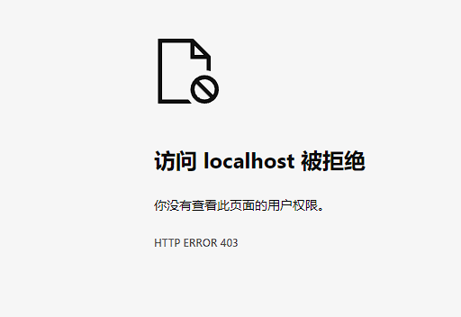


http://localhost:10010/user/1?authorization=123


http://localhost:10010/user/1?authorization=admin


http://localhost:10010/user/1?authorization1=admin


## 过滤器执行顺序


* 每一个过滤器都必须指定一个int类型的order值，order值越小，优先级越高，执行顺序越靠前。
* GlobalFilter通过实现Ordered接口，或者添加@Order注解来指定order值，由我们自己指定
* 路由过滤器和defaultFilter的order由Spring指定，默认是按照声明顺序从1递增
* 当过滤器的order值一样时，会按照 defaultFilter > 路由过滤器 > GlobalFilter的顺序执行


## 跨域问题

跨域：域名不一致就是跨域

* 域名不同
* 域名相同，端口不同

跨域问题：浏览器禁止请求的发起者与服务端发生跨域ajax请求，请求被浏览器拦截的问题


网关处理跨域采用的同样是CORS方案，并且只需要简单配置即可实现：


```yaml
# gateway 网关配置文件

spring:
  application:
    name: gateway


  cloud:
    nacos:
        discovery:
          # nacos 服务端地址
          server-addr: localhost:8848
          # 配置集群名称，也就是机房位置
          # cluster-name: HZ
          # namespace: 5544c4b1-2899-4915-94af-f9940c01c2b9
          # 是否为临时实例，true为临时实例
          ephemeral: false

    # 网关配置
    gateway:
      # 网关路由配置，list集合
      routes:
          # 路由的id，唯一
        - id: user-service
          # 路由的目标地址 lb就是负载均衡，后面跟服务名称
          uri: lb://userservice
          # 路由断言，也就是判断请求是否符合路由规则的条件，list集合
          predicates:
              # 按照路径匹配，只要以/user开头就符合要求
            - Path=/user/**
          # 路由过滤器，list集合
          filters:
              # 添加请求头
            #- AddRequestHeader=key1,value1

      # 默认过滤器，会对所有的路由请求都生效，list集合
      default-filters:
        # 添加请求头
        - AddRequestHeader=key1,value1


      # 全局的跨域处理
      globalcors:
        # 解决options请求被拦截问题
        add-to-simple-url-handler-mapping: true
        cors-configurations:
          '[/**]':
            # 允许哪些网站的跨域请求
            allowedOrigins:
              - "http://localhost:8080"
              - "http://localhost:8082"
            # 允许的跨域ajax的请求方式
            allowedMethods:
              - "GET"
              - "POST"
              - "DELETE"
              - "PUT"
              - "OPTIONS"
            # 允许在请求中携带的头信息
            allowedHeaders: "*"
            # 是否允许携带cookie
            allowCredentials: true
            # 这次跨域检测的有效期
            maxAge: 30000


server:
  port: 10010


# 设置日志级别，root表示根节点，即整体应用日志级别
logging:
  # 日志输出到文件的文件名
  file:
    name: gateway.log
  # 设置日志组
  group:
    # 自定义组名，设置当前组中所包含的包
    mao_pro: mao
  level:
    root: info
    # 为对应组设置日志级别
    mao_pro: debug
    # 日志输出格式
  # pattern:
  # console: "%d %clr(%p) --- [%16t] %clr(%-40.40c){cyan} : %m %n"
```


## 验证跨域问题


### 1. 创建新模块


名字为ajax


### 2. 整理pom文件


设置为此项目为spring_cloud_demo的子工程


spring_cloud_demo：

```xml
<?xml version="1.0" encoding="UTF-8"?>
<project xmlns="http://maven.apache.org/POM/4.0.0"
         xmlns:xsi="http://www.w3.org/2001/XMLSchema-instance"
         xsi:schemaLocation="http://maven.apache.org/POM/4.0.0 http://maven.apache.org/xsd/maven-4.0.0.xsd">
    <modelVersion>4.0.0</modelVersion>
    <!--
      -maven项目核心配置文件-
    Project name(项目名称)：spring_cloud_demo_Gateway
    Author(作者）: mao
    Author QQ：1296193245
    GitHub：https://github.com/maomao124/
    Date(创建日期)： 2022/7/18
    Time(创建时间)： 12:41
    -->
    <groupId>mao</groupId>
    <artifactId>spring_cloud_demo</artifactId>
    <packaging>pom</packaging>
    <version>0.0.1</version>

    <parent>
        <groupId>org.springframework.boot</groupId>
        <artifactId>spring-boot-starter-parent</artifactId>
        <version>2.3.9.RELEASE</version>
        <relativePath/> <!-- lookup parent from repository -->
    </parent>

    <properties>
        <project.build.sourceEncoding>UTF-8</project.build.sourceEncoding>
        <project.reporting.outputEncoding>UTF-8</project.reporting.outputEncoding>
        <java.version>11</java.version>
    </properties>

    <modules>
        <module>user_service</module>
        <module>order_service</module>
        <module>eureka_server</module>
        <module>feign_api</module>
        <module>gateway</module>
        <module>ajax</module>
    </modules>


    <dependencyManagement>
        <dependencies>
            <!--spring-cloud项目依赖-->
            <dependency>
                <groupId>org.springframework.cloud</groupId>
                <artifactId>spring-cloud-dependencies</artifactId>
                <version>Hoxton.SR10</version>
                <type>pom</type>
                <scope>import</scope>
            </dependency>

            <!--spring-boot druid连接池依赖-->
            <dependency>
                <groupId>com.alibaba</groupId>
                <artifactId>druid-spring-boot-starter</artifactId>
                <version>1.2.8</version>
            </dependency>

            <!--mysql依赖 spring-boot-->
            <dependency>
                <groupId>mysql</groupId>
                <artifactId>mysql-connector-java</artifactId>
                <version>8.0.27</version>
                <scope>runtime</scope>
            </dependency>

            <!--spring-boot mybatis依赖-->
            <dependency>
                <groupId>org.mybatis.spring.boot</groupId>
                <artifactId>mybatis-spring-boot-starter</artifactId>
                <version>2.2.2</version>
            </dependency>

            <!--spring-cloud-alilbaba管理依赖-->
            <dependency>
                <groupId>com.alibaba.cloud</groupId>
                <artifactId>spring-cloud-alibaba-dependencies</artifactId>
                <version>2.2.6.RELEASE</version>
                <type>pom</type>
                <scope>import</scope>
            </dependency>

        </dependencies>
    </dependencyManagement>


    <dependencies>
        <!--spring-boot lombok-->
        <dependency>
            <groupId>org.projectlombok</groupId>
            <artifactId>lombok</artifactId>
            <version>1.18.20</version>
            <optional>true</optional>
        </dependency>
    </dependencies>

</project>
```


ajax：

```xml
<?xml version="1.0" encoding="UTF-8"?>
<project xmlns="http://maven.apache.org/POM/4.0.0" xmlns:xsi="http://www.w3.org/2001/XMLSchema-instance"
         xsi:schemaLocation="http://maven.apache.org/POM/4.0.0 https://maven.apache.org/xsd/maven-4.0.0.xsd">
    <modelVersion>4.0.0</modelVersion>


    <parent>
        <groupId>mao</groupId>
        <artifactId>spring_cloud_demo</artifactId>
        <version>0.0.1</version>
        <relativePath>../pom.xml</relativePath>
    </parent>


    <artifactId>ajax</artifactId>
    <version>0.0.1</version>
    <name>ajax</name>
    <description>ajax</description>


    <properties>
        <java.version>11</java.version>
    </properties>


    <dependencies>

        <dependency>
            <groupId>org.springframework.boot</groupId>
            <artifactId>spring-boot-starter-web</artifactId>
        </dependency>

    </dependencies>

    <build>
        <plugins>
            <plugin>
                <groupId>org.springframework.boot</groupId>
                <artifactId>spring-boot-maven-plugin</artifactId>
            </plugin>
        </plugins>
    </build>

</project>
```


### 3. 更改配置文件格式


更改为yml格式


### 4. 编写配置


```yaml
server:
  port: 8093
```


### 5. 编写前端代码


```html
<!DOCTYPE html>

<!--
Project name(项目名称)：spring_cloud_demo_Gateway
  File name(文件名): index
  Authors(作者）: mao
  Author QQ：1296193245
  GitHub：https://github.com/maomao124/
  Date(创建日期)： 2022/7/18
  Time(创建时间)： 19:26
  Description(描述)： 无
-->

<html lang="en">
<head>
    <meta charset="UTF-8">
    <title>网关跨域问题测试</title>
    <style>
        body {
            background-color: skyblue;
            font-size: 1.4em;
        }

        #button {
            width: 235px;
            height: 50px;
            background-color: orchid;
        }

        #textarea {
            width: 700px;
            height: 100px;
            background-color: lightblue;
            color: slateblue;
            font-size: 1.4em;

        }

        #number {
            font-size: 1.4em;
            background-color: pink;
        }
    </style>
</head>
<body>

<br>
<label>请求的ID
    <input id="number" type="number" min="0" max="100" step="1" value="1">
</label>
<br>
<br>

<button id="button" onclick="get()">点击发送ajax请求</button>

<br>
<br>
<br>

<label for="textarea">响应结果:<br></label><textarea id="textarea">无</textarea>

</body>

<script>

    var textarea = document.getElementById("textarea")
    var number = document.getElementById("number")

    function get()
    {
        console.log("发起ajax请求")

        //XMLHttpRequest对象
        let xhr;
        //是否正在发送请求
        let isSending = false;

        //如果正在发送请求
        if (isSending === true)
        {
            //取消正在发送的请求
            xhr.abort();
        }

        //发起异步请求
        xhr = new XMLHttpRequest();
        //设置响应信息为json
        xhr.responseType = "json";
        //超时设置，单位为毫秒
        xhr.timeout = 5000;
        //超时的回调函数
        xhr.ontimeout = function ()
        {
            alert("请求超时，请稍后再试！");
        }
        //初始化，设置请求方式和url
        xhr.open("get", "http://localhost:10010/user/"+number.value+"?authorization=admin");
        //设置状态为正在发送
        isSending = true;
        //发送异步请求
        xhr.send();

        xhr.onreadystatechange = function ()
        {
            //状态为4时处理
            if (xhr.readyState === 4)
            {
                //落在200-300之间处理
                if (xhr.status >= 200 && xhr.status < 300)
                {
                    //将状态设置成false
                    isSending = false;
                    console.log(xhr.response);
                    textarea.innerHTML = JSON.stringify(xhr.response);

                }
                else
                {
                    alert("出现异常！状态码：" + xhr.status);
                }
            }
        }
    }

    function ajaxByAxios()
    {
        //axios发起ajax请求
        axios({
            //请求的方式：
            method: "get",
            //请求的url:
            url: "http://localhost:10010/user/1?authorization=admin",
            //url参数：
            params:
                {},
            //头信息：
            headers:
                {},
            //请求体参数：
            data:
                {},
        }).then(response =>
        {
            console.log(response);

        }).catch(error =>
        {
            //console.log(error);
            alert("网络异常！");
        })
    }

    function ajaxByJQuery()
    {

        //发起ajax请求
        $.ajax(
            {
                //请求的url：
                url: "http://localhost:10010/user/1?authorization=admin",
                //参数：
                data:
                    {},
                //请求类型：
                type: "get",
                //响应的数据类型：
                dataType: "json",
                //请求成功的回调函数：
                success: function (data)
                {
                    console.log(data);

                },
                //请求失败的回调函数：
                error: function ()
                {
                    alert("网络错误！请稍后再试！");
                },
                //设置超时时间：
                timeout: 2000,
                //头信息：
                headers:
                    {},
            }
        )
    }


</script>
</html>
```


### 6. 更改配置


端口号设置成8093，网关需要放行


网关配置：

```yaml
# gateway 网关配置文件

spring:
  application:
    name: gateway


  cloud:
    nacos:
        discovery:
          # nacos 服务端地址
          server-addr: localhost:8848
          # 配置集群名称，也就是机房位置
          # cluster-name: HZ
          # namespace: 5544c4b1-2899-4915-94af-f9940c01c2b9
          # 是否为临时实例，true为临时实例
          ephemeral: false

    # 网关配置
    gateway:
      # 网关路由配置，list集合
      routes:
          # 路由的id，唯一
        - id: user-service
          # 路由的目标地址 lb就是负载均衡，后面跟服务名称
          uri: lb://userservice
          # 路由断言，也就是判断请求是否符合路由规则的条件，list集合
          predicates:
              # 按照路径匹配，只要以/user开头就符合要求
            - Path=/user/**
          # 路由过滤器，list集合
          filters:
              # 添加请求头
            #- AddRequestHeader=key1,value1

      # 默认过滤器，会对所有的路由请求都生效，list集合
      default-filters:
        # 添加请求头
        - AddRequestHeader=key1,value1


      # 全局的跨域处理
      globalcors:
        # 解决options请求被拦截问题
        add-to-simple-url-handler-mapping: true
        cors-configurations:
          '[/**]':
            # 允许哪些网站的跨域请求
            allowedOrigins:
              - "http://localhost:8080"
              - "http://localhost:8082"
              - "http://localhost:8093"
            # 允许的跨域ajax的请求方式
            allowedMethods:
              - "GET"
              - "POST"
              - "DELETE"
              - "PUT"
              - "OPTIONS"
            # 允许在请求中携带的头信息
            allowedHeaders: "*"
            # 是否允许携带cookie
            allowCredentials: true
            # 这次跨域检测的有效期
            maxAge: 30000


server:
  port: 10010


# 设置日志级别，root表示根节点，即整体应用日志级别
logging:
  # 日志输出到文件的文件名
  file:
    name: gateway.log
  # 设置日志组
  group:
    # 自定义组名，设置当前组中所包含的包
    mao_pro: mao
  level:
    root: info
    # 为对应组设置日志级别
    mao_pro: debug
    # 日志输出格式
  # pattern:
  # console: "%d %clr(%p) --- [%16t] %clr(%-40.40c){cyan} : %m %n"
```


重启网关


### 7. 启动


### 8. 访问8093


http://localhost:8093/


### 9. 发起ajax请求


能正常访问


### 10. 修改网关配置


取消get请求的访问


```yaml
# gateway 网关配置文件

spring:
  application:
    name: gateway


  cloud:
    nacos:
        discovery:
          # nacos 服务端地址
          server-addr: localhost:8848
          # 配置集群名称，也就是机房位置
          # cluster-name: HZ
          # namespace: 5544c4b1-2899-4915-94af-f9940c01c2b9
          # 是否为临时实例，true为临时实例
          ephemeral: false

    # 网关配置
    gateway:
      # 网关路由配置，list集合
      routes:
          # 路由的id，唯一
        - id: user-service
          # 路由的目标地址 lb就是负载均衡，后面跟服务名称
          uri: lb://userservice
          # 路由断言，也就是判断请求是否符合路由规则的条件，list集合
          predicates:
              # 按照路径匹配，只要以/user开头就符合要求
            - Path=/user/**
          # 路由过滤器，list集合
          filters:
              # 添加请求头
            #- AddRequestHeader=key1,value1

      # 默认过滤器，会对所有的路由请求都生效，list集合
      default-filters:
        # 添加请求头
        - AddRequestHeader=key1,value1


      # 全局的跨域处理
      globalcors:
        # 解决options请求被拦截问题
        add-to-simple-url-handler-mapping: true
        cors-configurations:
          '[/**]':
            # 允许哪些网站的跨域请求
            allowedOrigins:
              - "http://localhost:8080"
              - "http://localhost:8082"
              - "http://localhost:8093"
            # 允许的跨域ajax的请求方式
            allowedMethods:
              #- "GET"
              - "POST"
              - "DELETE"
              - "PUT"
              - "OPTIONS"
            # 允许在请求中携带的头信息
            allowedHeaders: "*"
            # 是否允许携带cookie
            allowCredentials: true
            # 这次跨域检测的有效期
            maxAge: 30000


server:
  port: 10010


# 设置日志级别，root表示根节点，即整体应用日志级别
logging:
  # 日志输出到文件的文件名
  file:
    name: gateway.log
  # 设置日志组
  group:
    # 自定义组名，设置当前组中所包含的包
    mao_pro: mao
  level:
    root: info
    # 为对应组设置日志级别
    mao_pro: debug
    # 日志输出格式
  # pattern:
  # console: "%d %clr(%p) --- [%16t] %clr(%-40.40c){cyan} : %m %n"
```


### 11. 重启网关


### 12. 访问

http://localhost:8093/


### 13. 发起ajax请求


无法正常访问


### 14. 再次更改网关配置


打开get请求的访问

取消此ip和端口号的访问


```yaml
# gateway 网关配置文件

spring:
  application:
    name: gateway


  cloud:
    nacos:
        discovery:
          # nacos 服务端地址
          server-addr: localhost:8848
          # 配置集群名称，也就是机房位置
          # cluster-name: HZ
          # namespace: 5544c4b1-2899-4915-94af-f9940c01c2b9
          # 是否为临时实例，true为临时实例
          ephemeral: false

    # 网关配置
    gateway:
      # 网关路由配置，list集合
      routes:
          # 路由的id，唯一
        - id: user-service
          # 路由的目标地址 lb就是负载均衡，后面跟服务名称
          uri: lb://userservice
          # 路由断言，也就是判断请求是否符合路由规则的条件，list集合
          predicates:
              # 按照路径匹配，只要以/user开头就符合要求
            - Path=/user/**
          # 路由过滤器，list集合
          filters:
              # 添加请求头
            #- AddRequestHeader=key1,value1

      # 默认过滤器，会对所有的路由请求都生效，list集合
      default-filters:
        # 添加请求头
        - AddRequestHeader=key1,value1


      # 全局的跨域处理
      globalcors:
        # 解决options请求被拦截问题
        add-to-simple-url-handler-mapping: true
        cors-configurations:
          '[/**]':
            # 允许哪些网站的跨域请求
            allowedOrigins:
              - "http://localhost:8080"
              - "http://localhost:8082"
              #- "http://localhost:8093"
            # 允许的跨域ajax的请求方式
            allowedMethods:
              - "GET"
              - "POST"
              - "DELETE"
              - "PUT"
              - "OPTIONS"
            # 允许在请求中携带的头信息
            allowedHeaders: "*"
            # 是否允许携带cookie
            allowCredentials: true
            # 这次跨域检测的有效期
            maxAge: 30000


server:
  port: 10010


# 设置日志级别，root表示根节点，即整体应用日志级别
logging:
  # 日志输出到文件的文件名
  file:
    name: gateway.log
  # 设置日志组
  group:
    # 自定义组名，设置当前组中所包含的包
    mao_pro: mao
  level:
    root: info
    # 为对应组设置日志级别
    mao_pro: debug
    # 日志输出格式
  # pattern:
  # console: "%d %clr(%p) --- [%16t] %clr(%-40.40c){cyan} : %m %n"
```


### 15. 重启网关


### 16. 访问

http://localhost:8093/


### 17. 发起ajax请求


不能访问


### 18. 调回初始状态，重启网关


```yaml
# gateway 网关配置文件

spring:
  application:
    name: gateway


  cloud:
    nacos:
        discovery:
          # nacos 服务端地址
          server-addr: localhost:8848
          # 配置集群名称，也就是机房位置
          # cluster-name: HZ
          # namespace: 5544c4b1-2899-4915-94af-f9940c01c2b9
          # 是否为临时实例，true为临时实例
          ephemeral: false

    # 网关配置
    gateway:
      # 网关路由配置，list集合
      routes:
          # 路由的id，唯一
        - id: user-service
          # 路由的目标地址 lb就是负载均衡，后面跟服务名称
          uri: lb://userservice
          # 路由断言，也就是判断请求是否符合路由规则的条件，list集合
          predicates:
              # 按照路径匹配，只要以/user开头就符合要求
            - Path=/user/**
          # 路由过滤器，list集合
          filters:
              # 添加请求头
            #- AddRequestHeader=key1,value1

      # 默认过滤器，会对所有的路由请求都生效，list集合
      default-filters:
        # 添加请求头
        - AddRequestHeader=key1,value1


      # 全局的跨域处理
      globalcors:
        # 解决options请求被拦截问题
        add-to-simple-url-handler-mapping: true
        cors-configurations:
          '[/**]':
            # 允许哪些网站的跨域请求
            allowedOrigins:
              - "http://localhost:8080"
              - "http://localhost:8082"
              - "http://localhost:8093"
            # 允许的跨域ajax的请求方式
            allowedMethods:
              - "GET"
              - "POST"
              - "DELETE"
              - "PUT"
              - "OPTIONS"
            # 允许在请求中携带的头信息
            allowedHeaders: "*"
            # 是否允许携带cookie
            allowCredentials: true
            # 这次跨域检测的有效期
            maxAge: 30000


server:
  port: 10010


# 设置日志级别，root表示根节点，即整体应用日志级别
logging:
  # 日志输出到文件的文件名
  file:
    name: gateway.log
  # 设置日志组
  group:
    # 自定义组名，设置当前组中所包含的包
    mao_pro: mao
  level:
    root: info
    # 为对应组设置日志级别
    mao_pro: debug
    # 日志输出格式
  # pattern:
  # console: "%d %clr(%p) --- [%16t] %clr(%-40.40c){cyan} : %m %n"
```


### 19. 访问


http://localhost:8093/


### 20. 发起ajax请求


可以正常访问


## 项目地址

https://github.com/maomao124/spring_cloud_demo_Gateway.git/


# Docker

## 学习笔记地址


https://github.com/maomao124/Docker_studyNotes.git


## 项目地址


https://github.com/maomao124?tab=repositories&q=docker&type=&language=&sort=


# rabbitMQ

## 项目地址


https://github.com/maomao124?tab=repositories&q=rabbitMQ&type=&language=&sort=


# Elasticsearch

## 学习笔记地址


https://github.com/maomao124/elasticsearch_studyNotes


## 项目地址


https://github.com/maomao124?tab=repositories&q=Elasticsearch&type=&language=&sort=


# 微服务保护Sentinel


## 雪崩问题

微服务调用链路中的某个服务故障，引起整个链路中的所有微服务都不可用，这就是雪崩。


解决雪崩问题的常见方式有四种：

* 超时处理：设定超时时间，请求超过一定时间没有响应就返回错误信息，不会无休止等待
* 舱壁模式：限定每个业务能使用的线程数，避免耗尽整个tomcat的资源，因此也叫线程隔离。
* 熔断降级：由**断路器**统计业务执行的异常比例，如果超出阈值则会**熔断**该业务，拦截访问该业务的一切请求。
* 流量控制：限制业务访问的QPS，避免服务因流量的突增而故障。


超时处理：


舱壁模式：


熔断降级：

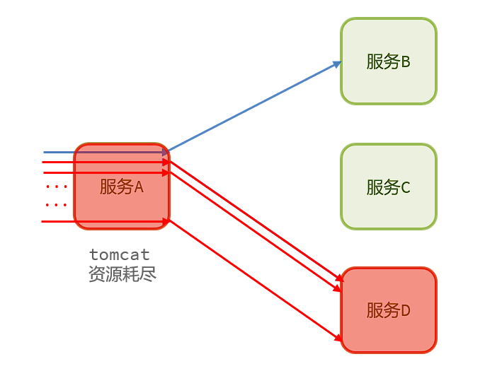


## 服务保护技术


|                |                  **Sentinel**                  |          **Hystrix**          |
| :------------: | :--------------------------------------------: | :---------------------------: |
|    隔离策略    |                   信号量隔离                   |     线程池隔离/信号量隔离     |
|  熔断降级策略  |            基于慢调用比例或异常比例            |         基于失败比率          |
|  实时指标实现  |                    滑动窗口                    |    滑动窗口（基于 RxJava）    |
|    规则配置    |                 支持多种数据源                 |        支持多种数据源         |
|     扩展性     |                   多个扩展点                   |          插件的形式           |
| 基于注解的支持 |                      支持                      |             支持              |
|      限流      |        基于 QPS，支持基于调用关系的限流        |          有限的支持           |
|    流量整形    |            支持慢启动、匀速排队模式            |            不支持             |
| 系统自适应保护 |                      支持                      |            不支持             |
|     控制台     | 开箱即用，可配置规则、查看秒级监控、机器发现等 |            不完善             |
| 常见框架的适配 |     Servlet、Spring Cloud、Dubbo、gRPC  等     | Servlet、Spring Cloud Netflix |


## Sentinel是什么

Sentinel是阿里巴巴开源的一款微服务流量控制组件。

Sentinel 是面向分布式、多语言异构化服务架构的流量治理组件，主要以流量为切入点，从流量控制、流量路由、熔断降级、系统自适应保护等多个维度来帮助用户保障微服务的稳定性。

官网地址：https://sentinelguard.io/zh-cn/index.html


## 特点

* **丰富的应用场景**：Sentinel 承接了阿里巴巴近 10 年的双十一大促流量的核心场景，例如秒杀（即突发流量控制在系统容量可以承受的范围）、消息削峰填谷、集群流量控制、实时熔断下游不可用应用等。

* **完备的实时监控**：Sentinel 同时提供实时的监控功能。您可以在控制台中看到接入应用的单台机器秒级数据，甚至 500 台以下规模的集群的汇总运行情况。

* **广泛的开源生态**：Sentinel 提供开箱即用的与其它开源框架/库的整合模块，例如与 Spring Cloud、Dubbo、gRPC 的整合。您只需要引入相应的依赖并进行简单的配置即可快速地接入 Sentinel。

* **完善的** **SPI** **扩展点**：Sentinel 提供简单易用、完善的 SPI 扩展接口。您可以通过实现扩展接口来快速地定制逻辑。例如定制规则管理、适配动态数据源等。


## 安装Sentinel控制台


下载

https://github.com/alibaba/Sentinel/releases


运行命令：

```sh
java -jar xxx.jar
```


|            **配置项**            | **默认值** |  **说明**  |
| :------------------------------: | :--------: | :--------: |
|           server.port            |    8080    |  服务端口  |
| sentinel.dashboard.auth.username |  sentinel  | 默认用户名 |
| sentinel.dashboard.auth.password |  sentinel  |  默认密码  |


启动：

```sh
INFO: Sentinel log output type is: file
INFO: Sentinel log charset is: utf-8
INFO: Sentinel log base directory is: C:\Users\mao\logs\csp\
INFO: Sentinel log name use pid is: false
INFO: Sentinel log level is: INFO

  .   ____          _            __ _ _
 /\\ / ___'_ __ _ _(_)_ __  __ _ \ \ \ \
( ( )\___ | '_ | '_| | '_ \/ _` | \ \ \ \
 \\/  ___)| |_)| | | | | || (_| |  ) ) ) )
  '  |____| .__|_| |_|_| |_\__, | / / / /
 =========|_|==============|___/=/_/_/_/
 :: Spring Boot ::               (v2.5.12)

2022-07-19 13:23:56.904  INFO 1308 --- [           main] c.a.c.s.dashboard.DashboardApplication   : Starting DashboardApplication using Java 16.0.2 on mao with PID 1308 (C:\Users\mao\Desktop\sentinel-dashboard-1.8.4.jar started by mao in C:\Users\mao\Desktop)
2022-07-19 13:23:56.907  INFO 1308 --- [           main] c.a.c.s.dashboard.DashboardApplication   : No active profile set, falling back to 1 default profile: "default"
2022-07-19 13:23:58.076  INFO 1308 --- [           main] o.s.b.w.embedded.tomcat.TomcatWebServer  : Tomcat initialized with port(s): 8080 (http)
2022-07-19 13:23:58.086  INFO 1308 --- [           main] o.apache.catalina.core.StandardService   : Starting service [Tomcat]
2022-07-19 13:23:58.087  INFO 1308 --- [           main] org.apache.catalina.core.StandardEngine  : Starting Servlet engine: [Apache Tomcat/9.0.60]
2022-07-19 13:23:58.175  INFO 1308 --- [           main] o.a.c.c.C.[Tomcat].[localhost].[/]       : Initializing Spring embedded WebApplicationContext
2022-07-19 13:23:58.175  INFO 1308 --- [           main] w.s.c.ServletWebServerApplicationContext : Root WebApplicationContext: initialization completed in 1209 ms
2022-07-19 13:23:58.242  INFO 1308 --- [           main] c.a.c.s.dashboard.config.WebConfig       : Sentinel servlet CommonFilter registered
2022-07-19 13:23:58.934  INFO 1308 --- [           main] o.s.b.w.embedded.tomcat.TomcatWebServer  : Tomcat started on port(s): 8080 (http) with context path ''
2022-07-19 13:23:58.945  INFO 1308 --- [           main] c.a.c.s.dashboard.DashboardApplication   : Started DashboardApplication in 2.508 seconds (JVM running for 2.991)
```


如果需要修改配置，可以打开jar包修改application.properties

```properties
#spring settings
spring.http.encoding.force=true
spring.http.encoding.charset=UTF-8
spring.http.encoding.enabled=true

#cookie name setting
server.servlet.session.cookie.name=sentinel_dashboard_cookie

#logging settings
logging.level.org.springframework.web=INFO
logging.file=${user.home}/logs/csp/sentinel-dashboard.log
logging.pattern.file= %d{yyyy-MM-dd HH:mm:ss} [%thread] %-5level %logger{36} - %msg%n
#logging.pattern.console= %d{yyyy-MM-dd HH:mm:ss} [%thread] %-5level %logger{36} - %msg%n

#auth settings
auth.filter.exclude-urls=/,/auth/login,/auth/logout,/registry/machine,/version
auth.filter.exclude-url-suffixes=htm,html,js,css,map,ico,ttf,woff,png
# If auth.enabled=false, Sentinel console disable login
auth.username=sentinel
auth.password=sentinel

# Inject the dashboard version. It's required to enable
# filtering in pom.xml for this resource file.
sentinel.dashboard.version=1.8.4

server.port=8099
```


访问


## 微服务整合Sentinel


### 1. 创建项目

使用原来的项目或者创建新项目然后复制原来的项目内容到新项目


### 2. 导入依赖

在order_service导入Sentinel的依赖


```xml
        <!--sentinel 依赖-->
        <dependency>
            <groupId>com.alibaba.cloud</groupId>
            <artifactId>spring-cloud-starter-alibaba-sentinel</artifactId>
        </dependency>
```


全部：

```xml
<?xml version="1.0" encoding="UTF-8"?>
<project xmlns="http://maven.apache.org/POM/4.0.0" xmlns:xsi="http://www.w3.org/2001/XMLSchema-instance"
         xsi:schemaLocation="http://maven.apache.org/POM/4.0.0 https://maven.apache.org/xsd/maven-4.0.0.xsd">
    <modelVersion>4.0.0</modelVersion>

    <parent>
        <groupId>mao</groupId>
        <artifactId>spring_cloud_demo</artifactId>
        <version>0.0.1</version>
        <relativePath>../pom.xml</relativePath> <!-- lookup parent from repository -->
    </parent>

    <artifactId>order_service</artifactId>
    <version>0.0.1</version>
    <name>order_service</name>
    <description>order_service</description>

    <properties>
        <java.version>11</java.version>
    </properties>

    <dependencies>

        <dependency>
            <groupId>org.springframework.boot</groupId>
            <artifactId>spring-boot-starter-web</artifactId>
        </dependency>

        <!--mysql依赖 spring-boot-->
        <dependency>
            <groupId>mysql</groupId>
            <artifactId>mysql-connector-java</artifactId>
        </dependency>

        <!--spring-boot druid连接池依赖-->
        <dependency>
            <groupId>com.alibaba</groupId>
            <artifactId>druid-spring-boot-starter</artifactId>
        </dependency>

        <!--spring-boot mybatis依赖-->
        <dependency>
            <groupId>org.mybatis.spring.boot</groupId>
            <artifactId>mybatis-spring-boot-starter</artifactId>
        </dependency>

        <dependency>
            <groupId>org.springframework.boot</groupId>
            <artifactId>spring-boot-starter-test</artifactId>
            <scope>test</scope>
        </dependency>

        <!--eureka-client 依赖-->
        <!--<dependency>
            <groupId>org.springframework.cloud</groupId>
            <artifactId>spring-cloud-starter-netflix-eureka-client</artifactId>
        </dependency>-->

        <!-- nacos 客户端依赖 -->
        <dependency>
            <groupId>com.alibaba.cloud</groupId>
            <artifactId>spring-cloud-starter-alibaba-nacos-discovery</artifactId>
        </dependency>

        <!--feign 依赖-->
        <dependency>
            <groupId>org.springframework.cloud</groupId>
            <artifactId>spring-cloud-starter-openfeign</artifactId>
        </dependency>

        <!--httpClient的依赖 主要用于feign连接池-->
        <dependency>
            <groupId>io.github.openfeign</groupId>
            <artifactId>feign-httpclient</artifactId>
        </dependency>

        <!--feign_api 依赖-->
        <dependency>
            <groupId>mao</groupId>
            <artifactId>feign_api</artifactId>
            <version>0.0.1</version>
        </dependency>

        <!--sentinel 依赖-->
        <dependency>
            <groupId>com.alibaba.cloud</groupId>
            <artifactId>spring-cloud-starter-alibaba-sentinel</artifactId>
        </dependency>


    </dependencies>

    <build>
        <plugins>
            <plugin>
                <groupId>org.springframework.boot</groupId>
                <artifactId>spring-boot-maven-plugin</artifactId>
            </plugin>
        </plugins>
    </build>

</project>
```


### 3. 编写配置


配置sentinel控制台地址


```yaml
# order 业务 配置文件

spring:


  # 配置数据源
  datasource:

    druid:
      driver-class-name: com.mysql.cj.jdbc.Driver
      url: jdbc:mysql://localhost:3306/cloud_order
      username: root
      password: 20010713


  application:
    name: orderservice

#eureka:
#  client:
#    service-url:
#      defaultZone: http://127.0.0.1:10080/eureka/


  cloud:
    nacos:
      discovery:
        # nacos 服务端地址
        server-addr: localhost:8848
        # 配置集群名称，也就是机房位置
        cluster-name: HZ
        # namespace: 5544c4b1-2899-4915-94af-f9940c01c2b9
        # 是否为临时实例，true为临时实例
        ephemeral: false


    sentinel:
      transport:
        dashboard: localhost:8099


# 负载均衡
#userservice:
#  ribbon:
#    # 负载均衡规则
#    NFLoadBalancerRuleClassName: com.alibaba.cloud.nacos.ribbon.NacosRule


# 开启debug模式，输出调试信息，常用于检查系统运行状况
#debug: true

# 设置日志级别，root表示根节点，即整体应用日志级别
logging:
 # 日志输出到文件的文件名
  file:
     name: order_server.log
  # 设置日志组
  group:
  # 自定义组名，设置当前组中所包含的包
    mao_pro: mao
  level:
    root: info
    # 为对应组设置日志级别
    mao_pro: debug
    # 日志输出格式
# pattern:
  # console: "%d %clr(%p) --- [%16t] %clr(%-40.40c){cyan} : %m %n"


# 配置负载均衡规则
#userservice:
#  ribbon:
#    NFLoadBalancerRuleClassName: com.netflix.loadbalancer.RandomRule


ribbon:
  eager-load:
    # 开启饥饿加载
    enabled: true
    # 指定对 userservice 这个服务饥饿加载
    clients: userservice


server:
  port: 8081


mybatis:
  type-aliases-package: mao.order_service
  configuration:
    map-underscore-to-camel-case: true


feign:
  # 配置连接池
  httpclient:
    # 开启feign对HttpClient的支持
    enabled: true
    # 最大的连接数
    max-connections: 200
    # 每个路径的最大连接数
    max-connections-per-route: 50

  client:
    config:
      # default是全局配置，如果是写服务名称，则是针对某个微服务的配置
      default:
         #日志级别，包含四种不同的级别：NONE、BASIC、HEADERS、FULL
        loggerLevel: FULL
        # 连接超时时间
        #connectTimeout:
        # 响应结果的解析器，http远程调用的结果做解析，例如解析json字符串为java对象
        #decoder:
        # 请求参数编码，将请求参数编码，便于通过http请求发送
        #encoder:
        # 支持的注解格式，默认是SpringMVC的注解
        #contract:
        # 失败重试机制，请求失败的重试机制，默认是没有，不过会使用Ribbon的重试
        #retryer:
```


### 4. 启动


```sh
PS H:\opensoft\nacos\bin> ./startup.cmd -m standalone
"nacos is starting with standalone"

         ,--.
       ,--.'|
   ,--,:  : |                                           Nacos 1.4.3
,`--.'`|  ' :                       ,---.               Running in stand alone mode, All function modules
|   :  :  | |                      '   ,'\   .--.--.    Port: 8848
:   |   \ | :  ,--.--.     ,---.  /   /   | /  /    '   Pid: 14216
|   : '  '; | /       \   /     \.   ; ,. :|  :  /`./   Console: http://192.168.202.1:8848/nacos/index.html
'   ' ;.    ;.--.  .-. | /    / ''   | |: :|  :  ;_
|   | | \   | \__\/: . ..    ' / '   | .; : \  \    `.      https://nacos.io
'   : |  ; .' ," .--.; |'   ; :__|   :    |  `----.   \
|   | '`--'  /  /  ,.  |'   | '.'|\   \  /  /  /`--'  /
'   : |     ;  :   .'   \   :    : `----'  '--'.     /
;   |.'     |  ,     .-./\   \  /            `--'---'
'---'        `--`---'     `----'

2022-07-19 13:48:09,789 INFO Bean 'org.springframework.security.access.expression.method.DefaultMethodSecurityExpressionHandler@21d8bcbe' of type [org.springframework.security.access.expression.method.DefaultMethodSecurityExpressionHandler] is not eligible for getting processed by all BeanPostProcessors (for example: not eligible for auto-proxying)

2022-07-19 13:48:09,794 INFO Bean 'methodSecurityMetadataSource' of type [org.springframework.security.access.method.DelegatingMethodSecurityMetadataSource] is not eligible for getting processed by all BeanPostProcessors (for example: not eligible for auto-proxying)

2022-07-19 13:48:10,291 INFO Tomcat initialized with port(s): 8848 (http)

2022-07-19 13:48:10,695 INFO Root WebApplicationContext: initialization completed in 3395 ms

2022-07-19 13:48:15,516 INFO Initializing ExecutorService 'applicationTaskExecutor'

2022-07-19 13:48:15,707 INFO Adding welcome page: class path resource [static/index.html]

2022-07-19 13:48:16,128 INFO Creating filter chain: Ant [pattern='/**'], []

2022-07-19 13:48:16,161 INFO Creating filter chain: any request, [org.springframework.security.web.context.request.async.WebAsyncManagerIntegrationFilter@7bd96822, org.springframework.security.web.context.SecurityContextPersistenceFilter@2dbfcf7, org.springframework.security.web.header.HeaderWriterFilter@3178219a, org.springframework.security.web.csrf.CsrfFilter@3c66b7d8, org.springframework.security.web.authentication.logout.LogoutFilter@1b13467c, org.springframework.security.web.savedrequest.RequestCacheAwareFilter@38cedb7d, org.springframework.security.web.servletapi.SecurityContextHolderAwareRequestFilter@3f598450, org.springframework.security.web.authentication.AnonymousAuthenticationFilter@64dae3b7, org.springframework.security.web.session.SessionManagementFilter@56e9a474, org.springframework.security.web.access.ExceptionTranslationFilter@48a663e9]

2022-07-19 13:48:16,261 INFO Initializing ExecutorService 'taskScheduler'

2022-07-19 13:48:16,290 INFO Exposing 2 endpoint(s) beneath base path '/actuator'

2022-07-19 13:48:16,431 INFO Tomcat started on port(s): 8848 (http) with context path '/nacos'

2022-07-19 13:48:16,438 INFO Nacos started successfully in stand alone mode. use embedded storage
```


```sh
INFO: Sentinel log output type is: file
INFO: Sentinel log charset is: utf-8
INFO: Sentinel log base directory is: C:\Users\mao\logs\csp\
INFO: Sentinel log name use pid is: false
INFO: Sentinel log level is: INFO

  .   ____          _            __ _ _
 /\\ / ___'_ __ _ _(_)_ __  __ _ \ \ \ \
( ( )\___ | '_ | '_| | '_ \/ _` | \ \ \ \
 \\/  ___)| |_)| | | | | || (_| |  ) ) ) )
  '  |____| .__|_| |_|_| |_\__, | / / / /
 =========|_|==============|___/=/_/_/_/
 :: Spring Boot ::               (v2.5.12)

2022-07-19 13:47:45.524  INFO 13608 --- [           main] c.a.c.s.dashboard.DashboardApplication   : Starting DashboardApplication using Java 16.0.2 on mao with PID 13608 (H:\opensoft\Sentinel\sentinel-dashboard-1.8.4.jar started by mao in H:\opensoft\Sentinel)
2022-07-19 13:47:45.528  INFO 13608 --- [           main] c.a.c.s.dashboard.DashboardApplication   : No active profile set, falling back to 1 default profile: "default"
2022-07-19 13:47:46.697  INFO 13608 --- [           main] o.s.b.w.embedded.tomcat.TomcatWebServer  : Tomcat initialized with port(s): 8099 (http)
2022-07-19 13:47:46.708  INFO 13608 --- [           main] o.apache.catalina.core.StandardService   : Starting service [Tomcat]
2022-07-19 13:47:46.709  INFO 13608 --- [           main] org.apache.catalina.core.StandardEngine  : Starting Servlet engine: [Apache Tomcat/9.0.60]
2022-07-19 13:47:46.800  INFO 13608 --- [           main] o.a.c.c.C.[Tomcat].[localhost].[/]       : Initializing Spring embedded WebApplicationContext
2022-07-19 13:47:46.801  INFO 13608 --- [           main] w.s.c.ServletWebServerApplicationContext : Root WebApplicationContext: initialization completed in 1200 ms
2022-07-19 13:47:46.870  INFO 13608 --- [           main] c.a.c.s.dashboard.config.WebConfig       : Sentinel servlet CommonFilter registered
2022-07-19 13:47:47.522  INFO 13608 --- [           main] o.s.b.w.embedded.tomcat.TomcatWebServer  : Tomcat started on port(s): 8099 (http) with context path ''
2022-07-19 13:47:47.534  INFO 13608 --- [           main] c.a.c.s.dashboard.DashboardApplication   : Started DashboardApplication in 2.442 seconds (JVM running for 2.878)
```


**到这里我发现访问order_service服务的时候Sentinel控制台报错，去网上查找原因是因为我使用的是spring-cloud-alibaba-dependencies的2.2.6.RELEASE版本，Sentinel需要1.8.1版本，从网上下载1.8.1版本后启动就报错，查找原因是因为jdk的版本太高，导致无法启动，1.8.4版本能启动，但是不能使用。因为jdk版本问题，我需要更改环境变量的值，但是我不想更改，如果更改了环境变量，其它的大部分项目都不能运行了，因为类版本太高，要么降低Sentinel版本，要么调高spring-cloud-alibaba-dependencies版本。于是我找到了解决方案：**


### 5. 下载java8

有的可以跳过


https://www.java.com/zh-CN/download/


现在下载jdk8需要登录了

可以从idea下载


```sh
PS C:\Users\mao\.jdks\corretto-1.8.0_332> ls


    目录: C:\Users\mao\.jdks\corretto-1.8.0_332


Mode                 LastWriteTime         Length Name
----                 -------------         ------ ----
d-----         2022/7/19     15:08                bin
d-----         2022/7/19     15:08                demo
d-----         2022/7/19     15:08                include
d-----         2022/7/19     15:08                jre
d-----         2022/7/19     15:08                lib
d-----         2022/7/19     15:08                sample
-a----         2022/7/19     15:08           1522 ASSEMBLY_EXCEPTION
-a----         2022/7/19     15:08        6536378 javafx-src.zip
-a----         2022/7/19     15:08          19274 LICENSE
-a----         2022/7/19     15:08             94 release
-a----         2022/7/19     15:08       51752582 src.zip
-a----         2022/7/19     15:08         157063 THIRD_PARTY_README
-a----         2022/7/19     15:08             11 version.txt


PS C:\Users\mao\.jdks\corretto-1.8.0_332>
```


### 6. 拷贝jre到Sentinel所在的目录


```sh
PS H:\opensoft\Sentinel> ls


    目录: H:\opensoft\Sentinel


Mode                 LastWriteTime         Length Name
----                 -------------         ------ ----
d-----         2022/7/19     15:11                jre
d-----          2021/2/4     15:30                Sentinel-1.8.1
-a----         2022/7/19     14:36        2317315 Sentinel-1.8.1.7z
-a----         2022/7/19     13:32        2334227 Sentinel-1.8.4.7z
-a----         2022/7/19     14:03       21242700 sentinel-dashboard-1.8.1.jar
-a----         2022/7/19     13:28       22670011 sentinel-dashboard-1.8.4.jar
-a----         2022/7/19     14:27             88 运行.bat


PS H:\opensoft\Sentinel>
```


如果没有jre可以直接使用jdk也可以使用命令：

```sh
bin\jlink.exe --module-path jmods --add-modules java.desktop --output jre
pause
```


### 7. 编写脚本

名字为运行.bat

内容：

```sh
%~dp0\jre\bin\java -version
%~dp0\jre\bin\java -jar sentinel-dashboard-1.8.1.jar
pause
```


### 8. 双击运行


```sh
H:\opensoft\Sentinel>H:\opensoft\Sentinel\\jre\bin\java -version
openjdk version "1.8.0_332"
OpenJDK Runtime Environment Corretto-8.332.08.1 (build 1.8.0_332-b08)
OpenJDK 64-Bit Server VM Corretto-8.332.08.1 (build 25.332-b08, mixed mode)

H:\opensoft\Sentinel>H:\opensoft\Sentinel\\jre\bin\java -jar sentinel-dashboard-1.8.1.jar
INFO: Sentinel log output type is: file
INFO: Sentinel log charset is: utf-8
INFO: Sentinel log base directory is: C:\Users\mao\logs\csp\
INFO: Sentinel log name use pid is: false

  .   ____          _            __ _ _
 /\\ / ___'_ __ _ _(_)_ __  __ _ \ \ \ \
( ( )\___ | '_ | '_| | '_ \/ _` | \ \ \ \
 \\/  ___)| |_)| | | | | || (_| |  ) ) ) )
  '  |____| .__|_| |_|_| |_\__, | / / / /
 =========|_|==============|___/=/_/_/_/
 :: Spring Boot ::        (v2.0.5.RELEASE)

2022-07-19 15:13:55.346  INFO 14852 --- [           main] c.a.c.s.dashboard.DashboardApplication   : Starting DashboardApplication on mao with PID 14852 (H:\opensoft\Sentinel\sentinel-dashboard-1.8.1.jar started by mao in H:\opensoft\Sentinel)
2022-07-19 15:13:55.349  INFO 14852 --- [           main] c.a.c.s.dashboard.DashboardApplication   : No active profile set, falling back to default profiles: default
2022-07-19 15:13:55.388  INFO 14852 --- [           main] ConfigServletWebServerApplicationContext : Refreshing org.springframework.boot.web.servlet.context.AnnotationConfigServletWebServerApplicationContext@5ecddf8f: startup date [Tue Jul 19 15:13:55 CST 2022]; root of context hierarchy
2022-07-19 15:13:56.646  INFO 14852 --- [           main] o.s.b.w.embedded.tomcat.TomcatWebServer  : Tomcat initialized with port(s): 8099 (http)
2022-07-19 15:13:56.673  INFO 14852 --- [           main] o.apache.catalina.core.StandardService   : Starting service [Tomcat]
2022-07-19 15:13:56.673  INFO 14852 --- [           main] org.apache.catalina.core.StandardEngine  : Starting Servlet Engine: Apache Tomcat/8.5.34
2022-07-19 15:13:56.684  INFO 14852 --- [ost-startStop-1] o.a.catalina.core.AprLifecycleListener   : The APR based Apache Tomcat Native library which allows optimal performance in production environments was not found on the java.library.path: [H:\opensoft\Sentinel\jre\bin;C:\WINDOWS\Sun\Java\bin;C:\WINDOWS\system32;C:\WINDOWS;C:\Users\mao\.jdks\openjdk-16.0.2\bin;C:\Program Files (x86)\VMware\VMware Workstation\bin\;C:\Program Files\Microsoft MPI\Bin\;C:\WINDOWS\system32;C:\WINDOWS;C:\WINDOWS\System32\Wbem;C:\WINDOWS\System32\WindowsPowerShell\v1.0\;C:\WINDOWS\System32\OpenSSH\;C:\Program Files (x86)\NVIDIA Corporation\PhysX\Common;C:\Program Files\dotnet\;C:\WINDOWS\system32;C:\WINDOWS;C:\WINDOWS\System32\Wbem;C:\WINDOWS\System32\WindowsPowerShell\v1.0\;C:\WINDOWS\System32\OpenSSH\;C:\Program Files\Microsoft SQL Server\Client SDK\ODBC\170\Tools\Binn\;C:\Program Files (x86)\Microsoft SQL Server\150\Tools\Binn\;C:\Program Files\Microsoft SQL Server\150\Tools\Binn\;C:\Program Files\Microsoft SQL Server\150\DTS\Binn\;C:\Program Files (x86)\dotnet\;C:\Program Files\Microsoft SQL Server\130\Tools\Binn\;C:\Program Files (x86)\Microsoft SQL Server\150\DTS\Binn\;C:\Program Files\Azure Data Studio\bin;C:\Program Files\MySQL\MySQL Server 8.0\bin;C:\Program Files\redis;C:\Program Files\nodejs\;C:\ProgramData\chocolatey\bin;C:\Program Files\zookeeper\bin;C:\Program Files\JetBrains\IntelliJ IDEA 2021.2.2\plugins\maven\lib\maven3\bin;C:\Program Files\erl-24.1\bin;C:\Program Files\RabbitMQ Server\rabbitmq_server-3.9.14\bin;C:\Program Files\Git\bin;C:\Program Files\elasticsearch-8.1.3\bin;H:\opensoft\kibana-8.1.3\bin;H:\opensoft\apache-jmeter-5.4.3\bin;H:\opensoft\logstash-8.1.3\bin;;C:\Program Files\Docker\Docker\resources\bin;C:\ProgramData\DockerDesktop\version-bin;C:\Users\mao\AppData\Local\Programs\Python\Python39\Scripts\;C:\Users\mao\AppData\Local\Programs\Python\Python39\;C:\Program Files\MySQL\MySQL Shell 8.0\bin\;C:\Users\mao\AppData\Local\Microsoft\WindowsApps;C:\Users\mao\.dotnet\tools;C:\Program Files\Azure Data Studio\bin;C:\Users\mao\AppData\Local\GitHubDesktop\bin;C:\Program Files\MySQL\MySQL Server 8.0\bin;;C:\Program Files\JetBrains\PyCharm 2021.2.2\bin;;C:\Users\mao\AppData\Roaming\npm;C:\Users\mao\AppData\Local\Pandoc\;.]
2022-07-19 15:13:56.753  INFO 14852 --- [ost-startStop-1] o.a.c.c.C.[Tomcat].[localhost].[/]       : Initializing Spring embedded WebApplicationContext
2022-07-19 15:13:56.754  INFO 14852 --- [ost-startStop-1] o.s.web.context.ContextLoader            : Root WebApplicationContext: initialization completed in 1366 ms
2022-07-19 15:13:56.819  INFO 14852 --- [ost-startStop-1] c.a.c.s.dashboard.config.WebConfig       : Sentinel servlet CommonFilter registered
2022-07-19 15:13:56.892  INFO 14852 --- [ost-startStop-1] o.s.b.w.servlet.FilterRegistrationBean   : Mapping filter: 'characterEncodingFilter' to: [/*]
2022-07-19 15:13:56.893  INFO 14852 --- [ost-startStop-1] o.s.b.w.servlet.FilterRegistrationBean   : Mapping filter: 'hiddenHttpMethodFilter' to: [/*]
2022-07-19 15:13:56.894  INFO 14852 --- [ost-startStop-1] o.s.b.w.servlet.FilterRegistrationBean   : Mapping filter: 'httpPutFormContentFilter' to: [/*]
2022-07-19 15:13:56.894  INFO 14852 --- [ost-startStop-1] o.s.b.w.servlet.FilterRegistrationBean   : Mapping filter: 'requestContextFilter' to: [/*]
2022-07-19 15:13:56.895  INFO 14852 --- [ost-startStop-1] o.s.b.w.servlet.FilterRegistrationBean   : Mapping filter: 'authenticationFilter' to urls: [/*]
2022-07-19 15:13:56.895  INFO 14852 --- [ost-startStop-1] o.s.b.w.servlet.FilterRegistrationBean   : Mapping filter: 'sentinelFilter' to urls: [/*]
2022-07-19 15:13:56.895  INFO 14852 --- [ost-startStop-1] o.s.b.w.servlet.ServletRegistrationBean  : Servlet dispatcherServlet mapped to [/]
2022-07-19 15:13:57.322  INFO 14852 --- [           main] o.s.w.s.handler.SimpleUrlHandlerMapping  : Mapped URL path [/**/favicon.ico] onto handler of type [class org.springframework.web.servlet.resource.ResourceHttpRequestHandler]
2022-07-19 15:13:57.448  INFO 14852 --- [           main] s.w.s.m.m.a.RequestMappingHandlerAdapter : Looking for @ControllerAdvice: org.springframework.boot.web.servlet.context.AnnotationConfigServletWebServerApplicationContext@5ecddf8f: startup date [Tue Jul 19 15:13:55 CST 2022]; root of context hierarchy
2022-07-19 15:13:57.524  INFO 14852 --- [           main] s.w.s.m.m.a.RequestMappingHandlerMapping : Mapped "{[/metric/queryTopResourceMetric.json],produces=[application/json]}" onto public com.alibaba.csp.sentinel.dashboard.domain.Result<?> com.alibaba.csp.sentinel.dashboard.controller.MetricController.queryTopResourceMetric(java.lang.String,java.lang.Integer,java.lang.Integer,java.lang.Boolean,java.lang.Long,java.lang.Long,java.lang.String)
2022-07-19 15:13:57.526  INFO 14852 --- [           main] s.w.s.m.m.a.RequestMappingHandlerMapping : Mapped "{[/metric/queryByAppAndResource.json],produces=[application/json]}" onto public com.alibaba.csp.sentinel.dashboard.domain.Result<?> com.alibaba.csp.sentinel.dashboard.controller.MetricController.queryByAppAndResource(java.lang.String,java.lang.String,java.lang.Long,java.lang.Long)
2022-07-19 15:13:57.529  INFO 14852 --- [           main] s.w.s.m.m.a.RequestMappingHandlerMapping : Mapped "{[/version],methods=[GET]}" onto public com.alibaba.csp.sentinel.dashboard.domain.Result<java.lang.String> com.alibaba.csp.sentinel.dashboard.controller.VersionController.apiGetVersion()
2022-07-19 15:13:57.532  INFO 14852 --- [           main] s.w.s.m.m.a.RequestMappingHandlerMapping : Mapped "{[/auth/check],methods=[POST]}" onto public com.alibaba.csp.sentinel.dashboard.domain.Result<?> com.alibaba.csp.sentinel.dashboard.controller.AuthController.check(javax.servlet.http.HttpServletRequest)
2022-07-19 15:13:57.532  INFO 14852 --- [           main] s.w.s.m.m.a.RequestMappingHandlerMapping : Mapped "{[/auth/logout],methods=[POST]}" onto public com.alibaba.csp.sentinel.dashboard.domain.Result<?> com.alibaba.csp.sentinel.dashboard.controller.AuthController.logout(javax.servlet.http.HttpServletRequest)
2022-07-19 15:13:57.533  INFO 14852 --- [           main] s.w.s.m.m.a.RequestMappingHandlerMapping : Mapped "{[/auth/login],methods=[POST]}" onto public com.alibaba.csp.sentinel.dashboard.domain.Result<com.alibaba.csp.sentinel.dashboard.auth.AuthService$AuthUser> com.alibaba.csp.sentinel.dashboard.controller.AuthController.login(javax.servlet.http.HttpServletRequest,java.lang.String,java.lang.String)
2022-07-19 15:13:57.537  INFO 14852 --- [           main] s.w.s.m.m.a.RequestMappingHandlerMapping : Mapped "{[/cluster/config/modify_single],methods=[POST]}" onto public com.alibaba.csp.sentinel.dashboard.domain.Result<java.lang.Boolean> com.alibaba.csp.sentinel.dashboard.controller.cluster.ClusterConfigController.apiModifyClusterConfig(java.lang.String)
2022-07-19 15:13:57.538  INFO 14852 --- [           main] s.w.s.m.m.a.RequestMappingHandlerMapping : Mapped "{[/cluster/state/{app}],methods=[GET]}" onto public com.alibaba.csp.sentinel.dashboard.domain.Result<java.util.List<com.alibaba.csp.sentinel.dashboard.domain.cluster.state.ClusterUniversalStatePairVO>> com.alibaba.csp.sentinel.dashboard.controller.cluster.ClusterConfigController.apiGetClusterStateOfApp(java.lang.String)
2022-07-19 15:13:57.538  INFO 14852 --- [           main] s.w.s.m.m.a.RequestMappingHandlerMapping : Mapped "{[/cluster/state_single],methods=[GET]}" onto public com.alibaba.csp.sentinel.dashboard.domain.Result<com.alibaba.csp.sentinel.dashboard.domain.cluster.state.ClusterUniversalStateVO> com.alibaba.csp.sentinel.dashboard.controller.cluster.ClusterConfigController.apiGetClusterState(java.lang.String,java.lang.String,java.lang.Integer)
2022-07-19 15:13:57.539  INFO 14852 --- [           main] s.w.s.m.m.a.RequestMappingHandlerMapping : Mapped "{[/cluster/client_state/{app}],methods=[GET]}" onto public com.alibaba.csp.sentinel.dashboard.domain.Result<java.util.List<com.alibaba.csp.sentinel.dashboard.domain.cluster.state.AppClusterClientStateWrapVO>> com.alibaba.csp.sentinel.dashboard.controller.cluster.ClusterConfigController.apiGetClusterClientStateOfApp(java.lang.String)
2022-07-19 15:13:57.540  INFO 14852 --- [           main] s.w.s.m.m.a.RequestMappingHandlerMapping : Mapped "{[/cluster/server_state/{app}],methods=[GET]}" onto public com.alibaba.csp.sentinel.dashboard.domain.Result<java.util.List<com.alibaba.csp.sentinel.dashboard.domain.cluster.state.AppClusterServerStateWrapVO>> com.alibaba.csp.sentinel.dashboard.controller.cluster.ClusterConfigController.apiGetClusterServerStateOfApp(java.lang.String)
2022-07-19 15:13:57.543  INFO 14852 --- [           main] s.w.s.m.m.a.RequestMappingHandlerMapping : Mapped "{[/gateway/flow/save.json],methods=[POST]}" onto public com.alibaba.csp.sentinel.dashboard.domain.Result<com.alibaba.csp.sentinel.dashboard.datasource.entity.gateway.GatewayFlowRuleEntity> com.alibaba.csp.sentinel.dashboard.controller.gateway.GatewayFlowRuleController.updateFlowRule(com.alibaba.csp.sentinel.dashboard.domain.vo.gateway.rule.UpdateFlowRuleReqVo)
2022-07-19 15:13:57.544  INFO 14852 --- [           main] s.w.s.m.m.a.RequestMappingHandlerMapping : Mapped "{[/gateway/flow/delete.json],methods=[POST]}" onto public com.alibaba.csp.sentinel.dashboard.domain.Result<java.lang.Long> com.alibaba.csp.sentinel.dashboard.controller.gateway.GatewayFlowRuleController.deleteFlowRule(java.lang.Long)
2022-07-19 15:13:57.545  INFO 14852 --- [           main] s.w.s.m.m.a.RequestMappingHandlerMapping : Mapped "{[/gateway/flow/list.json],methods=[GET]}" onto public com.alibaba.csp.sentinel.dashboard.domain.Result<java.util.List<com.alibaba.csp.sentinel.dashboard.datasource.entity.gateway.GatewayFlowRuleEntity>> com.alibaba.csp.sentinel.dashboard.controller.gateway.GatewayFlowRuleController.queryFlowRules(java.lang.String,java.lang.String,java.lang.Integer)
2022-07-19 15:13:57.549  INFO 14852 --- [           main] s.w.s.m.m.a.RequestMappingHandlerMapping : Mapped "{[/gateway/flow/new.json],methods=[POST]}" onto public com.alibaba.csp.sentinel.dashboard.domain.Result<com.alibaba.csp.sentinel.dashboard.datasource.entity.gateway.GatewayFlowRuleEntity> com.alibaba.csp.sentinel.dashboard.controller.gateway.GatewayFlowRuleController.addFlowRule(com.alibaba.csp.sentinel.dashboard.domain.vo.gateway.rule.AddFlowRuleReqVo)
2022-07-19 15:13:57.551  INFO 14852 --- [           main] s.w.s.m.m.a.RequestMappingHandlerMapping : Mapped "{[/system/delete.json]}" onto public com.alibaba.csp.sentinel.dashboard.domain.Result<?> com.alibaba.csp.sentinel.dashboard.controller.SystemController.delete(java.lang.Long)
2022-07-19 15:13:57.552  INFO 14852 --- [           main] s.w.s.m.m.a.RequestMappingHandlerMapping : Mapped "{[/system/new.json]}" onto public com.alibaba.csp.sentinel.dashboard.domain.Result<com.alibaba.csp.sentinel.dashboard.datasource.entity.rule.SystemRuleEntity> com.alibaba.csp.sentinel.dashboard.controller.SystemController.apiAdd(java.lang.String,java.lang.String,java.lang.Integer,java.lang.Double,java.lang.Double,java.lang.Long,java.lang.Long,java.lang.Double)
2022-07-19 15:13:57.553  INFO 14852 --- [           main] s.w.s.m.m.a.RequestMappingHandlerMapping : Mapped "{[/system/rules.json],methods=[GET]}" onto public com.alibaba.csp.sentinel.dashboard.domain.Result<java.util.List<com.alibaba.csp.sentinel.dashboard.datasource.entity.rule.SystemRuleEntity>> com.alibaba.csp.sentinel.dashboard.controller.SystemController.apiQueryMachineRules(java.lang.String,java.lang.String,java.lang.Integer)
2022-07-19 15:13:57.554  INFO 14852 --- [           main] s.w.s.m.m.a.RequestMappingHandlerMapping : Mapped "{[/system/save.json],methods=[GET]}" onto public com.alibaba.csp.sentinel.dashboard.domain.Result<com.alibaba.csp.sentinel.dashboard.datasource.entity.rule.SystemRuleEntity> com.alibaba.csp.sentinel.dashboard.controller.SystemController.apiUpdateIfNotNull(java.lang.Long,java.lang.String,java.lang.Double,java.lang.Double,java.lang.Long,java.lang.Long,java.lang.Double)
2022-07-19 15:13:57.556  INFO 14852 --- [           main] s.w.s.m.m.a.RequestMappingHandlerMapping : Mapped "{[/cluster/assign/all_server/{app}],methods=[POST]}" onto public com.alibaba.csp.sentinel.dashboard.domain.Result<com.alibaba.csp.sentinel.dashboard.domain.cluster.ClusterAppAssignResultVO> com.alibaba.csp.sentinel.dashboard.controller.cluster.ClusterAssignController.apiAssignAllClusterServersOfApp(java.lang.String,com.alibaba.csp.sentinel.dashboard.domain.cluster.ClusterAppFullAssignRequest)
2022-07-19 15:13:57.556  INFO 14852 --- [           main] s.w.s.m.m.a.RequestMappingHandlerMapping : Mapped "{[/cluster/assign/unbind_server/{app}],methods=[POST]}" onto public com.alibaba.csp.sentinel.dashboard.domain.Result<com.alibaba.csp.sentinel.dashboard.domain.cluster.ClusterAppAssignResultVO> com.alibaba.csp.sentinel.dashboard.controller.cluster.ClusterAssignController.apiUnbindClusterServersOfApp(java.lang.String,java.util.Set<java.lang.String>)
2022-07-19 15:13:57.557  INFO 14852 --- [           main] s.w.s.m.m.a.RequestMappingHandlerMapping : Mapped "{[/cluster/assign/single_server/{app}],methods=[POST]}" onto public com.alibaba.csp.sentinel.dashboard.domain.Result<com.alibaba.csp.sentinel.dashboard.domain.cluster.ClusterAppAssignResultVO> com.alibaba.csp.sentinel.dashboard.controller.cluster.ClusterAssignController.apiAssignSingleClusterServersOfApp(java.lang.String,com.alibaba.csp.sentinel.dashboard.domain.cluster.ClusterAppSingleServerAssignRequest)
2022-07-19 15:13:57.559  INFO 14852 --- [           main] s.w.s.m.m.a.RequestMappingHandlerMapping : Mapped "{[/demo/loop],produces=[application/json]}" onto public java.lang.String com.alibaba.csp.sentinel.dashboard.controller.DemoController.loop(java.lang.String,int) throws com.alibaba.csp.sentinel.slots.block.BlockException
2022-07-19 15:13:57.559  INFO 14852 --- [           main] s.w.s.m.m.a.RequestMappingHandlerMapping : Mapped "{[/demo/slow],produces=[application/json]}" onto public java.lang.String com.alibaba.csp.sentinel.dashboard.controller.DemoController.slow(java.lang.String,int) throws com.alibaba.csp.sentinel.slots.block.BlockException
2022-07-19 15:13:57.560  INFO 14852 --- [           main] s.w.s.m.m.a.RequestMappingHandlerMapping : Mapped "{[/demo/greeting],produces=[application/json]}" onto public java.lang.String com.alibaba.csp.sentinel.dashboard.controller.DemoController.greeting()
2022-07-19 15:13:57.563  INFO 14852 --- [           main] s.w.s.m.m.a.RequestMappingHandlerMapping : Mapped "{[/demo/link],produces=[application/json]}" onto public java.lang.String com.alibaba.csp.sentinel.dashboard.controller.DemoController.link() throws com.alibaba.csp.sentinel.slots.block.BlockException
2022-07-19 15:13:57.569  INFO 14852 --- [           main] s.w.s.m.m.a.RequestMappingHandlerMapping : Mapped "{[/v1/flow/rule],methods=[POST]}" onto public com.alibaba.csp.sentinel.dashboard.domain.Result<com.alibaba.csp.sentinel.dashboard.datasource.entity.rule.FlowRuleEntity> com.alibaba.csp.sentinel.dashboard.controller.FlowControllerV1.apiAddFlowRule(com.alibaba.csp.sentinel.dashboard.datasource.entity.rule.FlowRuleEntity)
2022-07-19 15:13:57.569  INFO 14852 --- [           main] s.w.s.m.m.a.RequestMappingHandlerMapping : Mapped "{[/v1/flow/save.json],methods=[PUT]}" onto public com.alibaba.csp.sentinel.dashboard.domain.Result<com.alibaba.csp.sentinel.dashboard.datasource.entity.rule.FlowRuleEntity> com.alibaba.csp.sentinel.dashboard.controller.FlowControllerV1.apiUpdateFlowRule(java.lang.Long,java.lang.String,java.lang.String,java.lang.String,java.lang.Integer,java.lang.Double,java.lang.Integer,java.lang.String,java.lang.Integer,java.lang.Integer,java.lang.Integer)
2022-07-19 15:13:57.570  INFO 14852 --- [           main] s.w.s.m.m.a.RequestMappingHandlerMapping : Mapped "{[/v1/flow/delete.json],methods=[DELETE]}" onto public com.alibaba.csp.sentinel.dashboard.domain.Result<java.lang.Long> com.alibaba.csp.sentinel.dashboard.controller.FlowControllerV1.apiDeleteFlowRule(java.lang.Long)
2022-07-19 15:13:57.571  INFO 14852 --- [           main] s.w.s.m.m.a.RequestMappingHandlerMapping : Mapped "{[/v1/flow/rules],methods=[GET]}" onto public com.alibaba.csp.sentinel.dashboard.domain.Result<java.util.List<com.alibaba.csp.sentinel.dashboard.datasource.entity.rule.FlowRuleEntity>> com.alibaba.csp.sentinel.dashboard.controller.FlowControllerV1.apiQueryMachineRules(java.lang.String,java.lang.String,java.lang.Integer)
2022-07-19 15:13:57.572  INFO 14852 --- [           main] s.w.s.m.m.a.RequestMappingHandlerMapping : Mapped "{[/registry/machine],produces=[application/json]}" onto public com.alibaba.csp.sentinel.dashboard.domain.Result<?> com.alibaba.csp.sentinel.dashboard.controller.MachineRegistryController.receiveHeartBeat(java.lang.String,java.lang.Integer,java.lang.Long,java.lang.String,java.lang.String,java.lang.String,java.lang.Integer)
2022-07-19 15:13:57.573  INFO 14852 --- [           main] s.w.s.m.m.a.RequestMappingHandlerMapping : Mapped "{[/paramFlow/rule/{id}],methods=[DELETE]}" onto public com.alibaba.csp.sentinel.dashboard.domain.Result<java.lang.Long> com.alibaba.csp.sentinel.dashboard.controller.ParamFlowRuleController.apiDeleteRule(java.lang.Long)
2022-07-19 15:13:57.574  INFO 14852 --- [           main] s.w.s.m.m.a.RequestMappingHandlerMapping : Mapped "{[/paramFlow/rule],methods=[POST]}" onto public com.alibaba.csp.sentinel.dashboard.domain.Result<com.alibaba.csp.sentinel.dashboard.datasource.entity.rule.ParamFlowRuleEntity> com.alibaba.csp.sentinel.dashboard.controller.ParamFlowRuleController.apiAddParamFlowRule(com.alibaba.csp.sentinel.dashboard.datasource.entity.rule.ParamFlowRuleEntity)
2022-07-19 15:13:57.575  INFO 14852 --- [           main] s.w.s.m.m.a.RequestMappingHandlerMapping : Mapped "{[/paramFlow/rule/{id}],methods=[PUT]}" onto public com.alibaba.csp.sentinel.dashboard.domain.Result<com.alibaba.csp.sentinel.dashboard.datasource.entity.rule.ParamFlowRuleEntity> com.alibaba.csp.sentinel.dashboard.controller.ParamFlowRuleController.apiUpdateParamFlowRule(java.lang.Long,com.alibaba.csp.sentinel.dashboard.datasource.entity.rule.ParamFlowRuleEntity)
2022-07-19 15:13:57.576  INFO 14852 --- [           main] s.w.s.m.m.a.RequestMappingHandlerMapping : Mapped "{[/paramFlow/rules],methods=[GET]}" onto public com.alibaba.csp.sentinel.dashboard.domain.Result<java.util.List<com.alibaba.csp.sentinel.dashboard.datasource.entity.rule.ParamFlowRuleEntity>> com.alibaba.csp.sentinel.dashboard.controller.ParamFlowRuleController.apiQueryAllRulesForMachine(java.lang.String,java.lang.String,java.lang.Integer)
2022-07-19 15:13:57.580  INFO 14852 --- [           main] s.w.s.m.m.a.RequestMappingHandlerMapping : Mapped "{[/v2/flow/rule],methods=[POST]}" onto public com.alibaba.csp.sentinel.dashboard.domain.Result<com.alibaba.csp.sentinel.dashboard.datasource.entity.rule.FlowRuleEntity> com.alibaba.csp.sentinel.dashboard.controller.v2.FlowControllerV2.apiAddFlowRule(com.alibaba.csp.sentinel.dashboard.datasource.entity.rule.FlowRuleEntity)
2022-07-19 15:13:57.580  INFO 14852 --- [           main] s.w.s.m.m.a.RequestMappingHandlerMapping : Mapped "{[/v2/flow/rule/{id}],methods=[DELETE]}" onto public com.alibaba.csp.sentinel.dashboard.domain.Result<java.lang.Long> com.alibaba.csp.sentinel.dashboard.controller.v2.FlowControllerV2.apiDeleteRule(java.lang.Long)
2022-07-19 15:13:57.581  INFO 14852 --- [           main] s.w.s.m.m.a.RequestMappingHandlerMapping : Mapped "{[/v2/flow/rule/{id}],methods=[PUT]}" onto public com.alibaba.csp.sentinel.dashboard.domain.Result<com.alibaba.csp.sentinel.dashboard.datasource.entity.rule.FlowRuleEntity> com.alibaba.csp.sentinel.dashboard.controller.v2.FlowControllerV2.apiUpdateFlowRule(java.lang.Long,com.alibaba.csp.sentinel.dashboard.datasource.entity.rule.FlowRuleEntity)
2022-07-19 15:13:57.581  INFO 14852 --- [           main] s.w.s.m.m.a.RequestMappingHandlerMapping : Mapped "{[/v2/flow/rules],methods=[GET]}" onto public com.alibaba.csp.sentinel.dashboard.domain.Result<java.util.List<com.alibaba.csp.sentinel.dashboard.datasource.entity.rule.FlowRuleEntity>> com.alibaba.csp.sentinel.dashboard.controller.v2.FlowControllerV2.apiQueryMachineRules(java.lang.String)
2022-07-19 15:13:57.583  INFO 14852 --- [           main] s.w.s.m.m.a.RequestMappingHandlerMapping : Mapped "{[/app/briefinfos.json],methods=[GET]}" onto public com.alibaba.csp.sentinel.dashboard.domain.Result<java.util.List<com.alibaba.csp.sentinel.dashboard.discovery.AppInfo>> com.alibaba.csp.sentinel.dashboard.controller.AppController.queryAppInfos(javax.servlet.http.HttpServletRequest)
2022-07-19 15:13:57.584  INFO 14852 --- [           main] s.w.s.m.m.a.RequestMappingHandlerMapping : Mapped "{[/app/names.json],methods=[GET]}" onto public com.alibaba.csp.sentinel.dashboard.domain.Result<java.util.List<java.lang.String>> com.alibaba.csp.sentinel.dashboard.controller.AppController.queryApps(javax.servlet.http.HttpServletRequest)
2022-07-19 15:13:57.584  INFO 14852 --- [           main] s.w.s.m.m.a.RequestMappingHandlerMapping : Mapped "{[/app/{app}/machines.json],methods=[GET]}" onto public com.alibaba.csp.sentinel.dashboard.domain.Result<java.util.List<com.alibaba.csp.sentinel.dashboard.domain.vo.MachineInfoVo>> com.alibaba.csp.sentinel.dashboard.controller.AppController.getMachinesByApp(java.lang.String)
2022-07-19 15:13:57.585  INFO 14852 --- [           main] s.w.s.m.m.a.RequestMappingHandlerMapping : Mapped "{[/app/{app}/machine/remove.json]}" onto public com.alibaba.csp.sentinel.dashboard.domain.Result<java.lang.String> com.alibaba.csp.sentinel.dashboard.controller.AppController.removeMachineById(java.lang.String,java.lang.String,int)
2022-07-19 15:13:57.587  INFO 14852 --- [           main] s.w.s.m.m.a.RequestMappingHandlerMapping : Mapped "{[/authority/rule/{id}],methods=[DELETE]}" onto public com.alibaba.csp.sentinel.dashboard.domain.Result<java.lang.Long> com.alibaba.csp.sentinel.dashboard.controller.AuthorityRuleController.apiDeleteRule(java.lang.Long)
2022-07-19 15:13:57.587  INFO 14852 --- [           main] s.w.s.m.m.a.RequestMappingHandlerMapping : Mapped "{[/authority/rule],methods=[POST]}" onto public com.alibaba.csp.sentinel.dashboard.domain.Result<com.alibaba.csp.sentinel.dashboard.datasource.entity.rule.AuthorityRuleEntity> com.alibaba.csp.sentinel.dashboard.controller.AuthorityRuleController.apiAddAuthorityRule(com.alibaba.csp.sentinel.dashboard.datasource.entity.rule.AuthorityRuleEntity)
2022-07-19 15:13:57.589  INFO 14852 --- [           main] s.w.s.m.m.a.RequestMappingHandlerMapping : Mapped "{[/authority/rule/{id}],methods=[PUT]}" onto public com.alibaba.csp.sentinel.dashboard.domain.Result<com.alibaba.csp.sentinel.dashboard.datasource.entity.rule.AuthorityRuleEntity> com.alibaba.csp.sentinel.dashboard.controller.AuthorityRuleController.apiUpdateParamFlowRule(java.lang.Long,com.alibaba.csp.sentinel.dashboard.datasource.entity.rule.AuthorityRuleEntity)
2022-07-19 15:13:57.589  INFO 14852 --- [           main] s.w.s.m.m.a.RequestMappingHandlerMapping : Mapped "{[/authority/rules],methods=[GET]}" onto public com.alibaba.csp.sentinel.dashboard.domain.Result<java.util.List<com.alibaba.csp.sentinel.dashboard.datasource.entity.rule.AuthorityRuleEntity>> com.alibaba.csp.sentinel.dashboard.controller.AuthorityRuleController.apiQueryAllRulesForMachine(java.lang.String,java.lang.String,java.lang.Integer)
2022-07-19 15:13:57.593  INFO 14852 --- [           main] s.w.s.m.m.a.RequestMappingHandlerMapping : Mapped "{[/degrade/rule/{id}],methods=[DELETE]}" onto public com.alibaba.csp.sentinel.dashboard.domain.Result<java.lang.Long> com.alibaba.csp.sentinel.dashboard.controller.DegradeController.delete(java.lang.Long)
2022-07-19 15:13:57.594  INFO 14852 --- [           main] s.w.s.m.m.a.RequestMappingHandlerMapping : Mapped "{[/degrade/rule],methods=[POST]}" onto public com.alibaba.csp.sentinel.dashboard.domain.Result<com.alibaba.csp.sentinel.dashboard.datasource.entity.rule.DegradeRuleEntity> com.alibaba.csp.sentinel.dashboard.controller.DegradeController.apiAddRule(com.alibaba.csp.sentinel.dashboard.datasource.entity.rule.DegradeRuleEntity)
2022-07-19 15:13:57.595  INFO 14852 --- [           main] s.w.s.m.m.a.RequestMappingHandlerMapping : Mapped "{[/degrade/rule/{id}],methods=[PUT]}" onto public com.alibaba.csp.sentinel.dashboard.domain.Result<com.alibaba.csp.sentinel.dashboard.datasource.entity.rule.DegradeRuleEntity> com.alibaba.csp.sentinel.dashboard.controller.DegradeController.apiUpdateRule(java.lang.Long,com.alibaba.csp.sentinel.dashboard.datasource.entity.rule.DegradeRuleEntity)
2022-07-19 15:13:57.596  INFO 14852 --- [           main] s.w.s.m.m.a.RequestMappingHandlerMapping : Mapped "{[/degrade/rules.json],methods=[GET]}" onto public com.alibaba.csp.sentinel.dashboard.domain.Result<java.util.List<com.alibaba.csp.sentinel.dashboard.datasource.entity.rule.DegradeRuleEntity>> com.alibaba.csp.sentinel.dashboard.controller.DegradeController.apiQueryMachineRules(java.lang.String,java.lang.String,java.lang.Integer)
2022-07-19 15:13:57.601  INFO 14852 --- [           main] s.w.s.m.m.a.RequestMappingHandlerMapping : Mapped "{[/gateway/api/new.json],methods=[POST]}" onto public com.alibaba.csp.sentinel.dashboard.domain.Result<com.alibaba.csp.sentinel.dashboard.datasource.entity.gateway.ApiDefinitionEntity> com.alibaba.csp.sentinel.dashboard.controller.gateway.GatewayApiController.addApi(javax.servlet.http.HttpServletRequest,com.alibaba.csp.sentinel.dashboard.domain.vo.gateway.api.AddApiReqVo)
2022-07-19 15:13:57.602  INFO 14852 --- [           main] s.w.s.m.m.a.RequestMappingHandlerMapping : Mapped "{[/gateway/api/list.json],methods=[GET]}" onto public com.alibaba.csp.sentinel.dashboard.domain.Result<java.util.List<com.alibaba.csp.sentinel.dashboard.datasource.entity.gateway.ApiDefinitionEntity>> com.alibaba.csp.sentinel.dashboard.controller.gateway.GatewayApiController.queryApis(java.lang.String,java.lang.String,java.lang.Integer)
2022-07-19 15:13:57.603  INFO 14852 --- [           main] s.w.s.m.m.a.RequestMappingHandlerMapping : Mapped "{[/gateway/api/save.json],methods=[POST]}" onto public com.alibaba.csp.sentinel.dashboard.domain.Result<com.alibaba.csp.sentinel.dashboard.datasource.entity.gateway.ApiDefinitionEntity> com.alibaba.csp.sentinel.dashboard.controller.gateway.GatewayApiController.updateApi(com.alibaba.csp.sentinel.dashboard.domain.vo.gateway.api.UpdateApiReqVo)
2022-07-19 15:13:57.604  INFO 14852 --- [           main] s.w.s.m.m.a.RequestMappingHandlerMapping : Mapped "{[/gateway/api/delete.json],methods=[POST]}" onto public com.alibaba.csp.sentinel.dashboard.domain.Result<java.lang.Long> com.alibaba.csp.sentinel.dashboard.controller.gateway.GatewayApiController.deleteApi(java.lang.Long)
2022-07-19 15:13:57.605  INFO 14852 --- [           main] s.w.s.m.m.a.RequestMappingHandlerMapping : Mapped "{[/resource/machineResource.json],methods=[GET]}" onto public com.alibaba.csp.sentinel.dashboard.domain.Result<java.util.List<com.alibaba.csp.sentinel.dashboard.domain.vo.ResourceVo>> com.alibaba.csp.sentinel.dashboard.controller.ResourceController.fetchResourceChainListOfMachine(java.lang.String,java.lang.Integer,java.lang.String,java.lang.String)
2022-07-19 15:13:57.608  INFO 14852 --- [           main] s.w.s.m.m.a.RequestMappingHandlerMapping : Mapped "{[/error]}" onto public org.springframework.http.ResponseEntity<java.util.Map<java.lang.String, java.lang.Object>> org.springframework.boot.autoconfigure.web.servlet.error.BasicErrorController.error(javax.servlet.http.HttpServletRequest)
2022-07-19 15:13:57.610  INFO 14852 --- [           main] s.w.s.m.m.a.RequestMappingHandlerMapping : Mapped "{[/error],produces=[text/html]}" onto public org.springframework.web.servlet.ModelAndView org.springframework.boot.autoconfigure.web.servlet.error.BasicErrorController.errorHtml(javax.servlet.http.HttpServletRequest,javax.servlet.http.HttpServletResponse)
2022-07-19 15:13:57.621  INFO 14852 --- [           main] o.s.w.s.handler.SimpleUrlHandlerMapping  : Root mapping to handler of type [class org.springframework.web.servlet.mvc.ParameterizableViewController]
2022-07-19 15:13:57.636  INFO 14852 --- [           main] o.s.w.s.handler.SimpleUrlHandlerMapping  : Mapped URL path [/webjars/**] onto handler of type [class org.springframework.web.servlet.resource.ResourceHttpRequestHandler]
2022-07-19 15:13:57.636  INFO 14852 --- [           main] o.s.w.s.handler.SimpleUrlHandlerMapping  : Mapped URL path [/**] onto handler of type [class org.springframework.web.servlet.resource.ResourceHttpRequestHandler]
2022-07-19 15:13:57.816  INFO 14852 --- [           main] o.s.j.e.a.AnnotationMBeanExporter        : Registering beans for JMX exposure on startup
2022-07-19 15:13:57.854  INFO 14852 --- [           main] o.s.b.w.embedded.tomcat.TomcatWebServer  : Tomcat started on port(s): 8099 (http) with context path ''
2022-07-19 15:13:57.858  INFO 14852 --- [           main] c.a.c.s.dashboard.DashboardApplication   : Started DashboardApplication in 2.812 seconds (JVM running for 3.22)
```


### 9. 重启项目


### 10. 访问


http://localhost:8081/order/101


注意修改controller：

```java
@RequestHeader(name = "key1",required = false) String key1
```


```java
package mao.user_service.controller;

import lombok.extern.slf4j.Slf4j;

import mao.user_service.entity.User;
import mao.user_service.service.UserService;
import org.springframework.web.bind.annotation.*;

import javax.annotation.Resource;

/**
 * Project name(项目名称)：spring_cloud_demo
 * Package(包名): mao.user_service.controller
 * Class(类名): UserController
 * Author(作者）: mao
 * Author QQ：1296193245
 * GitHub：https://github.com/maomao124/
 * Date(创建日期)： 2022/7/9
 * Time(创建时间)： 13:51
 * Version(版本): 1.0
 * Description(描述)： UserController
 */

@Slf4j
@RestController
@RequestMapping("/user")
public class UserController
{
    @Resource
    private UserService userService;

    /**
     * 获取用户信息
     *
     * @param id 用户的id
     * @return User
     */
    @GetMapping("/{id}")
    public User queryById(@PathVariable("id") Long id, @RequestHeader(name = "key1",required = false) String key1)
    {
        //log.debug("user被访问了："+id);
        log.info("请求头key1：" + key1);
        return userService.queryById(id);
    }
}
```


order_service：

```sh
2022-07-19 15:23:59.602  INFO 21204 --- [nio-8081-exec-4] o.a.c.c.C.[Tomcat].[localhost].[/]       : Initializing Spring DispatcherServlet 'dispatcherServlet'
2022-07-19 15:23:59.602  INFO 21204 --- [nio-8081-exec-4] o.s.web.servlet.DispatcherServlet        : Initializing Servlet 'dispatcherServlet'
2022-07-19 15:23:59.608  INFO 21204 --- [nio-8081-exec-4] o.s.web.servlet.DispatcherServlet        : Completed initialization in 6 ms
INFO: Sentinel log output type is: file
INFO: Sentinel log charset is: utf-8
INFO: Sentinel log base directory is: C:\Users\mao\logs\csp\
INFO: Sentinel log name use pid is: false
2022-07-19 15:23:59.925 DEBUG 21204 --- [nio-8081-exec-4] m.o.mapper.OrderMapper.findById          : ==>  Preparing: select * from tb_order where id = ?
2022-07-19 15:23:59.942 DEBUG 21204 --- [nio-8081-exec-4] m.o.mapper.OrderMapper.findById          : ==> Parameters: 101(Long)
2022-07-19 15:23:59.960 DEBUG 21204 --- [nio-8081-exec-4] m.o.mapper.OrderMapper.findById          : <==      Total: 1
2022-07-19 15:23:59.963 DEBUG 21204 --- [nio-8081-exec-4] mao.feign.feign.UserClient               : [UserClient#queryById] ---> GET http://userservice/user/1 HTTP/1.1
2022-07-19 15:23:59.964 DEBUG 21204 --- [nio-8081-exec-4] mao.feign.feign.UserClient               : [UserClient#queryById] ---> END HTTP (0-byte body)
2022-07-19 15:24:00.345 DEBUG 21204 --- [nio-8081-exec-4] mao.feign.feign.UserClient               : [UserClient#queryById] <--- HTTP/1.1 200  (380ms)
2022-07-19 15:24:00.345 DEBUG 21204 --- [nio-8081-exec-4] mao.feign.feign.UserClient               : [UserClient#queryById] connection: keep-alive
2022-07-19 15:24:00.346 DEBUG 21204 --- [nio-8081-exec-4] mao.feign.feign.UserClient               : [UserClient#queryById] content-type: application/json
2022-07-19 15:24:00.346 DEBUG 21204 --- [nio-8081-exec-4] mao.feign.feign.UserClient               : [UserClient#queryById] date: Tue, 19 Jul 2022 07:24:00 GMT
2022-07-19 15:24:00.346 DEBUG 21204 --- [nio-8081-exec-4] mao.feign.feign.UserClient               : [UserClient#queryById] keep-alive: timeout=60
2022-07-19 15:24:00.346 DEBUG 21204 --- [nio-8081-exec-4] mao.feign.feign.UserClient               : [UserClient#queryById] transfer-encoding: chunked
2022-07-19 15:24:00.346 DEBUG 21204 --- [nio-8081-exec-4] mao.feign.feign.UserClient               : [UserClient#queryById] 
2022-07-19 15:24:00.347 DEBUG 21204 --- [nio-8081-exec-4] mao.feign.feign.UserClient               : [UserClient#queryById] {"id":1,"username":"柳岩","address":"湖南省衡阳市"}
2022-07-19 15:24:00.347 DEBUG 21204 --- [nio-8081-exec-4] mao.feign.feign.UserClient               : [UserClient#queryById] <--- END HTTP (59-byte body)
```


Sentinel控制台没有报错：


### 11. 登录Sentinel控制台


http://localhost:8099/#/login

注意端口号


正常访问


## 限流规则

### 簇点链路

簇点链路：就是项目内的调用链路，链路中被监控的每个接口就是一个资源。默认情况下sentinel会监控SpringMVC 的每一个端点（Endpoint），因此SpringMVC的每一个端点（Endpoint）就是调用链路中的一个资源。 流控、熔断等都是针对簇点链路中的资源来设置的


### 限制QPS


点击资源/order/{orderId}后面的流控按钮，就可以弹出表单。表单中可以添加流控规则


限制QPS为10


点击新增


使用jmeter测试


点击开始


### 流控模式

在添加限流规则时，点击高级选项，可以选择三种流控模式：

* 直接：统计当前资源的请求，触发阈值时对当前资源直接限流，也是默认的模式
* 关联：统计与当前资源相关的另一个资源，触发阈值时，对当前资源限
* 链路：统计从指定链路访问到本资源的请求，触发阈值时，对指定链路限流


### 流控模式-关联

使用场景：比如用户支付时需要修改订单状态，同时用户要查询订单。查询和修改操作会争抢数据库锁，产生竞争。业务需求是有限支付和更新订单的业务，因此当修改订单业务触发阈值时，需要对查询订单业务限流


当/write资源访问量触发阈值时，就会对/read资源限流，避免影响/write资源


满足下面条件可以使用关联模式：

* 两个有竞争关系的资源
* 一个优先级较高，一个优先级较低


### 关联模式测试

需求：

* 在OrderController新建两个端点：/order/query和/order/update，无需实现业务

* 配置流控规则，当/order/ update资源被访问的QPS超过5时，对/order/query请求限流


```java
package mao.order_service.controller;

import mao.order_service.entity.Order;
import mao.order_service.service.OrderService;
import org.springframework.beans.factory.annotation.Autowired;
import org.springframework.web.bind.annotation.GetMapping;
import org.springframework.web.bind.annotation.PathVariable;
import org.springframework.web.bind.annotation.RequestMapping;
import org.springframework.web.bind.annotation.RestController;

/**
 * Project name(项目名称)：spring_cloud_demo
 * Package(包名): mao.order_service.controller
 * Class(类名): OrderController
 * Author(作者）: mao
 * Author QQ：1296193245
 * GitHub：https://github.com/maomao124/
 * Date(创建日期)： 2022/7/9
 * Time(创建时间)： 13:59
 * Version(版本): 1.0
 * Description(描述)： OrderController
 */

@RestController
@RequestMapping("order")
public class OrderController
{
    @Autowired
    private OrderService orderService;


    /**
     * 获取订单数据
     *
     * @param orderId 订单的id
     * @return Order
     */
    @GetMapping("{orderId}")
    public Order queryOrderByUserId(@PathVariable("orderId") Long orderId)
    {
        return orderService.queryOrderById(orderId);
    }

    @GetMapping("/query")
    public String query()
    {
        return "query";
    }

    @GetMapping("/update")
    public String update()
    {
        return "update";
    }
}
```


重启服务


进入控制台


点击/order/query


点击新增


进入jemter

对http://localhost:8081/order/query做测试


5秒100次请求


对query本身无影响


对http://localhost:8081/order/update做测试


不间断


### 流控模式-链路

链路模式：只针对从指定链路访问到本资源的请求做统计，判断是否超过阈值。

例如有两条请求链路：

* /test1  ->  /common
* /test2  ->  /common


如果只希望统计从/test2进入到/common的请求，则可以这样配置：


### 链路模式测试

需求：有查询订单和创建订单业务，两者都需要查询商品。针对从查询订单进入到查询商品的请求统计，并设置限流。


在OrderService中添加一个queryGoods方法，不用实现业务


```java
package mao.order_service.service;

import mao.feign.entity.User;
import mao.feign.feign.UserClient;
import mao.order_service.entity.Order;

import mao.order_service.mapper.OrderMapper;
import org.springframework.beans.factory.annotation.Autowired;
import org.springframework.stereotype.Service;
import org.springframework.web.client.RestTemplate;

/**
 * Project name(项目名称)：spring_cloud_demo
 * Package(包名): mao.order_service.service
 * Class(类名): OrderService
 * Author(作者）: mao
 * Author QQ：1296193245
 * GitHub：https://github.com/maomao124/
 * Date(创建日期)： 2022/7/9
 * Time(创建时间)： 13:57
 * Version(版本): 1.0
 * Description(描述)： OrderService
 */

@Service
public class OrderService
{
    @Autowired
    private OrderMapper orderMapper;

    @Autowired
    private RestTemplate restTemplate;

    @Autowired
    private UserClient userClient;

    /**
     * 获取订单数据
     *
     * @param orderId 订单的id
     * @return Order
     */
    public Order queryOrderById(Long orderId)
    {
        // 根据orderId获取订单数据
        Order order = orderMapper.findById(orderId);
        //获得用户的id
        Long userId = order.getUserId();
        //发起远程调用
        //url
        //String url = "http://userservice/user/" + userId;
        //User user = restTemplate.getForObject(url, User.class);
        //使用feign发起远程调用
        User user = userClient.queryById(userId);
        //放入order里
        order.setUser(user);
        //返回数据
        return order;
    }

    /**
     * 模拟查询商品业务
     *
     * @return goods
     */
    public String queryGoods()
    {
        return "goods";
    }
}
```


在OrderController中，改造/order/query端点，调用OrderService中的queryGoods方法


```java
package mao.order_service.controller;

import mao.order_service.entity.Order;
import mao.order_service.service.OrderService;
import org.springframework.beans.factory.annotation.Autowired;
import org.springframework.web.bind.annotation.GetMapping;
import org.springframework.web.bind.annotation.PathVariable;
import org.springframework.web.bind.annotation.RequestMapping;
import org.springframework.web.bind.annotation.RestController;

/**
 * Project name(项目名称)：spring_cloud_demo
 * Package(包名): mao.order_service.controller
 * Class(类名): OrderController
 * Author(作者）: mao
 * Author QQ：1296193245
 * GitHub：https://github.com/maomao124/
 * Date(创建日期)： 2022/7/9
 * Time(创建时间)： 13:59
 * Version(版本): 1.0
 * Description(描述)： OrderController
 */

@RestController
@RequestMapping("order")
public class OrderController
{
    @Autowired
    private OrderService orderService;


    /**
     * 获取订单数据
     *
     * @param orderId 订单的id
     * @return Order
     */
    @GetMapping("{orderId}")
    public Order queryOrderByUserId(@PathVariable("orderId") Long orderId)
    {
        return orderService.queryOrderById(orderId);
    }

    /**
     * 模拟查询订单
     *
     * @return query
     */
    @GetMapping("/query")
    public String query()
    {
        //return "query";
        return "query" + orderService.queryGoods();
    }

    /**
     * 模拟
     *
     * @return update
     */
    @GetMapping("/update")
    public String update()
    {
        return "update";
    }
}
```


在OrderController中添加一个/order/save的端点，调用OrderService的queryGoods方法


```java
package mao.order_service.controller;

import mao.order_service.entity.Order;
import mao.order_service.service.OrderService;
import org.springframework.beans.factory.annotation.Autowired;
import org.springframework.web.bind.annotation.GetMapping;
import org.springframework.web.bind.annotation.PathVariable;
import org.springframework.web.bind.annotation.RequestMapping;
import org.springframework.web.bind.annotation.RestController;

/**
 * Project name(项目名称)：spring_cloud_demo
 * Package(包名): mao.order_service.controller
 * Class(类名): OrderController
 * Author(作者）: mao
 * Author QQ：1296193245
 * GitHub：https://github.com/maomao124/
 * Date(创建日期)： 2022/7/9
 * Time(创建时间)： 13:59
 * Version(版本): 1.0
 * Description(描述)： OrderController
 */

@RestController
@RequestMapping("order")
public class OrderController
{
    @Autowired
    private OrderService orderService;


    /**
     * 获取订单数据
     *
     * @param orderId 订单的id
     * @return Order
     */
    @GetMapping("{orderId}")
    public Order queryOrderByUserId(@PathVariable("orderId") Long orderId)
    {
        return orderService.queryOrderById(orderId);
    }

    /**
     * 模拟查询订单
     *
     * @return query
     */
    @GetMapping("/query")
    public String query()
    {
        //return "query";
        return "query" + orderService.queryGoods();
    }

    /**
     * 模拟
     *
     * @return update
     */
    @GetMapping("/update")
    public String update()
    {
        return "update";
    }

    /**
     * 模拟创建订单
     *
     * @return save
     */
    @GetMapping("/save")
    public String save()
    {
        return "save" + orderService.queryGoods();
    }
}
```


Sentinel默认只标记Controller中的方法为资源，如果要标记其它方法，需要利用@SentinelResource注解


```java
package mao.order_service.service;

import com.alibaba.csp.sentinel.annotation.SentinelResource;
import mao.feign.entity.User;
import mao.feign.feign.UserClient;
import mao.order_service.entity.Order;

import mao.order_service.mapper.OrderMapper;
import org.springframework.beans.factory.annotation.Autowired;
import org.springframework.stereotype.Service;
import org.springframework.web.client.RestTemplate;

/**
 * Project name(项目名称)：spring_cloud_demo
 * Package(包名): mao.order_service.service
 * Class(类名): OrderService
 * Author(作者）: mao
 * Author QQ：1296193245
 * GitHub：https://github.com/maomao124/
 * Date(创建日期)： 2022/7/9
 * Time(创建时间)： 13:57
 * Version(版本): 1.0
 * Description(描述)： OrderService
 */

@Service
public class OrderService
{
    @Autowired
    private OrderMapper orderMapper;

    @Autowired
    private RestTemplate restTemplate;

    @Autowired
    private UserClient userClient;

    /**
     * 获取订单数据
     *
     * @param orderId 订单的id
     * @return Order
     */
    public Order queryOrderById(Long orderId)
    {
        // 根据orderId获取订单数据
        Order order = orderMapper.findById(orderId);
        //获得用户的id
        Long userId = order.getUserId();
        //发起远程调用
        //url
        //String url = "http://userservice/user/" + userId;
        //User user = restTemplate.getForObject(url, User.class);
        //使用feign发起远程调用
        User user = userClient.queryById(userId);
        //放入order里
        order.setUser(user);
        //返回数据
        return order;
    }

    /**
     * 模拟查询商品业务
     *
     * @return goods
     */
    @SentinelResource("goods")
    public String queryGoods()
    {
        return "goods";
    }
}
```


Sentinel默认会将Controller方法做context整合，导致链路模式的流控失效，需要修改application.yml，添加配置：

```yaml
spring:
  cloud:
    sentinel:
      # 关闭context整合
      web-context-unify: false 

```


```yaml
# order 业务 配置文件

spring:


  # 配置数据源
  datasource:

    druid:
      driver-class-name: com.mysql.cj.jdbc.Driver
      url: jdbc:mysql://localhost:3306/cloud_order
      username: root
      password: 20010713


  application:
    name: orderservice

#eureka:
#  client:
#    service-url:
#      defaultZone: http://127.0.0.1:10080/eureka/


  cloud:
    nacos:
      discovery:
        # nacos 服务端地址
        server-addr: localhost:8848
        # 配置集群名称，也就是机房位置
        cluster-name: HZ
        # namespace: 5544c4b1-2899-4915-94af-f9940c01c2b9
        # 是否为临时实例，true为临时实例
        ephemeral: false


    sentinel:
      transport:
        dashboard: localhost:8099
      # 关闭context整合
      web-context-unify: false


# 负载均衡
#userservice:
#  ribbon:
#    # 负载均衡规则
#    NFLoadBalancerRuleClassName: com.alibaba.cloud.nacos.ribbon.NacosRule


# 开启debug模式，输出调试信息，常用于检查系统运行状况
#debug: true

# 设置日志级别，root表示根节点，即整体应用日志级别
logging:
 # 日志输出到文件的文件名
  file:
     name: order_server.log
  # 设置日志组
  group:
  # 自定义组名，设置当前组中所包含的包
    mao_pro: mao
  level:
    root: info
    # 为对应组设置日志级别
    mao_pro: debug
    # 日志输出格式
# pattern:
  # console: "%d %clr(%p) --- [%16t] %clr(%-40.40c){cyan} : %m %n"


# 配置负载均衡规则
#userservice:
#  ribbon:
#    NFLoadBalancerRuleClassName: com.netflix.loadbalancer.RandomRule


ribbon:
  eager-load:
    # 开启饥饿加载
    enabled: true
    # 指定对 userservice 这个服务饥饿加载
    clients: userservice


server:
  port: 8081


mybatis:
  type-aliases-package: mao.order_service
  configuration:
    map-underscore-to-camel-case: true


feign:
  # 配置连接池
  httpclient:
    # 开启feign对HttpClient的支持
    enabled: true
    # 最大的连接数
    max-connections: 200
    # 每个路径的最大连接数
    max-connections-per-route: 50

  client:
    config:
      # default是全局配置，如果是写服务名称，则是针对某个微服务的配置
      default:
         #日志级别，包含四种不同的级别：NONE、BASIC、HEADERS、FULL
        loggerLevel: BASIC
        # 连接超时时间
        #connectTimeout:
        # 响应结果的解析器，http远程调用的结果做解析，例如解析json字符串为java对象
        #decoder:
        # 请求参数编码，将请求参数编码，便于通过http请求发送
        #encoder:
        # 支持的注解格式，默认是SpringMVC的注解
        #contract:
        # 失败重试机制，请求失败的重试机制，默认是没有，不过会使用Ribbon的重试
        #retryer:
```


重启服务


访问

http://localhost:8081/order/query

http://localhost:8081/order/save


给queryGoods设置限流规则，从/order/query进入queryGoods的方法限制QPS必须小于3


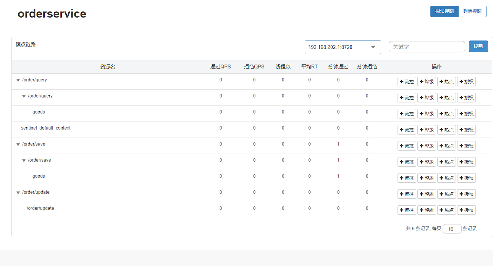


点击/order/query的goods


点击新增


进入浏览器，输入http://localhost:8081/order/save，疯狂刷新


无影响


进入浏览器，输入http://localhost:8081/order/query，疯狂刷新


有影响


### 流控效果

流控效果是指请求达到流控阈值时应该采取的措施，包括三种：

* 快速失败：达到阈值后，新的请求会被立即拒绝并抛出FlowException异常。是默认的处理方式
* warm up：预热模式，对超出阈值的请求同样是拒绝并抛出异常。但这种模式阈值会动态变化，从一个较小值逐渐增加到最大阈值
* 排队等待：让所有的请求按照先后次序排队执行，两个请求的间隔不能小于指定时长


### 流控效果-warm up

warm up也叫预热模式，是应对服务冷启动的一种方案。请求阈值初始值是 threshold / coldFactor，持续指定时长后， 逐渐提高到threshold值。而coldFactor的默认值是3. 例如，我设置QPS的threshold为10，预热时间为5秒，那么初始阈值就是 10 / 3 ，也就是3，然后在5秒后逐渐增长到10.


### 流控效果warm up测试

需求：给/order/{orderId}这个资源设置限流，最大QPS为10，利用warm up效果，预热时长为5秒


访问

http://localhost:8081/order/101


更改/order/{orderId}的流控规则


点击保存


进入jmeter


| 时间     | 通过 QPS | 拒绝QPS | 响应时间（ms） |
| -------- | -------- | ------- | -------------- |
| 22:16:02 | 5.0      | 0.0     | 6.0            |
| 22:16:01 | 10.0     | 0.0     | 6.0            |
| 22:16:00 | 10.0     | 0.0     | 6.0            |
| 22:15:59 | 10.0     | 0.0     | 6.0            |
| 22:15:58 | 10.0     | 0.0     | 6.0            |
| 22:15:57 | 10.0     | 0.0     | 7.0            |


| 时间     | 通过 QPS | 拒绝QPS | 响应时间（ms） |
| -------- | -------- | ------- | -------------- |
| 22:17:35 | 9.0      | 1.0     | 7.0            |
| 22:17:34 | 6.0      | 4.0     | 6.0            |
| 22:17:33 | 5.0      | 5.0     | 6.0            |
| 22:17:32 | 4.0      | 6.0     | 6.0            |
| 22:17:31 | 3.0      | 7.0     | 6.0            |
| 22:17:30 | 3.0      | 7.0     | 7.0            |


### 流控效果-排队等待

当请求超过QPS阈值时，快速失败和warm up 会拒绝新的请求并抛出异常。而排队等待则是让所有请求进入一个队列中，然后按照阈值允许的时间间隔依次执行。后来的请求必须等待前面执行完成，如果请求预期的等待时间超出最大时长，则会被拒绝


例如：QPS = 5，意味着每200ms处理一个队列中的请求；timeout = 2000，意味着预期等待超过2000ms的请求会被拒绝并抛出异常


### 流控效果-排队等待测试

需求：给/order/{orderId}这个资源设置限流，最大QPS为10，利用排队的流控效果，超时时长设置为5s


点击编辑


点击保存


进入jmeter


| 时间     | 通过 QPS | 拒绝QPS | 响应时间（ms） |
| -------- | -------- | ------- | -------------- |
| 22:29:50 | 10.0     | 2.0     | 3,256.0        |
| 22:29:49 | 10.0     | 0.0     | 2,926.0        |
| 22:29:48 | 10.0     | 0.0     | 2,596.0        |
| 22:29:47 | 10.0     | 0.0     | 2,265.0        |
| 22:29:46 | 10.0     | 0.0     | 1,951.0        |
| 22:29:45 | 10.0     | 0.0     | 1,638.0        |


| 时间     | 通过 QPS | 拒绝QPS | 响应时间（ms） |
| -------- | -------- | ------- | -------------- |
| 22:29:57 | 10.0     | 5.0     | 4,961.0        |
| 22:29:56 | 10.0     | 5.0     | 4,967.0        |
| 22:29:55 | 10.0     | 5.0     | 4,907.0        |
| 22:29:54 | 10.0     | 5.0     | 4,591.0        |
| 22:29:53 | 10.0     | 4.0     | 4,245.0        |
| 22:29:52 | 10.0     | 5.0     | 3,915.0        |


| 时间     | 通过 QPS | 拒绝QPS | 响应时间（ms） |
| -------- | -------- | ------- | -------------- |
| 22:30:04 | 10.0     | 0.0     | 4,958.0        |
| 22:30:03 | 10.0     | 0.0     | 4,967.0        |
| 22:30:02 | 10.0     | 0.0     | 4,968.0        |
| 22:30:01 | 10.0     | 0.0     | 4,977.0        |
| 22:30:00 | 10.0     | 3.0     | 4,980.0        |
| 22:29:59 | 10.0     | 5.0     | 4,984.0        |


|  ID  |   执行时间   |      线程组       |  lable   | 请求时间ms |  状态   | bytes | sent bytes | latency | 连接时间 |
| :--: | :----------: | :---------------: | :------: | :--------: | :-----: | :---: | :--------: | :-----: | :------: |
|  1   | 22:29:40.593 |  setUp线程组 1-1  | HTTP请求 |     51     | Success |  317  |    125     |   51    |    2     |
|  2   | 22:29:40.661 |  setUp线程组 1-2  | HTTP请求 |     38     | Success |  317  |    125     |   38    |    0     |
|  3   | 22:29:40.728 |  setUp线程组 1-3  | HTTP请求 |     72     | Success |  317  |    125     |   72    |    0     |
|  4   | 22:29:40.795 |  setUp线程组 1-4  | HTTP请求 |    105     | Success |  317  |    125     |   105   |    1     |
|  5   | 22:29:40.863 |  setUp线程组 1-5  | HTTP请求 |    137     | Success |  317  |    125     |   137   |    1     |
|  6   | 22:29:40.930 |  setUp线程组 1-6  | HTTP请求 |    173     | Success |  317  |    125     |   172   |    1     |
|  7   | 22:29:40.996 |  setUp线程组 1-7  | HTTP请求 |    205     | Success |  317  |    125     |   205   |    1     |
|  8   | 22:29:41.064 |  setUp线程组 1-8  | HTTP请求 |    237     | Success |  317  |    125     |   237   |    1     |
|  9   | 22:29:41.131 |  setUp线程组 1-9  | HTTP请求 |    272     | Success |  317  |    125     |   272   |    1     |
|  10  | 22:29:41.198 | setUp线程组 1-10  | HTTP请求 |    302     | Success |  317  |    125     |   302   |    1     |
|  11  | 22:29:41.264 | setUp线程组 1-11  | HTTP请求 |    338     | Success |  317  |    125     |   338   |    1     |
|  12  | 22:29:41.332 | setUp线程组 1-12  | HTTP请求 |    370     | Success |  317  |    125     |   370   |    1     |
|  13  | 22:29:41.399 | setUp线程组 1-13  | HTTP请求 |    402     | Success |  317  |    125     |   402   |    1     |
|  14  | 22:29:41.465 | setUp线程组 1-14  | HTTP请求 |    435     | Success |  317  |    125     |   434   |    0     |
|  15  | 22:29:41.532 | setUp线程组 1-15  | HTTP请求 |    471     | Success |  317  |    125     |   471   |    1     |
|  16  | 22:29:41.600 | setUp线程组 1-16  | HTTP请求 |    500     | Success |  317  |    125     |   500   |    0     |
|  17  | 22:29:41.666 | setUp线程组 1-17  | HTTP请求 |    533     | Success |  317  |    125     |   533   |    0     |
|  18  | 22:29:41.733 | setUp线程组 1-18  | HTTP请求 |    567     | Success |  317  |    125     |   566   |    1     |
|  19  | 22:29:41.800 | setUp线程组 1-19  | HTTP请求 |    600     | Success |  317  |    125     |   600   |    1     |
|  20  | 22:29:41.866 | setUp线程组 1-20  | HTTP请求 |    637     | Success |  317  |    125     |   636   |    1     |
|  21  | 22:29:41.934 | setUp线程组 1-21  | HTTP请求 |    664     | Success |  317  |    125     |   664   |    0     |
|  22  | 22:29:42.000 | setUp线程组 1-22  | HTTP请求 |    699     | Success |  317  |    125     |   699   |    0     |
|  23  | 22:29:42.067 | setUp线程组 1-23  | HTTP请求 |    732     | Success |  317  |    125     |   732   |    1     |
|  24  | 22:29:42.134 | setUp线程组 1-24  | HTTP请求 |    765     | Success |  317  |    125     |   765   |    0     |
|  25  | 22:29:42.201 | setUp线程组 1-25  | HTTP请求 |    798     | Success |  317  |    125     |   798   |    1     |
|  26  | 22:29:42.268 | setUp线程组 1-26  | HTTP请求 |    832     | Success |  317  |    125     |   832   |    0     |
|  27  | 22:29:42.336 | setUp线程组 1-27  | HTTP请求 |    865     | Success |  317  |    125     |   865   |    0     |
|  28  | 22:29:42.403 | setUp线程组 1-28  | HTTP请求 |    898     | Success |  317  |    125     |   898   |    1     |
|  29  | 22:29:42.470 | setUp线程组 1-29  | HTTP请求 |    929     | Success |  317  |    125     |   929   |    1     |
|  30  | 22:29:42.536 | setUp线程组 1-30  | HTTP请求 |    963     | Success |  317  |    125     |   963   |    1     |
|  31  | 22:29:42.604 | setUp线程组 1-31  | HTTP请求 |    995     | Success |  317  |    125     |   995   |    1     |
|  32  | 22:29:42.670 | setUp线程组 1-32  | HTTP请求 |    1030    | Success |  317  |    125     |  1030   |    1     |
|  33  | 22:29:42.737 | setUp线程组 1-33  | HTTP请求 |    1063    | Success |  317  |    125     |  1063   |    1     |
|  34  | 22:29:42.805 | setUp线程组 1-34  | HTTP请求 |    1094    | Success |  317  |    125     |  1094   |    0     |
|  35  | 22:29:42.873 | setUp线程组 1-35  | HTTP请求 |    1128    | Success |  317  |    125     |  1128   |    0     |
|  36  | 22:29:42.941 | setUp线程组 1-36  | HTTP请求 |    1160    | Success |  317  |    125     |  1160   |    0     |
|  37  | 22:29:43.008 | setUp线程组 1-37  | HTTP请求 |    1193    | Success |  317  |    125     |  1193   |    1     |
|  38  | 22:29:43.074 | setUp线程组 1-38  | HTTP请求 |    1227    | Success |  317  |    125     |  1227   |    1     |
|  39  | 22:29:43.141 | setUp线程组 1-39  | HTTP请求 |    1262    | Success |  317  |    125     |  1262   |    1     |
|  40  | 22:29:43.208 | setUp线程组 1-40  | HTTP请求 |    1293    | Success |  317  |    125     |  1293   |    1     |
|  41  | 22:29:43.275 | setUp线程组 1-41  | HTTP请求 |    1326    | Success |  317  |    125     |  1325   |    1     |
|  42  | 22:29:43.342 | setUp线程组 1-42  | HTTP请求 |    1362    | Success |  317  |    125     |  1362   |    1     |
|  43  | 22:29:43.409 | setUp线程组 1-43  | HTTP请求 |    1391    | Success |  317  |    125     |  1391   |    1     |
|  44  | 22:29:43.477 | setUp线程组 1-44  | HTTP请求 |    1423    | Success |  317  |    125     |  1423   |    0     |
|  45  | 22:29:43.544 | setUp线程组 1-45  | HTTP请求 |    1456    | Success |  317  |    125     |  1456   |    1     |
|  46  | 22:29:43.611 | setUp线程组 1-46  | HTTP请求 |    1492    | Success |  317  |    125     |  1492   |    1     |
|  47  | 22:29:43.677 | setUp线程组 1-47  | HTTP请求 |    1525    | Success |  317  |    125     |  1525   |    1     |
|  48  | 22:29:43.744 | setUp线程组 1-48  | HTTP请求 |    1558    | Success |  317  |    125     |  1558   |    1     |
|  49  | 22:29:43.810 | setUp线程组 1-49  | HTTP请求 |    1590    | Success |  317  |    125     |  1590   |    2     |
|  50  | 22:29:43.877 | setUp线程组 1-50  | HTTP请求 |    1624    | Success |  317  |    125     |  1624   |    1     |
|  51  | 22:29:43.944 | setUp线程组 1-51  | HTTP请求 |    1658    | Success |  317  |    125     |  1658   |    1     |
|  52  | 22:29:44.013 | setUp线程组 1-52  | HTTP请求 |    1689    | Success |  317  |    125     |  1688   |    0     |
|  53  | 22:29:44.080 | setUp线程组 1-53  | HTTP请求 |    1722    | Success |  317  |    125     |  1722   |    1     |
|  54  | 22:29:44.146 | setUp线程组 1-54  | HTTP请求 |    1757    | Success |  317  |    125     |  1757   |    1     |
|  55  | 22:29:44.214 | setUp线程组 1-55  | HTTP请求 |    1786    | Success |  317  |    125     |  1786   |    0     |
|  56  | 22:29:44.280 | setUp线程组 1-56  | HTTP请求 |    1822    | Success |  317  |    125     |  1822   |    1     |
|  57  | 22:29:44.347 | setUp线程组 1-57  | HTTP请求 |    1854    | Success |  317  |    125     |  1854   |    0     |
|  58  | 22:29:44.414 | setUp线程组 1-58  | HTTP请求 |    1887    | Success |  317  |    125     |  1887   |    1     |
|  59  | 22:29:44.481 | setUp线程组 1-59  | HTTP请求 |    1919    | Success |  317  |    125     |  1919   |    0     |
|  60  | 22:29:44.548 | setUp线程组 1-60  | HTTP请求 |    1952    | Success |  317  |    125     |  1952   |    1     |
|  61  | 22:29:44.616 | setUp线程组 1-61  | HTTP请求 |    1984    | Success |  317  |    125     |  1984   |    1     |
|  62  | 22:29:44.683 | setUp线程组 1-62  | HTTP请求 |    2021    | Success |  317  |    125     |  2021   |    1     |
|  63  | 22:29:44.749 | setUp线程组 1-63  | HTTP请求 |    2051    | Success |  317  |    125     |  2051   |    1     |
|  64  | 22:29:44.816 | setUp线程组 1-64  | HTTP请求 |    2087    | Success |  317  |    125     |  2087   |    1     |
|  65  | 22:29:44.883 | setUp线程组 1-65  | HTTP请求 |    2118    | Success |  317  |    125     |  2118   |    1     |
|  66  | 22:29:44.949 | setUp线程组 1-66  | HTTP请求 |    2156    | Success |  317  |    125     |  2156   |    1     |
|  67  | 22:29:45.016 | setUp线程组 1-67  | HTTP请求 |    2185    | Success |  317  |    125     |  2185   |    1     |
|  68  | 22:29:45.083 | setUp线程组 1-68  | HTTP请求 |    2220    | Success |  317  |    125     |  2220   |    1     |
|  69  | 22:29:45.150 | setUp线程组 1-69  | HTTP请求 |    2249    | Success |  317  |    125     |  2249   |    1     |
|  70  | 22:29:45.217 | setUp线程组 1-70  | HTTP请求 |    2284    | Success |  317  |    125     |  2284   |    0     |
|  71  | 22:29:45.284 | setUp线程组 1-71  | HTTP请求 |    2318    | Success |  317  |    125     |  2318   |    0     |
|  72  | 22:29:45.351 | setUp线程组 1-72  | HTTP请求 |    2350    | Success |  317  |    125     |  2349   |    1     |
|  73  | 22:29:45.419 | setUp线程组 1-73  | HTTP请求 |    2383    | Success |  317  |    125     |  2383   |    1     |
|  74  | 22:29:45.486 | setUp线程组 1-74  | HTTP请求 |    2414    | Success |  317  |    125     |  2414   |    1     |
|  75  | 22:29:45.553 | setUp线程组 1-75  | HTTP请求 |    2451    | Success |  317  |    125     |  2450   |    1     |
|  76  | 22:29:45.620 | setUp线程组 1-76  | HTTP请求 |    2484    | Success |  317  |    125     |  2483   |    0     |
|  77  | 22:29:45.687 | setUp线程组 1-77  | HTTP请求 |    2514    | Success |  317  |    125     |  2514   |    0     |
|  78  | 22:29:45.753 | setUp线程组 1-78  | HTTP请求 |    2550    | Success |  317  |    125     |  2550   |    1     |
|  79  | 22:29:45.820 | setUp线程组 1-79  | HTTP请求 |    2584    | Success |  317  |    125     |  2584   |    1     |
|  80  | 22:29:45.888 | setUp线程组 1-80  | HTTP请求 |    2615    | Success |  317  |    125     |  2615   |    1     |
|  81  | 22:29:45.955 | setUp线程组 1-81  | HTTP请求 |    2647    | Success |  317  |    125     |  2647   |    0     |
|  82  | 22:29:46.022 | setUp线程组 1-82  | HTTP请求 |    2678    | Success |  317  |    125     |  2678   |    1     |
|  83  | 22:29:46.089 | setUp线程组 1-83  | HTTP请求 |    2714    | Success |  317  |    125     |  2714   |    0     |
|  84  | 22:29:46.157 | setUp线程组 1-84  | HTTP请求 |    2743    | Success |  317  |    125     |  2743   |    0     |
|  85  | 22:29:46.224 | setUp线程组 1-85  | HTTP请求 |    2777    | Success |  317  |    125     |  2777   |    0     |
|  86  | 22:29:46.291 | setUp线程组 1-86  | HTTP请求 |    2809    | Success |  317  |    125     |  2809   |    0     |
|  87  | 22:29:46.357 | setUp线程组 1-87  | HTTP请求 |    2846    | Success |  317  |    125     |  2846   |    1     |
|  88  | 22:29:46.423 | setUp线程组 1-88  | HTTP请求 |    2880    | Success |  317  |    125     |  2880   |    1     |
|  89  | 22:29:46.492 | setUp线程组 1-89  | HTTP请求 |    2908    | Success |  317  |    125     |  2908   |    0     |
|  90  | 22:29:46.557 | setUp线程组 1-90  | HTTP请求 |    2945    | Success |  317  |    125     |  2945   |    1     |
|  91  | 22:29:46.625 | setUp线程组 1-91  | HTTP请求 |    2977    | Success |  317  |    125     |  2976   |    1     |
|  92  | 22:29:46.691 | setUp线程组 1-92  | HTTP请求 |    3012    | Success |  317  |    125     |  3012   |    1     |
|  93  | 22:29:46.758 | setUp线程组 1-93  | HTTP请求 |    3045    | Success |  317  |    125     |  3045   |    1     |
|  94  | 22:29:46.826 | setUp线程组 1-94  | HTTP请求 |    3075    | Success |  317  |    125     |  3075   |    0     |
|  95  | 22:29:46.894 | setUp线程组 1-95  | HTTP请求 |    3111    | Success |  317  |    125     |  3111   |    0     |
|  96  | 22:29:46.961 | setUp线程组 1-96  | HTTP请求 |    3142    | Success |  317  |    125     |  3142   |    1     |
|  97  | 22:29:47.026 | setUp线程组 1-97  | HTTP请求 |    3175    | Success |  317  |    125     |  3175   |    1     |
|  98  | 22:29:47.093 | setUp线程组 1-98  | HTTP请求 |    3208    | Success |  317  |    125     |  3208   |    1     |
|  99  | 22:29:47.161 | setUp线程组 1-99  | HTTP请求 |    3242    | Success |  317  |    125     |  3242   |    0     |
| 100  | 22:29:47.228 | setUp线程组 1-100 | HTTP请求 |    3275    | Success |  317  |    125     |  3275   |    1     |
| 101  | 22:29:47.294 | setUp线程组 1-101 | HTTP请求 |    3307    | Success |  317  |    125     |  3307   |    1     |
| 102  | 22:29:47.361 | setUp线程组 1-102 | HTTP请求 |    3344    | Success |  317  |    125     |  3344   |    1     |
| 103  | 22:29:50.778 | setUp线程组 1-153 | HTTP请求 |     2      | Warning |  176  |    125     |    2    |    1     |
| 104  | 22:29:47.429 | setUp线程组 1-103 | HTTP请求 |    3372    | Success |  317  |    125     |  3372   |    0     |
| 105  | 22:29:47.495 | setUp线程组 1-104 | HTTP请求 |    3405    | Success |  317  |    125     |  3405   |    1     |
| 106  | 22:29:50.980 | setUp线程组 1-156 | HTTP请求 |     1      | Warning |  176  |    125     |    1    |    1     |
| 107  | 22:29:47.563 | setUp线程组 1-105 | HTTP请求 |    3438    | Success |  317  |    125     |  3438   |    1     |
| 108  | 22:29:47.632 | setUp线程组 1-106 | HTTP请求 |    3468    | Success |  317  |    125     |  3468   |    1     |
| 109  | 22:29:51.180 | setUp线程组 1-159 | HTTP请求 |     2      | Warning |  176  |    125     |    2    |    1     |
| 110  | 22:29:47.701 | setUp线程组 1-107 | HTTP请求 |    3500    | Success |  317  |    125     |  3500   |    0     |
| 111  | 22:29:47.764 | setUp线程组 1-108 | HTTP请求 |    3538    | Success |  317  |    125     |  3538   |    1     |
| 112  | 22:29:51.381 | setUp线程组 1-162 | HTTP请求 |     1      | Warning |  176  |    125     |    1    |    1     |
| 113  | 22:29:47.832 | setUp线程组 1-109 | HTTP请求 |    3569    | Success |  317  |    125     |  3569   |    1     |
| 114  | 22:29:47.896 | setUp线程组 1-110 | HTTP请求 |    3605    | Success |  317  |    125     |  3604   |    1     |
| 115  | 22:29:51.583 | setUp线程组 1-165 | HTTP请求 |     2      | Warning |  176  |    125     |    2    |    1     |
| 116  | 22:29:47.964 | setUp线程组 1-111 | HTTP请求 |    3637    | Success |  317  |    125     |  3637   |    0     |
| 117  | 22:29:48.031 | setUp线程组 1-112 | HTTP请求 |    3670    | Success |  317  |    125     |  3670   |    0     |
| 118  | 22:29:51.785 | setUp线程组 1-168 | HTTP请求 |     2      | Warning |  176  |    125     |    2    |    1     |
| 119  | 22:29:48.098 | setUp线程组 1-113 | HTTP请求 |    3702    | Success |  317  |    125     |  3702   |    1     |
| 120  | 22:29:48.164 | setUp线程组 1-114 | HTTP请求 |    3738    | Success |  317  |    125     |  3738   |    1     |
| 121  | 22:29:51.983 | setUp线程组 1-171 | HTTP请求 |     2      | Warning |  176  |    125     |    2    |    1     |
| 122  | 22:29:48.233 | setUp线程组 1-115 | HTTP请求 |    3768    | Success |  317  |    125     |  3768   |    0     |
| 123  | 22:29:48.300 | setUp线程组 1-116 | HTTP请求 |    3800    | Success |  317  |    125     |  3800   |    1     |
| 124  | 22:29:52.184 | setUp线程组 1-174 | HTTP请求 |     2      | Warning |  176  |    125     |    2    |    1     |
| 125  | 22:29:48.367 | setUp线程组 1-117 | HTTP请求 |    3835    | Success |  317  |    125     |  3835   |    1     |
| 126  | 22:29:48.433 | setUp线程组 1-118 | HTTP请求 |    3867    | Success |  317  |    125     |  3867   |    1     |
| 127  | 22:29:52.387 | setUp线程组 1-177 | HTTP请求 |     1      | Warning |  176  |    125     |    1    |    0     |
| 128  | 22:29:48.500 | setUp线程组 1-119 | HTTP请求 |    3900    | Success |  317  |    125     |  3900   |    0     |
| 129  | 22:29:48.567 | setUp线程组 1-120 | HTTP请求 |    3932    | Success |  317  |    125     |  3932   |    1     |
| 130  | 22:29:52.587 | setUp线程组 1-180 | HTTP请求 |     1      | Warning |  176  |    125     |    1    |    1     |
| 131  | 22:29:48.633 | setUp线程组 1-121 | HTTP请求 |    3966    | Success |  317  |    125     |  3966   |    1     |
| 132  | 22:29:48.700 | setUp线程组 1-122 | HTTP请求 |    4000    | Success |  317  |    125     |  4000   |    1     |
| 133  | 22:29:52.789 | setUp线程组 1-183 | HTTP请求 |     1      | Warning |  176  |    125     |    1    |    0     |
| 134  | 22:29:48.769 | setUp线程组 1-123 | HTTP请求 |    4032    | Success |  317  |    125     |  4032   |    0     |
| 135  | 22:29:48.836 | setUp线程组 1-124 | HTTP请求 |    4065    | Success |  317  |    125     |  4065   |    0     |
| 136  | 22:29:52.988 | setUp线程组 1-186 | HTTP请求 |     2      | Warning |  176  |    125     |    2    |    1     |
| 137  | 22:29:48.903 | setUp线程组 1-125 | HTTP请求 |    4099    | Success |  317  |    125     |  4099   |    0     |
| 138  | 22:29:48.970 | setUp线程组 1-126 | HTTP请求 |    4131    | Success |  317  |    125     |  4131   |    1     |
| 139  | 22:29:53.190 | setUp线程组 1-189 | HTTP请求 |     2      | Warning |  176  |    125     |    2    |    1     |
| 140  | 22:29:49.035 | setUp线程组 1-127 | HTTP请求 |    4167    | Success |  317  |    125     |  4167   |    1     |
| 141  | 22:29:49.103 | setUp线程组 1-128 | HTTP请求 |    4196    | Success |  317  |    125     |  4195   |    0     |
| 142  | 22:29:53.390 | setUp线程组 1-192 | HTTP请求 |     2      | Warning |  176  |    125     |    2    |    1     |
| 143  | 22:29:49.170 | setUp线程组 1-129 | HTTP请求 |    4229    | Success |  317  |    125     |  4229   |    0     |
| 144  | 22:29:49.238 | setUp线程组 1-130 | HTTP请求 |    4261    | Success |  317  |    125     |  4261   |    1     |
| 145  | 22:29:49.303 | setUp线程组 1-131 | HTTP请求 |    4298    | Success |  317  |    125     |  4297   |    1     |
| 146  | 22:29:53.658 | setUp线程组 1-196 | HTTP请求 |     1      | Warning |  176  |    125     |    1    |    1     |
| 147  | 22:29:49.370 | setUp线程组 1-132 | HTTP请求 |    4329    | Success |  317  |    125     |  4329   |    1     |
| 148  | 22:29:49.437 | setUp线程组 1-133 | HTTP请求 |    4363    | Success |  317  |    125     |  4362   |    1     |
| 149  | 22:29:53.860 | setUp线程组 1-199 | HTTP请求 |     1      | Warning |  176  |    125     |    1    |    1     |
| 150  | 22:29:49.504 | setUp线程组 1-134 | HTTP请求 |    4396    | Success |  317  |    125     |  4396   |    1     |
| 151  | 22:29:49.572 | setUp线程组 1-135 | HTTP请求 |    4429    | Success |  317  |    125     |  4429   |    1     |
| 152  | 22:29:54.060 | setUp线程组 1-202 | HTTP请求 |     1      | Warning |  176  |    125     |    1    |    1     |
| 153  | 22:29:49.639 | setUp线程组 1-136 | HTTP请求 |    4461    | Success |  317  |    125     |  4461   |    1     |
| 154  | 22:29:49.706 | setUp线程组 1-137 | HTTP请求 |    4495    | Success |  317  |    125     |  4495   |    1     |
| 155  | 22:29:54.261 | setUp线程组 1-205 | HTTP请求 |     1      | Warning |  176  |    125     |    1    |    1     |
| 156  | 22:29:49.773 | setUp线程组 1-138 | HTTP请求 |    4527    | Success |  317  |    125     |  4527   |    0     |
| 157  | 22:29:49.840 | setUp线程组 1-139 | HTTP请求 |    4563    | Success |  317  |    125     |  4563   |    0     |
| 158  | 22:29:54.463 | setUp线程组 1-208 | HTTP请求 |     2      | Warning |  176  |    125     |    2    |    1     |
| 159  | 22:29:49.907 | setUp线程组 1-140 | HTTP请求 |    4594    | Success |  317  |    125     |  4594   |    1     |
| 160  | 22:29:49.974 | setUp线程组 1-141 | HTTP请求 |    4625    | Success |  317  |    125     |  4625   |    1     |
| 161  | 22:29:54.664 | setUp线程组 1-211 | HTTP请求 |     1      | Warning |  176  |    125     |    1    |    0     |
| 162  | 22:29:50.041 | setUp线程组 1-142 | HTTP请求 |    4659    | Success |  317  |    125     |  4659   |    1     |
| 163  | 22:29:50.109 | setUp线程组 1-143 | HTTP请求 |    4690    | Success |  317  |    125     |  4690   |    0     |
| 164  | 22:29:54.864 | setUp线程组 1-214 | HTTP请求 |     1      | Warning |  176  |    125     |    1    |    1     |
| 165  | 22:29:50.175 | setUp线程组 1-144 | HTTP请求 |    4724    | Success |  317  |    125     |  4724   |    1     |
| 166  | 22:29:50.243 | setUp线程组 1-145 | HTTP请求 |    4757    | Success |  317  |    125     |  4757   |    2     |
| 167  | 22:29:55.065 | setUp线程组 1-217 | HTTP请求 |     2      | Warning |  176  |    125     |    1    |    1     |
| 168  | 22:29:50.310 | setUp线程组 1-146 | HTTP请求 |    4791    | Success |  317  |    125     |  4790   |    1     |
| 169  | 22:29:50.377 | setUp线程组 1-147 | HTTP请求 |    4821    | Success |  317  |    125     |  4821   |    1     |
| 170  | 22:29:55.267 | setUp线程组 1-220 | HTTP请求 |     1      | Warning |  176  |    125     |    1    |    0     |
| 171  | 22:29:50.443 | setUp线程组 1-148 | HTTP请求 |    4858    | Success |  317  |    125     |  4858   |    1     |
| 172  | 22:29:50.510 | setUp线程组 1-149 | HTTP请求 |    4889    | Success |  317  |    125     |  4889   |    1     |
| 173  | 22:29:55.467 | setUp线程组 1-223 | HTTP请求 |     1      | Warning |  176  |    125     |    1    |    0     |
| 174  | 22:29:50.576 | setUp线程组 1-150 | HTTP请求 |    4923    | Success |  317  |    125     |  4923   |    1     |
| 175  | 22:29:50.643 | setUp线程组 1-151 | HTTP请求 |    4960    | Success |  317  |    125     |  4960   |    1     |
| 176  | 22:29:55.670 | setUp线程组 1-226 | HTTP请求 |     1      | Warning |  176  |    125     |    1    |    1     |
| 177  | 22:29:50.711 | setUp线程组 1-152 | HTTP请求 |    4990    | Success |  317  |    125     |  4990   |    0     |
| 178  | 22:29:50.845 | setUp线程组 1-154 | HTTP请求 |    4957    | Success |  317  |    125     |  4957   |    1     |
| 179  | 22:29:55.869 | setUp线程组 1-229 | HTTP请求 |     2      | Warning |  176  |    125     |    2    |    1     |
| 180  | 22:29:50.912 | setUp线程组 1-155 | HTTP请求 |    4989    | Success |  317  |    125     |  4989   |    1     |
| 181  | 22:29:51.047 | setUp线程组 1-157 | HTTP请求 |    4955    | Success |  317  |    125     |  4955   |    1     |
| 182  | 22:29:56.071 | setUp线程组 1-232 | HTTP请求 |     2      | Warning |  176  |    125     |    2    |    1     |
| 183  | 22:29:51.113 | setUp线程组 1-158 | HTTP请求 |    4988    | Success |  317  |    125     |  4988   |    1     |
| 184  | 22:29:51.247 | setUp线程组 1-160 | HTTP请求 |    4954    | Success |  317  |    125     |  4954   |    1     |
| 185  | 22:29:56.271 | setUp线程组 1-235 | HTTP请求 |     2      | Warning |  176  |    125     |    2    |    1     |
| 186  | 22:29:51.314 | setUp线程组 1-161 | HTTP请求 |    4988    | Success |  317  |    125     |  4988   |    1     |
| 187  | 22:29:51.448 | setUp线程组 1-163 | HTTP请求 |    4952    | Success |  317  |    125     |  4952   |    1     |
| 188  | 22:29:56.472 | setUp线程组 1-238 | HTTP请求 |     2      | Warning |  176  |    125     |    2    |    1     |
| 189  | 22:29:51.516 | setUp线程组 1-164 | HTTP请求 |    4987    | Success |  317  |    125     |  4987   |    1     |
| 190  | 22:29:51.650 | setUp线程组 1-166 | HTTP请求 |    4950    | Success |  317  |    125     |  4950   |    1     |
| 191  | 22:29:56.674 | setUp线程组 1-241 | HTTP请求 |     2      | Warning |  176  |    125     |    2    |    1     |
| 192  | 22:29:51.718 | setUp线程组 1-167 | HTTP请求 |    4982    | Success |  317  |    125     |  4982   |    1     |
| 193  | 22:29:51.851 | setUp线程组 1-169 | HTTP请求 |    4951    | Success |  317  |    125     |  4951   |    1     |
| 194  | 22:29:56.874 | setUp线程组 1-244 | HTTP请求 |     1      | Warning |  176  |    125     |    1    |    1     |
| 195  | 22:29:51.916 | setUp线程组 1-170 | HTTP请求 |    4983    | Success |  317  |    125     |  4983   |    1     |
| 196  | 22:29:52.050 | setUp线程组 1-172 | HTTP请求 |    4951    | Success |  317  |    125     |  4951   |    1     |
| 197  | 22:29:57.075 | setUp线程组 1-247 | HTTP请求 |     2      | Warning |  176  |    125     |    2    |    1     |
| 198  | 22:29:52.117 | setUp线程组 1-173 | HTTP请求 |    4984    | Success |  317  |    125     |  4984   |    1     |
| 199  | 22:29:52.252 | setUp线程组 1-175 | HTTP请求 |    4947    | Success |  317  |    125     |  4947   |    1     |
| 200  | 22:29:57.276 | setUp线程组 1-250 | HTTP请求 |     1      | Warning |  176  |    125     |    1    |    1     |
| 201  | 22:29:52.320 | setUp线程组 1-176 | HTTP请求 |    4982    | Success |  317  |    125     |  4982   |    0     |
| 202  | 22:29:52.454 | setUp线程组 1-178 | HTTP请求 |    4947    | Success |  317  |    125     |  4947   |    0     |
| 203  | 22:29:57.478 | setUp线程组 1-253 | HTTP请求 |     2      | Warning |  176  |    125     |    2    |    1     |
| 204  | 22:29:52.521 | setUp线程组 1-179 | HTTP请求 |    4980    | Success |  317  |    125     |  4979   |    1     |
| 205  | 22:29:52.655 | setUp线程组 1-181 | HTTP请求 |    4947    | Success |  317  |    125     |  4947   |    1     |
| 206  | 22:29:57.679 | setUp线程组 1-256 | HTTP请求 |     1      | Warning |  176  |    125     |    1    |    1     |
| 207  | 22:29:52.722 | setUp线程组 1-182 | HTTP请求 |    4979    | Success |  317  |    125     |  4979   |    0     |
| 208  | 22:29:52.856 | setUp线程组 1-184 | HTTP请求 |    4945    | Success |  317  |    125     |  4945   |    1     |
| 209  | 22:29:57.879 | setUp线程组 1-259 | HTTP请求 |     2      | Warning |  176  |    125     |    2    |    1     |
| 210  | 22:29:52.921 | setUp线程组 1-185 | HTTP请求 |    4980    | Success |  317  |    125     |  4980   |    0     |
| 211  | 22:29:53.055 | setUp线程组 1-187 | HTTP请求 |    4944    | Success |  317  |    125     |  4944   |    1     |
| 212  | 22:29:58.080 | setUp线程组 1-262 | HTTP请求 |     1      | Warning |  176  |    125     |    1    |    1     |
| 213  | 22:29:53.123 | setUp线程组 1-188 | HTTP请求 |    4976    | Success |  317  |    125     |  4976   |    1     |
| 214  | 22:29:53.256 | setUp线程组 1-190 | HTTP请求 |    4946    | Success |  317  |    125     |  4945   |    1     |
| 215  | 22:29:58.282 | setUp线程组 1-265 | HTTP请求 |     2      | Warning |  176  |    125     |    2    |    1     |
| 216  | 22:29:53.324 | setUp线程组 1-191 | HTTP请求 |    4983    | Success |  317  |    125     |  4983   |    1     |
| 217  | 22:29:53.458 | setUp线程组 1-193 | HTTP请求 |    4943    | Success |  317  |    125     |  4943   |    0     |
| 218  | 22:29:58.482 | setUp线程组 1-268 | HTTP请求 |     2      | Warning |  176  |    125     |    2    |    1     |
| 219  | 22:29:53.525 | setUp线程组 1-194 | HTTP请求 |    4974    | Success |  317  |    125     |  4974   |    0     |
| 220  | 22:29:53.592 | setUp线程组 1-195 | HTTP请求 |    5007    | Success |  317  |    125     |  5007   |    1     |
| 221  | 22:29:58.684 | setUp线程组 1-271 | HTTP请求 |     2      | Warning |  176  |    125     |    2    |    1     |
| 222  | 22:29:53.726 | setUp线程组 1-197 | HTTP请求 |    4973    | Success |  317  |    125     |  4973   |    1     |
| 223  | 22:29:53.793 | setUp线程组 1-198 | HTTP请求 |    5008    | Success |  317  |    125     |  5008   |    1     |
| 224  | 22:29:58.886 | setUp线程组 1-274 | HTTP请求 |     1      | Warning |  176  |    125     |    1    |    1     |
| 225  | 22:29:53.927 | setUp线程组 1-200 | HTTP请求 |    4974    | Success |  317  |    125     |  4974   |    1     |
| 226  | 22:29:53.993 | setUp线程组 1-201 | HTTP请求 |    5008    | Success |  317  |    125     |  5008   |    1     |
| 227  | 22:29:59.086 | setUp线程组 1-277 | HTTP请求 |     2      | Warning |  176  |    125     |    2    |    1     |
| 228  | 22:29:54.127 | setUp线程组 1-203 | HTTP请求 |    4972    | Success |  317  |    125     |  4972   |    1     |
| 229  | 22:29:54.194 | setUp线程组 1-204 | HTTP请求 |    5005    | Success |  317  |    125     |  5005   |    1     |
| 230  | 22:29:59.287 | setUp线程组 1-280 | HTTP请求 |     1      | Warning |  176  |    125     |    1    |    1     |
| 231  | 22:29:54.328 | setUp线程组 1-206 | HTTP请求 |    4972    | Success |  317  |    125     |  4972   |    1     |
| 232  | 22:29:54.395 | setUp线程组 1-207 | HTTP请求 |    5006    | Success |  317  |    125     |  5006   |    1     |
| 233  | 22:29:59.489 | setUp线程组 1-283 | HTTP请求 |     1      | Warning |  176  |    125     |    1    |    1     |
| 234  | 22:29:54.530 | setUp线程组 1-209 | HTTP请求 |    4970    | Success |  317  |    125     |  4970   |    1     |
| 235  | 22:29:54.598 | setUp线程组 1-210 | HTTP请求 |    5000    | Success |  317  |    125     |  5000   |    0     |
| 236  | 22:29:59.691 | setUp线程组 1-286 | HTTP请求 |     2      | Warning |  176  |    125     |    2    |    1     |
| 237  | 22:29:54.730 | setUp线程组 1-212 | HTTP请求 |    4971    | Success |  317  |    125     |  4971   |    0     |
| 238  | 22:29:54.797 | setUp线程组 1-213 | HTTP请求 |    5005    | Success |  317  |    125     |  5005   |    1     |
| 239  | 22:29:59.891 | setUp线程组 1-289 | HTTP请求 |     1      | Warning |  176  |    125     |    1    |    0     |
| 240  | 22:29:54.931 | setUp线程组 1-215 | HTTP请求 |    4969    | Success |  317  |    125     |  4969   |    1     |
| 241  | 22:29:54.998 | setUp线程组 1-216 | HTTP请求 |    5004    | Success |  317  |    125     |  5004   |    1     |
| 242  | 22:30:00.091 | setUp线程组 1-292 | HTTP请求 |     1      | Warning |  176  |    125     |    1    |    0     |
| 243  | 22:29:55.133 | setUp线程组 1-218 | HTTP请求 |    4967    | Success |  317  |    125     |  4967   |    0     |
| 244  | 22:29:55.199 | setUp线程组 1-219 | HTTP请求 |    5000    | Success |  317  |    125     |  5000   |    1     |
| 245  | 22:30:00.292 | setUp线程组 1-295 | HTTP请求 |     1      | Warning |  176  |    125     |    1    |    0     |
| 246  | 22:29:55.334 | setUp线程组 1-221 | HTTP请求 |    4966    | Success |  317  |    125     |  4966   |    0     |
| 247  | 22:29:55.401 | setUp线程组 1-222 | HTTP请求 |    4997    | Success |  317  |    125     |  4997   |    0     |
| 248  | 22:30:00.492 | setUp线程组 1-298 | HTTP请求 |     1      | Warning |  176  |    125     |    1    |    0     |
| 249  | 22:29:55.534 | setUp线程组 1-224 | HTTP请求 |    4965    | Success |  317  |    125     |  4965   |    0     |
| 250  | 22:29:55.601 | setUp线程组 1-225 | HTTP请求 |    5000    | Success |  317  |    125     |  5000   |    1     |
| 251  | 22:29:55.737 | setUp线程组 1-227 | HTTP请求 |    4961    | Success |  317  |    125     |  4961   |    1     |
| 252  | 22:29:55.802 | setUp线程组 1-228 | HTTP请求 |    4997    | Success |  317  |    125     |  4997   |    1     |
| 253  | 22:29:55.936 | setUp线程组 1-230 | HTTP请求 |    4965    | Success |  317  |    125     |  4965   |    1     |
| 254  | 22:29:56.004 | setUp线程组 1-231 | HTTP请求 |    4997    | Success |  317  |    125     |  4997   |    1     |
| 255  | 22:29:56.138 | setUp线程组 1-233 | HTTP请求 |    4964    | Success |  317  |    125     |  4964   |    1     |
| 256  | 22:29:56.204 | setUp线程组 1-234 | HTTP请求 |    4998    | Success |  317  |    125     |  4998   |    1     |
| 257  | 22:29:56.338 | setUp线程组 1-236 | HTTP请求 |    4962    | Success |  317  |    125     |  4962   |    1     |
| 258  | 22:29:56.405 | setUp线程组 1-237 | HTTP请求 |    4994    | Success |  317  |    125     |  4994   |    1     |
| 259  | 22:29:56.540 | setUp线程组 1-239 | HTTP请求 |    4958    | Success |  317  |    125     |  4958   |    0     |
| 260  | 22:29:56.608 | setUp线程组 1-240 | HTTP请求 |    4993    | Success |  317  |    125     |  4993   |    1     |
| 261  | 22:29:56.741 | setUp线程组 1-242 | HTTP请求 |    4960    | Success |  317  |    125     |  4960   |    1     |
| 262  | 22:29:56.808 | setUp线程组 1-243 | HTTP请求 |    4993    | Success |  317  |    125     |  4993   |    1     |
| 263  | 22:29:56.941 | setUp线程组 1-245 | HTTP请求 |    4961    | Success |  317  |    125     |  4961   |    1     |
| 264  | 22:29:57.008 | setUp线程组 1-246 | HTTP请求 |    4992    | Success |  317  |    125     |  4992   |    1     |
| 265  | 22:29:57.142 | setUp线程组 1-248 | HTTP请求 |    4958    | Success |  317  |    125     |  4958   |    1     |
| 266  | 22:29:57.209 | setUp线程组 1-249 | HTTP请求 |    4992    | Success |  317  |    125     |  4992   |    1     |
| 267  | 22:29:57.343 | setUp线程组 1-251 | HTTP请求 |    4958    | Success |  317  |    125     |  4958   |    1     |
| 268  | 22:29:57.411 | setUp线程组 1-252 | HTTP请求 |    4987    | Success |  317  |    125     |  4987   |    1     |
| 269  | 22:29:57.544 | setUp线程组 1-254 | HTTP请求 |    4955    | Success |  317  |    125     |  4954   |    1     |
| 270  | 22:29:57.611 | setUp线程组 1-255 | HTTP请求 |    4989    | Success |  317  |    125     |  4989   |    1     |
| 271  | 22:29:57.746 | setUp线程组 1-257 | HTTP请求 |    4955    | Success |  317  |    125     |  4955   |    1     |
| 272  | 22:29:57.812 | setUp线程组 1-258 | HTTP请求 |    4987    | Success |  317  |    125     |  4987   |    1     |
| 273  | 22:29:57.946 | setUp线程组 1-260 | HTTP请求 |    4956    | Success |  317  |    125     |  4955   |    1     |
| 274  | 22:29:58.013 | setUp线程组 1-261 | HTTP请求 |    4988    | Success |  317  |    125     |  4988   |    1     |
| 275  | 22:29:58.148 | setUp线程组 1-263 | HTTP请求 |    4954    | Success |  317  |    125     |  4954   |    1     |
| 276  | 22:29:58.215 | setUp线程组 1-264 | HTTP请求 |    4985    | Success |  317  |    125     |  4985   |    1     |
| 277  | 22:29:58.349 | setUp线程组 1-266 | HTTP请求 |    4952    | Success |  317  |    125     |  4952   |    0     |
| 278  | 22:29:58.415 | setUp线程组 1-267 | HTTP请求 |    4984    | Success |  317  |    125     |  4984   |    1     |
| 279  | 22:29:58.549 | setUp线程组 1-269 | HTTP请求 |    4950    | Success |  317  |    125     |  4950   |    1     |
| 280  | 22:29:58.616 | setUp线程组 1-270 | HTTP请求 |    4987    | Success |  317  |    125     |  4987   |    1     |
| 281  | 22:29:58.750 | setUp线程组 1-272 | HTTP请求 |    4949    | Success |  317  |    125     |  4949   |    1     |
| 282  | 22:29:58.817 | setUp线程组 1-273 | HTTP请求 |    4984    | Success |  317  |    125     |  4983   |    1     |
| 283  | 22:29:58.952 | setUp线程组 1-275 | HTTP请求 |    4949    | Success |  317  |    125     |  4949   |    1     |
| 284  | 22:29:59.020 | setUp线程组 1-276 | HTTP请求 |    4981    | Success |  317  |    125     |  4981   |    1     |
| 285  | 22:29:59.153 | setUp线程组 1-278 | HTTP请求 |    4948    | Success |  317  |    125     |  4948   |    0     |
| 286  | 22:29:59.220 | setUp线程组 1-279 | HTTP请求 |    4981    | Success |  317  |    125     |  4981   |    0     |
| 287  | 22:29:59.354 | setUp线程组 1-281 | HTTP请求 |    4945    | Success |  317  |    125     |  4945   |    0     |
| 288  | 22:29:59.421 | setUp线程组 1-282 | HTTP请求 |    4979    | Success |  317  |    125     |  4979   |    0     |
| 289  | 22:29:59.556 | setUp线程组 1-284 | HTTP请求 |    4943    | Success |  317  |    125     |  4943   |    1     |
| 290  | 22:29:59.623 | setUp线程组 1-285 | HTTP请求 |    4979    | Success |  317  |    125     |  4979   |    0     |
| 291  | 22:29:59.758 | setUp线程组 1-287 | HTTP请求 |    4942    | Success |  317  |    125     |  4941   |    0     |
| 292  | 22:29:59.823 | setUp线程组 1-288 | HTTP请求 |    4975    | Success |  317  |    125     |  4975   |    0     |
| 293  | 22:29:59.959 | setUp线程组 1-290 | HTTP请求 |    4941    | Success |  317  |    125     |  4941   |    1     |
| 294  | 22:30:00.024 | setUp线程组 1-291 | HTTP请求 |    4975    | Success |  317  |    125     |  4975   |    0     |
| 295  | 22:30:00.158 | setUp线程组 1-293 | HTTP请求 |    4941    | Success |  317  |    125     |  4941   |    0     |
| 296  | 22:30:00.228 | setUp线程组 1-294 | HTTP请求 |    4970    | Success |  317  |    125     |  4970   |    0     |
| 297  | 22:30:00.359 | setUp线程组 1-296 | HTTP请求 |    4941    | Success |  317  |    125     |  4941   |    0     |
| 298  | 22:30:00.425 | setUp线程组 1-297 | HTTP请求 |    4975    | Success |  317  |    125     |  4975   |    1     |
| 299  | 22:30:00.559 | setUp线程组 1-299 | HTTP请求 |    4942    | Success |  317  |    125     |  4942   |    0     |
| 300  | 22:30:00.626 | setUp线程组 1-300 | HTTP请求 |    4974    | Success |  317  |    125     |  4974   |    0     |


### 热点参数限流


之前的限流是统计访问某个资源的所有请求，判断是否超过QPS阈值。而热点参数限流是分别统计参数值相同的请求， 判断是否超过QPS阈值。


代表的含义是：对hot这个资源的0号参数（第一个参数）做统计，每1秒相同参数值的请求数不能超过5


这里的含义是对0号的long类型参数限流，每1秒相同参数的QPS不能超过5，有两个例外：

*  如果参数值是100，则每1秒允许的QPS为10
* 如果参数值是101，则每1秒允许的QPS为15


热点参数限流对默认的SpringMVC资源无效


### 热点参数限流测试

给/order/{orderId}这个资源添加热点参数限流，规则如下：

* 默认的热点参数规则是每1秒请求量不超过3
* 给102这个参数设置例外：每1秒请求量不超过5
* 给103这个参数设置例外：每1秒请求量不超过10


热点参数限流对默认的SpringMVC资源无效

所以需要添加@SentinelResource注解

```java
@SentinelResource("order_hot")
```


| 属性                          | 作用                                                         | 是否必须    |
| :---------------------------- | :----------------------------------------------------------- | :---------- |
| value                         | 资源名称                                                     | 是          |
| entryType                     | entry类型，标记流量的方向，取值IN/OUT，默认是OUT             | 否          |
| blockHandler                  | 处理BlockException的函数名称                                 | 否          |
| blockHandlerClass             | 存放blockHandler的类。对应的处理函数必须static修饰，否则无法解析，其他要求：同blockHandler | 否          |
| fallback                      | 用于在抛出异常的时候提供fallback处理逻辑。fallback函数可以针对所有类型的异常（除了`exceptionsToIgnore` 里面排除掉的异常类型）进行处理 | 否          |
| fallbackClass【1.6支持】      | 存放fallback的类。对应的处理函数必须static修饰，否则无法解析，其他要求：同fallback | 否          |
| defaultFallback【1.6支持】    | 用于通用的 fallback 逻辑。默认fallback函数可以针对所有类型的异常（除了`exceptionsToIgnore` 里面排除掉的异常类型）进行处理。若同时配置了 fallback 和 defaultFallback，以fallback为准 | 否          |
| exceptionsToIgnore【1.6支持】 | 指定排除掉哪些异常。排除的异常不会计入异常统计，也不会进入fallback逻辑，而是原样抛出 | 否          |
| exceptionsToTrace             | 需要trace的异常                                              | `Throwable` |


```java
package mao.order_service.controller;

import com.alibaba.csp.sentinel.annotation.SentinelResource;
import mao.order_service.entity.Order;
import mao.order_service.service.OrderService;
import org.springframework.beans.factory.annotation.Autowired;
import org.springframework.web.bind.annotation.GetMapping;
import org.springframework.web.bind.annotation.PathVariable;
import org.springframework.web.bind.annotation.RequestMapping;
import org.springframework.web.bind.annotation.RestController;

/**
 * Project name(项目名称)：spring_cloud_demo
 * Package(包名): mao.order_service.controller
 * Class(类名): OrderController
 * Author(作者）: mao
 * Author QQ：1296193245
 * GitHub：https://github.com/maomao124/
 * Date(创建日期)： 2022/7/9
 * Time(创建时间)： 13:59
 * Version(版本): 1.0
 * Description(描述)： OrderController
 */

@RestController
@RequestMapping("order")
public class OrderController
{
    @Autowired
    private OrderService orderService;


    /**
     * 获取订单数据
     *
     * @param orderId 订单的id
     * @return Order
     */
    @SentinelResource("order_hot")
    @GetMapping("{orderId}")
    public Order queryOrderByUserId(@PathVariable("orderId") Long orderId)
    {
        return orderService.queryOrderById(orderId);
    }

    /**
     * 模拟查询订单
     *
     * @return query
     */
    @GetMapping("/query")
    public String query()
    {
        //return "query";
        return "query" + orderService.queryGoods();
    }

    /**
     * 模拟
     *
     * @return update
     */
    @GetMapping("/update")
    public String update()
    {
        return "update";
    }

    /**
     * 模拟创建订单
     *
     * @return save
     */
    @GetMapping("/save")
    public String save()
    {
        return "save" + orderService.queryGoods();
    }
}
```


启动服务


访问一次

http://localhost:8081/order/101


进入sentinel控制台


点击order_hot热点


填写表单


点击新增


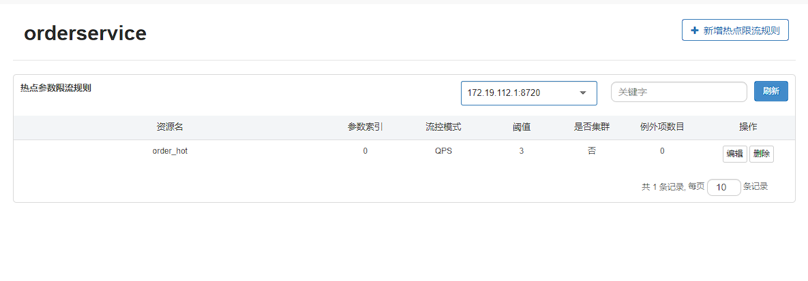


点击编辑


点击高级选项


填写数据


点击保存


启动jmeter


对

http://localhost:8081/order/101

做测试


发起请求


| 时间     | 通过 QPS | 拒绝QPS | 响应时间（ms） |
| -------- | -------- | ------- | -------------- |
| 13:41:25 | 0.0      | 1.0     | 0.0            |
| 13:41:24 | 3.0      | 7.0     | 3.0            |
| 13:41:23 | 3.0      | 7.0     | 5.0            |
| 13:41:22 | 3.0      | 7.0     | 4.0            |
| 13:41:21 | 3.0      | 7.0     | 5.0            |
| 13:41:20 | 3.0      | 7.0     | 5.0            |


结果


|  ID  |   执行时间   |      线程组       |  lable   | 请求时间ms |  状态   | bytes | sent bytes | latency | 连接时间 |
| :--: | :----------: | :---------------: | :------: | :--: | :-----: | :--: | :--: | :--: | :--: |
| 1    | 13:41:05.139 | setUp线程组 1-1   | HTTP请求 | 48   | Success | 317  | 125  | 48   | 1    |
| 2    | 13:41:05.241 | setUp线程组 1-2   | HTTP请求 | 7    | Success | 317  | 125  | 7    | 0    |
| 3    | 13:41:05.351 | setUp线程组 1-3   | HTTP请求 | 9    | Success | 317  | 125  | 8    | 1    |
| 4    | 13:41:05.445 | setUp线程组 1-4   | HTTP请求 | 4    | Warning | 267  | 125  | 4    | 1    |
| 5    | 13:41:05.540 | setUp线程组 1-5   | HTTP请求 | 3    | Warning | 267  | 125  | 3    | 1    |
| 6    | 13:41:05.648 | setUp线程组 1-6   | HTTP请求 | 3    | Warning | 267  | 125  | 3    | 1    |
| 7    | 13:41:05.738 | setUp线程组 1-7   | HTTP请求 | 3    | Warning | 267  | 125  | 3    | 1    |
| 8    | 13:41:05.838 | setUp线程组 1-8   | HTTP请求 | 5    | Warning | 267  | 125  | 4    | 1    |
| 9    | 13:41:05.940 | setUp线程组 1-9   | HTTP请求 | 3    | Warning | 267  | 125  | 3    | 1    |
| 10   | 13:41:06.041 | setUp线程组 1-10  | HTTP请求 | 3    | Warning | 267  | 125  | 3    | 1    |
| 11   | 13:41:06.141 | setUp线程组 1-11  | HTTP请求 | 8    | Success | 317  | 125  | 8    | 1    |
| 12   | 13:41:06.238 | setUp线程组 1-12  | HTTP请求 | 8    | Success | 317  | 125  | 8    | 0    |
| 13   | 13:41:06.339 | setUp线程组 1-13  | HTTP请求 | 7    | Success | 317  | 125  | 7    | 0    |
| 14   | 13:41:06.439 | setUp线程组 1-14  | HTTP请求 | 3    | Warning | 267  | 125  | 3    | 0    |
| 15   | 13:41:06.539 | setUp线程组 1-15  | HTTP请求 | 3    | Warning | 267  | 125  | 3    | 1    |
| 16   | 13:41:06.639 | setUp线程组 1-16  | HTTP请求 | 3    | Warning | 267  | 125  | 3    | 1    |
| 17   | 13:41:06.738 | setUp线程组 1-17  | HTTP请求 | 3    | Warning | 267  | 125  | 3    | 1    |
| 18   | 13:41:06.838 | setUp线程组 1-18  | HTTP请求 | 3    | Warning | 267  | 125  | 3    | 1    |
| 19   | 13:41:06.938 | setUp线程组 1-19  | HTTP请求 | 3    | Warning | 267  | 125  | 3    | 1    |
| 20   | 13:41:07.038 | setUp线程组 1-20  | HTTP请求 | 2    | Warning | 267  | 125  | 2    | 0    |
| 21   | 13:41:07.138 | setUp线程组 1-21  | HTTP请求 | 3    | Warning | 267  | 125  | 3    | 1    |
| 22   | 13:41:07.238 | setUp线程组 1-22  | HTTP请求 | 8    | Success | 317  | 125  | 8    | 1    |
| 23   | 13:41:07.338 | setUp线程组 1-23  | HTTP请求 | 8    | Success | 317  | 125  | 8    | 1    |
| 24   | 13:41:07.439 | setUp线程组 1-24  | HTTP请求 | 7    | Success | 317  | 125  | 7    | 0    |
| 25   | 13:41:07.540 | setUp线程组 1-25  | HTTP请求 | 3    | Warning | 267  | 125  | 2    | 0    |
| 26   | 13:41:07.639 | setUp线程组 1-26  | HTTP请求 | 4    | Warning | 267  | 125  | 4    | 1    |
| 27   | 13:41:07.740 | setUp线程组 1-27  | HTTP请求 | 5    | Warning | 267  | 125  | 4    | 1    |
| 28   | 13:41:07.839 | setUp线程组 1-28  | HTTP请求 | 3    | Warning | 267  | 125  | 3    | 0    |
| 29   | 13:41:07.939 | setUp线程组 1-29  | HTTP请求 | 3    | Warning | 267  | 125  | 2    | 0    |
| 30   | 13:41:08.038 | setUp线程组 1-30  | HTTP请求 | 3    | Warning | 267  | 125  | 3    | 1    |
| 31   | 13:41:08.138 | setUp线程组 1-31  | HTTP请求 | 3    | Warning | 267  | 125  | 3    | 1    |
| 32   | 13:41:08.238 | setUp线程组 1-32  | HTTP请求 | 4    | Warning | 267  | 125  | 4    | 1    |
| 33   | 13:41:08.339 | setUp线程组 1-33  | HTTP请求 | 9    | Success | 317  | 125  | 9    | 0    |
| 34   | 13:41:08.438 | setUp线程组 1-34  | HTTP请求 | 8    | Success | 317  | 125  | 8    | 1    |
| 35   | 13:41:08.538 | setUp线程组 1-35  | HTTP请求 | 6    | Success | 317  | 125  | 6    | 0    |
| 36   | 13:41:08.639 | setUp线程组 1-36  | HTTP请求 | 3    | Warning | 267  | 125  | 3    | 0    |
| 37   | 13:41:08.739 | setUp线程组 1-37  | HTTP请求 | 2    | Warning | 267  | 125  | 2    | 1    |
| 38   | 13:41:08.839 | setUp线程组 1-38  | HTTP请求 | 3    | Warning | 267  | 125  | 3    | 1    |
| 39   | 13:41:08.938 | setUp线程组 1-39  | HTTP请求 | 3    | Warning | 267  | 125  | 3    | 1    |
| 40   | 13:41:09.037 | setUp线程组 1-40  | HTTP请求 | 3    | Warning | 267  | 125  | 3    | 1    |
| 41   | 13:41:09.137 | setUp线程组 1-41  | HTTP请求 | 4    | Warning | 267  | 125  | 3    | 1    |
| 42   | 13:41:09.238 | setUp线程组 1-42  | HTTP请求 | 3    | Warning | 267  | 125  | 3    | 0    |
| 43   | 13:41:09.338 | setUp线程组 1-43  | HTTP请求 | 3    | Warning | 267  | 125  | 3    | 1    |
| 44   | 13:41:09.438 | setUp线程组 1-44  | HTTP请求 | 6    | Success | 317  | 125  | 6    | 1    |
| 45   | 13:41:09.538 | setUp线程组 1-45  | HTTP请求 | 7    | Success | 317  | 125  | 7    | 1    |
| 46   | 13:41:09.638 | setUp线程组 1-46  | HTTP请求 | 8    | Success | 317  | 125  | 8    | 1    |
| 47   | 13:41:09.738 | setUp线程组 1-47  | HTTP请求 | 4    | Warning | 267  | 125  | 4    | 1    |
| 48   | 13:41:09.839 | setUp线程组 1-48  | HTTP请求 | 3    | Warning | 267  | 125  | 3    | 1    |
| 49   | 13:41:09.940 | setUp线程组 1-49  | HTTP请求 | 5    | Warning | 267  | 125  | 5    | 1    |
| 50   | 13:41:10.039 | setUp线程组 1-50  | HTTP请求 | 4    | Warning | 267  | 125  | 4    | 2    |
| 51   | 13:41:10.138 | setUp线程组 1-51  | HTTP请求 | 4    | Warning | 267  | 125  | 4    | 1    |
| 52   | 13:41:10.239 | setUp线程组 1-52  | HTTP请求 | 4    | Warning | 267  | 125  | 4    | 1    |
| 53   | 13:41:10.341 | setUp线程组 1-53  | HTTP请求 | 5    | Warning | 267  | 125  | 4    | 1    |
| 54   | 13:41:10.439 | setUp线程组 1-54  | HTTP请求 | 9    | Success | 317  | 125  | 9    | 1    |
| 55   | 13:41:10.540 | setUp线程组 1-55  | HTTP请求 | 8    | Success | 317  | 125  | 8    | 1    |
| 56   | 13:41:10.639 | setUp线程组 1-56  | HTTP请求 | 7    | Success | 317  | 125  | 7    | 1    |
| 57   | 13:41:10.739 | setUp线程组 1-57  | HTTP请求 | 4    | Warning | 267  | 125  | 4    | 1    |
| 58   | 13:41:10.838 | setUp线程组 1-58  | HTTP请求 | 3    | Warning | 267  | 125  | 3    | 1    |
| 59   | 13:41:10.941 | setUp线程组 1-59  | HTTP请求 | 3    | Warning | 267  | 125  | 3    | 1    |
| 60   | 13:41:11.042 | setUp线程组 1-60  | HTTP请求 | 3    | Warning | 267  | 125  | 3    | 1    |
| 61   | 13:41:11.139 | setUp线程组 1-61  | HTTP请求 | 3    | Warning | 267  | 125  | 3    | 1    |
| 62   | 13:41:11.239 | setUp线程组 1-62  | HTTP请求 | 3    | Warning | 267  | 125  | 3    | 1    |
| 63   | 13:41:11.339 | setUp线程组 1-63  | HTTP请求 | 3    | Warning | 267  | 125  | 3    | 1    |
| 64   | 13:41:11.439 | setUp线程组 1-64  | HTTP请求 | 3    | Warning | 267  | 125  | 3    | 1    |
| 65   | 13:41:11.538 | setUp线程组 1-65  | HTTP请求 | 8    | Success | 317  | 125  | 8    | 1    |
| 66   | 13:41:11.638 | setUp线程组 1-66  | HTTP请求 | 7    | Success | 317  | 125  | 7    | 1    |
| 67   | 13:41:11.738 | setUp线程组 1-67  | HTTP请求 | 7    | Success | 317  | 125  | 7    | 1    |
| 68   | 13:41:11.838 | setUp线程组 1-68  | HTTP请求 | 4    | Warning | 267  | 125  | 4    | 1    |
| 69   | 13:41:11.939 | setUp线程组 1-69  | HTTP请求 | 3    | Warning | 267  | 125  | 2    | 1    |
| 70   | 13:41:12.040 | setUp线程组 1-70  | HTTP请求 | 4    | Warning | 267  | 125  | 4    | 1    |
| 71   | 13:41:12.140 | setUp线程组 1-71  | HTTP请求 | 3    | Warning | 267  | 125  | 2    | 0    |
| 72   | 13:41:12.239 | setUp线程组 1-72  | HTTP请求 | 4    | Warning | 267  | 125  | 3    | 0    |
| 73   | 13:41:12.338 | setUp线程组 1-73  | HTTP请求 | 3    | Warning | 267  | 125  | 2    | 1    |
| 74   | 13:41:12.438 | setUp线程组 1-74  | HTTP请求 | 3    | Warning | 267  | 125  | 3    | 1    |
| 75   | 13:41:12.543 | setUp线程组 1-75  | HTTP请求 | 7    | Success | 317  | 125  | 7    | 0    |
| 76   | 13:41:12.638 | setUp线程组 1-76  | HTTP请求 | 9    | Success | 317  | 125  | 9    | 1    |
| 77   | 13:41:12.738 | setUp线程组 1-77  | HTTP请求 | 8    | Success | 317  | 125  | 8    | 1    |
| 78   | 13:41:12.838 | setUp线程组 1-78  | HTTP请求 | 4    | Warning | 267  | 125  | 3    | 1    |
| 79   | 13:41:12.938 | setUp线程组 1-79  | HTTP请求 | 3    | Warning | 267  | 125  | 3    | 1    |
| 80   | 13:41:13.038 | setUp线程组 1-80  | HTTP请求 | 4    | Warning | 267  | 125  | 4    | 1    |
| 81   | 13:41:13.139 | setUp线程组 1-81  | HTTP请求 | 3    | Warning | 267  | 125  | 3    | 1    |
| 82   | 13:41:13.239 | setUp线程组 1-82  | HTTP请求 | 3    | Warning | 267  | 125  | 2    | 0    |
| 83   | 13:41:13.339 | setUp线程组 1-83  | HTTP请求 | 3    | Warning | 267  | 125  | 2    | 1    |
| 84   | 13:41:13.438 | setUp线程组 1-84  | HTTP请求 | 4    | Warning | 267  | 125  | 4    | 1    |
| 85   | 13:41:13.538 | setUp线程组 1-85  | HTTP请求 | 3    | Warning | 267  | 125  | 3    | 1    |
| 86   | 13:41:13.638 | setUp线程组 1-86  | HTTP请求 | 8    | Success | 317  | 125  | 8    | 1    |
| 87   | 13:41:13.738 | setUp线程组 1-87  | HTTP请求 | 9    | Success | 317  | 125  | 8    | 1    |
| 88   | 13:41:13.838 | setUp线程组 1-88  | HTTP请求 | 8    | Success | 317  | 125  | 8    | 1    |
| 89   | 13:41:13.938 | setUp线程组 1-89  | HTTP请求 | 3    | Warning | 267  | 125  | 3    | 1    |
| 90   | 13:41:14.038 | setUp线程组 1-90  | HTTP请求 | 3    | Warning | 267  | 125  | 3    | 0    |
| 91   | 13:41:14.138 | setUp线程组 1-91  | HTTP请求 | 2    | Warning | 267  | 125  | 2    | 0    |
| 92   | 13:41:14.238 | setUp线程组 1-92  | HTTP请求 | 3    | Warning | 267  | 125  | 2    | 1    |
| 93   | 13:41:14.338 | setUp线程组 1-93  | HTTP请求 | 3    | Warning | 267  | 125  | 3    | 1    |
| 94   | 13:41:14.439 | setUp线程组 1-94  | HTTP请求 | 3    | Warning | 267  | 125  | 3    | 1    |
| 95   | 13:41:14.539 | setUp线程组 1-95  | HTTP请求 | 3    | Warning | 267  | 125  | 3    | 2    |
| 96   | 13:41:14.639 | setUp线程组 1-96  | HTTP请求 | 8    | Success | 317  | 125  | 8    | 1    |
| 97   | 13:41:14.738 | setUp线程组 1-97  | HTTP请求 | 7    | Success | 317  | 125  | 7    | 1    |
| 98   | 13:41:14.838 | setUp线程组 1-98  | HTTP请求 | 7    | Success | 317  | 125  | 7    | 1    |
| 99   | 13:41:14.938 | setUp线程组 1-99  | HTTP请求 | 4    | Warning | 267  | 125  | 4    | 2    |
| 100  | 13:41:15.038 | setUp线程组 1-100 | HTTP请求 | 4    | Warning | 267  | 125  | 4    | 1    |
| 101  | 13:41:15.138 | setUp线程组 1-101 | HTTP请求 | 4    | Warning | 267  | 125  | 4    | 1    |


对

http://localhost:8081/order/102

做测试


结果


| 时间     | 通过 QPS | 拒绝QPS | 响应时间（ms） |
| -------- | -------- | ------- | -------------- |
| 13:51:42 | 3.0      | 4.0     | 5.0            |
| 13:51:41 | 5.0      | 5.0     | 4.0            |
| 13:51:40 | 4.0      | 6.0     | 5.0            |
| 13:51:39 | 4.0      | 6.0     | 4.0            |
| 13:51:38 | 5.0      | 5.0     | 6.0            |
| 13:51:37 | 4.0      | 6.0     | 5.0            |


|  ID  |   执行时间   |      线程组       |  lable   | 请求时间ms |  状态   | bytes | sent bytes | latency | 连接时间 |
| :--: | :----------: | :---------------: | :------: | :--: | :-----: | :--: | :--: | :--: | :--: |
| 1    | 13:51:22.701 | setUp线程组 1-1   | HTTP请求 | 51   | Success | 328  | 125  | 51   | 2    |
| 2    | 13:51:22.807 | setUp线程组 1-2   | HTTP请求 | 8    | Success | 328  | 125  | 8    | 2    |
| 3    | 13:51:22.903 | setUp线程组 1-3   | HTTP请求 | 7    | Success | 328  | 125  | 7    | 1    |
| 4    | 13:51:23.012 | setUp线程组 1-4   | HTTP请求 | 8    | Success | 328  | 125  | 8    | 1    |
| 5    | 13:51:23.105 | setUp线程组 1-5   | HTTP请求 | 8    | Success | 328  | 125  | 8    | 1    |
| 6    | 13:51:23.214 | setUp线程组 1-6   | HTTP请求 | 3    | Warning | 267  | 125  | 3    | 1    |
| 7    | 13:51:23.309 | setUp线程组 1-7   | HTTP请求 | 3    | Warning | 267  | 125  | 3    | 1    |
| 8    | 13:51:23.402 | setUp线程组 1-8   | HTTP请求 | 2    | Warning | 267  | 125  | 2    | 1    |
| 9    | 13:51:23.504 | setUp线程组 1-9   | HTTP请求 | 2    | Warning | 267  | 125  | 2    | 1    |
| 10   | 13:51:23.603 | setUp线程组 1-10  | HTTP请求 | 3    | Warning | 267  | 125  | 2    | 1    |
| 11   | 13:51:23.702 | setUp线程组 1-11  | HTTP请求 | 2    | Warning | 267  | 125  | 2    | 1    |
| 12   | 13:51:23.801 | setUp线程组 1-12  | HTTP请求 | 7    | Success | 328  | 125  | 7    | 1    |
| 13   | 13:51:23.901 | setUp线程组 1-13  | HTTP请求 | 7    | Success | 328  | 125  | 7    | 1    |
| 14   | 13:51:24.001 | setUp线程组 1-14  | HTTP请求 | 7    | Success | 328  | 125  | 7    | 1    |
| 15   | 13:51:24.103 | setUp线程组 1-15  | HTTP请求 | 8    | Success | 328  | 125  | 7    | 0    |
| 16   | 13:51:24.202 | setUp线程组 1-16  | HTTP请求 | 8    | Success | 328  | 125  | 8    | 1    |
| 17   | 13:51:24.302 | setUp线程组 1-17  | HTTP请求 | 3    | Warning | 267  | 125  | 3    | 0    |
| 18   | 13:51:24.401 | setUp线程组 1-18  | HTTP请求 | 3    | Warning | 267  | 125  | 3    | 1    |
| 19   | 13:51:24.501 | setUp线程组 1-19  | HTTP请求 | 3    | Warning | 267  | 125  | 3    | 1    |
| 20   | 13:51:24.601 | setUp线程组 1-20  | HTTP请求 | 3    | Warning | 267  | 125  | 3    | 1    |
| 21   | 13:51:24.701 | setUp线程组 1-21  | HTTP请求 | 3    | Warning | 267  | 125  | 3    | 1    |
| 22   | 13:51:24.801 | setUp线程组 1-22  | HTTP请求 | 9    | Success | 328  | 125  | 9    | 1    |
| 23   | 13:51:24.901 | setUp线程组 1-23  | HTTP请求 | 8    | Success | 328  | 125  | 8    | 1    |
| 24   | 13:51:25.000 | setUp线程组 1-24  | HTTP请求 | 8    | Success | 328  | 125  | 8    | 1    |
| 25   | 13:51:25.100 | setUp线程组 1-25  | HTTP请求 | 8    | Success | 328  | 125  | 8    | 1    |
| 26   | 13:51:25.202 | setUp线程组 1-26  | HTTP请求 | 7    | Success | 328  | 125  | 7    | 1    |
| 27   | 13:51:25.302 | setUp线程组 1-27  | HTTP请求 | 2    | Warning | 267  | 125  | 2    | 1    |
| 28   | 13:51:25.402 | setUp线程组 1-28  | HTTP请求 | 3    | Warning | 267  | 125  | 3    | 1    |
| 29   | 13:51:25.501 | setUp线程组 1-29  | HTTP请求 | 3    | Warning | 267  | 125  | 3    | 1    |
| 30   | 13:51:25.601 | setUp线程组 1-30  | HTTP请求 | 3    | Warning | 267  | 125  | 3    | 1    |
| 31   | 13:51:25.701 | setUp线程组 1-31  | HTTP请求 | 3    | Warning | 267  | 125  | 3    | 1    |
| 32   | 13:51:25.800 | setUp线程组 1-32  | HTTP请求 | 3    | Warning | 267  | 125  | 3    | 1    |
| 33   | 13:51:25.900 | setUp线程组 1-33  | HTTP请求 | 9    | Success | 328  | 125  | 9    | 1    |
| 34   | 13:51:26.001 | setUp线程组 1-34  | HTTP请求 | 6    | Success | 328  | 125  | 6    | 0    |
| 35   | 13:51:26.102 | setUp线程组 1-35  | HTTP请求 | 6    | Success | 328  | 125  | 6    | 1    |
| 36   | 13:51:26.201 | setUp线程组 1-36  | HTTP请求 | 7    | Success | 328  | 125  | 7    | 1    |
| 37   | 13:51:26.302 | setUp线程组 1-37  | HTTP请求 | 7    | Success | 328  | 125  | 7    | 0    |
| 38   | 13:51:26.402 | setUp线程组 1-38  | HTTP请求 | 2    | Warning | 267  | 125  | 2    | 0    |
| 39   | 13:51:26.502 | setUp线程组 1-39  | HTTP请求 | 3    | Warning | 267  | 125  | 3    | 1    |
| 40   | 13:51:26.601 | setUp线程组 1-40  | HTTP请求 | 2    | Warning | 267  | 125  | 2    | 1    |
| 41   | 13:51:26.700 | setUp线程组 1-41  | HTTP请求 | 4    | Warning | 267  | 125  | 3    | 1    |
| 42   | 13:51:26.802 | setUp线程组 1-42  | HTTP请求 | 3    | Warning | 267  | 125  | 3    | 0    |
| 43   | 13:51:26.902 | setUp线程组 1-43  | HTTP请求 | 6    | Success | 328  | 125  | 6    | 1    |
| 44   | 13:51:27.001 | setUp线程组 1-44  | HTTP请求 | 7    | Success | 328  | 125  | 7    | 1    |
| 45   | 13:51:27.102 | setUp线程组 1-45  | HTTP请求 | 6    | Success | 328  | 125  | 6    | 0    |
| 46   | 13:51:27.202 | setUp线程组 1-46  | HTTP请求 | 7    | Success | 328  | 125  | 6    | 1    |
| 47   | 13:51:27.302 | setUp线程组 1-47  | HTTP请求 | 6    | Success | 328  | 125  | 6    | 1    |
| 48   | 13:51:27.402 | setUp线程组 1-48  | HTTP请求 | 2    | Warning | 267  | 125  | 2    | 0    |
| 49   | 13:51:27.502 | setUp线程组 1-49  | HTTP请求 | 3    | Warning | 267  | 125  | 3    | 1    |
| 50   | 13:51:27.602 | setUp线程组 1-50  | HTTP请求 | 2    | Warning | 267  | 125  | 2    | 1    |
| 51   | 13:51:27.702 | setUp线程组 1-51  | HTTP请求 | 2    | Warning | 267  | 125  | 2    | 1    |
| 52   | 13:51:27.802 | setUp线程组 1-52  | HTTP请求 | 2    | Warning | 267  | 125  | 2    | 1    |
| 53   | 13:51:27.902 | setUp线程组 1-53  | HTTP请求 | 3    | Warning | 267  | 125  | 2    | 1    |
| 54   | 13:51:28.001 | setUp线程组 1-54  | HTTP请求 | 8    | Success | 328  | 125  | 8    | 1    |
| 55   | 13:51:28.102 | setUp线程组 1-55  | HTTP请求 | 8    | Success | 328  | 125  | 8    | 1    |
| 56   | 13:51:28.202 | setUp线程组 1-56  | HTTP请求 | 9    | Success | 328  | 125  | 9    | 1    |
| 57   | 13:51:28.303 | setUp线程组 1-57  | HTTP请求 | 6    | Success | 328  | 125  | 6    | 1    |
| 58   | 13:51:28.401 | setUp线程组 1-58  | HTTP请求 | 7    | Success | 328  | 125  | 7    | 1    |
| 59   | 13:51:28.501 | setUp线程组 1-59  | HTTP请求 | 4    | Warning | 267  | 125  | 3    | 1    |
| 60   | 13:51:28.602 | setUp线程组 1-60  | HTTP请求 | 3    | Warning | 267  | 125  | 3    | 1    |
| 61   | 13:51:28.702 | setUp线程组 1-61  | HTTP请求 | 3    | Warning | 267  | 125  | 3    | 1    |
| 62   | 13:51:28.804 | setUp线程组 1-62  | HTTP请求 | 4    | Warning | 267  | 125  | 3    | 1    |
| 63   | 13:51:28.903 | setUp线程组 1-63  | HTTP请求 | 3    | Warning | 267  | 125  | 3    | 1    |
| 64   | 13:51:29.004 | setUp线程组 1-64  | HTTP请求 | 6    | Success | 328  | 125  | 6    | 0    |
| 65   | 13:51:29.114 | setUp线程组 1-65  | HTTP请求 | 8    | Success | 328  | 125  | 7    | 1    |
| 66   | 13:51:29.206 | setUp线程组 1-66  | HTTP请求 | 6    | Success | 328  | 125  | 6    | 1    |
| 67   | 13:51:29.301 | setUp线程组 1-67  | HTTP请求 | 7    | Success | 328  | 125  | 7    | 1    |
| 68   | 13:51:29.401 | setUp线程组 1-68  | HTTP请求 | 7    | Success | 328  | 125  | 7    | 1    |
| 69   | 13:51:29.502 | setUp线程组 1-69  | HTTP请求 | 3    | Warning | 267  | 125  | 3    | 1    |
| 70   | 13:51:29.602 | setUp线程组 1-70  | HTTP请求 | 2    | Warning | 267  | 125  | 2    | 0    |
| 71   | 13:51:29.702 | setUp线程组 1-71  | HTTP请求 | 3    | Warning | 267  | 125  | 3    | 1    |
| 72   | 13:51:29.802 | setUp线程组 1-72  | HTTP请求 | 3    | Warning | 267  | 125  | 2    | 1    |
| 73   | 13:51:29.902 | setUp线程组 1-73  | HTTP请求 | 2    | Warning | 267  | 125  | 2    | 1    |
| 74   | 13:51:30.002 | setUp线程组 1-74  | HTTP请求 | 2    | Warning | 267  | 125  | 2    | 0    |
| 75   | 13:51:30.102 | setUp线程组 1-75  | HTTP请求 | 6    | Success | 328  | 125  | 6    | 1    |
| 76   | 13:51:30.201 | setUp线程组 1-76  | HTTP请求 | 6    | Success | 328  | 125  | 6    | 1    |
| 77   | 13:51:30.301 | setUp线程组 1-77  | HTTP请求 | 7    | Success | 328  | 125  | 7    | 1    |
| 78   | 13:51:30.401 | setUp线程组 1-78  | HTTP请求 | 8    | Success | 328  | 125  | 8    | 1    |
| 79   | 13:51:30.501 | setUp线程组 1-79  | HTTP请求 | 7    | Success | 328  | 125  | 7    | 1    |
| 80   | 13:51:30.601 | setUp线程组 1-80  | HTTP请求 | 3    | Warning | 267  | 125  | 3    | 1    |
| 81   | 13:51:30.701 | setUp线程组 1-81  | HTTP请求 | 3    | Warning | 267  | 125  | 3    | 1    |
| 82   | 13:51:30.802 | setUp线程组 1-82  | HTTP请求 | 3    | Warning | 267  | 125  | 3    | 1    |
| 83   | 13:51:30.901 | setUp线程组 1-83  | HTTP请求 | 3    | Warning | 267  | 125  | 3    | 1    |
| 84   | 13:51:31.001 | setUp线程组 1-84  | HTTP请求 | 3    | Warning | 267  | 125  | 3    | 1    |
| 85   | 13:51:31.100 | setUp线程组 1-85  | HTTP请求 | 3    | Warning | 267  | 125  | 3    | 1    |
| 86   | 13:51:31.201 | setUp线程组 1-86  | HTTP请求 | 7    | Success | 328  | 125  | 7    | 0    |
| 87   | 13:51:31.300 | setUp线程组 1-87  | HTTP请求 | 8    | Success | 328  | 125  | 8    | 1    |
| 88   | 13:51:31.400 | setUp线程组 1-88  | HTTP请求 | 8    | Success | 328  | 125  | 8    | 1    |
| 89   | 13:51:31.500 | setUp线程组 1-89  | HTTP请求 | 7    | Success | 328  | 125  | 7    | 1    |
| 90   | 13:51:31.601 | setUp线程组 1-90  | HTTP请求 | 7    | Success | 328  | 125  | 7    | 1    |
| 91   | 13:51:31.701 | setUp线程组 1-91  | HTTP请求 | 3    | Warning | 267  | 125  | 3    | 1    |
| 92   | 13:51:31.802 | setUp线程组 1-92  | HTTP请求 | 3    | Warning | 267  | 125  | 3    | 1    |
| 93   | 13:51:31.901 | setUp线程组 1-93  | HTTP请求 | 3    | Warning | 267  | 125  | 3    | 1    |
| 94   | 13:51:32.003 | setUp线程组 1-94  | HTTP请求 | 3    | Warning | 267  | 125  | 2    | 1    |
| 95   | 13:51:32.102 | setUp线程组 1-95  | HTTP请求 | 3    | Warning | 267  | 125  | 2    | 0    |
| 96   | 13:51:32.201 | setUp线程组 1-96  | HTTP请求 | 7    | Success | 328  | 125  | 7    | 1    |
| 97   | 13:51:32.301 | setUp线程组 1-97  | HTTP请求 | 7    | Success | 328  | 125  | 7    | 1    |
| 98   | 13:51:32.401 | setUp线程组 1-98  | HTTP请求 | 8    | Success | 328  | 125  | 8    | 1    |
| 99   | 13:51:32.502 | setUp线程组 1-99  | HTTP请求 | 8    | Success | 328  | 125  | 8    | 0    |
| 100  | 13:51:32.602 | setUp线程组 1-100 | HTTP请求 | 8    | Success | 328  | 125  | 8    | 1    |


对

http://localhost:8081/order/103

做测试


结果


| 时间     | 通过 QPS | 拒绝QPS | 响应时间（ms） |
| -------- | -------- | ------- | -------------- |
| 13:57:13 | 10.0     | 0.0     | 4.0            |
| 13:57:12 | 9.0      | 1.0     | 4.0            |
| 13:57:11 | 9.0      | 1.0     | 4.0            |
| 13:57:10 | 9.0      | 1.0     | 4.0            |
| 13:57:09 | 9.0      | 1.0     | 5.0            |
| 13:57:08 | 10.0     | 0.0     | 5.0            |


| 时间     | 通过 QPS | 拒绝QPS | 响应时间（ms） |
| -------- | -------- | ------- | -------------- |
| 13:57:25 | 5.0      | 0.0     | 4.0            |
| 13:57:24 | 10.0     | 0.0     | 4.0            |
| 13:57:23 | 9.0      | 1.0     | 5.0            |
| 13:57:22 | 9.0      | 1.0     | 4.0            |
| 13:57:21 | 9.0      | 1.0     | 4.0            |
| 13:57:20 | 9.0      | 1.0     | 5.0            |


|  ID  |   执行时间   |      线程组       |  lable   | 请求时间ms |  状态   | bytes | sent bytes | latency | 连接时间 |
| :--: | :----------: | :---------------: | :------: | :--: | :-----: | :--: | :--: | :--: | :--: |
| 1    | 13:57:05.557 | setUp线程组 1-1   | HTTP请求 | 48   | Success | 331  | 125  | 48   | 2    |
| 2    | 13:57:05.671 | setUp线程组 1-2   | HTTP请求 | 7    | Success | 331  | 125  | 7    | 1    |
| 3    | 13:57:05.764 | setUp线程组 1-3   | HTTP请求 | 6    | Success | 331  | 125  | 6    | 0    |
| 4    | 13:57:05.860 | setUp线程组 1-4   | HTTP请求 | 6    | Success | 331  | 125  | 6    | 0    |
| 5    | 13:57:05.967 | setUp线程组 1-5   | HTTP请求 | 7    | Success | 331  | 125  | 7    | 0    |
| 6    | 13:57:06.062 | setUp线程组 1-6   | HTTP请求 | 6    | Success | 331  | 125  | 6    | 0    |
| 7    | 13:57:06.172 | setUp线程组 1-7   | HTTP请求 | 7    | Success | 331  | 125  | 6    | 0    |
| 8    | 13:57:06.264 | setUp线程组 1-8   | HTTP请求 | 6    | Success | 331  | 125  | 6    | 0    |
| 9    | 13:57:06.371 | setUp线程组 1-9   | HTTP请求 | 6    | Success | 331  | 125  | 6    | 1    |
| 10   | 13:57:06.464 | setUp线程组 1-10  | HTTP请求 | 6    | Success | 331  | 125  | 6    | 1    |
| 11   | 13:57:06.557 | setUp线程组 1-11  | HTTP请求 | 3    | Warning | 267  | 125  | 3    | 2    |
| 12   | 13:57:06.657 | setUp线程组 1-12  | HTTP请求 | 6    | Success | 331  | 125  | 6    | 0    |
| 13   | 13:57:06.757 | setUp线程组 1-13  | HTTP请求 | 7    | Success | 331  | 125  | 7    | 1    |
| 14   | 13:57:06.857 | setUp线程组 1-14  | HTTP请求 | 6    | Success | 331  | 125  | 6    | 1    |
| 15   | 13:57:06.957 | setUp线程组 1-15  | HTTP请求 | 5    | Success | 331  | 125  | 5    | 1    |
| 16   | 13:57:07.056 | setUp线程组 1-16  | HTTP请求 | 6    | Success | 331  | 125  | 6    | 1    |
| 17   | 13:57:07.156 | setUp线程组 1-17  | HTTP请求 | 7    | Success | 331  | 125  | 7    | 1    |
| 18   | 13:57:07.258 | setUp线程组 1-18  | HTTP请求 | 7    | Success | 331  | 125  | 7    | 1    |
| 19   | 13:57:07.358 | setUp线程组 1-19  | HTTP请求 | 6    | Success | 331  | 125  | 6    | 1    |
| 20   | 13:57:07.457 | setUp线程组 1-20  | HTTP请求 | 7    | Success | 331  | 125  | 7    | 1    |
| 21   | 13:57:07.557 | setUp线程组 1-21  | HTTP请求 | 8    | Success | 331  | 125  | 8    | 1    |
| 22   | 13:57:07.657 | setUp线程组 1-22  | HTTP请求 | 8    | Success | 331  | 125  | 8    | 1    |
| 23   | 13:57:07.757 | setUp线程组 1-23  | HTTP请求 | 6    | Success | 331  | 125  | 6    | 0    |
| 24   | 13:57:07.857 | setUp线程组 1-24  | HTTP请求 | 6    | Success | 331  | 125  | 6    | 0    |
| 25   | 13:57:07.957 | setUp线程组 1-25  | HTTP请求 | 6    | Success | 331  | 125  | 6    | 1    |
| 26   | 13:57:08.057 | setUp线程组 1-26  | HTTP请求 | 7    | Success | 331  | 125  | 7    | 1    |
| 27   | 13:57:08.157 | setUp线程组 1-27  | HTTP请求 | 7    | Success | 331  | 125  | 7    | 0    |
| 28   | 13:57:08.257 | setUp线程组 1-28  | HTTP请求 | 7    | Success | 331  | 125  | 7    | 1    |
| 29   | 13:57:08.357 | setUp线程组 1-29  | HTTP请求 | 7    | Success | 331  | 125  | 7    | 0    |
| 30   | 13:57:08.458 | setUp线程组 1-30  | HTTP请求 | 7    | Success | 331  | 125  | 7    | 1    |
| 31   | 13:57:08.558 | setUp线程组 1-31  | HTTP请求 | 9    | Success | 331  | 125  | 9    | 1    |
| 32   | 13:57:08.658 | setUp线程组 1-32  | HTTP请求 | 6    | Success | 331  | 125  | 6    | 1    |
| 33   | 13:57:08.758 | setUp线程组 1-33  | HTTP请求 | 7    | Success | 331  | 125  | 7    | 1    |
| 34   | 13:57:08.857 | setUp线程组 1-34  | HTTP请求 | 7    | Success | 331  | 125  | 7    | 1    |
| 35   | 13:57:08.956 | setUp线程组 1-35  | HTTP请求 | 6    | Success | 331  | 125  | 6    | 1    |
| 36   | 13:57:09.056 | setUp线程组 1-36  | HTTP请求 | 6    | Success | 331  | 125  | 6    | 1    |
| 37   | 13:57:09.156 | setUp线程组 1-37  | HTTP请求 | 7    | Success | 331  | 125  | 7    | 1    |
| 38   | 13:57:09.257 | setUp线程组 1-38  | HTTP请求 | 7    | Success | 331  | 125  | 7    | 1    |
| 39   | 13:57:09.357 | setUp线程组 1-39  | HTTP请求 | 7    | Success | 331  | 125  | 7    | 1    |
| 40   | 13:57:09.456 | setUp线程组 1-40  | HTTP请求 | 8    | Success | 331  | 125  | 8    | 1    |
| 41   | 13:57:09.556 | setUp线程组 1-41  | HTTP请求 | 7    | Success | 331  | 125  | 7    | 1    |
| 42   | 13:57:09.657 | setUp线程组 1-42  | HTTP请求 | 2    | Warning | 267  | 125  | 2    | 0    |
| 43   | 13:57:09.758 | setUp线程组 1-43  | HTTP请求 | 7    | Success | 331  | 125  | 7    | 1    |
| 44   | 13:57:09.859 | setUp线程组 1-44  | HTTP请求 | 7    | Success | 331  | 125  | 7    | 1    |
| 45   | 13:57:09.958 | setUp线程组 1-45  | HTTP请求 | 8    | Success | 331  | 125  | 8    | 1    |
| 46   | 13:57:10.057 | setUp线程组 1-46  | HTTP请求 | 7    | Success | 331  | 125  | 7    | 1    |
| 47   | 13:57:10.157 | setUp线程组 1-47  | HTTP请求 | 7    | Success | 331  | 125  | 7    | 1    |
| 48   | 13:57:10.257 | setUp线程组 1-48  | HTTP请求 | 7    | Success | 331  | 125  | 7    | 1    |
| 49   | 13:57:10.357 | setUp线程组 1-49  | HTTP请求 | 7    | Success | 331  | 125  | 7    | 1    |
| 50   | 13:57:10.457 | setUp线程组 1-50  | HTTP请求 | 6    | Success | 331  | 125  | 6    | 1    |
| 51   | 13:57:10.557 | setUp线程组 1-51  | HTTP请求 | 7    | Success | 331  | 125  | 7    | 1    |
| 52   | 13:57:10.656 | setUp线程组 1-52  | HTTP请求 | 6    | Success | 331  | 125  | 6    | 1    |
| 53   | 13:57:10.756 | setUp线程组 1-53  | HTTP请求 | 2    | Warning | 267  | 125  | 2    | 1    |
| 54   | 13:57:10.857 | setUp线程组 1-54  | HTTP请求 | 5    | Success | 331  | 125  | 5    | 0    |
| 55   | 13:57:10.957 | setUp线程组 1-55  | HTTP请求 | 6    | Success | 331  | 125  | 6    | 1    |
| 56   | 13:57:11.057 | setUp线程组 1-56  | HTTP请求 | 5    | Success | 331  | 125  | 5    | 1    |
| 57   | 13:57:11.157 | setUp线程组 1-57  | HTTP请求 | 9    | Success | 331  | 125  | 9    | 2    |
| 58   | 13:57:11.256 | setUp线程组 1-58  | HTTP请求 | 6    | Success | 331  | 125  | 6    | 1    |
| 59   | 13:57:11.356 | setUp线程组 1-59  | HTTP请求 | 6    | Success | 331  | 125  | 6    | 0    |
| 60   | 13:57:11.456 | setUp线程组 1-60  | HTTP请求 | 8    | Success | 331  | 125  | 7    | 1    |
| 61   | 13:57:11.556 | setUp线程组 1-61  | HTTP请求 | 6    | Success | 331  | 125  | 6    | 1    |
| 62   | 13:57:11.656 | setUp线程组 1-62  | HTTP请求 | 10   | Success | 331  | 125  | 10   | 3    |
| 63   | 13:57:11.756 | setUp线程组 1-63  | HTTP请求 | 6    | Success | 331  | 125  | 6    | 1    |
| 64   | 13:57:11.856 | setUp线程组 1-64  | HTTP请求 | 3    | Warning | 267  | 125  | 3    | 1    |
| 65   | 13:57:11.957 | setUp线程组 1-65  | HTTP请求 | 7    | Success | 331  | 125  | 7    | 1    |
| 66   | 13:57:12.057 | setUp线程组 1-66  | HTTP请求 | 10   | Success | 331  | 125  | 10   | 1    |
| 67   | 13:57:12.157 | setUp线程组 1-67  | HTTP请求 | 7    | Success | 331  | 125  | 7    | 1    |
| 68   | 13:57:12.256 | setUp线程组 1-68  | HTTP请求 | 7    | Success | 331  | 125  | 7    | 1    |
| 69   | 13:57:12.357 | setUp线程组 1-69  | HTTP请求 | 5    | Success | 331  | 125  | 5    | 0    |
| 70   | 13:57:12.457 | setUp线程组 1-70  | HTTP请求 | 6    | Success | 331  | 125  | 6    | 1    |
| 71   | 13:57:12.557 | setUp线程组 1-71  | HTTP请求 | 6    | Success | 331  | 125  | 6    | 0    |
| 72   | 13:57:12.657 | setUp线程组 1-72  | HTTP请求 | 7    | Success | 331  | 125  | 7    | 0    |
| 73   | 13:57:12.756 | setUp线程组 1-73  | HTTP请求 | 6    | Success | 331  | 125  | 6    | 1    |
| 74   | 13:57:12.856 | setUp线程组 1-74  | HTTP请求 | 7    | Success | 331  | 125  | 7    | 0    |
| 75   | 13:57:12.957 | setUp线程组 1-75  | HTTP请求 | 2    | Warning | 267  | 125  | 2    | 0    |
| 76   | 13:57:13.057 | setUp线程组 1-76  | HTTP请求 | 6    | Success | 331  | 125  | 6    | 1    |
| 77   | 13:57:13.156 | setUp线程组 1-77  | HTTP请求 | 6    | Success | 331  | 125  | 6    | 1    |
| 78   | 13:57:13.257 | setUp线程组 1-78  | HTTP请求 | 6    | Success | 331  | 125  | 6    | 1    |
| 79   | 13:57:13.357 | setUp线程组 1-79  | HTTP请求 | 6    | Success | 331  | 125  | 6    | 1    |
| 80   | 13:57:13.456 | setUp线程组 1-80  | HTTP请求 | 6    | Success | 331  | 125  | 6    | 0    |
| 81   | 13:57:13.556 | setUp线程组 1-81  | HTTP请求 | 7    | Success | 331  | 125  | 7    | 1    |
| 82   | 13:57:13.668 | setUp线程组 1-82  | HTTP请求 | 6    | Success | 331  | 125  | 6    | 1    |
| 83   | 13:57:13.762 | setUp线程组 1-83  | HTTP请求 | 6    | Success | 331  | 125  | 6    | 1    |
| 84   | 13:57:13.857 | setUp线程组 1-84  | HTTP请求 | 6    | Success | 331  | 125  | 6    | 1    |
| 85   | 13:57:13.956 | setUp线程组 1-85  | HTTP请求 | 6    | Success | 331  | 125  | 6    | 1    |
| 86   | 13:57:14.057 | setUp线程组 1-86  | HTTP请求 | 6    | Success | 331  | 125  | 6    | 1    |
| 87   | 13:57:14.170 | setUp线程组 1-87  | HTTP请求 | 7    | Success | 331  | 125  | 6    | 1    |
| 88   | 13:57:14.257 | setUp线程组 1-88  | HTTP请求 | 8    | Success | 331  | 125  | 8    | 1    |
| 89   | 13:57:14.357 | setUp线程组 1-89  | HTTP请求 | 7    | Success | 331  | 125  | 7    | 1    |
| 90   | 13:57:14.466 | setUp线程组 1-90  | HTTP请求 | 7    | Success | 331  | 125  | 7    | 1    |
| 91   | 13:57:14.556 | setUp线程组 1-91  | HTTP请求 | 6    | Success | 331  | 125  | 6    | 1    |
| 92   | 13:57:14.656 | setUp线程组 1-92  | HTTP请求 | 6    | Success | 331  | 125  | 6    | 1    |
| 93   | 13:57:14.756 | setUp线程组 1-93  | HTTP请求 | 6    | Success | 331  | 125  | 6    | 1    |
| 94   | 13:57:14.858 | setUp线程组 1-94  | HTTP请求 | 7    | Success | 331  | 125  | 7    | 1    |
| 95   | 13:57:14.956 | setUp线程组 1-95  | HTTP请求 | 7    | Success | 331  | 125  | 7    | 1    |
| 96   | 13:57:15.056 | setUp线程组 1-96  | HTTP请求 | 3    | Warning | 267  | 125  | 3    | 1    |
| 97   | 13:57:15.157 | setUp线程组 1-97  | HTTP请求 | 6    | Success | 331  | 125  | 6    | 1    |
| 98   | 13:57:15.257 | setUp线程组 1-98  | HTTP请求 | 7    | Success | 331  | 125  | 7    | 1    |
| 99   | 13:57:15.358 | setUp线程组 1-99  | HTTP请求 | 8    | Success | 331  | 125  | 7    | 1    |
| 100  | 13:57:15.458 | setUp线程组 1-100 | HTTP请求 | 6    | Success | 331  | 125  | 6    | 0    |


对

http://localhost:8081/order/104

做测试


结果


| 时间     | 通过 QPS | 拒绝QPS | 响应时间（ms） |
| -------- | -------- | ------- | -------------- |
| 14:02:42 | 2.0      | 8.0     | 5.0            |
| 14:02:41 | 2.0      | 8.0     | 5.0            |
| 14:02:40 | 3.0      | 7.0     | 3.0            |
| 14:02:39 | 3.0      | 7.0     | 5.0            |
| 14:02:38 | 3.0      | 7.0     | 4.0            |
| 14:02:37 | 3.0      | 7.0     | 4.0            |


|  ID  |   执行时间   |      线程组       |  lable   | 请求时间ms |  状态   | bytes | sent bytes | latency | 连接时间 |
| :--: | :----------: | :---------------: | :------: | :--: | :-----: | :--: | :--: | :--: | :--: |
| 1    | 14:02:26.751 | setUp线程组 1-1   | HTTP请求 | 46   | Success | 315  | 125  | 46   | 1    |
| 2    | 14:02:26.864 | setUp线程组 1-2   | HTTP请求 | 6    | Success | 315  | 125  | 6    | 1    |
| 3    | 14:02:26.958 | setUp线程组 1-3   | HTTP请求 | 5    | Success | 315  | 125  | 5    | 0    |
| 4    | 14:02:27.051 | setUp线程组 1-4   | HTTP请求 | 2    | Warning | 267  | 125  | 2    | 0    |
| 5    | 14:02:27.151 | setUp线程组 1-5   | HTTP请求 | 2    | Warning | 267  | 125  | 2    | 0    |
| 6    | 14:02:27.253 | setUp线程组 1-6   | HTTP请求 | 2    | Warning | 267  | 125  | 2    | 1    |
| 7    | 14:02:27.352 | setUp线程组 1-7   | HTTP请求 | 2    | Warning | 267  | 125  | 2    | 1    |
| 8    | 14:02:27.453 | setUp线程组 1-8   | HTTP请求 | 2    | Warning | 267  | 125  | 2    | 1    |
| 9    | 14:02:27.550 | setUp线程组 1-9   | HTTP请求 | 2    | Warning | 267  | 125  | 2    | 1    |
| 10   | 14:02:27.651 | setUp线程组 1-10  | HTTP请求 | 2    | Warning | 267  | 125  | 1    | 0    |
| 11   | 14:02:27.751 | setUp线程组 1-11  | HTTP请求 | 2    | Warning | 267  | 125  | 2    | 1    |
| 12   | 14:02:27.851 | setUp线程组 1-12  | HTTP请求 | 6    | Success | 315  | 125  | 6    | 0    |
| 13   | 14:02:27.951 | setUp线程组 1-13  | HTTP请求 | 6    | Success | 315  | 125  | 6    | 1    |
| 14   | 14:02:28.051 | setUp线程组 1-14  | HTTP请求 | 6    | Success | 315  | 125  | 6    | 1    |
| 15   | 14:02:28.151 | setUp线程组 1-15  | HTTP请求 | 3    | Warning | 267  | 125  | 2    | 1    |
| 16   | 14:02:28.250 | setUp线程组 1-16  | HTTP请求 | 4    | Warning | 267  | 125  | 4    | 2    |
| 17   | 14:02:28.350 | setUp线程组 1-17  | HTTP请求 | 2    | Warning | 267  | 125  | 2    | 1    |
| 18   | 14:02:28.451 | setUp线程组 1-18  | HTTP请求 | 2    | Warning | 267  | 125  | 2    | 1    |
| 19   | 14:02:28.550 | setUp线程组 1-19  | HTTP请求 | 3    | Warning | 267  | 125  | 3    | 1    |
| 20   | 14:02:28.650 | setUp线程组 1-20  | HTTP请求 | 3    | Warning | 267  | 125  | 3    | 1    |
| 21   | 14:02:28.750 | setUp线程组 1-21  | HTTP请求 | 3    | Warning | 267  | 125  | 3    | 1    |
| 22   | 14:02:28.850 | setUp线程组 1-22  | HTTP请求 | 2    | Warning | 267  | 125  | 2    | 1    |
| 23   | 14:02:28.950 | setUp线程组 1-23  | HTTP请求 | 5    | Success | 315  | 125  | 5    | 1    |
| 24   | 14:02:29.050 | setUp线程组 1-24  | HTTP请求 | 6    | Success | 315  | 125  | 6    | 1    |
| 25   | 14:02:29.150 | setUp线程组 1-25  | HTTP请求 | 10   | Success | 315  | 125  | 10   | 2    |
| 26   | 14:02:29.251 | setUp线程组 1-26  | HTTP请求 | 3    | Warning | 267  | 125  | 3    | 1    |
| 27   | 14:02:29.351 | setUp线程组 1-27  | HTTP请求 | 2    | Warning | 267  | 125  | 2    | 1    |
| 28   | 14:02:29.451 | setUp线程组 1-28  | HTTP请求 | 2    | Warning | 267  | 125  | 2    | 1    |
| 29   | 14:02:29.549 | setUp线程组 1-29  | HTTP请求 | 2    | Warning | 267  | 125  | 2    | 1    |
| 30   | 14:02:29.649 | setUp线程组 1-30  | HTTP请求 | 2    | Warning | 267  | 125  | 2    | 1    |
| 31   | 14:02:29.749 | setUp线程组 1-31  | HTTP请求 | 3    | Warning | 267  | 125  | 2    | 1    |
| 32   | 14:02:29.850 | setUp线程组 1-32  | HTTP请求 | 2    | Warning | 267  | 125  | 2    | 0    |
| 33   | 14:02:29.950 | setUp线程组 1-33  | HTTP请求 | 2    | Warning | 267  | 125  | 2    | 0    |
| 34   | 14:02:30.050 | setUp线程组 1-34  | HTTP请求 | 7    | Success | 315  | 125  | 7    | 1    |
| 35   | 14:02:30.149 | setUp线程组 1-35  | HTTP请求 | 6    | Success | 315  | 125  | 6    | 1    |
| 36   | 14:02:30.250 | setUp线程组 1-36  | HTTP请求 | 7    | Success | 315  | 125  | 7    | 1    |
| 37   | 14:02:30.351 | setUp线程组 1-37  | HTTP请求 | 2    | Warning | 267  | 125  | 2    | 1    |
| 38   | 14:02:30.451 | setUp线程组 1-38  | HTTP请求 | 2    | Warning | 267  | 125  | 2    | 1    |
| 39   | 14:02:30.551 | setUp线程组 1-39  | HTTP请求 | 2    | Warning | 267  | 125  | 2    | 0    |
| 40   | 14:02:30.651 | setUp线程组 1-40  | HTTP请求 | 3    | Warning | 267  | 125  | 3    | 1    |
| 41   | 14:02:30.751 | setUp线程组 1-41  | HTTP请求 | 2    | Warning | 267  | 125  | 2    | 1    |
| 42   | 14:02:30.851 | setUp线程组 1-42  | HTTP请求 | 2    | Warning | 267  | 125  | 2    | 0    |
| 43   | 14:02:30.951 | setUp线程组 1-43  | HTTP请求 | 2    | Warning | 267  | 125  | 2    | 0    |
| 44   | 14:02:31.051 | setUp线程组 1-44  | HTTP请求 | 2    | Warning | 267  | 125  | 2    | 1    |
| 45   | 14:02:31.152 | setUp线程组 1-45  | HTTP请求 | 6    | Success | 315  | 125  | 6    | 1    |
| 46   | 14:02:31.251 | setUp线程组 1-46  | HTTP请求 | 8    | Success | 315  | 125  | 8    | 1    |
| 47   | 14:02:31.351 | setUp线程组 1-47  | HTTP请求 | 5    | Success | 315  | 125  | 5    | 1    |
| 48   | 14:02:31.451 | setUp线程组 1-48  | HTTP请求 | 2    | Warning | 267  | 125  | 2    | 0    |
| 49   | 14:02:31.552 | setUp线程组 1-49  | HTTP请求 | 2    | Warning | 267  | 125  | 2    | 1    |
| 50   | 14:02:31.652 | setUp线程组 1-50  | HTTP请求 | 2    | Warning | 267  | 125  | 2    | 0    |
| 51   | 14:02:31.752 | setUp线程组 1-51  | HTTP请求 | 2    | Warning | 267  | 125  | 2    | 0    |
| 52   | 14:02:31.853 | setUp线程组 1-52  | HTTP请求 | 4    | Warning | 267  | 125  | 4    | 1    |
| 53   | 14:02:31.953 | setUp线程组 1-53  | HTTP请求 | 3    | Warning | 267  | 125  | 3    | 1    |
| 54   | 14:02:32.052 | setUp线程组 1-54  | HTTP请求 | 3    | Warning | 267  | 125  | 2    | 1    |
| 55   | 14:02:32.151 | setUp线程组 1-55  | HTTP请求 | 3    | Warning | 267  | 125  | 2    | 1    |
| 56   | 14:02:32.250 | setUp线程组 1-56  | HTTP请求 | 6    | Success | 315  | 125  | 6    | 1    |
| 57   | 14:02:32.350 | setUp线程组 1-57  | HTTP请求 | 6    | Success | 315  | 125  | 6    | 1    |
| 58   | 14:02:32.450 | setUp线程组 1-58  | HTTP请求 | 6    | Success | 315  | 125  | 6    | 1    |
| 59   | 14:02:32.550 | setUp线程组 1-59  | HTTP请求 | 3    | Warning | 267  | 125  | 3    | 1    |
| 60   | 14:02:32.651 | setUp线程组 1-60  | HTTP请求 | 3    | Warning | 267  | 125  | 3    | 1    |
| 61   | 14:02:32.751 | setUp线程组 1-61  | HTTP请求 | 2    | Warning | 267  | 125  | 2    | 1    |
| 62   | 14:02:32.851 | setUp线程组 1-62  | HTTP请求 | 3    | Warning | 267  | 125  | 3    | 1    |
| 63   | 14:02:32.951 | setUp线程组 1-63  | HTTP请求 | 2    | Warning | 267  | 125  | 2    | 1    |
| 64   | 14:02:33.051 | setUp线程组 1-64  | HTTP请求 | 3    | Warning | 267  | 125  | 3    | 1    |
| 65   | 14:02:33.151 | setUp线程组 1-65  | HTTP请求 | 3    | Warning | 267  | 125  | 3    | 1    |
| 66   | 14:02:33.250 | setUp线程组 1-66  | HTTP请求 | 2    | Warning | 267  | 125  | 2    | 1    |
| 67   | 14:02:33.350 | setUp线程组 1-67  | HTTP请求 | 6    | Success | 315  | 125  | 6    | 1    |
| 68   | 14:02:33.450 | setUp线程组 1-68  | HTTP请求 | 6    | Success | 315  | 125  | 6    | 1    |
| 69   | 14:02:33.550 | setUp线程组 1-69  | HTTP请求 | 7    | Success | 315  | 125  | 7    | 1    |
| 70   | 14:02:33.651 | setUp线程组 1-70  | HTTP请求 | 2    | Warning | 267  | 125  | 2    | 1    |
| 71   | 14:02:33.750 | setUp线程组 1-71  | HTTP请求 | 2    | Warning | 267  | 125  | 2    | 1    |
| 72   | 14:02:33.850 | setUp线程组 1-72  | HTTP请求 | 3    | Warning | 267  | 125  | 3    | 1    |
| 73   | 14:02:33.950 | setUp线程组 1-73  | HTTP请求 | 3    | Warning | 267  | 125  | 3    | 1    |
| 74   | 14:02:34.050 | setUp线程组 1-74  | HTTP请求 | 3    | Warning | 267  | 125  | 3    | 1    |
| 75   | 14:02:34.151 | setUp线程组 1-75  | HTTP请求 | 2    | Warning | 267  | 125  | 2    | 0    |
| 76   | 14:02:34.250 | setUp线程组 1-76  | HTTP请求 | 3    | Warning | 267  | 125  | 3    | 1    |
| 77   | 14:02:34.350 | setUp线程组 1-77  | HTTP请求 | 6    | Success | 315  | 125  | 6    | 1    |
| 78   | 14:02:34.450 | setUp线程组 1-78  | HTTP请求 | 6    | Success | 315  | 125  | 6    | 0    |
| 79   | 14:02:34.549 | setUp线程组 1-79  | HTTP请求 | 5    | Success | 315  | 125  | 5    | 1    |
| 80   | 14:02:34.649 | setUp线程组 1-80  | HTTP请求 | 3    | Warning | 267  | 125  | 3    | 1    |
| 81   | 14:02:34.749 | setUp线程组 1-81  | HTTP请求 | 3    | Warning | 267  | 125  | 3    | 1    |
| 82   | 14:02:34.851 | setUp线程组 1-82  | HTTP请求 | 3    | Warning | 267  | 125  | 3    | 1    |
| 83   | 14:02:34.958 | setUp线程组 1-83  | HTTP请求 | 3    | Warning | 267  | 125  | 2    | 1    |
| 84   | 14:02:35.054 | setUp线程组 1-84  | HTTP请求 | 2    | Warning | 267  | 125  | 2    | 1    |
| 85   | 14:02:35.163 | setUp线程组 1-85  | HTTP请求 | 3    | Warning | 267  | 125  | 3    | 1    |
| 86   | 14:02:35.252 | setUp线程组 1-86  | HTTP请求 | 3    | Warning | 267  | 125  | 3    | 1    |
| 87   | 14:02:35.350 | setUp线程组 1-87  | HTTP请求 | 3    | Warning | 267  | 125  | 3    | 1    |
| 88   | 14:02:35.449 | setUp线程组 1-88  | HTTP请求 | 6    | Success | 315  | 125  | 6    | 1    |
| 89   | 14:02:35.550 | setUp线程组 1-89  | HTTP请求 | 7    | Success | 315  | 125  | 7    | 1    |
| 90   | 14:02:35.650 | setUp线程组 1-90  | HTTP请求 | 7    | Success | 315  | 125  | 7    | 1    |
| 91   | 14:02:35.750 | setUp线程组 1-91  | HTTP请求 | 2    | Warning | 267  | 125  | 2    | 1    |
| 92   | 14:02:35.849 | setUp线程组 1-92  | HTTP请求 | 3    | Warning | 267  | 125  | 3    | 1    |
| 93   | 14:02:35.950 | setUp线程组 1-93  | HTTP请求 | 3    | Warning | 267  | 125  | 3    | 1    |
| 94   | 14:02:36.053 | setUp线程组 1-94  | HTTP请求 | 3    | Warning | 267  | 125  | 3    | 1    |
| 95   | 14:02:36.151 | setUp线程组 1-95  | HTTP请求 | 3    | Warning | 267  | 125  | 3    | 1    |
| 96   | 14:02:36.251 | setUp线程组 1-96  | HTTP请求 | 3    | Warning | 267  | 125  | 3    | 1    |
| 97   | 14:02:36.352 | setUp线程组 1-97  | HTTP请求 | 3    | Warning | 267  | 125  | 3    | 1    |
| 98   | 14:02:36.452 | setUp线程组 1-98  | HTTP请求 | 6    | Success | 315  | 125  | 6    | 1    |
| 99   | 14:02:36.551 | setUp线程组 1-99  | HTTP请求 | 8    | Success | 315  | 125  | 8    | 1    |
| 100  | 14:02:36.650 | setUp线程组 1-100 | HTTP请求 | 8    | Success | 315  | 125  | 8    | 1    |


## 隔离和降级

虽然限流可以尽量避免因高并发而引起的服务故障，但服务还会因为其它原因而故障。而要将这些故障控制在一定范 围，避免雪崩，就要靠线程隔离（舱壁模式）和熔断降级手段了。

不管是线程隔离还是熔断降级，都是对客户端（调用方）的保护。


### Feign整合Sentinel

SpringCloud中，微服务调用都是通过Feign来实现的，因此做客户端保护必须整合Feign和Sentinel


#### 1. 更改配置

修改order_service的application.yml文件，开启Feign的Sentinel功能


```yaml
# order 业务 配置文件

spring:


  # 配置数据源
  datasource:

    druid:
      driver-class-name: com.mysql.cj.jdbc.Driver
      url: jdbc:mysql://localhost:3306/cloud_order
      username: root
      password: 20010713


  application:
    name: orderservice

#eureka:
#  client:
#    service-url:
#      defaultZone: http://127.0.0.1:10080/eureka/


  cloud:
    nacos:
      discovery:
        # nacos 服务端地址
        server-addr: localhost:8848
        # 配置集群名称，也就是机房位置
        cluster-name: HZ
        # namespace: 5544c4b1-2899-4915-94af-f9940c01c2b9
        # 是否为临时实例，true为临时实例
        ephemeral: false


    sentinel:
      transport:
        dashboard: localhost:8099
      # 关闭context整合
      web-context-unify: false


# 负载均衡
#userservice:
#  ribbon:
#    # 负载均衡规则
#    NFLoadBalancerRuleClassName: com.alibaba.cloud.nacos.ribbon.NacosRule


# 开启debug模式，输出调试信息，常用于检查系统运行状况
#debug: true

# 设置日志级别，root表示根节点，即整体应用日志级别
logging:
 # 日志输出到文件的文件名
  file:
     name: order_server.log
  # 设置日志组
  group:
  # 自定义组名，设置当前组中所包含的包
    mao_pro: mao
  level:
    root: info
    # 为对应组设置日志级别
    mao_pro: debug
    # 日志输出格式
# pattern:
  # console: "%d %clr(%p) --- [%16t] %clr(%-40.40c){cyan} : %m %n"


# 配置负载均衡规则
#userservice:
#  ribbon:
#    NFLoadBalancerRuleClassName: com.netflix.loadbalancer.RandomRule


ribbon:
  eager-load:
    # 开启饥饿加载
    enabled: true
    # 指定对 userservice 这个服务饥饿加载
    clients: userservice


server:
  port: 8081


mybatis:
  type-aliases-package: mao.order_service
  configuration:
    map-underscore-to-camel-case: true


feign:
  # 配置连接池
  httpclient:
    # 开启feign对HttpClient的支持
    enabled: true
    # 最大的连接数
    max-connections: 200
    # 每个路径的最大连接数
    max-connections-per-route: 50

  client:
    config:
      # default是全局配置，如果是写服务名称，则是针对某个微服务的配置
      default:
         #日志级别，包含四种不同的级别：NONE、BASIC、HEADERS、FULL
        loggerLevel: BASIC
        # 连接超时时间
        #connectTimeout:
        # 响应结果的解析器，http远程调用的结果做解析，例如解析json字符串为java对象
        #decoder:
        # 请求参数编码，将请求参数编码，便于通过http请求发送
        #encoder:
        # 支持的注解格式，默认是SpringMVC的注解
        #contract:
        # 失败重试机制，请求失败的重试机制，默认是没有，不过会使用Ribbon的重试
        #retryer:

  # 开启Feign的Sentinel功能
  sentinel:
    enabled: true
```


#### 2. 编写降级逻辑

给FeignClient编写失败后的降级逻辑

有两种方式：

* 方式一：FallbackClass，无法对远程调用的异常做处理
* 方式二：FallbackFactory，可以对远程调用的异常做处理，一般使用这一种


在feign_api项目中定义类，实现FallbackFactory：

```java
package mao.feign.fallback;

import feign.hystrix.FallbackFactory;
import lombok.extern.slf4j.Slf4j;
import mao.feign.entity.User;
import mao.feign.feign.UserClient;

/**
 * Project name(项目名称)：spring_cloud_demo_Sentinel
 * Package(包名): mao.feign.fallback
 * Class(类名): UserClientFallbackFactory
 * Author(作者）: mao
 * Author QQ：1296193245
 * GitHub：https://github.com/maomao124/
 * Date(创建日期)： 2022/7/20
 * Time(创建时间)： 20:11
 * Version(版本): 1.0
 * Description(描述)： 降级逻辑
 */

@Slf4j
public class UserClientFallbackFactory implements FallbackFactory<UserClient>
{

    @Override
    public UserClient create(Throwable throwable)
    {
        return new UserClient()
        {
            @Override
            public User queryById(Long id)
            {
                log.error("查询用户失败！" + throwable.getMessage());
                //返回一个空的用户信息
                return new User();
            }
        };
    }
}

```


#### 3. 注册bean


```java
package mao.order_service.config;


import mao.feign.fallback.UserClientFallbackFactory;
import org.springframework.context.annotation.Bean;
import org.springframework.context.annotation.Configuration;

/**
 * Project name(项目名称)：spring_cloud_demo_Feign
 * Package(包名): mao.order_service.config
 * Class(类名): FeignConfig
 * Author(作者）: mao
 * Author QQ：1296193245
 * GitHub：https://github.com/maomao124/
 * Date(创建日期)： 2022/7/17
 * Time(创建时间)： 19:56
 * Version(版本): 1.0
 * Description(描述)： 无
 */


@Configuration
public class FeignConfig
{
//    @Bean
//    public Logger.Level feignLoggerLevel()
//    {
//        return Logger.Level.FULL;
//    }

    @Bean
    public UserClientFallbackFactory userClientFallbackFactory()
    {
        return new UserClientFallbackFactory();
    }
}
```


#### 4.  注入接口


在feign_api项目中的UserClient接口中使用UserClientFallbackFactory


```java
package mao.feign.feign;


import mao.feign.entity.User;
import mao.feign.fallback.UserClientFallbackFactory;
import org.springframework.cloud.openfeign.FeignClient;
import org.springframework.web.bind.annotation.GetMapping;
import org.springframework.web.bind.annotation.PathVariable;

/**
 * Project name(项目名称)：spring_cloud_demo_Feign
 * Package(包名): mao.order_service.feign
 * Interface(接口名): UserClient
 * Author(作者）: mao
 * Author QQ：1296193245
 * GitHub：https://github.com/maomao124/
 * Date(创建日期)： 2022/7/16
 * Time(创建时间)： 21:29
 * Version(版本): 1.0
 * Description(描述)： 无
 */

@FeignClient(value = "userservice", path = "/user", fallbackFactory = UserClientFallbackFactory.class)
public interface UserClient
{
    @GetMapping("/{id}")
    User queryById(@PathVariable("id") Long id);
}
```


#### 5. 安装到本地库


mvn install


```sh
[INFO] Scanning for projects...
[INFO] 
[INFO] ---------------------------< mao:feign_api >----------------------------
[INFO] Building feign_api 0.0.1
[INFO] --------------------------------[ jar ]---------------------------------
[INFO] 
[INFO] --- maven-resources-plugin:3.1.0:resources (default-resources) @ feign_api ---
[INFO] Using 'UTF-8' encoding to copy filtered resources.
[INFO] Copying 0 resource
[INFO] Copying 0 resource
[INFO] 
[INFO] --- maven-compiler-plugin:3.8.1:compile (default-compile) @ feign_api ---
[INFO] Changes detected - recompiling the module!
[INFO] Compiling 3 source files to H:\程序\大三暑假\spring_cloud_demo_Sentinel\feign_api\target\classes
[INFO] 
[INFO] --- maven-resources-plugin:3.1.0:testResources (default-testResources) @ feign_api ---
[INFO] Using 'UTF-8' encoding to copy filtered resources.
[INFO] skip non existing resourceDirectory H:\程序\大三暑假\spring_cloud_demo_Sentinel\feign_api\src\test\resources
[INFO] 
[INFO] --- maven-compiler-plugin:3.8.1:testCompile (default-testCompile) @ feign_api ---
[INFO] Changes detected - recompiling the module!
[INFO] 
[INFO] --- maven-surefire-plugin:2.22.2:test (default-test) @ feign_api ---
[INFO] 
[INFO] --- maven-jar-plugin:3.2.0:jar (default-jar) @ feign_api ---
[INFO] Building jar: H:\程序\大三暑假\spring_cloud_demo_Sentinel\feign_api\target\feign_api-0.0.1.jar
[INFO] 
[INFO] --- maven-install-plugin:2.5.2:install (default-install) @ feign_api ---
[INFO] Installing H:\程序\大三暑假\spring_cloud_demo_Sentinel\feign_api\target\feign_api-0.0.1.jar to C:\Users\mao\.m2\repository\mao\feign_api\0.0.1\feign_api-0.0.1.jar
[INFO] Installing H:\程序\大三暑假\spring_cloud_demo_Sentinel\feign_api\pom.xml to C:\Users\mao\.m2\repository\mao\feign_api\0.0.1\feign_api-0.0.1.pom
[INFO] ------------------------------------------------------------------------
[INFO] BUILD SUCCESS
[INFO] ------------------------------------------------------------------------
[INFO] Total time:  3.769 s
[INFO] Finished at: 2022-07-20T20:33:05+08:00
[INFO] ------------------------------------------------------------------------
```


#### 6. 启动并访问


```sh
OpenJDK 64-Bit Server VM warning: Options -Xverify:none and -noverify were deprecated in JDK 13 and will likely be removed in a future release.

  .   ____          _            __ _ _
 /\\ / ___'_ __ _ _(_)_ __  __ _ \ \ \ \
( ( )\___ | '_ | '_| | '_ \/ _` | \ \ \ \
 \\/  ___)| |_)| | | | | || (_| |  ) ) ) )
  '  |____| .__|_| |_|_| |_\__, | / / / /
 =========|_|==============|___/=/_/_/_/
 :: Spring Boot ::        (v2.3.9.RELEASE)

2022-07-20 20:36:32.986  INFO 12656 --- [           main] m.order_service.OrderServiceApplication  : No active profile set, falling back to default profiles: default
2022-07-20 20:36:33.475  INFO 12656 --- [           main] o.s.cloud.context.scope.GenericScope     : BeanFactory id=e5111f92-6d40-37f8-ad01-54790c051ef6
2022-07-20 20:36:33.611  INFO 12656 --- [           main] trationDelegate$BeanPostProcessorChecker : Bean 'spring.cloud.sentinel-com.alibaba.cloud.sentinel.SentinelProperties' of type [com.alibaba.cloud.sentinel.SentinelProperties] is not eligible for getting processed by all BeanPostProcessors (for example: not eligible for auto-proxying)
2022-07-20 20:36:33.614  INFO 12656 --- [           main] trationDelegate$BeanPostProcessorChecker : Bean 'com.alibaba.cloud.sentinel.custom.SentinelAutoConfiguration' of type [com.alibaba.cloud.sentinel.custom.SentinelAutoConfiguration] is not eligible for getting processed by all BeanPostProcessors (for example: not eligible for auto-proxying)
2022-07-20 20:36:33.808  INFO 12656 --- [           main] o.s.b.w.embedded.tomcat.TomcatWebServer  : Tomcat initialized with port(s): 8081 (http)
2022-07-20 20:36:33.815  INFO 12656 --- [           main] o.apache.catalina.core.StandardService   : Starting service [Tomcat]
2022-07-20 20:36:33.816  INFO 12656 --- [           main] org.apache.catalina.core.StandardEngine  : Starting Servlet engine: [Apache Tomcat/9.0.43]
2022-07-20 20:36:33.927  INFO 12656 --- [           main] o.a.c.c.C.[Tomcat].[localhost].[/]       : Initializing Spring embedded WebApplicationContext
2022-07-20 20:36:33.928  INFO 12656 --- [           main] w.s.c.ServletWebServerApplicationContext : Root WebApplicationContext: initialization completed in 929 ms
2022-07-20 20:36:34.020  INFO 12656 --- [           main] c.a.d.s.b.a.DruidDataSourceAutoConfigure : Init DruidDataSource
2022-07-20 20:36:34.106  INFO 12656 --- [           main] com.alibaba.druid.pool.DruidDataSource   : {dataSource-1} inited
2022-07-20 20:36:34.622  WARN 12656 --- [           main] c.n.c.sources.URLConfigurationSource     : No URLs will be polled as dynamic configuration sources.
2022-07-20 20:36:34.622  INFO 12656 --- [           main] c.n.c.sources.URLConfigurationSource     : To enable URLs as dynamic configuration sources, define System property archaius.configurationSource.additionalUrls or make config.properties available on classpath.
2022-07-20 20:36:34.625  WARN 12656 --- [           main] c.n.c.sources.URLConfigurationSource     : No URLs will be polled as dynamic configuration sources.
2022-07-20 20:36:34.625  INFO 12656 --- [           main] c.n.c.sources.URLConfigurationSource     : To enable URLs as dynamic configuration sources, define System property archaius.configurationSource.additionalUrls or make config.properties available on classpath.
2022-07-20 20:36:34.720  INFO 12656 --- [           main] o.s.s.concurrent.ThreadPoolTaskExecutor  : Initializing ExecutorService 'applicationTaskExecutor'
2022-07-20 20:36:34.748  INFO 12656 --- [           main] c.a.c.s.SentinelWebAutoConfiguration     : [Sentinel Starter] register SentinelWebInterceptor with urlPatterns: [/**].
2022-07-20 20:36:34.816  INFO 12656 --- [           main] o.s.s.c.ThreadPoolTaskScheduler          : Initializing ExecutorService 'Nacos-Watch-Task-Scheduler'
2022-07-20 20:36:35.238  INFO 12656 --- [           main] o.s.b.w.embedded.tomcat.TomcatWebServer  : Tomcat started on port(s): 8081 (http) with context path ''
2022-07-20 20:36:35.250  INFO 12656 --- [           main] c.a.c.n.registry.NacosServiceRegistry    : nacos registry, DEFAULT_GROUP orderservice 192.168.202.1:8081 register finished
2022-07-20 20:36:35.387  INFO 12656 --- [           main] m.order_service.OrderServiceApplication  : Started OrderServiceApplication in 3.216 seconds (JVM running for 3.779)
2022-07-20 20:36:35.480  INFO 12656 --- [           main] c.netflix.loadbalancer.BaseLoadBalancer  : Client: userservice instantiated a LoadBalancer: DynamicServerListLoadBalancer:{NFLoadBalancer:name=userservice,current list of Servers=[],Load balancer stats=Zone stats: {},Server stats: []}ServerList:null
2022-07-20 20:36:35.490  INFO 12656 --- [           main] c.n.l.DynamicServerListLoadBalancer      : Using serverListUpdater PollingServerListUpdater
2022-07-20 20:36:35.525  INFO 12656 --- [           main] c.n.l.DynamicServerListLoadBalancer      : DynamicServerListLoadBalancer for client userservice initialized: DynamicServerListLoadBalancer:{NFLoadBalancer:name=userservice,current list of Servers=[192.168.202.1:8082],Load balancer stats=Zone stats: {unknown=[Zone:unknown;	Instance count:1;	Active connections count: 0;	Circuit breaker tripped count: 0;	Active connections per server: 0.0;]
},Server stats: [[Server:192.168.202.1:8082;	Zone:UNKNOWN;	Total Requests:0;	Successive connection failure:0;	Total blackout seconds:0;	Last connection made:Thu Jan 01 08:00:00 CST 1970;	First connection made: Thu Jan 01 08:00:00 CST 1970;	Active Connections:0;	total failure count in last (1000) msecs:0;	average resp time:0.0;	90 percentile resp time:0.0;	95 percentile resp time:0.0;	min resp time:0.0;	max resp time:0.0;	stddev resp time:0.0]
]}ServerList:com.alibaba.cloud.nacos.ribbon.NacosServerList@294ebe11
2022-07-20 20:36:41.209  INFO 12656 --- [nio-8081-exec-2] o.a.c.c.C.[Tomcat].[localhost].[/]       : Initializing Spring DispatcherServlet 'dispatcherServlet'
2022-07-20 20:36:41.209  INFO 12656 --- [nio-8081-exec-2] o.s.web.servlet.DispatcherServlet        : Initializing Servlet 'dispatcherServlet'
2022-07-20 20:36:41.213  INFO 12656 --- [nio-8081-exec-2] o.s.web.servlet.DispatcherServlet        : Completed initialization in 4 ms
INFO: Sentinel log output type is: file
INFO: Sentinel log charset is: utf-8
INFO: Sentinel log base directory is: C:\Users\mao\logs\csp\
INFO: Sentinel log name use pid is: false
2022-07-20 20:36:41.496 DEBUG 12656 --- [nio-8081-exec-2] m.o.mapper.OrderMapper.findById          : ==>  Preparing: select * from tb_order where id = ?
2022-07-20 20:36:41.512 DEBUG 12656 --- [nio-8081-exec-2] m.o.mapper.OrderMapper.findById          : ==> Parameters: 101(Long)
2022-07-20 20:36:41.530 DEBUG 12656 --- [nio-8081-exec-2] m.o.mapper.OrderMapper.findById          : <==      Total: 1
2022-07-20 20:36:41.534 DEBUG 12656 --- [nio-8081-exec-2] mao.feign.feign.UserClient               : [UserClient#queryById] ---> GET http://userservice/user/1 HTTP/1.1
2022-07-20 20:36:41.594 DEBUG 12656 --- [nio-8081-exec-2] mao.feign.feign.UserClient               : [UserClient#queryById] <--- HTTP/1.1 200  (58ms)
2022-07-20 20:36:44.563 DEBUG 12656 --- [nio-8081-exec-5] m.o.mapper.OrderMapper.findById          : ==>  Preparing: select * from tb_order where id = ?
2022-07-20 20:36:44.564 DEBUG 12656 --- [nio-8081-exec-5] m.o.mapper.OrderMapper.findById          : ==> Parameters: 101(Long)
2022-07-20 20:36:44.565 DEBUG 12656 --- [nio-8081-exec-5] m.o.mapper.OrderMapper.findById          : <==      Total: 1
2022-07-20 20:36:44.566 DEBUG 12656 --- [nio-8081-exec-5] mao.feign.feign.UserClient               : [UserClient#queryById] ---> GET http://userservice/user/1 HTTP/1.1
2022-07-20 20:36:44.571 DEBUG 12656 --- [nio-8081-exec-5] mao.feign.feign.UserClient               : [UserClient#queryById] <--- HTTP/1.1 200  (5ms)
2022-07-20 20:36:44.996 DEBUG 12656 --- [nio-8081-exec-6] m.o.mapper.OrderMapper.findById          : ==>  Preparing: select * from tb_order where id = ?
2022-07-20 20:36:44.997 DEBUG 12656 --- [nio-8081-exec-6] m.o.mapper.OrderMapper.findById          : ==> Parameters: 101(Long)
2022-07-20 20:36:44.999 DEBUG 12656 --- [nio-8081-exec-6] m.o.mapper.OrderMapper.findById          : <==      Total: 1
2022-07-20 20:36:45.000 DEBUG 12656 --- [nio-8081-exec-6] mao.feign.feign.UserClient               : [UserClient#queryById] ---> GET http://userservice/user/1 HTTP/1.1
2022-07-20 20:36:45.004 DEBUG 12656 --- [nio-8081-exec-6] mao.feign.feign.UserClient               : [UserClient#queryById] <--- HTTP/1.1 200  (4ms)
```


#### 7. 关闭user_service


```sh
2022-07-20 20:37:52.823  INFO 10972 --- [g.push.receiver] com.alibaba.nacos.client.naming          : current ips:(0) service: DEFAULT_GROUP@@userservice@@HZ -> []
2022-07-20 20:37:54.834  INFO 10972 --- [extShutdownHook] com.alibaba.nacos.client.naming          : com.alibaba.nacos.client.naming.beat.BeatReactor do shutdown stop
2022-07-20 20:37:54.834  INFO 10972 --- [extShutdownHook] com.alibaba.nacos.client.naming          : com.alibaba.nacos.client.naming.core.HostReactor do shutdown begin
2022-07-20 20:37:55.785  INFO 10972 --- [extShutdownHook] com.alibaba.nacos.client.naming          : com.alibaba.nacos.client.naming.core.PushReceiver do shutdown begin
2022-07-20 20:37:58.810  INFO 10972 --- [extShutdownHook] com.alibaba.nacos.client.naming          : com.alibaba.nacos.client.naming.core.PushReceiver do shutdown stop
2022-07-20 20:37:58.810  INFO 10972 --- [extShutdownHook] com.alibaba.nacos.client.naming          : com.alibaba.nacos.client.naming.backups.FailoverReactor do shutdown begin
2022-07-20 20:37:58.810  INFO 10972 --- [extShutdownHook] com.alibaba.nacos.client.naming          : com.alibaba.nacos.client.naming.backups.FailoverReactor do shutdown stop
2022-07-20 20:37:58.810  INFO 10972 --- [extShutdownHook] com.alibaba.nacos.client.naming          : com.alibaba.nacos.client.naming.core.HostReactor do shutdown stop
2022-07-20 20:37:58.810  INFO 10972 --- [extShutdownHook] com.alibaba.nacos.client.naming          : com.alibaba.nacos.client.naming.net.NamingProxy do shutdown begin
2022-07-20 20:37:58.811  WARN 10972 --- [extShutdownHook] com.alibaba.nacos.client.naming          : [NamingHttpClientManager] Start destroying NacosRestTemplate
2022-07-20 20:37:58.811  WARN 10972 --- [extShutdownHook] com.alibaba.nacos.client.naming          : [NamingHttpClientManager] Destruction of the end
2022-07-20 20:37:58.811  INFO 10972 --- [extShutdownHook] c.a.n.client.identify.CredentialWatcher  : [null] CredentialWatcher is stopped
2022-07-20 20:37:58.811  INFO 10972 --- [extShutdownHook] c.a.n.client.identify.CredentialService  : [null] CredentialService is freed
2022-07-20 20:37:58.811  INFO 10972 --- [extShutdownHook] com.alibaba.nacos.client.naming          : com.alibaba.nacos.client.naming.net.NamingProxy do shutdown stop
2022-07-20 20:37:58.812  WARN 10972 --- [extShutdownHook] o.s.b.f.support.DisposableBeanAdapter    : Destroy method 'close' on bean with name 'nacosServiceRegistry' threw an exception: java.lang.NullPointerException: Cannot invoke "com.alibaba.nacos.api.naming.NamingService.shutDown()" because "this.namingService" is null
2022-07-20 20:37:58.813  INFO 10972 --- [extShutdownHook] o.s.s.concurrent.ThreadPoolTaskExecutor  : Shutting down ExecutorService 'applicationTaskExecutor'
2022-07-20 20:37:58.814  INFO 10972 --- [extShutdownHook] com.alibaba.druid.pool.DruidDataSource   : {dataSource-1} closing ...
2022-07-20 20:37:58.817  INFO 10972 --- [extShutdownHook] com.alibaba.druid.pool.DruidDataSource   : {dataSource-1} closed
```


#### 8. 再次访问


```json
{"id":101,"price":699900,"name":"Apple 苹果 iPhone 12 ","num":1,"userId":1,"user":{"id":null,"username":null,"address":null}}
```


日志：

```sh
2022-07-20 20:36:41.496 DEBUG 12656 --- [nio-8081-exec-2] m.o.mapper.OrderMapper.findById          : ==>  Preparing: select * from tb_order where id = ?
2022-07-20 20:36:41.512 DEBUG 12656 --- [nio-8081-exec-2] m.o.mapper.OrderMapper.findById          : ==> Parameters: 101(Long)
2022-07-20 20:36:41.530 DEBUG 12656 --- [nio-8081-exec-2] m.o.mapper.OrderMapper.findById          : <==      Total: 1
2022-07-20 20:36:41.534 DEBUG 12656 --- [nio-8081-exec-2] mao.feign.feign.UserClient               : [UserClient#queryById] ---> GET http://userservice/user/1 HTTP/1.1
2022-07-20 20:36:41.594 DEBUG 12656 --- [nio-8081-exec-2] mao.feign.feign.UserClient               : [UserClient#queryById] <--- HTTP/1.1 200  (58ms)
2022-07-20 20:36:44.563 DEBUG 12656 --- [nio-8081-exec-5] m.o.mapper.OrderMapper.findById          : ==>  Preparing: select * from tb_order where id = ?
2022-07-20 20:36:44.564 DEBUG 12656 --- [nio-8081-exec-5] m.o.mapper.OrderMapper.findById          : ==> Parameters: 101(Long)
2022-07-20 20:36:44.565 DEBUG 12656 --- [nio-8081-exec-5] m.o.mapper.OrderMapper.findById          : <==      Total: 1
2022-07-20 20:36:44.566 DEBUG 12656 --- [nio-8081-exec-5] mao.feign.feign.UserClient               : [UserClient#queryById] ---> GET http://userservice/user/1 HTTP/1.1
2022-07-20 20:36:44.571 DEBUG 12656 --- [nio-8081-exec-5] mao.feign.feign.UserClient               : [UserClient#queryById] <--- HTTP/1.1 200  (5ms)
2022-07-20 20:36:44.996 DEBUG 12656 --- [nio-8081-exec-6] m.o.mapper.OrderMapper.findById          : ==>  Preparing: select * from tb_order where id = ?
2022-07-20 20:36:44.997 DEBUG 12656 --- [nio-8081-exec-6] m.o.mapper.OrderMapper.findById          : ==> Parameters: 101(Long)
2022-07-20 20:36:44.999 DEBUG 12656 --- [nio-8081-exec-6] m.o.mapper.OrderMapper.findById          : <==      Total: 1
2022-07-20 20:36:45.000 DEBUG 12656 --- [nio-8081-exec-6] mao.feign.feign.UserClient               : [UserClient#queryById] ---> GET http://userservice/user/1 HTTP/1.1
2022-07-20 20:36:45.004 DEBUG 12656 --- [nio-8081-exec-6] mao.feign.feign.UserClient               : [UserClient#queryById] <--- HTTP/1.1 200  (4ms)
2022-07-20 20:39:18.606  WARN 12656 --- [nio-8081-exec-1] c.a.druid.pool.DruidAbstractDataSource   : discard long time none received connection. , jdbcUrl : jdbc:mysql://localhost:3306/cloud_order, version : 1.2.8, lastPacketReceivedIdleMillis : 153594
2022-07-20 20:39:18.627 DEBUG 12656 --- [nio-8081-exec-1] m.o.mapper.OrderMapper.findById          : ==>  Preparing: select * from tb_order where id = ?
2022-07-20 20:39:18.628 DEBUG 12656 --- [nio-8081-exec-1] m.o.mapper.OrderMapper.findById          : ==> Parameters: 101(Long)
2022-07-20 20:39:18.629 DEBUG 12656 --- [nio-8081-exec-1] m.o.mapper.OrderMapper.findById          : <==      Total: 1
2022-07-20 20:39:18.630 DEBUG 12656 --- [nio-8081-exec-1] mao.feign.feign.UserClient               : [UserClient#queryById] ---> GET http://userservice/user/1 HTTP/1.1
2022-07-20 20:39:18.630  WARN 12656 --- [nio-8081-exec-1] c.alibaba.cloud.nacos.ribbon.NacosRule   : no instance in service userservice
2022-07-20 20:39:18.632 ERROR 12656 --- [nio-8081-exec-1] m.f.fallback.UserClientFallbackFactory   : 查询用户失败！com.netflix.client.ClientException: Load balancer does not have available server for client: userservice
2022-07-20 20:39:30.211 DEBUG 12656 --- [nio-8081-exec-4] m.o.mapper.OrderMapper.findById          : ==>  Preparing: select * from tb_order where id = ?
2022-07-20 20:39:30.211 DEBUG 12656 --- [nio-8081-exec-4] m.o.mapper.OrderMapper.findById          : ==> Parameters: 101(Long)
2022-07-20 20:39:30.213 DEBUG 12656 --- [nio-8081-exec-4] m.o.mapper.OrderMapper.findById          : <==      Total: 1
2022-07-20 20:39:30.214 DEBUG 12656 --- [nio-8081-exec-4] mao.feign.feign.UserClient               : [UserClient#queryById] ---> GET http://userservice/user/1 HTTP/1.1
2022-07-20 20:39:30.214  WARN 12656 --- [nio-8081-exec-4] c.alibaba.cloud.nacos.ribbon.NacosRule   : no instance in service userservice
2022-07-20 20:39:30.214 ERROR 12656 --- [nio-8081-exec-4] m.f.fallback.UserClientFallbackFactory   : 查询用户失败！com.netflix.client.ClientException: Load balancer does not have available server for client: userservice
2022-07-20 20:39:30.726 DEBUG 12656 --- [nio-8081-exec-6] m.o.mapper.OrderMapper.findById          : ==>  Preparing: select * from tb_order where id = ?
2022-07-20 20:39:30.727 DEBUG 12656 --- [nio-8081-exec-6] m.o.mapper.OrderMapper.findById          : ==> Parameters: 101(Long)
2022-07-20 20:39:30.729 DEBUG 12656 --- [nio-8081-exec-6] m.o.mapper.OrderMapper.findById          : <==      Total: 1
2022-07-20 20:39:30.729 DEBUG 12656 --- [nio-8081-exec-6] mao.feign.feign.UserClient               : [UserClient#queryById] ---> GET http://userservice/user/1 HTTP/1.1
2022-07-20 20:39:30.729  WARN 12656 --- [nio-8081-exec-6] c.alibaba.cloud.nacos.ribbon.NacosRule   : no instance in service userservice
2022-07-20 20:39:30.730 ERROR 12656 --- [nio-8081-exec-6] m.f.fallback.UserClientFallbackFactory   : 查询用户失败！com.netflix.client.ClientException: Load balancer does not have available server for client: userservice
```


降级逻辑设置成功


### 线程隔离

线程隔离有两种方式实现：

* 线程池隔离
* 信号量隔离（Sentinel默认采用）


线程池隔离：

线程池隔离的思想是: 把tomcat中先一个线程池分成两个线程池. 比如tomcat线程池中初始有200个线程, 分成两个线程池A , B后, A线程池有50个线程可以用,  B线程池有150个线程可以用。将访问量较大的接口单独配置给一个线程池,  其他接口使用另一个线程池 , 使其访问量激增时不要影响其他接口的调用。

然后, 将访问量暴增的接口访问交给A线程池, 其他接口的访问交给B线程池. A , B两个线程池是相互隔离的, 互不影响.  这时候, 如果商品查询接口访问量激增 , 被挤爆的线程池也只是A线程池, A,B线程池互不影响, 所以其他接口如: 个人中心接口, 付款接口, 订单查询接口依然可用。


信号量隔离：

可以把信号量理解成一个计数器 , 对这个计数器规定一个计数上限, 代表一个接口被访问的最大量。假定设置 付款接口的信号量最大值为10,(这个接口最多占用线程池中10个线程) 初始值为0。 每调用一次接口信号量加一 , 接口处理完后信号量减一. 当信号量值达到最大时 , (10时) , 对后续的调用请求拒接处理。


**线程池隔离：**

优点：

* 支持主动超时
* 支持异步调用


缺点：

* 线程的额外开销比较大


场景：

* 低扇出


**信号量隔离：**

优点：

* 轻量级
* 无额外开销


缺点：

* 不支持主动超时
* 不支持异步调用


场景：

* 高频调用
* 高扇出


### 实现线程隔离

需求：给 UserClient的查询用户接口设置流控规则，线程数不能超过 2。然后利用jemeter测试。


#### 1. 启动服务


#### 2. 访问

http://localhost:8081/order/101


#### 3. 进入sentinel控制台


#### 4. 新建流控规则


#### 5. 填写表单


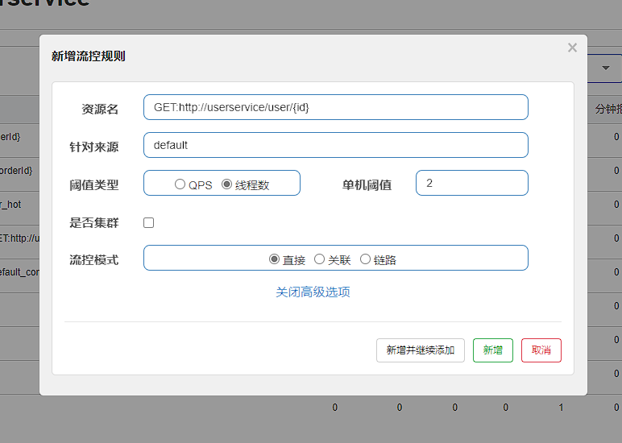


#### 6. 保存


#### 7. 进入jmeter


#### 8. 设置线程组


#### 9. 添加http请求


#### 10. 添加监听器


#### 11. 发起请求


#### 12. 查看结果


| 时间     | 通过 QPS | 拒绝QPS | 响应时间（ms） |
| -------- | -------- | ------- | -------------- |
| 13:39:37 | 598.0    | 0.0     | 2.0            |
| 13:39:36 | 576.0    | 0.0     | 3.0            |
| 13:39:35 | 604.0    | 0.0     | 3.0            |
| 13:39:34 | 608.0    | 0.0     | 2.0            |
| 13:39:33 | 512.0    | 0.0     | 3.0            |
| 13:39:32 | 548.0    | 0.0     | 3.0            |


|  ID  |   执行时间   |      线程组       |  lable   | 请求时间ms |  状态   | bytes | sent bytes | latency | 连接时间 |
| :--: | :----------: | :---------------: | :------: | :--: | :-----: | :--: | :--: | :--: | :--: |
| 1    | 13:39:04.996 | setUp线程组 1-1 | HTTP请求 | 124  | Success | 317  | 125  | 114  | 41   |
| 2    | 13:39:04.996 | setUp线程组 1-2 | HTTP请求 | 124  | Success | 317  | 125  | 114  | 41   |
| 3    | 13:39:05.121 | setUp线程组 1-1 | HTTP请求 | 9    | Success | 317  | 125  | 9    | 0    |
| 4    | 13:39:05.121 | setUp线程组 1-2 | HTTP请求 | 9    | Success | 317  | 125  | 9    | 0    |
| 5    | 13:39:05.131 | setUp线程组 1-2 | HTTP请求 | 9    | Success | 317  | 125  | 9    | 0    |
| 6    | 13:39:05.131 | setUp线程组 1-1 | HTTP请求 | 9    | Success | 317  | 125  | 9    | 0    |
| 7    | 13:39:05.140 | setUp线程组 1-1 | HTTP请求 | 10   | Success | 317  | 125  | 10   | 0    |
| 8    | 13:39:05.140 | setUp线程组 1-2 | HTTP请求 | 10   | Success | 317  | 125  | 10   | 0    |
| 9    | 13:39:05.150 | setUp线程组 1-1 | HTTP请求 | 10   | Success | 317  | 125  | 10   | 0    |
| 10   | 13:39:05.150 | setUp线程组 1-2 | HTTP请求 | 10   | Success | 317  | 125  | 10   | 0    |
| 11   | 13:39:05.160 | setUp线程组 1-1 | HTTP请求 | 10   | Success | 317  | 125  | 10   | 0    |
| 12   | 13:39:05.160 | setUp线程组 1-2 | HTTP请求 | 10   | Success | 317  | 125  | 10   | 0    |
| 13   | 13:39:05.170 | setUp线程组 1-1 | HTTP请求 | 10   | Success | 317  | 125  | 10   | 0    |
| 14   | 13:39:05.170 | setUp线程组 1-2 | HTTP请求 | 10   | Success | 317  | 125  | 10   | 0    |
| 15   | 13:39:05.180 | setUp线程组 1-2 | HTTP请求 | 12   | Success | 317  | 125  | 12   | 0    |
| 16   | 13:39:05.180 | setUp线程组 1-1 | HTTP请求 | 13   | Success | 317  | 125  | 13   | 0    |
| 17   | 13:39:05.193 | setUp线程组 1-1 | HTTP请求 | 9    | Success | 317  | 125  | 9    | 0    |
| 18   | 13:39:05.193 | setUp线程组 1-2 | HTTP请求 | 9    | Success | 317  | 125  | 9    | 0    |
| 19   | 13:39:05.202 | setUp线程组 1-1 | HTTP请求 | 8    | Success | 317  | 125  | 8    | 0    |
| 20   | 13:39:05.202 | setUp线程组 1-2 | HTTP请求 | 8    | Success | 317  | 125  | 8    | 0    |
| 21   | 13:39:05.210 | setUp线程组 1-1 | HTTP请求 | 9    | Success | 317  | 125  | 9    | 0    |
| 22   | 13:39:05.210 | setUp线程组 1-2 | HTTP请求 | 9    | Success | 317  | 125  | 9    | 0    |
| 23   | 13:39:05.219 | setUp线程组 1-2 | HTTP请求 | 8    | Success | 317  | 125  | 8    | 0    |
| 24   | 13:39:05.219 | setUp线程组 1-1 | HTTP请求 | 8    | Success | 317  | 125  | 8    | 0    |
| 25   | 13:39:05.227 | setUp线程组 1-2 | HTTP请求 | 8    | Success | 317  | 125  | 8    | 0    |
| 26   | 13:39:05.227 | setUp线程组 1-1 | HTTP请求 | 8    | Success | 317  | 125  | 8    | 0    |
| 27   | 13:39:05.235 | setUp线程组 1-1 | HTTP请求 | 8    | Success | 317  | 125  | 8    | 0    |
| 28   | 13:39:05.235 | setUp线程组 1-2 | HTTP请求 | 8    | Success | 317  | 125  | 8    | 0    |
| 29   | 13:39:05.243 | setUp线程组 1-2 | HTTP请求 | 7    | Success | 317  | 125  | 7    | 0    |
| 30   | 13:39:05.243 | setUp线程组 1-1 | HTTP请求 | 7    | Success | 317  | 125  | 7    | 0    |
| 31   | 13:39:05.250 | setUp线程组 1-1 | HTTP请求 | 8    | Success | 317  | 125  | 8    | 0    |
| 32   | 13:39:05.250 | setUp线程组 1-2 | HTTP请求 | 8    | Success | 317  | 125  | 8    | 0    |
| 33   | 13:39:05.258 | setUp线程组 1-2 | HTTP请求 | 7    | Success | 317  | 125  | 7    | 0    |
| 34   | 13:39:05.258 | setUp线程组 1-1 | HTTP请求 | 7    | Success | 317  | 125  | 7    | 0    |
| 35   | 13:39:05.265 | setUp线程组 1-1 | HTTP请求 | 7    | Success | 317  | 125  | 7    | 0    |
| 36   | 13:39:05.265 | setUp线程组 1-2 | HTTP请求 | 7    | Success | 317  | 125  | 7    | 0    |
| 37   | 13:39:05.272 | setUp线程组 1-2 | HTTP请求 | 8    | Success | 317  | 125  | 8    | 0    |
| 38   | 13:39:05.272 | setUp线程组 1-1 | HTTP请求 | 8    | Success | 317  | 125  | 8    | 0    |
| 39   | 13:39:05.280 | setUp线程组 1-1 | HTTP请求 | 8    | Success | 317  | 125  | 8    | 0    |
| 40   | 13:39:05.280 | setUp线程组 1-2 | HTTP请求 | 8    | Success | 317  | 125  | 8    | 0    |
| 41   | 13:39:05.288 | setUp线程组 1-1 | HTTP请求 | 7    | Success | 317  | 125  | 7    | 0    |
| 42   | 13:39:05.288 | setUp线程组 1-2 | HTTP请求 | 7    | Success | 317  | 125  | 7    | 0    |
| 43   | 13:39:05.296 | setUp线程组 1-2 | HTTP请求 | 8    | Success | 317  | 125  | 7    | 0    |
| 44   | 13:39:05.296 | setUp线程组 1-1 | HTTP请求 | 8    | Success | 317  | 125  | 7    | 0    |
| 45   | 13:39:05.304 | setUp线程组 1-1 | HTTP请求 | 8    | Success | 317  | 125  | 8    | 0    |
| 46   | 13:39:05.304 | setUp线程组 1-2 | HTTP请求 | 8    | Success | 317  | 125  | 8    | 0    |
| 47   | 13:39:05.312 | setUp线程组 1-2 | HTTP请求 | 8    | Success | 317  | 125  | 8    | 0    |
| 48   | 13:39:05.312 | setUp线程组 1-1 | HTTP请求 | 8    | Success | 317  | 125  | 8    | 0    |
| 49   | 13:39:05.320 | setUp线程组 1-1 | HTTP请求 | 9    | Success | 317  | 125  | 9    | 0    |
| 50   | 13:39:05.320 | setUp线程组 1-2 | HTTP请求 | 9    | Success | 317  | 125  | 9    | 0    |
| 51   | 13:39:05.329 | setUp线程组 1-1 | HTTP请求 | 8    | Success | 317  | 125  | 8    | 0    |
| 52   | 13:39:05.329 | setUp线程组 1-2 | HTTP请求 | 8    | Success | 317  | 125  | 8    | 0    |
| 53   | 13:39:05.338 | setUp线程组 1-1 | HTTP请求 | 9    | Success | 317  | 125  | 9    | 0    |
| 54   | 13:39:05.338 | setUp线程组 1-2 | HTTP请求 | 9    | Success | 317  | 125  | 9    | 0    |
| 55   | 13:39:05.348 | setUp线程组 1-1 | HTTP请求 | 8    | Success | 317  | 125  | 8    | 0    |
| 56   | 13:39:05.348 | setUp线程组 1-2 | HTTP请求 | 8    | Success | 317  | 125  | 8    | 0    |
| 57   | 13:39:05.356 | setUp线程组 1-2 | HTTP请求 | 9    | Success | 317  | 125  | 9    | 0    |
| 58   | 13:39:05.356 | setUp线程组 1-1 | HTTP请求 | 9    | Success | 317  | 125  | 9    | 0    |
| 59   | 13:39:05.365 | setUp线程组 1-2 | HTTP请求 | 9    | Success | 317  | 125  | 9    | 0    |
| 60   | 13:39:05.365 | setUp线程组 1-1 | HTTP请求 | 9    | Success | 317  | 125  | 9    | 0    |
| 61   | 13:39:05.374 | setUp线程组 1-2 | HTTP请求 | 9    | Success | 317  | 125  | 9    | 0    |
| 62   | 13:39:05.374 | setUp线程组 1-1 | HTTP请求 | 9    | Success | 317  | 125  | 9    | 0    |


每秒500左右的QPS，线程数为2，请求都能通过


#### 13. 进入jmeter


#### 14. 更改线程组


更改为4个线程


#### 15.  清理上一次的结果


#### 16. 发起请求


#### 17. 查看结果


| 时间     | 通过 QPS | 拒绝QPS | 响应时间（ms） |
| -------- | -------- | ------- | -------------- |
| 13:48:29 | 701.0    | 965.0   | 2.0            |
| 13:48:28 | 662.0    | 872.0   | 2.0            |
| 13:48:27 | 634.0    | 715.0   | 2.0            |
| 13:48:26 | 619.0    | 710.0   | 2.0            |
| 13:48:25 | 635.0    | 737.0   | 2.0            |
| 13:48:24 | 687.0    | 879.0   | 2.0            |


| 时间     | 通过 QPS | 拒绝QPS | 响应时间（ms） |
| -------- | -------- | ------- | -------------- |
| 13:49:46 | 677.0    | 813.0   | 2.0            |
| 13:49:45 | 690.0    | 874.0   | 2.0            |
| 13:49:44 | 676.0    | 922.0   | 2.0            |
| 13:49:43 | 677.0    | 888.0   | 2.0            |
| 13:49:42 | 648.0    | 869.0   | 2.0            |
| 13:49:41 | 683.0    | 887.0   | 2.0            |


|  ID  |   执行时间   |      线程组       |  lable   | 请求时间ms |  状态   | bytes | sent bytes | latency | 连接时间 |
| :--: | :----------: | :---------------: | :------: | :--: | :-----: | :--: | :--: | :--: | :--: |
| 1    | 13:47:49.297 | setUp线程组 1-4 | HTTP请求 | 61   | Success | 317  | 125  | 60   | 1    |
| 2    | 13:47:49.297 | setUp线程组 1-2 | HTTP请求 | 61   | Success | 317  | 125  | 61   | 1    |
| 3    | 13:47:49.358 | setUp线程组 1-4 | HTTP请求 | 4    | Success | 317  | 125  | 4    | 0    |
| 4    | 13:47:49.358 | setUp线程组 1-2 | HTTP请求 | 4    | Success | 317  | 125  | 4    | 0    |
| 5    | 13:47:49.297 | setUp线程组 1-1 | HTTP请求 | 68   | Success | 300  | 125  | 68   | 1    |
| 6    | 13:47:49.297 | setUp线程组 1-3 | HTTP请求 | 68   | Success | 300  | 125  | 68   | 1    |
| 7    | 13:47:49.362 | setUp线程组 1-2 | HTTP请求 | 4    | Success | 317  | 125  | 4    | 0    |
| 8    | 13:47:49.362 | setUp线程组 1-4 | HTTP请求 | 4    | Success | 317  | 125  | 4    | 0    |
| 9    | 13:47:49.366 | setUp线程组 1-2 | HTTP请求 | 2    | Success | 300  | 125  | 2    | 0    |
| 10   | 13:47:49.366 | setUp线程组 1-4 | HTTP请求 | 2    | Success | 300  | 125  | 2    | 0    |
| 11   | 13:47:49.365 | setUp线程组 1-3 | HTTP请求 | 5    | Success | 317  | 125  | 5    | 0    |
| 12   | 13:47:49.368 | setUp线程组 1-4 | HTTP请求 | 2    | Success | 300  | 125  | 2    | 0    |
| 13   | 13:47:49.365 | setUp线程组 1-1 | HTTP请求 | 5    | Success | 317  | 125  | 5    | 0    |
| 14   | 13:47:49.370 | setUp线程组 1-4 | HTTP请求 | 2    | Success | 300  | 125  | 2    | 0    |
| 15   | 13:47:49.368 | setUp线程组 1-2 | HTTP请求 | 4    | Success | 317  | 125  | 4    | 0    |
| 16   | 13:47:49.372 | setUp线程组 1-2 | HTTP请求 | 2    | Success | 300  | 125  | 2    | 0    |
| 17   | 13:47:49.372 | setUp线程组 1-4 | HTTP请求 | 2    | Success | 300  | 125  | 2    | 0    |
| 18   | 13:47:49.370 | setUp线程组 1-3 | HTTP请求 | 4    | Success | 317  | 125  | 4    | 0    |
| 19   | 13:47:49.370 | setUp线程组 1-1 | HTTP请求 | 4    | Success | 317  | 125  | 4    | 0    |
| 20   | 13:47:49.374 | setUp线程组 1-1 | HTTP请求 | 2    | Success | 300  | 125  | 2    | 0    |
| 21   | 13:47:49.374 | setUp线程组 1-2 | HTTP请求 | 2    | Success | 300  | 125  | 2    | 0    |
| 22   | 13:47:49.376 | setUp线程组 1-2 | HTTP请求 | 2    | Success | 300  | 125  | 2    | 0    |
| 23   | 13:47:49.376 | setUp线程组 1-1 | HTTP请求 | 2    | Success | 300  | 125  | 2    | 0    |
| 24   | 13:47:49.374 | setUp线程组 1-3 | HTTP请求 | 4    | Success | 317  | 125  | 4    | 0    |
| 25   | 13:47:49.374 | setUp线程组 1-4 | HTTP请求 | 4    | Success | 317  | 125  | 4    | 0    |
| 26   | 13:47:49.378 | setUp线程组 1-1 | HTTP请求 | 2    | Success | 300  | 125  | 2    | 0    |
| 27   | 13:47:49.378 | setUp线程组 1-2 | HTTP请求 | 2    | Success | 300  | 125  | 2    | 0    |
| 28   | 13:47:49.378 | setUp线程组 1-4 | HTTP请求 | 3    | Success | 317  | 125  | 3    | 0    |
| 29   | 13:47:49.378 | setUp线程组 1-3 | HTTP请求 | 3    | Success | 317  | 125  | 3    | 0    |
| 30   | 13:47:49.381 | setUp线程组 1-4 | HTTP请求 | 2    | Success | 300  | 125  | 2    | 0    |
| 31   | 13:47:49.380 | setUp线程组 1-1 | HTTP请求 | 3    | Success | 317  | 125  | 3    | 0    |
| 32   | 13:47:49.380 | setUp线程组 1-2 | HTTP请求 | 3    | Success | 317  | 125  | 3    | 0    |
| 33   | 13:47:49.381 | setUp线程组 1-3 | HTTP请求 | 2    | Success | 300  | 125  | 2    | 0    |
| 34   | 13:47:49.383 | setUp线程组 1-3 | HTTP请求 | 2    | Success | 300  | 125  | 2    | 0    |
| 35   | 13:47:49.383 | setUp线程组 1-2 | HTTP请求 | 2    | Success | 300  | 125  | 2    | 0    |
| 36   | 13:47:49.383 | setUp线程组 1-1 | HTTP请求 | 4    | Success | 317  | 125  | 3    | 0    |
| 37   | 13:47:49.383 | setUp线程组 1-4 | HTTP请求 | 4    | Success | 317  | 125  | 3    | 0    |
| 38   | 13:47:49.387 | setUp线程组 1-1 | HTTP请求 | 1    | Success | 300  | 125  | 1    | 0    |
| 39   | 13:47:49.387 | setUp线程组 1-4 | HTTP请求 | 1    | Success | 300  | 125  | 1    | 0    |
| 40   | 13:47:49.385 | setUp线程组 1-3 | HTTP请求 | 3    | Success | 317  | 125  | 3    | 0    |
| 41   | 13:47:49.385 | setUp线程组 1-2 | HTTP请求 | 3    | Success | 317  | 125  | 3    | 0    |
| 42   | 13:47:49.388 | setUp线程组 1-3 | HTTP请求 | 2    | Success | 300  | 125  | 2    | 0    |
| 43   | 13:47:49.388 | setUp线程组 1-2 | HTTP请求 | 2    | Success | 300  | 125  | 2    | 0    |
| 44   | 13:47:49.390 | setUp线程组 1-3 | HTTP请求 | 2    | Success | 300  | 125  | 2    | 0    |
| 45   | 13:47:49.390 | setUp线程组 1-2 | HTTP请求 | 2    | Success | 300  | 125  | 2    | 0    |
| 46   | 13:47:49.388 | setUp线程组 1-1 | HTTP请求 | 4    | Success | 317  | 125  | 4    | 0    |
| 47   | 13:47:49.388 | setUp线程组 1-4 | HTTP请求 | 4    | Success | 317  | 125  | 4    | 0    |
| 48   | 13:47:49.392 | setUp线程组 1-3 | HTTP请求 | 1    | Success | 300  | 125  | 1    | 0    |
| 49   | 13:47:49.392 | setUp线程组 1-1 | HTTP请求 | 2    | Success | 300  | 125  | 2    | 0    |
| 50   | 13:47:49.393 | setUp线程组 1-3 | HTTP请求 | 2    | Success | 300  | 125  | 2    | 0    |
| 51   | 13:47:49.394 | setUp线程组 1-1 | HTTP请求 | 1    | Success | 300  | 125  | 1    | 0    |
| 52   | 13:47:49.392 | setUp线程组 1-4 | HTTP请求 | 3    | Success | 317  | 125  | 3    | 0    |
| 53   | 13:47:49.392 | setUp线程组 1-2 | HTTP请求 | 3    | Success | 317  | 125  | 3    | 0    |
| 54   | 13:47:49.395 | setUp线程组 1-3 | HTTP请求 | 2    | Success | 300  | 125  | 2    | 0    |
| 55   | 13:47:49.395 | setUp线程组 1-2 | HTTP请求 | 2    | Success | 300  | 125  | 2    | 0    |
| 56   | 13:47:49.397 | setUp线程组 1-3 | HTTP请求 | 2    | Success | 300  | 125  | 1    | 0    |
| 57   | 13:47:49.397 | setUp线程组 1-2 | HTTP请求 | 2    | Success | 300  | 125  | 1    | 0    |
| 58   | 13:47:49.395 | setUp线程组 1-4 | HTTP请求 | 4    | Success | 317  | 125  | 4    | 0    |
| 59   | 13:47:49.395 | setUp线程组 1-1 | HTTP请求 | 4    | Success | 317  | 125  | 4    | 0    |
| 60   | 13:47:49.399 | setUp线程组 1-2 | HTTP请求 | 1    | Success | 300  | 125  | 1    | 0    |
| 61   | 13:47:49.399 | setUp线程组 1-1 | HTTP请求 | 3    | Success | 300  | 125  | 2    | 0    |
| 62   | 13:47:49.401 | setUp线程组 1-2 | HTTP请求 | 1    | Success | 300  | 125  | 1    | 0    |
| 63   | 13:47:49.399 | setUp线程组 1-4 | HTTP请求 | 3    | Success | 317  | 125  | 3    | 0    |
| 64   | 13:47:49.399 | setUp线程组 1-3 | HTTP请求 | 4    | Success | 317  | 125  | 4    | 0    |
| 65   | 13:47:49.403 | setUp线程组 1-3 | HTTP请求 | 1    | Success | 300  | 125  | 1    | 0    |
| 66   | 13:47:49.403 | setUp线程组 1-4 | HTTP请求 | 1    | Success | 300  | 125  | 1    | 0    |
| 67   | 13:47:49.402 | setUp线程组 1-1 | HTTP请求 | 4    | Success | 317  | 125  | 4    | 0    |
| 68   | 13:47:49.402 | setUp线程组 1-2 | HTTP请求 | 4    | Success | 317  | 125  | 4    | 0    |
| 69   | 13:47:49.406 | setUp线程组 1-2 | HTTP请求 | 2    | Success | 300  | 125  | 1    | 0    |
| 70   | 13:47:49.406 | setUp线程组 1-1 | HTTP请求 | 2    | Success | 300  | 125  | 1    | 0    |
| 71   | 13:47:49.404 | setUp线程组 1-4 | HTTP请求 | 4    | Success | 317  | 125  | 4    | 0    |
| 72   | 13:47:49.404 | setUp线程组 1-3 | HTTP请求 | 4    | Success | 317  | 125  | 4    | 0    |


通过的请求和拒绝的请求大概是1比1


### 熔断降级

熔断降级是解决雪崩问题的重要手段。其思路是由断路器统计服务调用的异常比例、慢请求比例，如果超出阈值则会 熔断该服务。即拦截访问该服务的一切请求；而当服务恢复时，断路器会放行访问该服务的请求。


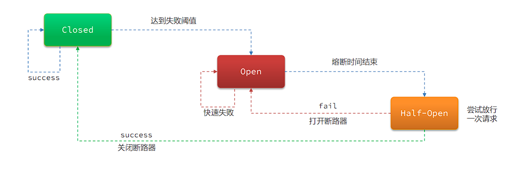


断路器熔断策略有三种：慢调用、异常比例、异常数


### 熔断策略-慢调用

慢调用：业务的响应时长（RT）大于指定时长的请求认定为慢调用请求。在指定时间内，如果请求数量超过设定的 最小数量，慢调用比例大于设定的阈值，则触发熔断


RT超过500ms的调用是慢调用，统计最近10000ms内的请求，如果请求量超过10次，并且慢调用比例不低于 0.5，则触发熔断，熔断时长为5秒。然后进入half-open状态，放行一次请求做测试


### 实现熔断策略-慢调用

需求：给 UserClient的查询用户接口设置降级规则，慢调用的RT阈值为50ms，统计时间为1秒，最 小请求数量为5，失败阈值比例为0.4，熔断时长为5


#### 1. 更改UserService业务


UserController：

```java
package mao.user_service.controller;

import lombok.extern.slf4j.Slf4j;

import mao.user_service.entity.User;
import mao.user_service.service.UserService;
import org.springframework.web.bind.annotation.*;

import javax.annotation.Resource;

/**
 * Project name(项目名称)：spring_cloud_demo
 * Package(包名): mao.user_service.controller
 * Class(类名): UserController
 * Author(作者）: mao
 * Author QQ：1296193245
 * GitHub：https://github.com/maomao124/
 * Date(创建日期)： 2022/7/9
 * Time(创建时间)： 13:51
 * Version(版本): 1.0
 * Description(描述)： UserController
 */

@Slf4j
@RestController
@RequestMapping("/user")
public class UserController
{
    @Resource
    private UserService userService;

    /**
     * 获取用户信息
     *
     * @param id 用户的id
     * @return User
     */
    @GetMapping("/{id}")
    public User queryById(@PathVariable("id") Long id, @RequestHeader(name = "key1",required = false) String key1)
    {
        //log.debug("user被访问了："+id);
        log.info("请求头key1：" + key1);
        if (id==1)
        {
            //一定概率触发
            if (Math.random()<0.8)
            {
                try
                {
                    //100毫秒，大于50毫秒
                    Thread.sleep(100);
                }
                catch (InterruptedException e)
                {
                    e.printStackTrace();
                }
            }
        }
        return userService.queryById(id);
    }
}

```


#### 2. 启动服务


#### 3. 访问


http://localhost:8081/order/101


```sh
2022-07-21 18:19:01.699  INFO 23092 --- [nio-8081-exec-2] o.a.c.c.C.[Tomcat].[localhost].[/]       : Initializing Spring DispatcherServlet 'dispatcherServlet'
2022-07-21 18:19:01.699  INFO 23092 --- [nio-8081-exec-2] o.s.web.servlet.DispatcherServlet        : Initializing Servlet 'dispatcherServlet'
2022-07-21 18:19:01.703  INFO 23092 --- [nio-8081-exec-2] o.s.web.servlet.DispatcherServlet        : Completed initialization in 4 ms
INFO: Sentinel log output type is: file
INFO: Sentinel log charset is: utf-8
INFO: Sentinel log base directory is: C:\Users\mao\logs\csp\
INFO: Sentinel log name use pid is: false
2022-07-21 18:19:01.997 DEBUG 23092 --- [nio-8081-exec-2] m.o.mapper.OrderMapper.findById          : ==>  Preparing: select * from tb_order where id = ?
2022-07-21 18:19:02.016 DEBUG 23092 --- [nio-8081-exec-2] m.o.mapper.OrderMapper.findById          : ==> Parameters: 101(Long)
2022-07-21 18:19:02.035 DEBUG 23092 --- [nio-8081-exec-2] m.o.mapper.OrderMapper.findById          : <==      Total: 1
2022-07-21 18:19:02.040 DEBUG 23092 --- [nio-8081-exec-2] mao.feign.feign.UserClient               : [UserClient#queryById] ---> GET http://userservice/user/1 HTTP/1.1
2022-07-21 18:19:02.523 DEBUG 23092 --- [nio-8081-exec-2] mao.feign.feign.UserClient               : [UserClient#queryById] <--- HTTP/1.1 200  (481ms)
2022-07-21 18:19:25.584 DEBUG 23092 --- [nio-8081-exec-2] m.o.mapper.OrderMapper.findById          : ==>  Preparing: select * from tb_order where id = ?
2022-07-21 18:19:25.585 DEBUG 23092 --- [nio-8081-exec-2] m.o.mapper.OrderMapper.findById          : ==> Parameters: 101(Long)
2022-07-21 18:19:25.586 DEBUG 23092 --- [nio-8081-exec-2] m.o.mapper.OrderMapper.findById          : <==      Total: 1
2022-07-21 18:19:25.587 DEBUG 23092 --- [nio-8081-exec-2] mao.feign.feign.UserClient               : [UserClient#queryById] ---> GET http://userservice/user/1 HTTP/1.1
2022-07-21 18:19:25.705 DEBUG 23092 --- [nio-8081-exec-2] mao.feign.feign.UserClient               : [UserClient#queryById] <--- HTTP/1.1 200  (117ms)
2022-07-21 18:19:27.235 DEBUG 23092 --- [nio-8081-exec-5] m.o.mapper.OrderMapper.findById          : ==>  Preparing: select * from tb_order where id = ?
2022-07-21 18:19:27.235 DEBUG 23092 --- [nio-8081-exec-5] m.o.mapper.OrderMapper.findById          : ==> Parameters: 101(Long)
2022-07-21 18:19:27.237 DEBUG 23092 --- [nio-8081-exec-5] m.o.mapper.OrderMapper.findById          : <==      Total: 1
2022-07-21 18:19:27.237 DEBUG 23092 --- [nio-8081-exec-5] mao.feign.feign.UserClient               : [UserClient#queryById] ---> GET http://userservice/user/1 HTTP/1.1
2022-07-21 18:19:27.242 DEBUG 23092 --- [nio-8081-exec-5] mao.feign.feign.UserClient               : [UserClient#queryById] <--- HTTP/1.1 200  (4ms)
2022-07-21 18:19:27.981 DEBUG 23092 --- [nio-8081-exec-6] m.o.mapper.OrderMapper.findById          : ==>  Preparing: select * from tb_order where id = ?
2022-07-21 18:19:27.981 DEBUG 23092 --- [nio-8081-exec-6] m.o.mapper.OrderMapper.findById          : ==> Parameters: 101(Long)
2022-07-21 18:19:27.982 DEBUG 23092 --- [nio-8081-exec-6] m.o.mapper.OrderMapper.findById          : <==      Total: 1
2022-07-21 18:19:27.983 DEBUG 23092 --- [nio-8081-exec-6] mao.feign.feign.UserClient               : [UserClient#queryById] ---> GET http://userservice/user/1 HTTP/1.1
2022-07-21 18:19:28.094 DEBUG 23092 --- [nio-8081-exec-6] mao.feign.feign.UserClient               : [UserClient#queryById] <--- HTTP/1.1 200  (111ms)
2022-07-21 18:19:30.051 DEBUG 23092 --- [nio-8081-exec-9] m.o.mapper.OrderMapper.findById          : ==>  Preparing: select * from tb_order where id = ?
2022-07-21 18:19:30.051 DEBUG 23092 --- [nio-8081-exec-9] m.o.mapper.OrderMapper.findById          : ==> Parameters: 101(Long)
2022-07-21 18:19:30.053 DEBUG 23092 --- [nio-8081-exec-9] m.o.mapper.OrderMapper.findById          : <==      Total: 1
2022-07-21 18:19:30.054 DEBUG 23092 --- [nio-8081-exec-9] mao.feign.feign.UserClient               : [UserClient#queryById] ---> GET http://userservice/user/1 HTTP/1.1
2022-07-21 18:19:30.165 DEBUG 23092 --- [nio-8081-exec-9] mao.feign.feign.UserClient               : [UserClient#queryById] <--- HTTP/1.1 200  (111ms)
2022-07-21 18:19:30.828 DEBUG 23092 --- [nio-8081-exec-1] m.o.mapper.OrderMapper.findById          : ==>  Preparing: select * from tb_order where id = ?
2022-07-21 18:19:30.828 DEBUG 23092 --- [nio-8081-exec-1] m.o.mapper.OrderMapper.findById          : ==> Parameters: 101(Long)
2022-07-21 18:19:30.829 DEBUG 23092 --- [nio-8081-exec-1] m.o.mapper.OrderMapper.findById          : <==      Total: 1
2022-07-21 18:19:30.830 DEBUG 23092 --- [nio-8081-exec-1] mao.feign.feign.UserClient               : [UserClient#queryById] ---> GET http://userservice/user/1 HTTP/1.1
2022-07-21 18:19:30.945 DEBUG 23092 --- [nio-8081-exec-1] mao.feign.feign.UserClient               : [UserClient#queryById] <--- HTTP/1.1 200  (114ms)
2022-07-21 18:19:31.406 DEBUG 23092 --- [nio-8081-exec-3] m.o.mapper.OrderMapper.findById          : ==>  Preparing: select * from tb_order where id = ?
2022-07-21 18:19:31.406 DEBUG 23092 --- [nio-8081-exec-3] m.o.mapper.OrderMapper.findById          : ==> Parameters: 101(Long)
2022-07-21 18:19:31.408 DEBUG 23092 --- [nio-8081-exec-3] m.o.mapper.OrderMapper.findById          : <==      Total: 1
2022-07-21 18:19:31.408 DEBUG 23092 --- [nio-8081-exec-3] mao.feign.feign.UserClient               : [UserClient#queryById] ---> GET http://userservice/user/1 HTTP/1.1
2022-07-21 18:19:31.413 DEBUG 23092 --- [nio-8081-exec-3] mao.feign.feign.UserClient               : [UserClient#queryById] <--- HTTP/1.1 200  (4ms)
2022-07-21 18:19:31.916 DEBUG 23092 --- [nio-8081-exec-4] m.o.mapper.OrderMapper.findById          : ==>  Preparing: select * from tb_order where id = ?
2022-07-21 18:19:31.916 DEBUG 23092 --- [nio-8081-exec-4] m.o.mapper.OrderMapper.findById          : ==> Parameters: 101(Long)
2022-07-21 18:19:31.918 DEBUG 23092 --- [nio-8081-exec-4] m.o.mapper.OrderMapper.findById          : <==      Total: 1
2022-07-21 18:19:31.919 DEBUG 23092 --- [nio-8081-exec-4] mao.feign.feign.UserClient               : [UserClient#queryById] ---> GET http://userservice/user/1 HTTP/1.1
2022-07-21 18:19:32.034 DEBUG 23092 --- [nio-8081-exec-4] mao.feign.feign.UserClient               : [UserClient#queryById] <--- HTTP/1.1 200  (115ms)
```


#### 4. 进入sentinel控制台


#### 5. 添加降级策略


#### 6. 编写降级策略


#### 7. 提交保存


#### 8. 进入jmeter


#### 9. 设置线程组


#### 10. 发起请求


#### 11. 结果


| 时间     | 通过 QPS | 拒绝QPS | 响应时间（ms） |
| -------- | -------- | ------- | -------------- |
| 18:27:28 | 0.0      | 7.0     | 0.0            |
| 18:27:27 | 0.0      | 10.0    | 0.0            |
| 18:27:26 | 0.0      | 10.0    | 0.0            |
| 18:27:25 | 0.0      | 10.0    | 0.0            |
| 18:27:24 | 1.0      | 9.0     | 117.0          |
| 18:27:23 | 0.0      | 10.0    | 0.0            |


|  ID  |   执行时间   |      线程组       |  lable   | 请求时间ms |  状态   | bytes | sent bytes | latency | 连接时间 |
| :--: | :----------: | :---------------: | :------: | :--: | :-----: | :--: | :--: | :--: | :--: |
| 1    | 18:27:18.727 | setUp线程组 1-1   | HTTP请求 | 178  | Success | 317  | 125  | 178  | 5    |
| 2    | 18:27:18.837 | setUp线程组 1-2   | HTTP请求 | 114  | Success | 317  | 125  | 113  | 1    |
| 3    | 18:27:18.931 | setUp线程组 1-3   | HTTP请求 | 114  | Success | 317  | 125  | 114  | 0    |
| 4    | 18:27:19.024 | setUp线程组 1-4   | HTTP请求 | 116  | Success | 317  | 125  | 116  | 0    |
| 5    | 18:27:19.124 | setUp线程组 1-5   | HTTP请求 | 111  | Success | 317  | 125  | 111  | 1    |
| 6    | 18:27:19.225 | setUp线程组 1-6   | HTTP请求 | 121  | Success | 317  | 125  | 121  | 2    |
| 7    | 18:27:19.323 | setUp线程组 1-7   | HTTP请求 | 119  | Success | 317  | 125  | 119  | 1    |
| 8    | 18:27:19.525 | setUp线程组 1-9   | HTTP请求 | 16   | Success | 300  | 125  | 16   | 1    |
| 9    | 18:27:19.425 | setUp线程组 1-8   | HTTP请求 | 130  | Success | 317  | 125  | 130  | 1    |
| 10   | 18:27:19.626 | setUp线程组 1-10  | HTTP请求 | 4    | Success | 300  | 125  | 4    | 0    |
| 11   | 18:27:19.724 | setUp线程组 1-11  | HTTP请求 | 4    | Success | 300  | 125  | 4    | 0    |
| 12   | 18:27:19.822 | setUp线程组 1-12  | HTTP请求 | 4    | Success | 300  | 125  | 4    | 1    |
| 13   | 18:27:19.922 | setUp线程组 1-13  | HTTP请求 | 4    | Success | 300  | 125  | 4    | 1    |
| 14   | 18:27:20.022 | setUp线程组 1-14  | HTTP请求 | 5    | Success | 300  | 125  | 5    | 1    |
| 15   | 18:27:20.122 | setUp线程组 1-15  | HTTP请求 | 4    | Success | 300  | 125  | 4    | 0    |
| 16   | 18:27:20.223 | setUp线程组 1-16  | HTTP请求 | 4    | Success | 300  | 125  | 4    | 0    |
| 17   | 18:27:20.323 | setUp线程组 1-17  | HTTP请求 | 4    | Success | 300  | 125  | 4    | 1    |
| 18   | 18:27:20.424 | setUp线程组 1-18  | HTTP请求 | 4    | Success | 300  | 125  | 4    | 0    |
| 19   | 18:27:20.524 | setUp线程组 1-19  | HTTP请求 | 4    | Success | 300  | 125  | 4    | 0    |
| 20   | 18:27:20.622 | setUp线程组 1-20  | HTTP请求 | 5    | Success | 300  | 125  | 4    | 1    |
| 21   | 18:27:20.723 | setUp线程组 1-21  | HTTP请求 | 5    | Success | 300  | 125  | 5    | 1    |
| 22   | 18:27:20.823 | setUp线程组 1-22  | HTTP请求 | 5    | Success | 300  | 125  | 5    | 2    |
| 23   | 18:27:20.923 | setUp线程组 1-23  | HTTP请求 | 4    | Success | 300  | 125  | 4    | 1    |
| 24   | 18:27:21.024 | setUp线程组 1-24  | HTTP请求 | 4    | Success | 300  | 125  | 4    | 0    |
| 25   | 18:27:21.124 | setUp线程组 1-25  | HTTP请求 | 4    | Success | 300  | 125  | 3    | 0    |
| 26   | 18:27:21.225 | setUp线程组 1-26  | HTTP请求 | 4    | Success | 300  | 125  | 4    | 1    |
| 27   | 18:27:21.323 | setUp线程组 1-27  | HTTP请求 | 4    | Success | 300  | 125  | 3    | 0    |
| 28   | 18:27:21.423 | setUp线程组 1-28  | HTTP请求 | 4    | Success | 300  | 125  | 4    | 0    |
| 29   | 18:27:21.524 | setUp线程组 1-29  | HTTP请求 | 4    | Success | 300  | 125  | 4    | 0    |
| 30   | 18:27:21.623 | setUp线程组 1-30  | HTTP请求 | 4    | Success | 300  | 125  | 4    | 1    |
| 31   | 18:27:21.723 | setUp线程组 1-31  | HTTP请求 | 4    | Success | 300  | 125  | 4    | 0    |
| 32   | 18:27:21.824 | setUp线程组 1-32  | HTTP请求 | 3    | Success | 300  | 125  | 3    | 0    |
| 33   | 18:27:21.923 | setUp线程组 1-33  | HTTP请求 | 4    | Success | 300  | 125  | 4    | 1    |
| 34   | 18:27:22.023 | setUp线程组 1-34  | HTTP请求 | 4    | Success | 300  | 125  | 4    | 0    |
| 35   | 18:27:22.122 | setUp线程组 1-35  | HTTP请求 | 4    | Success | 300  | 125  | 4    | 0    |
| 36   | 18:27:22.222 | setUp线程组 1-36  | HTTP请求 | 4    | Success | 300  | 125  | 4    | 1    |
| 37   | 18:27:22.323 | setUp线程组 1-37  | HTTP请求 | 4    | Success | 300  | 125  | 3    | 0    |
| 38   | 18:27:22.423 | setUp线程组 1-38  | HTTP请求 | 4    | Success | 300  | 125  | 4    | 0    |
| 39   | 18:27:22.525 | setUp线程组 1-39  | HTTP请求 | 4    | Success | 300  | 125  | 3    | 0    |
| 40   | 18:27:22.623 | setUp线程组 1-40  | HTTP请求 | 4    | Success | 300  | 125  | 4    | 1    |
| 41   | 18:27:22.723 | setUp线程组 1-41  | HTTP请求 | 5    | Success | 300  | 125  | 4    | 1    |
| 42   | 18:27:22.822 | setUp线程组 1-42  | HTTP请求 | 6    | Success | 300  | 125  | 6    | 0    |
| 43   | 18:27:22.922 | setUp线程组 1-43  | HTTP请求 | 4    | Success | 300  | 125  | 3    | 0    |
| 44   | 18:27:23.023 | setUp线程组 1-44  | HTTP请求 | 4    | Success | 300  | 125  | 4    | 1    |
| 45   | 18:27:23.122 | setUp线程组 1-45  | HTTP请求 | 4    | Success | 300  | 125  | 4    | 0    |
| 46   | 18:27:23.223 | setUp线程组 1-46  | HTTP请求 | 4    | Success | 300  | 125  | 3    | 0    |
| 47   | 18:27:23.324 | setUp线程组 1-47  | HTTP请求 | 4    | Success | 300  | 125  | 4    | 1    |
| 48   | 18:27:23.424 | setUp线程组 1-48  | HTTP请求 | 4    | Success | 300  | 125  | 4    | 1    |
| 49   | 18:27:23.525 | setUp线程组 1-49  | HTTP请求 | 4    | Success | 300  | 125  | 3    | 0    |
| 50   | 18:27:23.623 | setUp线程组 1-50  | HTTP请求 | 5    | Success | 300  | 125  | 5    | 1    |
| 51   | 18:27:23.723 | setUp线程组 1-51  | HTTP请求 | 4    | Success | 300  | 125  | 4    | 1    |
| 52   | 18:27:23.823 | setUp线程组 1-52  | HTTP请求 | 4    | Success | 300  | 125  | 4    | 1    |
| 53   | 18:27:23.923 | setUp线程组 1-53  | HTTP请求 | 5    | Success | 300  | 125  | 5    | 1    |
| 54   | 18:27:24.023 | setUp线程组 1-54  | HTTP请求 | 4    | Success | 300  | 125  | 4    | 1    |
| 55   | 18:27:24.124 | setUp线程组 1-55  | HTTP请求 | 8    | Success | 300  | 125  | 8    | 1    |
| 56   | 18:27:24.225 | setUp线程组 1-56  | HTTP请求 | 5    | Success | 300  | 125  | 4    | 1    |
| 57   | 18:27:24.324 | setUp线程组 1-57  | HTTP请求 | 5    | Success | 300  | 125  | 5    | 1    |
| 58   | 18:27:24.423 | setUp线程组 1-58  | HTTP请求 | 4    | Success | 300  | 125  | 4    | 0    |
| 59   | 18:27:24.624 | setUp线程组 1-60  | HTTP请求 | 5    | Success | 300  | 125  | 5    | 1    |
| 60   | 18:27:24.523 | setUp线程组 1-59  | HTTP请求 | 121  | Success | 317  | 125  | 121  | 1    |
| 61   | 18:27:24.722 | setUp线程组 1-61  | HTTP请求 | 4    | Success | 300  | 125  | 4    | 1    |
| 62   | 18:27:24.825 | setUp线程组 1-62  | HTTP请求 | 4    | Success | 300  | 125  | 4    | 1    |
| 63   | 18:27:24.924 | setUp线程组 1-63  | HTTP请求 | 5    | Success | 300  | 125  | 5    | 1    |
| 64   | 18:27:25.031 | setUp线程组 1-64  | HTTP请求 | 7    | Success | 300  | 125  | 7    | 2    |
| 65   | 18:27:25.124 | setUp线程组 1-65  | HTTP请求 | 4    | Success | 300  | 125  | 4    | 1    |
| 66   | 18:27:25.224 | setUp线程组 1-66  | HTTP请求 | 4    | Success | 300  | 125  | 4    | 1    |
| 67   | 18:27:25.325 | setUp线程组 1-67  | HTTP请求 | 4    | Success | 300  | 125  | 4    | 1    |
| 68   | 18:27:25.423 | setUp线程组 1-68  | HTTP请求 | 4    | Success | 300  | 125  | 4    | 0    |
| 69   | 18:27:25.523 | setUp线程组 1-69  | HTTP请求 | 4    | Success | 300  | 125  | 4    | 1    |
| 70   | 18:27:25.623 | setUp线程组 1-70  | HTTP请求 | 4    | Success | 300  | 125  | 4    | 0    |
| 71   | 18:27:25.722 | setUp线程组 1-71  | HTTP请求 | 4    | Success | 300  | 125  | 4    | 1    |
| 72   | 18:27:25.824 | setUp线程组 1-72  | HTTP请求 | 4    | Success | 300  | 125  | 4    | 0    |
| 73   | 18:27:25.924 | setUp线程组 1-73  | HTTP请求 | 3    | Success | 300  | 125  | 3    | 1    |
| 74   | 18:27:26.024 | setUp线程组 1-74  | HTTP请求 | 4    | Success | 300  | 125  | 4    | 0    |
| 75   | 18:27:26.125 | setUp线程组 1-75  | HTTP请求 | 4    | Success | 300  | 125  | 4    | 1    |
| 76   | 18:27:26.223 | setUp线程组 1-76  | HTTP请求 | 4    | Success | 300  | 125  | 4    | 1    |
| 77   | 18:27:26.323 | setUp线程组 1-77  | HTTP请求 | 4    | Success | 300  | 125  | 4    | 1    |
| 78   | 18:27:26.423 | setUp线程组 1-78  | HTTP请求 | 4    | Success | 300  | 125  | 4    | 0    |
| 79   | 18:27:26.523 | setUp线程组 1-79  | HTTP请求 | 5    | Success | 300  | 125  | 4    | 1    |
| 80   | 18:27:26.623 | setUp线程组 1-80  | HTTP请求 | 4    | Success | 300  | 125  | 4    | 1    |
| 81   | 18:27:26.724 | setUp线程组 1-81  | HTTP请求 | 4    | Success | 300  | 125  | 4    | 1    |
| 82   | 18:27:26.824 | setUp线程组 1-82  | HTTP请求 | 4    | Success | 300  | 125  | 3    | 1    |
| 83   | 18:27:26.925 | setUp线程组 1-83  | HTTP请求 | 4    | Success | 300  | 125  | 3    | 0    |
| 84   | 18:27:27.024 | setUp线程组 1-84  | HTTP请求 | 5    | Success | 300  | 125  | 5    | 1    |
| 85   | 18:27:27.123 | setUp线程组 1-85  | HTTP请求 | 4    | Success | 300  | 125  | 4    | 1    |
| 86   | 18:27:27.223 | setUp线程组 1-86  | HTTP请求 | 4    | Success | 300  | 125  | 4    | 1    |
| 87   | 18:27:27.323 | setUp线程组 1-87  | HTTP请求 | 5    | Success | 300  | 125  | 5    | 1    |
| 88   | 18:27:27.423 | setUp线程组 1-88  | HTTP请求 | 4    | Success | 300  | 125  | 4    | 0    |
| 89   | 18:27:27.523 | setUp线程组 1-89  | HTTP请求 | 4    | Success | 300  | 125  | 4    | 1    |
| 90   | 18:27:27.623 | setUp线程组 1-90  | HTTP请求 | 4    | Success | 300  | 125  | 4    | 1    |
| 91   | 18:27:27.724 | setUp线程组 1-91  | HTTP请求 | 4    | Success | 300  | 125  | 4    | 1    |
| 92   | 18:27:27.825 | setUp线程组 1-92  | HTTP请求 | 4    | Success | 300  | 125  | 3    | 1    |
| 93   | 18:27:27.923 | setUp线程组 1-93  | HTTP请求 | 4    | Success | 300  | 125  | 4    | 1    |
| 94   | 18:27:28.022 | setUp线程组 1-94  | HTTP请求 | 3    | Success | 300  | 125  | 3    | 0    |
| 95   | 18:27:28.123 | setUp线程组 1-95  | HTTP请求 | 4    | Success | 300  | 125  | 4    | 0    |
| 96   | 18:27:28.224 | setUp线程组 1-96  | HTTP请求 | 5    | Success | 300  | 125  | 5    | 1    |
| 97   | 18:27:28.323 | setUp线程组 1-97  | HTTP请求 | 4    | Success | 300  | 125  | 4    | 1    |
| 98   | 18:27:28.422 | setUp线程组 1-98  | HTTP请求 | 4    | Success | 300  | 125  | 4    | 1    |
| 99   | 18:27:28.523 | setUp线程组 1-99  | HTTP请求 | 4    | Success | 300  | 125  | 4    | 1    |
| 100  | 18:27:28.624 | setUp线程组 1-100 | HTTP请求 | 4    | Success | 300  | 125  | 4    | 1    |


#### 12. 更改业务代码


概率更改为0.3

```java
package mao.user_service.controller;

import lombok.extern.slf4j.Slf4j;

import mao.user_service.entity.User;
import mao.user_service.service.UserService;
import org.springframework.web.bind.annotation.*;

import javax.annotation.Resource;

/**
 * Project name(项目名称)：spring_cloud_demo
 * Package(包名): mao.user_service.controller
 * Class(类名): UserController
 * Author(作者）: mao
 * Author QQ：1296193245
 * GitHub：https://github.com/maomao124/
 * Date(创建日期)： 2022/7/9
 * Time(创建时间)： 13:51
 * Version(版本): 1.0
 * Description(描述)： UserController
 */

@Slf4j
@RestController
@RequestMapping("/user")
public class UserController
{
    @Resource
    private UserService userService;

    /**
     * 获取用户信息
     *
     * @param id 用户的id
     * @return User
     */
    @GetMapping("/{id}")
    public User queryById(@PathVariable("id") Long id, @RequestHeader(name = "key1",required = false) String key1)
    {
        //log.debug("user被访问了："+id);
        log.info("请求头key1：" + key1);
        if (id==1)
        {
            //一定概率触发
            if (Math.random()<0.3)
            {
                try
                {
                    //100毫秒，大于50毫秒
                    Thread.sleep(100);
                }
                catch (InterruptedException e)
                {
                    e.printStackTrace();
                }
            }
        }
        return userService.queryById(id);
    }
}
```


#### 13. 重启服务并访问一次


#### 14. 重新设置降级逻辑


#### 15. 发起请求


#### 16.  结果


|  ID  |   执行时间   |      线程组       |  lable   | 请求时间ms |  状态   | bytes | sent bytes | latency | 连接时间 |
| :--: | :----------: | :---------------: | :------: | :--: | :-----: | :--: | :--: | :--: | :--: |
| 1    | 18:43:12.626 | setUp线程组 1-1   | HTTP请求 | 62   | Success | 317  | 125  | 62   | 2    |
| 2    | 18:43:12.729 | setUp线程组 1-2   | HTTP请求 | 13   | Success | 317  | 125  | 12   | 1    |
| 3    | 18:43:12.838 | setUp线程组 1-3   | HTTP请求 | 11   | Success | 317  | 125  | 11   | 1    |
| 4    | 18:43:12.933 | setUp线程组 1-4   | HTTP请求 | 11   | Success | 317  | 125  | 11   | 1    |
| 5    | 18:43:13.028 | setUp线程组 1-5   | HTTP请求 | 13   | Success | 317  | 125  | 13   | 1    |
| 6    | 18:43:13.235 | setUp线程组 1-7   | HTTP请求 | 10   | Success | 317  | 125  | 10   | 1    |
| 7    | 18:43:13.140 | setUp线程组 1-6   | HTTP请求 | 115  | Success | 317  | 125  | 115  | 1    |
| 8    | 18:43:13.330 | setUp线程组 1-8   | HTTP请求 | 115  | Success | 317  | 125  | 115  | 1    |
| 9    | 18:43:13.441 | setUp线程组 1-9   | HTTP请求 | 10   | Success | 317  | 125  | 10   | 1    |
| 10   | 18:43:13.536 | setUp线程组 1-10  | HTTP请求 | 12   | Success | 317  | 125  | 12   | 2    |
| 11   | 18:43:13.729 | setUp线程组 1-12  | HTTP请求 | 11   | Success | 317  | 125  | 11   | 1    |
| 12   | 18:43:13.632 | setUp线程组 1-11  | HTTP请求 | 115  | Success | 317  | 125  | 114  | 1    |
| 13   | 18:43:13.827 | setUp线程组 1-13  | HTTP请求 | 125  | Success | 317  | 125  | 125  | 2    |
| 14   | 18:43:14.028 | setUp线程组 1-15  | HTTP请求 | 19   | Success | 300  | 125  | 19   | 1    |
| 15   | 18:43:13.928 | setUp线程组 1-14  | HTTP请求 | 121  | Success | 317  | 125  | 121  | 1    |
| 16   | 18:43:14.127 | setUp线程组 1-16  | HTTP请求 | 5    | Success | 300  | 125  | 5    | 1    |
| 17   | 18:43:14.229 | setUp线程组 1-17  | HTTP请求 | 5    | Success | 300  | 125  | 4    | 1    |
| 18   | 18:43:14.328 | setUp线程组 1-18  | HTTP请求 | 5    | Success | 300  | 125  | 5    | 1    |
| 19   | 18:43:14.429 | setUp线程组 1-19  | HTTP请求 | 5    | Success | 300  | 125  | 5    | 1    |
| 20   | 18:43:14.527 | setUp线程组 1-20  | HTTP请求 | 4    | Success | 300  | 125  | 4    | 1    |
| 21   | 18:43:14.627 | setUp线程组 1-21  | HTTP请求 | 5    | Success | 300  | 125  | 5    | 1    |
| 22   | 18:43:14.728 | setUp线程组 1-22  | HTTP请求 | 4    | Success | 300  | 125  | 4    | 1    |
| 23   | 18:43:14.828 | setUp线程组 1-23  | HTTP请求 | 4    | Success | 300  | 125  | 4    | 1    |
| 24   | 18:43:14.927 | setUp线程组 1-24  | HTTP请求 | 5    | Success | 300  | 125  | 5    | 1    |
| 25   | 18:43:15.029 | setUp线程组 1-25  | HTTP请求 | 4    | Success | 300  | 125  | 4    | 1    |
| 26   | 18:43:15.127 | setUp线程组 1-26  | HTTP请求 | 4    | Success | 300  | 125  | 4    | 1    |
| 27   | 18:43:15.227 | setUp线程组 1-27  | HTTP请求 | 5    | Success | 300  | 125  | 5    | 1    |
| 28   | 18:43:15.328 | setUp线程组 1-28  | HTTP请求 | 6    | Success | 300  | 125  | 6    | 1    |
| 29   | 18:43:15.427 | setUp线程组 1-29  | HTTP请求 | 4    | Success | 300  | 125  | 4    | 1    |
| 30   | 18:43:15.528 | setUp线程组 1-30  | HTTP请求 | 4    | Success | 300  | 125  | 4    | 1    |
| 31   | 18:43:15.628 | setUp线程组 1-31  | HTTP请求 | 4    | Success | 300  | 125  | 4    | 1    |
| 32   | 18:43:15.727 | setUp线程组 1-32  | HTTP请求 | 4    | Success | 300  | 125  | 4    | 1    |
| 33   | 18:43:15.828 | setUp线程组 1-33  | HTTP请求 | 4    | Success | 300  | 125  | 4    | 1    |
| 34   | 18:43:15.928 | setUp线程组 1-34  | HTTP请求 | 6    | Success | 300  | 125  | 5    | 1    |
| 35   | 18:43:16.028 | setUp线程组 1-35  | HTTP请求 | 4    | Success | 300  | 125  | 4    | 1    |
| 36   | 18:43:16.128 | setUp线程组 1-36  | HTTP请求 | 5    | Success | 300  | 125  | 5    | 1    |
| 37   | 18:43:16.228 | setUp线程组 1-37  | HTTP请求 | 4    | Success | 300  | 125  | 4    | 1    |
| 38   | 18:43:16.328 | setUp线程组 1-38  | HTTP请求 | 4    | Success | 300  | 125  | 4    | 1    |
| 39   | 18:43:16.426 | setUp线程组 1-39  | HTTP请求 | 4    | Success | 300  | 125  | 4    | 1    |
| 40   | 18:43:16.527 | setUp线程组 1-40  | HTTP请求 | 4    | Success | 300  | 125  | 4    | 1    |
| 41   | 18:43:16.627 | setUp线程组 1-41  | HTTP请求 | 5    | Success | 300  | 125  | 5    | 2    |
| 42   | 18:43:16.727 | setUp线程组 1-42  | HTTP请求 | 5    | Success | 300  | 125  | 5    | 1    |
| 43   | 18:43:16.827 | setUp线程组 1-43  | HTTP请求 | 4    | Success | 300  | 125  | 4    | 1    |
| 44   | 18:43:16.927 | setUp线程组 1-44  | HTTP请求 | 4    | Success | 300  | 125  | 4    | 1    |
| 45   | 18:43:17.027 | setUp线程组 1-45  | HTTP请求 | 5    | Success | 300  | 125  | 5    | 1    |
| 46   | 18:43:17.127 | setUp线程组 1-46  | HTTP请求 | 5    | Success | 300  | 125  | 5    | 1    |
| 47   | 18:43:17.229 | setUp线程组 1-47  | HTTP请求 | 4    | Success | 300  | 125  | 4    | 1    |
| 48   | 18:43:17.327 | setUp线程组 1-48  | HTTP请求 | 4    | Success | 300  | 125  | 4    | 1    |
| 49   | 18:43:17.427 | setUp线程组 1-49  | HTTP请求 | 6    | Success | 300  | 125  | 5    | 1    |
| 50   | 18:43:17.528 | setUp线程组 1-50  | HTTP请求 | 5    | Success | 300  | 125  | 5    | 1    |
| 51   | 18:43:17.628 | setUp线程组 1-51  | HTTP请求 | 5    | Success | 300  | 125  | 5    | 1    |
| 52   | 18:43:17.726 | setUp线程组 1-52  | HTTP请求 | 5    | Success | 300  | 125  | 5    | 1    |
| 53   | 18:43:17.827 | setUp线程组 1-53  | HTTP请求 | 4    | Success | 300  | 125  | 4    | 1    |
| 54   | 18:43:17.927 | setUp线程组 1-54  | HTTP请求 | 4    | Success | 300  | 125  | 4    | 1    |
| 55   | 18:43:18.027 | setUp线程组 1-55  | HTTP请求 | 4    | Success | 300  | 125  | 4    | 1    |
| 56   | 18:43:18.126 | setUp线程组 1-56  | HTTP请求 | 4    | Success | 300  | 125  | 4    | 1    |
| 57   | 18:43:18.227 | setUp线程组 1-57  | HTTP请求 | 4    | Success | 300  | 125  | 4    | 1    |
| 58   | 18:43:18.327 | setUp线程组 1-58  | HTTP请求 | 5    | Success | 300  | 125  | 4    | 1    |
| 59   | 18:43:18.427 | setUp线程组 1-59  | HTTP请求 | 6    | Success | 300  | 125  | 5    | 1    |
| 60   | 18:43:18.535 | setUp线程组 1-60  | HTTP请求 | 5    | Success | 300  | 125  | 5    | 1    |
| 61   | 18:43:18.628 | setUp线程组 1-61  | HTTP请求 | 5    | Success | 300  | 125  | 4    | 1    |
| 62   | 18:43:18.728 | setUp线程组 1-62  | HTTP请求 | 5    | Success | 300  | 125  | 4    | 1    |
| 63   | 18:43:18.827 | setUp线程组 1-63  | HTTP请求 | 5    | Success | 300  | 125  | 4    | 1    |
| 64   | 18:43:18.927 | setUp线程组 1-64  | HTTP请求 | 4    | Success | 300  | 125  | 4    | 1    |
| 65   | 18:43:19.027 | setUp线程组 1-65  | HTTP请求 | 12   | Success | 317  | 125  | 12   | 1    |
| 66   | 18:43:19.227 | setUp线程组 1-67  | HTTP请求 | 11   | Success | 317  | 125  | 11   | 1    |
| 67   | 18:43:19.127 | setUp线程组 1-66  | HTTP请求 | 121  | Success | 317  | 125  | 121  | 1    |
| 68   | 18:43:19.327 | setUp线程组 1-68  | HTTP请求 | 110  | Success | 317  | 125  | 110  | 1    |
| 69   | 18:43:19.527 | setUp线程组 1-70  | HTTP请求 | 9    | Success | 317  | 125  | 9    | 1    |
| 70   | 18:43:19.427 | setUp线程组 1-69  | HTTP请求 | 120  | Success | 317  | 125  | 120  | 1    |
| 71   | 18:43:19.627 | setUp线程组 1-71  | HTTP请求 | 4    | Success | 300  | 125  | 4    | 1    |
| 72   | 18:43:19.728 | setUp线程组 1-72  | HTTP请求 | 4    | Success | 300  | 125  | 4    | 1    |
| 73   | 18:43:19.828 | setUp线程组 1-73  | HTTP请求 | 4    | Success | 300  | 125  | 4    | 1    |
| 74   | 18:43:19.928 | setUp线程组 1-74  | HTTP请求 | 4    | Success | 300  | 125  | 4    | 1    |
| 75   | 18:43:20.027 | setUp线程组 1-75  | HTTP请求 | 5    | Success | 300  | 125  | 5    | 1    |
| 76   | 18:43:20.127 | setUp线程组 1-76  | HTTP请求 | 6    | Success | 300  | 125  | 5    | 1    |
| 77   | 18:43:20.226 | setUp线程组 1-77  | HTTP请求 | 4    | Success | 300  | 125  | 4    | 1    |
| 78   | 18:43:20.327 | setUp线程组 1-78  | HTTP请求 | 4    | Success | 300  | 125  | 4    | 1    |
| 79   | 18:43:20.427 | setUp线程组 1-79  | HTTP请求 | 4    | Success | 300  | 125  | 4    | 1    |
| 80   | 18:43:20.527 | setUp线程组 1-80  | HTTP请求 | 4    | Success | 300  | 125  | 4    | 1    |
| 81   | 18:43:20.626 | setUp线程组 1-81  | HTTP请求 | 4    | Success | 300  | 125  | 4    | 1    |
| 82   | 18:43:20.727 | setUp线程组 1-82  | HTTP请求 | 4    | Success | 300  | 125  | 4    | 1    |
| 83   | 18:43:20.826 | setUp线程组 1-83  | HTTP请求 | 5    | Success | 300  | 125  | 4    | 1    |
| 84   | 18:43:20.927 | setUp线程组 1-84  | HTTP请求 | 4    | Success | 300  | 125  | 4    | 1    |
| 85   | 18:43:21.028 | setUp线程组 1-85  | HTTP请求 | 5    | Success | 300  | 125  | 5    | 1    |
| 86   | 18:43:21.128 | setUp线程组 1-86  | HTTP请求 | 5    | Success | 300  | 125  | 4    | 1    |
| 87   | 18:43:21.229 | setUp线程组 1-87  | HTTP请求 | 4    | Success | 300  | 125  | 4    | 1    |
| 88   | 18:43:21.328 | setUp线程组 1-88  | HTTP请求 | 4    | Success | 300  | 125  | 4    | 1    |
| 89   | 18:43:21.427 | setUp线程组 1-89  | HTTP请求 | 4    | Success | 300  | 125  | 4    | 1    |
| 90   | 18:43:21.527 | setUp线程组 1-90  | HTTP请求 | 4    | Success | 300  | 125  | 4    | 1    |
| 91   | 18:43:21.626 | setUp线程组 1-91  | HTTP请求 | 4    | Success | 300  | 125  | 4    | 1    |
| 92   | 18:43:21.727 | setUp线程组 1-92  | HTTP请求 | 5    | Success | 300  | 125  | 5    | 2    |
| 93   | 18:43:21.827 | setUp线程组 1-93  | HTTP请求 | 5    | Success | 300  | 125  | 4    | 1    |
| 94   | 18:43:21.926 | setUp线程组 1-94  | HTTP请求 | 5    | Success | 300  | 125  | 4    | 1    |
| 95   | 18:43:22.027 | setUp线程组 1-95  | HTTP请求 | 4    | Success | 300  | 125  | 4    | 1    |
| 96   | 18:43:22.126 | setUp线程组 1-96  | HTTP请求 | 4    | Success | 300  | 125  | 4    | 1    |
| 97   | 18:43:22.227 | setUp线程组 1-97  | HTTP请求 | 5    | Success | 300  | 125  | 5    | 1    |
| 98   | 18:43:22.328 | setUp线程组 1-98  | HTTP请求 | 4    | Success | 300  | 125  | 4    | 1    |
| 99   | 18:43:22.428 | setUp线程组 1-99  | HTTP请求 | 4    | Success | 300  | 125  | 4    | 1    |
| 100  | 18:43:22.528 | setUp线程组 1-100 | HTTP请求 | 4    | Success | 300  | 125  | 4    | 1    |


### 熔断策略-异常比例

统计指定时间内的调用，如果调用次数超过指定请求数，并且出现异常的比例达到设定的比例阈值，则触发熔断。


统计最近1000ms内的请求，如果请求量超过10次，并且异常比例不低于0.4，则触发熔断，熔断时长为5秒。 然后进入half-open状态，放行一次请求做测试


### 实现熔断策略-异常比例

需求：给 UserClient的查询用户接口设置降级规则，统计时间为1秒，最小请求数量为5，失败阈值比例为0.4，熔断时长为5s


#### 1. 更改业务代码


```java
package mao.user_service.controller;

import lombok.extern.slf4j.Slf4j;

import mao.user_service.entity.User;
import mao.user_service.service.UserService;
import org.springframework.web.bind.annotation.*;

import javax.annotation.Resource;

/**
 * Project name(项目名称)：spring_cloud_demo
 * Package(包名): mao.user_service.controller
 * Class(类名): UserController
 * Author(作者）: mao
 * Author QQ：1296193245
 * GitHub：https://github.com/maomao124/
 * Date(创建日期)： 2022/7/9
 * Time(创建时间)： 13:51
 * Version(版本): 1.0
 * Description(描述)： UserController
 */

@Slf4j
@RestController
@RequestMapping("/user")
public class UserController
{
    @Resource
    private UserService userService;

    /**
     * 获取用户信息
     *
     * @param id 用户的id
     * @return User
     */
    @GetMapping("/{id}")
    public User queryById(@PathVariable("id") Long id, @RequestHeader(name = "key1", required = false) String key1)
    {
        //log.debug("user被访问了："+id);
        log.info("请求头key1：" + key1);
        if (id == 1)
        {
            //慢调用
            //一定概率触发
            if (Math.random() < 0.3)
            {
                try
                {
                    //100毫秒，大于50毫秒
                    Thread.sleep(100);
                }
                catch (InterruptedException e)
                {
                    e.printStackTrace();
                }
            }
        }
        else if (id == 2)
        {
            //异常
            //一定概率触发
            if (Math.random() < 0.5)
            {
                throw new RuntimeException("熔断策略-异常比例");
            }
        }
        return userService.queryById(id);
    }
}
```


#### 2. 启动服务


#### 3. 访问


http://localhost:8081/order/102


```sh
2022-07-21 19:17:33.673 DEBUG 14684 --- [nio-8081-exec-3] m.o.mapper.OrderMapper.findById          : ==>  Preparing: select * from tb_order where id = ?
2022-07-21 19:17:33.674 DEBUG 14684 --- [nio-8081-exec-3] m.o.mapper.OrderMapper.findById          : ==> Parameters: 102(Long)
2022-07-21 19:17:33.675 DEBUG 14684 --- [nio-8081-exec-3] m.o.mapper.OrderMapper.findById          : <==      Total: 1
2022-07-21 19:17:33.676 DEBUG 14684 --- [nio-8081-exec-3] mao.feign.feign.UserClient               : [UserClient#queryById] ---> GET http://userservice/user/2 HTTP/1.1
2022-07-21 19:17:33.682 DEBUG 14684 --- [nio-8081-exec-3] mao.feign.feign.UserClient               : [UserClient#queryById] <--- HTTP/1.1 200  (5ms)
2022-07-21 19:17:36.048 DEBUG 14684 --- [nio-8081-exec-6] m.o.mapper.OrderMapper.findById          : ==>  Preparing: select * from tb_order where id = ?
2022-07-21 19:17:36.049 DEBUG 14684 --- [nio-8081-exec-6] m.o.mapper.OrderMapper.findById          : ==> Parameters: 102(Long)
2022-07-21 19:17:36.050 DEBUG 14684 --- [nio-8081-exec-6] m.o.mapper.OrderMapper.findById          : <==      Total: 1
2022-07-21 19:17:36.051 DEBUG 14684 --- [nio-8081-exec-6] mao.feign.feign.UserClient               : [UserClient#queryById] ---> GET http://userservice/user/2 HTTP/1.1
2022-07-21 19:17:36.074 DEBUG 14684 --- [nio-8081-exec-6] mao.feign.feign.UserClient               : [UserClient#queryById] <--- HTTP/1.1 500  (22ms)
2022-07-21 19:17:36.076 ERROR 14684 --- [nio-8081-exec-6] m.f.fallback.UserClientFallbackFactory   : 查询用户失败！[500 ] during [GET] to [http://userservice/user/2] [UserClient#queryById(Long)]: [{"timestamp":"2022-07-21T11:17:36.069+00:00","status":500,"error":"Internal Server Error","message":"","path":"/user/2"}]
```


#### 4. 进入sentinel控制台


#### 5. 添加降级逻辑


#### 6. 编写降级策略


#### 7. 保存


#### 8. 进入jmeter


#### 9. 设置http请求


http://localhost:8081/order/102


#### 10. 发起请求


#### 11. 结果


```sh
2022-07-21 19:23:52.866 DEBUG 14684 --- [nio-8081-exec-3] m.o.mapper.OrderMapper.findById          : ==>  Preparing: select * from tb_order where id = ?
2022-07-21 19:23:52.866 DEBUG 14684 --- [nio-8081-exec-3] m.o.mapper.OrderMapper.findById          : ==> Parameters: 102(Long)
2022-07-21 19:23:52.868 DEBUG 14684 --- [nio-8081-exec-3] m.o.mapper.OrderMapper.findById          : <==      Total: 1
2022-07-21 19:23:52.868 DEBUG 14684 --- [nio-8081-exec-3] mao.feign.feign.UserClient               : [UserClient#queryById] ---> GET http://userservice/user/2 HTTP/1.1
2022-07-21 19:23:52.874 DEBUG 14684 --- [nio-8081-exec-3] mao.feign.feign.UserClient               : [UserClient#queryById] <--- HTTP/1.1 500  (6ms)
2022-07-21 19:23:52.875 ERROR 14684 --- [nio-8081-exec-3] m.f.fallback.UserClientFallbackFactory   : 查询用户失败！[500 ] during [GET] to [http://userservice/user/2] [UserClient#queryById(Long)]: [{"timestamp":"2022-07-21T11:23:52.873+00:00","status":500,"error":"Internal Server Error","message":"","path":"/user/2"}]
2022-07-21 19:23:52.934 DEBUG 14684 --- [nio-8081-exec-5] m.o.mapper.OrderMapper.findById          : ==>  Preparing: select * from tb_order where id = ?
2022-07-21 19:23:52.934 DEBUG 14684 --- [nio-8081-exec-5] m.o.mapper.OrderMapper.findById          : ==> Parameters: 102(Long)
2022-07-21 19:23:52.936 DEBUG 14684 --- [nio-8081-exec-5] m.o.mapper.OrderMapper.findById          : <==      Total: 1
2022-07-21 19:23:52.936 DEBUG 14684 --- [nio-8081-exec-5] mao.feign.feign.UserClient               : [UserClient#queryById] ---> GET http://userservice/user/2 HTTP/1.1
2022-07-21 19:23:52.942 DEBUG 14684 --- [nio-8081-exec-5] mao.feign.feign.UserClient               : [UserClient#queryById] <--- HTTP/1.1 500  (5ms)
2022-07-21 19:23:52.942 ERROR 14684 --- [nio-8081-exec-5] m.f.fallback.UserClientFallbackFactory   : 查询用户失败！[500 ] during [GET] to [http://userservice/user/2] [UserClient#queryById(Long)]: [{"timestamp":"2022-07-21T11:23:52.941+00:00","status":500,"error":"Internal Server Error","message":"","path":"/user/2"}]
2022-07-21 19:23:53.034 DEBUG 14684 --- [nio-8081-exec-6] m.o.mapper.OrderMapper.findById          : ==>  Preparing: select * from tb_order where id = ?
2022-07-21 19:23:53.034 DEBUG 14684 --- [nio-8081-exec-6] m.o.mapper.OrderMapper.findById          : ==> Parameters: 102(Long)
2022-07-21 19:23:53.036 DEBUG 14684 --- [nio-8081-exec-6] m.o.mapper.OrderMapper.findById          : <==      Total: 1
2022-07-21 19:23:53.037 DEBUG 14684 --- [nio-8081-exec-6] mao.feign.feign.UserClient               : [UserClient#queryById] ---> GET http://userservice/user/2 HTTP/1.1
2022-07-21 19:23:53.043 DEBUG 14684 --- [nio-8081-exec-6] mao.feign.feign.UserClient               : [UserClient#queryById] <--- HTTP/1.1 500  (6ms)
2022-07-21 19:23:53.044 ERROR 14684 --- [nio-8081-exec-6] m.f.fallback.UserClientFallbackFactory   : 查询用户失败！[500 ] during [GET] to [http://userservice/user/2] [UserClient#queryById(Long)]: [{"timestamp":"2022-07-21T11:23:53.042+00:00","status":500,"error":"Internal Server Error","message":"","path":"/user/2"}]
2022-07-21 19:23:53.134 DEBUG 14684 --- [io-8081-exec-10] m.o.mapper.OrderMapper.findById          : ==>  Preparing: select * from tb_order where id = ?
2022-07-21 19:23:53.135 DEBUG 14684 --- [io-8081-exec-10] m.o.mapper.OrderMapper.findById          : ==> Parameters: 102(Long)
2022-07-21 19:23:53.136 DEBUG 14684 --- [io-8081-exec-10] m.o.mapper.OrderMapper.findById          : <==      Total: 1
2022-07-21 19:23:53.136 DEBUG 14684 --- [io-8081-exec-10] mao.feign.feign.UserClient               : [UserClient#queryById] ---> GET http://userservice/user/2 HTTP/1.1
2022-07-21 19:23:53.172 DEBUG 14684 --- [io-8081-exec-10] mao.feign.feign.UserClient               : [UserClient#queryById] <--- HTTP/1.1 200  (35ms)
2022-07-21 19:23:53.236 DEBUG 14684 --- [nio-8081-exec-2] m.o.mapper.OrderMapper.findById          : ==>  Preparing: select * from tb_order where id = ?
2022-07-21 19:23:53.236 DEBUG 14684 --- [nio-8081-exec-2] m.o.mapper.OrderMapper.findById          : ==> Parameters: 102(Long)
2022-07-21 19:23:53.238 DEBUG 14684 --- [nio-8081-exec-2] m.o.mapper.OrderMapper.findById          : <==      Total: 1
2022-07-21 19:23:53.239 DEBUG 14684 --- [nio-8081-exec-2] mao.feign.feign.UserClient               : [UserClient#queryById] ---> GET http://userservice/user/2 HTTP/1.1
2022-07-21 19:23:53.243 DEBUG 14684 --- [nio-8081-exec-2] mao.feign.feign.UserClient               : [UserClient#queryById] <--- HTTP/1.1 500  (5ms)
2022-07-21 19:23:53.244 ERROR 14684 --- [nio-8081-exec-2] m.f.fallback.UserClientFallbackFactory   : 查询用户失败！[500 ] during [GET] to [http://userservice/user/2] [UserClient#queryById(Long)]: [{"timestamp":"2022-07-21T11:23:53.242+00:00","status":500,"error":"Internal Server Error","message":"","path":"/user/2"}]
2022-07-21 19:23:53.335 DEBUG 14684 --- [nio-8081-exec-4] m.o.mapper.OrderMapper.findById          : ==>  Preparing: select * from tb_order where id = ?
2022-07-21 19:23:53.336 DEBUG 14684 --- [nio-8081-exec-4] m.o.mapper.OrderMapper.findById          : ==> Parameters: 102(Long)
2022-07-21 19:23:53.337 DEBUG 14684 --- [nio-8081-exec-4] m.o.mapper.OrderMapper.findById          : <==      Total: 1
2022-07-21 19:23:53.337 DEBUG 14684 --- [nio-8081-exec-4] mao.feign.feign.UserClient               : [UserClient#queryById] ---> GET http://userservice/user/2 HTTP/1.1
2022-07-21 19:23:53.342 DEBUG 14684 --- [nio-8081-exec-4] mao.feign.feign.UserClient               : [UserClient#queryById] <--- HTTP/1.1 200  (4ms)
2022-07-21 19:23:53.435 DEBUG 14684 --- [nio-8081-exec-7] m.o.mapper.OrderMapper.findById          : ==>  Preparing: select * from tb_order where id = ?
2022-07-21 19:23:53.435 DEBUG 14684 --- [nio-8081-exec-7] m.o.mapper.OrderMapper.findById          : ==> Parameters: 102(Long)
2022-07-21 19:23:53.436 DEBUG 14684 --- [nio-8081-exec-7] m.o.mapper.OrderMapper.findById          : <==      Total: 1
2022-07-21 19:23:53.437 DEBUG 14684 --- [nio-8081-exec-7] mao.feign.feign.UserClient               : [UserClient#queryById] ---> GET http://userservice/user/2 HTTP/1.1
2022-07-21 19:23:53.441 DEBUG 14684 --- [nio-8081-exec-7] mao.feign.feign.UserClient               : [UserClient#queryById] <--- HTTP/1.1 200  (4ms)
2022-07-21 19:23:53.536 DEBUG 14684 --- [nio-8081-exec-8] m.o.mapper.OrderMapper.findById          : ==>  Preparing: select * from tb_order where id = ?
2022-07-21 19:23:53.536 DEBUG 14684 --- [nio-8081-exec-8] m.o.mapper.OrderMapper.findById          : ==> Parameters: 102(Long)
2022-07-21 19:23:53.537 DEBUG 14684 --- [nio-8081-exec-8] m.o.mapper.OrderMapper.findById          : <==      Total: 1
2022-07-21 19:23:53.538 DEBUG 14684 --- [nio-8081-exec-8] mao.feign.feign.UserClient               : [UserClient#queryById] ---> GET http://userservice/user/2 HTTP/1.1
2022-07-21 19:23:53.543 DEBUG 14684 --- [nio-8081-exec-8] mao.feign.feign.UserClient               : [UserClient#queryById] <--- HTTP/1.1 200  (4ms)
2022-07-21 19:23:53.637 DEBUG 14684 --- [io-8081-exec-10] m.o.mapper.OrderMapper.findById          : ==>  Preparing: select * from tb_order where id = ?
2022-07-21 19:23:53.638 DEBUG 14684 --- [io-8081-exec-10] m.o.mapper.OrderMapper.findById          : ==> Parameters: 102(Long)
2022-07-21 19:23:53.639 DEBUG 14684 --- [io-8081-exec-10] m.o.mapper.OrderMapper.findById          : <==      Total: 1
2022-07-21 19:23:53.639 DEBUG 14684 --- [io-8081-exec-10] mao.feign.feign.UserClient               : [UserClient#queryById] ---> GET http://userservice/user/2 HTTP/1.1
2022-07-21 19:23:53.645 DEBUG 14684 --- [io-8081-exec-10] mao.feign.feign.UserClient               : [UserClient#queryById] <--- HTTP/1.1 200  (4ms)
2022-07-21 19:23:53.739 DEBUG 14684 --- [nio-8081-exec-2] m.o.mapper.OrderMapper.findById          : ==>  Preparing: select * from tb_order where id = ?
2022-07-21 19:23:53.739 DEBUG 14684 --- [nio-8081-exec-2] m.o.mapper.OrderMapper.findById          : ==> Parameters: 102(Long)
2022-07-21 19:23:53.742 DEBUG 14684 --- [nio-8081-exec-2] m.o.mapper.OrderMapper.findById          : <==      Total: 1
2022-07-21 19:23:53.743 DEBUG 14684 --- [nio-8081-exec-2] mao.feign.feign.UserClient               : [UserClient#queryById] ---> GET http://userservice/user/2 HTTP/1.1
2022-07-21 19:23:53.750 DEBUG 14684 --- [nio-8081-exec-2] mao.feign.feign.UserClient               : [UserClient#queryById] <--- HTTP/1.1 500  (7ms)
2022-07-21 19:23:53.751 ERROR 14684 --- [nio-8081-exec-2] m.f.fallback.UserClientFallbackFactory   : 查询用户失败！[500 ] during [GET] to [http://userservice/user/2] [UserClient#queryById(Long)]: [{"timestamp":"2022-07-21T11:23:53.749+00:00","status":500,"error":"Internal Server Error","message":"","path":"/user/2"}]
2022-07-21 19:23:53.835 DEBUG 14684 --- [nio-8081-exec-4] m.o.mapper.OrderMapper.findById          : ==>  Preparing: select * from tb_order where id = ?
2022-07-21 19:23:53.836 DEBUG 14684 --- [nio-8081-exec-4] m.o.mapper.OrderMapper.findById          : ==> Parameters: 102(Long)
2022-07-21 19:23:53.839 DEBUG 14684 --- [nio-8081-exec-4] m.o.mapper.OrderMapper.findById          : <==      Total: 1
2022-07-21 19:23:53.840 DEBUG 14684 --- [nio-8081-exec-4] mao.feign.feign.UserClient               : [UserClient#queryById] ---> GET http://userservice/user/2 HTTP/1.1
2022-07-21 19:23:53.845 DEBUG 14684 --- [nio-8081-exec-4] mao.feign.feign.UserClient               : [UserClient#queryById] <--- HTTP/1.1 500  (5ms)
2022-07-21 19:23:53.846 ERROR 14684 --- [nio-8081-exec-4] m.f.fallback.UserClientFallbackFactory   : 查询用户失败！[500 ] during [GET] to [http://userservice/user/2] [UserClient#queryById(Long)]: [{"timestamp":"2022-07-21T11:23:53.844+00:00","status":500,"error":"Internal Server Error","message":"","path":"/user/2"}]
2022-07-21 19:23:53.934 DEBUG 14684 --- [nio-8081-exec-7] m.o.mapper.OrderMapper.findById          : ==>  Preparing: select * from tb_order where id = ?
2022-07-21 19:23:53.934 DEBUG 14684 --- [nio-8081-exec-7] m.o.mapper.OrderMapper.findById          : ==> Parameters: 102(Long)
2022-07-21 19:23:53.936 DEBUG 14684 --- [nio-8081-exec-7] m.o.mapper.OrderMapper.findById          : <==      Total: 1
2022-07-21 19:23:53.949 ERROR 14684 --- [nio-8081-exec-7] m.f.fallback.UserClientFallbackFactory   : 查询用户失败！null
2022-07-21 19:23:54.033 DEBUG 14684 --- [nio-8081-exec-8] m.o.mapper.OrderMapper.findById          : ==>  Preparing: select * from tb_order where id = ?
2022-07-21 19:23:54.033 DEBUG 14684 --- [nio-8081-exec-8] m.o.mapper.OrderMapper.findById          : ==> Parameters: 102(Long)
2022-07-21 19:23:54.035 DEBUG 14684 --- [nio-8081-exec-8] m.o.mapper.OrderMapper.findById          : <==      Total: 1
2022-07-21 19:23:54.035 ERROR 14684 --- [nio-8081-exec-8] m.f.fallback.UserClientFallbackFactory   : 查询用户失败！null
2022-07-21 19:23:54.134 DEBUG 14684 --- [nio-8081-exec-1] m.o.mapper.OrderMapper.findById          : ==>  Preparing: select * from tb_order where id = ?
2022-07-21 19:23:54.134 DEBUG 14684 --- [nio-8081-exec-1] m.o.mapper.OrderMapper.findById          : ==> Parameters: 102(Long)
2022-07-21 19:23:54.135 DEBUG 14684 --- [nio-8081-exec-1] m.o.mapper.OrderMapper.findById          : <==      Total: 1
2022-07-21 19:23:54.135 ERROR 14684 --- [nio-8081-exec-1] m.f.fallback.UserClientFallbackFactory   : 查询用户失败！null
2022-07-21 19:23:54.234 DEBUG 14684 --- [nio-8081-exec-3] m.o.mapper.OrderMapper.findById          : ==>  Preparing: select * from tb_order where id = ?
2022-07-21 19:23:54.235 DEBUG 14684 --- [nio-8081-exec-3] m.o.mapper.OrderMapper.findById          : ==> Parameters: 102(Long)
2022-07-21 19:23:54.236 DEBUG 14684 --- [nio-8081-exec-3] m.o.mapper.OrderMapper.findById          : <==      Total: 1
2022-07-21 19:23:54.236 ERROR 14684 --- [nio-8081-exec-3] m.f.fallback.UserClientFallbackFactory   : 查询用户失败！null
...
...
...
```


|  ID  | 执行时间 | 线程组 | lable | 请求时间ms | 状态 | bytes | sent bytes | latency | 连接时间 |
| :--: | :------: | :----: | :---: | :--------: | :--: | :---: | :--------: | :-----: | :------: |
| 1    | 19:23:52.833 | setUp线程组 1-1   | HTTP请求 | 44   | Success | 308  | 125  | 44   | 2    |
| 2    | 19:23:52.933 | setUp线程组 1-2   | HTTP请求 | 11   | Success | 308  | 125  | 11   | 1    |
| 3    | 19:23:53.033 | setUp线程组 1-3   | HTTP请求 | 13   | Success | 308  | 125  | 13   | 1    |
| 4    | 19:23:53.133 | setUp线程组 1-4   | HTTP请求 | 41   | Success | 328  | 125  | 41   | 0    |
| 5    | 19:23:53.234 | setUp线程组 1-5   | HTTP请求 | 12   | Success | 308  | 125  | 11   | 1    |
| 6    | 19:23:53.334 | setUp线程组 1-6   | HTTP请求 | 10   | Success | 328  | 125  | 10   | 0    |
| 7    | 19:23:53.434 | setUp线程组 1-7   | HTTP请求 | 9    | Success | 328  | 125  | 9    | 0    |
| 8    | 19:23:53.534 | setUp线程组 1-8   | HTTP请求 | 12   | Success | 328  | 125  | 11   | 1    |
| 9    | 19:23:53.636 | setUp线程组 1-9   | HTTP请求 | 11   | Success | 328  | 125  | 10   | 0    |
| 10   | 19:23:53.737 | setUp线程组 1-10  | HTTP请求 | 15   | Success | 308  | 125  | 15   | 1    |
| 11   | 19:23:53.834 | setUp线程组 1-11  | HTTP请求 | 15   | Success | 308  | 125  | 15   | 0    |
| 12   | 19:23:53.932 | setUp线程组 1-12  | HTTP请求 | 19   | Success | 308  | 125  | 19   | 1    |
| 13   | 19:23:54.032 | setUp线程组 1-13  | HTTP请求 | 4    | Success | 308  | 125  | 4    | 0    |
| 14   | 19:23:54.133 | setUp线程组 1-14  | HTTP请求 | 4    | Success | 308  | 125  | 4    | 0    |
| 15   | 19:23:54.233 | setUp线程组 1-15  | HTTP请求 | 5    | Success | 308  | 125  | 5    | 1    |
| 16   | 19:23:54.333 | setUp线程组 1-16  | HTTP请求 | 4    | Success | 308  | 125  | 4    | 0    |
| 17   | 19:23:54.434 | setUp线程组 1-17  | HTTP请求 | 7    | Success | 308  | 125  | 7    | 1    |
| 18   | 19:23:54.534 | setUp线程组 1-18  | HTTP请求 | 5    | Success | 308  | 125  | 5    | 0    |
| 19   | 19:23:54.634 | setUp线程组 1-19  | HTTP请求 | 5    | Success | 308  | 125  | 5    | 1    |
| 20   | 19:23:54.732 | setUp线程组 1-20  | HTTP请求 | 5    | Success | 308  | 125  | 5    | 1    |
| 21   | 19:23:54.834 | setUp线程组 1-21  | HTTP请求 | 4    | Success | 308  | 125  | 4    | 0    |
| 22   | 19:23:54.934 | setUp线程组 1-22  | HTTP请求 | 4    | Success | 308  | 125  | 4    | 0    |
| 23   | 19:23:55.034 | setUp线程组 1-23  | HTTP请求 | 6    | Success | 308  | 125  | 6    | 2    |
| 24   | 19:23:55.133 | setUp线程组 1-24  | HTTP请求 | 5    | Success | 308  | 125  | 4    | 1    |
| 25   | 19:23:55.232 | setUp线程组 1-25  | HTTP请求 | 4    | Success | 308  | 125  | 3    | 0    |
| 26   | 19:23:55.332 | setUp线程组 1-26  | HTTP请求 | 5    | Success | 308  | 125  | 5    | 1    |
| 27   | 19:23:55.434 | setUp线程组 1-27  | HTTP请求 | 5    | Success | 308  | 125  | 5    | 0    |
| 28   | 19:23:55.534 | setUp线程组 1-28  | HTTP请求 | 4    | Success | 308  | 125  | 4    | 0    |
| 29   | 19:23:55.635 | setUp线程组 1-29  | HTTP请求 | 5    | Success | 308  | 125  | 5    | 0    |
| 30   | 19:23:55.732 | setUp线程组 1-30  | HTTP请求 | 5    | Success | 308  | 125  | 5    | 1    |
| 31   | 19:23:55.832 | setUp线程组 1-31  | HTTP请求 | 4    | Success | 308  | 125  | 4    | 1    |
| 32   | 19:23:55.933 | setUp线程组 1-32  | HTTP请求 | 5    | Success | 308  | 125  | 5    | 1    |
| 33   | 19:23:56.032 | setUp线程组 1-33  | HTTP请求 | 7    | Success | 308  | 125  | 6    | 1    |
| 34   | 19:23:56.134 | setUp线程组 1-34  | HTTP请求 | 4    | Success | 308  | 125  | 4    | 1    |
| 35   | 19:23:56.233 | setUp线程组 1-35  | HTTP请求 | 4    | Success | 308  | 125  | 4    | 1    |
| 36   | 19:23:56.334 | setUp线程组 1-36  | HTTP请求 | 6    | Success | 308  | 125  | 6    | 1    |
| 37   | 19:23:56.436 | setUp线程组 1-37  | HTTP请求 | 5    | Success | 308  | 125  | 5    | 1    |
| 38   | 19:23:56.534 | setUp线程组 1-38  | HTTP请求 | 5    | Success | 308  | 125  | 5    | 1    |
| 39   | 19:23:56.634 | setUp线程组 1-39  | HTTP请求 | 5    | Success | 308  | 125  | 4    | 1    |
| 40   | 19:23:56.734 | setUp线程组 1-40  | HTTP请求 | 4    | Success | 308  | 125  | 4    | 1    |
| 41   | 19:23:56.832 | setUp线程组 1-41  | HTTP请求 | 5    | Success | 308  | 125  | 5    | 0    |
| 42   | 19:23:56.933 | setUp线程组 1-42  | HTTP请求 | 4    | Success | 308  | 125  | 4    | 1    |
| 43   | 19:23:57.032 | setUp线程组 1-43  | HTTP请求 | 6    | Success | 308  | 125  | 6    | 1    |
| 44   | 19:23:57.132 | setUp线程组 1-44  | HTTP请求 | 4    | Success | 308  | 125  | 4    | 1    |
| 45   | 19:23:57.232 | setUp线程组 1-45  | HTTP请求 | 5    | Success | 308  | 125  | 5    | 1    |
| 46   | 19:23:57.333 | setUp线程组 1-46  | HTTP请求 | 6    | Success | 308  | 125  | 5    | 1    |
| 47   | 19:23:57.434 | setUp线程组 1-47  | HTTP请求 | 11   | Success | 308  | 125  | 10   | 1    |
| 48   | 19:23:57.534 | setUp线程组 1-48  | HTTP请求 | 5    | Success | 308  | 125  | 5    | 1    |
| 49   | 19:23:57.633 | setUp线程组 1-49  | HTTP请求 | 5    | Success | 308  | 125  | 4    | 1    |
| 50   | 19:23:57.734 | setUp线程组 1-50  | HTTP请求 | 4    | Success | 308  | 125  | 4    | 0    |
| 51   | 19:23:57.833 | setUp线程组 1-51  | HTTP请求 | 5    | Success | 308  | 125  | 4    | 1    |
| 52   | 19:23:57.932 | setUp线程组 1-52  | HTTP请求 | 5    | Success | 308  | 125  | 4    | 1    |
| 53   | 19:23:58.035 | setUp线程组 1-53  | HTTP请求 | 4    | Success | 308  | 125  | 4    | 1    |
| 54   | 19:23:58.136 | setUp线程组 1-54  | HTTP请求 | 4    | Success | 308  | 125  | 4    | 1    |
| 55   | 19:23:58.233 | setUp线程组 1-55  | HTTP请求 | 4    | Success | 308  | 125  | 4    | 1    |
| 56   | 19:23:58.333 | setUp线程组 1-56  | HTTP请求 | 4    | Success | 308  | 125  | 4    | 0    |
| 57   | 19:23:58.434 | setUp线程组 1-57  | HTTP请求 | 5    | Success | 308  | 125  | 5    | 1    |
| 58   | 19:23:58.532 | setUp线程组 1-58  | HTTP请求 | 4    | Success | 308  | 125  | 4    | 1    |
| 59   | 19:23:58.633 | setUp线程组 1-59  | HTTP请求 | 4    | Success | 308  | 125  | 4    | 0    |
| 60   | 19:23:58.733 | setUp线程组 1-60  | HTTP请求 | 5    | Success | 308  | 125  | 5    | 1    |
| 61   | 19:23:58.832 | setUp线程组 1-61  | HTTP请求 | 5    | Success | 308  | 125  | 5    | 2    |
| 62   | 19:23:58.933 | setUp线程组 1-62  | HTTP请求 | 11   | Success | 328  | 125  | 11   | 1    |
| 63   | 19:23:59.033 | setUp线程组 1-63  | HTTP请求 | 13   | Success | 308  | 125  | 13   | 1    |
| 64   | 19:23:59.134 | setUp线程组 1-64  | HTTP请求 | 12   | Success | 308  | 125  | 12   | 1    |
| 65   | 19:23:59.234 | setUp线程组 1-65  | HTTP请求 | 11   | Success | 308  | 125  | 11   | 1    |
| 66   | 19:23:59.333 | setUp线程组 1-66  | HTTP请求 | 10   | Success | 308  | 125  | 10   | 1    |
| 67   | 19:23:59.434 | setUp线程组 1-67  | HTTP请求 | 12   | Success | 308  | 125  | 12   | 0    |
| 68   | 19:23:59.532 | setUp线程组 1-68  | HTTP请求 | 3    | Success | 308  | 125  | 3    | 0    |
| 69   | 19:23:59.634 | setUp线程组 1-69  | HTTP请求 | 3    | Success | 308  | 125  | 3    | 1    |
| 70   | 19:23:59.733 | setUp线程组 1-70  | HTTP请求 | 4    | Success | 308  | 125  | 4    | 1    |
| 71   | 19:23:59.833 | setUp线程组 1-71  | HTTP请求 | 6    | Success | 308  | 125  | 6    | 1    |
| 72   | 19:23:59.933 | setUp线程组 1-72  | HTTP请求 | 4    | Success | 308  | 125  | 4    | 1    |
| 73   | 19:24:00.033 | setUp线程组 1-73  | HTTP请求 | 4    | Success | 308  | 125  | 4    | 0    |
| 74   | 19:24:00.134 | setUp线程组 1-74  | HTTP请求 | 4    | Success | 308  | 125  | 4    | 0    |
| 75   | 19:24:00.234 | setUp线程组 1-75  | HTTP请求 | 3    | Success | 308  | 125  | 3    | 1    |
| 76   | 19:24:00.334 | setUp线程组 1-76  | HTTP请求 | 5    | Success | 308  | 125  | 5    | 1    |
| 77   | 19:24:00.433 | setUp线程组 1-77  | HTTP请求 | 4    | Success | 308  | 125  | 4    | 1    |
| 78   | 19:24:00.532 | setUp线程组 1-78  | HTTP请求 | 4    | Success | 308  | 125  | 4    | 0    |
| 79   | 19:24:00.632 | setUp线程组 1-79  | HTTP请求 | 4    | Success | 308  | 125  | 4    | 1    |
| 80   | 19:24:00.733 | setUp线程组 1-80  | HTTP请求 | 4    | Success | 308  | 125  | 4    | 0    |
| 81   | 19:24:00.833 | setUp线程组 1-81  | HTTP请求 | 4    | Success | 308  | 125  | 4    | 1    |
| 82   | 19:24:00.935 | setUp线程组 1-82  | HTTP请求 | 4    | Success | 308  | 125  | 4    | 1    |
| 83   | 19:24:01.033 | setUp线程组 1-83  | HTTP请求 | 4    | Success | 308  | 125  | 4    | 1    |
| 84   | 19:24:01.134 | setUp线程组 1-84  | HTTP请求 | 6    | Success | 308  | 125  | 5    | 1    |
| 85   | 19:24:01.234 | setUp线程组 1-85  | HTTP请求 | 4    | Success | 308  | 125  | 4    | 0    |
| 86   | 19:24:01.334 | setUp线程组 1-86  | HTTP请求 | 4    | Success | 308  | 125  | 4    | 1    |
| 87   | 19:24:01.432 | setUp线程组 1-87  | HTTP请求 | 5    | Success | 308  | 125  | 4    | 1    |
| 88   | 19:24:01.533 | setUp线程组 1-88  | HTTP请求 | 4    | Success | 308  | 125  | 4    | 0    |
| 89   | 19:24:01.633 | setUp线程组 1-89  | HTTP请求 | 4    | Success | 308  | 125  | 3    | 1    |
| 90   | 19:24:01.732 | setUp线程组 1-90  | HTTP请求 | 4    | Success | 308  | 125  | 4    | 0    |
| 91   | 19:24:01.832 | setUp线程组 1-91  | HTTP请求 | 4    | Success | 308  | 125  | 4    | 1    |
| 92   | 19:24:01.933 | setUp线程组 1-92  | HTTP请求 | 5    | Success | 308  | 125  | 4    | 1    |
| 93   | 19:24:02.033 | setUp线程组 1-93  | HTTP请求 | 4    | Success | 308  | 125  | 4    | 1    |
| 94   | 19:24:02.133 | setUp线程组 1-94  | HTTP请求 | 4    | Success | 308  | 125  | 4    | 1    |
| 95   | 19:24:02.234 | setUp线程组 1-95  | HTTP请求 | 4    | Success | 308  | 125  | 3    | 0    |
| 96   | 19:24:02.332 | setUp线程组 1-96  | HTTP请求 | 5    | Success | 308  | 125  | 5    | 1    |
| 97   | 19:24:02.432 | setUp线程组 1-97  | HTTP请求 | 5    | Success | 308  | 125  | 5    | 1    |
| 98   | 19:24:02.533 | setUp线程组 1-98  | HTTP请求 | 5    | Success | 308  | 125  | 5    | 1    |
| 99   | 19:24:02.632 | setUp线程组 1-99  | HTTP请求 | 5    | Success | 308  | 125  | 5    | 1    |
| 100  | 19:24:02.733 | setUp线程组 1-100 | HTTP请求 | 4    | Success | 308  | 125  | 4    | 1    |


### 熔断策略-异常数

统计指定时间内的调用，如果调用次数超过指定请求数，并且出现异常数量超过指定异常数量，则触发熔断。


### 实现熔断策略-异常数

需求：给 UserClient的查询用户接口设置降级规则，统计时间为5秒，最小请求数量为5，失败数为30，熔断时长为5s


#### 1. 更改业务代码


```java
package mao.user_service.controller;

import lombok.extern.slf4j.Slf4j;

import mao.user_service.entity.User;
import mao.user_service.service.UserService;
import org.springframework.web.bind.annotation.*;

import javax.annotation.Resource;

/**
 * Project name(项目名称)：spring_cloud_demo
 * Package(包名): mao.user_service.controller
 * Class(类名): UserController
 * Author(作者）: mao
 * Author QQ：1296193245
 * GitHub：https://github.com/maomao124/
 * Date(创建日期)： 2022/7/9
 * Time(创建时间)： 13:51
 * Version(版本): 1.0
 * Description(描述)： UserController
 */

@Slf4j
@RestController
@RequestMapping("/user")
public class UserController
{
    @Resource
    private UserService userService;

    /**
     * 获取用户信息
     *
     * @param id 用户的id
     * @return User
     */
    @GetMapping("/{id}")
    public User queryById(@PathVariable("id") Long id, @RequestHeader(name = "key1", required = false) String key1)
    {
        //log.debug("user被访问了："+id);
        log.info("请求头key1：" + key1);
        if (id == 1)
        {
            //慢调用
            //一定概率触发
            if (Math.random() < 0.3)
            {
                try
                {
                    //100毫秒，大于50毫秒
                    Thread.sleep(100);
                }
                catch (InterruptedException e)
                {
                    e.printStackTrace();
                }
            }
        }
        else if (id == 2)
        {
            //异常
            //一定概率触发
            if (Math.random() < 0.5)
            {
                throw new RuntimeException("熔断策略-异常比例");
            }
        }
        else if (id == 3)
        {
            //异常
            //一定触发
            throw new RuntimeException("熔断策略-异常数");
        }
        return userService.queryById(id);
    }
}
```


#### 2.  启动服务


#### 3. 访问


http://localhost:8081/order/103


```sh
2022-07-21 19:43:33.219 DEBUG 21780 --- [nio-8081-exec-2] m.o.mapper.OrderMapper.findById          : ==>  Preparing: select * from tb_order where id = ?
2022-07-21 19:43:33.235 DEBUG 21780 --- [nio-8081-exec-2] m.o.mapper.OrderMapper.findById          : ==> Parameters: 103(Long)
2022-07-21 19:43:33.253 DEBUG 21780 --- [nio-8081-exec-2] m.o.mapper.OrderMapper.findById          : <==      Total: 1
2022-07-21 19:43:33.257 DEBUG 21780 --- [nio-8081-exec-2] mao.feign.feign.UserClient               : [UserClient#queryById] ---> GET http://userservice/user/3 HTTP/1.1
2022-07-21 19:43:33.413 DEBUG 21780 --- [nio-8081-exec-2] mao.feign.feign.UserClient               : [UserClient#queryById] <--- HTTP/1.1 500  (155ms)
2022-07-21 19:43:33.417 ERROR 21780 --- [nio-8081-exec-2] m.f.fallback.UserClientFallbackFactory   : 查询用户失败！[500 ] during [GET] to [http://userservice/user/3] [UserClient#queryById(Long)]: [{"timestamp":"2022-07-21T11:43:33.388+00:00","status":500,"error":"Internal Server Error","message":"","path":"/user/3"}]
2022-07-21 19:43:54.477 DEBUG 21780 --- [nio-8081-exec-8] m.o.mapper.OrderMapper.findById          : ==>  Preparing: select * from tb_order where id = ?
2022-07-21 19:43:54.477 DEBUG 21780 --- [nio-8081-exec-8] m.o.mapper.OrderMapper.findById          : ==> Parameters: 103(Long)
2022-07-21 19:43:54.478 DEBUG 21780 --- [nio-8081-exec-8] m.o.mapper.OrderMapper.findById          : <==      Total: 1
2022-07-21 19:43:54.479 DEBUG 21780 --- [nio-8081-exec-8] mao.feign.feign.UserClient               : [UserClient#queryById] ---> GET http://userservice/user/3 HTTP/1.1
2022-07-21 19:43:54.485 DEBUG 21780 --- [nio-8081-exec-8] mao.feign.feign.UserClient               : [UserClient#queryById] <--- HTTP/1.1 500  (6ms)
2022-07-21 19:43:54.486 ERROR 21780 --- [nio-8081-exec-8] m.f.fallback.UserClientFallbackFactory   : 查询用户失败！[500 ] during [GET] to [http://userservice/user/3] [UserClient#queryById(Long)]: [{"timestamp":"2022-07-21T11:43:54.484+00:00","status":500,"error":"Internal Server Error","message":"","path":"/user/3"}]
2022-07-21 19:43:55.126 DEBUG 21780 --- [io-8081-exec-10] m.o.mapper.OrderMapper.findById          : ==>  Preparing: select * from tb_order where id = ?
2022-07-21 19:43:55.126 DEBUG 21780 --- [io-8081-exec-10] m.o.mapper.OrderMapper.findById          : ==> Parameters: 103(Long)
2022-07-21 19:43:55.128 DEBUG 21780 --- [io-8081-exec-10] m.o.mapper.OrderMapper.findById          : <==      Total: 1
2022-07-21 19:43:55.128 DEBUG 21780 --- [io-8081-exec-10] mao.feign.feign.UserClient               : [UserClient#queryById] ---> GET http://userservice/user/3 HTTP/1.1
2022-07-21 19:43:55.135 DEBUG 21780 --- [io-8081-exec-10] mao.feign.feign.UserClient               : [UserClient#queryById] <--- HTTP/1.1 500  (6ms)
2022-07-21 19:43:55.136 ERROR 21780 --- [io-8081-exec-10] m.f.fallback.UserClientFallbackFactory   : 查询用户失败！[500 ] during [GET] to [http://userservice/user/3] [UserClient#queryById(Long)]: [{"timestamp":"2022-07-21T11:43:55.134+00:00","status":500,"error":"Internal Server Error","message":"","path":"/user/3"}]
2022-07-21 19:44:00.035 DEBUG 21780 --- [nio-8081-exec-6] m.o.mapper.OrderMapper.findById          : ==>  Preparing: select * from tb_order where id = ?
2022-07-21 19:44:00.036 DEBUG 21780 --- [nio-8081-exec-6] m.o.mapper.OrderMapper.findById          : ==> Parameters: 103(Long)
2022-07-21 19:44:00.037 DEBUG 21780 --- [nio-8081-exec-6] m.o.mapper.OrderMapper.findById          : <==      Total: 1
2022-07-21 19:44:00.038 DEBUG 21780 --- [nio-8081-exec-6] mao.feign.feign.UserClient               : [UserClient#queryById] ---> GET http://userservice/user/3 HTTP/1.1
2022-07-21 19:44:00.044 DEBUG 21780 --- [nio-8081-exec-6] mao.feign.feign.UserClient               : [UserClient#queryById] <--- HTTP/1.1 500  (5ms)
2022-07-21 19:44:00.044 ERROR 21780 --- [nio-8081-exec-6] m.f.fallback.UserClientFallbackFactory   : 查询用户失败！[500 ] during [GET] to [http://userservice/user/3] [UserClient#queryById(Long)]: [{"timestamp":"2022-07-21T11:44:00.043+00:00","status":500,"error":"Internal Server Error","message":"","path":"/user/3"}]
2022-07-21 19:44:00.356 DEBUG 21780 --- [nio-8081-exec-7] m.o.mapper.OrderMapper.findById          : ==>  Preparing: select * from tb_order where id = ?
2022-07-21 19:44:00.357 DEBUG 21780 --- [nio-8081-exec-7] m.o.mapper.OrderMapper.findById          : ==> Parameters: 103(Long)
2022-07-21 19:44:00.358 DEBUG 21780 --- [nio-8081-exec-7] m.o.mapper.OrderMapper.findById          : <==      Total: 1
2022-07-21 19:44:00.359 DEBUG 21780 --- [nio-8081-exec-7] mao.feign.feign.UserClient               : [UserClient#queryById] ---> GET http://userservice/user/3 HTTP/1.1
2022-07-21 19:44:00.366 DEBUG 21780 --- [nio-8081-exec-7] mao.feign.feign.UserClient               : [UserClient#queryById] <--- HTTP/1.1 500  (6ms)
2022-07-21 19:44:00.367 ERROR 21780 --- [nio-8081-exec-7] m.f.fallback.UserClientFallbackFactory   : 查询用户失败！[500 ] during [GET] to [http://userservice/user/3] [UserClient#queryById(Long)]: [{"timestamp":"2022-07-21T11:44:00.365+00:00","status":500,"error":"Internal Server Error","message":"","path":"/user/3"}]
```


#### 4. 进入sentinel控制台


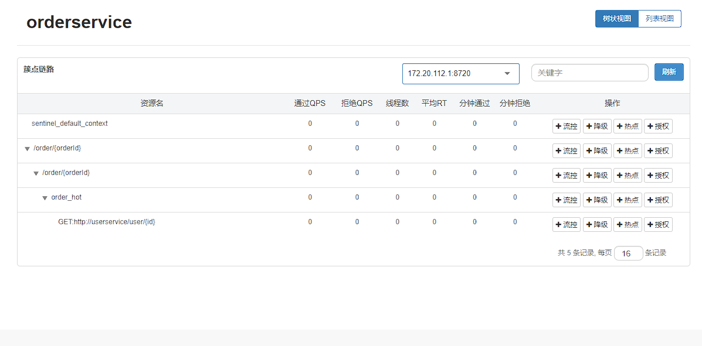


#### 5. 编写降级策略


#### 6. 保存


#### 7. 进入jmeter


#### 8. 更改http请求


#### 9. 发起请求


#### 10. 结果


|  ID  | 执行时间 | 线程组 | lable | 请求时间ms | 状态 | bytes | sent bytes | latency | 连接时间 |
| :--: | :------: | :----: | :---: | :--------: | :--: | :---: | :--------: | :-----: | :------: |
| 1    | 19:48:08.232 | setUp线程组 1-1   | HTTP请求 | 41   | Success | 311  | 125  | 41   | 1    |
| 2    | 19:48:08.332 | setUp线程组 1-2   | HTTP请求 | 14   | Success | 311  | 125  | 14   | 1    |
| 3    | 19:48:08.444 | setUp线程组 1-3   | HTTP请求 | 14   | Success | 311  | 125  | 14   | 0    |
| 4    | 19:48:08.539 | setUp线程组 1-4   | HTTP请求 | 10   | Success | 311  | 125  | 10   | 0    |
| 5    | 19:48:08.648 | setUp线程组 1-5   | HTTP请求 | 10   | Success | 311  | 125  | 10   | 1    |
| 6    | 19:48:08.744 | setUp线程组 1-6   | HTTP请求 | 12   | Success | 311  | 125  | 12   | 0    |
| 7    | 19:48:08.838 | setUp线程组 1-7   | HTTP请求 | 15   | Success | 311  | 125  | 14   | 1    |
| 8    | 19:48:08.933 | setUp线程组 1-8   | HTTP请求 | 11   | Success | 311  | 125  | 10   | 1    |
| 9    | 19:48:09.034 | setUp线程组 1-9   | HTTP请求 | 12   | Success | 311  | 125  | 11   | 0    |
| 10   | 19:48:09.133 | setUp线程组 1-10  | HTTP请求 | 11   | Success | 311  | 125  | 11   | 1    |
| 11   | 19:48:09.234 | setUp线程组 1-11  | HTTP请求 | 15   | Success | 311  | 125  | 15   | 1    |
| 12   | 19:48:09.331 | setUp线程组 1-12  | HTTP请求 | 14   | Success | 311  | 125  | 14   | 1    |
| 13   | 19:48:09.432 | setUp线程组 1-13  | HTTP请求 | 11   | Success | 311  | 125  | 11   | 1    |
| 14   | 19:48:09.534 | setUp线程组 1-14  | HTTP请求 | 10   | Success | 311  | 125  | 10   | 1    |
| 15   | 19:48:09.633 | setUp线程组 1-15  | HTTP请求 | 10   | Success | 311  | 125  | 10   | 1    |
| 16   | 19:48:09.734 | setUp线程组 1-16  | HTTP请求 | 12   | Success | 311  | 125  | 12   | 0    |
| 17   | 19:48:09.833 | setUp线程组 1-17  | HTTP请求 | 11   | Success | 311  | 125  | 11   | 0    |
| 18   | 19:48:09.934 | setUp线程组 1-18  | HTTP请求 | 10   | Success | 311  | 125  | 10   | 1    |
| 19   | 19:48:10.033 | setUp线程组 1-19  | HTTP请求 | 13   | Success | 311  | 125  | 12   | 1    |
| 20   | 19:48:10.132 | setUp线程组 1-20  | HTTP请求 | 13   | Success | 311  | 125  | 13   | 1    |
| 21   | 19:48:10.232 | setUp线程组 1-21  | HTTP请求 | 12   | Success | 311  | 125  | 12   | 1    |
| 22   | 19:48:10.335 | setUp线程组 1-22  | HTTP请求 | 10   | Success | 311  | 125  | 10   | 1    |
| 23   | 19:48:10.432 | setUp线程组 1-23  | HTTP请求 | 11   | Success | 311  | 125  | 11   | 1    |
| 24   | 19:48:10.533 | setUp线程组 1-24  | HTTP请求 | 12   | Success | 311  | 125  | 12   | 1    |
| 25   | 19:48:10.635 | setUp线程组 1-25  | HTTP请求 | 10   | Success | 311  | 125  | 10   | 1    |
| 26   | 19:48:10.733 | setUp线程组 1-26  | HTTP请求 | 10   | Success | 311  | 125  | 10   | 1    |
| 27   | 19:48:10.833 | setUp线程组 1-27  | HTTP请求 | 10   | Success | 311  | 125  | 10   | 1    |
| 28   | 19:48:10.932 | setUp线程组 1-28  | HTTP请求 | 11   | Success | 311  | 125  | 10   | 1    |
| 29   | 19:48:11.034 | setUp线程组 1-29  | HTTP请求 | 12   | Success | 311  | 125  | 12   | 1    |
| 30   | 19:48:11.134 | setUp线程组 1-30  | HTTP请求 | 16   | Success | 311  | 125  | 15   | 1    |
| 31   | 19:48:11.232 | setUp线程组 1-31  | HTTP请求 | 11   | Success | 311  | 125  | 10   | 1    |
| 32   | 19:48:11.335 | setUp线程组 1-32  | HTTP请求 | 11   | Success | 311  | 125  | 11   | 1    |
| 33   | 19:48:11.433 | setUp线程组 1-33  | HTTP请求 | 11   | Success | 311  | 125  | 10   | 1    |
| 34   | 19:48:11.532 | setUp线程组 1-34  | HTTP请求 | 9    | Success | 311  | 125  | 9    | 1    |
| 35   | 19:48:11.633 | setUp线程组 1-35  | HTTP请求 | 14   | Success | 311  | 125  | 13   | 1    |
| 36   | 19:48:11.733 | setUp线程组 1-36  | HTTP请求 | 10   | Success | 311  | 125  | 10   | 1    |
| 37   | 19:48:11.833 | setUp线程组 1-37  | HTTP请求 | 11   | Success | 311  | 125  | 11   | 1    |
| 38   | 19:48:11.933 | setUp线程组 1-38  | HTTP请求 | 10   | Success | 311  | 125  | 10   | 1    |
| 39   | 19:48:12.033 | setUp线程组 1-39  | HTTP请求 | 12   | Success | 311  | 125  | 12   | 1    |
| 40   | 19:48:12.132 | setUp线程组 1-40  | HTTP请求 | 9    | Success | 311  | 125  | 9    | 1    |
| 41   | 19:48:12.233 | setUp线程组 1-41  | HTTP请求 | 12   | Success | 311  | 125  | 12   | 1    |
| 42   | 19:48:12.333 | setUp线程组 1-42  | HTTP请求 | 9    | Success | 311  | 125  | 9    | 1    |
| 43   | 19:48:12.432 | setUp线程组 1-43  | HTTP请求 | 12   | Success | 311  | 125  | 12   | 1    |
| 44   | 19:48:12.533 | setUp线程组 1-44  | HTTP请求 | 10   | Success | 311  | 125  | 10   | 1    |
| 45   | 19:48:12.632 | setUp线程组 1-45  | HTTP请求 | 15   | Success | 311  | 125  | 15   | 1    |
| 46   | 19:48:12.733 | setUp线程组 1-46  | HTTP请求 | 10   | Success | 311  | 125  | 10   | 1    |
| 47   | 19:48:12.834 | setUp线程组 1-47  | HTTP请求 | 14   | Success | 311  | 125  | 14   | 1    |
| 48   | 19:48:12.933 | setUp线程组 1-48  | HTTP请求 | 10   | Success | 311  | 125  | 9    | 1    |
| 49   | 19:48:13.033 | setUp线程组 1-49  | HTTP请求 | 11   | Success | 311  | 125  | 11   | 1    |
| 50   | 19:48:13.135 | setUp线程组 1-50  | HTTP请求 | 16   | Success | 311  | 125  | 15   | 1    |
| 51   | 19:48:13.235 | setUp线程组 1-51  | HTTP请求 | 5    | Success | 311  | 125  | 5    | 1    |
| 52   | 19:48:13.332 | setUp线程组 1-52  | HTTP请求 | 5    | Success | 311  | 125  | 4    | 1    |
| 53   | 19:48:13.433 | setUp线程组 1-53  | HTTP请求 | 4    | Success | 311  | 125  | 4    | 1    |
| 54   | 19:48:13.534 | setUp线程组 1-54  | HTTP请求 | 4    | Success | 311  | 125  | 4    | 1    |
| 55   | 19:48:13.631 | setUp线程组 1-55  | HTTP请求 | 4    | Success | 311  | 125  | 4    | 1    |
| 56   | 19:48:13.731 | setUp线程组 1-56  | HTTP请求 | 5    | Success | 311  | 125  | 5    | 1    |
| 57   | 19:48:13.831 | setUp线程组 1-57  | HTTP请求 | 5    | Success | 311  | 125  | 5    | 1    |
| 58   | 19:48:13.933 | setUp线程组 1-58  | HTTP请求 | 5    | Success | 311  | 125  | 4    | 1    |
| 59   | 19:48:14.033 | setUp线程组 1-59  | HTTP请求 | 6    | Success | 311  | 125  | 5    | 1    |
| 60   | 19:48:14.134 | setUp线程组 1-60  | HTTP请求 | 4    | Success | 311  | 125  | 4    | 1    |
| 61   | 19:48:14.233 | setUp线程组 1-61  | HTTP请求 | 4    | Success | 311  | 125  | 4    | 1    |
| 62   | 19:48:14.332 | setUp线程组 1-62  | HTTP请求 | 5    | Success | 311  | 125  | 4    | 1    |
| 63   | 19:48:14.433 | setUp线程组 1-63  | HTTP请求 | 4    | Success | 311  | 125  | 4    | 1    |
| 64   | 19:48:14.533 | setUp线程组 1-64  | HTTP请求 | 5    | Success | 311  | 125  | 4    | 1    |
| 65   | 19:48:14.633 | setUp线程组 1-65  | HTTP请求 | 5    | Success | 311  | 125  | 4    | 1    |
| 66   | 19:48:14.732 | setUp线程组 1-66  | HTTP请求 | 4    | Success | 311  | 125  | 4    | 1    |
| 67   | 19:48:14.832 | setUp线程组 1-67  | HTTP请求 | 5    | Success | 311  | 125  | 5    | 1    |
| 68   | 19:48:14.932 | setUp线程组 1-68  | HTTP请求 | 4    | Success | 311  | 125  | 4    | 1    |
| 69   | 19:48:15.032 | setUp线程组 1-69  | HTTP请求 | 5    | Success | 311  | 125  | 4    | 1    |
| 70   | 19:48:15.132 | setUp线程组 1-70  | HTTP请求 | 4    | Success | 311  | 125  | 4    | 1    |
| 71   | 19:48:15.233 | setUp线程组 1-71  | HTTP请求 | 5    | Success | 311  | 125  | 4    | 1    |
| 72   | 19:48:15.333 | setUp线程组 1-72  | HTTP请求 | 4    | Success | 311  | 125  | 4    | 1    |
| 73   | 19:48:15.433 | setUp线程组 1-73  | HTTP请求 | 5    | Success | 311  | 125  | 4    | 1    |
| 74   | 19:48:15.533 | setUp线程组 1-74  | HTTP请求 | 5    | Success | 311  | 125  | 5    | 1    |
| 75   | 19:48:15.632 | setUp线程组 1-75  | HTTP请求 | 5    | Success | 311  | 125  | 4    | 1    |
| 76   | 19:48:15.733 | setUp线程组 1-76  | HTTP请求 | 6    | Success | 311  | 125  | 5    | 1    |
| 77   | 19:48:15.833 | setUp线程组 1-77  | HTTP请求 | 5    | Success | 311  | 125  | 5    | 1    |
| 78   | 19:48:15.933 | setUp线程组 1-78  | HTTP请求 | 4    | Success | 311  | 125  | 4    | 1    |
| 79   | 19:48:16.032 | setUp线程组 1-79  | HTTP请求 | 5    | Success | 311  | 125  | 5    | 1    |
| 80   | 19:48:16.132 | setUp线程组 1-80  | HTTP请求 | 5    | Success | 311  | 125  | 4    | 1    |
| 81   | 19:48:16.232 | setUp线程组 1-81  | HTTP请求 | 5    | Success | 311  | 125  | 5    | 1    |
| 82   | 19:48:16.333 | setUp线程组 1-82  | HTTP请求 | 4    | Success | 311  | 125  | 4    | 1    |
| 83   | 19:48:16.432 | setUp线程组 1-83  | HTTP请求 | 4    | Success | 311  | 125  | 3    | 1    |
| 84   | 19:48:16.531 | setUp线程组 1-84  | HTTP请求 | 5    | Success | 311  | 125  | 5    | 1    |
| 85   | 19:48:16.633 | setUp线程组 1-85  | HTTP请求 | 5    | Success | 311  | 125  | 4    | 1    |
| 86   | 19:48:16.733 | setUp线程组 1-86  | HTTP请求 | 4    | Success | 311  | 125  | 4    | 1    |
| 87   | 19:48:16.832 | setUp线程组 1-87  | HTTP请求 | 4    | Success | 311  | 125  | 4    | 1    |
| 88   | 19:48:16.933 | setUp线程组 1-88  | HTTP请求 | 4    | Success | 311  | 125  | 4    | 1    |
| 89   | 19:48:17.032 | setUp线程组 1-89  | HTTP请求 | 4    | Success | 311  | 125  | 4    | 1    |
| 90   | 19:48:17.131 | setUp线程组 1-90  | HTTP请求 | 5    | Success | 311  | 125  | 5    | 1    |
| 91   | 19:48:17.233 | setUp线程组 1-91  | HTTP请求 | 5    | Success | 311  | 125  | 4    | 1    |
| 92   | 19:48:17.332 | setUp线程组 1-92  | HTTP请求 | 6    | Success | 311  | 125  | 6    | 1    |
| 93   | 19:48:17.431 | setUp线程组 1-93  | HTTP请求 | 5    | Success | 311  | 125  | 4    | 1    |
| 94   | 19:48:17.532 | setUp线程组 1-94  | HTTP请求 | 4    | Success | 311  | 125  | 4    | 1    |
| 95   | 19:48:17.632 | setUp线程组 1-95  | HTTP请求 | 4    | Success | 311  | 125  | 4    | 1    |
| 96   | 19:48:17.733 | setUp线程组 1-96  | HTTP请求 | 4    | Success | 311  | 125  | 4    | 1    |
| 97   | 19:48:17.833 | setUp线程组 1-97  | HTTP请求 | 5    | Success | 311  | 125  | 5    | 1    |
| 98   | 19:48:17.933 | setUp线程组 1-98  | HTTP请求 | 4    | Success | 311  | 125  | 3    | 1    |
| 99   | 19:48:18.032 | setUp线程组 1-99  | HTTP请求 | 4    | Success | 311  | 125  | 4    | 1    |
| 100  | 19:48:18.133 | setUp线程组 1-100 | HTTP请求 | 15   | Success | 311  | 125  | 15   | 1    |


## 授权规则

授权规则可以对调用方的来源做控制，有白名单和黑名单两种方式

* 白名单：来源（origin）在白名单内的调用者允许访问
* 黑名单：来源（origin）在黑名单内的调用者不允许访问


我们限定只允许从网关来的请求访问order-service，那么流控应用中就填写网关的名称


Sentinel是通过RequestOriginParser这个接口的parseOrigin来获取请求的来源的


```java
public interface RequestOriginParser 
{
  /**
  * 从请求request对象中获取origin，获取方式自定义
  */
  String parseOrigin(HttpServletRequest request);
}
```


尝试从request中获取一个名为origin的请求头，作为origin的值：

```java
package mao.order_service.originParser;

import com.alibaba.csp.sentinel.adapter.spring.webmvc.callback.RequestOriginParser;
import org.springframework.stereotype.Component;

import javax.servlet.http.HttpServletRequest;

/**
 * Project name(项目名称)：spring_cloud_demo_Sentinel
 * Package(包名): mao.order_service.originParser
 * Class(类名): HeaderOriginParser
 * Author(作者）: mao
 * Author QQ：1296193245
 * GitHub：https://github.com/maomao124/
 * Date(创建日期)： 2022/7/22
 * Time(创建时间)： 13:10
 * Version(版本): 1.0
 * Description(描述)： 无
 */


@Component
public class HeaderOriginParser implements RequestOriginParser
{

    @Override
    public String parseOrigin(HttpServletRequest httpServletRequest)
    {
        //获取头origin的信息
        String origin = httpServletRequest.getHeader("origin");
        //判断是否为空
        if (origin==null||origin.equals(""))
        {
            return "no";
        }
        return origin;
    }
}
```


在gateway服务中，利用网关的过滤器添加名为gateway的origin头


```yaml
# gateway 网关配置文件

spring:
  application:
    name: gateway


  cloud:
    nacos:
        discovery:
          # nacos 服务端地址
          server-addr: localhost:8848
          # 配置集群名称，也就是机房位置
          # cluster-name: HZ
          # namespace: 5544c4b1-2899-4915-94af-f9940c01c2b9
          # 是否为临时实例，true为临时实例
          ephemeral: false

    # 网关配置
    gateway:
      # 网关路由配置，list集合
      routes:
          # 路由的id，唯一
        - id: user-service
          # 路由的目标地址 lb就是负载均衡，后面跟服务名称
          uri: lb://userservice
          # 路由断言，也就是判断请求是否符合路由规则的条件，list集合
          predicates:
              # 按照路径匹配，只要以/user开头就符合要求
            - Path=/user/**
          # 路由过滤器，list集合
          #filters:
              # 添加请求头
            #- AddRequestHeader=key1,value1
        - id: order-service
          # 路由的目标地址 lb就是负载均衡，后面跟服务名称
          uri: lb://orderservice
          # 路由断言，也就是判断请求是否符合路由规则的条件，list集合
          predicates:
            # 按照路径匹配
            - Path=/order/**
          # 路由过滤器，list集合
          filters:
          # 添加请求头
            - AddRequestHeader=origin,gateway

      # 默认过滤器，会对所有的路由请求都生效，list集合
      default-filters:
        # 添加请求头
        - AddRequestHeader=key1,value1


      # 全局的跨域处理
      globalcors:
        # 解决options请求被拦截问题
        add-to-simple-url-handler-mapping: true
        cors-configurations:
          '[/**]':
            # 允许哪些网站的跨域请求
            allowedOrigins:
              - "http://localhost:8080"
              - "http://localhost:8082"
              - "http://localhost:8093"
            # 允许的跨域ajax的请求方式
            allowedMethods:
              - "GET"
              - "POST"
              - "DELETE"
              - "PUT"
              - "OPTIONS"
            # 允许在请求中携带的头信息
            allowedHeaders: "*"
            # 是否允许携带cookie
            allowCredentials: true
            # 这次跨域检测的有效期
            maxAge: 30000


server:
  port: 10010


# 设置日志级别，root表示根节点，即整体应用日志级别
logging:
  # 日志输出到文件的文件名
  file:
    name: gateway.log
  # 设置日志组
  group:
    # 自定义组名，设置当前组中所包含的包
    mao_pro: mao
  level:
    root: info
    # 为对应组设置日志级别
    mao_pro: debug
    # 日志输出格式
  # pattern:
  # console: "%d %clr(%p) --- [%16t] %clr(%-40.40c){cyan} : %m %n"
```


启动服务


访问一次


http://localhost:8081/order/101


能正常访问


进入sentinel控制台


点击授权


填写流控应用


点击新增


访问


http://localhost:8081/order/101


结果：


访问


http://localhost:10010/order/101?authorization=admin


结果：


## 自定义异常结果


默认情况下，发生限流、降级、授权拦截时，都会抛出异常到调用方。如果要自定义异常时的返回结果，需要实现 BlockExceptionHandler接口


```java
public interface BlockExceptionHandler 
{
  /**
  * 处理请求被限流、降级、授权拦截时抛出的异常：BlockException
  */
  void handle(HttpServletRequest request, HttpServletResponse response, BlockException e) throws Exception;
}

```


而BlockException包含很多个子类，分别对应不同的场景：


|       **异常**       |      **说明**      |
| :------------------: | :----------------: |
|    FlowException     |      限流异常      |
|  ParamFlowException  | 热点参数限流的异常 |
|   DegradeException   |      降级异常      |
|  AuthorityException  |    授权规则异常    |
| SystemBlockException |    系统规则异常    |


在order_service中定义类，实现BlockExceptionHandler接口


```java
package mao.order_service.exceptionHandler;

import com.alibaba.csp.sentinel.adapter.spring.webmvc.callback.BlockExceptionHandler;
import com.alibaba.csp.sentinel.slots.block.BlockException;
import com.alibaba.csp.sentinel.slots.block.authority.AuthorityException;
import com.alibaba.csp.sentinel.slots.block.degrade.DegradeException;
import com.alibaba.csp.sentinel.slots.block.flow.FlowException;
import com.alibaba.csp.sentinel.slots.block.flow.param.ParamFlowException;
import org.springframework.stereotype.Component;

import javax.servlet.http.HttpServletRequest;
import javax.servlet.http.HttpServletResponse;

/**
 * Project name(项目名称)：spring_cloud_demo_Sentinel
 * Package(包名): mao.order_service.exceptionHandler
 * Class(类名): SentinelBlockExceptionHandler
 * Author(作者）: mao
 * Author QQ：1296193245
 * GitHub：https://github.com/maomao124/
 * Date(创建日期)： 2022/7/22
 * Time(创建时间)： 13:38
 * Version(版本): 1.0
 * Description(描述)： 无
 */

@Component
public class SentinelBlockExceptionHandler implements BlockExceptionHandler
{

    @Override
    public void handle(HttpServletRequest httpServletRequest, HttpServletResponse httpServletResponse, BlockException e)
            throws Exception
    {
        String msg = "未知异常";
        int status = 429;
        if (e instanceof FlowException)
        {
            msg = "请求被限流了！";
        }
        else if (e instanceof DegradeException)
        {
            msg = "请求被降级了！";
        }
        else if (e instanceof ParamFlowException)
        {
            msg = "热点参数限流！";
        }
        else if (e instanceof AuthorityException)
        {
            msg = "请求没有权限！";
            status = 401;
        }

        //设置返回的类型为json
        httpServletResponse.setContentType("application/json;charset=utf-8");
        //设置响应状态码
        httpServletResponse.setStatus(status);
        //写
        httpServletResponse.getWriter().write("{\"message\": \"" + msg + "\" , \"status\": " + status + "}");

    }
}
```


重启服务


添加规则


访问

http://localhost:8081/order/101


http://localhost:10010/order/101?authorization=admin


## 规则持久化


 - [Sentinel 实战-规则持久化](https://mp.weixin.qq.com/s/twMFiBfRawKLR-1-N-f1yw)


Sentinel的控制台规则管理有三种模式：

|                         **推送模式**                         |                           **说明**                           |           **优点**           |                           **缺点**                           |
| :----------------------------------------------------------: | :----------------------------------------------------------: | :--------------------------: | :----------------------------------------------------------: |
| [原始模式](https://github.com/alibaba/Sentinel/wiki/在生产环境中使用-Sentinel) | API 将规则推送至客户端并直接更新到内存中，扩展写数据源（[WritableDataSource](https://github.com/alibaba/Sentinel/wiki/动态规则扩展)），默认就是这种 |       简单，无任何依赖       | 不保证一致性；规则保存在内存中，重启即消失。严重不建议用于生产环境 |
| [Pull   ](https://github.com/alibaba/Sentinel/wiki/在生产环境中使用-Sentinel)[模式](https://github.com/alibaba/Sentinel/wiki/在生产环境中使用-Sentinel) | 扩展写数据源（[WritableDataSource](https://github.com/alibaba/Sentinel/wiki/动态规则扩展)），  客户端主动向某个规则管理中心定期轮询拉取规则，这个规则中心可以是 RDBMS、文件 等 | 简单，无任何依赖；规则持久化 | 不保证一致性；实时性不保证，拉取过于频繁也可能会有性能问题。 |
| **[Push   ](https://github.com/alibaba/Sentinel/wiki/在生产环境中使用-Sentinel)**[模式](https://github.com/alibaba/Sentinel/wiki/在生产环境中使用-Sentinel) | 扩展读数据源（[ReadableDataSource](https://github.com/alibaba/Sentinel/wiki/动态规则扩展)），规则中心统一推送，客户端通过注册监听器的方式时刻监听变化，比如使用  Nacos、Zookeeper  等配置中心。这种方式有更好的实时性和一致性保证。**生产环境下一般采用**  **push**  **模式的数据源。** |     规则持久化；一致性；     |                        引入第三方依赖                        |


### 原始模式

控制台配置的规则直接推送到Sentinel客户端，也就是我们的应用。然后保存在内存中，服务重启则丢失


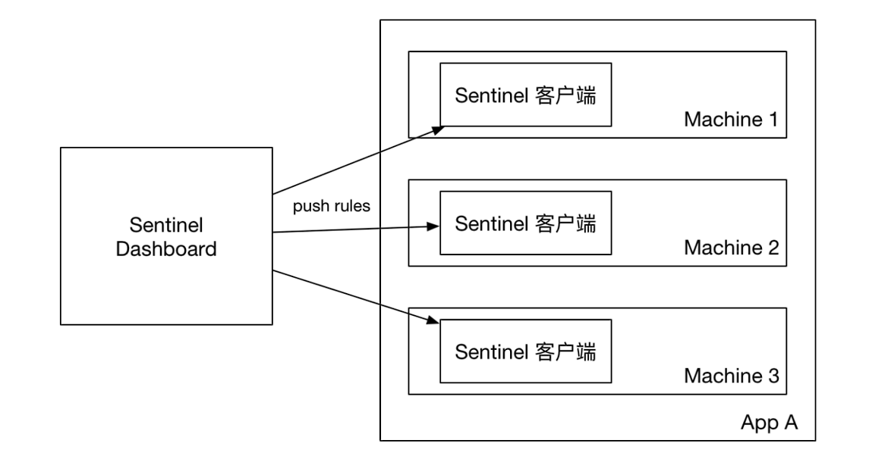


### pull模式


控制台将配置的规则推送到Sentinel客户端，而客户端会将配置规则保存在本地文件或数据库中。以后会定时去本地文件或数据库中查询，更新本地规则。


### push模式


控制台将配置规则推送到远程配置中心，例如Nacos。Sentinel客户端监听Nacos，获取配置变更的推送消息，完成本地配置更新。


### 基于nacos实现push模式


#### 1. 引入依赖

在order_service服务中，引入依赖


```xml
        <!--sentinel基于nacos实现规则持久化 依赖-->
        <dependency>
            <groupId>com.alibaba.csp</groupId>
            <artifactId>sentinel-datasource-nacos</artifactId>
        </dependency>
```


全部

```xml
<?xml version="1.0" encoding="UTF-8"?>
<project xmlns="http://maven.apache.org/POM/4.0.0" xmlns:xsi="http://www.w3.org/2001/XMLSchema-instance"
         xsi:schemaLocation="http://maven.apache.org/POM/4.0.0 https://maven.apache.org/xsd/maven-4.0.0.xsd">
    <modelVersion>4.0.0</modelVersion>

    <parent>
        <groupId>mao</groupId>
        <artifactId>spring_cloud_demo</artifactId>
        <version>0.0.1</version>
        <relativePath>../pom.xml</relativePath> <!-- lookup parent from repository -->
    </parent>

    <artifactId>order_service</artifactId>
    <version>0.0.1</version>
    <name>order_service</name>
    <description>order_service</description>

    <properties>
        <java.version>11</java.version>
    </properties>

    <dependencies>

        <dependency>
            <groupId>org.springframework.boot</groupId>
            <artifactId>spring-boot-starter-web</artifactId>
        </dependency>

        <!--mysql依赖 spring-boot-->
        <dependency>
            <groupId>mysql</groupId>
            <artifactId>mysql-connector-java</artifactId>
        </dependency>

        <!--spring-boot druid连接池依赖-->
        <dependency>
            <groupId>com.alibaba</groupId>
            <artifactId>druid-spring-boot-starter</artifactId>
        </dependency>

        <!--spring-boot mybatis依赖-->
        <dependency>
            <groupId>org.mybatis.spring.boot</groupId>
            <artifactId>mybatis-spring-boot-starter</artifactId>
        </dependency>

        <dependency>
            <groupId>org.springframework.boot</groupId>
            <artifactId>spring-boot-starter-test</artifactId>
            <scope>test</scope>
        </dependency>

        <!--eureka-client 依赖-->
        <!--<dependency>
            <groupId>org.springframework.cloud</groupId>
            <artifactId>spring-cloud-starter-netflix-eureka-client</artifactId>
        </dependency>-->

        <!-- nacos 客户端依赖 -->
        <dependency>
            <groupId>com.alibaba.cloud</groupId>
            <artifactId>spring-cloud-starter-alibaba-nacos-discovery</artifactId>
        </dependency>

        <!--feign 依赖-->
        <dependency>
            <groupId>org.springframework.cloud</groupId>
            <artifactId>spring-cloud-starter-openfeign</artifactId>
        </dependency>

        <!--httpClient的依赖 主要用于feign连接池-->
        <dependency>
            <groupId>io.github.openfeign</groupId>
            <artifactId>feign-httpclient</artifactId>
        </dependency>

        <!--feign_api 依赖-->
        <dependency>
            <groupId>mao</groupId>
            <artifactId>feign_api</artifactId>
            <version>0.0.1</version>
        </dependency>

        <!--sentinel 依赖-->
        <dependency>
            <groupId>com.alibaba.cloud</groupId>
            <artifactId>spring-cloud-starter-alibaba-sentinel</artifactId>
        </dependency>

        <!--sentinel基于nacos实现规则持久化 依赖-->
        <dependency>
            <groupId>com.alibaba.csp</groupId>
            <artifactId>sentinel-datasource-nacos</artifactId>
        </dependency>


    </dependencies>

    <build>
        <plugins>
            <plugin>
                <groupId>org.springframework.boot</groupId>
                <artifactId>spring-boot-maven-plugin</artifactId>
            </plugin>
        </plugins>
    </build>

</project>
```


#### 2. 配置nacos地址


```yaml
# order 业务 配置文件

spring:


  # 配置数据源
  datasource:

    druid:
      driver-class-name: com.mysql.cj.jdbc.Driver
      url: jdbc:mysql://localhost:3306/cloud_order
      username: root
      password: 20010713


  application:
    name: orderservice

#eureka:
#  client:
#    service-url:
#      defaultZone: http://127.0.0.1:10080/eureka/


  cloud:
    nacos:
      discovery:
        # nacos 服务端地址
        server-addr: localhost:8848
        # 配置集群名称，也就是机房位置
        cluster-name: HZ
        # namespace: 5544c4b1-2899-4915-94af-f9940c01c2b9
        # 是否为临时实例，true为临时实例
        ephemeral: false


    sentinel:
      transport:
        dashboard: localhost:8099
      # 关闭context整合
      web-context-unify: false
      # 配置sentinel持久化
      datasource:
        flow:
          # 使用nacos 持久化
          nacos:
            # nacos地址
            server-addr: localhost:8848
            dataId: orderservice-flow-rules
            groupId: SENTINEL_GROUP
            # flow、 degrade、authority、param-flow
            rule-type: flow


# 负载均衡
#userservice:
#  ribbon:
#    # 负载均衡规则
#    NFLoadBalancerRuleClassName: com.alibaba.cloud.nacos.ribbon.NacosRule


# 开启debug模式，输出调试信息，常用于检查系统运行状况
#debug: true

# 设置日志级别，root表示根节点，即整体应用日志级别
logging:
 # 日志输出到文件的文件名
  file:
     name: order_server.log
  # 设置日志组
  group:
  # 自定义组名，设置当前组中所包含的包
    mao_pro: mao
  level:
    root: info
    # 为对应组设置日志级别
    mao_pro: debug
    # 日志输出格式
# pattern:
  # console: "%d %clr(%p) --- [%16t] %clr(%-40.40c){cyan} : %m %n"


# 配置负载均衡规则
#userservice:
#  ribbon:
#    NFLoadBalancerRuleClassName: com.netflix.loadbalancer.RandomRule


ribbon:
  eager-load:
    # 开启饥饿加载
    enabled: true
    # 指定对 userservice 这个服务饥饿加载
    clients: userservice


server:
  port: 8081


mybatis:
  type-aliases-package: mao.order_service
  configuration:
    map-underscore-to-camel-case: true


feign:
  # 配置连接池
  httpclient:
    # 开启feign对HttpClient的支持
    enabled: true
    # 最大的连接数
    max-connections: 200
    # 每个路径的最大连接数
    max-connections-per-route: 50

  client:
    config:
      # default是全局配置，如果是写服务名称，则是针对某个微服务的配置
      default:
         #日志级别，包含四种不同的级别：NONE、BASIC、HEADERS、FULL
        loggerLevel: BASIC
        # 连接超时时间
        #connectTimeout:
        # 响应结果的解析器，http远程调用的结果做解析，例如解析json字符串为java对象
        #decoder:
        # 请求参数编码，将请求参数编码，便于通过http请求发送
        #encoder:
        # 支持的注解格式，默认是SpringMVC的注解
        #contract:
        # 失败重试机制，请求失败的重试机制，默认是没有，不过会使用Ribbon的重试
        #retryer:

  # 开启Feign的Sentinel功能
  sentinel:
    enabled: true
```


#### 3. 下载源码


#### 4. 解压源码


#### 5. 使用idea打开


#### 6. 更改pom文件

1.修改sentinel-dashboard源码的pom文件，将sentinel-datasource-nacos依赖的scope去掉


更改后：


```xml
<?xml version="1.0" encoding="UTF-8"?>
<project xmlns="http://maven.apache.org/POM/4.0.0" xmlns:xsi="http://www.w3.org/2001/XMLSchema-instance"
         xsi:schemaLocation="http://maven.apache.org/POM/4.0.0 http://maven.apache.org/xsd/maven-4.0.0.xsd">
    <modelVersion>4.0.0</modelVersion>

    <parent>
        <groupId>com.alibaba.csp</groupId>
        <artifactId>sentinel-parent</artifactId>
        <version>1.8.1</version>
    </parent>

    <artifactId>sentinel-dashboard</artifactId>
    <packaging>jar</packaging>

    <properties>
        <spring.boot.version>2.0.5.RELEASE</spring.boot.version>
        <curator.version>4.0.1</curator.version>
    </properties>

    <dependencies>
        <dependency>
            <groupId>com.alibaba.csp</groupId>
            <artifactId>sentinel-core</artifactId>
        </dependency>
        <dependency>
            <groupId>com.alibaba.csp</groupId>
            <artifactId>sentinel-web-servlet</artifactId>
            <version>${project.version}</version>
        </dependency>
        <dependency>
            <groupId>com.alibaba.csp</groupId>
            <artifactId>sentinel-transport-simple-http</artifactId>
        </dependency>
        <dependency>
            <groupId>com.alibaba.csp</groupId>
            <artifactId>sentinel-parameter-flow-control</artifactId>
            <version>${project.version}</version>
        </dependency>
        <dependency>
            <groupId>com.alibaba.csp</groupId>
            <artifactId>sentinel-api-gateway-adapter-common</artifactId>
            <version>${project.version}</version>
        </dependency>

        <dependency>
            <groupId>org.springframework.boot</groupId>
            <artifactId>spring-boot-starter-web</artifactId>
            <version>${spring.boot.version}</version>
        </dependency>
        <dependency>
            <groupId>org.springframework.boot</groupId>
            <artifactId>spring-boot-starter-logging</artifactId>
            <version>${spring.boot.version}</version>
        </dependency>
        <dependency>
            <groupId>org.springframework.boot</groupId>
            <artifactId>spring-boot-starter-test</artifactId>
            <version>${spring.boot.version}</version>
            <scope>test</scope>
        </dependency>

        <dependency>
            <groupId>log4j</groupId>
            <artifactId>log4j</artifactId>
            <version>1.2.14</version>
        </dependency>

        <dependency>
            <groupId>commons-lang</groupId>
            <artifactId>commons-lang</artifactId>
            <version>2.6</version>
        </dependency>

        <dependency>
            <groupId>org.apache.httpcomponents</groupId>
            <artifactId>httpclient</artifactId>
            <version>4.5.3</version>
        </dependency>
        <dependency>
            <groupId>org.apache.httpcomponents</groupId>
            <artifactId>httpcore</artifactId>
            <version>4.4.5</version>
        </dependency>
        <dependency>
            <groupId>org.apache.httpcomponents</groupId>
            <artifactId>httpasyncclient</artifactId>
            <version>4.1.3</version>
        </dependency>
        <dependency>
            <groupId>org.apache.httpcomponents</groupId>
            <artifactId>httpcore-nio</artifactId>
            <version>4.4.6</version>
        </dependency>
        <dependency>
            <groupId>com.alibaba</groupId>
            <artifactId>fastjson</artifactId>
        </dependency>

        <!-- for Nacos rule publisher sample -->
        <dependency>
            <groupId>com.alibaba.csp</groupId>
            <artifactId>sentinel-datasource-nacos</artifactId>
            <!--<scope>test</scope>-->
        </dependency>
        <!-- for Apollo rule publisher sample -->
        <dependency>
            <groupId>com.ctrip.framework.apollo</groupId>
            <artifactId>apollo-openapi</artifactId>
            <version>1.2.0</version>
            <scope>test</scope>
        </dependency>

        <!--for Zookeeper rule publisher sample-->
        <dependency>
            <groupId>org.apache.curator</groupId>
            <artifactId>curator-recipes</artifactId>
            <version>${curator.version}</version>
            <scope>test</scope>
        </dependency>

        <dependency>
            <groupId>junit</groupId>
            <artifactId>junit</artifactId>
            <scope>test</scope>
        </dependency>
        <dependency>
            <groupId>org.mockito</groupId>
            <artifactId>mockito-core</artifactId>
            <scope>test</scope>
        </dependency>
        <dependency>
           <groupId>com.github.stefanbirkner</groupId>
           <artifactId>system-rules</artifactId>
           <version>1.16.1</version>
           <scope>test</scope>
        </dependency>
    </dependencies>

    <build>
        <finalName>sentinel-dashboard</finalName>
        <plugins>
            <plugin>
                <groupId>org.springframework.boot</groupId>
                <artifactId>spring-boot-maven-plugin</artifactId>
                <version>${spring.boot.version}</version>
                <configuration>
                    <fork>true</fork>
                    <mainClass>com.alibaba.csp.sentinel.dashboard.DashboardApplication</mainClass>
                </configuration>
                <executions>
                    <execution>
                        <goals>
                            <goal>repackage</goal>
                        </goals>
                    </execution>
                </executions>
            </plugin>

            <plugin>
                <groupId>org.apache.maven.plugins</groupId>
                <artifactId>maven-deploy-plugin</artifactId>
                <version>${maven.deploy.version}</version>
                <configuration>
                    <skip>true</skip>
                </configuration>
            </plugin>
        </plugins>

        <resources>
            <resource>
                <directory>src/main/resources</directory>
                <filtering>true</filtering>
            </resource>

            <resource>
                <directory>src/main/webapp/</directory>
                <excludes>
                    <exclude>resources/node_modules/**</exclude>
                </excludes>
            </resource>
        </resources>
    </build>
</project>
```


#### 7. 查找包


src/test/java/com/alibaba/csp/sentinel/dashboard/rule/nacos


#### 8. 复制包


拷贝test目录下的nacos代码到main下的com.alibaba.csp.sentinel.dashboard.rule包


#### 9. 修改NacosConfig类


修改刚刚拷贝的nacos包下的NacosConfig类，修改其中的nacos地址


修改前：

```java
package com.alibaba.csp.sentinel.dashboard.rule.nacos;

import com.alibaba.csp.sentinel.dashboard.datasource.entity.rule.FlowRuleEntity;
import com.alibaba.csp.sentinel.datasource.Converter;
import com.alibaba.fastjson.JSON;
import com.alibaba.nacos.api.config.ConfigFactory;
import com.alibaba.nacos.api.config.ConfigService;
import org.springframework.context.annotation.Bean;
import org.springframework.context.annotation.Configuration;

import java.util.List;

/**
 * @author Eric Zhao
 * @since 1.4.0
 */
@Configuration
public class NacosConfig {

    @Bean
    public Converter<List<FlowRuleEntity>, String> flowRuleEntityEncoder() {
        return JSON::toJSONString;
    }

    @Bean
    public Converter<String, List<FlowRuleEntity>> flowRuleEntityDecoder() {
        return s -> JSON.parseArray(s, FlowRuleEntity.class);
    }

    @Bean
    public ConfigService nacosConfigService() throws Exception {
        return ConfigFactory.createConfigService("localhost");
    }
}
```


修改后：

```java

package com.alibaba.csp.sentinel.dashboard.rule.nacos;

import com.alibaba.csp.sentinel.dashboard.datasource.entity.rule.FlowRuleEntity;
import com.alibaba.csp.sentinel.datasource.Converter;
import com.alibaba.fastjson.JSON;
import com.alibaba.nacos.api.config.ConfigFactory;
import com.alibaba.nacos.api.config.ConfigService;
import org.slf4j.Logger;
import org.slf4j.LoggerFactory;
import org.springframework.boot.context.properties.ConfigurationProperties;
import org.springframework.context.annotation.Bean;
import org.springframework.context.annotation.Configuration;

import java.util.List;

/**
 * @author Eric Zhao
 * @since 1.4.0
 */
@Configuration
@ConfigurationProperties(prefix = "nacos")
public class NacosConfig
{

    private static final Logger log = LoggerFactory.getLogger(NacosConfig.class);

    private String nacosAddress;

    public String getNacosAddress()
    {
        return nacosAddress;
    }

    public void setNacosAddress(String nacosAddress)
    {
        this.nacosAddress = nacosAddress;
    }

    @Bean
    public Converter<List<FlowRuleEntity>, String> flowRuleEntityEncoder()
    {
        return JSON::toJSONString;
    }

    @Bean
    public Converter<String, List<FlowRuleEntity>> flowRuleEntityDecoder()
    {
        return s -> JSON.parseArray(s, FlowRuleEntity.class);
    }

    @Bean
    public ConfigService nacosConfigService() throws Exception
    {
        log.info("加载bean：nacosConfigService，nacos地址：" + (nacosAddress == null ? "localhost:8848" : nacosAddress));
        return ConfigFactory.createConfigService(nacosAddress == null ? "localhost:8848" : nacosAddress);
    }
}
```


#### 10. 修改FlowControllerV2类

修改 com.alibaba.csp.sentinel.dashboard.controller.v2包下的FlowControllerV2类：


修改前：

```java
/*
 * Copyright 1999-2018 Alibaba Group Holding Ltd.
 *
 * Licensed under the Apache License, Version 2.0 (the "License");
 * you may not use this file except in compliance with the License.
 * You may obtain a copy of the License at
 *
 *      http://www.apache.org/licenses/LICENSE-2.0
 *
 * Unless required by applicable law or agreed to in writing, software
 * distributed under the License is distributed on an "AS IS" BASIS,
 * WITHOUT WARRANTIES OR CONDITIONS OF ANY KIND, either express or implied.
 * See the License for the specific language governing permissions and
 * limitations under the License.
 */
package com.alibaba.csp.sentinel.dashboard.controller.v2;

import java.util.Date;
import java.util.List;

import com.alibaba.csp.sentinel.dashboard.auth.AuthAction;
import com.alibaba.csp.sentinel.dashboard.auth.AuthService;
import com.alibaba.csp.sentinel.dashboard.auth.AuthService.PrivilegeType;
import com.alibaba.csp.sentinel.util.StringUtil;

import com.alibaba.csp.sentinel.dashboard.datasource.entity.rule.FlowRuleEntity;
import com.alibaba.csp.sentinel.dashboard.repository.rule.InMemoryRuleRepositoryAdapter;
import com.alibaba.csp.sentinel.dashboard.rule.DynamicRuleProvider;
import com.alibaba.csp.sentinel.dashboard.rule.DynamicRulePublisher;
import com.alibaba.csp.sentinel.dashboard.domain.Result;

import org.slf4j.Logger;
import org.slf4j.LoggerFactory;
import org.springframework.beans.factory.annotation.Autowired;
import org.springframework.beans.factory.annotation.Qualifier;
import org.springframework.web.bind.annotation.DeleteMapping;
import org.springframework.web.bind.annotation.GetMapping;
import org.springframework.web.bind.annotation.PathVariable;
import org.springframework.web.bind.annotation.PostMapping;
import org.springframework.web.bind.annotation.PutMapping;
import org.springframework.web.bind.annotation.RequestBody;
import org.springframework.web.bind.annotation.RequestMapping;
import org.springframework.web.bind.annotation.RequestParam;
import org.springframework.web.bind.annotation.RestController;

/**
 * Flow rule controller (v2).
 *
 * @author Eric Zhao
 * @since 1.4.0
 */
@RestController
@RequestMapping(value = "/v2/flow")
public class FlowControllerV2
{

    private final Logger logger = LoggerFactory.getLogger(FlowControllerV2.class);

    @Autowired
    private InMemoryRuleRepositoryAdapter<FlowRuleEntity> repository;

    @Autowired
    @Qualifier("flowRuleDefaultProvider")
    private DynamicRuleProvider<List<FlowRuleEntity>> ruleProvider;
    @Autowired
    @Qualifier("flowRuleDefaultPublisher")
    private DynamicRulePublisher<List<FlowRuleEntity>> rulePublisher;

    @GetMapping("/rules")
    @AuthAction(PrivilegeType.READ_RULE)
    public Result<List<FlowRuleEntity>> apiQueryMachineRules(@RequestParam String app)
    {

        if (StringUtil.isEmpty(app))
        {
            return Result.ofFail(-1, "app can't be null or empty");
        }
        try
        {
            List<FlowRuleEntity> rules = ruleProvider.getRules(app);
            if (rules != null && !rules.isEmpty())
            {
                for (FlowRuleEntity entity : rules)
                {
                    entity.setApp(app);
                    if (entity.getClusterConfig() != null && entity.getClusterConfig().getFlowId() != null)
                    {
                        entity.setId(entity.getClusterConfig().getFlowId());
                    }
                }
            }
            rules = repository.saveAll(rules);
            return Result.ofSuccess(rules);
        }
        catch (Throwable throwable)
        {
            logger.error("Error when querying flow rules", throwable);
            return Result.ofThrowable(-1, throwable);
        }
    }

    private <R> Result<R> checkEntityInternal(FlowRuleEntity entity)
    {
        if (entity == null)
        {
            return Result.ofFail(-1, "invalid body");
        }
        if (StringUtil.isBlank(entity.getApp()))
        {
            return Result.ofFail(-1, "app can't be null or empty");
        }
        if (StringUtil.isBlank(entity.getLimitApp()))
        {
            return Result.ofFail(-1, "limitApp can't be null or empty");
        }
        if (StringUtil.isBlank(entity.getResource()))
        {
            return Result.ofFail(-1, "resource can't be null or empty");
        }
        if (entity.getGrade() == null)
        {
            return Result.ofFail(-1, "grade can't be null");
        }
        if (entity.getGrade() != 0 && entity.getGrade() != 1)
        {
            return Result.ofFail(-1, "grade must be 0 or 1, but " + entity.getGrade() + " got");
        }
        if (entity.getCount() == null || entity.getCount() < 0)
        {
            return Result.ofFail(-1, "count should be at lease zero");
        }
        if (entity.getStrategy() == null)
        {
            return Result.ofFail(-1, "strategy can't be null");
        }
        if (entity.getStrategy() != 0 && StringUtil.isBlank(entity.getRefResource()))
        {
            return Result.ofFail(-1, "refResource can't be null or empty when strategy!=0");
        }
        if (entity.getControlBehavior() == null)
        {
            return Result.ofFail(-1, "controlBehavior can't be null");
        }
        int controlBehavior = entity.getControlBehavior();
        if (controlBehavior == 1 && entity.getWarmUpPeriodSec() == null)
        {
            return Result.ofFail(-1, "warmUpPeriodSec can't be null when controlBehavior==1");
        }
        if (controlBehavior == 2 && entity.getMaxQueueingTimeMs() == null)
        {
            return Result.ofFail(-1, "maxQueueingTimeMs can't be null when controlBehavior==2");
        }
        if (entity.isClusterMode() && entity.getClusterConfig() == null)
        {
            return Result.ofFail(-1, "cluster config should be valid");
        }
        return null;
    }

    @PostMapping("/rule")
    @AuthAction(value = AuthService.PrivilegeType.WRITE_RULE)
    public Result<FlowRuleEntity> apiAddFlowRule(@RequestBody FlowRuleEntity entity)
    {

        Result<FlowRuleEntity> checkResult = checkEntityInternal(entity);
        if (checkResult != null)
        {
            return checkResult;
        }
        entity.setId(null);
        Date date = new Date();
        entity.setGmtCreate(date);
        entity.setGmtModified(date);
        entity.setLimitApp(entity.getLimitApp().trim());
        entity.setResource(entity.getResource().trim());
        try
        {
            entity = repository.save(entity);
            publishRules(entity.getApp());
        }
        catch (Throwable throwable)
        {
            logger.error("Failed to add flow rule", throwable);
            return Result.ofThrowable(-1, throwable);
        }
        return Result.ofSuccess(entity);
    }

    @PutMapping("/rule/{id}")
    @AuthAction(AuthService.PrivilegeType.WRITE_RULE)

    public Result<FlowRuleEntity> apiUpdateFlowRule(@PathVariable("id") Long id,
                                                    @RequestBody FlowRuleEntity entity)
    {
        if (id == null || id <= 0)
        {
            return Result.ofFail(-1, "Invalid id");
        }
        FlowRuleEntity oldEntity = repository.findById(id);
        if (oldEntity == null)
        {
            return Result.ofFail(-1, "id " + id + " does not exist");
        }
        if (entity == null)
        {
            return Result.ofFail(-1, "invalid body");
        }

        entity.setApp(oldEntity.getApp());
        entity.setIp(oldEntity.getIp());
        entity.setPort(oldEntity.getPort());
        Result<FlowRuleEntity> checkResult = checkEntityInternal(entity);
        if (checkResult != null)
        {
            return checkResult;
        }

        entity.setId(id);
        Date date = new Date();
        entity.setGmtCreate(oldEntity.getGmtCreate());
        entity.setGmtModified(date);
        try
        {
            entity = repository.save(entity);
            if (entity == null)
            {
                return Result.ofFail(-1, "save entity fail");
            }
            publishRules(oldEntity.getApp());
        }
        catch (Throwable throwable)
        {
            logger.error("Failed to update flow rule", throwable);
            return Result.ofThrowable(-1, throwable);
        }
        return Result.ofSuccess(entity);
    }

    @DeleteMapping("/rule/{id}")
    @AuthAction(PrivilegeType.DELETE_RULE)
    public Result<Long> apiDeleteRule(@PathVariable("id") Long id)
    {
        if (id == null || id <= 0)
        {
            return Result.ofFail(-1, "Invalid id");
        }
        FlowRuleEntity oldEntity = repository.findById(id);
        if (oldEntity == null)
        {
            return Result.ofSuccess(null);
        }

        try
        {
            repository.delete(id);
            publishRules(oldEntity.getApp());
        }
        catch (Exception e)
        {
            return Result.ofFail(-1, e.getMessage());
        }
        return Result.ofSuccess(id);
    }

    private void publishRules(/*@NonNull*/ String app) throws Exception
    {
        List<FlowRuleEntity> rules = repository.findAllByApp(app);
        rulePublisher.publish(app, rules);
    }
}
```


修改后：


```java
/*
 * Copyright 1999-2018 Alibaba Group Holding Ltd.
 *
 * Licensed under the Apache License, Version 2.0 (the "License");
 * you may not use this file except in compliance with the License.
 * You may obtain a copy of the License at
 *
 *      http://www.apache.org/licenses/LICENSE-2.0
 *
 * Unless required by applicable law or agreed to in writing, software
 * distributed under the License is distributed on an "AS IS" BASIS,
 * WITHOUT WARRANTIES OR CONDITIONS OF ANY KIND, either express or implied.
 * See the License for the specific language governing permissions and
 * limitations under the License.
 */
package com.alibaba.csp.sentinel.dashboard.controller.v2;

import java.util.Date;
import java.util.List;

import com.alibaba.csp.sentinel.dashboard.auth.AuthAction;
import com.alibaba.csp.sentinel.dashboard.auth.AuthService;
import com.alibaba.csp.sentinel.dashboard.auth.AuthService.PrivilegeType;
import com.alibaba.csp.sentinel.util.StringUtil;

import com.alibaba.csp.sentinel.dashboard.datasource.entity.rule.FlowRuleEntity;
import com.alibaba.csp.sentinel.dashboard.repository.rule.InMemoryRuleRepositoryAdapter;
import com.alibaba.csp.sentinel.dashboard.rule.DynamicRuleProvider;
import com.alibaba.csp.sentinel.dashboard.rule.DynamicRulePublisher;
import com.alibaba.csp.sentinel.dashboard.domain.Result;

import org.slf4j.Logger;
import org.slf4j.LoggerFactory;
import org.springframework.beans.factory.annotation.Autowired;
import org.springframework.beans.factory.annotation.Qualifier;
import org.springframework.web.bind.annotation.DeleteMapping;
import org.springframework.web.bind.annotation.GetMapping;
import org.springframework.web.bind.annotation.PathVariable;
import org.springframework.web.bind.annotation.PostMapping;
import org.springframework.web.bind.annotation.PutMapping;
import org.springframework.web.bind.annotation.RequestBody;
import org.springframework.web.bind.annotation.RequestMapping;
import org.springframework.web.bind.annotation.RequestParam;
import org.springframework.web.bind.annotation.RestController;

/**
 * Flow rule controller (v2).
 *
 * @author Eric Zhao
 * @since 1.4.0
 */
@RestController
@RequestMapping(value = "/v2/flow")
public class FlowControllerV2
{

    private final Logger logger = LoggerFactory.getLogger(FlowControllerV2.class);

    @Autowired
    private InMemoryRuleRepositoryAdapter<FlowRuleEntity> repository;

    @Autowired
    @Qualifier("flowRuleNacosProvider")
    private DynamicRuleProvider<List<FlowRuleEntity>> ruleProvider;
    @Autowired
    @Qualifier("flowRuleNacosPublisher")
    private DynamicRulePublisher<List<FlowRuleEntity>> rulePublisher;

    @GetMapping("/rules")
    @AuthAction(PrivilegeType.READ_RULE)
    public Result<List<FlowRuleEntity>> apiQueryMachineRules(@RequestParam String app)
    {

        if (StringUtil.isEmpty(app))
        {
            return Result.ofFail(-1, "app can't be null or empty");
        }
        try
        {
            List<FlowRuleEntity> rules = ruleProvider.getRules(app);
            if (rules != null && !rules.isEmpty())
            {
                for (FlowRuleEntity entity : rules)
                {
                    entity.setApp(app);
                    if (entity.getClusterConfig() != null && entity.getClusterConfig().getFlowId() != null)
                    {
                        entity.setId(entity.getClusterConfig().getFlowId());
                    }
                }
            }
            rules = repository.saveAll(rules);
            return Result.ofSuccess(rules);
        }
        catch (Throwable throwable)
        {
            logger.error("Error when querying flow rules", throwable);
            return Result.ofThrowable(-1, throwable);
        }
    }

    private <R> Result<R> checkEntityInternal(FlowRuleEntity entity)
    {
        if (entity == null)
        {
            return Result.ofFail(-1, "invalid body");
        }
        if (StringUtil.isBlank(entity.getApp()))
        {
            return Result.ofFail(-1, "app can't be null or empty");
        }
        if (StringUtil.isBlank(entity.getLimitApp()))
        {
            return Result.ofFail(-1, "limitApp can't be null or empty");
        }
        if (StringUtil.isBlank(entity.getResource()))
        {
            return Result.ofFail(-1, "resource can't be null or empty");
        }
        if (entity.getGrade() == null)
        {
            return Result.ofFail(-1, "grade can't be null");
        }
        if (entity.getGrade() != 0 && entity.getGrade() != 1)
        {
            return Result.ofFail(-1, "grade must be 0 or 1, but " + entity.getGrade() + " got");
        }
        if (entity.getCount() == null || entity.getCount() < 0)
        {
            return Result.ofFail(-1, "count should be at lease zero");
        }
        if (entity.getStrategy() == null)
        {
            return Result.ofFail(-1, "strategy can't be null");
        }
        if (entity.getStrategy() != 0 && StringUtil.isBlank(entity.getRefResource()))
        {
            return Result.ofFail(-1, "refResource can't be null or empty when strategy!=0");
        }
        if (entity.getControlBehavior() == null)
        {
            return Result.ofFail(-1, "controlBehavior can't be null");
        }
        int controlBehavior = entity.getControlBehavior();
        if (controlBehavior == 1 && entity.getWarmUpPeriodSec() == null)
        {
            return Result.ofFail(-1, "warmUpPeriodSec can't be null when controlBehavior==1");
        }
        if (controlBehavior == 2 && entity.getMaxQueueingTimeMs() == null)
        {
            return Result.ofFail(-1, "maxQueueingTimeMs can't be null when controlBehavior==2");
        }
        if (entity.isClusterMode() && entity.getClusterConfig() == null)
        {
            return Result.ofFail(-1, "cluster config should be valid");
        }
        return null;
    }

    @PostMapping("/rule")
    @AuthAction(value = AuthService.PrivilegeType.WRITE_RULE)
    public Result<FlowRuleEntity> apiAddFlowRule(@RequestBody FlowRuleEntity entity)
    {

        Result<FlowRuleEntity> checkResult = checkEntityInternal(entity);
        if (checkResult != null)
        {
            return checkResult;
        }
        entity.setId(null);
        Date date = new Date();
        entity.setGmtCreate(date);
        entity.setGmtModified(date);
        entity.setLimitApp(entity.getLimitApp().trim());
        entity.setResource(entity.getResource().trim());
        try
        {
            entity = repository.save(entity);
            publishRules(entity.getApp());
        }
        catch (Throwable throwable)
        {
            logger.error("Failed to add flow rule", throwable);
            return Result.ofThrowable(-1, throwable);
        }
        return Result.ofSuccess(entity);
    }

    @PutMapping("/rule/{id}")
    @AuthAction(AuthService.PrivilegeType.WRITE_RULE)

    public Result<FlowRuleEntity> apiUpdateFlowRule(@PathVariable("id") Long id,
                                                    @RequestBody FlowRuleEntity entity)
    {
        if (id == null || id <= 0)
        {
            return Result.ofFail(-1, "Invalid id");
        }
        FlowRuleEntity oldEntity = repository.findById(id);
        if (oldEntity == null)
        {
            return Result.ofFail(-1, "id " + id + " does not exist");
        }
        if (entity == null)
        {
            return Result.ofFail(-1, "invalid body");
        }

        entity.setApp(oldEntity.getApp());
        entity.setIp(oldEntity.getIp());
        entity.setPort(oldEntity.getPort());
        Result<FlowRuleEntity> checkResult = checkEntityInternal(entity);
        if (checkResult != null)
        {
            return checkResult;
        }

        entity.setId(id);
        Date date = new Date();
        entity.setGmtCreate(oldEntity.getGmtCreate());
        entity.setGmtModified(date);
        try
        {
            entity = repository.save(entity);
            if (entity == null)
            {
                return Result.ofFail(-1, "save entity fail");
            }
            publishRules(oldEntity.getApp());
        }
        catch (Throwable throwable)
        {
            logger.error("Failed to update flow rule", throwable);
            return Result.ofThrowable(-1, throwable);
        }
        return Result.ofSuccess(entity);
    }

    @DeleteMapping("/rule/{id}")
    @AuthAction(PrivilegeType.DELETE_RULE)
    public Result<Long> apiDeleteRule(@PathVariable("id") Long id)
    {
        if (id == null || id <= 0)
        {
            return Result.ofFail(-1, "Invalid id");
        }
        FlowRuleEntity oldEntity = repository.findById(id);
        if (oldEntity == null)
        {
            return Result.ofSuccess(null);
        }

        try
        {
            repository.delete(id);
            publishRules(oldEntity.getApp());
        }
        catch (Exception e)
        {
            return Result.ofFail(-1, e.getMessage());
        }
        return Result.ofSuccess(id);
    }

    private void publishRules(/*@NonNull*/ String app) throws Exception
    {
        List<FlowRuleEntity> rules = repository.findAllByApp(app);
        rulePublisher.publish(app, rules);
    }
}
```


#### 11. 修改前端页面


修改src/main/webapp/resources/app/scripts/directives/sidebar/目录下的sidebar.html文件


```html
<div class="navbar-default sidebar" role="navigation" style="overflow-y: auto;">
    <div class="sidebar-nav navbar-collapse">
        <ul class="nav in" id="side-menu">
            <li class="sidebar-search">
                <div class="input-group" style="">
                    <input type="text" class="form-control highlight-border" placeholder="应用名" ng-model="searchApp">
                    <span class="input-group-btn">
            <button class="btn btn-secondary btn-default-inverse" type="button">搜索</button>
          </span>
                </div>
            </li>
            <li ui-sref-active="active">
                <a ui-sref="dashboard.home" style="font-size:16px;">
                    <span class="glyphicon glyphicon-dashboard"></span>
                    &nbsp;&nbsp;首页</a>
            </li>

            <li ng-class="{active: true}" ng-repeat="entry in apps | filter: { app: searchApp }">{{dropDown}}
                <a href="javascript:void(0);" ng-click="click($event)" collapse="{{collpaseall == 1}}"
                   style="font-size: 16px;word-break: break-word;">
                    &nbsp;{{entry.app}}
                    <span class="fa arrow"></span>
                    <span class="arrow">({{entry.healthyCount}}/{{entry.machines.length}})</span>
                </a>

                <!--<ul class="nav nav-second-level" collapse="{{entry.active}}" style="display: none;">-->
                <ul class="nav nav-second-level" ng-show="entry.active">
                    <li ui-sref-active="active">
                        <a ui-sref="dashboard.metric({app: entry.app})">
                            <i class="fa fa-bar-chart"></i>&nbsp;&nbsp;实时监控</a>
                    </li>

                    <li ui-sref-active="active" ng-if="!entry.isGateway">
                        <a ui-sref="dashboard.identity({app: entry.app})">
                            <i class="glyphicon glyphicon-list-alt"></i>&nbsp;&nbsp;簇点链路</a>
                    </li>

                    <li ui-sref-active="active" ng-if="entry.isGateway">
                        <a ui-sref="dashboard.gatewayIdentity({app: entry.app})">
                            <i class="glyphicon glyphicon-filter"></i>&nbsp;&nbsp;请求链路</a>
                    </li>

                    <!--<li ui-sref-active="active" ng-if="entry.appType==0">-->
                    <!--<a ui-sref="dashboard.flow({app: entry.app})">-->
                    <!--<i class="glyphicon glyphicon-filter"></i>&nbsp;&nbsp;流控规则 V1</a>-->
                    <!--</li>-->

                    <li ui-sref-active="active" ng-if="entry.isGateway">
                        <a ui-sref="dashboard.gatewayApi({app: entry.app})">
                            <i class="glyphicon glyphicon-tags"></i>&nbsp;&nbsp;&nbsp;API 管理</a>
                    </li>
                    <li ui-sref-active="active" ng-if="entry.isGateway">
                        <a ui-sref="dashboard.gatewayFlow({app: entry.app})">
                            <i class="glyphicon glyphicon-filter"></i>&nbsp;&nbsp;流控规则</a>
                    </li>

                    <li ui-sref-active="active" ng-if="!entry.isGateway">
                        <a ui-sref="dashboard.flowV1({app: entry.app})">
                            <i class="glyphicon glyphicon-filter"></i>&nbsp;&nbsp;流控规则</a>
                    </li>

                    <li ui-sref-active="active">
                        <a ui-sref="dashboard.degrade({app: entry.app})">
                            <i class="glyphicon glyphicon-flash"></i>&nbsp;&nbsp;降级规则</a>
                    </li>
                    <li ui-sref-active="active" ng-if="!entry.isGateway">
                        <a ui-sref="dashboard.paramFlow({app: entry.app})">
                            <i class="glyphicon glyphicon-fire"></i>&nbsp;&nbsp;热点规则</a>
                    </li>
                    <li ui-sref-active="active">
                        <a ui-sref="dashboard.system({app: entry.app})">
                            <i class="glyphicon glyphicon-lock"></i>&nbsp;&nbsp;系统规则</a>
                    </li>
                    <li ui-sref-active="active" ng-if="!entry.isGateway">
                        <a ui-sref="dashboard.authority({app: entry.app})">
                            <i class="glyphicon glyphicon-check"></i>&nbsp;&nbsp;授权规则</a>
                    </li>
                    <li ui-sref-active="active" ng-if="!entry.isGateway">
                        <a ui-sref="dashboard.clusterAppServerList({app: entry.app})">
                            <i class="glyphicon glyphicon-cloud"></i>&nbsp;&nbsp;集群流控</a>
                    </li>

                    <li ui-sref-active="active">
                        <a ui-sref="dashboard.machine({app: entry.app})">
                            <i class="glyphicon glyphicon-th-list"></i>&nbsp;&nbsp;机器列表</a>
                    </li>
                </ul>
                <!-- /.nav-second-level -->
            </li>
        </ul>
    </div>
</div>
```


将其中的这部分注释打开


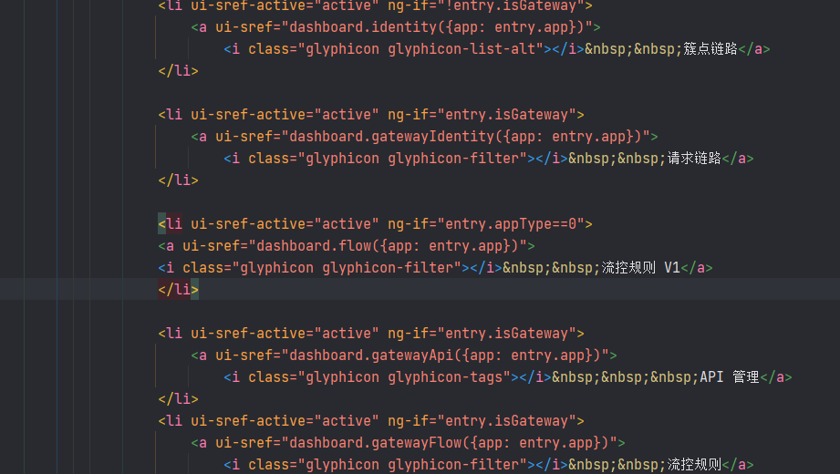


修改其中的文本


```html
<div class="navbar-default sidebar" role="navigation" style="overflow-y: auto;">
    <div class="sidebar-nav navbar-collapse">
        <ul class="nav in" id="side-menu">
            <li class="sidebar-search">
                <div class="input-group" style="">
                    <input type="text" class="form-control highlight-border" placeholder="应用名" ng-model="searchApp">
                    <span class="input-group-btn">
            <button class="btn btn-secondary btn-default-inverse" type="button">搜索</button>
          </span>
                </div>
            </li>
            <li ui-sref-active="active">
                <a ui-sref="dashboard.home" style="font-size:16px;">
                    <span class="glyphicon glyphicon-dashboard"></span>
                    &nbsp;&nbsp;首页</a>
            </li>

            <li ng-class="{active: true}" ng-repeat="entry in apps | filter: { app: searchApp }">{{dropDown}}
                <a href="javascript:void(0);" ng-click="click($event)" collapse="{{collpaseall == 1}}"
                   style="font-size: 16px;word-break: break-word;">
                    &nbsp;{{entry.app}}
                    <span class="fa arrow"></span>
                    <span class="arrow">({{entry.healthyCount}}/{{entry.machines.length}})</span>
                </a>

                <!--<ul class="nav nav-second-level" collapse="{{entry.active}}" style="display: none;">-->
                <ul class="nav nav-second-level" ng-show="entry.active">
                    <li ui-sref-active="active">
                        <a ui-sref="dashboard.metric({app: entry.app})">
                            <i class="fa fa-bar-chart"></i>&nbsp;&nbsp;实时监控</a>
                    </li>

                    <li ui-sref-active="active" ng-if="!entry.isGateway">
                        <a ui-sref="dashboard.identity({app: entry.app})">
                            <i class="glyphicon glyphicon-list-alt"></i>&nbsp;&nbsp;簇点链路</a>
                    </li>

                    <li ui-sref-active="active" ng-if="entry.isGateway">
                        <a ui-sref="dashboard.gatewayIdentity({app: entry.app})">
                            <i class="glyphicon glyphicon-filter"></i>&nbsp;&nbsp;请求链路</a>
                    </li>

                    <li ui-sref-active="active" ng-if="entry.appType==0">
                        <a ui-sref="dashboard.flow({app: entry.app})">
                            <i class="glyphicon glyphicon-filter"></i>&nbsp;&nbsp;流控规则-Nacos</a>
                    </li>

                    <li ui-sref-active="active" ng-if="entry.isGateway">
                        <a ui-sref="dashboard.gatewayApi({app: entry.app})">
                            <i class="glyphicon glyphicon-tags"></i>&nbsp;&nbsp;&nbsp;API 管理</a>
                    </li>
                    <li ui-sref-active="active" ng-if="entry.isGateway">
                        <a ui-sref="dashboard.gatewayFlow({app: entry.app})">
                            <i class="glyphicon glyphicon-filter"></i>&nbsp;&nbsp;流控规则</a>
                    </li>

                    <li ui-sref-active="active" ng-if="!entry.isGateway">
                        <a ui-sref="dashboard.flowV1({app: entry.app})">
                            <i class="glyphicon glyphicon-filter"></i>&nbsp;&nbsp;流控规则</a>
                    </li>

                    <li ui-sref-active="active">
                        <a ui-sref="dashboard.degrade({app: entry.app})">
                            <i class="glyphicon glyphicon-flash"></i>&nbsp;&nbsp;降级规则</a>
                    </li>
                    <li ui-sref-active="active" ng-if="!entry.isGateway">
                        <a ui-sref="dashboard.paramFlow({app: entry.app})">
                            <i class="glyphicon glyphicon-fire"></i>&nbsp;&nbsp;热点规则</a>
                    </li>
                    <li ui-sref-active="active">
                        <a ui-sref="dashboard.system({app: entry.app})">
                            <i class="glyphicon glyphicon-lock"></i>&nbsp;&nbsp;系统规则</a>
                    </li>
                    <li ui-sref-active="active" ng-if="!entry.isGateway">
                        <a ui-sref="dashboard.authority({app: entry.app})">
                            <i class="glyphicon glyphicon-check"></i>&nbsp;&nbsp;授权规则</a>
                    </li>
                    <li ui-sref-active="active" ng-if="!entry.isGateway">
                        <a ui-sref="dashboard.clusterAppServerList({app: entry.app})">
                            <i class="glyphicon glyphicon-cloud"></i>&nbsp;&nbsp;集群流控</a>
                    </li>

                    <li ui-sref-active="active">
                        <a ui-sref="dashboard.machine({app: entry.app})">
                            <i class="glyphicon glyphicon-th-list"></i>&nbsp;&nbsp;机器列表</a>
                    </li>
                </ul>
                <!-- /.nav-second-level -->
            </li>
        </ul>
    </div>
</div>
```


#### 12. 修改配置


添加

```properties
nacos.nacosAddress=localhost:8848
```


```properties
#spring settings
spring.http.encoding.force=true
spring.http.encoding.charset=UTF-8
spring.http.encoding.enabled=true

#cookie name setting
server.servlet.session.cookie.name=sentinel_dashboard_cookie

#logging settings
logging.level.org.springframework.web=INFO
logging.file=${user.home}/logs/csp/sentinel-dashboard.log
logging.pattern.file= %d{yyyy-MM-dd HH:mm:ss} [%thread] %-5level %logger{36} - %msg%n
#logging.pattern.console= %d{yyyy-MM-dd HH:mm:ss} [%thread] %-5level %logger{36} - %msg%n

#auth settings
auth.filter.exclude-urls=/,/auth/login,/auth/logout,/registry/machine,/version
auth.filter.exclude-url-suffixes=htm,html,js,css,map,ico,ttf,woff,png
# If auth.enabled=false, Sentinel console disable login
auth.username=sentinel
auth.password=sentinel

# Inject the dashboard version. It's required to enable
# filtering in pom.xml for this resource file.
sentinel.dashboard.version=${project.version}

nacos.nacosAddress=localhost:8848

server.port=8099
```


也可以设置用户名和密码

```properties
auth.username=sentinel
auth.password=sentinel
```


#### 13. 跳过测试


#### 14. 打包


需要使用java8打包

```sh
C:\Users\mao\.jdks\openjdk-16.0.2\bin\java.exe -Dmaven.multiModuleProjectDirectory=H:\程序\大三暑假\Sentinel-1.8.1\sentinel-dashboard -Xms256m -Xmx512m -Dfile.encoding=UTF-8 "-Dmaven.home=C:\Program Files\JetBrains\IntelliJ IDEA 2021.2.2\plugins\maven\lib\maven3" "-Dclassworlds.conf=C:\Program Files\JetBrains\IntelliJ IDEA 2021.2.2\plugins\maven\lib\maven3\bin\m2.conf" "-Dmaven.ext.class.path=C:\Program Files\JetBrains\IntelliJ IDEA 2021.2.2\plugins\maven\lib\maven-event-listener.jar" "-javaagent:C:\Program Files\JetBrains\IntelliJ IDEA 2021.2.2\lib\idea_rt.jar=49934:C:\Program Files\JetBrains\IntelliJ IDEA 2021.2.2\bin" -classpath "C:\Program Files\JetBrains\IntelliJ IDEA 2021.2.2\plugins\maven\lib\maven3\boot\plexus-classworlds-2.6.0.jar;C:\Program Files\JetBrains\IntelliJ IDEA 2021.2.2\plugins\maven\lib\maven3\boot\plexus-classworlds.license" org.codehaus.classworlds.Launcher -Didea.version=2021.2.2 -DskipTests=true package
[INFO] Scanning for projects...
[INFO] 
[INFO] -----------------< com.alibaba.csp:sentinel-dashboard >-----------------
[INFO] Building sentinel-dashboard 1.8.1
[INFO] --------------------------------[ jar ]---------------------------------
[INFO] 
[INFO] --- jacoco-maven-plugin:0.8.3:prepare-agent (default) @ sentinel-dashboard ---
[INFO] argLine set to -javaagent:C:\\Users\\mao\\.m2\\repository\\org\\jacoco\\org.jacoco.agent\\0.8.3\\org.jacoco.agent-0.8.3-runtime.jar=destfile=H:\\程序\\大三暑假\\Sentinel-1.8.1\\sentinel-dashboard\\target\\jacoco.exec
[INFO] 
[INFO] --- maven-resources-plugin:2.6:resources (default-resources) @ sentinel-dashboard ---
[INFO] Using 'UTF-8' encoding to copy filtered resources.
[INFO] Copying 1 resource
[INFO] Copying 107 resources
[INFO] 
[INFO] --- maven-compiler-plugin:3.8.0:compile (default-compile) @ sentinel-dashboard ---
[INFO] Changes detected - recompiling the module!
[INFO] Compiling 111 source files to H:\程序\大三暑假\Sentinel-1.8.1\sentinel-dashboard\target\classes
[INFO] 
[INFO] --- maven-resources-plugin:2.6:testResources (default-testResources) @ sentinel-dashboard ---
[INFO] Using 'UTF-8' encoding to copy filtered resources.
[INFO] skip non existing resourceDirectory H:\程序\大三暑假\Sentinel-1.8.1\sentinel-dashboard\src\test\resources
[INFO] 
[INFO] --- maven-compiler-plugin:3.8.0:testCompile (default-testCompile) @ sentinel-dashboard ---
[INFO] Changes detected - recompiling the module!
[INFO] Compiling 22 source files to H:\程序\大三暑假\Sentinel-1.8.1\sentinel-dashboard\target\test-classes
[INFO] /H:/程序/大三暑假/Sentinel-1.8.1/sentinel-dashboard/src/test/java/com/alibaba/csp/sentinel/dashboard/controller/gateway/GatewayApiControllerTest.java: 某些输入文件使用了未经检查或不安全的操作。
[INFO] /H:/程序/大三暑假/Sentinel-1.8.1/sentinel-dashboard/src/test/java/com/alibaba/csp/sentinel/dashboard/controller/gateway/GatewayApiControllerTest.java: 有关详细信息, 请使用 -Xlint:unchecked 重新编译。
[INFO] 
[INFO] --- maven-surefire-plugin:2.22.1:test (default-test) @ sentinel-dashboard ---
[INFO] Tests are skipped.
[INFO] 
[INFO] --- jacoco-maven-plugin:0.8.3:report (report) @ sentinel-dashboard ---
[INFO] Skipping JaCoCo execution due to missing execution data file.
[INFO] 
[INFO] --- maven-jar-plugin:3.1.0:jar (default-jar) @ sentinel-dashboard ---
[INFO] Building jar: H:\程序\大三暑假\Sentinel-1.8.1\sentinel-dashboard\target\sentinel-dashboard.jar
[INFO] 
[INFO] --- spring-boot-maven-plugin:2.0.5.RELEASE:repackage (default) @ sentinel-dashboard ---
[INFO] ------------------------------------------------------------------------
[INFO] BUILD SUCCESS
[INFO] ------------------------------------------------------------------------
[INFO] Total time:  7.845 s
[INFO] Finished at: 2022-07-23T15:26:48+08:00
[INFO] ------------------------------------------------------------------------

```

使用的是java8打包


#### 15. 进入jar包所在目录


```sh
PS H:\程序\大三暑假\Sentinel-1.8.1\sentinel-dashboard\target> ls


    目录: H:\程序\大三暑假\Sentinel-1.8.1\sentinel-dashboard\target


Mode                 LastWriteTime         Length Name
----                 -------------         ------ ----
d-----         2022/7/23     15:26                classes
d-----         2022/7/23     15:26                generated-sources
d-----         2022/7/23     15:26                generated-test-sources
d-----         2022/7/23     15:26                maven-archiver
d-----         2022/7/23     15:26                maven-status
d-----         2022/7/23     15:26                test-classes
-a----         2022/7/23     15:26       24917518 sentinel-dashboard.jar
-a----         2022/7/23     15:26        1137010 sentinel-dashboard.jar.original


PS H:\程序\大三暑假\Sentinel-1.8.1\sentinel-dashboard\target>
```


#### 16. 运行


```sh
java -jar sentinel-dashboard.jar
```


```sh
java -jar sentinel-dashboard.jar --nacos.nacosAddress=localhost:8848
```


```sh
PS H:\程序\大三暑假\Sentinel-1.8.1\sentinel-dashboard\target> java -version
openjdk version "1.8.0_332"
OpenJDK Runtime Environment Corretto-8.332.08.1 (build 1.8.0_332-b08)
OpenJDK 64-Bit Server VM Corretto-8.332.08.1 (build 25.332-b08, mixed mode)
PS H:\程序\大三暑假\Sentinel-1.8.1\sentinel-dashboard\target>
PS H:\程序\大三暑假\Sentinel-1.8.1\sentinel-dashboard\target> java -jar sentinel-dashboard.jar
INFO: Sentinel log output type is: file
INFO: Sentinel log charset is: utf-8
INFO: Sentinel log base directory is: C:\Users\mao\logs\csp\
INFO: Sentinel log name use pid is: false

  .   ____          _            __ _ _
 /\\ / ___'_ __ _ _(_)_ __  __ _ \ \ \ \
( ( )\___ | '_ | '_| | '_ \/ _` | \ \ \ \
 \\/  ___)| |_)| | | | | || (_| |  ) ) ) )
  '  |____| .__|_| |_|_| |_\__, | / / / /
 =========|_|==============|___/=/_/_/_/
 :: Spring Boot ::        (v2.0.5.RELEASE)

2022-07-23 15:28:45.858  INFO 10640 --- [           main] c.a.c.s.dashboard.DashboardApplication   : Starting DashboardApplication on mao with PID 10640 (H:\程 序\大三暑假\Sentinel-1.8.1\sentinel-dashboard\target\sentinel-dashboard.jar started by mao in H:\程序\大三暑假\Sentinel-1.8.1\sentinel-dashboard\target)
2022-07-23 15:28:45.861  INFO 10640 --- [           main] c.a.c.s.dashboard.DashboardApplication   : No active profile set, falling back to default profiles: default
2022-07-23 15:28:45.912  INFO 10640 --- [           main] ConfigServletWebServerApplicationContext : Refreshing org.springframework.boot.web.servlet.context.AnnotationConfigServletWebServerApplicationContext@6c629d6e: startup date [Sat Jul 23 15:28:45 CST 2022]; root of context hierarchy
2022-07-23 15:28:47.236  INFO 10640 --- [           main] o.s.b.w.embedded.tomcat.TomcatWebServer  : Tomcat initialized with port(s): 8099 (http)
2022-07-23 15:28:47.261  INFO 10640 --- [           main] o.apache.catalina.core.StandardService   : Starting service [Tomcat]
2022-07-23 15:28:47.261  INFO 10640 --- [           main] org.apache.catalina.core.StandardEngine  : Starting Servlet Engine: Apache Tomcat/8.5.34
2022-07-23 15:28:47.272  INFO 10640 --- [ost-startStop-1] o.a.catalina.core.AprLifecycleListener   : The APR based Apache Tomcat Native library which allows optimal performance in production environments was not found on the java.library.path: [C:\Users\mao\.jdks\corretto-1.8.0_332\bin;C:\WINDOWS\Sun\Java\bin;C:\WINDOWS\system32;C:\WINDOWS;C:\Users\mao\.jdks\corretto-1.8.0_332\bin;C:\Program Files (x86)\VMware\VMware Workstation\bin\;C:\Program Files\Microsoft MPI\Bin\;C:\WINDOWS\system32;C:\WINDOWS;C:\WINDOWS\System32\Wbem;C:\WINDOWS\System32\WindowsPowerShell\v1.0\;C:\WINDOWS\System32\OpenSSH\;C:\Program Files (x86)\NVIDIA Corporation\PhysX\Common;C:\Program Files\dotnet\;C:\WINDOWS\system32;C:\WINDOWS;C:\WINDOWS\System32\Wbem;C:\WINDOWS\System32\WindowsPowerShell\v1.0\;C:\WINDOWS\System32\OpenSSH\;C:\Program Files\Microsoft SQL Server\Client SDK\ODBC\170\Tools\Binn\;C:\Program Files (x86)\Microsoft SQL Server\150\Tools\Binn\;C:\Program Files\Microsoft SQL Server\150\Tools\Binn\;C:\Program Files\Microsoft SQL Server\150\DTS\Binn\;C:\Program Files (x86)\dotnet\;C:\Program Files\Microsoft SQL Server\130\Tools\Binn\;C:\Program Files (x86)\Microsoft SQL Server\150\DTS\Binn\;C:\Program Files\Azure Data Studio\bin;C:\Program Files\MySQL\MySQL Server 8.0\bin;C:\Program Files\redis;C:\Program Files\nodejs\;C:\ProgramData\chocolatey\bin;C:\Program Files\zookeeper\bin;C:\Program Files\JetBrains\IntelliJ IDEA 2021.2.2\plugins\maven\lib\maven3\bin;C:\Program Files\erl-24.1\bin;C:\Program Files\RabbitMQ Server\rabbitmq_server-3.9.14\bin;C:\Program Files\Git\bin;C:\Program Files\elasticsearch-8.1.3\bin;H:\opensoft\kibana-8.1.3\bin;H:\opensoft\apache-jmeter-5.4.3\bin;H:\opensoft\logstash-8.1.3\bin;;C:\Program Files\Docker\Docker\resources\bin;C:\ProgramData\DockerDesktop\version-bin;C:\Users\mao\AppData\Local\Programs\Python\Python39\Scripts\;C:\Users\mao\AppData\Local\Programs\Python\Python39\;C:\Program Files\MySQL\MySQL Shell 8.0\bin\;C:\Users\mao\AppData\Local\Microsoft\WindowsApps;C:\Users\mao\.dotnet\tools;C:\Users\mao\AppData\Local\GitHubDesktop\bin;C:\Program Files\JetBrains\PyCharm 2021.2.2\bin;C:\Users\mao\AppData\Roaming\npm;C:\Users\mao\AppData\Local\Pandoc\;.]
2022-07-23 15:28:47.345  INFO 10640 --- [ost-startStop-1] o.a.c.c.C.[Tomcat].[localhost].[/]       : Initializing Spring embedded WebApplicationContext
2022-07-23 15:28:47.346  INFO 10640 --- [ost-startStop-1] o.s.web.context.ContextLoader            : Root WebApplicationContext: initialization completed in 1434 ms
2022-07-23 15:28:47.407  INFO 10640 --- [ost-startStop-1] c.a.c.s.dashboard.config.WebConfig       : Sentinel servlet CommonFilter registered
2022-07-23 15:28:47.466  INFO 10640 --- [ost-startStop-1] o.s.b.w.servlet.FilterRegistrationBean   : Mapping filter: 'characterEncodingFilter' to: [/*]
2022-07-23 15:28:47.467  INFO 10640 --- [ost-startStop-1] o.s.b.w.servlet.FilterRegistrationBean   : Mapping filter: 'hiddenHttpMethodFilter' to: [/*]
2022-07-23 15:28:47.468  INFO 10640 --- [ost-startStop-1] o.s.b.w.servlet.FilterRegistrationBean   : Mapping filter: 'httpPutFormContentFilter' to: [/*]
2022-07-23 15:28:47.469  INFO 10640 --- [ost-startStop-1] o.s.b.w.servlet.FilterRegistrationBean   : Mapping filter: 'requestContextFilter' to: [/*]
2022-07-23 15:28:47.469  INFO 10640 --- [ost-startStop-1] o.s.b.w.servlet.FilterRegistrationBean   : Mapping filter: 'authenticationFilter' to urls: [/*]
2022-07-23 15:28:47.469  INFO 10640 --- [ost-startStop-1] o.s.b.w.servlet.FilterRegistrationBean   : Mapping filter: 'sentinelFilter' to urls: [/*]
2022-07-23 15:28:47.470  INFO 10640 --- [ost-startStop-1] o.s.b.w.servlet.ServletRegistrationBean  : Servlet dispatcherServlet mapped to [/]
2022-07-23 15:28:47.806  INFO 10640 --- [           main] c.a.c.s.d.rule.nacos.NacosConfig         : 加载bean：nacosConfigService，nacos地址：localhost:8848
2022-07-23 15:28:48.001  INFO 10640 --- [           main] o.s.w.s.handler.SimpleUrlHandlerMapping  : Mapped URL path [/**/favicon.ico] onto handler of type [class org.springframework.web.servlet.resource.ResourceHttpRequestHandler]
2022-07-23 15:28:48.152  INFO 10640 --- [           main] s.w.s.m.m.a.RequestMappingHandlerAdapter : Looking for @ControllerAdvice: org.springframework.boot.web.servlet.context.AnnotationConfigServletWebServerApplicationContext@6c629d6e: startup date [Sat Jul 23 15:28:45 CST 2022]; root of context hierarchy
2022-07-23 15:28:48.239  INFO 10640 --- [           main] s.w.s.m.m.a.RequestMappingHandlerMapping : Mapped "{[/registry/machine],produces=[application/json]}" onto public com.alibaba.csp.sentinel.dashboard.domain.Result<?> com.alibaba.csp.sentinel.dashboard.controller.MachineRegistryController.receiveHeartBeat(java.lang.String,java.lang.Integer,java.lang.Long,java.lang.String,java.lang.String,java.lang.String,java.lang.Integer)
2022-07-23 15:28:48.244  INFO 10640 --- [           main] s.w.s.m.m.a.RequestMappingHandlerMapping : Mapped "{[/resource/machineResource.json],methods=[GET]}" onto public com.alibaba.csp.sentinel.dashboard.domain.Result<java.util.List<com.alibaba.csp.sentinel.dashboard.domain.vo.ResourceVo>> com.alibaba.csp.sentinel.dashboard.controller.ResourceController.fetchResourceChainListOfMachine(java.lang.String,java.lang.Integer,java.lang.String,java.lang.String)
2022-07-23 15:28:48.246  INFO 10640 --- [           main] s.w.s.m.m.a.RequestMappingHandlerMapping : Mapped "{[/app/{app}/machines.json],methods=[GET]}" onto public com.alibaba.csp.sentinel.dashboard.domain.Result<java.util.List<com.alibaba.csp.sentinel.dashboard.domain.vo.MachineInfoVo>> com.alibaba.csp.sentinel.dashboard.controller.AppController.getMachinesByApp(java.lang.String)
2022-07-23 15:28:48.247  INFO 10640 --- [           main] s.w.s.m.m.a.RequestMappingHandlerMapping : Mapped "{[/app/names.json],methods=[GET]}" onto public com.alibaba.csp.sentinel.dashboard.domain.Result<java.util.List<java.lang.String>> com.alibaba.csp.sentinel.dashboard.controller.AppController.queryApps(javax.servlet.http.HttpServletRequest)
2022-07-23 15:28:48.248  INFO 10640 --- [           main] s.w.s.m.m.a.RequestMappingHandlerMapping : Mapped "{[/app/briefinfos.json],methods=[GET]}" onto public com.alibaba.csp.sentinel.dashboard.domain.Result<java.util.List<com.alibaba.csp.sentinel.dashboard.discovery.AppInfo>> com.alibaba.csp.sentinel.dashboard.controller.AppController.queryAppInfos(javax.servlet.http.HttpServletRequest)
2022-07-23 15:28:48.249  INFO 10640 --- [           main] s.w.s.m.m.a.RequestMappingHandlerMapping : Mapped "{[/app/{app}/machine/remove.json]}" onto public com.alibaba.csp.sentinel.dashboard.domain.Result<java.lang.String> com.alibaba.csp.sentinel.dashboard.controller.AppController.removeMachineById(java.lang.String,java.lang.String,int)
2022-07-23 15:28:48.252  INFO 10640 --- [           main] s.w.s.m.m.a.RequestMappingHandlerMapping : Mapped "{[/system/new.json]}" onto public com.alibaba.csp.sentinel.dashboard.domain.Result<com.alibaba.csp.sentinel.dashboard.datasource.entity.rule.SystemRuleEntity> com.alibaba.csp.sentinel.dashboard.controller.SystemController.apiAdd(java.lang.String,java.lang.String,java.lang.Integer,java.lang.Double,java.lang.Double,java.lang.Long,java.lang.Long,java.lang.Double)
2022-07-23 15:28:48.252  INFO 10640 --- [           main] s.w.s.m.m.a.RequestMappingHandlerMapping : Mapped "{[/system/save.json],methods=[GET]}" onto public com.alibaba.csp.sentinel.dashboard.domain.Result<com.alibaba.csp.sentinel.dashboard.datasource.entity.rule.SystemRuleEntity> com.alibaba.csp.sentinel.dashboard.controller.SystemController.apiUpdateIfNotNull(java.lang.Long,java.lang.String,java.lang.Double,java.lang.Double,java.lang.Long,java.lang.Long,java.lang.Double)
2022-07-23 15:28:48.253  INFO 10640 --- [           main] s.w.s.m.m.a.RequestMappingHandlerMapping : Mapped "{[/system/rules.json],methods=[GET]}" onto public com.alibaba.csp.sentinel.dashboard.domain.Result<java.util.List<com.alibaba.csp.sentinel.dashboard.datasource.entity.rule.SystemRuleEntity>> com.alibaba.csp.sentinel.dashboard.controller.SystemController.apiQueryMachineRules(java.lang.String,java.lang.String,java.lang.Integer)
2022-07-23 15:28:48.254  INFO 10640 --- [           main] s.w.s.m.m.a.RequestMappingHandlerMapping : Mapped "{[/system/delete.json]}" onto public com.alibaba.csp.sentinel.dashboard.domain.Result<?> com.alibaba.csp.sentinel.dashboard.controller.SystemController.delete(java.lang.Long)
2022-07-23 15:28:48.257  INFO 10640 --- [           main] s.w.s.m.m.a.RequestMappingHandlerMapping : Mapped "{[/metric/queryTopResourceMetric.json],produces=[application/json]}" onto public com.alibaba.csp.sentinel.dashboard.domain.Result<?> com.alibaba.csp.sentinel.dashboard.controller.MetricController.queryTopResourceMetric(java.lang.String,java.lang.Integer,java.lang.Integer,java.lang.Boolean,java.lang.Long,java.lang.Long,java.lang.String)
2022-07-23 15:28:48.258  INFO 10640 --- [           main] s.w.s.m.m.a.RequestMappingHandlerMapping : Mapped "{[/metric/queryByAppAndResource.json],produces=[application/json]}" onto public com.alibaba.csp.sentinel.dashboard.domain.Result<?> com.alibaba.csp.sentinel.dashboard.controller.MetricController.queryByAppAndResource(java.lang.String,java.lang.String,java.lang.Long,java.lang.Long)
2022-07-23 15:28:48.262  INFO 10640 --- [           main] s.w.s.m.m.a.RequestMappingHandlerMapping : Mapped "{[/auth/login],methods=[POST]}" onto public com.alibaba.csp.sentinel.dashboard.domain.Result<com.alibaba.csp.sentinel.dashboard.auth.AuthService$AuthUser> com.alibaba.csp.sentinel.dashboard.controller.AuthController.login(javax.servlet.http.HttpServletRequest,java.lang.String,java.lang.String)
2022-07-23 15:28:48.263  INFO 10640 --- [           main] s.w.s.m.m.a.RequestMappingHandlerMapping : Mapped "{[/auth/logout],methods=[POST]}" onto public com.alibaba.csp.sentinel.dashboard.domain.Result<?> com.alibaba.csp.sentinel.dashboard.controller.AuthController.logout(javax.servlet.http.HttpServletRequest)
2022-07-23 15:28:48.264  INFO 10640 --- [           main] s.w.s.m.m.a.RequestMappingHandlerMapping : Mapped "{[/auth/check],methods=[POST]}" onto public com.alibaba.csp.sentinel.dashboard.domain.Result<?> com.alibaba.csp.sentinel.dashboard.controller.AuthController.check(javax.servlet.http.HttpServletRequest)
2022-07-23 15:28:48.270  INFO 10640 --- [           main] s.w.s.m.m.a.RequestMappingHandlerMapping : Mapped "{[/v2/flow/rule],methods=[POST]}" onto public com.alibaba.csp.sentinel.dashboard.domain.Result<com.alibaba.csp.sentinel.dashboard.datasource.entity.rule.FlowRuleEntity> com.alibaba.csp.sentinel.dashboard.controller.v2.FlowControllerV2.apiAddFlowRule(com.alibaba.csp.sentinel.dashboard.datasource.entity.rule.FlowRuleEntity)
2022-07-23 15:28:48.271  INFO 10640 --- [           main] s.w.s.m.m.a.RequestMappingHandlerMapping : Mapped "{[/v2/flow/rule/{id}],methods=[DELETE]}" onto public com.alibaba.csp.sentinel.dashboard.domain.Result<java.lang.Long> com.alibaba.csp.sentinel.dashboard.controller.v2.FlowControllerV2.apiDeleteRule(java.lang.Long)
2022-07-23 15:28:48.272  INFO 10640 --- [           main] s.w.s.m.m.a.RequestMappingHandlerMapping : Mapped "{[/v2/flow/rules],methods=[GET]}" onto public com.alibaba.csp.sentinel.dashboard.domain.Result<java.util.List<com.alibaba.csp.sentinel.dashboard.datasource.entity.rule.FlowRuleEntity>> com.alibaba.csp.sentinel.dashboard.controller.v2.FlowControllerV2.apiQueryMachineRules(java.lang.String)
2022-07-23 15:28:48.273  INFO 10640 --- [           main] s.w.s.m.m.a.RequestMappingHandlerMapping : Mapped "{[/v2/flow/rule/{id}],methods=[PUT]}" onto public com.alibaba.csp.sentinel.dashboard.domain.Result<com.alibaba.csp.sentinel.dashboard.datasource.entity.rule.FlowRuleEntity> com.alibaba.csp.sentinel.dashboard.controller.v2.FlowControllerV2.apiUpdateFlowRule(java.lang.Long,com.alibaba.csp.sentinel.dashboard.datasource.entity.rule.FlowRuleEntity)
2022-07-23 15:28:48.275  INFO 10640 --- [           main] s.w.s.m.m.a.RequestMappingHandlerMapping : Mapped "{[/authority/rule/{id}],methods=[DELETE]}" onto public com.alibaba.csp.sentinel.dashboard.domain.Result<java.lang.Long> com.alibaba.csp.sentinel.dashboard.controller.AuthorityRuleController.apiDeleteRule(java.lang.Long)
2022-07-23 15:28:48.276  INFO 10640 --- [           main] s.w.s.m.m.a.RequestMappingHandlerMapping : Mapped "{[/authority/rule],methods=[POST]}" onto public com.alibaba.csp.sentinel.dashboard.domain.Result<com.alibaba.csp.sentinel.dashboard.datasource.entity.rule.AuthorityRuleEntity> com.alibaba.csp.sentinel.dashboard.controller.AuthorityRuleController.apiAddAuthorityRule(com.alibaba.csp.sentinel.dashboard.datasource.entity.rule.AuthorityRuleEntity)
2022-07-23 15:28:48.277  INFO 10640 --- [           main] s.w.s.m.m.a.RequestMappingHandlerMapping : Mapped "{[/authority/rule/{id}],methods=[PUT]}" onto public com.alibaba.csp.sentinel.dashboard.domain.Result<com.alibaba.csp.sentinel.dashboard.datasource.entity.rule.AuthorityRuleEntity> com.alibaba.csp.sentinel.dashboard.controller.AuthorityRuleController.apiUpdateParamFlowRule(java.lang.Long,com.alibaba.csp.sentinel.dashboard.datasource.entity.rule.AuthorityRuleEntity)
2022-07-23 15:28:48.277  INFO 10640 --- [           main] s.w.s.m.m.a.RequestMappingHandlerMapping : Mapped "{[/authority/rules],methods=[GET]}" onto public com.alibaba.csp.sentinel.dashboard.domain.Result<java.util.List<com.alibaba.csp.sentinel.dashboard.datasource.entity.rule.AuthorityRuleEntity>> com.alibaba.csp.sentinel.dashboard.controller.AuthorityRuleController.apiQueryAllRulesForMachine(java.lang.String,java.lang.String,java.lang.Integer)
2022-07-23 15:28:48.278  INFO 10640 --- [           main] s.w.s.m.m.a.RequestMappingHandlerMapping : Mapped "{[/version],methods=[GET]}" onto public com.alibaba.csp.sentinel.dashboard.domain.Result<java.lang.String> com.alibaba.csp.sentinel.dashboard.controller.VersionController.apiGetVersion()
2022-07-23 15:28:48.280  INFO 10640 --- [           main] s.w.s.m.m.a.RequestMappingHandlerMapping : Mapped "{[/cluster/assign/single_server/{app}],methods=[POST]}" onto public com.alibaba.csp.sentinel.dashboard.domain.Result<com.alibaba.csp.sentinel.dashboard.domain.cluster.ClusterAppAssignResultVO> com.alibaba.csp.sentinel.dashboard.controller.cluster.ClusterAssignController.apiAssignSingleClusterServersOfApp(java.lang.String,com.alibaba.csp.sentinel.dashboard.domain.cluster.ClusterAppSingleServerAssignRequest)
2022-07-23 15:28:48.280  INFO 10640 --- [           main] s.w.s.m.m.a.RequestMappingHandlerMapping : Mapped "{[/cluster/assign/all_server/{app}],methods=[POST]}" onto public com.alibaba.csp.sentinel.dashboard.domain.Result<com.alibaba.csp.sentinel.dashboard.domain.cluster.ClusterAppAssignResultVO> com.alibaba.csp.sentinel.dashboard.controller.cluster.ClusterAssignController.apiAssignAllClusterServersOfApp(java.lang.String,com.alibaba.csp.sentinel.dashboard.domain.cluster.ClusterAppFullAssignRequest)
2022-07-23 15:28:48.281  INFO 10640 --- [           main] s.w.s.m.m.a.RequestMappingHandlerMapping : Mapped "{[/cluster/assign/unbind_server/{app}],methods=[POST]}" onto public com.alibaba.csp.sentinel.dashboard.domain.Result<com.alibaba.csp.sentinel.dashboard.domain.cluster.ClusterAppAssignResultVO> com.alibaba.csp.sentinel.dashboard.controller.cluster.ClusterAssignController.apiUnbindClusterServersOfApp(java.lang.String,java.util.Set<java.lang.String>)
2022-07-23 15:28:48.287  INFO 10640 --- [           main] s.w.s.m.m.a.RequestMappingHandlerMapping : Mapped "{[/degrade/rule/{id}],methods=[PUT]}" onto public com.alibaba.csp.sentinel.dashboard.domain.Result<com.alibaba.csp.sentinel.dashboard.datasource.entity.rule.DegradeRuleEntity> com.alibaba.csp.sentinel.dashboard.controller.DegradeController.apiUpdateRule(java.lang.Long,com.alibaba.csp.sentinel.dashboard.datasource.entity.rule.DegradeRuleEntity)
2022-07-23 15:28:48.288  INFO 10640 --- [           main] s.w.s.m.m.a.RequestMappingHandlerMapping : Mapped "{[/degrade/rule],methods=[POST]}" onto public com.alibaba.csp.sentinel.dashboard.domain.Result<com.alibaba.csp.sentinel.dashboard.datasource.entity.rule.DegradeRuleEntity> com.alibaba.csp.sentinel.dashboard.controller.DegradeController.apiAddRule(com.alibaba.csp.sentinel.dashboard.datasource.entity.rule.DegradeRuleEntity)
2022-07-23 15:28:48.288  INFO 10640 --- [           main] s.w.s.m.m.a.RequestMappingHandlerMapping : Mapped "{[/degrade/rules.json],methods=[GET]}" onto public com.alibaba.csp.sentinel.dashboard.domain.Result<java.util.List<com.alibaba.csp.sentinel.dashboard.datasource.entity.rule.DegradeRuleEntity>> com.alibaba.csp.sentinel.dashboard.controller.DegradeController.apiQueryMachineRules(java.lang.String,java.lang.String,java.lang.Integer)
2022-07-23 15:28:48.289  INFO 10640 --- [           main] s.w.s.m.m.a.RequestMappingHandlerMapping : Mapped "{[/degrade/rule/{id}],methods=[DELETE]}" onto public com.alibaba.csp.sentinel.dashboard.domain.Result<java.lang.Long> com.alibaba.csp.sentinel.dashboard.controller.DegradeController.delete(java.lang.Long)
2022-07-23 15:28:48.292  INFO 10640 --- [           main] s.w.s.m.m.a.RequestMappingHandlerMapping : Mapped "{[/cluster/state_single],methods=[GET]}" onto public com.alibaba.csp.sentinel.dashboard.domain.Result<com.alibaba.csp.sentinel.dashboard.domain.cluster.state.ClusterUniversalStateVO> com.alibaba.csp.sentinel.dashboard.controller.cluster.ClusterConfigController.apiGetClusterState(java.lang.String,java.lang.String,java.lang.Integer)
2022-07-23 15:28:48.292  INFO 10640 --- [           main] s.w.s.m.m.a.RequestMappingHandlerMapping : Mapped "{[/cluster/state/{app}],methods=[GET]}" onto public com.alibaba.csp.sentinel.dashboard.domain.Result<java.util.List<com.alibaba.csp.sentinel.dashboard.domain.cluster.state.ClusterUniversalStatePairVO>> com.alibaba.csp.sentinel.dashboard.controller.cluster.ClusterConfigController.apiGetClusterStateOfApp(java.lang.String)
2022-07-23 15:28:48.293  INFO 10640 --- [           main] s.w.s.m.m.a.RequestMappingHandlerMapping : Mapped "{[/cluster/config/modify_single],methods=[POST]}" onto public com.alibaba.csp.sentinel.dashboard.domain.Result<java.lang.Boolean> com.alibaba.csp.sentinel.dashboard.controller.cluster.ClusterConfigController.apiModifyClusterConfig(java.lang.String)
2022-07-23 15:28:48.293  INFO 10640 --- [           main] s.w.s.m.m.a.RequestMappingHandlerMapping : Mapped "{[/cluster/client_state/{app}],methods=[GET]}" onto public com.alibaba.csp.sentinel.dashboard.domain.Result<java.util.List<com.alibaba.csp.sentinel.dashboard.domain.cluster.state.AppClusterClientStateWrapVO>> com.alibaba.csp.sentinel.dashboard.controller.cluster.ClusterConfigController.apiGetClusterClientStateOfApp(java.lang.String)
2022-07-23 15:28:48.294  INFO 10640 --- [           main] s.w.s.m.m.a.RequestMappingHandlerMapping : Mapped "{[/cluster/server_state/{app}],methods=[GET]}" onto public com.alibaba.csp.sentinel.dashboard.domain.Result<java.util.List<com.alibaba.csp.sentinel.dashboard.domain.cluster.state.AppClusterServerStateWrapVO>> com.alibaba.csp.sentinel.dashboard.controller.cluster.ClusterConfigController.apiGetClusterServerStateOfApp(java.lang.String)
2022-07-23 15:28:48.295  INFO 10640 --- [           main] s.w.s.m.m.a.RequestMappingHandlerMapping : Mapped "{[/demo/loop],produces=[application/json]}" onto public java.lang.String com.alibaba.csp.sentinel.dashboard.controller.DemoController.loop(java.lang.String,int) throws com.alibaba.csp.sentinel.slots.block.BlockException
2022-07-23 15:28:48.296  INFO 10640 --- [           main] s.w.s.m.m.a.RequestMappingHandlerMapping : Mapped "{[/demo/link],produces=[application/json]}" onto public java.lang.String com.alibaba.csp.sentinel.dashboard.controller.DemoController.link() throws com.alibaba.csp.sentinel.slots.block.BlockException
2022-07-23 15:28:48.297  INFO 10640 --- [           main] s.w.s.m.m.a.RequestMappingHandlerMapping : Mapped "{[/demo/slow],produces=[application/json]}" onto public java.lang.String com.alibaba.csp.sentinel.dashboard.controller.DemoController.slow(java.lang.String,int) throws com.alibaba.csp.sentinel.slots.block.BlockException
2022-07-23 15:28:48.302  INFO 10640 --- [           main] s.w.s.m.m.a.RequestMappingHandlerMapping : Mapped "{[/demo/greeting],produces=[application/json]}" onto public java.lang.String com.alibaba.csp.sentinel.dashboard.controller.DemoController.greeting()
2022-07-23 15:28:48.304  INFO 10640 --- [           main] s.w.s.m.m.a.RequestMappingHandlerMapping : Mapped "{[/v1/flow/rule],methods=[POST]}" onto public com.alibaba.csp.sentinel.dashboard.domain.Result<com.alibaba.csp.sentinel.dashboard.datasource.entity.rule.FlowRuleEntity> com.alibaba.csp.sentinel.dashboard.controller.FlowControllerV1.apiAddFlowRule(com.alibaba.csp.sentinel.dashboard.datasource.entity.rule.FlowRuleEntity)
2022-07-23 15:28:48.305  INFO 10640 --- [           main] s.w.s.m.m.a.RequestMappingHandlerMapping : Mapped "{[/v1/flow/rules],methods=[GET]}" onto public com.alibaba.csp.sentinel.dashboard.domain.Result<java.util.List<com.alibaba.csp.sentinel.dashboard.datasource.entity.rule.FlowRuleEntity>> com.alibaba.csp.sentinel.dashboard.controller.FlowControllerV1.apiQueryMachineRules(java.lang.String,java.lang.String,java.lang.Integer)
2022-07-23 15:28:48.306  INFO 10640 --- [           main] s.w.s.m.m.a.RequestMappingHandlerMapping : Mapped "{[/v1/flow/save.json],methods=[PUT]}" onto public com.alibaba.csp.sentinel.dashboard.domain.Result<com.alibaba.csp.sentinel.dashboard.datasource.entity.rule.FlowRuleEntity> com.alibaba.csp.sentinel.dashboard.controller.FlowControllerV1.apiUpdateFlowRule(java.lang.Long,java.lang.String,java.lang.String,java.lang.String,java.lang.Integer,java.lang.Double,java.lang.Integer,java.lang.String,java.lang.Integer,java.lang.Integer,java.lang.Integer)
2022-07-23 15:28:48.306  INFO 10640 --- [           main] s.w.s.m.m.a.RequestMappingHandlerMapping : Mapped "{[/v1/flow/delete.json],methods=[DELETE]}" onto public com.alibaba.csp.sentinel.dashboard.domain.Result<java.lang.Long> com.alibaba.csp.sentinel.dashboard.controller.FlowControllerV1.apiDeleteFlowRule(java.lang.Long)
2022-07-23 15:28:48.312  INFO 10640 --- [           main] s.w.s.m.m.a.RequestMappingHandlerMapping : Mapped "{[/gateway/api/delete.json],methods=[POST]}" onto public com.alibaba.csp.sentinel.dashboard.domain.Result<java.lang.Long> com.alibaba.csp.sentinel.dashboard.controller.gateway.GatewayApiController.deleteApi(java.lang.Long)
2022-07-23 15:28:48.316  INFO 10640 --- [           main] s.w.s.m.m.a.RequestMappingHandlerMapping : Mapped "{[/gateway/api/new.json],methods=[POST]}" onto public com.alibaba.csp.sentinel.dashboard.domain.Result<com.alibaba.csp.sentinel.dashboard.datasource.entity.gateway.ApiDefinitionEntity> com.alibaba.csp.sentinel.dashboard.controller.gateway.GatewayApiController.addApi(javax.servlet.http.HttpServletRequest,com.alibaba.csp.sentinel.dashboard.domain.vo.gateway.api.AddApiReqVo)
2022-07-23 15:28:48.316  INFO 10640 --- [           main] s.w.s.m.m.a.RequestMappingHandlerMapping : Mapped "{[/gateway/api/save.json],methods=[POST]}" onto public com.alibaba.csp.sentinel.dashboard.domain.Result<com.alibaba.csp.sentinel.dashboard.datasource.entity.gateway.ApiDefinitionEntity> com.alibaba.csp.sentinel.dashboard.controller.gateway.GatewayApiController.updateApi(com.alibaba.csp.sentinel.dashboard.domain.vo.gateway.api.UpdateApiReqVo)
2022-07-23 15:28:48.317  INFO 10640 --- [           main] s.w.s.m.m.a.RequestMappingHandlerMapping : Mapped "{[/gateway/api/list.json],methods=[GET]}" onto public com.alibaba.csp.sentinel.dashboard.domain.Result<java.util.List<com.alibaba.csp.sentinel.dashboard.datasource.entity.gateway.ApiDefinitionEntity>> com.alibaba.csp.sentinel.dashboard.controller.gateway.GatewayApiController.queryApis(java.lang.String,java.lang.String,java.lang.Integer)
2022-07-23 15:28:48.322  INFO 10640 --- [           main] s.w.s.m.m.a.RequestMappingHandlerMapping : Mapped "{[/gateway/flow/list.json],methods=[GET]}" onto public com.alibaba.csp.sentinel.dashboard.domain.Result<java.util.List<com.alibaba.csp.sentinel.dashboard.datasource.entity.gateway.GatewayFlowRuleEntity>> com.alibaba.csp.sentinel.dashboard.controller.gateway.GatewayFlowRuleController.queryFlowRules(java.lang.String,java.lang.String,java.lang.Integer)
2022-07-23 15:28:48.323  INFO 10640 --- [           main] s.w.s.m.m.a.RequestMappingHandlerMapping : Mapped "{[/gateway/flow/new.json],methods=[POST]}" onto public com.alibaba.csp.sentinel.dashboard.domain.Result<com.alibaba.csp.sentinel.dashboard.datasource.entity.gateway.GatewayFlowRuleEntity> com.alibaba.csp.sentinel.dashboard.controller.gateway.GatewayFlowRuleController.addFlowRule(com.alibaba.csp.sentinel.dashboard.domain.vo.gateway.rule.AddFlowRuleReqVo)
2022-07-23 15:28:48.324  INFO 10640 --- [           main] s.w.s.m.m.a.RequestMappingHandlerMapping : Mapped "{[/gateway/flow/save.json],methods=[POST]}" onto public com.alibaba.csp.sentinel.dashboard.domain.Result<com.alibaba.csp.sentinel.dashboard.datasource.entity.gateway.GatewayFlowRuleEntity> com.alibaba.csp.sentinel.dashboard.controller.gateway.GatewayFlowRuleController.updateFlowRule(com.alibaba.csp.sentinel.dashboard.domain.vo.gateway.rule.UpdateFlowRuleReqVo)
2022-07-23 15:28:48.324  INFO 10640 --- [           main] s.w.s.m.m.a.RequestMappingHandlerMapping : Mapped "{[/gateway/flow/delete.json],methods=[POST]}" onto public com.alibaba.csp.sentinel.dashboard.domain.Result<java.lang.Long> com.alibaba.csp.sentinel.dashboard.controller.gateway.GatewayFlowRuleController.deleteFlowRule(java.lang.Long)
2022-07-23 15:28:48.326  INFO 10640 --- [           main] s.w.s.m.m.a.RequestMappingHandlerMapping : Mapped "{[/paramFlow/rule/{id}],methods=[DELETE]}" onto public com.alibaba.csp.sentinel.dashboard.domain.Result<java.lang.Long> com.alibaba.csp.sentinel.dashboard.controller.ParamFlowRuleController.apiDeleteRule(java.lang.Long)
2022-07-23 15:28:48.327  INFO 10640 --- [           main] s.w.s.m.m.a.RequestMappingHandlerMapping : Mapped "{[/paramFlow/rule/{id}],methods=[PUT]}" onto public com.alibaba.csp.sentinel.dashboard.domain.Result<com.alibaba.csp.sentinel.dashboard.datasource.entity.rule.ParamFlowRuleEntity> com.alibaba.csp.sentinel.dashboard.controller.ParamFlowRuleController.apiUpdateParamFlowRule(java.lang.Long,com.alibaba.csp.sentinel.dashboard.datasource.entity.rule.ParamFlowRuleEntity)
2022-07-23 15:28:48.328  INFO 10640 --- [           main] s.w.s.m.m.a.RequestMappingHandlerMapping : Mapped "{[/paramFlow/rules],methods=[GET]}" onto public com.alibaba.csp.sentinel.dashboard.domain.Result<java.util.List<com.alibaba.csp.sentinel.dashboard.datasource.entity.rule.ParamFlowRuleEntity>> com.alibaba.csp.sentinel.dashboard.controller.ParamFlowRuleController.apiQueryAllRulesForMachine(java.lang.String,java.lang.String,java.lang.Integer)
2022-07-23 15:28:48.333  INFO 10640 --- [           main] s.w.s.m.m.a.RequestMappingHandlerMapping : Mapped "{[/paramFlow/rule],methods=[POST]}" onto public com.alibaba.csp.sentinel.dashboard.domain.Result<com.alibaba.csp.sentinel.dashboard.datasource.entity.rule.ParamFlowRuleEntity> com.alibaba.csp.sentinel.dashboard.controller.ParamFlowRuleController.apiAddParamFlowRule(com.alibaba.csp.sentinel.dashboard.datasource.entity.rule.ParamFlowRuleEntity)
2022-07-23 15:28:48.336  INFO 10640 --- [           main] s.w.s.m.m.a.RequestMappingHandlerMapping : Mapped "{[/error],produces=[text/html]}" onto public org.springframework.web.servlet.ModelAndView org.springframework.boot.autoconfigure.web.servlet.error.BasicErrorController.errorHtml(javax.servlet.http.HttpServletRequest,javax.servlet.http.HttpServletResponse)
2022-07-23 15:28:48.337  INFO 10640 --- [           main] s.w.s.m.m.a.RequestMappingHandlerMapping : Mapped "{[/error]}" onto public org.springframework.http.ResponseEntity<java.util.Map<java.lang.String, java.lang.Object>> org.springframework.boot.autoconfigure.web.servlet.error.BasicErrorController.error(javax.servlet.http.HttpServletRequest)
2022-07-23 15:28:48.353  INFO 10640 --- [           main] o.s.w.s.handler.SimpleUrlHandlerMapping  : Root mapping to handler of type [class org.springframework.web.servlet.mvc.ParameterizableViewController]
2022-07-23 15:28:48.378  INFO 10640 --- [           main] o.s.w.s.handler.SimpleUrlHandlerMapping  : Mapped URL path [/webjars/**] onto handler of type [class org.springframework.web.servlet.resource.ResourceHttpRequestHandler]
2022-07-23 15:28:48.378  INFO 10640 --- [           main] o.s.w.s.handler.SimpleUrlHandlerMapping  : Mapped URL path [/**] onto handler of type [class org.springframework.web.servlet.resource.ResourceHttpRequestHandler]
2022-07-23 15:28:48.574  INFO 10640 --- [           main] o.s.j.e.a.AnnotationMBeanExporter        : Registering beans for JMX exposure on startup
2022-07-23 15:28:48.613  INFO 10640 --- [           main] o.s.b.w.embedded.tomcat.TomcatWebServer  : Tomcat started on port(s): 8099 (http) with context path ''
2022-07-23 15:28:48.618  INFO 10640 --- [           main] c.a.c.s.dashboard.DashboardApplication   : Started DashboardApplication in 3.087 seconds (JVM running for 3.5)

```


#### 17. 启动自己的服务


#### 18. 访问


http://localhost:8081/order/101


#### 19. 进入sentinel控制台


#### 20. 点击流控规则-Nacos


#### 21. 添加规则


#### 22. 进入nacos控制台


#### 23. 查看配置


#### 24. 重启order_service服务


#### 25. 重启sentinel


#### 26. 访问


#### 27. 进入sentinel控制台


实现持久化成功


## 控制台监控数据持久化


- [Sentinel 控制台监控数据持久化【MySQL】](https://www.cnblogs.com/cdfive2018/p/9838577.html)

- [Sentinel 控制台监控数据持久化【InfluxDB】](https://www.cnblogs.com/cdfive2018/p/9914838.html)
- [Sentinel 控制台监控数据持久化【Apollo】](https://blog.csdn.net/caodegao/article/details/100009618)
- [Sentinel一体化监控解决方案 CrateDB + Grafana](https://blog.csdn.net/huyong1990/article/details/82392386)


## 项目地址

https://github.com/maomao124/spring_cloud_demo_Sentinel.git


# 分布式事务


## 事务的ACID原则

* **原子性**：事务中的所有操作，要么全部成功，要么全部失败
* **一致性**：要保证数据库内部完整性约束、声明性约束
* **隔离性**：对同一资源操作的事务不能同时发生
* **持久性**：对数据库做的一切修改将永久保存，不管是否出现故障


## CAP定理

1998年，加州大学的计算机科学家 Eric Brewer 提出，分布式系统有三个指标：

* Consistency（一致性）

* Availability（可用性）

* Partition tolerance （分区容错性）

Eric Brewer 说，分布式系统无法同时满足这三个指标。

这个结论就叫做 CAP 定理。


CAP原则的精髓就是要么AP，要么CP，要么AC，但是不存在CAP。如果在某个分布式系统中数据无副本， 那么系统必然满足强一致性条件， 因为只有独一数据，不会出现数据不一致的情况，此时C和P两要素具备，但是如果系统发生了网络分区状况或者宕机，必然导致某些数据不可以访问，此时可用性条件就不能被满足，即在此情况下获得了CP系统，但是CAP不可同时满足。


### Consistency

Consistency（一致性）：用户访问分布式系统中的任意节点，得到的数据必须一致


### Availability

Availability （可用性）：用户访问集群中的任意健康节点，必须能得到响应，而不是超时或拒绝


### Partition tolerance

Partition（分区）：因为网络故障或其它原因导致分布式系统中的部分节点与其它节点失去连接，形成独立分区。

Tolerance（容错）：在集群出现分区时，整个系统也要持续对外提供服务


## BASE理论

BASE理论是对CAP的一种解决思路，包含三个思想：

* **Basically Available** **（基本可用）**：分布式系统在出现故障时，允许损失部分可用性，即保证核心可用。
* **Soft State（软状态）**：在一定时间内，允许出现中间状态，比如临时的不一致状态。
* **Eventually Consistent（最终一致性）**：虽然无法保证强一致性，但是在软状态结束后，最终达到数据一致。


而分布式事务最大的问题是各个子事务的一致性问题，因此可以借鉴CAP定理和BASE理论：

* AP模式：各子事务分别执行和提交，允许出现结果不一致，然后采用弥补措施恢复数据即可，实现最终一致。

* CP模式：各个子事务执行后互相等待，同时提交，同时回滚，达成强一致。但事务等待过程中，处于弱可用状态。


## 分布式服务的事务问题

在分布式系统下，一个业务跨越多个服务或数据源，每个服务都是一个分支事务，要保证所有分支事务最终状态一致，这样的事务就是分布式事务。


## 分布式事务模型


解决分布式事务，各个子系统之间必须能感知到彼此的事务状态，才能保证状态一致，因此需要一个事务协调者来协调每一个事务的参与者（子系统事务）。

这里的子系统事务，称为分支事务；有关联的各个分支事务在一起称为全局事务


## 项目准备

### 创建数据库

名字为seata_demo


```sql
create database seata_demo;
```


```sh
C:\Users\mao>mysql -u root -p
Enter password: ********
Welcome to the MySQL monitor.  Commands end with ; or \g.
Your MySQL connection id is 9
Server version: 8.0.27 MySQL Community Server - GPL

Copyright (c) 2000, 2021, Oracle and/or its affiliates.

Oracle is a registered trademark of Oracle Corporation and/or its
affiliates. Other names may be trademarks of their respective
owners.

Type 'help;' or '\h' for help. Type '\c' to clear the current input statement.

mysql> create database seata_demo
    -> ;
Query OK, 1 row affected (0.00 sec)

mysql>
```


### 使用数据库


```sql
use seata_demo
```


```sh
mysql> use seata_demo;
Database changed
mysql>
```


### 导入数据


```sql
SET NAMES utf8mb4;
SET FOREIGN_KEY_CHECKS = 0;

-- ----------------------------
-- Table structure for account_tbl
-- ----------------------------
DROP TABLE IF EXISTS `account_tbl`;
CREATE TABLE `account_tbl`  (
  `id` int(11) NOT NULL AUTO_INCREMENT,
  `user_id` varchar(255) CHARACTER SET utf8 COLLATE utf8_general_ci NULL DEFAULT NULL,
  `money` int(11) UNSIGNED NULL DEFAULT 0,
  PRIMARY KEY (`id`) USING BTREE
) ENGINE = InnoDB AUTO_INCREMENT = 2 CHARACTER SET = utf8 COLLATE = utf8_general_ci ROW_FORMAT = COMPACT;

-- ----------------------------
-- Records of account_tbl
-- ----------------------------
INSERT INTO `account_tbl` VALUES (1, 'user202103032042012', 1000);

-- ----------------------------
-- Table structure for order_tbl
-- ----------------------------
DROP TABLE IF EXISTS `order_tbl`;
CREATE TABLE `order_tbl`  (
  `id` int(11) NOT NULL AUTO_INCREMENT,
  `user_id` varchar(255) CHARACTER SET utf8 COLLATE utf8_general_ci NULL DEFAULT NULL,
  `commodity_code` varchar(255) CHARACTER SET utf8 COLLATE utf8_general_ci NULL DEFAULT NULL,
  `count` int(11) NULL DEFAULT 0,
  `money` int(11) NULL DEFAULT 0,
  PRIMARY KEY (`id`) USING BTREE
) ENGINE = InnoDB AUTO_INCREMENT = 1 CHARACTER SET = utf8 COLLATE = utf8_general_ci ROW_FORMAT = COMPACT;

-- ----------------------------
-- Records of order_tbl
-- ----------------------------

-- ----------------------------
-- Table structure for storage_tbl
-- ----------------------------
DROP TABLE IF EXISTS `storage_tbl`;
CREATE TABLE `storage_tbl`  (
  `id` int(11) NOT NULL AUTO_INCREMENT,
  `commodity_code` varchar(255) CHARACTER SET utf8 COLLATE utf8_general_ci NULL DEFAULT NULL,
  `count` int(11) UNSIGNED NULL DEFAULT 0,
  PRIMARY KEY (`id`) USING BTREE,
  UNIQUE INDEX `commodity_code`(`commodity_code`) USING BTREE
) ENGINE = InnoDB AUTO_INCREMENT = 2 CHARACTER SET = utf8 COLLATE = utf8_general_ci ROW_FORMAT = COMPACT;

-- ----------------------------
-- Records of storage_tbl
-- ----------------------------
INSERT INTO `storage_tbl` VALUES (1, '100202003032041', 10);

SET FOREIGN_KEY_CHECKS = 1;
```


```sh
mysql> SET NAMES utf8mb4;
Query OK, 0 rows affected (0.00 sec)

mysql> SET FOREIGN_KEY_CHECKS = 0;
Query OK, 0 rows affected (0.00 sec)

mysql>
mysql> -- ----------------------------
mysql> -- Table structure for account_tbl
mysql> -- ----------------------------
mysql> DROP TABLE IF EXISTS `account_tbl`;
Query OK, 0 rows affected, 1 warning (0.00 sec)

mysql> CREATE TABLE `account_tbl`  (
    ->   `id` int(11) NOT NULL AUTO_INCREMENT,
    ->   `user_id` varchar(255) CHARACTER SET utf8 COLLATE utf8_general_ci NULL DEFAULT NULL,
    ->   `money` int(11) UNSIGNED NULL DEFAULT 0,
    ->   PRIMARY KEY (`id`) USING BTREE
    -> ) ENGINE = InnoDB AUTO_INCREMENT = 2 CHARACTER SET = utf8 COLLATE = utf8_general_ci ROW_FORMAT = COMPACT;
Query OK, 0 rows affected, 6 warnings (0.03 sec)

mysql>
mysql> -- ----------------------------
mysql> -- Records of account_tbl
mysql> -- ----------------------------
mysql> INSERT INTO `account_tbl` VALUES (1, 'user202103032042012', 1000);
Query OK, 1 row affected (0.01 sec)

mysql>
mysql> -- ----------------------------
mysql> -- Table structure for order_tbl
mysql> -- ----------------------------
mysql> DROP TABLE IF EXISTS `order_tbl`;
Query OK, 0 rows affected, 1 warning (0.00 sec)

mysql> CREATE TABLE `order_tbl`  (
    ->   `id` int(11) NOT NULL AUTO_INCREMENT,
    ->   `user_id` varchar(255) CHARACTER SET utf8 COLLATE utf8_general_ci NULL DEFAULT NULL,
    ->   `commodity_code` varchar(255) CHARACTER SET utf8 COLLATE utf8_general_ci NULL DEFAULT NULL,
    ->   `count` int(11) NULL DEFAULT 0,
    ->   `money` int(11) NULL DEFAULT 0,
    ->   PRIMARY KEY (`id`) USING BTREE
    -> ) ENGINE = InnoDB AUTO_INCREMENT = 1 CHARACTER SET = utf8 COLLATE = utf8_general_ci ROW_FORMAT = COMPACT;
Query OK, 0 rows affected, 9 warnings (0.01 sec)

mysql>
mysql> -- ----------------------------
mysql> -- Records of order_tbl
mysql> -- ----------------------------
mysql>
mysql> -- ----------------------------
mysql> -- Table structure for storage_tbl
mysql> -- ----------------------------
mysql> DROP TABLE IF EXISTS `storage_tbl`;
Query OK, 0 rows affected, 1 warning (0.00 sec)

mysql> CREATE TABLE `storage_tbl`  (
    ->   `id` int(11) NOT NULL AUTO_INCREMENT,
    ->   `commodity_code` varchar(255) CHARACTER SET utf8 COLLATE utf8_general_ci NULL DEFAULT NULL,
    ->   `count` int(11) UNSIGNED NULL DEFAULT 0,
    ->   PRIMARY KEY (`id`) USING BTREE,
    ->   UNIQUE INDEX `commodity_code`(`commodity_code`) USING BTREE
    -> ) ENGINE = InnoDB AUTO_INCREMENT = 2 CHARACTER SET = utf8 COLLATE = utf8_general_ci ROW_FORMAT = COMPACT;
Query OK, 0 rows affected, 6 warnings (0.02 sec)

mysql>
mysql> -- ----------------------------
mysql> -- Records of storage_tbl
mysql> -- ----------------------------
mysql> INSERT INTO `storage_tbl` VALUES (1, '100202003032041', 10);
Query OK, 1 row affected (0.00 sec)

mysql>
mysql> SET FOREIGN_KEY_CHECKS = 1;
Query OK, 0 rows affected (0.00 sec)

mysql>
```

```sh
mysql> show tables;
+----------------------+
| Tables_in_seata_demo |
+----------------------+
| account_tbl          |
| order_tbl            |
| storage_tbl          |
+----------------------+
3 rows in set (0.01 sec)

mysql> select * from storage_tbl;
+----+-----------------+-------+
| id | commodity_code  | count |
+----+-----------------+-------+
|  1 | 100202003032041 |    10 |
+----+-----------------+-------+
1 row in set (0.00 sec)

mysql>
```


### 创建项目

名字为spring_cloud_distributed_transaction_seata


### 修改pom文件


```xml
<?xml version="1.0" encoding="UTF-8"?>
<project xmlns="http://maven.apache.org/POM/4.0.0" xmlns:xsi="http://www.w3.org/2001/XMLSchema-instance"
         xsi:schemaLocation="http://maven.apache.org/POM/4.0.0 https://maven.apache.org/xsd/maven-4.0.0.xsd">
    <modelVersion>4.0.0</modelVersion>

    <parent>
        <groupId>org.springframework.boot</groupId>
        <artifactId>spring-boot-starter-parent</artifactId>
        <version>2.3.9.RELEASE</version>
        <relativePath/> <!-- lookup parent from repository -->
    </parent>


    <groupId>mao</groupId>
    <artifactId>spring_cloud_distributed_transaction_seata</artifactId>
    <version>0.0.1</version>
    <name>spring_cloud_distributed_transaction_seata</name>
    <description>spring_cloud_distributed_transaction_seata</description>
    <packaging>pom</packaging>

    <properties>
        <project.build.sourceEncoding>UTF-8</project.build.sourceEncoding>
        <project.reporting.outputEncoding>UTF-8</project.reporting.outputEncoding>
        <java.version>11</java.version>

    </properties>


    <modules>
        <module>storage-service</module>
        <module>account-service</module>
        <module>order-service</module>
    </modules>


    <dependencyManagement>
        <dependencies>

            <!--spring-cloud项目依赖-->
            <dependency>
                <groupId>org.springframework.cloud</groupId>
                <artifactId>spring-cloud-dependencies</artifactId>
                <version>Hoxton.SR10</version>
                <type>pom</type>
                <scope>import</scope>
            </dependency>

            <!--spring-cloud-alilbaba管理依赖-->
            <dependency>
                <groupId>com.alibaba.cloud</groupId>
                <artifactId>spring-cloud-alibaba-dependencies</artifactId>
                <version>2.2.6.RELEASE</version>
                <type>pom</type>
                <scope>import</scope>
            </dependency>

            <!--mysql依赖 spring-boot-->
            <dependency>
                <groupId>mysql</groupId>
                <artifactId>mysql-connector-java</artifactId>
                <scope>runtime</scope>
                <version>8.0.27</version>
            </dependency>

            <!--spring-boot mybatis-plus依赖-->
            <dependency>
                <groupId>com.baomidou</groupId>
                <artifactId>mybatis-plus-boot-starter</artifactId>
                <version>3.5.1</version>
            </dependency>

            <!--spring-boot druid连接池依赖-->
            <dependency>
                <groupId>com.alibaba</groupId>
                <artifactId>druid-spring-boot-starter</artifactId>
                <version>1.2.8</version>
            </dependency>

        </dependencies>
    </dependencyManagement>


    <dependencies>
        <dependency>
            <groupId>org.apache.commons</groupId>
            <artifactId>commons-lang3</artifactId>
            <version>3.4</version>
        </dependency>
        <dependency>
            <groupId>org.projectlombok</groupId>
            <artifactId>lombok</artifactId>
        </dependency>
        <dependency>
            <groupId>org.springframework.boot</groupId>
            <artifactId>spring-boot-starter-test</artifactId>
            <scope>test</scope>
        </dependency>
    </dependencies>


</project>
```


### 创建子工程


分别创建

* storage-service
* account-service
* order-service


spring boot项目


### 修改子项目的pom文件


#### account-service

```xml
<?xml version="1.0" encoding="UTF-8"?>
<project xmlns="http://maven.apache.org/POM/4.0.0" xmlns:xsi="http://www.w3.org/2001/XMLSchema-instance"
         xsi:schemaLocation="http://maven.apache.org/POM/4.0.0 https://maven.apache.org/xsd/maven-4.0.0.xsd">
    <modelVersion>4.0.0</modelVersion>


    <parent>
        <groupId>mao</groupId>
        <artifactId>spring_cloud_distributed_transaction_seata</artifactId>
        <version>0.0.1</version>
        <relativePath>../pom.xml</relativePath>
    </parent>

    <artifactId>account-service</artifactId>
    <name>account-service</name>
    <description>account-service</description>

    <properties>
        <java.version>11</java.version>
    </properties>

    <dependencies>

        <dependency>
            <groupId>org.springframework.boot</groupId>
            <artifactId>spring-boot-starter-web</artifactId>
        </dependency>

        <!--mysql依赖 spring-boot-->
        <dependency>
            <groupId>mysql</groupId>
            <artifactId>mysql-connector-java</artifactId>
        </dependency>

        <!--spring-boot mybatis-plus依赖-->
        <dependency>
            <groupId>com.baomidou</groupId>
            <artifactId>mybatis-plus-boot-starter</artifactId>
        </dependency>

        <!--spring-boot druid连接池依赖-->
        <dependency>
            <groupId>com.alibaba</groupId>
            <artifactId>druid-spring-boot-starter</artifactId>
        </dependency>

        <!-- nacos 客户端依赖 -->
        <dependency>
            <groupId>com.alibaba.cloud</groupId>
            <artifactId>spring-cloud-starter-alibaba-nacos-discovery</artifactId>
        </dependency>

    </dependencies>

    <build>
        <plugins>
            <plugin>
                <groupId>org.springframework.boot</groupId>
                <artifactId>spring-boot-maven-plugin</artifactId>
            </plugin>
        </plugins>
    </build>

</project>
```


#### order-service

```xml
<?xml version="1.0" encoding="UTF-8"?>
<project xmlns="http://maven.apache.org/POM/4.0.0" xmlns:xsi="http://www.w3.org/2001/XMLSchema-instance"
         xsi:schemaLocation="http://maven.apache.org/POM/4.0.0 https://maven.apache.org/xsd/maven-4.0.0.xsd">
    <modelVersion>4.0.0</modelVersion>

    <parent>
        <groupId>mao</groupId>
        <artifactId>spring_cloud_distributed_transaction_seata</artifactId>
        <version>0.0.1</version>
        <relativePath>../pom.xml</relativePath>
    </parent>

    <artifactId>order-service</artifactId>
    <name>order-service</name>
    <description>order-service</description>


    <properties>
        <java.version>11</java.version>
    </properties>


    <dependencies>

        <dependency>
            <groupId>org.springframework.boot</groupId>
            <artifactId>spring-boot-starter-web</artifactId>
        </dependency>

        <!--mysql依赖 spring-boot-->
        <dependency>
            <groupId>mysql</groupId>
            <artifactId>mysql-connector-java</artifactId>
        </dependency>

        <!--spring-boot mybatis-plus依赖-->
        <dependency>
            <groupId>com.baomidou</groupId>
            <artifactId>mybatis-plus-boot-starter</artifactId>
        </dependency>

        <!--spring-boot druid连接池依赖-->
        <dependency>
            <groupId>com.alibaba</groupId>
            <artifactId>druid-spring-boot-starter</artifactId>
        </dependency>

        <!-- nacos 客户端依赖 -->
        <dependency>
            <groupId>com.alibaba.cloud</groupId>
            <artifactId>spring-cloud-starter-alibaba-nacos-discovery</artifactId>
        </dependency>

        <!--feign 依赖-->
        <dependency>
            <groupId>org.springframework.cloud</groupId>
            <artifactId>spring-cloud-starter-openfeign</artifactId>
        </dependency>

        <!--httpClient的依赖 主要用于feign连接池-->
        <dependency>
            <groupId>io.github.openfeign</groupId>
            <artifactId>feign-httpclient</artifactId>
        </dependency>

    </dependencies>

    <build>
        <plugins>
            <plugin>
                <groupId>org.springframework.boot</groupId>
                <artifactId>spring-boot-maven-plugin</artifactId>
            </plugin>
        </plugins>
    </build>

</project>
```


#### storage-service

```xml
<?xml version="1.0" encoding="UTF-8"?>
<project xmlns="http://maven.apache.org/POM/4.0.0" xmlns:xsi="http://www.w3.org/2001/XMLSchema-instance"
         xsi:schemaLocation="http://maven.apache.org/POM/4.0.0 https://maven.apache.org/xsd/maven-4.0.0.xsd">
    <modelVersion>4.0.0</modelVersion>

    <parent>
        <groupId>mao</groupId>
        <artifactId>spring_cloud_distributed_transaction_seata</artifactId>
        <version>0.0.1</version>
        <relativePath>../pom.xml</relativePath>
    </parent>

    <artifactId>storage-service</artifactId>
    <name>storage-service</name>
    <description>storage-service</description>


    <properties>
        <java.version>11</java.version>
    </properties>


    <dependencies>

        <dependency>
            <groupId>org.springframework.boot</groupId>
            <artifactId>spring-boot-starter-web</artifactId>
        </dependency>

        <!--mysql依赖 spring-boot-->
        <dependency>
            <groupId>mysql</groupId>
            <artifactId>mysql-connector-java</artifactId>
        </dependency>

        <!--spring-boot mybatis-plus依赖-->
        <dependency>
            <groupId>com.baomidou</groupId>
            <artifactId>mybatis-plus-boot-starter</artifactId>
        </dependency>

        <!--spring-boot druid连接池依赖-->
        <dependency>
            <groupId>com.alibaba</groupId>
            <artifactId>druid-spring-boot-starter</artifactId>
        </dependency>

        <!-- nacos 客户端依赖 -->
        <dependency>
            <groupId>com.alibaba.cloud</groupId>
            <artifactId>spring-cloud-starter-alibaba-nacos-discovery</artifactId>
        </dependency>

    </dependencies>

    <build>
        <plugins>
            <plugin>
                <groupId>org.springframework.boot</groupId>
                <artifactId>spring-boot-maven-plugin</artifactId>
            </plugin>
        </plugins>
    </build>

</project>
```


### 添加配置

#### account-service

```yaml
# account-service 配置文件

spring:

  application:
    name: account-service


  # 配置数据源
  datasource:
    # 配置数据源-druid
    druid:
      driver-class-name: com.mysql.cj.jdbc.Driver
      url: jdbc:mysql://localhost:3306/seata_demo?useUnicode=true&characterEncoding=utf8&allowMultiQueries=true&useSSL=false
      username: root
      password: 20010713


  cloud:
      nacos:
        discovery:
          # nacos 服务端地址
          server-addr: localhost:8848
          # 配置集群名称，也就是机房位置
          #cluster-name: HZ
          # namespace: 5544c4b1-2899-4915-94af-f9940c01c2b9
          # 是否为临时实例，true为临时实例
          ephemeral: false


ribbon:
  eager-load:
    # 开启饥饿加载
    enabled: true


# 设置日志级别，root表示根节点，即整体应用日志级别
logging:
 # 日志输出到文件的文件名
  file:
     name: account_server.log

  # 设置日志组
  group:
  # 自定义组名，设置当前组中所包含的包
    mao_pro: mao
  level:
    org.springframework.cloud.alibaba.seata.web: debug
    root: info
    # 为对应组设置日志级别
    mao_pro: debug
    # 日志输出格式
# pattern:
  # console: "%d %clr(%p) --- [%16t] %clr(%-40.40c){cyan} : %m %n"


mybatis-plus:
  global-config:
    db-config:
      id-type: auto


server:
  port: 8083


```


#### order-service

```yaml
# order-service 配置文件

spring:

  application:
    name: order-service


  # 配置数据源
  datasource:
    # 配置数据源-druid
    druid:
      driver-class-name: com.mysql.cj.jdbc.Driver
      url: jdbc:mysql://localhost:3306/seata_demo?useUnicode=true&characterEncoding=utf8&allowMultiQueries=true&useSSL=false
      username: root
      password: 20010713


  cloud:
    nacos:
      discovery:
        # nacos 服务端地址
        server-addr: localhost:8848
        # 配置集群名称，也就是机房位置
        #cluster-name: HZ
        # namespace: 5544c4b1-2899-4915-94af-f9940c01c2b9
        # 是否为临时实例，true为临时实例
        ephemeral: false


ribbon:
  eager-load:
    # 开启饥饿加载
    enabled: true


# 设置日志级别，root表示根节点，即整体应用日志级别
logging:
  # 日志输出到文件的文件名
  file:
    name: order_server.log

  # 设置日志组
  group:
    # 自定义组名，设置当前组中所包含的包
    mao_pro: mao
  level:
    org.springframework.cloud.alibaba.seata.web: debug
    root: info
    # 为对应组设置日志级别
    mao_pro: debug
    # 日志输出格式
  # pattern:
  # console: "%d %clr(%p) --- [%16t] %clr(%-40.40c){cyan} : %m %n"


mybatis-plus:
  global-config:
    db-config:
      id-type: auto


server:
  port: 8082


feign:
  # 配置连接池
  httpclient:
    # 开启feign对HttpClient的支持
    enabled: true
    # 最大的连接数
    max-connections: 200
    # 每个路径的最大连接数
    max-connections-per-route: 50

  client:
    config:
      # default是全局配置，如果是写服务名称，则是针对某个微服务的配置
      default:
         #日志级别，包含四种不同的级别：NONE、BASIC、HEADERS、FULL
        loggerLevel: BASIC
        # 连接超时时间
        #connectTimeout:
        # 响应结果的解析器，http远程调用的结果做解析，例如解析json字符串为java对象
        #decoder:
        # 请求参数编码，将请求参数编码，便于通过http请求发送
        #encoder:
        # 支持的注解格式，默认是SpringMVC的注解
        #contract:
        # 失败重试机制，请求失败的重试机制，默认是没有，不过会使用Ribbon的重试
        #retryer:


```


#### storage-service

```yaml
# storage-service 配置文件

spring:

  application:
    name: storage-service


  # 配置数据源
  datasource:
    # 配置数据源-druid
    druid:
      driver-class-name: com.mysql.cj.jdbc.Driver
      url: jdbc:mysql://localhost:3306/seata_demo?useUnicode=true&characterEncoding=utf8&allowMultiQueries=true&useSSL=false
      username: root
      password: 20010713


  cloud:
    nacos:
      discovery:
        # nacos 服务端地址
        server-addr: localhost:8848
        # 配置集群名称，也就是机房位置
        #cluster-name: HZ
        # namespace: 5544c4b1-2899-4915-94af-f9940c01c2b9
        # 是否为临时实例，true为临时实例
        ephemeral: false


ribbon:
  eager-load:
    # 开启饥饿加载
    enabled: true


# 设置日志级别，root表示根节点，即整体应用日志级别
logging:
  # 日志输出到文件的文件名
  file:
    name: storage_server.log

  # 设置日志组
  group:
    # 自定义组名，设置当前组中所包含的包
    mao_pro: mao
  level:
    org.springframework.cloud.alibaba.seata.web: debug
    root: info
    # 为对应组设置日志级别
    mao_pro: debug
    # 日志输出格式
  # pattern:
  # console: "%d %clr(%p) --- [%16t] %clr(%-40.40c){cyan} : %m %n"


mybatis-plus:
  global-config:
    db-config:
      id-type: auto


server:
  port: 8081


```


### 编写业务类

#### account-service

##### Account

```java
package mao.accountservice.entity;

import com.baomidou.mybatisplus.annotation.TableId;
import com.baomidou.mybatisplus.annotation.TableName;

/**
 * Project name(项目名称)：spring_cloud_distributed_transaction_seata
 * Package(包名): mao.accountservice.entity
 * Class(类名): Account
 * Author(作者）: mao
 * Author QQ：1296193245
 * GitHub：https://github.com/maomao124/
 * Date(创建日期)： 2022/7/24
 * Time(创建时间)： 20:26
 * Version(版本): 1.0
 * Description(描述)： 账户表
 */

@TableName("account_tbl")
public class Account
{
    @TableId
    private Long id;
    private String userId;
    private Integer money;

    /**
     * Instantiates a new Account.
     */
    public Account()
    {

    }

    /**
     * Instantiates a new Account.
     *
     * @param id     the id
     * @param userId the user id
     * @param money  the money
     */
    public Account(Long id, String userId, Integer money)
    {
        this.id = id;
        this.userId = userId;
        this.money = money;
    }

    /**
     * Gets id.
     *
     * @return the id
     */
    public Long getId()
    {
        return id;
    }

    /**
     * Sets id.
     *
     * @param id the id
     */
    public void setId(Long id)
    {
        this.id = id;
    }

    /**
     * Gets user id.
     *
     * @return the user id
     */
    public String getUserId()
    {
        return userId;
    }

    /**
     * Sets user id.
     *
     * @param userId the user id
     */
    public void setUserId(String userId)
    {
        this.userId = userId;
    }

    /**
     * Gets money.
     *
     * @return the money
     */
    public Integer getMoney()
    {
        return money;
    }

    /**
     * Sets money.
     *
     * @param money the money
     */
    public void setMoney(Integer money)
    {
        this.money = money;
    }

    @Override
    @SuppressWarnings("all")
    public String toString()
    {
        final StringBuilder stringbuilder = new StringBuilder();
        stringbuilder.append("id：").append(id).append('\n');
        stringbuilder.append("userId：").append(userId).append('\n');
        stringbuilder.append("money：").append(money).append('\n');
        return stringbuilder.toString();
    }
}
```


##### AccountMapper

```java
package mao.accountservice.mapper;

import com.baomidou.mybatisplus.core.mapper.BaseMapper;
import mao.accountservice.entity.Account;
import org.apache.ibatis.annotations.Mapper;
import org.apache.ibatis.annotations.Param;
import org.apache.ibatis.annotations.Update;

/**
 * Project name(项目名称)：spring_cloud_distributed_transaction_seata
 * Package(包名): mao.accountservice.mapper
 * Interface(接口名): AccountMapper
 * Author(作者）: mao
 * Author QQ：1296193245
 * GitHub：https://github.com/maomao124/
 * Date(创建日期)： 2022/7/24
 * Time(创建时间)： 20:31
 * Version(版本): 1.0
 * Description(描述)： 无
 */

@Mapper
public interface AccountMapper extends BaseMapper<Account>
{
    /**
     * 扣钱
     *
     * @param userId 要扣钱的用户id
     * @param money  扣的钱的数量
     * @return 影响行数
     */
    @Update("update account_tbl set money = money - ${money} where user_id = #{userId}")
    int deduct(@Param("userId") String userId, @Param("money") int money);

    /**
     * 退款
     *
     * @param userId 要退款的用户id
     * @param money  钱的数量
     * @return 影响行数
     */
    @Update("update account_tbl set money = money + ${money} where user_id = #{userId}")
    int refund(@Param("userId") String userId, @Param("money") int money);
}
```


##### AccountService

```java
package mao.accountservice.service;

/**
 * Project name(项目名称)：spring_cloud_distributed_transaction_seata
 * Package(包名): mao.accountservice.service
 * Interface(接口名): AccountService
 * Author(作者）: mao
 * Author QQ：1296193245
 * GitHub：https://github.com/maomao124/
 * Date(创建日期)： 2022/7/24
 * Time(创建时间)： 20:35
 * Version(版本): 1.0
 * Description(描述)： 无
 */

public interface AccountService
{
    /**
     * 扣款
     *
     * @param userId 要扣钱的用户id
     * @param money  扣的钱的数量
     */
    void deduct(String userId, int money);
}
```


##### AccountServiceImpl

```java
package mao.accountservice.service.impl;

import lombok.extern.slf4j.Slf4j;
import mao.accountservice.mapper.AccountMapper;
import mao.accountservice.service.AccountService;
import org.springframework.stereotype.Service;
import org.springframework.transaction.annotation.Transactional;

import javax.annotation.Resource;

/**
 * Project name(项目名称)：spring_cloud_distributed_transaction_seata
 * Package(包名): mao.accountservice.service.impl
 * Class(类名): AccountServiceImpl
 * Author(作者）: mao
 * Author QQ：1296193245
 * GitHub：https://github.com/maomao124/
 * Date(创建日期)： 2022/7/24
 * Time(创建时间)： 20:36
 * Version(版本): 1.0
 * Description(描述)： 无
 */

@Service
@Slf4j
public class AccountServiceImpl implements AccountService
{

    @Resource
    private AccountMapper accountMapper;

    @Override
    @Transactional
    public void deduct(String userId, int money)
    {
        log.info("开始扣款");
        try
        {
            accountMapper.deduct(userId, money);
        }
        catch (Exception e)
        {
            throw new RuntimeException("扣款失败！", e);
        }
        log.info("扣款成功");
    }
}
```


##### AccountController

```java
package mao.accountservice.controller;

import mao.accountservice.service.AccountService;
import org.springframework.http.ResponseEntity;
import org.springframework.web.bind.annotation.PathVariable;
import org.springframework.web.bind.annotation.PutMapping;
import org.springframework.web.bind.annotation.RequestMapping;
import org.springframework.web.bind.annotation.RestController;

import javax.annotation.Resource;

/**
 * Project name(项目名称)：spring_cloud_distributed_transaction_seata
 * Package(包名): mao.accountservice.controller
 * Class(类名): AccountController
 * Author(作者）: mao
 * Author QQ：1296193245
 * GitHub：https://github.com/maomao124/
 * Date(创建日期)： 2022/7/24
 * Time(创建时间)： 20:41
 * Version(版本): 1.0
 * Description(描述)： 无
 */

@RestController
@RequestMapping("account")
public class AccountController
{
    @Resource
    private AccountService accountService;

    /**
     * 扣钱
     *
     * @param userId 要扣钱的用户id
     * @param money  扣的钱的数量
     * @return ResponseEntity
     */
    @PutMapping("/{userId}/{money}")
    public ResponseEntity<Void> deduct(@PathVariable("userId") String userId, @PathVariable("money") Integer money)
    {
        accountService.deduct(userId, money);
        return ResponseEntity.noContent().build();
    }
}
```


##### AccountServiceApplication

```java
package mao.accountservice;

import org.springframework.boot.SpringApplication;
import org.springframework.boot.autoconfigure.SpringBootApplication;

@SpringBootApplication
public class AccountServiceApplication
{

    public static void main(String[] args)
    {
        SpringApplication.run(AccountServiceApplication.class, args);
    }

}
```


#### order-service


##### Order

```java
package mao.orderservice.entity;

import com.baomidou.mybatisplus.annotation.IdType;
import com.baomidou.mybatisplus.annotation.TableId;
import com.baomidou.mybatisplus.annotation.TableName;

/**
 * Project name(项目名称)：spring_cloud_distributed_transaction_seata
 * Package(包名): mao.orderservice.entity
 * Class(类名): Order
 * Author(作者）: mao
 * Author QQ：1296193245
 * GitHub：https://github.com/maomao124/
 * Date(创建日期)： 2022/7/24
 * Time(创建时间)： 20:46
 * Version(版本): 1.0
 * Description(描述)： 无
 */

@TableName("order_tbl")
public class Order
{
    @TableId(type = IdType.AUTO)
    private Long id;
    private String userId;
    private String commodityCode;
    private Integer count;
    private Integer money;

    /**
     * Instantiates a new Order.
     */
    public Order()
    {

    }

    /**
     * Instantiates a new Order.
     *
     * @param id            the id
     * @param userId        the user id
     * @param commodityCode the commodity code
     * @param count         the count
     * @param money         the money
     */
    public Order(Long id, String userId, String commodityCode, Integer count, Integer money)
    {
        this.id = id;
        this.userId = userId;
        this.commodityCode = commodityCode;
        this.count = count;
        this.money = money;
    }

    /**
     * Gets id.
     *
     * @return the id
     */
    public Long getId()
    {
        return id;
    }

    /**
     * Sets id.
     *
     * @param id the id
     */
    public void setId(Long id)
    {
        this.id = id;
    }

    /**
     * Gets user id.
     *
     * @return the user id
     */
    public String getUserId()
    {
        return userId;
    }

    /**
     * Sets user id.
     *
     * @param userId the user id
     */
    public void setUserId(String userId)
    {
        this.userId = userId;
    }

    /**
     * Gets commodity code.
     *
     * @return the commodity code
     */
    public String getCommodityCode()
    {
        return commodityCode;
    }

    /**
     * Sets commodity code.
     *
     * @param commodityCode the commodity code
     */
    public void setCommodityCode(String commodityCode)
    {
        this.commodityCode = commodityCode;
    }

    /**
     * Gets count.
     *
     * @return the count
     */
    public Integer getCount()
    {
        return count;
    }

    /**
     * Sets count.
     *
     * @param count the count
     */
    public void setCount(Integer count)
    {
        this.count = count;
    }

    /**
     * Gets money.
     *
     * @return the money
     */
    public Integer getMoney()
    {
        return money;
    }

    /**
     * Sets money.
     *
     * @param money the money
     */
    public void setMoney(Integer money)
    {
        this.money = money;
    }

    @Override
    @SuppressWarnings("all")
    public String toString()
    {
        final StringBuilder stringbuilder = new StringBuilder();
        stringbuilder.append("id：").append(id).append('\n');
        stringbuilder.append("userId：").append(userId).append('\n');
        stringbuilder.append("commodityCode：").append(commodityCode).append('\n');
        stringbuilder.append("count：").append(count).append('\n');
        stringbuilder.append("money：").append(money).append('\n');
        return stringbuilder.toString();
    }
}
```


##### OrderMapper

```java
package mao.orderservice.mapper;

import com.baomidou.mybatisplus.core.mapper.BaseMapper;
import mao.orderservice.entity.Order;
import org.apache.ibatis.annotations.Mapper;

/**
 * Project name(项目名称)：spring_cloud_distributed_transaction_seata
 * Package(包名): mao.orderservice.mapper
 * Interface(接口名): OrderMapper
 * Author(作者）: mao
 * Author QQ：1296193245
 * GitHub：https://github.com/maomao124/
 * Date(创建日期)： 2022/7/24
 * Time(创建时间)： 20:47
 * Version(版本): 1.0
 * Description(描述)： 无
 */

@Mapper
public interface OrderMapper extends BaseMapper<Order>
{

}
```


##### OrderService

```java
package mao.orderservice.service;

import mao.orderservice.entity.Order;

/**
 * Project name(项目名称)：spring_cloud_distributed_transaction_seata
 * Package(包名): mao.orderservice.service
 * Interface(接口名): OrderService
 * Author(作者）: mao
 * Author QQ：1296193245
 * GitHub：https://github.com/maomao124/
 * Date(创建日期)： 2022/7/24
 * Time(创建时间)： 20:48
 * Version(版本): 1.0
 * Description(描述)： 无
 */

public interface OrderService
{
    /**
     * 创建订单
     * @param order 订单对象
     * @return 订单的id
     */
    Long create(Order order);
}
```


##### OrderServiceImpl

```java
package mao.orderservice.service.impl;

import feign.FeignException;
import lombok.extern.slf4j.Slf4j;
import mao.orderservice.entity.Order;
import mao.orderservice.feign.AccountFeignClient;
import mao.orderservice.feign.StorageFeignClient;
import mao.orderservice.mapper.OrderMapper;
import mao.orderservice.service.OrderService;
import org.springframework.stereotype.Service;
import org.springframework.transaction.annotation.Transactional;

import javax.annotation.Resource;

/**
 * Project name(项目名称)：spring_cloud_distributed_transaction_seata
 * Package(包名): mao.orderservice.service.impl
 * Class(类名): OrderServiceImpl
 * Author(作者）: mao
 * Author QQ：1296193245
 * GitHub：https://github.com/maomao124/
 * Date(创建日期)： 2022/7/24
 * Time(创建时间)： 20:49
 * Version(版本): 1.0
 * Description(描述)： 无
 */

@Service
@Slf4j
public class OrderServiceImpl implements OrderService
{

    @Resource
    private AccountFeignClient accountFeignClient;
    @Resource
    private StorageFeignClient storageFeignClient;
    @Resource
    private OrderMapper orderMapper;

    @Override
    @Transactional
    public Long create(Order order)
    {
        try
        {
            // 创建订单
            orderMapper.insert(order);
            // 扣用户余额
            accountFeignClient.deduct(order.getUserId(), order.getMoney());
            // 扣库存
            storageFeignClient.deduct(order.getCommodityCode(), order.getCount());

        }
        catch (FeignException e)
        {
            log.error("下单失败，原因:{}", e.contentUTF8(), e);
            throw new RuntimeException(e.contentUTF8(), e);
        }
        catch (Exception e)
        {
            log.error("下单失败");
            throw new RuntimeException(e);
        }
        return order.getId();
    }
}
```


##### OrderController

```java
package mao.orderservice.controller;

import mao.orderservice.entity.Order;
import mao.orderservice.service.OrderService;
import org.springframework.http.HttpStatus;
import org.springframework.http.ResponseEntity;
import org.springframework.web.bind.annotation.PostMapping;
import org.springframework.web.bind.annotation.RequestMapping;
import org.springframework.web.bind.annotation.RestController;

import javax.annotation.Resource;

/**
 * Project name(项目名称)：spring_cloud_distributed_transaction_seata
 * Package(包名): mao.orderservice.controller
 * Class(类名): OrderController
 * Author(作者）: mao
 * Author QQ：1296193245
 * GitHub：https://github.com/maomao124/
 * Date(创建日期)： 2022/7/24
 * Time(创建时间)： 20:53
 * Version(版本): 1.0
 * Description(描述)： 无
 */

@RestController
@RequestMapping("order")
public class OrderController
{
    @Resource
    private OrderService orderService;

    /**
     * 创建订单
     * @param order 订单对象
     * @return ResponseEntity
     */
    @PostMapping
    public ResponseEntity<Long> createOrder(Order order)
    {
        Long orderId = orderService.create(order);
        return ResponseEntity.status(HttpStatus.CREATED).body(orderId);
    }
}
```


##### AccountFeignClient

```java
package mao.orderservice.feign;

import org.springframework.cloud.openfeign.FeignClient;
import org.springframework.http.ResponseEntity;
import org.springframework.web.bind.annotation.PathVariable;
import org.springframework.web.bind.annotation.PutMapping;

/**
 * Project name(项目名称)：spring_cloud_distributed_transaction_seata
 * Package(包名): mao.orderservice.feign
 * Interface(接口名): AccountFeignClient
 * Author(作者）: mao
 * Author QQ：1296193245
 * GitHub：https://github.com/maomao124/
 * Date(创建日期)： 2022/7/24
 * Time(创建时间)： 21:04
 * Version(版本): 1.0
 * Description(描述)： 无
 */

@FeignClient("account-service")
public interface AccountFeignClient
{
    /**
     * 扣钱
     *
     * @param userId 要扣钱的用户id
     * @param money  扣的钱的数量
     * @return ResponseEntity
     */
    @PutMapping("/account/{userId}/{money}")
    ResponseEntity<Void> deduct(@PathVariable("userId") String userId, @PathVariable("money") Integer money);
}
```


##### StorageFeignClient

```java
package mao.orderservice.feign;

import org.springframework.cloud.openfeign.FeignClient;
import org.springframework.web.bind.annotation.PathVariable;
import org.springframework.web.bind.annotation.PutMapping;

/**
 * Project name(项目名称)：spring_cloud_distributed_transaction_seata
 * Package(包名): mao.orderservice.feign
 * Interface(接口名): StorageFeignClient
 * Author(作者）: mao
 * Author QQ：1296193245
 * GitHub：https://github.com/maomao124/
 * Date(创建日期)： 2022/7/24
 * Time(创建时间)： 21:06
 * Version(版本): 1.0
 * Description(描述)： 无
 */

@FeignClient("storage-service")
public interface StorageFeignClient
{
    /**
     * 扣减库存
     * @param code code
     * @param count 数量
     */
    @PutMapping("/storage/{code}/{count}")
    void deduct(@PathVariable("code") String code, @PathVariable("count") Integer count);
}
```


##### OrderServiceApplication

```java
package mao.orderservice;

import org.springframework.boot.SpringApplication;
import org.springframework.boot.autoconfigure.SpringBootApplication;
import org.springframework.cloud.openfeign.EnableFeignClients;

@SpringBootApplication
@EnableFeignClients
public class OrderServiceApplication
{

    public static void main(String[] args)
    {
        SpringApplication.run(OrderServiceApplication.class, args);
    }

}
```


#### storage-service


##### Storage

```java
package mao.storageservice.entity;

import com.baomidou.mybatisplus.annotation.TableId;
import com.baomidou.mybatisplus.annotation.TableName;

/**
 * Project name(项目名称)：spring_cloud_distributed_transaction_seata
 * Package(包名): mao.storageservice.entity
 * Class(类名): Storage
 * Author(作者）: mao
 * Author QQ：1296193245
 * GitHub：https://github.com/maomao124/
 * Date(创建日期)： 2022/7/24
 * Time(创建时间)： 21:21
 * Version(版本): 1.0
 * Description(描述)： 无
 */

@TableName("storage_tbl")
public class Storage
{
    @TableId
    private Long id;
    private String commodityCode;
    private Integer count;

    /**
     * Instantiates a new Storage.
     */
    public Storage()
    {

    }

    /**
     * Instantiates a new Storage.
     *
     * @param id            the id
     * @param commodityCode the commodity code
     * @param count         the count
     */
    public Storage(Long id, String commodityCode, Integer count)
    {
        this.id = id;
        this.commodityCode = commodityCode;
        this.count = count;
    }

    /**
     * Gets id.
     *
     * @return the id
     */
    public Long getId()
    {
        return id;
    }

    /**
     * Sets id.
     *
     * @param id the id
     */
    public void setId(Long id)
    {
        this.id = id;
    }

    /**
     * Gets commodity code.
     *
     * @return the commodity code
     */
    public String getCommodityCode()
    {
        return commodityCode;
    }

    /**
     * Sets commodity code.
     *
     * @param commodityCode the commodity code
     */
    public void setCommodityCode(String commodityCode)
    {
        this.commodityCode = commodityCode;
    }

    /**
     * Gets count.
     *
     * @return the count
     */
    public Integer getCount()
    {
        return count;
    }

    /**
     * Sets count.
     *
     * @param count the count
     */
    public void setCount(Integer count)
    {
        this.count = count;
    }

    @Override
    @SuppressWarnings("all")
    public String toString()
    {
        final StringBuilder stringbuilder = new StringBuilder();
        stringbuilder.append("id：").append(id).append('\n');
        stringbuilder.append("commodityCode：").append(commodityCode).append('\n');
        stringbuilder.append("count：").append(count).append('\n');
        return stringbuilder.toString();
    }
}
```


##### StorageMapper

```java
package mao.storageservice.mapper;

import com.baomidou.mybatisplus.core.mapper.BaseMapper;
import mao.storageservice.entity.Storage;
import org.apache.ibatis.annotations.Mapper;
import org.apache.ibatis.annotations.Param;
import org.apache.ibatis.annotations.Update;

/**
 * Project name(项目名称)：spring_cloud_distributed_transaction_seata
 * Package(包名): mao.storageservice.mapper
 * Interface(接口名): StorageMapper
 * Author(作者）: mao
 * Author QQ：1296193245
 * GitHub：https://github.com/maomao124/
 * Date(创建日期)： 2022/7/24
 * Time(创建时间)： 21:23
 * Version(版本): 1.0
 * Description(描述)： 无
 */

@Mapper
public interface StorageMapper extends BaseMapper<Storage>
{

    /**
     * 扣减库存
     *
     * @param commodityCode 商品编码
     * @param count         扣减的数量
     * @return 影响行数
     */
    @Update("update storage_tbl set `count` = `count` - #{count} where commodity_code = #{code}")
    int deduct(@Param("code") String commodityCode, @Param("count") int count);

}
```


##### StorageService

```java
package mao.storageservice.service;

/**
 * Project name(项目名称)：spring_cloud_distributed_transaction_seata
 * Package(包名): mao.storageservice.service
 * Interface(接口名): StorageService
 * Author(作者）: mao
 * Author QQ：1296193245
 * GitHub：https://github.com/maomao124/
 * Date(创建日期)： 2022/7/24
 * Time(创建时间)： 21:24
 * Version(版本): 1.0
 * Description(描述)： 无
 */

public interface StorageService
{
    /**
     * 扣减库存
     *
     * @param commodityCode 商品编码
     * @param count         扣减的数量
     */
    void deduct(String commodityCode, int count);
}
```


##### StorageServiceImpl

```java
package mao.storageservice.service.impl;

import lombok.extern.slf4j.Slf4j;
import mao.storageservice.mapper.StorageMapper;
import mao.storageservice.service.StorageService;
import org.springframework.stereotype.Service;
import org.springframework.transaction.annotation.Transactional;

import javax.annotation.Resource;

/**
 * Project name(项目名称)：spring_cloud_distributed_transaction_seata
 * Package(包名): mao.storageservice.service.impl
 * Class(类名): StorageServiceImpl
 * Author(作者）: mao
 * Author QQ：1296193245
 * GitHub：https://github.com/maomao124/
 * Date(创建日期)： 2022/7/24
 * Time(创建时间)： 21:26
 * Version(版本): 1.0
 * Description(描述)： 无
 */

@Service
@Slf4j
public class StorageServiceImpl implements StorageService
{

    @Resource
    private StorageMapper storageMapper;

    @Override
    @Transactional
    public void deduct(String commodityCode, int count)
    {
        log.info("开始扣减库存");
        try
        {
            storageMapper.deduct(commodityCode, count);
        }
        catch (Exception e)
        {
            throw new RuntimeException("扣减库存失败！", e);
        }
        log.info("扣减库存成功");
    }
}
```


##### StorageController

```java
package mao.storageservice.controller;

import mao.storageservice.service.StorageService;
import org.springframework.http.ResponseEntity;
import org.springframework.web.bind.annotation.PathVariable;
import org.springframework.web.bind.annotation.PutMapping;
import org.springframework.web.bind.annotation.RequestMapping;
import org.springframework.web.bind.annotation.RestController;

import javax.annotation.Resource;

/**
 * Project name(项目名称)：spring_cloud_distributed_transaction_seata
 * Package(包名): mao.storageservice.controller
 * Class(类名): StorageController
 * Author(作者）: mao
 * Author QQ：1296193245
 * GitHub：https://github.com/maomao124/
 * Date(创建日期)： 2022/7/24
 * Time(创建时间)： 21:28
 * Version(版本): 1.0
 * Description(描述)： 无
 */

@RestController
@RequestMapping("storage")
public class StorageController
{
    @Resource
    private StorageService storageService;

    /**
     * 扣减库存
     *
     * @param code  商品编号
     * @param count 要扣减的数量
     * @return 无
     */
    @PutMapping("/{code}/{count}")
    public ResponseEntity<Void> deduct(@PathVariable("code") String code, @PathVariable("count") Integer count)
    {
        storageService.deduct(code, count);
        return ResponseEntity.noContent().build();
    }
}
```


##### StorageServiceApplication

```java
package mao.storageservice;

import org.springframework.boot.SpringApplication;
import org.springframework.boot.autoconfigure.SpringBootApplication;

@SpringBootApplication
public class StorageServiceApplication
{

    public static void main(String[] args)
    {
        SpringApplication.run(StorageServiceApplication.class, args);
    }

}
```


### 编写测试类


#### AccountMapperTest

```java
package mao.accountservice.mapper;

import mao.accountservice.entity.Account;
import org.junit.jupiter.api.Test;
import org.springframework.boot.test.context.SpringBootTest;

import javax.annotation.Resource;

import java.util.List;

import static org.junit.jupiter.api.Assertions.*;

/**
 * Project name(项目名称)：spring_cloud_distributed_transaction_seata
 * Package(包名): mao.accountservice.mapper
 * Class(测试类名): AccountMapperTest
 * Author(作者）: mao
 * Author QQ：1296193245
 * GitHub：https://github.com/maomao124/
 * Date(创建日期)： 2022/7/24
 * Time(创建时间)： 21:35
 * Version(版本): 1.0
 * Description(描述)： 测试类
 */

@SpringBootTest
class AccountMapperTest
{
    @Resource
    private AccountMapper accountMapper;

    @Test
    void testQuery()
    {
        List<Account> accounts = accountMapper.selectList(null);
        System.out.println(accounts);
    }
}
```


#### OrderMapperTest

```java
package mao.orderservice.mapper;

import mao.orderservice.entity.Order;
import org.junit.jupiter.api.Test;
import org.springframework.boot.test.context.SpringBootTest;

import javax.annotation.Resource;

import java.util.List;

import static org.junit.jupiter.api.Assertions.*;

/**
 * Project name(项目名称)：spring_cloud_distributed_transaction_seata
 * Package(包名): mao.orderservice.mapper
 * Class(测试类名): OrderMapperTest
 * Author(作者）: mao
 * Author QQ：1296193245
 * GitHub：https://github.com/maomao124/
 * Date(创建日期)： 2022/7/24
 * Time(创建时间)： 21:43
 * Version(版本): 1.0
 * Description(描述)： 测试类
 */

@SpringBootTest
class OrderMapperTest
{

    @Resource
    private OrderMapper orderMapper;

    @Test
    void testQuery()
    {
        List<Order> orders = orderMapper.selectList(null);
        System.out.println(orders);
    }
}
```


#### StorageMapperTest

```java
package mao.storageservice.mapper;

import mao.storageservice.entity.Storage;
import org.junit.jupiter.api.Test;
import org.springframework.boot.test.context.SpringBootTest;

import javax.annotation.Resource;

import java.util.List;

import static org.junit.jupiter.api.Assertions.*;

/**
 * Project name(项目名称)：spring_cloud_distributed_transaction_seata
 * Package(包名): mao.storageservice.mapper
 * Class(测试类名): StorageMapperTest
 * Author(作者）: mao
 * Author QQ：1296193245
 * GitHub：https://github.com/maomao124/
 * Date(创建日期)： 2022/7/24
 * Time(创建时间)： 21:45
 * Version(版本): 1.0
 * Description(描述)： 测试类
 */

@SpringBootTest
class StorageMapperTest
{
    @Resource
    private StorageMapper storageMapper;

    @Test
    void testQuery()
    {
        List<Storage> storages = storageMapper.selectList(null);
        System.out.println(storages);
    }
}
```


### 编写前端页面


```html
<!DOCTYPE html>

<!--
Project name(项目名称)：spring_cloud_distributed_transaction_seata
  File name(文件名): index
  Authors(作者）: mao
  Author QQ：1296193245
  GitHub：https://github.com/maomao124/
  Date(创建日期)： 2022/7/24
  Time(创建时间)： 21:51
  Description(描述)： 无
-->

<html lang="en">
<head>
    <meta charset="UTF-8">
    <title>分布式事务</title>
    <style>
        body {
            background-color: skyblue;
            font-size: 1.4em;
        }

        #button {
            width: 300px;
            height: 50px;
            background-color: orchid;
            font-size: 1.4em;
        }

        #textarea {
            width: 700px;
            height: 100px;
            background-color: lightblue;
            color: slateblue;
            font-size: 1.4em;

        }

        #userId, #commodityCode, #money, #count {
            font-size: 1.4em;
            background-color: pink;
        }
    </style>
</head>
<body>

<br>
<label>请求的用户ID
    <input id="userId" type="text" value="user202103032042012">
</label>
<br>

<br>
<label>请求的商品编码
    <input id="commodityCode" type="number" step="1" value="100202003032041">
</label>
<br>

<br>
<label>购买的总数
    <input id="count" type="number" min="1" max="99" step="1" value="2">
</label>
<br>

<br>
<label>金额
    <input id="money" type="number" min="10" max="100000" step="1" value="200">
</label>
<br>
<br>
<br>

<button id="button" onclick="post()">点击发送ajax请求</button>

<br>
<br>
<br>

<label for="textarea">响应结果:<br></label><textarea id="textarea">无</textarea>

</body>

<script>

    var textarea = document.getElementById("textarea")
    var userId = document.getElementById("userId")
    var commodityCode = document.getElementById("commodityCode")
    var count = document.getElementById("count")
    var money = document.getElementById("money")

    /**
     * 发起post请求
     */
    function post()
    {
        console.log("发起ajax请求")

        //XMLHttpRequest对象
        let xhr;
        //是否正在发送请求
        let isSending = false;

        //如果正在发送请求
        if (isSending === true)
        {
            //取消正在发送的请求
            xhr.abort();
        }

        //发起异步请求
        xhr = new XMLHttpRequest();
        //设置响应信息为json
        xhr.responseType = "json";
        //超时设置，单位为毫秒
        xhr.timeout = 5000;
        //超时的回调函数
        xhr.ontimeout = function ()
        {
            alert("请求超时，请稍后再试！");
        }
        //初始化，设置请求方式和url
        xhr.open("post", "http://localhost:8082/order?userId=" + userId.value + "&commodityCode=" + commodityCode.value + "&count=" + count.value + "&money=" + money.value);
        //设置状态为正在发送
        isSending = true;
        //发送异步请求
        xhr.send();

        xhr.onreadystatechange = function ()
        {
            //状态为4时处理
            if (xhr.readyState === 4)
            {
                //落在200-300之间处理
                if (xhr.status >= 200 && xhr.status < 300)
                {
                    //将状态设置成false
                    isSending = false;
                    console.log(xhr.response);
                    textarea.innerHTML = JSON.stringify(xhr.response);
                    speech("请求成功")
                }
                else
                {
                    speech("请求失败，状态码为" + xhr.status)
                    alert("出现异常！状态码：" + xhr.status);
                }
            }
        }
    }

    function ajaxByAxios()
    {
        //axios发起ajax请求
        axios({
            //请求的方式：
            method: "post",
            //请求的url:
            url: "http://localhost:8082/order?userId=user202103032042012&commodityCode=100202003032041&count=2&money=200",
            //url参数：
            params:
                {},
            //头信息：
            headers:
                {},
            //请求体参数：
            data:
                {},
        }).then(response =>
        {
            console.log(response);

        }).catch(error =>
        {
            //console.log(error);
            alert("网络异常！");
        })
    }

    function ajaxByJQuery()
    {

        //发起ajax请求
        $.ajax(
            {
                //请求的url：
                url: "http://localhost:8082/order?userId=user202103032042012&commodityCode=100202003032041&count=2&money=200",
                //参数：
                data:
                    {},
                //请求类型：
                type: "post",
                //响应的数据类型：
                dataType: "json",
                //请求成功的回调函数：
                success: function (data)
                {
                    console.log(data);

                },
                //请求失败的回调函数：
                error: function ()
                {
                    alert("网络错误！请稍后再试！");
                },
                //设置超时时间：
                timeout: 2000,
                //头信息：
                headers:
                    {},
            }
        )
    }

    /**
     * 语音播报
     * @param {string} text 播放内容
     */
    addSpeech = (text) =>
    {
        const speech = new SpeechSynthesisUtterance()
        // 设置播放内容
        speech.text = text
        // 设置话语的音调(0-2 默认1，值越大越尖锐,越低越低沉)
        speech.pitch = 1
        // 设置说话的速度(0.1-10 默认1，值越大语速越快,越小语速越慢)
        speech.rate = 1.2
        // 设置说话的音量
        speech.volume = 10
        // 设置播放语言
        speech.lang = 'zh-CN'


        // 播放结束后调用
        speech.onend = (event) =>
        {

        }
        // 加入播放队列
        window.speechSynthesis.speak(speech)
    }

    /**
     * 停止播报，停止所有播报队列里面的语音
     */
    stopSpeech = () =>
    {
        window.speechSynthesis.cancel()
    }


    /**
     * 语音播报，
     * 如果当前如果话语当前正在被说出或者话语队列包含尚未说出的话语，则先停止播报，停止所有播报队列里面的语音，再播报
     *
     * @param {string} text 播放内容
     */
    speech = (text) =>
    {
        if (window.speechSynthesis.speaking || window.speechSynthesis.pending)
        {
            stopSpeech()
        }
        addSpeech(text)
    }

    speech("获取页面成功，当前时间为" + new Date().toLocaleString())

</script>
</html>
```


### 启动

#### account-service


```sh

OpenJDK 64-Bit Server VM warning: Options -Xverify:none and -noverify were deprecated in JDK 13 and will likely be removed in a future release.

  .   ____          _            __ _ _
 /\\ / ___'_ __ _ _(_)_ __  __ _ \ \ \ \
( ( )\___ | '_ | '_| | '_ \/ _` | \ \ \ \
 \\/  ___)| |_)| | | | | || (_| |  ) ) ) )
  '  |____| .__|_| |_|_| |_\__, | / / / /
 =========|_|==============|___/=/_/_/_/
 :: Spring Boot ::        (v2.3.9.RELEASE)

2022-07-24 22:20:38.292  INFO 14644 --- [           main] m.a.AccountServiceApplication            : No active profile set, falling back to default profiles: default
2022-07-24 22:20:38.830  INFO 14644 --- [           main] o.s.cloud.context.scope.GenericScope     : BeanFactory id=8e5668a4-fb1e-3217-9b53-be37c3acce01
2022-07-24 22:20:39.044  INFO 14644 --- [           main] o.s.b.w.embedded.tomcat.TomcatWebServer  : Tomcat initialized with port(s): 8083 (http)
2022-07-24 22:20:39.053  INFO 14644 --- [           main] o.apache.catalina.core.StandardService   : Starting service [Tomcat]
2022-07-24 22:20:39.054  INFO 14644 --- [           main] org.apache.catalina.core.StandardEngine  : Starting Servlet engine: [Apache Tomcat/9.0.43]
2022-07-24 22:20:39.179  INFO 14644 --- [           main] o.a.c.c.C.[Tomcat].[localhost].[/]       : Initializing Spring embedded WebApplicationContext
2022-07-24 22:20:39.179  INFO 14644 --- [           main] w.s.c.ServletWebServerApplicationContext : Root WebApplicationContext: initialization completed in 872 ms
2022-07-24 22:20:39.251  INFO 14644 --- [           main] c.a.d.s.b.a.DruidDataSourceAutoConfigure : Init DruidDataSource
2022-07-24 22:20:39.354  INFO 14644 --- [           main] com.alibaba.druid.pool.DruidDataSource   : {dataSource-1} inited
 _ _   |_  _ _|_. ___ _ |    _ 
| | |\/|_)(_| | |_\  |_)||_|_\ 
     /               |         
                        3.5.1 
2022-07-24 22:20:39.708  WARN 14644 --- [           main] c.n.c.sources.URLConfigurationSource     : No URLs will be polled as dynamic configuration sources.
2022-07-24 22:20:39.708  INFO 14644 --- [           main] c.n.c.sources.URLConfigurationSource     : To enable URLs as dynamic configuration sources, define System property archaius.configurationSource.additionalUrls or make config.properties available on classpath.
2022-07-24 22:20:39.710  WARN 14644 --- [           main] c.n.c.sources.URLConfigurationSource     : No URLs will be polled as dynamic configuration sources.
2022-07-24 22:20:39.711  INFO 14644 --- [           main] c.n.c.sources.URLConfigurationSource     : To enable URLs as dynamic configuration sources, define System property archaius.configurationSource.additionalUrls or make config.properties available on classpath.
2022-07-24 22:20:39.826  INFO 14644 --- [           main] o.s.s.concurrent.ThreadPoolTaskExecutor  : Initializing ExecutorService 'applicationTaskExecutor'
2022-07-24 22:20:40.057  INFO 14644 --- [           main] o.s.s.c.ThreadPoolTaskScheduler          : Initializing ExecutorService 'Nacos-Watch-Task-Scheduler'
2022-07-24 22:20:40.514  INFO 14644 --- [           main] o.s.b.w.embedded.tomcat.TomcatWebServer  : Tomcat started on port(s): 8083 (http) with context path ''
2022-07-24 22:20:40.525  INFO 14644 --- [           main] c.a.c.n.registry.NacosServiceRegistry    : nacos registry, DEFAULT_GROUP account-service 192.168.202.1:8083 register finished
2022-07-24 22:20:40.645  INFO 14644 --- [           main] m.a.AccountServiceApplication            : Started AccountServiceApplication in 3.137 seconds (JVM running for 3.646)
```


#### order-service


```sh

OpenJDK 64-Bit Server VM warning: Options -Xverify:none and -noverify were deprecated in JDK 13 and will likely be removed in a future release.

  .   ____          _            __ _ _
 /\\ / ___'_ __ _ _(_)_ __  __ _ \ \ \ \
( ( )\___ | '_ | '_| | '_ \/ _` | \ \ \ \
 \\/  ___)| |_)| | | | | || (_| |  ) ) ) )
  '  |____| .__|_| |_|_| |_\__, | / / / /
 =========|_|==============|___/=/_/_/_/
 :: Spring Boot ::        (v2.3.9.RELEASE)

2022-07-24 22:20:40.579  INFO 13640 --- [           main] m.orderservice.OrderServiceApplication   : No active profile set, falling back to default profiles: default
2022-07-24 22:20:41.314  INFO 13640 --- [           main] o.s.cloud.context.scope.GenericScope     : BeanFactory id=20c2df8f-f06f-3cd0-be15-f7ef5fafa39c
2022-07-24 22:20:41.645  INFO 13640 --- [           main] o.s.b.w.embedded.tomcat.TomcatWebServer  : Tomcat initialized with port(s): 8082 (http)
2022-07-24 22:20:41.655  INFO 13640 --- [           main] o.apache.catalina.core.StandardService   : Starting service [Tomcat]
2022-07-24 22:20:41.656  INFO 13640 --- [           main] org.apache.catalina.core.StandardEngine  : Starting Servlet engine: [Apache Tomcat/9.0.43]
2022-07-24 22:20:41.816  INFO 13640 --- [           main] o.a.c.c.C.[Tomcat].[localhost].[/]       : Initializing Spring embedded WebApplicationContext
2022-07-24 22:20:41.816  INFO 13640 --- [           main] w.s.c.ServletWebServerApplicationContext : Root WebApplicationContext: initialization completed in 1221 ms
2022-07-24 22:20:42.235  INFO 13640 --- [           main] c.a.d.s.b.a.DruidDataSourceAutoConfigure : Init DruidDataSource
2022-07-24 22:20:42.350  INFO 13640 --- [           main] com.alibaba.druid.pool.DruidDataSource   : {dataSource-1} inited
 _ _   |_  _ _|_. ___ _ |    _ 
| | |\/|_)(_| | |_\  |_)||_|_\ 
     /               |         
                        3.5.1 
2022-07-24 22:20:42.666  WARN 13640 --- [           main] c.n.c.sources.URLConfigurationSource     : No URLs will be polled as dynamic configuration sources.
2022-07-24 22:20:42.666  INFO 13640 --- [           main] c.n.c.sources.URLConfigurationSource     : To enable URLs as dynamic configuration sources, define System property archaius.configurationSource.additionalUrls or make config.properties available on classpath.
2022-07-24 22:20:42.669  WARN 13640 --- [           main] c.n.c.sources.URLConfigurationSource     : No URLs will be polled as dynamic configuration sources.
2022-07-24 22:20:42.669  INFO 13640 --- [           main] c.n.c.sources.URLConfigurationSource     : To enable URLs as dynamic configuration sources, define System property archaius.configurationSource.additionalUrls or make config.properties available on classpath.
2022-07-24 22:20:42.757  INFO 13640 --- [           main] o.s.s.concurrent.ThreadPoolTaskExecutor  : Initializing ExecutorService 'applicationTaskExecutor'
2022-07-24 22:20:42.807  INFO 13640 --- [           main] o.s.b.a.w.s.WelcomePageHandlerMapping    : Adding welcome page: class path resource [static/index.html]
2022-07-24 22:20:42.942  INFO 13640 --- [           main] o.s.s.c.ThreadPoolTaskScheduler          : Initializing ExecutorService 'Nacos-Watch-Task-Scheduler'
2022-07-24 22:20:43.380  INFO 13640 --- [           main] o.s.b.w.embedded.tomcat.TomcatWebServer  : Tomcat started on port(s): 8082 (http) with context path ''
2022-07-24 22:20:43.389  INFO 13640 --- [           main] c.a.c.n.registry.NacosServiceRegistry    : nacos registry, DEFAULT_GROUP order-service 192.168.202.1:8082 register finished
2022-07-24 22:20:43.499  INFO 13640 --- [           main] m.orderservice.OrderServiceApplication   : Started OrderServiceApplication in 3.774 seconds (JVM running for 4.344)
```


#### storage-service


```sh

OpenJDK 64-Bit Server VM warning: Options -Xverify:none and -noverify were deprecated in JDK 13 and will likely be removed in a future release.

  .   ____          _            __ _ _
 /\\ / ___'_ __ _ _(_)_ __  __ _ \ \ \ \
( ( )\___ | '_ | '_| | '_ \/ _` | \ \ \ \
 \\/  ___)| |_)| | | | | || (_| |  ) ) ) )
  '  |____| .__|_| |_|_| |_\__, | / / / /
 =========|_|==============|___/=/_/_/_/
 :: Spring Boot ::        (v2.3.9.RELEASE)

2022-07-24 22:20:42.958  INFO 16052 --- [           main] m.s.StorageServiceApplication            : No active profile set, falling back to default profiles: default
2022-07-24 22:20:43.472  INFO 16052 --- [           main] o.s.cloud.context.scope.GenericScope     : BeanFactory id=550ed7f5-f52a-3b86-afcf-54a2360fbd7c
2022-07-24 22:20:43.661  INFO 16052 --- [           main] o.s.b.w.embedded.tomcat.TomcatWebServer  : Tomcat initialized with port(s): 8081 (http)
2022-07-24 22:20:43.668  INFO 16052 --- [           main] o.apache.catalina.core.StandardService   : Starting service [Tomcat]
2022-07-24 22:20:43.668  INFO 16052 --- [           main] org.apache.catalina.core.StandardEngine  : Starting Servlet engine: [Apache Tomcat/9.0.43]
2022-07-24 22:20:43.775  INFO 16052 --- [           main] o.a.c.c.C.[Tomcat].[localhost].[/]       : Initializing Spring embedded WebApplicationContext
2022-07-24 22:20:43.776  INFO 16052 --- [           main] w.s.c.ServletWebServerApplicationContext : Root WebApplicationContext: initialization completed in 804 ms
2022-07-24 22:20:43.835  INFO 16052 --- [           main] c.a.d.s.b.a.DruidDataSourceAutoConfigure : Init DruidDataSource
2022-07-24 22:20:43.921  INFO 16052 --- [           main] com.alibaba.druid.pool.DruidDataSource   : {dataSource-1} inited
 _ _   |_  _ _|_. ___ _ |    _ 
| | |\/|_)(_| | |_\  |_)||_|_\ 
     /               |         
                        3.5.1 
2022-07-24 22:20:44.216  WARN 16052 --- [           main] c.n.c.sources.URLConfigurationSource     : No URLs will be polled as dynamic configuration sources.
2022-07-24 22:20:44.216  INFO 16052 --- [           main] c.n.c.sources.URLConfigurationSource     : To enable URLs as dynamic configuration sources, define System property archaius.configurationSource.additionalUrls or make config.properties available on classpath.
2022-07-24 22:20:44.218  WARN 16052 --- [           main] c.n.c.sources.URLConfigurationSource     : No URLs will be polled as dynamic configuration sources.
2022-07-24 22:20:44.219  INFO 16052 --- [           main] c.n.c.sources.URLConfigurationSource     : To enable URLs as dynamic configuration sources, define System property archaius.configurationSource.additionalUrls or make config.properties available on classpath.
2022-07-24 22:20:44.314  INFO 16052 --- [           main] o.s.s.concurrent.ThreadPoolTaskExecutor  : Initializing ExecutorService 'applicationTaskExecutor'
2022-07-24 22:20:44.492  INFO 16052 --- [           main] o.s.s.c.ThreadPoolTaskScheduler          : Initializing ExecutorService 'Nacos-Watch-Task-Scheduler'
2022-07-24 22:20:44.894  INFO 16052 --- [           main] o.s.b.w.embedded.tomcat.TomcatWebServer  : Tomcat started on port(s): 8081 (http) with context path ''
2022-07-24 22:20:44.902  INFO 16052 --- [           main] c.a.c.n.registry.NacosServiceRegistry    : nacos registry, DEFAULT_GROUP storage-service 192.168.202.1:8081 register finished
2022-07-24 22:20:45.001  INFO 16052 --- [           main] m.s.StorageServiceApplication            : Started StorageServiceApplication in 2.836 seconds (JVM running for 3.465)
```


### 访问


http://localhost:8082/


## 项目测试

### 1. 发起ajax请求


### 2. 查看日志


account：

```sh
2022-07-24 22:20:39.826  INFO 14644 --- [           main] o.s.s.concurrent.ThreadPoolTaskExecutor  : Initializing ExecutorService 'applicationTaskExecutor'
2022-07-24 22:20:40.057  INFO 14644 --- [           main] o.s.s.c.ThreadPoolTaskScheduler          : Initializing ExecutorService 'Nacos-Watch-Task-Scheduler'
2022-07-24 22:20:40.514  INFO 14644 --- [           main] o.s.b.w.embedded.tomcat.TomcatWebServer  : Tomcat started on port(s): 8083 (http) with context path ''
2022-07-24 22:20:40.525  INFO 14644 --- [           main] c.a.c.n.registry.NacosServiceRegistry    : nacos registry, DEFAULT_GROUP account-service 192.168.202.1:8083 register finished
2022-07-24 22:20:40.645  INFO 14644 --- [           main] m.a.AccountServiceApplication            : Started AccountServiceApplication in 3.137 seconds (JVM running for 3.646)
2022-07-24 22:30:41.138  INFO 14644 --- [nio-8083-exec-2] o.a.c.c.C.[Tomcat].[localhost].[/]       : Initializing Spring DispatcherServlet 'dispatcherServlet'
2022-07-24 22:30:41.138  INFO 14644 --- [nio-8083-exec-2] o.s.web.servlet.DispatcherServlet        : Initializing Servlet 'dispatcherServlet'
2022-07-24 22:30:41.144  INFO 14644 --- [nio-8083-exec-2] o.s.web.servlet.DispatcherServlet        : Completed initialization in 6 ms
2022-07-24 22:30:41.244  INFO 14644 --- [nio-8083-exec-2] m.a.service.impl.AccountServiceImpl      : 开始扣款
2022-07-24 22:30:41.264 DEBUG 14644 --- [nio-8083-exec-2] m.a.mapper.AccountMapper.deduct          : ==>  Preparing: update account_tbl set money = money - 200 where user_id = ?
2022-07-24 22:30:41.279 DEBUG 14644 --- [nio-8083-exec-2] m.a.mapper.AccountMapper.deduct          : ==> Parameters: user202103032042012(String)
2022-07-24 22:30:41.283 DEBUG 14644 --- [nio-8083-exec-2] m.a.mapper.AccountMapper.deduct          : <==    Updates: 1
2022-07-24 22:30:41.283  INFO 14644 --- [nio-8083-exec-2] m.a.service.impl.AccountServiceImpl      : 扣款成功
```


order:

```sh
2022-07-24 22:30:02.623  WARN 4440 --- [           main] c.n.c.sources.URLConfigurationSource     : No URLs will be polled as dynamic configuration sources.
2022-07-24 22:30:02.624  INFO 4440 --- [           main] c.n.c.sources.URLConfigurationSource     : To enable URLs as dynamic configuration sources, define System property archaius.configurationSource.additionalUrls or make config.properties available on classpath.
2022-07-24 22:30:02.626  WARN 4440 --- [           main] c.n.c.sources.URLConfigurationSource     : No URLs will be polled as dynamic configuration sources.
2022-07-24 22:30:02.626  INFO 4440 --- [           main] c.n.c.sources.URLConfigurationSource     : To enable URLs as dynamic configuration sources, define System property archaius.configurationSource.additionalUrls or make config.properties available on classpath.
2022-07-24 22:30:02.707  INFO 4440 --- [           main] o.s.s.concurrent.ThreadPoolTaskExecutor  : Initializing ExecutorService 'applicationTaskExecutor'
2022-07-24 22:30:02.755  INFO 4440 --- [           main] o.s.b.a.w.s.WelcomePageHandlerMapping    : Adding welcome page: class path resource [static/index.html]
2022-07-24 22:30:02.892  INFO 4440 --- [           main] o.s.s.c.ThreadPoolTaskScheduler          : Initializing ExecutorService 'Nacos-Watch-Task-Scheduler'
2022-07-24 22:30:03.228  INFO 4440 --- [           main] o.s.b.w.embedded.tomcat.TomcatWebServer  : Tomcat started on port(s): 8082 (http) with context path ''
2022-07-24 22:30:03.236  INFO 4440 --- [           main] c.a.c.n.registry.NacosServiceRegistry    : nacos registry, DEFAULT_GROUP order-service 192.168.202.1:8082 register finished
2022-07-24 22:30:03.338  INFO 4440 --- [           main] m.orderservice.OrderServiceApplication   : Started OrderServiceApplication in 3.014 seconds (JVM running for 3.609)
2022-07-24 22:30:36.540  INFO 4440 --- [nio-8082-exec-9] o.a.c.c.C.[Tomcat].[localhost].[/]       : Initializing Spring DispatcherServlet 'dispatcherServlet'
2022-07-24 22:30:36.541  INFO 4440 --- [nio-8082-exec-9] o.s.web.servlet.DispatcherServlet        : Initializing Servlet 'dispatcherServlet'
2022-07-24 22:30:36.547  INFO 4440 --- [nio-8082-exec-9] o.s.web.servlet.DispatcherServlet        : Completed initialization in 6 ms
2022-07-24 22:30:40.863 DEBUG 4440 --- [io-8082-exec-10] m.o.mapper.OrderMapper.insert            : ==>  Preparing: INSERT INTO order_tbl ( user_id, commodity_code, count, money ) VALUES ( ?, ?, ?, ? )
2022-07-24 22:30:40.878 DEBUG 4440 --- [io-8082-exec-10] m.o.mapper.OrderMapper.insert            : ==> Parameters: user202103032042012(String), 100202003032041(String), 2(Integer), 200(Integer)
2022-07-24 22:30:40.882 DEBUG 4440 --- [io-8082-exec-10] m.o.mapper.OrderMapper.insert            : <==    Updates: 1
2022-07-24 22:30:40.891 DEBUG 4440 --- [io-8082-exec-10] m.orderservice.feign.AccountFeignClient  : [AccountFeignClient#deduct] ---> PUT http://account-service/account/user202103032042012/200 HTTP/1.1
2022-07-24 22:30:40.978  INFO 4440 --- [io-8082-exec-10] c.netflix.config.ChainedDynamicProperty  : Flipping property: account-service.ribbon.ActiveConnectionsLimit to use NEXT property: niws.loadbalancer.availabilityFilteringRule.activeConnectionsLimit = 2147483647
2022-07-24 22:30:41.000  INFO 4440 --- [io-8082-exec-10] c.netflix.loadbalancer.BaseLoadBalancer  : Client: account-service instantiated a LoadBalancer: DynamicServerListLoadBalancer:{NFLoadBalancer:name=account-service,current list of Servers=[],Load balancer stats=Zone stats: {},Server stats: []}ServerList:null
2022-07-24 22:30:41.012  INFO 4440 --- [io-8082-exec-10] c.n.l.DynamicServerListLoadBalancer      : Using serverListUpdater PollingServerListUpdater
2022-07-24 22:30:41.035  INFO 4440 --- [io-8082-exec-10] c.netflix.config.ChainedDynamicProperty  : Flipping property: account-service.ribbon.ActiveConnectionsLimit to use NEXT property: niws.loadbalancer.availabilityFilteringRule.activeConnectionsLimit = 2147483647
2022-07-24 22:30:41.040  INFO 4440 --- [io-8082-exec-10] c.n.l.DynamicServerListLoadBalancer      : DynamicServerListLoadBalancer for client account-service initialized: DynamicServerListLoadBalancer:{NFLoadBalancer:name=account-service,current list of Servers=[192.168.202.1:8083],Load balancer stats=Zone stats: {unknown=[Zone:unknown;	Instance count:1;	Active connections count: 0;	Circuit breaker tripped count: 0;	Active connections per server: 0.0;]
},Server stats: [[Server:192.168.202.1:8083;	Zone:UNKNOWN;	Total Requests:0;	Successive connection failure:0;	Total blackout seconds:0;	Last connection made:Thu Jan 01 08:00:00 CST 1970;	First connection made: Thu Jan 01 08:00:00 CST 1970;	Active Connections:0;	total failure count in last (1000) msecs:0;	average resp time:0.0;	90 percentile resp time:0.0;	95 percentile resp time:0.0;	min resp time:0.0;	max resp time:0.0;	stddev resp time:0.0]
]}ServerList:com.alibaba.cloud.nacos.ribbon.NacosServerList@5bc67866
2022-07-24 22:30:41.307 DEBUG 4440 --- [io-8082-exec-10] m.orderservice.feign.AccountFeignClient  : [AccountFeignClient#deduct] <--- HTTP/1.1 204  (415ms)
2022-07-24 22:30:41.310 DEBUG 4440 --- [io-8082-exec-10] m.orderservice.feign.StorageFeignClient  : [StorageFeignClient#deduct] ---> PUT http://storage-service/storage/100202003032041/2 HTTP/1.1
2022-07-24 22:30:41.329  INFO 4440 --- [io-8082-exec-10] c.netflix.config.ChainedDynamicProperty  : Flipping property: storage-service.ribbon.ActiveConnectionsLimit to use NEXT property: niws.loadbalancer.availabilityFilteringRule.activeConnectionsLimit = 2147483647
2022-07-24 22:30:41.331  INFO 4440 --- [io-8082-exec-10] c.netflix.loadbalancer.BaseLoadBalancer  : Client: storage-service instantiated a LoadBalancer: DynamicServerListLoadBalancer:{NFLoadBalancer:name=storage-service,current list of Servers=[],Load balancer stats=Zone stats: {},Server stats: []}ServerList:null
2022-07-24 22:30:41.338  INFO 4440 --- [io-8082-exec-10] c.n.l.DynamicServerListLoadBalancer      : Using serverListUpdater PollingServerListUpdater
2022-07-24 22:30:41.349  INFO 4440 --- [io-8082-exec-10] c.netflix.config.ChainedDynamicProperty  : Flipping property: storage-service.ribbon.ActiveConnectionsLimit to use NEXT property: niws.loadbalancer.availabilityFilteringRule.activeConnectionsLimit = 2147483647
2022-07-24 22:30:41.352  INFO 4440 --- [io-8082-exec-10] c.n.l.DynamicServerListLoadBalancer      : DynamicServerListLoadBalancer for client storage-service initialized: DynamicServerListLoadBalancer:{NFLoadBalancer:name=storage-service,current list of Servers=[192.168.202.1:8081],Load balancer stats=Zone stats: {unknown=[Zone:unknown;	Instance count:1;	Active connections count: 0;	Circuit breaker tripped count: 0;	Active connections per server: 0.0;]
},Server stats: [[Server:192.168.202.1:8081;	Zone:UNKNOWN;	Total Requests:0;	Successive connection failure:0;	Total blackout seconds:0;	Last connection made:Thu Jan 01 08:00:00 CST 1970;	First connection made: Thu Jan 01 08:00:00 CST 1970;	Active Connections:0;	total failure count in last (1000) msecs:0;	average resp time:0.0;	90 percentile resp time:0.0;	95 percentile resp time:0.0;	min resp time:0.0;	max resp time:0.0;	stddev resp time:0.0]
]}ServerList:com.alibaba.cloud.nacos.ribbon.NacosServerList@53252fde
2022-07-24 22:30:41.555 DEBUG 4440 --- [io-8082-exec-10] m.orderservice.feign.StorageFeignClient  : [StorageFeignClient#deduct] <--- HTTP/1.1 204  (245ms)
2022-07-24 22:30:42.028  INFO 4440 --- [erListUpdater-0] c.netflix.config.ChainedDynamicProperty  : Flipping property: account-service.ribbon.ActiveConnectionsLimit to use NEXT property: niws.loadbalancer.availabilityFilteringRule.activeConnectionsLimit = 2147483647
2022-07-24 22:30:42.344  INFO 4440 --- [erListUpdater-1] c.netflix.config.ChainedDynamicProperty  : Flipping property: storage-service.ribbon.ActiveConnectionsLimit to use NEXT property: niws.loadbalancer.availabilityFilteringRule.activeConnectionsLimit = 2147483647
```


Storage：

```sh
2022-07-24 22:20:44.216  WARN 16052 --- [           main] c.n.c.sources.URLConfigurationSource     : No URLs will be polled as dynamic configuration sources.
2022-07-24 22:20:44.216  INFO 16052 --- [           main] c.n.c.sources.URLConfigurationSource     : To enable URLs as dynamic configuration sources, define System property archaius.configurationSource.additionalUrls or make config.properties available on classpath.
2022-07-24 22:20:44.218  WARN 16052 --- [           main] c.n.c.sources.URLConfigurationSource     : No URLs will be polled as dynamic configuration sources.
2022-07-24 22:20:44.219  INFO 16052 --- [           main] c.n.c.sources.URLConfigurationSource     : To enable URLs as dynamic configuration sources, define System property archaius.configurationSource.additionalUrls or make config.properties available on classpath.
2022-07-24 22:20:44.314  INFO 16052 --- [           main] o.s.s.concurrent.ThreadPoolTaskExecutor  : Initializing ExecutorService 'applicationTaskExecutor'
2022-07-24 22:20:44.492  INFO 16052 --- [           main] o.s.s.c.ThreadPoolTaskScheduler          : Initializing ExecutorService 'Nacos-Watch-Task-Scheduler'
2022-07-24 22:20:44.894  INFO 16052 --- [           main] o.s.b.w.embedded.tomcat.TomcatWebServer  : Tomcat started on port(s): 8081 (http) with context path ''
2022-07-24 22:20:44.902  INFO 16052 --- [           main] c.a.c.n.registry.NacosServiceRegistry    : nacos registry, DEFAULT_GROUP storage-service 192.168.202.1:8081 register finished
2022-07-24 22:20:45.001  INFO 16052 --- [           main] m.s.StorageServiceApplication            : Started StorageServiceApplication in 2.836 seconds (JVM running for 3.465)
2022-07-24 22:30:41.396  INFO 16052 --- [nio-8081-exec-4] o.a.c.c.C.[Tomcat].[localhost].[/]       : Initializing Spring DispatcherServlet 'dispatcherServlet'
2022-07-24 22:30:41.396  INFO 16052 --- [nio-8081-exec-4] o.s.web.servlet.DispatcherServlet        : Initializing Servlet 'dispatcherServlet'
2022-07-24 22:30:41.400  INFO 16052 --- [nio-8081-exec-4] o.s.web.servlet.DispatcherServlet        : Completed initialization in 4 ms
2022-07-24 22:30:41.504  INFO 16052 --- [nio-8081-exec-4] m.s.service.impl.StorageServiceImpl      : 开始扣减库存
2022-07-24 22:30:41.519 DEBUG 16052 --- [nio-8081-exec-4] m.s.mapper.StorageMapper.deduct          : ==>  Preparing: update storage_tbl set `count` = `count` - ? where commodity_code = ?
2022-07-24 22:30:41.536 DEBUG 16052 --- [nio-8081-exec-4] m.s.mapper.StorageMapper.deduct          : ==> Parameters: 2(Integer), 100202003032041(String)
2022-07-24 22:30:41.538 DEBUG 16052 --- [nio-8081-exec-4] m.s.mapper.StorageMapper.deduct          : <==    Updates: 1
2022-07-24 22:30:41.539  INFO 16052 --- [nio-8081-exec-4] m.s.service.impl.StorageServiceImpl      : 扣减库存成功
```


### 3. 查看数据库


成功


### 4.设置金额


### 5. 发起ajax请求


### 6. 查看日志


account

```sh
2022-07-24 22:37:23.008  WARN 14644 --- [nio-8083-exec-2] c.a.druid.pool.DruidAbstractDataSource   : discard long time none received connection. , jdbcUrl : jdbc:mysql://localhost:3306/seata_demo?useUnicode=true&characterEncoding=utf8&allowMultiQueries=true&useSSL=false, version : 1.2.8, lastPacketReceivedIdleMillis : 401715
2022-07-24 22:37:23.011  INFO 14644 --- [nio-8083-exec-2] m.a.service.impl.AccountServiceImpl      : 开始扣款
2022-07-24 22:37:23.011 DEBUG 14644 --- [nio-8083-exec-2] m.a.mapper.AccountMapper.deduct          : ==>  Preparing: update account_tbl set money = money - 900 where user_id = ?
2022-07-24 22:37:23.011 DEBUG 14644 --- [nio-8083-exec-2] m.a.mapper.AccountMapper.deduct          : ==> Parameters: user202103032042012(String)
2022-07-24 22:37:23.062 ERROR 14644 --- [nio-8083-exec-2] o.a.c.c.C.[.[.[/].[dispatcherServlet]    : Servlet.service() for servlet [dispatcherServlet] in context with path [] threw exception [Request processing failed; nested exception is java.lang.RuntimeException: 扣款失败！] with root cause

com.mysql.cj.jdbc.exceptions.MysqlDataTruncation: Data truncation: BIGINT UNSIGNED value is out of range in '(`seata_demo`.`account_tbl`.`money` - 900)'
	at com.mysql.cj.jdbc.exceptions.SQLExceptionsMapping.translateException(SQLExceptionsMapping.java:104) ~[mysql-connector-java-8.0.27.jar:8.0.27]
	at com.mysql.cj.jdbc.ClientPreparedStatement.executeInternal(ClientPreparedStatement.java:953) ~[mysql-connector-java-8.0.27.jar:8.0.27]
```


order

```sh
2022-07-24 22:37:23.079 DEBUG 4440 --- [nio-8082-exec-1] m.orderservice.feign.AccountFeignClient  : [AccountFeignClient#deduct] <--- HTTP/1.1 500  (81ms)
2022-07-24 22:37:23.083 ERROR 4440 --- [nio-8082-exec-1] m.o.service.impl.OrderServiceImpl        : 下单失败，原因:{"timestamp":"2022-07-24T14:37:23.070+00:00","status":500,"error":"Internal Server Error","message":"","path":"/account/user202103032042012/900"}
```


### 7. 查看数据库


**回滚正常，因为是先扣用户余额再扣库存，扣用户余额的时候抛出异常，扣库存的业务并没有执行到，订单业务回滚，扣减余额的业务回滚**


### 8. 设置页面参数


### 9. 发起请求


### 10. 查看日志


account

```sh
2022-07-24 22:48:44.503  WARN 14644 --- [nio-8083-exec-9] c.a.druid.pool.DruidAbstractDataSource   : discard long time none received connection. , jdbcUrl : jdbc:mysql://localhost:3306/seata_demo?useUnicode=true&characterEncoding=utf8&allowMultiQueries=true&useSSL=false, version : 1.2.8, lastPacketReceivedIdleMillis : 681447
2022-07-24 22:48:44.508  INFO 14644 --- [nio-8083-exec-9] m.a.service.impl.AccountServiceImpl      : 开始扣款
2022-07-24 22:48:44.509 DEBUG 14644 --- [nio-8083-exec-9] m.a.mapper.AccountMapper.deduct          : ==>  Preparing: update account_tbl set money = money - 450 where user_id = ?
2022-07-24 22:48:44.509 DEBUG 14644 --- [nio-8083-exec-9] m.a.mapper.AccountMapper.deduct          : ==> Parameters: user202103032042012(String)
2022-07-24 22:48:44.512 DEBUG 14644 --- [nio-8083-exec-9] m.a.mapper.AccountMapper.deduct          : <==    Updates: 1
2022-07-24 22:48:44.512  INFO 14644 --- [nio-8083-exec-9] m.a.service.impl.AccountServiceImpl      : 扣款成功

```


order

```sh
2022-07-24 22:48:44.490  WARN 4440 --- [nio-8082-exec-8] c.a.druid.pool.DruidAbstractDataSource   : discard long time none received connection. , jdbcUrl : jdbc:mysql://localhost:3306/seata_demo?useUnicode=true&characterEncoding=utf8&allowMultiQueries=true&useSSL=false, version : 1.2.8, lastPacketReceivedIdleMillis : 681403
2022-07-24 22:48:44.496 DEBUG 4440 --- [nio-8082-exec-8] m.o.mapper.OrderMapper.insert            : ==>  Preparing: INSERT INTO order_tbl ( user_id, commodity_code, count, money ) VALUES ( ?, ?, ?, ? )
2022-07-24 22:48:44.497 DEBUG 4440 --- [nio-8082-exec-8] m.o.mapper.OrderMapper.insert            : ==> Parameters: user202103032042012(String), 100202003032041(String), 9(Integer), 450(Integer)
2022-07-24 22:48:44.498 DEBUG 4440 --- [nio-8082-exec-8] m.o.mapper.OrderMapper.insert            : <==    Updates: 1
2022-07-24 22:48:44.499 DEBUG 4440 --- [nio-8082-exec-8] m.orderservice.feign.AccountFeignClient  : [AccountFeignClient#deduct] ---> PUT http://account-service/account/user202103032042012/450 HTTP/1.1
2022-07-24 22:48:44.518 DEBUG 4440 --- [nio-8082-exec-8] m.orderservice.feign.AccountFeignClient  : [AccountFeignClient#deduct] <--- HTTP/1.1 204  (17ms)
2022-07-24 22:48:44.519 DEBUG 4440 --- [nio-8082-exec-8] m.orderservice.feign.StorageFeignClient  : [StorageFeignClient#deduct] ---> PUT http://storage-service/storage/100202003032041/9 HTTP/1.1
2022-07-24 22:48:44.609 DEBUG 4440 --- [nio-8082-exec-8] m.orderservice.feign.StorageFeignClient  : [StorageFeignClient#deduct] <--- HTTP/1.1 500  (89ms)
2022-07-24 22:48:44.610 ERROR 4440 --- [nio-8082-exec-8] m.o.service.impl.OrderServiceImpl        : 下单失败，原因:{"timestamp":"2022-07-24T14:48:44.600+00:00","status":500,"error":"Internal Server Error","message":"","path":"/storage/100202003032041/9"}

feign.FeignException$InternalServerError: [500 ] during [PUT] to [http://storage-service/storage/100202003032041/9] [StorageFeignClient#deduct(String,Integer)]: [{"timestamp":"2022-07-24T14:48:44.600+00:00","status":500,"error":"Internal Server Error","message":"","path":"/storage/100202003032041/9"}]
	at feign.FeignException.serverErrorStatus(FeignException.java:231) ~[feign-core-10.10.1.jar:na]
	at feign.FeignException.errorStatus(FeignException.java:180) ~[feign-core-10.10.1.jar:na]
	at feign.FeignException.errorStatus(FeignException.java:169) ~[feign-core-10.10.1.jar:na]
	at feign.codec.ErrorDecoder$Default.decode(ErrorDecoder.java:92) ~[feign-core-10.10.1.jar:na]
...
...
...

2022-07-24 22:48:44.613 ERROR 4440 --- [nio-8082-exec-8] o.a.c.c.C.[.[.[/].[dispatcherServlet]    : Servlet.service() for servlet [dispatcherServlet] in context with path [] threw exception [Request processing failed; nested exception is java.lang.RuntimeException: {"timestamp":"2022-07-24T14:48:44.600+00:00","status":500,"error":"Internal Server Error","message":"","path":"/storage/100202003032041/9"}] with root cause

feign.FeignException$InternalServerError: [500 ] during [PUT] to [http://storage-service/storage/100202003032041/9] [StorageFeignClient#deduct(String,Integer)]: [{"timestamp":"2022-07-24T14:48:44.600+00:00","status":500,"error":"Internal Server Error","message":"","path":"/storage/100202003032041/9"}]
	at feign.FeignException.serverErrorStatus(FeignException.java:231) ~[feign-core-10.10.1.jar:na]
	at feign.FeignException.errorStatus(FeignException.java:180) ~[feign-core-10.10.1.jar:na]
...
...
...


```


Storage

```sh
2022-07-24 22:48:44.536  WARN 16052 --- [nio-8081-exec-3] c.a.druid.pool.DruidAbstractDataSource   : discard long time none received connection. , jdbcUrl : jdbc:mysql://localhost:3306/seata_demo?useUnicode=true&characterEncoding=utf8&allowMultiQueries=true&useSSL=false, version : 1.2.8, lastPacketReceivedIdleMillis : 1082986
2022-07-24 22:48:44.539  INFO 16052 --- [nio-8081-exec-3] m.s.service.impl.StorageServiceImpl      : 开始扣减库存
2022-07-24 22:48:44.540 DEBUG 16052 --- [nio-8081-exec-3] m.s.mapper.StorageMapper.deduct          : ==>  Preparing: update storage_tbl set `count` = `count` - ? where commodity_code = ?
2022-07-24 22:48:44.540 DEBUG 16052 --- [nio-8081-exec-3] m.s.mapper.StorageMapper.deduct          : ==> Parameters: 9(Integer), 100202003032041(String)
2022-07-24 22:48:44.590 ERROR 16052 --- [nio-8081-exec-3] o.a.c.c.C.[.[.[/].[dispatcherServlet]    : Servlet.service() for servlet [dispatcherServlet] in context with path [] threw exception [Request processing failed; nested exception is java.lang.RuntimeException: 扣减库存失败！] with root cause

com.mysql.cj.jdbc.exceptions.MysqlDataTruncation: Data truncation: BIGINT UNSIGNED value is out of range in '(`seata_demo`.`storage_tbl`.`count` - 9)'
	at com.mysql.cj.jdbc.exceptions.SQLExceptionsMapping.translateException(SQLExceptionsMapping.java:104) ~[mysql-connector-java-8.0.27.jar:8.0.27]
	at com.mysql.cj.jdbc.ClientPreparedStatement.executeInternal(ClientPreparedStatement.java:953) ~[mysql-connector-java-8.0.27.jar:8.0.27]
	at com.mysql.cj.jdbc.ClientPreparedStatement.execute(ClientPreparedStatement.java:371) ~[mysql-connector-java-8.0.27.jar:8.0.27]
	at com.alibaba.druid.pool.DruidPooledPreparedStatement.execute(DruidPooledPreparedStatement.java:497) ~[druid-1.2.8.jar:1.2.8]
	at java.base/jdk.internal.reflect.NativeMethodAccessorImpl.invoke0(Native Method) ~[na:na]
...
...
...

```


### 11. 查看数据库


### 12. 结论


**扣减余额先执行，余额扣减成功，事务提交，库存不够，事务回滚，导致订单业务回滚，但是扣减余额的事务并没有回滚，这就是分布式环境下产生的事务问题**


## Seata


eata 是一款开源的分布式事务解决方案，致力于在微服务架构下提供高性能和简单易用的分布式事务服务。在 Seata 开源之前，其内部版本在阿里系内部一直扮演着应用架构层数据一致性的中间件角色，帮助经济体平稳的度过历年的双11，对上层业务进行了有力的技术支撑。经过多年沉淀与积累，其商业化产品先后在阿里云、金融云上售卖。2019.1 为了打造更加完善的技术生态和普惠技术成果，Seata 正式宣布对外开源，未来 Seata 将以社区共建的形式帮助用户快速落地分布式事务解决方案。


官网：[Seata](http://seata.io/zh-cn/index.html)


### Seata架构


Seata事务管理中有三个重要的角色：

* **TC (Transaction Coordinator) -** **事务协调者：**维护全局和分支事务的状态，协调全局事务提交或回滚。

* **TM (Transaction Manager) -** **事务管理器：**定义全局事务的范围、开始全局事务、提交或回滚全局事务。

* **RM (Resource Manager) -** **资源管理器：**管理分支事务处理的资源，与TC交谈以注册分支事务和报告分支事务的状态，并驱动分支事务提交或回滚。


Seata提供了四种不同的分布式事务解决方案：

* XA模式：强一致性分阶段事务模式，牺牲了一定的可用性，无业务侵入

* TCC模式：最终一致的分阶段事务模式，有业务侵入

* AT模式：最终一致的分阶段事务模式，无业务侵入，也是Seata的默认模式

* SAGA模式：长事务模式，有业务侵入


### 部署seata

#### 1. 下载


[http](http://seata.io/zh-cn/blog/download.html)[://seata.io/zh-cn/blog/download](http://seata.io/zh-cn/blog/download.html)[.](http://seata.io/zh-cn/blog/download.html)[html](http://seata.io/zh-cn/blog/download.html) 


#### 2. 解压


```sh
PS H:\opensoft> ls


    目录: H:\opensoft


Mode                 LastWriteTime         Length Name
----                 -------------         ------ ----
d-----          2022/5/5     18:34                apache-jmeter-5.4.3
d-----          2022/6/2     13:25                cerebro-0.9.4
d-----         2022/5/26     20:37                elasticsearch-analysis-ik-8.2.0
d-----          2022/6/1     23:19                elasticsearch-cluster
d-----          2022/5/3     10:55                kibana-8.1.3
d-----         2022/5/30     23:02                logstash-8.1.3
d-----         2022/7/20     12:25                mycat
d-----         2022/6/15     12:23                mycat-1.6
d-----         2022/7/19     15:35                nacos
d-----         2022/7/16     14:30                naocs-cluster
d-----         2022/7/16     21:38                nginx-1.21.6
d-----          2022/5/6     23:16                pvzpak-master.git
d-----         2022/7/23     16:36                Sentinel
-a----          2022/1/7     14:08       46870128 seata-server-1.4.2.zip


PS H:\opensoft> ls


    目录: H:\opensoft


Mode                 LastWriteTime         Length Name
----                 -------------         ------ ----
d-----          2022/5/5     18:34                apache-jmeter-5.4.3
d-----          2022/6/2     13:25                cerebro-0.9.4
d-----         2022/5/26     20:37                elasticsearch-analysis-ik-8.2.0
d-----          2022/6/1     23:19                elasticsearch-cluster
d-----          2022/5/3     10:55                kibana-8.1.3
d-----         2022/5/30     23:02                logstash-8.1.3
d-----         2022/7/20     12:25                mycat
d-----         2022/6/15     12:23                mycat-1.6
d-----         2022/7/19     15:35                nacos
d-----         2022/7/16     14:30                naocs-cluster
d-----         2022/7/16     21:38                nginx-1.21.6
d-----          2022/5/6     23:16                pvzpak-master.git
d-----         2021/4/25     16:01                seata-server-1.4.2
d-----         2022/7/23     16:36                Sentinel
-a----          2022/1/7     14:08       46870128 seata-server-1.4.2.zip


PS H:\opensoft>
```

```sh
PS H:\opensoft> cd .\seata-server-1.4.2\
PS H:\opensoft\seata-server-1.4.2> ls


    目录: H:\opensoft\seata-server-1.4.2


Mode                 LastWriteTime         Length Name
----                 -------------         ------ ----
d-----         2021/4/25     16:01                bin
d-----         2021/4/25     16:01                conf
d-----         2021/4/25     16:01                lib
d-----         2021/4/25     16:01                logs
------         2019/5/13     16:49          11365 LICENSE


PS H:\opensoft\seata-server-1.4.2>
```


#### 3. 更改配置


修改conf目录下的registry.conf文件


内容：

```properties
registry 
{
  # tc服务的注册中心类，这里选择nacos，也可以是eureka、zookeeper等
  type = "nacos"

  nacos 
  {
    # seata tc 服务注册到 nacos的服务名称，可以自定义
    application = "seata-server"
    # nacos地址
    serverAddr = "127.0.0.1:8848"
    # 分组
    group = "DEFAULT_GROUP"
    # 命名空间
    namespace = ""
    # 集群的地方，也就是机房的地方，将来可以通过集群名称做负载均衡，相同机房的优先
    #cluster = "SH"
    # 用户名
    username = "mao"
    # 密码
    password = "123456"
  }
  
  eureka 
  {
    serviceUrl = "http://localhost:8761/eureka"
    application = "default"
    weight = "1"
  }
  redis 
  {
    serverAddr = "localhost:6379"
    db = 0
    password = ""
    cluster = "default"
    timeout = 0
  }
  zk 
  {
    cluster = "default"
    serverAddr = "127.0.0.1:2181"
    sessionTimeout = 6000
    connectTimeout = 2000
    username = ""
    password = ""
  }
  consul 
  {
    cluster = "default"
    serverAddr = "127.0.0.1:8500"
    aclToken = ""
  }
  etcd3 
  {
    cluster = "default"
    serverAddr = "http://localhost:2379"
  }
  sofa 
  {
    serverAddr = "127.0.0.1:9603"
    application = "default"
    region = "DEFAULT_ZONE"
    datacenter = "DefaultDataCenter"
    cluster = "default"
    group = "SEATA_GROUP"
    addressWaitTime = "3000"
  }
  file 
  {
    name = "file.conf"
  }
}


config 
{
  # 读取tc服务端的配置文件的方式，这里是从nacos配置中心读取，这样如果tc是集群，可以共享配置
  type = "nacos"
  # 配置nacos地址等信息
  nacos 
  {
    # nacos地址
    serverAddr = "127.0.0.1:8848"
    # 命名空间
    namespace = ""
    # 分组
    group = "SEATA_GROUP"
    # 用户名
    username = "mao"
    # 密码
    password = "123456"
    # dataId ，配置文件名称
    dataId = "seataServer.properties"
  }
  
  consul 
  {
    serverAddr = "127.0.0.1:8500"
    aclToken = ""
  }
  apollo 
  {
    appId = "seata-server"
    ## apolloConfigService will cover apolloMeta
    apolloMeta = "http://192.168.1.204:8801"
    apolloConfigService = "http://192.168.1.204:8080"
    namespace = "application"
    apolloAccesskeySecret = ""
    cluster = "seata"
  }
  zk 
  {
    serverAddr = "127.0.0.1:2181"
    sessionTimeout = 6000
    connectTimeout = 2000
    username = ""
    password = ""
    nodePath = "/seata/seata.properties"
  }
  etcd3 
  {
    serverAddr = "http://localhost:2379"
  }
  file 
  {
    name = "file.conf"
  }
}
```


```sh
PS H:\opensoft\seata-server-1.4.2> cd conf
PS H:\opensoft\seata-server-1.4.2\conf> ls


    目录: H:\opensoft\seata-server-1.4.2\conf


Mode                 LastWriteTime         Length Name
----                 -------------         ------ ----
d-----         2021/4/25     16:01                logback
d-----         2021/4/25     16:01                META-INF
------         2021/4/25     16:01           1859 file.conf
------         2021/4/25     16:01           3112 file.conf.example
------         2021/4/25     16:01           2222 logback.xml
------         2021/4/25     16:01           1327 README-zh.md
------         2021/4/25     16:01           1324 README.md
-a----         2022/7/25     13:46           2525 registry.conf
-a----         2021/4/25     16:01           1938 registry.conf.backup


PS H:\opensoft\seata-server-1.4.2\conf> cat .\registry.conf
...
...
...
```


#### 4. 启动nacos


```sh
H:\opensoft\nacos\bin>startup.cmd -m standalone
"nacos is starting with standalone"

         ,--.
       ,--.'|
   ,--,:  : |                                           Nacos 1.4.3
,`--.'`|  ' :                       ,---.               Running in stand alone mode, All function modules
|   :  :  | |                      '   ,'\   .--.--.    Port: 8848
:   |   \ | :  ,--.--.     ,---.  /   /   | /  /    '   Pid: 19080
|   : '  '; | /       \   /     \.   ; ,. :|  :  /`./   Console: http://192.168.202.1:8848/nacos/index.html
'   ' ;.    ;.--.  .-. | /    / ''   | |: :|  :  ;_
|   | | \   | \__\/: . ..    ' / '   | .; : \  \    `.      https://nacos.io
'   : |  ; .' ," .--.; |'   ; :__|   :    |  `----.   \
|   | '`--'  /  /  ,.  |'   | '.'|\   \  /  /  /`--'  /
'   : |     ;  :   .'   \   :    : `----'  '--'.     /
;   |.'     |  ,     .-./\   \  /            `--'---'
'---'        `--`---'     `----'

2022-07-25 13:49:30,542 INFO Bean 'org.springframework.security.access.expression.method.DefaultMethodSecurityExpressionHandler@7c7d3c46' of type [org.springframework.security.access.expression.method.DefaultMethodSecurityExpressionHandler] is not eligible for getting processed by all BeanPostProcessors (for example: not eligible for auto-proxying)

2022-07-25 13:49:30,549 INFO Bean 'methodSecurityMetadataSource' of type [org.springframework.security.access.method.DelegatingMethodSecurityMetadataSource] is not eligible for getting processed by all BeanPostProcessors (for example: not eligible for auto-proxying)

2022-07-25 13:49:31,038 INFO Tomcat initialized with port(s): 8848 (http)

2022-07-25 13:49:31,429 INFO Root WebApplicationContext: initialization completed in 3223 ms

2022-07-25 13:49:36,477 INFO Initializing ExecutorService 'applicationTaskExecutor'

2022-07-25 13:49:36,603 INFO Adding welcome page: class path resource [static/index.html]

2022-07-25 13:49:36,926 INFO Creating filter chain: Ant [pattern='/**'], []

2022-07-25 13:49:36,957 INFO Creating filter chain: any request, [org.springframework.security.web.context.request.async.WebAsyncManagerIntegrationFilter@a83495d, org.springframework.security.web.context.SecurityContextPersistenceFilter@2f382a5e, org.springframework.security.web.header.HeaderWriterFilter@1fedf0a4, org.springframework.security.web.csrf.CsrfFilter@2acdcce8, org.springframework.security.web.authentication.logout.LogoutFilter@7668892a, org.springframework.security.web.savedrequest.RequestCacheAwareFilter@539a138b, org.springframework.security.web.servletapi.SecurityContextHolderAwareRequestFilter@784223e9, org.springframework.security.web.authentication.AnonymousAuthenticationFilter@7e83992, org.springframework.security.web.session.SessionManagementFilter@1acb74ad, org.springframework.security.web.access.ExceptionTranslationFilter@7bd96822]

2022-07-25 13:49:37,050 INFO Initializing ExecutorService 'taskScheduler'

2022-07-25 13:49:37,071 INFO Exposing 2 endpoint(s) beneath base path '/actuator'

2022-07-25 13:49:37,180 INFO Tomcat started on port(s): 8848 (http) with context path '/nacos'

2022-07-25 13:49:37,185 INFO Nacos started successfully in stand alone mode. use embedded storage
```


#### 5. 打开nacos控制台


http://localhost:8848/nacos/


#### 6. 在nacos添加配置


**点击配置列表**

**点击新建配置**


**填写配置**


分组为SEATA_GROUP


**填写配置内容**


```properties
# 数据存储方式，db代表数据库
store.mode=db
# 连接池，数据源
store.db.datasource=druid
#数据库类型，当前的是mysql数据库
store.db.dbType=mysql
# 数据库类名
store.db.driverClassName=com.mysql.cj.jdbc.Driver
# 数据库url
store.db.url=jdbc:mysql://localhost:3306/seata?useUnicode=true&rewriteBatchedStatements=true&serverTimezone=Asia/Shanghai
# 用户名
store.db.user=root
# 密码
store.db.password=20010713
store.db.minConn=10
store.db.maxConn=40
store.db.globalTable=global_table
store.db.branchTable=branch_table
store.db.queryLimit=100
store.db.lockTable=lock_table
store.db.maxWait=5000
# 事务、日志等配置
server.recovery.committingRetryPeriod=1000
server.recovery.asynCommittingRetryPeriod=1000
server.recovery.rollbackingRetryPeriod=1000
server.recovery.timeoutRetryPeriod=1000
server.maxCommitRetryTimeout=-1
server.maxRollbackRetryTimeout=-1
server.rollbackRetryTimeoutUnlockEnable=false
server.undo.logSaveDays=7
server.undo.logDeletePeriod=86400000

# 客户端与服务端传输方式
transport.serialization=seata
transport.compressor=none
# 关闭metrics功能，提高性能
metrics.enabled=false
metrics.registryType=compact
metrics.exporterList=prometheus
metrics.exporterPrometheusPort=9898
```


|                    key                    |                       desc                       |                            remark                            |
| :---------------------------------------: | :----------------------------------------------: | :----------------------------------------------------------: |
|          server.undo.logSaveDays          |                   undo保留天数                   |       默认7天,log_status=1（附录3）和未正常清理的undo        |
|        server.undo.logDeletePeriod        |               undo清理线程间隔时间               |                    默认86400000，单位毫秒                    |
|       server.maxCommitRetryTimeout        |              二阶段提交重试超时时长              | 单位ms,s,m,h,d,对应毫秒,秒,分,小时,天,默认毫秒。默认值-1表示无限重试。公式: timeout>=now-globalTransactionBeginTime,true表示超时则不再重试(注: 达到超时时间后将不会做任何重试,有数据不一致风险,除非业务自行可校准数据,否者慎用) |
|      server.maxRollbackRetryTimeout       |              二阶段回滚重试超时时长              |                           同commit                           |
|   server.recovery.committingRetryPeriod   | 二阶段提交未完成状态全局事务重试提交线程间隔时间 |                      默认1000，单位毫秒                      |
| server.recovery.asynCommittingRetryPeriod |      二阶段异步提交状态重试提交线程间隔时间      |                      默认1000，单位毫秒                      |
|  server.recovery.rollbackingRetryPeriod   |        二阶段回滚状态重试回滚线程间隔时间        |                      默认1000，单位毫秒                      |
|    server.recovery.timeoutRetryPeriod     |           超时状态检测重试线程间隔时间           |  默认1000，单位毫秒，检测出超时将全局事务置入回滚会话管理器  |
|                store.mode                 |               事务会话信息存储方式               |       file本地文件(不支持HA)，db数据库\|redis(支持HA)        |
|              store.file.dir               |             file模式文件存储文件夹名             |                       默认sessionStore                       |
|            store.db.datasource            |                 db模式数据源类型                 |   dbcp、druid、hikari；无默认值，store.mode=db时必须指定。   |
|              store.db.dbType              |                 db模式数据库类型                 | mysql、oracle、db2、sqlserver、sybaee、h2、sqlite、access、postgresql、oceanbase；无默认值，store.mode=db时必须指定。 |
|         store.db.driverClassName          |                 db模式数据库驱动                 |                   store.mode=db时必须指定                    |
|               store.db.url                |                 db模式数据库url                  | store.mode=db时必须指定，在使用mysql作为数据源时，建议在连接参数中加上`rewriteBatchedStatements=true`(详细原因请阅读附录7) |
|               store.db.user               |                 db模式数据库账户                 |                   store.mode=db时必须指定                    |
|             store.db.password             |               db模式数据库账户密码               |                   store.mode=db时必须指定                    |
|             store.db.minConn              |              db模式数据库初始连接数              |                            默认1                             |
|             store.db.maxConn              |              db模式数据库最大连接数              |                            默认20                            |
|             store.db.maxWait              |           db模式获取连接时最大等待时间           |                      默认5000，单位毫秒                      |
|           store.db.globalTable            |                db模式全局事务表名                |                       默认global_table                       |
|           store.db.branchTable            |                db模式分支事务表名                |                       默认branch_table                       |
|            store.db.lockTable             |                 db模式全局锁表名                 |                        默认lock_table                        |
|            store.db.queryLimit            |         db模式查询全局事务一次的最大条数         |                           默认100                            |
|             store.redis.host              |                   redis模式ip                    |                        默认127.0.0.1                         |
|             store.redis.port              |                  redis模式端口                   |                           默认6379                           |
|            store.redis.maxConn            |               redis模式最大连接数                |                            默认10                            |
|            store.redis.minConn            |               redis模式最小连接数                |                            默认1                             |
|           store.redis.database            |                 redis模式默认库                  |                            默认0                             |
|           store.redis.password            |             redis模式密码(无可不填)              |                           默认null                           |
|          store.redis.queryLimit           |            redis模式一次查询最大条数             |                           默认100                            |
|              metrics.enabled              |                 是否启用Metrics                  | 默认false关闭，在False状态下，所有与Metrics相关的组件将不会被初始化，使得性能损耗最低 |
|           metrics.registryType            |                  指标注册器类型                  | Metrics使用的指标注册器类型，默认为内置的compact（简易）实现，这个实现中的Meter仅使用有限内存计数，性能高足够满足大多数场景；目前只能设置一个指标注册器实现 |
|           metrics.exporterList            |        指标结果Measurement数据输出器列表         | 默认prometheus，多个输出器使用英文逗号分割，例如"prometheus,jmx"，目前仅实现了对接prometheus的输出器 |
|      metrics.exporterPrometheusPort       |           prometheus输出器Client端口号           |                           默认9898                           |


**发布配置**


#### 7. 创建数据库表


tc服务在管理分布式事务时，需要记录事务相关数据到数据库中，所以需要建表


**新建一个名为seata的数据库**


**使用该数据库**

```sh
C:\Users\mao>mysql -u root -p
Enter password: ********
Welcome to the MySQL monitor.  Commands end with ; or \g.
Your MySQL connection id is 8
Server version: 8.0.27 MySQL Community Server - GPL

Copyright (c) 2000, 2021, Oracle and/or its affiliates.

Oracle is a registered trademark of Oracle Corporation and/or its
affiliates. Other names may be trademarks of their respective
owners.

Type 'help;' or '\h' for help. Type '\c' to clear the current input statement.

mysql> create database seata;
Query OK, 1 row affected (0.01 sec)

mysql> use seata;
Database changed
mysql>
```


**导入数据表**

```sql

SET NAMES utf8mb4;
SET FOREIGN_KEY_CHECKS = 0;

-- ----------------------------
-- 分支事务表
-- ----------------------------
DROP TABLE IF EXISTS `branch_table`;
CREATE TABLE `branch_table`  (
  `branch_id` bigint(20) NOT NULL,
  `xid` varchar(128) CHARACTER SET utf8 COLLATE utf8_general_ci NOT NULL,
  `transaction_id` bigint(20) NULL DEFAULT NULL,
  `resource_group_id` varchar(32) CHARACTER SET utf8 COLLATE utf8_general_ci NULL DEFAULT NULL,
  `resource_id` varchar(256) CHARACTER SET utf8 COLLATE utf8_general_ci NULL DEFAULT NULL,
  `branch_type` varchar(8) CHARACTER SET utf8 COLLATE utf8_general_ci NULL DEFAULT NULL,
  `status` tinyint(4) NULL DEFAULT NULL,
  `client_id` varchar(64) CHARACTER SET utf8 COLLATE utf8_general_ci NULL DEFAULT NULL,
  `application_data` varchar(2000) CHARACTER SET utf8 COLLATE utf8_general_ci NULL DEFAULT NULL,
  `gmt_create` datetime(6) NULL DEFAULT NULL,
  `gmt_modified` datetime(6) NULL DEFAULT NULL,
  PRIMARY KEY (`branch_id`) USING BTREE,
  INDEX `idx_xid`(`xid`) USING BTREE
) ENGINE = InnoDB CHARACTER SET = utf8 COLLATE = utf8_general_ci ROW_FORMAT = Compact;

-- ----------------------------
-- 全局事务表
-- ----------------------------
DROP TABLE IF EXISTS `global_table`;
CREATE TABLE `global_table`  (
  `xid` varchar(128) CHARACTER SET utf8 COLLATE utf8_general_ci NOT NULL,
  `transaction_id` bigint(20) NULL DEFAULT NULL,
  `status` tinyint(4) NOT NULL,
  `application_id` varchar(32) CHARACTER SET utf8 COLLATE utf8_general_ci NULL DEFAULT NULL,
  `transaction_service_group` varchar(32) CHARACTER SET utf8 COLLATE utf8_general_ci NULL DEFAULT NULL,
  `transaction_name` varchar(128) CHARACTER SET utf8 COLLATE utf8_general_ci NULL DEFAULT NULL,
  `timeout` int(11) NULL DEFAULT NULL,
  `begin_time` bigint(20) NULL DEFAULT NULL,
  `application_data` varchar(2000) CHARACTER SET utf8 COLLATE utf8_general_ci NULL DEFAULT NULL,
  `gmt_create` datetime NULL DEFAULT NULL,
  `gmt_modified` datetime NULL DEFAULT NULL,
  PRIMARY KEY (`xid`) USING BTREE,
  INDEX `idx_gmt_modified_status`(`gmt_modified`, `status`) USING BTREE,
  INDEX `idx_transaction_id`(`transaction_id`) USING BTREE
) ENGINE = InnoDB CHARACTER SET = utf8 COLLATE = utf8_general_ci ROW_FORMAT = Compact;

SET FOREIGN_KEY_CHECKS = 1;
```


```sh
mysql> SET NAMES utf8mb4;
Query OK, 0 rows affected (0.00 sec)

mysql> SET FOREIGN_KEY_CHECKS = 0;
Query OK, 0 rows affected (0.00 sec)

mysql>
mysql> -- ----------------------------
mysql> -- 分支事务表
mysql> -- ----------------------------
mysql> DROP TABLE IF EXISTS `branch_table`;
Query OK, 0 rows affected, 1 warning (0.01 sec)

mysql> CREATE TABLE `branch_table`  (
    ->   `branch_id` bigint(20) NOT NULL,
    ->   `xid` varchar(128) CHARACTER SET utf8 COLLATE utf8_general_ci NOT NULL,
    ->   `transaction_id` bigint(20) NULL DEFAULT NULL,
    ->   `resource_group_id` varchar(32) CHARACTER SET utf8 COLLATE utf8_general_ci NULL DEFAULT NULL,
    ->   `resource_id` varchar(256) CHARACTER SET utf8 COLLATE utf8_general_ci NULL DEFAULT NULL,
    ->   `branch_type` varchar(8) CHARACTER SET utf8 COLLATE utf8_general_ci NULL DEFAULT NULL,
    ->   `status` tinyint(4) NULL DEFAULT NULL,
    ->   `client_id` varchar(64) CHARACTER SET utf8 COLLATE utf8_general_ci NULL DEFAULT NULL,
    ->   `application_data` varchar(2000) CHARACTER SET utf8 COLLATE utf8_general_ci NULL DEFAULT NULL,
    ->   `gmt_create` datetime(6) NULL DEFAULT NULL,
    ->   `gmt_modified` datetime(6) NULL DEFAULT NULL,
    ->   PRIMARY KEY (`branch_id`) USING BTREE,
    ->   INDEX `idx_xid`(`xid`) USING BTREE
    -> ) ENGINE = InnoDB CHARACTER SET = utf8 COLLATE = utf8_general_ci ROW_FORMAT = Compact;
Query OK, 0 rows affected, 17 warnings (0.04 sec)

mysql>
mysql> -- ----------------------------
mysql> -- 全局事务表
mysql> -- ----------------------------
mysql> DROP TABLE IF EXISTS `global_table`;
Query OK, 0 rows affected, 1 warning (0.00 sec)

mysql> CREATE TABLE `global_table`  (
    ->   `xid` varchar(128) CHARACTER SET utf8 COLLATE utf8_general_ci NOT NULL,
    ->   `transaction_id` bigint(20) NULL DEFAULT NULL,
    ->   `status` tinyint(4) NOT NULL,
    ->   `application_id` varchar(32) CHARACTER SET utf8 COLLATE utf8_general_ci NULL DEFAULT NULL,
    ->   `transaction_service_group` varchar(32) CHARACTER SET utf8 COLLATE utf8_general_ci NULL DEFAULT NULL,
    ->   `transaction_name` varchar(128) CHARACTER SET utf8 COLLATE utf8_general_ci NULL DEFAULT NULL,
    ->   `timeout` int(11) NULL DEFAULT NULL,
    ->   `begin_time` bigint(20) NULL DEFAULT NULL,
    ->   `application_data` varchar(2000) CHARACTER SET utf8 COLLATE utf8_general_ci NULL DEFAULT NULL,
    ->   `gmt_create` datetime NULL DEFAULT NULL,
    ->   `gmt_modified` datetime NULL DEFAULT NULL,
    ->   PRIMARY KEY (`xid`) USING BTREE,
    ->   INDEX `idx_gmt_modified_status`(`gmt_modified`, `status`) USING BTREE,
    ->   INDEX `idx_transaction_id`(`transaction_id`) USING BTREE
    -> ) ENGINE = InnoDB CHARACTER SET = utf8 COLLATE = utf8_general_ci ROW_FORMAT = Compact;
Query OK, 0 rows affected, 16 warnings (0.04 sec)

mysql>
mysql> SET FOREIGN_KEY_CHECKS = 1;
Query OK, 0 rows affected (0.00 sec)

mysql>
```


```sh
mysql> show tables;
+-----------------+
| Tables_in_seata |
+-----------------+
| branch_table    |
| global_table    |
+-----------------+
2 rows in set (0.01 sec)

mysql>
```


#### 8. 启动TC服务


```sh
PS H:\opensoft\seata-server-1.4.2> ls


    目录: H:\opensoft\seata-server-1.4.2


Mode                 LastWriteTime         Length Name
----                 -------------         ------ ----
d-----         2022/7/25     14:23                bin
d-----         2022/7/25     13:43                conf
d-----         2021/4/25     16:01                lib
d-----         2021/4/25     16:01                logs
------         2019/5/13     16:49          11365 LICENSE


PS H:\opensoft\seata-server-1.4.2> cd bin
PS H:\opensoft\seata-server-1.4.2\bin> ls


    目录: H:\opensoft\seata-server-1.4.2\bin


Mode                 LastWriteTime         Length Name
----                 -------------         ------ ----
d-----         2022/7/25     14:23                sessionStore
------         2021/4/25     16:01           3685 seata-server.bat
------         2021/4/25     16:01           4212 seata-server.sh


PS H:\opensoft\seata-server-1.4.2\bin>
```


错误：

```sh
PS H:\opensoft\seata-server-1.4.2\bin> .\seata-server.bat
Unrecognized VM option 'CMSParallelRemarkEnabled'
Error: Could not create the Java Virtual Machine.
Error: A fatal exception has occurred. Program will exit.
PS H:\opensoft\seata-server-1.4.2\bin>
```


问题：jdk版本太高，改成jdk8就可以运行

**方法一**：修改环境变量


**方法二**：

用记事本打开seata-server.bat

修改：

```sh
if "%JAVACMD%"=="" set JAVACMD=C:\Users\mao\.jdks\corretto-1.8.0_332\bin\java.exe
```

JAVACMD后面的是自己的jdk8的路径


```sh
@REM ----------------------------------------------------------------------------
@REM  Copyright 2001-2006 The Apache Software Foundation.
@REM
@REM  Licensed under the Apache License, Version 2.0 (the "License");
@REM  you may not use this file except in compliance with the License.
@REM  You may obtain a copy of the License at
@REM
@REM       http://www.apache.org/licenses/LICENSE-2.0
@REM
@REM  Unless required by applicable law or agreed to in writing, software
@REM  distributed under the License is distributed on an "AS IS" BASIS,
@REM  WITHOUT WARRANTIES OR CONDITIONS OF ANY KIND, either express or implied.
@REM  See the License for the specific language governing permissions and
@REM  limitations under the License.
@REM ----------------------------------------------------------------------------
@REM
@REM   Copyright (c) 2001-2006 The Apache Software Foundation.  All rights
@REM   reserved.

@echo off

set ERROR_CODE=0

:init
@REM Decide how to startup depending on the version of windows

@REM -- Win98ME
if NOT "%OS%"=="Windows_NT" goto Win9xArg

@REM set local scope for the variables with windows NT shell
if "%OS%"=="Windows_NT" @setlocal

@REM -- 4NT shell
if "%eval[2+2]" == "4" goto 4NTArgs

@REM -- Regular WinNT shell
set CMD_LINE_ARGS=%*
goto WinNTGetScriptDir

@REM The 4NT Shell from jp software
:4NTArgs
set CMD_LINE_ARGS=%$
goto WinNTGetScriptDir

:Win9xArg
@REM Slurp the command line arguments.  This loop allows for an unlimited number
@REM of arguments (up to the command line limit, anyway).
set CMD_LINE_ARGS=
:Win9xApp
if %1a==a goto Win9xGetScriptDir
set CMD_LINE_ARGS=%CMD_LINE_ARGS% %1
shift
goto Win9xApp

:Win9xGetScriptDir
set SAVEDIR=%CD%
%0\
cd %0\..\.. 
set BASEDIR=%CD%
cd %SAVEDIR%
set SAVE_DIR=
goto repoSetup

:WinNTGetScriptDir
set BASEDIR=%~dp0\..

:repoSetup
set REPO=


if "%JAVACMD%"=="" set JAVACMD=C:\Users\mao\.jdks\corretto-1.8.0_332\bin\java.exe

if "%REPO%"=="" set REPO=%BASEDIR%\lib

set CLASSPATH="%BASEDIR%"\conf;"%REPO%"\*

set ENDORSED_DIR=
if NOT "%ENDORSED_DIR%" == "" set CLASSPATH="%BASEDIR%"\%ENDORSED_DIR%\*;%CLASSPATH%

if NOT "%CLASSPATH_PREFIX%" == "" set CLASSPATH=%CLASSPATH_PREFIX%;%CLASSPATH%

@REM Reaching here means variables are defined and arguments have been captured
:endInit

%JAVACMD% %JAVA_OPTS% -server -Xmx2048m -Xms2048m -Xmn1024m -Xss512k -XX:SurvivorRatio=10 -XX:MetaspaceSize=128m -XX:MaxMetaspaceSize=256m -XX:MaxDirectMemorySize=1024m -XX:-OmitStackTraceInFastThrow -XX:-UseAdaptiveSizePolicy -XX:+HeapDumpOnOutOfMemoryError -XX:HeapDumpPath="%BASEDIR%"/logs/java_heapdump.hprof -XX:+DisableExplicitGC -XX:+CMSParallelRemarkEnabled -XX:+UseCMSInitiatingOccupancyOnly -XX:CMSInitiatingOccupancyFraction=75 -Xloggc:"%BASEDIR%"/logs/seata_gc.log -verbose:gc -Dio.netty.leakDetectionLevel=advanced -Dlogback.color.disable-for-bat=true -classpath %CLASSPATH% -Dapp.name="seata-server" -Dapp.repo="%REPO%" -Dapp.home="%BASEDIR%" -Dbasedir="%BASEDIR%" io.seata.server.Server %CMD_LINE_ARGS%
if %ERRORLEVEL% NEQ 0 goto error
goto end

:error
if "%OS%"=="Windows_NT" @endlocal
set ERROR_CODE=%ERRORLEVEL%

:end
@REM set local scope for the variables with windows NT shell
if "%OS%"=="Windows_NT" goto endNT

@REM For old DOS remove the set variables from ENV - we assume they were not set
@REM before we started - at least we don't leave any baggage around
set CMD_LINE_ARGS=
goto postExec

:endNT
@REM If error code is set to 1 then the endlocal was done already in :error.
if %ERROR_CODE% EQU 0 @endlocal


:postExec

if "%FORCE_EXIT_ON_ERROR%" == "on" (
  if %ERROR_CODE% NEQ 0 exit %ERROR_CODE%
)

exit /B %ERROR_CODE%
```


**方法三**：复制java8的jre到seata目录下

更改配置：

```sh
if "%JAVACMD%"=="" set JAVACMD=.\..\jre\bin\java.exe
```


**再次启动**：

```sh
PS H:\opensoft\seata-server-1.4.2\bin> .\seata-server.bat
12:46:31,198 |-INFO in ch.qos.logback.classic.LoggerContext[default] - Could NOT find resource [logback-test.xml]
12:46:31,198 |-INFO in ch.qos.logback.classic.LoggerContext[default] - Could NOT find resource [logback.groovy]
12:46:31,198 |-INFO in ch.qos.logback.classic.LoggerContext[default] - Found resource [logback.xml] at [file:/H:/opensoft/seata-server-1.4.2/conf/logback.xml]
12:46:31,199 |-WARN in ch.qos.logback.classic.LoggerContext[default] - Resource [logback.xml] occurs multiple times on the classpath.
12:46:31,199 |-WARN in ch.qos.logback.classic.LoggerContext[default] - Resource [logback.xml] occurs at [file:/H:/opensoft/seata-server-1.4.2/conf/logback.xml]
12:46:31,199 |-WARN in ch.qos.logback.classic.LoggerContext[default] - Resource [logback.xml] occurs at [jar:file:/H:/opensoft/seata-server-1.4.2/lib/seata-server-1.4.2.jar!/logback.xml]
12:46:31,260 |-INFO in ch.qos.logback.classic.joran.action.ConfigurationAction - debug attribute not set
12:46:31,265 |-INFO in ch.qos.logback.classic.joran.action.ConfigurationAction - Will scan for changes in [file:/H:/opensoft/seata-server-1.4.2/conf/logback.xml]
12:46:31,265 |-INFO in ch.qos.logback.classic.joran.action.ConfigurationAction - Setting ReconfigureOnChangeTask scanning period to 1 minutes
12:46:31,267 |-INFO in ch.qos.logback.classic.joran.action.LoggerContextListenerAction - Adding LoggerContextListener of type [io.seata.server.logging.listener.SystemPropertyLoggerContextListener] to the object stack
12:46:31,267 |-INFO in ch.qos.logback.classic.joran.action.LoggerContextListenerAction - Starting LoggerContextListener
12:46:31,267 |-INFO in ch.qos.logback.core.joran.action.ConversionRuleAction - registering conversion word clr with class [io.seata.server.logging.logback.ColorConverter]
12:46:31,267 |-INFO in ch.qos.logback.core.joran.action.ConversionRuleAction - registering conversion word wex with class [io.seata.server.logging.logback.WhitespaceThrowableProxyConverter]
12:46:31,268 |-INFO in ch.qos.logback.core.joran.action.ConversionRuleAction - registering conversion word wEx with class [io.seata.server.logging.logback.ExtendedWhitespaceThrowableProxyConverter]
12:46:31,269 |-INFO in ch.qos.logback.core.joran.util.ConfigurationWatchListUtil@52a86356 - Adding [file:/H:/opensoft/seata-server-1.4.2/conf/logback/console-appender.xml] to configuration watch list.
12:46:31,271 |-INFO in ch.qos.logback.core.joran.action.AppenderAction - About to instantiate appender of type [ch.qos.logback.core.ConsoleAppender]
12:46:31,274 |-INFO in ch.qos.logback.core.joran.action.AppenderAction - Naming appender as [CONSOLE]
12:46:31,279 |-INFO in ch.qos.logback.core.joran.action.NestedComplexPropertyIA - Assuming default type [ch.qos.logback.classic.encoder.PatternLayoutEncoder] for [encoder] property
12:46:31,351 |-INFO in ch.qos.logback.core.joran.util.ConfigurationWatchListUtil@52a86356 - Adding [file:/H:/opensoft/seata-server-1.4.2/conf/logback/file-appender.xml] to configuration watch list.
12:46:31,353 |-INFO in ch.qos.logback.core.joran.action.AppenderAction - About to instantiate appender of type [ch.qos.logback.core.rolling.RollingFileAppender]
12:46:31,356 |-INFO in ch.qos.logback.core.joran.action.AppenderAction - Naming appender as [FILE_ALL]
12:46:31,362 |-INFO in c.q.l.core.rolling.SizeAndTimeBasedRollingPolicy@1558712965 - Archive files will be limited to [2048 MB] each.
12:46:31,364 |-INFO in c.q.l.core.rolling.SizeAndTimeBasedRollingPolicy@1558712965 - Will use gz compression
12:46:31,365 |-INFO in c.q.l.core.rolling.SizeAndTimeBasedRollingPolicy@1558712965 - Will use the pattern C:/Users/mao/logs/seata/history/seata-server.8091.all.%d{yyyy-MM-dd}.%i.log for the active file
12:46:31,367 |-INFO in ch.qos.logback.core.rolling.SizeAndTimeBasedFNATP@78c03f1f - The date pattern is 'yyyy-MM-dd' from file name pattern 'C:/Users/mao/logs/seata/history/seata-server.8091.all.%d{yyyy-MM-dd}.%i.log.gz'.
12:46:31,367 |-INFO in ch.qos.logback.core.rolling.SizeAndTimeBasedFNATP@78c03f1f - Roll-over at midnight.
12:46:31,370 |-INFO in ch.qos.logback.core.rolling.SizeAndTimeBasedFNATP@78c03f1f - Setting initial period to Tue Jul 26 12:43:37 CST 2022
12:46:31,372 |-INFO in c.q.l.core.rolling.SizeAndTimeBasedRollingPolicy@1558712965 - Cleaning on start up
12:46:31,372 |-INFO in c.q.l.core.rolling.helper.TimeBasedArchiveRemover - first clean up after appender initialization
12:46:31,372 |-INFO in c.q.l.core.rolling.helper.TimeBasedArchiveRemover - Multiple periods, i.e. 32 periods, seem to have elapsed. This is expected at application start.
12:46:31,372 |-INFO in ch.qos.logback.core.joran.action.NestedComplexPropertyIA - Assuming default type [ch.qos.logback.classic.encoder.PatternLayoutEncoder] for [encoder] property
12:46:31,374 |-INFO in ch.qos.logback.core.rolling.RollingFileAppender[FILE_ALL] - Active log file name: C:\Users\mao/logs/seata/seata-server.8091.all.log
12:46:31,374 |-INFO in ch.qos.logback.core.rolling.RollingFileAppender[FILE_ALL] - File property is set to [C:\Users\mao/logs/seata/seata-server.8091.all.log]
12:46:31,375 |-INFO in ch.qos.logback.core.joran.action.AppenderAction - About to instantiate appender of type [ch.qos.logback.core.rolling.RollingFileAppender]
12:46:31,375 |-INFO in ch.qos.logback.core.joran.action.AppenderAction - Naming appender as [FILE_WARN]
12:46:31,378 |-INFO in c.q.l.core.rolling.SizeAndTimeBasedRollingPolicy@1589683045 - Archive files will be limited to [2048 MB] each.
12:46:31,378 |-INFO in c.q.l.core.rolling.SizeAndTimeBasedRollingPolicy@1589683045 - Will use gz compression
12:46:31,378 |-INFO in c.q.l.core.rolling.SizeAndTimeBasedRollingPolicy@1589683045 - Will use the pattern C:/Users/mao/logs/seata/history/seata-server.8091.warn.%d{yyyy-MM-dd}.%i.log for the active file
12:46:31,379 |-INFO in ch.qos.logback.core.rolling.SizeAndTimeBasedFNATP@4fe3c938 - The date pattern is 'yyyy-MM-dd' from file name pattern 'C:/Users/mao/logs/seata/history/seata-server.8091.warn.%d{yyyy-MM-dd}.%i.log.gz'.
12:46:31,379 |-INFO in ch.qos.logback.core.rolling.SizeAndTimeBasedFNATP@4fe3c938 - Roll-over at midnight.
12:46:31,379 |-INFO in ch.qos.logback.core.rolling.SizeAndTimeBasedFNATP@4fe3c938 - Setting initial period to Tue Jul 26 12:41:15 CST 2022
12:46:31,379 |-INFO in c.q.l.core.rolling.SizeAndTimeBasedRollingPolicy@1589683045 - Cleaning on start up
12:46:31,379 |-INFO in c.q.l.core.rolling.helper.TimeBasedArchiveRemover - first clean up after appender initialization
12:46:31,380 |-INFO in c.q.l.core.rolling.helper.TimeBasedArchiveRemover - Multiple periods, i.e. 32 periods, seem to have elapsed. This is expected at application start.
12:46:31,380 |-INFO in ch.qos.logback.core.joran.action.NestedComplexPropertyIA - Assuming default type [ch.qos.logback.classic.encoder.PatternLayoutEncoder] for [encoder] property
12:46:31,380 |-INFO in ch.qos.logback.core.rolling.RollingFileAppender[FILE_WARN] - Active log file name: C:\Users\mao/logs/seata/seata-server.8091.warn.log
12:46:31,380 |-INFO in ch.qos.logback.core.rolling.RollingFileAppender[FILE_WARN] - File property is set to [C:\Users\mao/logs/seata/seata-server.8091.warn.log]
12:46:31,381 |-INFO in ch.qos.logback.core.joran.action.AppenderAction - About to instantiate appender of type [ch.qos.logback.core.rolling.RollingFileAppender]
12:46:31,381 |-INFO in ch.qos.logback.core.joran.action.AppenderAction - Naming appender as [FILE_ERROR]
12:46:31,383 |-INFO in c.q.l.core.rolling.SizeAndTimeBasedRollingPolicy@1401132667 - Archive files will be limited to [2048 MB] each.
12:46:31,383 |-INFO in c.q.l.core.rolling.SizeAndTimeBasedRollingPolicy@1401132667 - Will use gz compression
12:46:31,383 |-INFO in c.q.l.core.rolling.SizeAndTimeBasedRollingPolicy@1401132667 - Will use the pattern C:/Users/mao/logs/seata/history/seata-server.8091.error.%d{yyyy-MM-dd}.%i.log for the active file
12:46:31,383 |-INFO in ch.qos.logback.core.rolling.SizeAndTimeBasedFNATP@2ac273d3 - The date pattern is 'yyyy-MM-dd' from file name pattern 'C:/Users/mao/logs/seata/history/seata-server.8091.error.%d{yyyy-MM-dd}.%i.log.gz'.
12:46:31,383 |-INFO in ch.qos.logback.core.rolling.SizeAndTimeBasedFNATP@2ac273d3 - Roll-over at midnight.
12:46:31,384 |-INFO in ch.qos.logback.core.rolling.SizeAndTimeBasedFNATP@2ac273d3 - Setting initial period to Tue Jul 26 12:41:20 CST 2022
12:46:31,384 |-INFO in c.q.l.core.rolling.SizeAndTimeBasedRollingPolicy@1401132667 - Cleaning on start up
12:46:31,384 |-INFO in c.q.l.core.rolling.helper.TimeBasedArchiveRemover - first clean up after appender initialization
12:46:31,384 |-INFO in c.q.l.core.rolling.helper.TimeBasedArchiveRemover - Multiple periods, i.e. 32 periods, seem to have elapsed. This is expected at application start.
12:46:31,384 |-INFO in ch.qos.logback.core.joran.action.NestedComplexPropertyIA - Assuming default type [ch.qos.logback.classic.encoder.PatternLayoutEncoder] for [encoder] property
12:46:31,385 |-INFO in ch.qos.logback.core.rolling.RollingFileAppender[FILE_ERROR] - Active log file name: C:\Users\mao/logs/seata/seata-server.8091.error.log
12:46:31,385 |-INFO in ch.qos.logback.core.rolling.RollingFileAppender[FILE_ERROR] - File property is set to [C:\Users\mao/logs/seata/seata-server.8091.error.log]
12:46:31,385 |-INFO in ch.qos.logback.classic.joran.action.RootLoggerAction - Setting level of ROOT logger to INFO
12:46:31,386 |-INFO in ch.qos.logback.core.joran.action.AppenderRefAction - Attaching appender named [CONSOLE] to Logger[ROOT]
12:46:31,386 |-INFO in ch.qos.logback.core.joran.action.AppenderRefAction - Attaching appender named [FILE_ALL] to Logger[ROOT]
12:46:31,386 |-INFO in ch.qos.logback.core.joran.action.AppenderRefAction - Attaching appender named [FILE_WARN] to Logger[ROOT]
12:46:31,386 |-INFO in ch.qos.logback.core.joran.action.AppenderRefAction - Attaching appender named [FILE_ERROR] to Logger[ROOT]
12:46:31,386 |-INFO in ch.qos.logback.classic.joran.action.ConfigurationAction - End of configuration.
12:46:31,387 |-INFO in ch.qos.logback.classic.joran.JoranConfigurator@71423665 - Registering current configuration as safe fallback point

SLF4J: A number (18) of logging calls during the initialization phase have been intercepted and are
SLF4J: now being replayed. These are subject to the filtering rules of the underlying logging system.
SLF4J: See also http://www.slf4j.org/codes.html#replay
12:46:31.465  INFO --- [                     main] io.seata.config.FileConfiguration        : The file name of the operation is registry
12:46:31.469  INFO --- [                     main] io.seata.config.FileConfiguration        : The configuration file used is H:\opensoft\seata-server-1.4.2\conf\registry.conf
12:46:33.263  INFO --- [                     main] com.alibaba.druid.pool.DruidDataSource   : {dataSource-1} inited
12:46:33.733  INFO --- [                     main] i.s.core.rpc.netty.NettyServerBootstrap  : Server started, listen port: 8091
```


#### 9. 进入nacos控制台


启动正常


## 微服务集成Seata

### 1. 导入依赖


```xml
        <!--seata依赖-->
        <dependency>
            <groupId>com.alibaba.cloud</groupId>
            <artifactId>spring-cloud-starter-alibaba-seata</artifactId>
            <exclusions>
                <!--版本较低，1.3.0，因此排除-->
                <exclusion>
                    <artifactId>seata-spring-boot-starter</artifactId>
                    <groupId>io.seata</groupId>
                </exclusion>
            </exclusions>
        </dependency>
        <!--seata starter 采用1.4.2版本-->
        <dependency>
            <groupId>io.seata</groupId>
            <artifactId>seata-spring-boot-starter</artifactId>
            <version>1.4.2</version>
        </dependency>
```


account-service：

```xml
<?xml version="1.0" encoding="UTF-8"?>
<project xmlns="http://maven.apache.org/POM/4.0.0" xmlns:xsi="http://www.w3.org/2001/XMLSchema-instance"
         xsi:schemaLocation="http://maven.apache.org/POM/4.0.0 https://maven.apache.org/xsd/maven-4.0.0.xsd">
    <modelVersion>4.0.0</modelVersion>


    <parent>
        <groupId>mao</groupId>
        <artifactId>spring_cloud_distributed_transaction_seata</artifactId>
        <version>0.0.1</version>
        <relativePath>../pom.xml</relativePath>
    </parent>

    <artifactId>account-service</artifactId>
    <name>account-service</name>
    <description>account-service</description>

    <properties>
        <java.version>11</java.version>
    </properties>

    <dependencies>

        <dependency>
            <groupId>org.springframework.boot</groupId>
            <artifactId>spring-boot-starter-web</artifactId>
        </dependency>

        <!--mysql依赖 spring-boot-->
        <dependency>
            <groupId>mysql</groupId>
            <artifactId>mysql-connector-java</artifactId>
        </dependency>

        <!--spring-boot mybatis-plus依赖-->
        <dependency>
            <groupId>com.baomidou</groupId>
            <artifactId>mybatis-plus-boot-starter</artifactId>
        </dependency>

        <!--spring-boot druid连接池依赖-->
        <dependency>
            <groupId>com.alibaba</groupId>
            <artifactId>druid-spring-boot-starter</artifactId>
        </dependency>

        <!-- nacos 客户端依赖 -->
        <dependency>
            <groupId>com.alibaba.cloud</groupId>
            <artifactId>spring-cloud-starter-alibaba-nacos-discovery</artifactId>
        </dependency>

        <!--seata依赖-->
        <dependency>
            <groupId>com.alibaba.cloud</groupId>
            <artifactId>spring-cloud-starter-alibaba-seata</artifactId>
            <exclusions>
                <!--版本较低，1.3.0，因此排除-->
                <exclusion>
                    <artifactId>seata-spring-boot-starter</artifactId>
                    <groupId>io.seata</groupId>
                </exclusion>
            </exclusions>
        </dependency>
        <!--seata starter 采用1.4.2版本-->
        <dependency>
            <groupId>io.seata</groupId>
            <artifactId>seata-spring-boot-starter</artifactId>
            <version>1.4.2</version>
        </dependency>


    </dependencies>

    <build>
        <plugins>
            <plugin>
                <groupId>org.springframework.boot</groupId>
                <artifactId>spring-boot-maven-plugin</artifactId>
            </plugin>
        </plugins>
    </build>

</project>

```


order-service：

```xml
<?xml version="1.0" encoding="UTF-8"?>
<project xmlns="http://maven.apache.org/POM/4.0.0" xmlns:xsi="http://www.w3.org/2001/XMLSchema-instance"
         xsi:schemaLocation="http://maven.apache.org/POM/4.0.0 https://maven.apache.org/xsd/maven-4.0.0.xsd">
    <modelVersion>4.0.0</modelVersion>

    <parent>
        <groupId>mao</groupId>
        <artifactId>spring_cloud_distributed_transaction_seata</artifactId>
        <version>0.0.1</version>
        <relativePath>../pom.xml</relativePath>
    </parent>

    <artifactId>order-service</artifactId>
    <name>order-service</name>
    <description>order-service</description>


    <properties>
        <java.version>11</java.version>
    </properties>


    <dependencies>

        <dependency>
            <groupId>org.springframework.boot</groupId>
            <artifactId>spring-boot-starter-web</artifactId>
        </dependency>

        <!--mysql依赖 spring-boot-->
        <dependency>
            <groupId>mysql</groupId>
            <artifactId>mysql-connector-java</artifactId>
        </dependency>

        <!--spring-boot mybatis-plus依赖-->
        <dependency>
            <groupId>com.baomidou</groupId>
            <artifactId>mybatis-plus-boot-starter</artifactId>
        </dependency>

        <!--spring-boot druid连接池依赖-->
        <dependency>
            <groupId>com.alibaba</groupId>
            <artifactId>druid-spring-boot-starter</artifactId>
        </dependency>

        <!-- nacos 客户端依赖 -->
        <dependency>
            <groupId>com.alibaba.cloud</groupId>
            <artifactId>spring-cloud-starter-alibaba-nacos-discovery</artifactId>
        </dependency>

        <!--feign 依赖-->
        <dependency>
            <groupId>org.springframework.cloud</groupId>
            <artifactId>spring-cloud-starter-openfeign</artifactId>
        </dependency>

        <!--httpClient的依赖 主要用于feign连接池-->
        <dependency>
            <groupId>io.github.openfeign</groupId>
            <artifactId>feign-httpclient</artifactId>
        </dependency>

        <!--seata依赖-->
        <dependency>
            <groupId>com.alibaba.cloud</groupId>
            <artifactId>spring-cloud-starter-alibaba-seata</artifactId>
            <exclusions>
                <!--版本较低，1.3.0，因此排除-->
                <exclusion>
                    <artifactId>seata-spring-boot-starter</artifactId>
                    <groupId>io.seata</groupId>
                </exclusion>
            </exclusions>
        </dependency>
        <!--seata starter 采用1.4.2版本-->
        <dependency>
            <groupId>io.seata</groupId>
            <artifactId>seata-spring-boot-starter</artifactId>
            <version>1.4.2</version>
        </dependency>

    </dependencies>

    <build>
        <plugins>
            <plugin>
                <groupId>org.springframework.boot</groupId>
                <artifactId>spring-boot-maven-plugin</artifactId>
            </plugin>
        </plugins>
    </build>

</project>
```


storage-service：

```xml
<?xml version="1.0" encoding="UTF-8"?>
<project xmlns="http://maven.apache.org/POM/4.0.0" xmlns:xsi="http://www.w3.org/2001/XMLSchema-instance"
         xsi:schemaLocation="http://maven.apache.org/POM/4.0.0 https://maven.apache.org/xsd/maven-4.0.0.xsd">
    <modelVersion>4.0.0</modelVersion>

    <parent>
        <groupId>mao</groupId>
        <artifactId>spring_cloud_distributed_transaction_seata</artifactId>
        <version>0.0.1</version>
        <relativePath>../pom.xml</relativePath>
    </parent>

    <artifactId>storage-service</artifactId>
    <name>storage-service</name>
    <description>storage-service</description>


    <properties>
        <java.version>11</java.version>
    </properties>


    <dependencies>

        <dependency>
            <groupId>org.springframework.boot</groupId>
            <artifactId>spring-boot-starter-web</artifactId>
        </dependency>

        <!--mysql依赖 spring-boot-->
        <dependency>
            <groupId>mysql</groupId>
            <artifactId>mysql-connector-java</artifactId>
        </dependency>

        <!--spring-boot mybatis-plus依赖-->
        <dependency>
            <groupId>com.baomidou</groupId>
            <artifactId>mybatis-plus-boot-starter</artifactId>
        </dependency>

        <!--spring-boot druid连接池依赖-->
        <dependency>
            <groupId>com.alibaba</groupId>
            <artifactId>druid-spring-boot-starter</artifactId>
        </dependency>

        <!-- nacos 客户端依赖 -->
        <dependency>
            <groupId>com.alibaba.cloud</groupId>
            <artifactId>spring-cloud-starter-alibaba-nacos-discovery</artifactId>
        </dependency>

        <!--seata依赖-->
        <dependency>
            <groupId>com.alibaba.cloud</groupId>
            <artifactId>spring-cloud-starter-alibaba-seata</artifactId>
            <exclusions>
                <!--版本较低，1.3.0，因此排除-->
                <exclusion>
                    <artifactId>seata-spring-boot-starter</artifactId>
                    <groupId>io.seata</groupId>
                </exclusion>
            </exclusions>
        </dependency>
        <!--seata starter 采用1.4.2版本-->
        <dependency>
            <groupId>io.seata</groupId>
            <artifactId>seata-spring-boot-starter</artifactId>
            <version>1.4.2</version>
        </dependency>

    </dependencies>

    <build>
        <plugins>
            <plugin>
                <groupId>org.springframework.boot</groupId>
                <artifactId>spring-boot-maven-plugin</artifactId>
            </plugin>
        </plugins>
    </build>

</project>
```


### 2. 更改配置


配置application.yml，让微服务通过注册中心找到seata-server


```yaml

seata:
  # TC服务注册中心的配置，微服务根据这些信息去注册中心获取tc服务地址
  registry:
    # 类型，file, nacos, eureka, redis, zk, consul, etcd3, sofa
    type: nacos
    # 配置nacos信息，和registry.conf中的配置一致
    nacos:
      # nacos地址
      server-addr: localhost:8848
      # seata tc 服务注册到 nacos的服务名称，可以自定义
      application: seata-server
      # 命名空间
      namespace: ""
      # 用户名
      username: mao
      # 密码
      password: 123456
      # 分组
      group: DEFAULT_GROUP
      # 事务组，根据这个获取tc服务的cluster名称，将来可以通过集群名称做负载均衡，相同机房的优先
  tx-service-group: seata-tx-service-group
  service:
    # 事务组与TC服务cluster的映射关系
    vgroupMapping:
      seata-tx-service-group: default

  config:
    type: nacos
    nacos:
     server-addr: 127.0.0.1:8848
     username: mao
     password: 123456
     group: SEATA_GROUP

  data-source-proxy-mode: XA
```


account-service：

```yaml
# account-service 配置文件

spring:

  application:
    name: account-service


  # 配置数据源
  datasource:
    # 配置数据源-druid
    druid:
      driver-class-name: com.mysql.cj.jdbc.Driver
      url: jdbc:mysql://localhost:3306/seata_demo?useUnicode=true&characterEncoding=utf8&allowMultiQueries=true&useSSL=false
      username: root
      password: 20010713


  cloud:
      nacos:
        discovery:
          # nacos 服务端地址
          server-addr: localhost:8848
          # 配置集群名称，也就是机房位置
          #cluster-name: HZ
          # namespace: 5544c4b1-2899-4915-94af-f9940c01c2b9
          # 是否为临时实例，true为临时实例
          ephemeral: false


ribbon:
  eager-load:
    # 开启饥饿加载
    enabled: true


# 设置日志级别，root表示根节点，即整体应用日志级别
logging:
 # 日志输出到文件的文件名
  file:
     name: account_server.log

  # 设置日志组
  group:
  # 自定义组名，设置当前组中所包含的包
    mao_pro: mao
  level:
    org.springframework.cloud.alibaba.seata.web: debug
    root: info
    # 为对应组设置日志级别
    mao_pro: debug
    # 日志输出格式
# pattern:
  # console: "%d %clr(%p) --- [%16t] %clr(%-40.40c){cyan} : %m %n"


mybatis-plus:
  global-config:
    db-config:
      id-type: auto


server:
  port: 8083


seata:
  # TC服务注册中心的配置，微服务根据这些信息去注册中心获取tc服务地址
  registry:
    # 类型，file, nacos, eureka, redis, zk, consul, etcd3, sofa
    type: nacos
    # 配置nacos信息，和registry.conf中的配置一致
    nacos:
      # nacos地址
      server-addr: localhost:8848
      # seata tc 服务注册到 nacos的服务名称，可以自定义
      application: seata-server
      # 命名空间
      namespace: ""
      # 用户名
      username: mao
      # 密码
      password: 123456
      # 分组
      group: DEFAULT_GROUP
      # 事务组，根据这个获取tc服务的cluster名称，将来可以通过集群名称做负载均衡，相同机房的优先
  tx-service-group: seata-tx-service-group
  service:
    # 事务组与TC服务cluster的映射关系
    vgroupMapping:
      seata-tx-service-group: default

  config:
    type: nacos
    nacos:
     server-addr: 127.0.0.1:8848
     username: mao
     password: 123456
     group: SEATA_GROUP

  data-source-proxy-mode: XA

```


order-service：

```yaml
# order-service 配置文件

spring:

  application:
    name: order-service


  # 配置数据源
  datasource:
    # 配置数据源-druid
    druid:
      driver-class-name: com.mysql.cj.jdbc.Driver
      url: jdbc:mysql://localhost:3306/seata_demo?useUnicode=true&characterEncoding=utf8&allowMultiQueries=true&useSSL=false
      username: root
      password: 20010713


  cloud:
    nacos:
      discovery:
        # nacos 服务端地址
        server-addr: localhost:8848
        # 配置集群名称，也就是机房位置
        #cluster-name: HZ
        # namespace: 5544c4b1-2899-4915-94af-f9940c01c2b9
        # 是否为临时实例，true为临时实例
        ephemeral: false


ribbon:
  eager-load:
    # 开启饥饿加载
    enabled: true


# 设置日志级别，root表示根节点，即整体应用日志级别
logging:
  # 日志输出到文件的文件名
  file:
    name: order_server.log

  # 设置日志组
  group:
    # 自定义组名，设置当前组中所包含的包
    mao_pro: mao
  level:
    org.springframework.cloud.alibaba.seata.web: debug
    root: info
    # 为对应组设置日志级别
    mao_pro: debug
    # 日志输出格式
  # pattern:
  # console: "%d %clr(%p) --- [%16t] %clr(%-40.40c){cyan} : %m %n"


mybatis-plus:
  global-config:
    db-config:
      id-type: auto


server:
  port: 8082


feign:
  # 配置连接池
  httpclient:
    # 开启feign对HttpClient的支持
    enabled: true
    # 最大的连接数
    max-connections: 200
    # 每个路径的最大连接数
    max-connections-per-route: 50

  client:
    config:
      # default是全局配置，如果是写服务名称，则是针对某个微服务的配置
      default:
         #日志级别，包含四种不同的级别：NONE、BASIC、HEADERS、FULL
        loggerLevel: BASIC
        # 连接超时时间
        #connectTimeout:
        # 响应结果的解析器，http远程调用的结果做解析，例如解析json字符串为java对象
        #decoder:
        # 请求参数编码，将请求参数编码，便于通过http请求发送
        #encoder:
        # 支持的注解格式，默认是SpringMVC的注解
        #contract:
        # 失败重试机制，请求失败的重试机制，默认是没有，不过会使用Ribbon的重试
        #retryer:


seata:
  # TC服务注册中心的配置，微服务根据这些信息去注册中心获取tc服务地址
  registry:
    # 类型，file, nacos, eureka, redis, zk, consul, etcd3, sofa
    type: nacos
    # 配置nacos信息，和registry.conf中的配置一致
    nacos:
      # nacos地址
      server-addr: localhost:8848
      # seata tc 服务注册到 nacos的服务名称，可以自定义
      application: seata-server
      # 命名空间
      namespace: ""
      # 用户名
      username: mao
      # 密码
      password: 123456
      # 分组
      group: DEFAULT_GROUP
      # 事务组，根据这个获取tc服务的cluster名称，将来可以通过集群名称做负载均衡，相同机房的优先
  tx-service-group: seata-tx-service-group
  service:
    # 事务组与TC服务cluster的映射关系
    vgroupMapping:
      seata-tx-service-group: default

  config:
    type: nacos
    nacos:
      server-addr: 127.0.0.1:8848
      username: mao
      password: 123456
      group: SEATA_GROUP

  data-source-proxy-mode: XA
```


storage-service：

```yaml
# storage-service 配置文件

spring:

  application:
    name: storage-service


  # 配置数据源
  datasource:
    # 配置数据源-druid
    druid:
      driver-class-name: com.mysql.cj.jdbc.Driver
      url: jdbc:mysql://localhost:3306/seata_demo?useUnicode=true&characterEncoding=utf8&allowMultiQueries=true&useSSL=false
      username: root
      password: 20010713


  cloud:
    nacos:
      discovery:
        # nacos 服务端地址
        server-addr: localhost:8848
        # 配置集群名称，也就是机房位置
        #cluster-name: HZ
        # namespace: 5544c4b1-2899-4915-94af-f9940c01c2b9
        # 是否为临时实例，true为临时实例
        ephemeral: false


ribbon:
  eager-load:
    # 开启饥饿加载
    enabled: true


# 设置日志级别，root表示根节点，即整体应用日志级别
logging:
  # 日志输出到文件的文件名
  file:
    name: storage_server.log

  # 设置日志组
  group:
    # 自定义组名，设置当前组中所包含的包
    mao_pro: mao
  level:
    org.springframework.cloud.alibaba.seata.web: debug
    root: info
    # 为对应组设置日志级别
    mao_pro: debug
    # 日志输出格式
  # pattern:
  # console: "%d %clr(%p) --- [%16t] %clr(%-40.40c){cyan} : %m %n"


mybatis-plus:
  global-config:
    db-config:
      id-type: auto


server:
  port: 8081


seata:
  # TC服务注册中心的配置，微服务根据这些信息去注册中心获取tc服务地址
  registry:
    # 类型，file, nacos, eureka, redis, zk, consul, etcd3, sofa
    type: nacos
    # 配置nacos信息，和registry.conf中的配置一致
    nacos:
      # nacos地址
      server-addr: localhost:8848
      # seata tc 服务注册到 nacos的服务名称，可以自定义
      application: seata-server
      # 命名空间
      namespace: ""
      # 用户名
      username: mao
      # 密码
      password: 123456
      # 分组
      group: DEFAULT_GROUP
      # 事务组，根据这个获取tc服务的cluster名称，将来可以通过集群名称做负载均衡，相同机房的优先
  tx-service-group: seata-tx-service-group
  service:
    # 事务组与TC服务cluster的映射关系
    vgroupMapping:
      seata-tx-service-group: default

  config:
    type: nacos
    nacos:
      server-addr: 127.0.0.1:8848
      username: mao
      password: 123456
      group: SEATA_GROUP

  data-source-proxy-mode: XA
```


### 3. 启动


```sh
C:\Users\mao\.jdks\openjdk-16.0.2\bin\java.exe --add-opens java.base/java.lang=ALL-UNNAMED -XX:TieredStopAtLevel=1 -noverify 
...
...
...
OpenJDK 64-Bit Server VM warning: Options -Xverify:none and -noverify were deprecated in JDK 13 and will likely be removed in a future release.

  .   ____          _            __ _ _
 /\\ / ___'_ __ _ _(_)_ __  __ _ \ \ \ \
( ( )\___ | '_ | '_| | '_ \/ _` | \ \ \ \
 \\/  ___)| |_)| | | | | || (_| |  ) ) ) )
  '  |____| .__|_| |_|_| |_\__, | / / / /
 =========|_|==============|___/=/_/_/_/
 :: Spring Boot ::        (v2.3.9.RELEASE)

2022-07-26 12:47:21.961  INFO 10376 --- [           main] m.a.AccountServiceApplication            : No active profile set, falling back to default profiles: default
2022-07-26 12:47:22.462  INFO 10376 --- [           main] o.s.cloud.context.scope.GenericScope     : BeanFactory id=bc328c64-c76a-38e8-af4b-94347371b21e
2022-07-26 12:47:22.471  INFO 10376 --- [           main] trationDelegate$BeanPostProcessorChecker : Bean 'io.seata.spring.boot.autoconfigure.SeataAutoConfiguration' of type [io.seata.spring.boot.autoconfigure.SeataAutoConfiguration] is not eligible for getting processed by all BeanPostProcessors (for example: not eligible for auto-proxying)
2022-07-26 12:47:22.493  INFO 10376 --- [           main] trationDelegate$BeanPostProcessorChecker : Bean 'failureHandler' of type [io.seata.tm.api.DefaultFailureHandlerImpl] is not eligible for getting processed by all BeanPostProcessors (for example: not eligible for auto-proxying)
2022-07-26 12:47:22.498  INFO 10376 --- [           main] trationDelegate$BeanPostProcessorChecker : Bean 'springCloudAlibabaConfiguration' of type [io.seata.spring.boot.autoconfigure.properties.SpringCloudAlibabaConfiguration] is not eligible for getting processed by all BeanPostProcessors (for example: not eligible for auto-proxying)
2022-07-26 12:47:22.500  INFO 10376 --- [           main] trationDelegate$BeanPostProcessorChecker : Bean 'seataProperties' of type [io.seata.spring.boot.autoconfigure.properties.SeataProperties] is not eligible for getting processed by all BeanPostProcessors (for example: not eligible for auto-proxying)
2022-07-26 12:47:22.500  INFO 10376 --- [           main] i.s.s.b.a.SeataAutoConfiguration         : Automatically configure Seata
2022-07-26 12:47:22.503  INFO 10376 --- [           main] io.seata.config.FileConfiguration        : The file name of the operation is registry
2022-07-26 12:47:22.536  INFO 10376 --- [           main] io.seata.config.ConfigurationFactory     : load Configuration:FileConfiguration$$EnhancerByCGLIB$$862af1eb
2022-07-26 12:47:22.539  INFO 10376 --- [           main] trationDelegate$BeanPostProcessorChecker : Bean 'configProperties' of type [io.seata.spring.boot.autoconfigure.properties.config.ConfigProperties] is not eligible for getting processed by all BeanPostProcessors (for example: not eligible for auto-proxying)
2022-07-26 12:47:22.544  INFO 10376 --- [           main] trationDelegate$BeanPostProcessorChecker : Bean 'configNacosProperties' of type [io.seata.spring.boot.autoconfigure.properties.config.ConfigNacosProperties] is not eligible for getting processed by all BeanPostProcessors (for example: not eligible for auto-proxying)
2022-07-26 12:47:22.788  INFO 10376 --- [           main] i.s.s.a.GlobalTransactionScanner         : Initializing Global Transaction Clients ... 
2022-07-26 12:47:22.889  INFO 10376 --- [           main] i.s.core.rpc.netty.NettyClientBootstrap  : NettyClientBootstrap has started
2022-07-26 12:47:22.889  INFO 10376 --- [           main] i.s.s.a.GlobalTransactionScanner         : Transaction Manager Client is initialized. applicationId[account-service] txServiceGroup[seata-tx-service-group]
2022-07-26 12:47:22.899  INFO 10376 --- [           main] io.seata.rm.datasource.AsyncWorker       : Async Commit Buffer Limit: 10000
2022-07-26 12:47:22.899  INFO 10376 --- [           main] i.s.rm.datasource.xa.ResourceManagerXA   : ResourceManagerXA init ...
2022-07-26 12:47:22.910  INFO 10376 --- [           main] i.s.core.rpc.netty.NettyClientBootstrap  : NettyClientBootstrap has started
2022-07-26 12:47:22.910  INFO 10376 --- [           main] i.s.s.a.GlobalTransactionScanner         : Resource Manager is initialized. applicationId[account-service] txServiceGroup[seata-tx-service-group]
2022-07-26 12:47:22.910  INFO 10376 --- [           main] i.s.s.a.GlobalTransactionScanner         : Global Transaction Clients are initialized. 
2022-07-26 12:47:22.912  INFO 10376 --- [           main] trationDelegate$BeanPostProcessorChecker : Bean 'io.seata.spring.boot.autoconfigure.SeataDataSourceAutoConfiguration' of type [io.seata.spring.boot.autoconfigure.SeataDataSourceAutoConfiguration] is not eligible for getting processed by all BeanPostProcessors (for example: not eligible for auto-proxying)
2022-07-26 12:47:23.129  INFO 10376 --- [           main] o.s.b.w.embedded.tomcat.TomcatWebServer  : Tomcat initialized with port(s): 8083 (http)
2022-07-26 12:47:23.135  INFO 10376 --- [           main] o.apache.catalina.core.StandardService   : Starting service [Tomcat]
2022-07-26 12:47:23.136  INFO 10376 --- [           main] org.apache.catalina.core.StandardEngine  : Starting Servlet engine: [Apache Tomcat/9.0.43]
2022-07-26 12:47:23.241  INFO 10376 --- [           main] o.a.c.c.C.[Tomcat].[localhost].[/]       : Initializing Spring embedded WebApplicationContext
2022-07-26 12:47:23.241  INFO 10376 --- [           main] w.s.c.ServletWebServerApplicationContext : Root WebApplicationContext: initialization completed in 1267 ms
2022-07-26 12:47:23.309  INFO 10376 --- [           main] c.a.d.s.b.a.DruidDataSourceAutoConfigure : Init DruidDataSource
2022-07-26 12:47:23.395  INFO 10376 --- [           main] com.alibaba.druid.pool.DruidDataSource   : {dataSource-1} inited
2022-07-26 12:47:23.405  INFO 10376 --- [           main] .s.s.a.d.SeataAutoDataSourceProxyCreator : Auto proxy of [dataSource]
2022-07-26 12:47:23.670  INFO 10376 --- [           main] i.s.c.r.netty.NettyClientChannelManager  : will connect to 172.17.144.1:8091
2022-07-26 12:47:23.671  INFO 10376 --- [           main] i.s.c.rpc.netty.RmNettyRemotingClient    : RM will register :jdbc:mysql://localhost:3306/seata_demo
2022-07-26 12:47:23.672  INFO 10376 --- [           main] i.s.core.rpc.netty.NettyPoolableFactory  : NettyPool create channel to transactionRole:RMROLE,address:172.17.144.1:8091,msg:< RegisterRMRequest{resourceIds='jdbc:mysql://localhost:3306/seata_demo', applicationId='account-service', transactionServiceGroup='seata-tx-service-group'} >
2022-07-26 12:47:23.894  INFO 10376 --- [           main] i.s.c.rpc.netty.RmNettyRemotingClient    : register RM success. client version:1.4.2, server version:1.4.2,channel:[id: 0x128f7159, L:/172.17.144.1:65513 - R:/172.17.144.1:8091]
2022-07-26 12:47:23.900  INFO 10376 --- [           main] i.s.core.rpc.netty.NettyPoolableFactory  : register success, cost 134 ms, version:1.4.2,role:RMROLE,channel:[id: 0x128f7159, L:/172.17.144.1:65513 - R:/172.17.144.1:8091]
 _ _   |_  _ _|_. ___ _ |    _ 
| | |\/|_)(_| | |_\  |_)||_|_\ 
     /               |         
                        3.5.1 
2022-07-26 12:47:24.212  WARN 10376 --- [           main] c.n.c.sources.URLConfigurationSource     : No URLs will be polled as dynamic configuration sources.
2022-07-26 12:47:24.212  INFO 10376 --- [           main] c.n.c.sources.URLConfigurationSource     : To enable URLs as dynamic configuration sources, define System property archaius.configurationSource.additionalUrls or make config.properties available on classpath.
2022-07-26 12:47:24.215  WARN 10376 --- [           main] c.n.c.sources.URLConfigurationSource     : No URLs will be polled as dynamic configuration sources.
2022-07-26 12:47:24.215  INFO 10376 --- [           main] c.n.c.sources.URLConfigurationSource     : To enable URLs as dynamic configuration sources, define System property archaius.configurationSource.additionalUrls or make config.properties available on classpath.
2022-07-26 12:47:24.312  INFO 10376 --- [           main] o.s.s.concurrent.ThreadPoolTaskExecutor  : Initializing ExecutorService 'applicationTaskExecutor'
2022-07-26 12:47:24.501  INFO 10376 --- [           main] o.s.s.c.ThreadPoolTaskScheduler          : Initializing ExecutorService 'Nacos-Watch-Task-Scheduler'
2022-07-26 12:47:24.806  INFO 10376 --- [           main] o.s.b.w.embedded.tomcat.TomcatWebServer  : Tomcat started on port(s): 8083 (http) with context path ''
2022-07-26 12:47:24.832  INFO 10376 --- [           main] c.a.c.n.registry.NacosServiceRegistry    : nacos registry, DEFAULT_GROUP account-service 192.168.202.1:8083 register finished
2022-07-26 12:47:24.953  INFO 10376 --- [           main] m.a.AccountServiceApplication            : Started AccountServiceApplication in 3.833 seconds (JVM running for 4.396)
2022-07-26 12:48:22.881  INFO 10376 --- [eoutChecker_1_1] i.s.c.r.netty.NettyClientChannelManager  : will connect to 172.17.144.1:8091
2022-07-26 12:48:22.882  INFO 10376 --- [eoutChecker_1_1] i.s.core.rpc.netty.NettyPoolableFactory  : NettyPool create channel to transactionRole:TMROLE,address:172.17.144.1:8091,msg:< RegisterTMRequest{applicationId='account-service', transactionServiceGroup='seata-tx-service-group'} >
2022-07-26 12:48:22.894  INFO 10376 --- [eoutChecker_1_1] i.s.c.rpc.netty.TmNettyRemotingClient    : register TM success. client version:1.4.2, server version:1.4.2,channel:[id: 0x52e87386, L:/172.17.144.1:49256 - R:/172.17.144.1:8091]
2022-07-26 12:48:22.894  INFO 10376 --- [eoutChecker_1_1] i.s.core.rpc.netty.NettyPoolableFactory  : register success, cost 9 ms, version:1.4.2,role:TMROLE,channel:[id: 0x52e87386, L:/172.17.144.1:49256 - R:/172.17.144.1:8091]
```


```sh
C:\Users\mao\.jdks\openjdk-16.0.2\bin\java.exe --add-opens java.base/java.lang=ALL-UNNAMED -XX:TieredStopAtLevel=1 -noverify 
...
...
...
OpenJDK 64-Bit Server VM warning: Options -Xverify:none and -noverify were deprecated in JDK 13 and will likely be removed in a future release.

  .   ____          _            __ _ _
 /\\ / ___'_ __ _ _(_)_ __  __ _ \ \ \ \
( ( )\___ | '_ | '_| | '_ \/ _` | \ \ \ \
 \\/  ___)| |_)| | | | | || (_| |  ) ) ) )
  '  |____| .__|_| |_|_| |_\__, | / / / /
 =========|_|==============|___/=/_/_/_/
 :: Spring Boot ::        (v2.3.9.RELEASE)

2022-07-26 12:49:13.412  INFO 15864 --- [           main] m.orderservice.OrderServiceApplication   : No active profile set, falling back to default profiles: default
2022-07-26 12:49:13.955  INFO 15864 --- [           main] o.s.cloud.context.scope.GenericScope     : BeanFactory id=49e36265-0346-35d4-84fb-39196acbeec2
2022-07-26 12:49:13.965  INFO 15864 --- [           main] trationDelegate$BeanPostProcessorChecker : Bean 'io.seata.spring.boot.autoconfigure.SeataAutoConfiguration' of type [io.seata.spring.boot.autoconfigure.SeataAutoConfiguration] is not eligible for getting processed by all BeanPostProcessors (for example: not eligible for auto-proxying)
2022-07-26 12:49:13.986  INFO 15864 --- [           main] trationDelegate$BeanPostProcessorChecker : Bean 'failureHandler' of type [io.seata.tm.api.DefaultFailureHandlerImpl] is not eligible for getting processed by all BeanPostProcessors (for example: not eligible for auto-proxying)
2022-07-26 12:49:13.990  INFO 15864 --- [           main] trationDelegate$BeanPostProcessorChecker : Bean 'springCloudAlibabaConfiguration' of type [io.seata.spring.boot.autoconfigure.properties.SpringCloudAlibabaConfiguration] is not eligible for getting processed by all BeanPostProcessors (for example: not eligible for auto-proxying)
2022-07-26 12:49:13.992  INFO 15864 --- [           main] trationDelegate$BeanPostProcessorChecker : Bean 'seataProperties' of type [io.seata.spring.boot.autoconfigure.properties.SeataProperties] is not eligible for getting processed by all BeanPostProcessors (for example: not eligible for auto-proxying)
2022-07-26 12:49:13.993  INFO 15864 --- [           main] i.s.s.b.a.SeataAutoConfiguration         : Automatically configure Seata
2022-07-26 12:49:13.996  INFO 15864 --- [           main] io.seata.config.FileConfiguration        : The file name of the operation is registry
2022-07-26 12:49:14.028  INFO 15864 --- [           main] io.seata.config.ConfigurationFactory     : load Configuration:FileConfiguration$$EnhancerByCGLIB$$862af1eb
2022-07-26 12:49:14.031  INFO 15864 --- [           main] trationDelegate$BeanPostProcessorChecker : Bean 'configProperties' of type [io.seata.spring.boot.autoconfigure.properties.config.ConfigProperties] is not eligible for getting processed by all BeanPostProcessors (for example: not eligible for auto-proxying)
2022-07-26 12:49:14.036  INFO 15864 --- [           main] trationDelegate$BeanPostProcessorChecker : Bean 'configNacosProperties' of type [io.seata.spring.boot.autoconfigure.properties.config.ConfigNacosProperties] is not eligible for getting processed by all BeanPostProcessors (for example: not eligible for auto-proxying)
2022-07-26 12:49:14.258  INFO 15864 --- [           main] i.s.s.a.GlobalTransactionScanner         : Initializing Global Transaction Clients ... 
2022-07-26 12:49:14.360  INFO 15864 --- [           main] i.s.core.rpc.netty.NettyClientBootstrap  : NettyClientBootstrap has started
2022-07-26 12:49:14.360  INFO 15864 --- [           main] i.s.s.a.GlobalTransactionScanner         : Transaction Manager Client is initialized. applicationId[order-service] txServiceGroup[seata-tx-service-group]
2022-07-26 12:49:14.369  INFO 15864 --- [           main] io.seata.rm.datasource.AsyncWorker       : Async Commit Buffer Limit: 10000
2022-07-26 12:49:14.369  INFO 15864 --- [           main] i.s.rm.datasource.xa.ResourceManagerXA   : ResourceManagerXA init ...
2022-07-26 12:49:14.373  INFO 15864 --- [           main] i.s.core.rpc.netty.NettyClientBootstrap  : NettyClientBootstrap has started
2022-07-26 12:49:14.374  INFO 15864 --- [           main] i.s.s.a.GlobalTransactionScanner         : Resource Manager is initialized. applicationId[order-service] txServiceGroup[seata-tx-service-group]
2022-07-26 12:49:14.374  INFO 15864 --- [           main] i.s.s.a.GlobalTransactionScanner         : Global Transaction Clients are initialized. 
2022-07-26 12:49:14.375  INFO 15864 --- [           main] trationDelegate$BeanPostProcessorChecker : Bean 'io.seata.spring.boot.autoconfigure.SeataDataSourceAutoConfiguration' of type [io.seata.spring.boot.autoconfigure.SeataDataSourceAutoConfiguration] is not eligible for getting processed by all BeanPostProcessors (for example: not eligible for auto-proxying)
2022-07-26 12:49:14.427  INFO 15864 --- [           main] trationDelegate$BeanPostProcessorChecker : Bean 'com.alibaba.cloud.seata.feign.SeataFeignClientAutoConfiguration$FeignBeanPostProcessorConfiguration' of type [com.alibaba.cloud.seata.feign.SeataFeignClientAutoConfiguration$FeignBeanPostProcessorConfiguration] is not eligible for getting processed by all BeanPostProcessors (for example: not eligible for auto-proxying)
2022-07-26 12:49:14.429  INFO 15864 --- [           main] trationDelegate$BeanPostProcessorChecker : Bean 'seataFeignObjectWrapper' of type [com.alibaba.cloud.seata.feign.SeataFeignObjectWrapper] is not eligible for getting processed by all BeanPostProcessors (for example: not eligible for auto-proxying)
2022-07-26 12:49:14.583  INFO 15864 --- [           main] o.s.b.w.embedded.tomcat.TomcatWebServer  : Tomcat initialized with port(s): 8082 (http)
2022-07-26 12:49:14.590  INFO 15864 --- [           main] o.apache.catalina.core.StandardService   : Starting service [Tomcat]
2022-07-26 12:49:14.590  INFO 15864 --- [           main] org.apache.catalina.core.StandardEngine  : Starting Servlet engine: [Apache Tomcat/9.0.43]
2022-07-26 12:49:14.702  INFO 15864 --- [           main] o.a.c.c.C.[Tomcat].[localhost].[/]       : Initializing Spring embedded WebApplicationContext
2022-07-26 12:49:14.702  INFO 15864 --- [           main] w.s.c.ServletWebServerApplicationContext : Root WebApplicationContext: initialization completed in 1272 ms
2022-07-26 12:49:15.045  INFO 15864 --- [           main] c.a.d.s.b.a.DruidDataSourceAutoConfigure : Init DruidDataSource
2022-07-26 12:49:15.139  INFO 15864 --- [           main] com.alibaba.druid.pool.DruidDataSource   : {dataSource-1} inited
2022-07-26 12:49:15.150  INFO 15864 --- [           main] .s.s.a.d.SeataAutoDataSourceProxyCreator : Auto proxy of [dataSource]
2022-07-26 12:49:15.399  INFO 15864 --- [           main] i.s.c.r.netty.NettyClientChannelManager  : will connect to 172.17.144.1:8091
2022-07-26 12:49:15.399  INFO 15864 --- [           main] i.s.c.rpc.netty.RmNettyRemotingClient    : RM will register :jdbc:mysql://localhost:3306/seata_demo
2022-07-26 12:49:15.401  INFO 15864 --- [           main] i.s.core.rpc.netty.NettyPoolableFactory  : NettyPool create channel to transactionRole:RMROLE,address:172.17.144.1:8091,msg:< RegisterRMRequest{resourceIds='jdbc:mysql://localhost:3306/seata_demo', applicationId='order-service', transactionServiceGroup='seata-tx-service-group'} >
2022-07-26 12:49:15.525  INFO 15864 --- [           main] i.s.c.rpc.netty.RmNettyRemotingClient    : register RM success. client version:1.4.2, server version:1.4.2,channel:[id: 0x7faf6c8c, L:/172.17.144.1:49591 - R:/172.17.144.1:8091]
2022-07-26 12:49:15.533  INFO 15864 --- [           main] i.s.core.rpc.netty.NettyPoolableFactory  : register success, cost 45 ms, version:1.4.2,role:RMROLE,channel:[id: 0x7faf6c8c, L:/172.17.144.1:49591 - R:/172.17.144.1:8091]
 _ _   |_  _ _|_. ___ _ |    _ 
| | |\/|_)(_| | |_\  |_)||_|_\ 
     /               |         
                        3.5.1 
2022-07-26 12:49:15.832  WARN 15864 --- [           main] c.n.c.sources.URLConfigurationSource     : No URLs will be polled as dynamic configuration sources.
2022-07-26 12:49:15.832  INFO 15864 --- [           main] c.n.c.sources.URLConfigurationSource     : To enable URLs as dynamic configuration sources, define System property archaius.configurationSource.additionalUrls or make config.properties available on classpath.
2022-07-26 12:49:15.834  WARN 15864 --- [           main] c.n.c.sources.URLConfigurationSource     : No URLs will be polled as dynamic configuration sources.
2022-07-26 12:49:15.835  INFO 15864 --- [           main] c.n.c.sources.URLConfigurationSource     : To enable URLs as dynamic configuration sources, define System property archaius.configurationSource.additionalUrls or make config.properties available on classpath.
2022-07-26 12:49:15.916  INFO 15864 --- [           main] o.s.s.concurrent.ThreadPoolTaskExecutor  : Initializing ExecutorService 'applicationTaskExecutor'
2022-07-26 12:49:15.974  INFO 15864 --- [           main] o.s.b.a.w.s.WelcomePageHandlerMapping    : Adding welcome page: class path resource [static/index.html]
2022-07-26 12:49:16.109  INFO 15864 --- [           main] o.s.s.c.ThreadPoolTaskScheduler          : Initializing ExecutorService 'Nacos-Watch-Task-Scheduler'
2022-07-26 12:49:16.394  INFO 15864 --- [           main] o.s.b.w.embedded.tomcat.TomcatWebServer  : Tomcat started on port(s): 8082 (http) with context path ''
2022-07-26 12:49:16.402  INFO 15864 --- [           main] c.a.c.n.registry.NacosServiceRegistry    : nacos registry, DEFAULT_GROUP order-service 192.168.202.1:8082 register finished
2022-07-26 12:49:16.509  INFO 15864 --- [           main] m.orderservice.OrderServiceApplication   : Started OrderServiceApplication in 3.856 seconds (JVM running for 4.427)
2022-07-26 12:49:33.351  INFO 15864 --- [h_RMROLE_1_1_32] i.s.c.r.p.client.RmUndoLogProcessor      : rm handle undo log process:UndoLogDeleteRequest{resourceId='jdbc:mysql://localhost:3306/seata_demo', saveDays=7, branchType=AT}
2022-07-26 12:49:33.351  WARN 15864 --- [h_RMROLE_1_1_32] io.seata.rm.RMHandlerAT                  : 无法获取 dataSourceProxy 以删除 undolog on jdbc:mysql://localhost:3306/seata_demo
2022-07-26 12:50:14.366  INFO 15864 --- [eoutChecker_1_1] i.s.c.r.netty.NettyClientChannelManager  : will connect to 172.17.144.1:8091
2022-07-26 12:50:14.367  INFO 15864 --- [eoutChecker_1_1] i.s.core.rpc.netty.NettyPoolableFactory  : NettyPool create channel to transactionRole:TMROLE,address:172.17.144.1:8091,msg:< RegisterTMRequest{applicationId='order-service', transactionServiceGroup='seata-tx-service-group'} >
2022-07-26 12:50:14.375  INFO 15864 --- [eoutChecker_1_1] i.s.c.rpc.netty.TmNettyRemotingClient    : register TM success. client version:1.4.2, server version:1.4.2,channel:[id: 0x3f6d48da, L:/172.17.144.1:49852 - R:/172.17.144.1:8091]
2022-07-26 12:50:14.375  INFO 15864 --- [eoutChecker_1_1] i.s.core.rpc.netty.NettyPoolableFactory  : register success, cost 6 ms, version:1.4.2,role:TMROLE,channel:[id: 0x3f6d48da, L:/172.17.144.1:49852 - R:/172.17.144.1:8091]
```


```sh
C:\Users\mao\.jdks\openjdk-16.0.2\bin\java.exe --add-opens java.base/java.lang=ALL-UNNAMED -XX:TieredStopAtLevel=1 -noverify 
...
...
...
OpenJDK 64-Bit Server VM warning: Options -Xverify:none and -noverify were deprecated in JDK 13 and will likely be removed in a future release.

  .   ____          _            __ _ _
 /\\ / ___'_ __ _ _(_)_ __  __ _ \ \ \ \
( ( )\___ | '_ | '_| | '_ \/ _` | \ \ \ \
 \\/  ___)| |_)| | | | | || (_| |  ) ) ) )
  '  |____| .__|_| |_|_| |_\__, | / / / /
 =========|_|==============|___/=/_/_/_/
 :: Spring Boot ::        (v2.3.9.RELEASE)

2022-07-26 12:49:25.068  INFO 11916 --- [           main] m.s.StorageServiceApplication            : No active profile set, falling back to default profiles: default
2022-07-26 12:49:25.567  INFO 11916 --- [           main] o.s.cloud.context.scope.GenericScope     : BeanFactory id=915700d7-6bb2-3380-b35c-2d5799dffea2
2022-07-26 12:49:25.577  INFO 11916 --- [           main] trationDelegate$BeanPostProcessorChecker : Bean 'io.seata.spring.boot.autoconfigure.SeataAutoConfiguration' of type [io.seata.spring.boot.autoconfigure.SeataAutoConfiguration] is not eligible for getting processed by all BeanPostProcessors (for example: not eligible for auto-proxying)
2022-07-26 12:49:25.600  INFO 11916 --- [           main] trationDelegate$BeanPostProcessorChecker : Bean 'failureHandler' of type [io.seata.tm.api.DefaultFailureHandlerImpl] is not eligible for getting processed by all BeanPostProcessors (for example: not eligible for auto-proxying)
2022-07-26 12:49:25.604  INFO 11916 --- [           main] trationDelegate$BeanPostProcessorChecker : Bean 'springCloudAlibabaConfiguration' of type [io.seata.spring.boot.autoconfigure.properties.SpringCloudAlibabaConfiguration] is not eligible for getting processed by all BeanPostProcessors (for example: not eligible for auto-proxying)
2022-07-26 12:49:25.606  INFO 11916 --- [           main] trationDelegate$BeanPostProcessorChecker : Bean 'seataProperties' of type [io.seata.spring.boot.autoconfigure.properties.SeataProperties] is not eligible for getting processed by all BeanPostProcessors (for example: not eligible for auto-proxying)
2022-07-26 12:49:25.607  INFO 11916 --- [           main] i.s.s.b.a.SeataAutoConfiguration         : Automatically configure Seata
2022-07-26 12:49:25.610  INFO 11916 --- [           main] io.seata.config.FileConfiguration        : The file name of the operation is registry
2022-07-26 12:49:25.642  INFO 11916 --- [           main] io.seata.config.ConfigurationFactory     : load Configuration:FileConfiguration$$EnhancerByCGLIB$$862af1eb
2022-07-26 12:49:25.645  INFO 11916 --- [           main] trationDelegate$BeanPostProcessorChecker : Bean 'configProperties' of type [io.seata.spring.boot.autoconfigure.properties.config.ConfigProperties] is not eligible for getting processed by all BeanPostProcessors (for example: not eligible for auto-proxying)
2022-07-26 12:49:25.650  INFO 11916 --- [           main] trationDelegate$BeanPostProcessorChecker : Bean 'configNacosProperties' of type [io.seata.spring.boot.autoconfigure.properties.config.ConfigNacosProperties] is not eligible for getting processed by all BeanPostProcessors (for example: not eligible for auto-proxying)
2022-07-26 12:49:25.872  INFO 11916 --- [           main] i.s.s.a.GlobalTransactionScanner         : Initializing Global Transaction Clients ... 
2022-07-26 12:49:25.963  INFO 11916 --- [           main] i.s.core.rpc.netty.NettyClientBootstrap  : NettyClientBootstrap has started
2022-07-26 12:49:25.963  INFO 11916 --- [           main] i.s.s.a.GlobalTransactionScanner         : Transaction Manager Client is initialized. applicationId[storage-service] txServiceGroup[seata-tx-service-group]
2022-07-26 12:49:25.971  INFO 11916 --- [           main] io.seata.rm.datasource.AsyncWorker       : Async Commit Buffer Limit: 10000
2022-07-26 12:49:25.972  INFO 11916 --- [           main] i.s.rm.datasource.xa.ResourceManagerXA   : ResourceManagerXA init ...
2022-07-26 12:49:25.976  INFO 11916 --- [           main] i.s.core.rpc.netty.NettyClientBootstrap  : NettyClientBootstrap has started
2022-07-26 12:49:25.976  INFO 11916 --- [           main] i.s.s.a.GlobalTransactionScanner         : Resource Manager is initialized. applicationId[storage-service] txServiceGroup[seata-tx-service-group]
2022-07-26 12:49:25.976  INFO 11916 --- [           main] i.s.s.a.GlobalTransactionScanner         : Global Transaction Clients are initialized. 
2022-07-26 12:49:25.985  INFO 11916 --- [           main] trationDelegate$BeanPostProcessorChecker : Bean 'io.seata.spring.boot.autoconfigure.SeataDataSourceAutoConfiguration' of type [io.seata.spring.boot.autoconfigure.SeataDataSourceAutoConfiguration] is not eligible for getting processed by all BeanPostProcessors (for example: not eligible for auto-proxying)
2022-07-26 12:49:26.196  INFO 11916 --- [           main] o.s.b.w.embedded.tomcat.TomcatWebServer  : Tomcat initialized with port(s): 8081 (http)
2022-07-26 12:49:26.203  INFO 11916 --- [           main] o.apache.catalina.core.StandardService   : Starting service [Tomcat]
2022-07-26 12:49:26.203  INFO 11916 --- [           main] org.apache.catalina.core.StandardEngine  : Starting Servlet engine: [Apache Tomcat/9.0.43]
2022-07-26 12:49:26.310  INFO 11916 --- [           main] o.a.c.c.C.[Tomcat].[localhost].[/]       : Initializing Spring embedded WebApplicationContext
2022-07-26 12:49:26.311  INFO 11916 --- [           main] w.s.c.ServletWebServerApplicationContext : Root WebApplicationContext: initialization completed in 1212 ms
2022-07-26 12:49:26.373  INFO 11916 --- [           main] c.a.d.s.b.a.DruidDataSourceAutoConfigure : Init DruidDataSource
2022-07-26 12:49:26.460  INFO 11916 --- [           main] com.alibaba.druid.pool.DruidDataSource   : {dataSource-1} inited
2022-07-26 12:49:26.470  INFO 11916 --- [           main] .s.s.a.d.SeataAutoDataSourceProxyCreator : Auto proxy of [dataSource]
2022-07-26 12:49:26.716  INFO 11916 --- [           main] i.s.c.r.netty.NettyClientChannelManager  : will connect to 172.17.144.1:8091
2022-07-26 12:49:26.716  INFO 11916 --- [           main] i.s.c.rpc.netty.RmNettyRemotingClient    : RM will register :jdbc:mysql://localhost:3306/seata_demo
2022-07-26 12:49:26.718  INFO 11916 --- [           main] i.s.core.rpc.netty.NettyPoolableFactory  : NettyPool create channel to transactionRole:RMROLE,address:172.17.144.1:8091,msg:< RegisterRMRequest{resourceIds='jdbc:mysql://localhost:3306/seata_demo', applicationId='storage-service', transactionServiceGroup='seata-tx-service-group'} >
2022-07-26 12:49:26.830  INFO 11916 --- [           main] i.s.c.rpc.netty.RmNettyRemotingClient    : register RM success. client version:1.4.2, server version:1.4.2,channel:[id: 0x451ac940, L:/172.17.144.1:49629 - R:/172.17.144.1:8091]
2022-07-26 12:49:26.836  INFO 11916 --- [           main] i.s.core.rpc.netty.NettyPoolableFactory  : register success, cost 41 ms, version:1.4.2,role:RMROLE,channel:[id: 0x451ac940, L:/172.17.144.1:49629 - R:/172.17.144.1:8091]
 _ _   |_  _ _|_. ___ _ |    _ 
| | |\/|_)(_| | |_\  |_)||_|_\ 
     /               |         
                        3.5.1 
2022-07-26 12:49:27.131  WARN 11916 --- [           main] c.n.c.sources.URLConfigurationSource     : No URLs will be polled as dynamic configuration sources.
2022-07-26 12:49:27.131  INFO 11916 --- [           main] c.n.c.sources.URLConfigurationSource     : To enable URLs as dynamic configuration sources, define System property archaius.configurationSource.additionalUrls or make config.properties available on classpath.
2022-07-26 12:49:27.134  WARN 11916 --- [           main] c.n.c.sources.URLConfigurationSource     : No URLs will be polled as dynamic configuration sources.
2022-07-26 12:49:27.134  INFO 11916 --- [           main] c.n.c.sources.URLConfigurationSource     : To enable URLs as dynamic configuration sources, define System property archaius.configurationSource.additionalUrls or make config.properties available on classpath.
2022-07-26 12:49:27.233  INFO 11916 --- [           main] o.s.s.concurrent.ThreadPoolTaskExecutor  : Initializing ExecutorService 'applicationTaskExecutor'
2022-07-26 12:49:27.409  INFO 11916 --- [           main] o.s.s.c.ThreadPoolTaskScheduler          : Initializing ExecutorService 'Nacos-Watch-Task-Scheduler'
2022-07-26 12:49:27.725  INFO 11916 --- [           main] o.s.b.w.embedded.tomcat.TomcatWebServer  : Tomcat started on port(s): 8081 (http) with context path ''
2022-07-26 12:49:27.731  INFO 11916 --- [           main] c.a.c.n.registry.NacosServiceRegistry    : nacos registry, DEFAULT_GROUP storage-service 192.168.202.1:8081 register finished
2022-07-26 12:49:27.835  INFO 11916 --- [           main] m.s.StorageServiceApplication            : Started StorageServiceApplication in 3.579 seconds (JVM running for 4.137)
2022-07-26 12:50:25.958  INFO 11916 --- [eoutChecker_1_1] i.s.c.r.netty.NettyClientChannelManager  : will connect to 172.17.144.1:8091
2022-07-26 12:50:25.960  INFO 11916 --- [eoutChecker_1_1] i.s.core.rpc.netty.NettyPoolableFactory  : NettyPool create channel to transactionRole:TMROLE,address:172.17.144.1:8091,msg:< RegisterTMRequest{applicationId='storage-service', transactionServiceGroup='seata-tx-service-group'} >
2022-07-26 12:50:25.968  INFO 11916 --- [eoutChecker_1_1] i.s.c.rpc.netty.TmNettyRemotingClient    : register TM success. client version:1.4.2, server version:1.4.2,channel:[id: 0xb5a13657, L:/172.17.144.1:50165 - R:/172.17.144.1:8091]
2022-07-26 12:50:25.968  INFO 11916 --- [eoutChecker_1_1] i.s.core.rpc.netty.NettyPoolableFactory  : register success, cost 6 ms, version:1.4.2,role:TMROLE,channel:[id: 0xb5a13657, L:/172.17.144.1:50165 - R:/172.17.144.1:8091]
```


4. 查看seata控制台


```sh
SLF4J: A number (18) of logging calls during the initialization phase have been intercepted and are
SLF4J: now being replayed. These are subject to the filtering rules of the underlying logging system.
SLF4J: See also http://www.slf4j.org/codes.html#replay
12:46:31.465  INFO --- [                     main] io.seata.config.FileConfiguration        : The file name of the operation is registry
12:46:31.469  INFO --- [                     main] io.seata.config.FileConfiguration        : The configuration file used is H:\opensoft\seata-server-1.4.2\conf\registry.conf
12:46:33.263  INFO --- [                     main] com.alibaba.druid.pool.DruidDataSource   : {dataSource-1} inited
12:46:33.733  INFO --- [                     main] i.s.core.rpc.netty.NettyServerBootstrap  : Server started, listen port: 8091
12:47:23.870  INFO --- [rverHandlerThread_1_1_500] i.s.c.r.processor.server.RegRmProcessor  : RM register success,message:RegisterRMRequest{resourceIds='jdbc:mysql://localhost:3306/seata_demo', applicationId='account-service', transactionServiceGroup='seata-tx-service-group'},channel:[id: 0x26758c4f, L:/172.17.144.1:8091 - R:/172.17.144.1:65513],client version:1.4.2
12:48:22.893  INFO --- [ttyServerNIOWorker_1_2_32] i.s.c.r.processor.server.RegTmProcessor  : TM register success,message:RegisterTMRequest{applicationId='account-service', transactionServiceGroup='seata-tx-service-group'},channel:[id: 0x28194d70, L:/172.17.144.1:8091 - R:/172.17.144.1:49256],client version:1.4.2
12:49:15.519  INFO --- [rverHandlerThread_1_2_500] i.s.c.r.processor.server.RegRmProcessor  : RM register success,message:RegisterRMRequest{resourceIds='jdbc:mysql://localhost:3306/seata_demo', applicationId='order-service', transactionServiceGroup='seata-tx-service-group'},channel:[id: 0xeb83197d, L:/172.17.144.1:8091 - R:/172.17.144.1:49591],client version:1.4.2
12:49:26.823  INFO --- [rverHandlerThread_1_3_500] i.s.c.r.processor.server.RegRmProcessor  : RM register success,message:RegisterRMRequest{resourceIds='jdbc:mysql://localhost:3306/seata_demo', applicationId='storage-service', transactionServiceGroup='seata-tx-service-group'},channel:[id: 0x031d3145, L:/172.17.144.1:8091 - R:/172.17.144.1:49629],client version:1.4.2
12:50:14.374  INFO --- [ttyServerNIOWorker_1_5_32] i.s.c.r.processor.server.RegTmProcessor  : TM register success,message:RegisterTMRequest{applicationId='order-service', transactionServiceGroup='seata-tx-service-group'},channel:[id: 0x7b29d1be, L:/172.17.144.1:8091 - R:/172.17.144.1:49852],client version:1.4.2
12:50:25.967  INFO --- [ttyServerNIOWorker_1_6_32] i.s.c.r.processor.server.RegTmProcessor  : TM register success,message:RegisterTMRequest{applicationId='storage-service', transactionServiceGroup='seata-tx-service-group'},channel:[id: 0xf0972331, L:/172.17.144.1:8091 - R:/172.17.144.1:50165],client version:1.4.2
```


### 遇到的问题

#### 问题一 无法启动


日志：

```sh
OpenJDK 64-Bit Server VM warning: Options -Xverify:none and -noverify were deprecated in JDK 13 and will likely be removed in a future release.

  .   ____          _            __ _ _
 /\\ / ___'_ __ _ _(_)_ __  __ _ \ \ \ \
( ( )\___ | '_ | '_| | '_ \/ _` | \ \ \ \
 \\/  ___)| |_)| | | | | || (_| |  ) ) ) )
  '  |____| .__|_| |_|_| |_\__, | / / / /
 =========|_|==============|___/=/_/_/_/
 :: Spring Boot ::        (v2.3.9.RELEASE)

2022-07-25 22:48:18.472  INFO 7592 --- [           main] m.a.AccountServiceApplication            : No active profile set, falling back to default profiles: default
2022-07-25 22:48:18.970  INFO 7592 --- [           main] o.s.cloud.context.scope.GenericScope     : BeanFactory id=bc328c64-c76a-38e8-af4b-94347371b21e
2022-07-25 22:48:18.980  INFO 7592 --- [           main] trationDelegate$BeanPostProcessorChecker : Bean 'io.seata.spring.boot.autoconfigure.SeataAutoConfiguration' of type [io.seata.spring.boot.autoconfigure.SeataAutoConfiguration] is not eligible for getting processed by all BeanPostProcessors (for example: not eligible for auto-proxying)
2022-07-25 22:48:19.003  INFO 7592 --- [           main] trationDelegate$BeanPostProcessorChecker : Bean 'failureHandler' of type [io.seata.tm.api.DefaultFailureHandlerImpl] is not eligible for getting processed by all BeanPostProcessors (for example: not eligible for auto-proxying)
2022-07-25 22:48:19.007  INFO 7592 --- [           main] trationDelegate$BeanPostProcessorChecker : Bean 'springCloudAlibabaConfiguration' of type [io.seata.spring.boot.autoconfigure.properties.SpringCloudAlibabaConfiguration] is not eligible for getting processed by all BeanPostProcessors (for example: not eligible for auto-proxying)
2022-07-25 22:48:19.009  INFO 7592 --- [           main] trationDelegate$BeanPostProcessorChecker : Bean 'seataProperties' of type [io.seata.spring.boot.autoconfigure.properties.SeataProperties] is not eligible for getting processed by all BeanPostProcessors (for example: not eligible for auto-proxying)
2022-07-25 22:48:19.010  INFO 7592 --- [           main] i.s.s.b.a.SeataAutoConfiguration         : Automatically configure Seata
2022-07-25 22:48:19.013  INFO 7592 --- [           main] io.seata.config.FileConfiguration        : The file name of the operation is registry
2022-07-25 22:48:19.045  INFO 7592 --- [           main] io.seata.config.ConfigurationFactory     : load Configuration:FileConfiguration$$EnhancerByCGLIB$$862af1eb
2022-07-25 22:48:19.048  INFO 7592 --- [           main] trationDelegate$BeanPostProcessorChecker : Bean 'configProperties' of type [io.seata.spring.boot.autoconfigure.properties.config.ConfigProperties] is not eligible for getting processed by all BeanPostProcessors (for example: not eligible for auto-proxying)
2022-07-25 22:48:19.054  INFO 7592 --- [           main] trationDelegate$BeanPostProcessorChecker : Bean 'configNacosProperties' of type [io.seata.spring.boot.autoconfigure.properties.config.ConfigNacosProperties] is not eligible for getting processed by all BeanPostProcessors (for example: not eligible for auto-proxying)
2022-07-25 22:48:19.244  WARN 7592 --- [           main] ConfigServletWebServerApplicationContext : Exception encountered during context initialization - cancelling refresh attempt: org.springframework.beans.factory.BeanCreationException: Error creating bean with name 'globalTransactionScanner' defined in class path resource [io/seata/spring/boot/autoconfigure/SeataAutoConfiguration.class]: Bean instantiation via factory method failed; nested exception is org.springframework.beans.BeanInstantiationException: Failed to instantiate [io.seata.spring.annotation.GlobalTransactionScanner]: Factory method 'globalTransactionScanner' threw exception; nested exception is java.lang.ExceptionInInitializerError
2022-07-25 22:48:19.252  INFO 7592 --- [           main] ConditionEvaluationReportLoggingListener : 

Error starting ApplicationContext. To display the conditions report re-run your application with 'debug' enabled.
2022-07-25 22:48:19.263 ERROR 7592 --- [           main] o.s.boot.SpringApplication               : Application run failed

org.springframework.beans.factory.BeanCreationException: Error creating bean with name 'globalTransactionScanner' defined in class path resource [io/seata/spring/boot/autoconfigure/SeataAutoConfiguration.class]: Bean instantiation via factory method failed; nested exception is org.springframework.beans.BeanInstantiationException: Failed to instantiate [io.seata.spring.annotation.GlobalTransactionScanner]: Factory method 'globalTransactionScanner' threw exception; nested exception is java.lang.ExceptionInInitializerError
	at org.springframework.beans.factory.support.ConstructorResolver.instantiate(ConstructorResolver.java:657) ~[spring-beans-5.2.13.RELEASE.jar:5.2.13.RELEASE]
	at org.springframework.beans.factory.support.ConstructorResolver.instantiateUsingFactoryMethod(ConstructorResolver.java:637) ~[spring-beans-5.2.13.RELEASE.jar:5.2.13.RELEASE]
	at org.springframework.beans.factory.support.AbstractAutowireCapableBeanFactory.instantiateUsingFactoryMethod(AbstractAutowireCapableBeanFactory.java:1341) ~[spring-beans-5.2.13.RELEASE.jar:5.2.13.RELEASE]
	at org.springframework.beans.factory.support.AbstractAutowireCapableBeanFactory.createBeanInstance(AbstractAutowireCapableBeanFactory.java:1181) ~[spring-beans-5.2.13.RELEASE.jar:5.2.13.RELEASE]
	at org.springframework.beans.factory.support.AbstractAutowireCapableBeanFactory.doCreateBean(AbstractAutowireCapableBeanFactory.java:556) ~[spring-beans-5.2.13.RELEASE.jar:5.2.13.RELEASE]
	at org.springframework.beans.factory.support.AbstractAutowireCapableBeanFactory.createBean(AbstractAutowireCapableBeanFactory.java:516) ~[spring-beans-5.2.13.RELEASE.jar:5.2.13.RELEASE]
	at org.springframework.beans.factory.support.AbstractBeanFactory.lambda$doGetBean$0(AbstractBeanFactory.java:324) ~[spring-beans-5.2.13.RELEASE.jar:5.2.13.RELEASE]
	at org.springframework.beans.factory.support.DefaultSingletonBeanRegistry.getSingleton(DefaultSingletonBeanRegistry.java:234) ~[spring-beans-5.2.13.RELEASE.jar:5.2.13.RELEASE]
	at org.springframework.beans.factory.support.AbstractBeanFactory.doGetBean(AbstractBeanFactory.java:322) ~[spring-beans-5.2.13.RELEASE.jar:5.2.13.RELEASE]
	at org.springframework.beans.factory.support.AbstractBeanFactory.getBean(AbstractBeanFactory.java:207) ~[spring-beans-5.2.13.RELEASE.jar:5.2.13.RELEASE]
	at org.springframework.context.support.PostProcessorRegistrationDelegate.registerBeanPostProcessors(PostProcessorRegistrationDelegate.java:229) ~[spring-context-5.2.13.RELEASE.jar:5.2.13.RELEASE]
	at org.springframework.context.support.AbstractApplicationContext.registerBeanPostProcessors(AbstractApplicationContext.java:723) ~[spring-context-5.2.13.RELEASE.jar:5.2.13.RELEASE]
	at org.springframework.context.support.AbstractApplicationContext.refresh(AbstractApplicationContext.java:536) ~[spring-context-5.2.13.RELEASE.jar:5.2.13.RELEASE]
	at org.springframework.boot.web.servlet.context.ServletWebServerApplicationContext.refresh(ServletWebServerApplicationContext.java:143) ~[spring-boot-2.3.9.RELEASE.jar:2.3.9.RELEASE]
	at org.springframework.boot.SpringApplication.refresh(SpringApplication.java:758) ~[spring-boot-2.3.9.RELEASE.jar:2.3.9.RELEASE]
	at org.springframework.boot.SpringApplication.refresh(SpringApplication.java:750) ~[spring-boot-2.3.9.RELEASE.jar:2.3.9.RELEASE]
	at org.springframework.boot.SpringApplication.refreshContext(SpringApplication.java:405) ~[spring-boot-2.3.9.RELEASE.jar:2.3.9.RELEASE]
	at org.springframework.boot.SpringApplication.run(SpringApplication.java:315) ~[spring-boot-2.3.9.RELEASE.jar:2.3.9.RELEASE]
	at org.springframework.boot.SpringApplication.run(SpringApplication.java:1237) ~[spring-boot-2.3.9.RELEASE.jar:2.3.9.RELEASE]
	at org.springframework.boot.SpringApplication.run(SpringApplication.java:1226) ~[spring-boot-2.3.9.RELEASE.jar:2.3.9.RELEASE]
	at mao.accountservice.AccountServiceApplication.main(AccountServiceApplication.java:12) ~[classes/:na]
Caused by: org.springframework.beans.BeanInstantiationException: Failed to instantiate [io.seata.spring.annotation.GlobalTransactionScanner]: Factory method 'globalTransactionScanner' threw exception; nested exception is java.lang.ExceptionInInitializerError
	at org.springframework.beans.factory.support.SimpleInstantiationStrategy.instantiate(SimpleInstantiationStrategy.java:185) ~[spring-beans-5.2.13.RELEASE.jar:5.2.13.RELEASE]
	at org.springframework.beans.factory.support.ConstructorResolver.instantiate(ConstructorResolver.java:652) ~[spring-beans-5.2.13.RELEASE.jar:5.2.13.RELEASE]
	... 20 common frames omitted
Caused by: java.lang.ExceptionInInitializerError: null
	at net.sf.cglib.core.KeyFactory$Generator.generateClass(KeyFactory.java:166) ~[cglib-3.1.jar:na]
	at net.sf.cglib.core.DefaultGeneratorStrategy.generate(DefaultGeneratorStrategy.java:25) ~[cglib-3.1.jar:na]
	at net.sf.cglib.core.AbstractClassGenerator.create(AbstractClassGenerator.java:216) ~[cglib-3.1.jar:na]
	at net.sf.cglib.core.KeyFactory$Generator.create(KeyFactory.java:144) ~[cglib-3.1.jar:na]
	at net.sf.cglib.core.KeyFactory.create(KeyFactory.java:116) ~[cglib-3.1.jar:na]
	at net.sf.cglib.core.KeyFactory.create(KeyFactory.java:108) ~[cglib-3.1.jar:na]
	at net.sf.cglib.core.KeyFactory.create(KeyFactory.java:104) ~[cglib-3.1.jar:na]
	at net.sf.cglib.proxy.Enhancer.<clinit>(Enhancer.java:69) ~[cglib-3.1.jar:na]
	at io.seata.config.ConfigurationCache.proxy(ConfigurationCache.java:88) ~[seata-all-1.4.2.jar:1.4.2]
	at io.seata.config.ConfigurationFactory.buildConfiguration(ConfigurationFactory.java:138) ~[seata-all-1.4.2.jar:1.4.2]
	at io.seata.config.ConfigurationFactory.getInstance(ConfigurationFactory.java:94) ~[seata-all-1.4.2.jar:1.4.2]
	at io.seata.spring.annotation.GlobalTransactionScanner.<init>(GlobalTransactionScanner.java:87) ~[seata-all-1.4.2.jar:1.4.2]
	at io.seata.spring.annotation.GlobalTransactionScanner.<init>(GlobalTransactionScanner.java:143) ~[seata-all-1.4.2.jar:1.4.2]
	at io.seata.spring.boot.autoconfigure.SeataAutoConfiguration.globalTransactionScanner(SeataAutoConfiguration.java:55) ~[seata-spring-boot-starter-1.4.2.jar:na]
	at java.base/jdk.internal.reflect.NativeMethodAccessorImpl.invoke0(Native Method) ~[na:na]
	at java.base/jdk.internal.reflect.NativeMethodAccessorImpl.invoke(NativeMethodAccessorImpl.java:78) ~[na:na]
	at java.base/jdk.internal.reflect.DelegatingMethodAccessorImpl.invoke(DelegatingMethodAccessorImpl.java:43) ~[na:na]
	at java.base/java.lang.reflect.Method.invoke(Method.java:567) ~[na:na]
	at org.springframework.beans.factory.support.SimpleInstantiationStrategy.instantiate(SimpleInstantiationStrategy.java:154) ~[spring-beans-5.2.13.RELEASE.jar:5.2.13.RELEASE]
	... 21 common frames omitted
Caused by: java.lang.reflect.InaccessibleObjectException: Unable to make protected final java.lang.Class java.lang.ClassLoader.defineClass(java.lang.String,byte[],int,int,java.security.ProtectionDomain) throws java.lang.ClassFormatError accessible: module java.base does not "opens java.lang" to unnamed module @647e447
	at java.base/java.lang.reflect.AccessibleObject.checkCanSetAccessible(AccessibleObject.java:357) ~[na:na]
	at java.base/java.lang.reflect.AccessibleObject.checkCanSetAccessible(AccessibleObject.java:297) ~[na:na]
	at java.base/java.lang.reflect.Method.checkCanSetAccessible(Method.java:199) ~[na:na]
	at java.base/java.lang.reflect.Method.setAccessible(Method.java:193) ~[na:na]
	at net.sf.cglib.core.ReflectUtils$2.run(ReflectUtils.java:56) ~[cglib-3.1.jar:na]
	at java.base/java.security.AccessController.doPrivileged(AccessController.java:312) ~[na:na]
	at net.sf.cglib.core.ReflectUtils.<clinit>(ReflectUtils.java:46) ~[cglib-3.1.jar:na]
	... 40 common frames omitted

2022-07-25 22:48:19.264  WARN 7592 --- [       Thread-3] c.a.n.common.http.HttpClientBeanHolder   : [HttpClientBeanHolder] Start destroying common HttpClient
2022-07-25 22:48:19.265  WARN 7592 --- [       Thread-3] c.a.n.common.http.HttpClientBeanHolder   : [HttpClientBeanHolder] Destruction of the end

进程已结束，退出代码为 1

```


原因：

jdk版本问题

这是由于 JDK 8 中有关反射相关的功能自从 JDK 9 开始就已经被限制了


**解决方案一：**

为了兼容原先的版本，需要在运行项目时添加 --add-opens java.base/java.lang=ALL-UNNAMED 选项来开启这种默认不被允许的行为。


在服务中，右键点击编辑所选配置


在虚拟机选项中填入--add-opens java.base/java.lang=ALL-UNNAMED


运行jar包时，可以创建一个bat文件运行


比如：

```sh
java -jar --add-opens java.base/java.lang=ALL-UNNAMED account-service-0.0.1.jar
pause
```


```sh
PS H:\程序\大三暑假\spring_cloud_distributed_transaction_seata\account-service\target> ls


    目录: H:\程序\大三暑假\spring_cloud_distributed_transaction_seata\account-service\target


Mode                 LastWriteTime         Length Name
----                 -------------         ------ ----
d-----         2022/7/26     12:35                classes
d-----         2022/7/25     22:57                generated-sources
d-----         2022/7/25     22:57                generated-test-sources
d-----         2022/7/25     23:00                maven-archiver
d-----         2022/7/25     22:58                maven-status
d-----         2022/7/26     12:35                test-classes
-a----         2022/7/25     23:00       77333309 account-service-0.0.1.jar
-a----         2022/7/25     23:00           9020 account-service-0.0.1.jar.original
-a----         2022/7/25     23:06          48609 account_server.log
-a----         2022/7/25     23:05             86 运行jar包.bat


PS H:\程序\大三暑假\spring_cloud_distributed_transaction_seata\account-service\target> cat .\运行jar包.bat
java -jar --add-opens java.base/java.lang=ALL-UNNAMED account-service-0.0.1.jar
pause
PS H:\程序\大三暑假\spring_cloud_distributed_transaction_seata\account-service\target>
```


也可以运行命令：

```sh
java -jar --add-opens java.base/java.lang=ALL-UNNAMED account-service-0.0.1.jar
```


**解决方案二：**

直接使用jdk8


打开模块设置


点击添加jdk8


pom文件也需要更改


父工程：

```xml
<?xml version="1.0" encoding="UTF-8"?>
<project xmlns="http://maven.apache.org/POM/4.0.0" xmlns:xsi="http://www.w3.org/2001/XMLSchema-instance"
         xsi:schemaLocation="http://maven.apache.org/POM/4.0.0 https://maven.apache.org/xsd/maven-4.0.0.xsd">
    <modelVersion>4.0.0</modelVersion>

    <parent>
        <groupId>org.springframework.boot</groupId>
        <artifactId>spring-boot-starter-parent</artifactId>
        <version>2.3.9.RELEASE</version>
        <relativePath/> <!-- lookup parent from repository -->
    </parent>


    <groupId>mao</groupId>
    <artifactId>spring_cloud_distributed_transaction_seata</artifactId>
    <version>0.0.1</version>
    <name>spring_cloud_distributed_transaction_seata</name>
    <description>spring_cloud_distributed_transaction_seata</description>
    <packaging>pom</packaging>

    <properties>
        <project.build.sourceEncoding>UTF-8</project.build.sourceEncoding>
        <project.reporting.outputEncoding>UTF-8</project.reporting.outputEncoding>
        <java.version>8</java.version>
    </properties>


    <modules>
        <module>storage-service</module>
        <module>account-service</module>
        <module>order-service</module>
    </modules>


    <dependencyManagement>
        <dependencies>

            <!--spring-cloud项目依赖-->
            <dependency>
                <groupId>org.springframework.cloud</groupId>
                <artifactId>spring-cloud-dependencies</artifactId>
                <version>Hoxton.SR10</version>
                <type>pom</type>
                <scope>import</scope>
            </dependency>

            <!--spring-cloud-alilbaba管理依赖-->
            <dependency>
                <groupId>com.alibaba.cloud</groupId>
                <artifactId>spring-cloud-alibaba-dependencies</artifactId>
                <version>2.2.6.RELEASE</version>
                <type>pom</type>
                <scope>import</scope>
            </dependency>

            <!--mysql依赖 spring-boot-->
            <dependency>
                <groupId>mysql</groupId>
                <artifactId>mysql-connector-java</artifactId>
                <scope>runtime</scope>
                <version>8.0.27</version>
            </dependency>

            <!--spring-boot mybatis-plus依赖-->
            <dependency>
                <groupId>com.baomidou</groupId>
                <artifactId>mybatis-plus-boot-starter</artifactId>
                <version>3.5.1</version>
            </dependency>

            <!--spring-boot druid连接池依赖-->
            <dependency>
                <groupId>com.alibaba</groupId>
                <artifactId>druid-spring-boot-starter</artifactId>
                <version>1.2.8</version>
            </dependency>

        </dependencies>
    </dependencyManagement>


    <dependencies>
        <dependency>
            <groupId>org.apache.commons</groupId>
            <artifactId>commons-lang3</artifactId>
            <version>3.4</version>
        </dependency>
        <dependency>
            <groupId>org.projectlombok</groupId>
            <artifactId>lombok</artifactId>
            <version>1.18.20</version>
        </dependency>
        <dependency>
            <groupId>org.springframework.boot</groupId>
            <artifactId>spring-boot-starter-test</artifactId>
            <scope>test</scope>
        </dependency>
    </dependencies>


</project>
```


account-service：

```xml
<?xml version="1.0" encoding="UTF-8"?>
<project xmlns="http://maven.apache.org/POM/4.0.0" xmlns:xsi="http://www.w3.org/2001/XMLSchema-instance"
         xsi:schemaLocation="http://maven.apache.org/POM/4.0.0 https://maven.apache.org/xsd/maven-4.0.0.xsd">
    <modelVersion>4.0.0</modelVersion>


    <parent>
        <groupId>mao</groupId>
        <artifactId>spring_cloud_distributed_transaction_seata</artifactId>
        <version>0.0.1</version>
        <relativePath>../pom.xml</relativePath>
    </parent>

    <artifactId>account-service</artifactId>
    <name>account-service</name>
    <description>account-service</description>

    <properties>
        <java.version>8</java.version>
    </properties>

    <dependencies>

        <dependency>
            <groupId>org.springframework.boot</groupId>
            <artifactId>spring-boot-starter-web</artifactId>
        </dependency>

        <!--mysql依赖 spring-boot-->
        <dependency>
            <groupId>mysql</groupId>
            <artifactId>mysql-connector-java</artifactId>
        </dependency>

        <!--spring-boot mybatis-plus依赖-->
        <dependency>
            <groupId>com.baomidou</groupId>
            <artifactId>mybatis-plus-boot-starter</artifactId>
        </dependency>

        <!--spring-boot druid连接池依赖-->
        <dependency>
            <groupId>com.alibaba</groupId>
            <artifactId>druid-spring-boot-starter</artifactId>
        </dependency>

        <!-- nacos 客户端依赖 -->
        <dependency>
            <groupId>com.alibaba.cloud</groupId>
            <artifactId>spring-cloud-starter-alibaba-nacos-discovery</artifactId>
        </dependency>

        <!--seata依赖-->
        <dependency>
            <groupId>com.alibaba.cloud</groupId>
            <artifactId>spring-cloud-starter-alibaba-seata</artifactId>
            <exclusions>
                <!--版本较低，1.3.0，因此排除-->
                <exclusion>
                    <artifactId>seata-spring-boot-starter</artifactId>
                    <groupId>io.seata</groupId>
                </exclusion>
            </exclusions>
        </dependency>
        <!--seata starter 采用1.4.2版本-->
        <dependency>
            <groupId>io.seata</groupId>
            <artifactId>seata-spring-boot-starter</artifactId>
            <version>1.4.2</version>
        </dependency>


    </dependencies>

    <build>
        <plugins>
            <plugin>
                <groupId>org.springframework.boot</groupId>
                <artifactId>spring-boot-maven-plugin</artifactId>
            </plugin>
        </plugins>
    </build>

</project>
```


order-service

```xml
<?xml version="1.0" encoding="UTF-8"?>
<project xmlns="http://maven.apache.org/POM/4.0.0" xmlns:xsi="http://www.w3.org/2001/XMLSchema-instance"
         xsi:schemaLocation="http://maven.apache.org/POM/4.0.0 https://maven.apache.org/xsd/maven-4.0.0.xsd">
    <modelVersion>4.0.0</modelVersion>

    <parent>
        <groupId>mao</groupId>
        <artifactId>spring_cloud_distributed_transaction_seata</artifactId>
        <version>0.0.1</version>
        <relativePath>../pom.xml</relativePath>
    </parent>

    <artifactId>order-service</artifactId>
    <name>order-service</name>
    <description>order-service</description>


    <properties>
        <java.version>8</java.version>
    </properties>


    <dependencies>

        <dependency>
            <groupId>org.springframework.boot</groupId>
            <artifactId>spring-boot-starter-web</artifactId>
        </dependency>

        <!--mysql依赖 spring-boot-->
        <dependency>
            <groupId>mysql</groupId>
            <artifactId>mysql-connector-java</artifactId>
        </dependency>

        <!--spring-boot mybatis-plus依赖-->
        <dependency>
            <groupId>com.baomidou</groupId>
            <artifactId>mybatis-plus-boot-starter</artifactId>
        </dependency>

        <!--spring-boot druid连接池依赖-->
        <dependency>
            <groupId>com.alibaba</groupId>
            <artifactId>druid-spring-boot-starter</artifactId>
        </dependency>

        <!-- nacos 客户端依赖 -->
        <dependency>
            <groupId>com.alibaba.cloud</groupId>
            <artifactId>spring-cloud-starter-alibaba-nacos-discovery</artifactId>
        </dependency>

        <!--feign 依赖-->
        <dependency>
            <groupId>org.springframework.cloud</groupId>
            <artifactId>spring-cloud-starter-openfeign</artifactId>
        </dependency>

        <!--httpClient的依赖 主要用于feign连接池-->
        <dependency>
            <groupId>io.github.openfeign</groupId>
            <artifactId>feign-httpclient</artifactId>
        </dependency>

        <!--seata依赖-->
        <dependency>
            <groupId>com.alibaba.cloud</groupId>
            <artifactId>spring-cloud-starter-alibaba-seata</artifactId>
            <exclusions>
                <!--版本较低，1.3.0，因此排除-->
                <exclusion>
                    <artifactId>seata-spring-boot-starter</artifactId>
                    <groupId>io.seata</groupId>
                </exclusion>
            </exclusions>
        </dependency>
        <!--seata starter 采用1.4.2版本-->
        <dependency>
            <groupId>io.seata</groupId>
            <artifactId>seata-spring-boot-starter</artifactId>
            <version>1.4.2</version>
        </dependency>

    </dependencies>

    <build>
        <plugins>
            <plugin>
                <groupId>org.springframework.boot</groupId>
                <artifactId>spring-boot-maven-plugin</artifactId>
            </plugin>
        </plugins>
    </build>

</project>
```


storage-service：

```xml
<?xml version="1.0" encoding="UTF-8"?>
<project xmlns="http://maven.apache.org/POM/4.0.0" xmlns:xsi="http://www.w3.org/2001/XMLSchema-instance"
         xsi:schemaLocation="http://maven.apache.org/POM/4.0.0 https://maven.apache.org/xsd/maven-4.0.0.xsd">
    <modelVersion>4.0.0</modelVersion>

    <parent>
        <groupId>mao</groupId>
        <artifactId>spring_cloud_distributed_transaction_seata</artifactId>
        <version>0.0.1</version>
        <relativePath>../pom.xml</relativePath>
    </parent>

    <artifactId>storage-service</artifactId>
    <name>storage-service</name>
    <description>storage-service</description>


    <properties>
        <java.version>8</java.version>
    </properties>


    <dependencies>

        <dependency>
            <groupId>org.springframework.boot</groupId>
            <artifactId>spring-boot-starter-web</artifactId>
        </dependency>

        <!--mysql依赖 spring-boot-->
        <dependency>
            <groupId>mysql</groupId>
            <artifactId>mysql-connector-java</artifactId>
        </dependency>

        <!--spring-boot mybatis-plus依赖-->
        <dependency>
            <groupId>com.baomidou</groupId>
            <artifactId>mybatis-plus-boot-starter</artifactId>
        </dependency>

        <!--spring-boot druid连接池依赖-->
        <dependency>
            <groupId>com.alibaba</groupId>
            <artifactId>druid-spring-boot-starter</artifactId>
        </dependency>

        <!-- nacos 客户端依赖 -->
        <dependency>
            <groupId>com.alibaba.cloud</groupId>
            <artifactId>spring-cloud-starter-alibaba-nacos-discovery</artifactId>
        </dependency>

        <!--seata依赖-->
        <dependency>
            <groupId>com.alibaba.cloud</groupId>
            <artifactId>spring-cloud-starter-alibaba-seata</artifactId>
            <exclusions>
                <!--版本较低，1.3.0，因此排除-->
                <exclusion>
                    <artifactId>seata-spring-boot-starter</artifactId>
                    <groupId>io.seata</groupId>
                </exclusion>
            </exclusions>
        </dependency>
        <!--seata starter 采用1.4.2版本-->
        <dependency>
            <groupId>io.seata</groupId>
            <artifactId>seata-spring-boot-starter</artifactId>
            <version>1.4.2</version>
        </dependency>

    </dependencies>

    <build>
        <plugins>
            <plugin>
                <groupId>org.springframework.boot</groupId>
                <artifactId>spring-boot-maven-plugin</artifactId>
            </plugin>
        </plugins>
    </build>

</project>
```


#### 问题二 找不到配置


项目启动后seata找不到集群配置service.vgroupMapping.seata-tx-service-group


解决：

因为配置类型是nacos，需要在nacos上建立一个配置，名称为service.vgroupMapping.seata-tx-service-group，配置内容为default


#### 问题三 打包问题

使用maven打包时出现问题


解决：

jdk版本太高，lombok版本太低，需要将版本更改成1.18.20版本

如果是jdk8，并不会出现问题


```xml
        <dependency>
            <groupId>org.projectlombok</groupId>
            <artifactId>lombok</artifactId>
            <version>1.18.20</version>
        </dependency>
```


## XA模式

### 原理

XA 规范 是 X/Open 组织定义的分布式事务处理（DTP，Distributed Transaction Processing）标准，XA 规范 描述了全局的TM与局部的RM之间的接口，几乎所有主流的数据库都对 XA 规范 提供了支持。

mysql 从 5.0 版本开始，innoDB 存储引擎已经支持 XA 协议

分布式事务的两阶段提交是把整个事务提交分为 prepare 和 commit 两个阶段。以电商系统为例，分布式系统中有订单、账户和库存三个服务


第一阶段，事务协调者向事务参与者发送 prepare 请求，事务参与者收到请求后，如果可以提交事务，回复 yes，否则回复 no第一阶段，事务协调者向事务参与者发送 prepare 请求，事务参与者收到请求后，如果可以提交事务，回复 yes，否则回复 no


第二阶段，如果所有事务参与者都回复了 yes，事务协调者向所有事务参与者发送 commit 请求，否则发送 rollback 请求


两阶段提交存在三个问题：

* 同步阻塞，本地事务在 prepare 阶段锁定资源，如果有其他事务也要修改，就必须等待前面的事务完成。这样就造成了系统性能下降。
* 协调节点单点故障，如果第一个阶段 prepare 成功了，但是第二个阶段协调节点发出 commit 指令之前宕机了，所有服务的数据资源处于锁定状态，事务将无限期地等待。
* 数据不一致，如果第一阶段 prepare 成功了，但是第二阶段协调节点向某个节点发送 commit 命令时失败，就会导致数据不一致


步骤：

RM一阶段：

1. 注册分支事务到TC
2. 执行分支业务sql但不提交
3. 报告执行状态到TC

TC二阶段：

* TC检测各分支事务执行状态
  * 如果都成功，通知所有RM提交事务
  * 如果有失败，通知所有RM回滚事务

RM二阶段：

*  接收TC指令，提交或回滚事务


优点：

* 事务的强一致性，满足ACID原则
* 常用数据库都支持，实现简单，并且没有代码侵入

缺点：

* 因为一阶段需要锁定数据库资源，等待二阶段结束才释放，性能较差
* 依赖关系型数据库实现事务


### 实现XA模式


#### 1.修改配置文件


修改application.yml文件（每个参与事务的微服务），开启XA模式


```yaml
seata:
  data-source-proxy-mode: XA
```


#### 2. 添加注解


给发起全局事务的入口方法添加@GlobalTransactional注解


```java
package mao.orderservice.service.impl;

import feign.FeignException;
import io.seata.spring.annotation.GlobalTransactional;
import lombok.extern.slf4j.Slf4j;
import mao.orderservice.entity.Order;
import mao.orderservice.feign.AccountFeignClient;
import mao.orderservice.feign.StorageFeignClient;
import mao.orderservice.mapper.OrderMapper;
import mao.orderservice.service.OrderService;
import org.springframework.stereotype.Service;
import org.springframework.transaction.annotation.Transactional;

import javax.annotation.Resource;

/**
 * Project name(项目名称)：spring_cloud_distributed_transaction_seata
 * Package(包名): mao.orderservice.service.impl
 * Class(类名): OrderServiceImpl
 * Author(作者）: mao
 * Author QQ：1296193245
 * GitHub：https://github.com/maomao124/
 * Date(创建日期)： 2022/7/24
 * Time(创建时间)： 20:49
 * Version(版本): 1.0
 * Description(描述)： 无
 */

@Service
@Slf4j
public class OrderServiceImpl implements OrderService
{

    @Resource
    private AccountFeignClient accountFeignClient;
    @Resource
    private StorageFeignClient storageFeignClient;
    @Resource
    private OrderMapper orderMapper;

    @Override
    @GlobalTransactional
    public Long create(Order order)
    {
        try
        {
            // 创建订单
            orderMapper.insert(order);
            // 扣用户余额
            accountFeignClient.deduct(order.getUserId(), order.getMoney());
            // 扣库存
            storageFeignClient.deduct(order.getCommodityCode(), order.getCount());

        }
        catch (FeignException e)
        {
            log.error("下单失败，原因:{}", e.contentUTF8(), e);
            throw new RuntimeException(e.contentUTF8(), e);
        }
        catch (Exception e)
        {
            log.error("下单失败");
            throw new RuntimeException(e);
        }
        return order.getId();
    }
}
```


#### 3. 重启服务


#### 4. 访问页面


http://localhost:8082/


#### 5. 查看数据库


#### 6. 修改页面内容


总数为9，金额为100


#### 7. 发送ajax请求


#### 8. 查看日志


account

```sh

2022-07-26 14:02:56.469  INFO 9900 --- [           main] c.n.c.sources.URLConfigurationSource     : To enable URLs as dynamic configuration sources, define System property archaius.configurationSource.additionalUrls or make config.properties available on classpath.
2022-07-26 14:02:56.472  WARN 9900 --- [           main] c.n.c.sources.URLConfigurationSource     : No URLs will be polled as dynamic configuration sources.
2022-07-26 14:02:56.472  INFO 9900 --- [           main] c.n.c.sources.URLConfigurationSource     : To enable URLs as dynamic configuration sources, define System property archaius.configurationSource.additionalUrls or make config.properties available on classpath.
2022-07-26 14:02:56.588  INFO 9900 --- [           main] o.s.s.concurrent.ThreadPoolTaskExecutor  : Initializing ExecutorService 'applicationTaskExecutor'
2022-07-26 14:02:56.818  INFO 9900 --- [           main] o.s.s.c.ThreadPoolTaskScheduler          : Initializing ExecutorService 'Nacos-Watch-Task-Scheduler'
2022-07-26 14:02:57.222  INFO 9900 --- [           main] o.s.b.w.embedded.tomcat.TomcatWebServer  : Tomcat started on port(s): 8083 (http) with context path ''
2022-07-26 14:02:57.239  INFO 9900 --- [           main] c.a.c.n.registry.NacosServiceRegistry    : nacos registry, DEFAULT_GROUP account-service 192.168.202.1:8083 register finished
2022-07-26 14:02:57.391  INFO 9900 --- [           main] m.a.AccountServiceApplication            : Started AccountServiceApplication in 4.513 seconds (JVM running for 5.134)
2022-07-26 14:03:54.980  INFO 9900 --- [eoutChecker_1_1] i.s.c.r.netty.NettyClientChannelManager  : will connect to 172.17.144.1:8091
2022-07-26 14:03:54.983  INFO 9900 --- [eoutChecker_1_1] i.s.core.rpc.netty.NettyPoolableFactory  : NettyPool create channel to transactionRole:TMROLE,address:172.17.144.1:8091,msg:< RegisterTMRequest{applicationId='account-service', transactionServiceGroup='seata-tx-service-group'} >
2022-07-26 14:03:54.992  INFO 9900 --- [eoutChecker_1_1] i.s.c.rpc.netty.TmNettyRemotingClient    : register TM success. client version:1.4.2, server version:1.4.2,channel:[id: 0x96c5218d, L:/172.17.144.1:56990 - R:/172.17.144.1:8091]
2022-07-26 14:03:54.992  INFO 9900 --- [eoutChecker_1_1] i.s.core.rpc.netty.NettyPoolableFactory  : register success, cost 7 ms, version:1.4.2,role:TMROLE,channel:[id: 0x96c5218d, L:/172.17.144.1:56990 - R:/172.17.144.1:8091]
2022-07-26 14:08:18.127  INFO 9900 --- [nio-8083-exec-2] o.a.c.c.C.[Tomcat].[localhost].[/]       : Initializing Spring DispatcherServlet 'dispatcherServlet'
2022-07-26 14:08:18.127  INFO 9900 --- [nio-8083-exec-2] o.s.web.servlet.DispatcherServlet        : Initializing Servlet 'dispatcherServlet'
2022-07-26 14:08:18.131  INFO 9900 --- [nio-8083-exec-2] o.s.web.servlet.DispatcherServlet        : Completed initialization in 4 ms
2022-07-26 14:08:18.163  WARN 9900 --- [nio-8083-exec-2] c.a.druid.pool.DruidAbstractDataSource   : discard long time none received connection. , jdbcUrl : jdbc:mysql://localhost:3306/seata_demo?useUnicode=true&characterEncoding=utf8&allowMultiQueries=true&useSSL=false, version : 1.2.8, lastPacketReceivedIdleMillis : 322353
2022-07-26 14:08:18.195  INFO 9900 --- [nio-8083-exec-2] m.a.service.impl.AccountServiceImpl      : 开始扣款
2022-07-26 14:08:18.217 DEBUG 9900 --- [nio-8083-exec-2] m.a.mapper.AccountMapper.deduct          : ==>  Preparing: update account_tbl set money = money - 100 where user_id = ?
2022-07-26 14:08:18.231 DEBUG 9900 --- [nio-8083-exec-2] m.a.mapper.AccountMapper.deduct          : ==> Parameters: user202103032042012(String)
2022-07-26 14:08:18.234 DEBUG 9900 --- [nio-8083-exec-2] m.a.mapper.AccountMapper.deduct          : <==    Updates: 1
2022-07-26 14:08:18.234  INFO 9900 --- [nio-8083-exec-2] m.a.service.impl.AccountServiceImpl      : 扣款成功
2022-07-26 14:08:18.561  INFO 9900 --- [h_RMROLE_1_1_32] i.s.c.r.p.c.RmBranchRollbackProcessor    : rm handle branch rollback process:xid=172.17.144.1:8091:9070537907950690305,branchId=9070537907950690309,branchType=XA,resourceId=jdbc:mysql://localhost:3306/seata_demo,applicationData=null
2022-07-26 14:08:18.563  INFO 9900 --- [h_RMROLE_1_1_32] io.seata.rm.AbstractRMHandler            : Branch Rollbacking: 172.17.144.1:8091:9070537907950690305 9070537907950690309 jdbc:mysql://localhost:3306/seata_demo
2022-07-26 14:08:18.565  INFO 9900 --- [h_RMROLE_1_1_32] i.s.rm.datasource.xa.ResourceManagerXA   : 172.17.144.1:8091:9070537907950690305-9070537907950690309 was rollbacked
2022-07-26 14:08:18.566  INFO 9900 --- [h_RMROLE_1_1_32] io.seata.rm.AbstractRMHandler            : Branch Rollbacked result: PhaseTwo_Rollbacked
```


order

```sh

2022-07-26 14:03:00.948  INFO 17528 --- [           main] o.s.s.concurrent.ThreadPoolTaskExecutor  : Initializing ExecutorService 'applicationTaskExecutor'
2022-07-26 14:03:01.005  INFO 17528 --- [           main] o.s.b.a.w.s.WelcomePageHandlerMapping    : Adding welcome page: class path resource [static/index.html]
2022-07-26 14:03:01.148  INFO 17528 --- [           main] o.s.s.c.ThreadPoolTaskScheduler          : Initializing ExecutorService 'Nacos-Watch-Task-Scheduler'
2022-07-26 14:03:01.437  INFO 17528 --- [           main] o.s.b.w.embedded.tomcat.TomcatWebServer  : Tomcat started on port(s): 8082 (http) with context path ''
2022-07-26 14:03:01.443  INFO 17528 --- [           main] c.a.c.n.registry.NacosServiceRegistry    : nacos registry, DEFAULT_GROUP order-service 192.168.202.1:8082 register finished
2022-07-26 14:03:01.549  INFO 17528 --- [           main] m.orderservice.OrderServiceApplication   : Started OrderServiceApplication in 4.471 seconds (JVM running for 5.074)
2022-07-26 14:03:59.220  INFO 17528 --- [eoutChecker_1_1] i.s.c.r.netty.NettyClientChannelManager  : will connect to 172.17.144.1:8091
2022-07-26 14:03:59.221  INFO 17528 --- [eoutChecker_1_1] i.s.core.rpc.netty.NettyPoolableFactory  : NettyPool create channel to transactionRole:TMROLE,address:172.17.144.1:8091,msg:< RegisterTMRequest{applicationId='order-service', transactionServiceGroup='seata-tx-service-group'} >
2022-07-26 14:03:59.229  INFO 17528 --- [eoutChecker_1_1] i.s.c.rpc.netty.TmNettyRemotingClient    : register TM success. client version:1.4.2, server version:1.4.2,channel:[id: 0x97e55e72, L:/172.17.144.1:57014 - R:/172.17.144.1:8091]
2022-07-26 14:03:59.229  INFO 17528 --- [eoutChecker_1_1] i.s.core.rpc.netty.NettyPoolableFactory  : register success, cost 6 ms, version:1.4.2,role:TMROLE,channel:[id: 0x97e55e72, L:/172.17.144.1:57014 - R:/172.17.144.1:8091]
2022-07-26 14:04:38.461  INFO 17528 --- [nio-8082-exec-7] o.a.c.c.C.[Tomcat].[localhost].[/]       : Initializing Spring DispatcherServlet 'dispatcherServlet'
2022-07-26 14:04:38.461  INFO 17528 --- [nio-8082-exec-7] o.s.web.servlet.DispatcherServlet        : Initializing Servlet 'dispatcherServlet'
2022-07-26 14:04:38.467  INFO 17528 --- [nio-8082-exec-7] o.s.web.servlet.DispatcherServlet        : Completed initialization in 6 ms
2022-07-26 14:08:17.656  INFO 17528 --- [nio-8082-exec-8] io.seata.tm.TransactionManagerHolder     : TransactionManager Singleton io.seata.tm.DefaultTransactionManager@3b460ea1
2022-07-26 14:08:17.776  INFO 17528 --- [nio-8082-exec-8] i.seata.tm.api.DefaultGlobalTransaction  : Begin new global transaction [172.17.144.1:8091:9070537907950690305]
2022-07-26 14:08:17.810  WARN 17528 --- [nio-8082-exec-8] c.a.druid.pool.DruidAbstractDataSource   : discard long time none received connection. , jdbcUrl : jdbc:mysql://localhost:3306/seata_demo?useUnicode=true&characterEncoding=utf8&allowMultiQueries=true&useSSL=false, version : 1.2.8, lastPacketReceivedIdleMillis : 317548
2022-07-26 14:08:17.821 DEBUG 17528 --- [nio-8082-exec-8] m.o.mapper.OrderMapper.insert            : ==>  Preparing: INSERT INTO order_tbl ( user_id, commodity_code, count, money ) VALUES ( ?, ?, ?, ? )
2022-07-26 14:08:17.838 DEBUG 17528 --- [nio-8082-exec-8] m.o.mapper.OrderMapper.insert            : ==> Parameters: user202103032042012(String), 100202003032041(String), 9(Integer), 100(Integer)
2022-07-26 14:08:17.891 DEBUG 17528 --- [nio-8082-exec-8] m.o.mapper.OrderMapper.insert            : <==    Updates: 1
2022-07-26 14:08:17.901 DEBUG 17528 --- [nio-8082-exec-8] m.orderservice.feign.AccountFeignClient  : [AccountFeignClient#deduct] ---> PUT http://account-service/account/user202103032042012/100 HTTP/1.1
2022-07-26 14:08:17.981  INFO 17528 --- [nio-8082-exec-8] c.netflix.config.ChainedDynamicProperty  : Flipping property: account-service.ribbon.ActiveConnectionsLimit to use NEXT property: niws.loadbalancer.availabilityFilteringRule.activeConnectionsLimit = 2147483647
2022-07-26 14:08:17.993  INFO 17528 --- [nio-8082-exec-8] c.netflix.loadbalancer.BaseLoadBalancer  : Client: account-service instantiated a LoadBalancer: DynamicServerListLoadBalancer:{NFLoadBalancer:name=account-service,current list of Servers=[],Load balancer stats=Zone stats: {},Server stats: []}ServerList:null
2022-07-26 14:08:18.004  INFO 17528 --- [nio-8082-exec-8] c.n.l.DynamicServerListLoadBalancer      : Using serverListUpdater PollingServerListUpdater
2022-07-26 14:08:18.022  INFO 17528 --- [nio-8082-exec-8] c.netflix.config.ChainedDynamicProperty  : Flipping property: account-service.ribbon.ActiveConnectionsLimit to use NEXT property: niws.loadbalancer.availabilityFilteringRule.activeConnectionsLimit = 2147483647
2022-07-26 14:08:18.026  INFO 17528 --- [nio-8082-exec-8] c.n.l.DynamicServerListLoadBalancer      : DynamicServerListLoadBalancer for client account-service initialized: DynamicServerListLoadBalancer:{NFLoadBalancer:name=account-service,current list of Servers=[192.168.202.1:8083],Load balancer stats=Zone stats: {unknown=[Zone:unknown;	Instance count:1;	Active connections count: 0;	Circuit breaker tripped count: 0;	Active connections per server: 0.0;]
},Server stats: [[Server:192.168.202.1:8083;	Zone:UNKNOWN;	Total Requests:0;	Successive connection failure:0;	Total blackout seconds:0;	Last connection made:Thu Jan 01 08:00:00 CST 1970;	First connection made: Thu Jan 01 08:00:00 CST 1970;	Active Connections:0;	total failure count in last (1000) msecs:0;	average resp time:0.0;	90 percentile resp time:0.0;	95 percentile resp time:0.0;	min resp time:0.0;	max resp time:0.0;	stddev resp time:0.0]
]}ServerList:com.alibaba.cloud.nacos.ribbon.NacosServerList@1210ae2d
2022-07-26 14:08:18.259 DEBUG 17528 --- [nio-8082-exec-8] m.orderservice.feign.AccountFeignClient  : [AccountFeignClient#deduct] <--- HTTP/1.1 204  (357ms)
2022-07-26 14:08:18.260 DEBUG 17528 --- [nio-8082-exec-8] m.orderservice.feign.StorageFeignClient  : [StorageFeignClient#deduct] ---> PUT http://storage-service/storage/100202003032041/9 HTTP/1.1
2022-07-26 14:08:18.280  INFO 17528 --- [nio-8082-exec-8] c.netflix.config.ChainedDynamicProperty  : Flipping property: storage-service.ribbon.ActiveConnectionsLimit to use NEXT property: niws.loadbalancer.availabilityFilteringRule.activeConnectionsLimit = 2147483647
2022-07-26 14:08:18.283  INFO 17528 --- [nio-8082-exec-8] c.netflix.loadbalancer.BaseLoadBalancer  : Client: storage-service instantiated a LoadBalancer: DynamicServerListLoadBalancer:{NFLoadBalancer:name=storage-service,current list of Servers=[],Load balancer stats=Zone stats: {},Server stats: []}ServerList:null
2022-07-26 14:08:18.290  INFO 17528 --- [nio-8082-exec-8] c.n.l.DynamicServerListLoadBalancer      : Using serverListUpdater PollingServerListUpdater
2022-07-26 14:08:18.302  INFO 17528 --- [nio-8082-exec-8] c.netflix.config.ChainedDynamicProperty  : Flipping property: storage-service.ribbon.ActiveConnectionsLimit to use NEXT property: niws.loadbalancer.availabilityFilteringRule.activeConnectionsLimit = 2147483647
2022-07-26 14:08:18.305  INFO 17528 --- [nio-8082-exec-8] c.n.l.DynamicServerListLoadBalancer      : DynamicServerListLoadBalancer for client storage-service initialized: DynamicServerListLoadBalancer:{NFLoadBalancer:name=storage-service,current list of Servers=[192.168.202.1:8081],Load balancer stats=Zone stats: {unknown=[Zone:unknown;	Instance count:1;	Active connections count: 0;	Circuit breaker tripped count: 0;	Active connections per server: 0.0;]
},Server stats: [[Server:192.168.202.1:8081;	Zone:UNKNOWN;	Total Requests:0;	Successive connection failure:0;	Total blackout seconds:0;	Last connection made:Thu Jan 01 08:00:00 CST 1970;	First connection made: Thu Jan 01 08:00:00 CST 1970;	Active Connections:0;	total failure count in last (1000) msecs:0;	average resp time:0.0;	90 percentile resp time:0.0;	95 percentile resp time:0.0;	min resp time:0.0;	max resp time:0.0;	stddev resp time:0.0]
]}ServerList:com.alibaba.cloud.nacos.ribbon.NacosServerList@67ef3bab
2022-07-26 14:08:18.537 DEBUG 17528 --- [nio-8082-exec-8] m.orderservice.feign.StorageFeignClient  : [StorageFeignClient#deduct] <--- HTTP/1.1 500  (276ms)
2022-07-26 14:08:18.542 ERROR 17528 --- [nio-8082-exec-8] m.o.service.impl.OrderServiceImpl        : 下单失败，原因:{"timestamp":"2022-07-26T06:08:18.519+00:00","status":500,"error":"Internal Server Error","message":"","path":"/storage/100202003032041/9"}

feign.FeignException$InternalServerError: [500 ] during [PUT] to [http://storage-service/storage/100202003032041/9] [StorageFeignClient#deduct(String,Integer)]: [{"timestamp":"2022-07-26T06:08:18.519+00:00","status":500,"error":"Internal Server Error","message":"","path":"/storage/100202003032041/9"}]
	at feign.FeignException.serverErrorStatus(FeignException.java:231) ~[feign-core-10.10.1.jar:na]
	at feign.FeignException.errorStatus(FeignException.java:180) ~[feign-core-10.10.1.jar:na]
	at feign.FeignException.errorStatus(FeignException.java:169) ~[feign-core-10.10.1.jar:na]
...
...
...

2022-07-26 14:08:18.575  INFO 17528 --- [h_RMROLE_1_1_32] i.s.c.r.p.c.RmBranchRollbackProcessor    : rm handle branch rollback process:xid=172.17.144.1:8091:9070537907950690305,branchId=9070537907950690307,branchType=XA,resourceId=jdbc:mysql://localhost:3306/seata_demo,applicationData=null
2022-07-26 14:08:18.576  INFO 17528 --- [h_RMROLE_1_1_32] io.seata.rm.AbstractRMHandler            : Branch Rollbacking: 172.17.144.1:8091:9070537907950690305 9070537907950690307 jdbc:mysql://localhost:3306/seata_demo
2022-07-26 14:08:18.579  INFO 17528 --- [h_RMROLE_1_1_32] i.s.rm.datasource.xa.ResourceManagerXA   : 172.17.144.1:8091:9070537907950690305-9070537907950690307 was rollbacked
2022-07-26 14:08:18.579  INFO 17528 --- [h_RMROLE_1_1_32] io.seata.rm.AbstractRMHandler            : Branch Rollbacked result: PhaseTwo_Rollbacked
2022-07-26 14:08:18.592  INFO 17528 --- [nio-8082-exec-8] i.seata.tm.api.DefaultGlobalTransaction  : Suspending current transaction, xid = 172.17.144.1:8091:9070537907950690305
2022-07-26 14:08:18.593  INFO 17528 --- [nio-8082-exec-8] i.seata.tm.api.DefaultGlobalTransaction  : [172.17.144.1:8091:9070537907950690305] rollback status: Rollbacked
2022-07-26 14:08:18.599 ERROR 17528 --- [nio-8082-exec-8] o.a.c.c.C.[.[.[/].[dispatcherServlet]    : Servlet.service() for servlet [dispatcherServlet] in context with path [] threw exception [Request processing failed; nested exception is java.lang.RuntimeException: {"timestamp":"2022-07-26T06:08:18.519+00:00","status":500,"error":"Internal Server Error","message":"","path":"/storage/100202003032041/9"}] with root cause

feign.FeignException$InternalServerError: [500 ] during [PUT] to [http://storage-service/storage/100202003032041/9] [StorageFeignClient#deduct(String,Integer)]: [{"timestamp":"2022-07-26T06:08:18.519+00:00","status":500,"error":"Internal Server Error","message":"","path":"/storage/100202003032041/9"}]
	at feign.FeignException.serverErrorStatus(FeignException.java:231) ~[feign-core-10.10.1.jar:na]
	at feign.FeignException.errorStatus(FeignException.java:180) ~[feign-core-10.10.1.jar:na]
...
...
...

2022-07-26 14:08:19.007  INFO 17528 --- [erListUpdater-0] c.netflix.config.ChainedDynamicProperty  : Flipping property: account-service.ribbon.ActiveConnectionsLimit to use NEXT property: niws.loadbalancer.availabilityFilteringRule.activeConnectionsLimit = 2147483647
2022-07-26 14:08:19.291  INFO 17528 --- [erListUpdater-1] c.netflix.config.ChainedDynamicProperty  : Flipping property: storage-service.ribbon.ActiveConnectionsLimit to use NEXT property: niws.loadbalancer.availabilityFilteringRule.activeConnectionsLimit = 2147483647

```


storage

```sh

2022-07-26 14:03:02.373  INFO 1696 --- [           main] c.n.c.sources.URLConfigurationSource     : To enable URLs as dynamic configuration sources, define System property archaius.configurationSource.additionalUrls or make config.properties available on classpath.
2022-07-26 14:03:02.376  WARN 1696 --- [           main] c.n.c.sources.URLConfigurationSource     : No URLs will be polled as dynamic configuration sources.
2022-07-26 14:03:02.376  INFO 1696 --- [           main] c.n.c.sources.URLConfigurationSource     : To enable URLs as dynamic configuration sources, define System property archaius.configurationSource.additionalUrls or make config.properties available on classpath.
2022-07-26 14:03:02.471  INFO 1696 --- [           main] o.s.s.concurrent.ThreadPoolTaskExecutor  : Initializing ExecutorService 'applicationTaskExecutor'
2022-07-26 14:03:02.653  INFO 1696 --- [           main] o.s.s.c.ThreadPoolTaskScheduler          : Initializing ExecutorService 'Nacos-Watch-Task-Scheduler'
2022-07-26 14:03:02.959  INFO 1696 --- [           main] o.s.b.w.embedded.tomcat.TomcatWebServer  : Tomcat started on port(s): 8081 (http) with context path ''
2022-07-26 14:03:02.964  INFO 1696 --- [           main] c.a.c.n.registry.NacosServiceRegistry    : nacos registry, DEFAULT_GROUP storage-service 192.168.202.1:8081 register finished
2022-07-26 14:03:03.068  INFO 1696 --- [           main] m.s.StorageServiceApplication            : Started StorageServiceApplication in 3.669 seconds (JVM running for 4.251)
2022-07-26 14:04:01.154  INFO 1696 --- [eoutChecker_1_1] i.s.c.r.netty.NettyClientChannelManager  : will connect to 172.17.144.1:8091
2022-07-26 14:04:01.156  INFO 1696 --- [eoutChecker_1_1] i.s.core.rpc.netty.NettyPoolableFactory  : NettyPool create channel to transactionRole:TMROLE,address:172.17.144.1:8091,msg:< RegisterTMRequest{applicationId='storage-service', transactionServiceGroup='seata-tx-service-group'} >
2022-07-26 14:04:01.168  INFO 1696 --- [eoutChecker_1_1] i.s.c.rpc.netty.TmNettyRemotingClient    : register TM success. client version:1.4.2, server version:1.4.2,channel:[id: 0x0ed1608e, L:/172.17.144.1:57024 - R:/172.17.144.1:8091]
2022-07-26 14:04:01.168  INFO 1696 --- [eoutChecker_1_1] i.s.core.rpc.netty.NettyPoolableFactory  : register success, cost 10 ms, version:1.4.2,role:TMROLE,channel:[id: 0x0ed1608e, L:/172.17.144.1:57024 - R:/172.17.144.1:8091]
2022-07-26 14:08:18.348  INFO 1696 --- [nio-8081-exec-8] o.a.c.c.C.[Tomcat].[localhost].[/]       : Initializing Spring DispatcherServlet 'dispatcherServlet'
2022-07-26 14:08:18.348  INFO 1696 --- [nio-8081-exec-8] o.s.web.servlet.DispatcherServlet        : Initializing Servlet 'dispatcherServlet'
2022-07-26 14:08:18.352  INFO 1696 --- [nio-8081-exec-8] o.s.web.servlet.DispatcherServlet        : Completed initialization in 4 ms
2022-07-26 14:08:18.382  WARN 1696 --- [nio-8081-exec-8] c.a.druid.pool.DruidAbstractDataSource   : discard long time none received connection. , jdbcUrl : jdbc:mysql://localhost:3306/seata_demo?useUnicode=true&characterEncoding=utf8&allowMultiQueries=true&useSSL=false, version : 1.2.8, lastPacketReceivedIdleMillis : 316596
2022-07-26 14:08:18.414  INFO 1696 --- [nio-8081-exec-8] m.s.service.impl.StorageServiceImpl      : 开始扣减库存
2022-07-26 14:08:18.427 DEBUG 1696 --- [nio-8081-exec-8] m.s.mapper.StorageMapper.deduct          : ==>  Preparing: update storage_tbl set `count` = `count` - ? where commodity_code = ?
2022-07-26 14:08:18.441 DEBUG 1696 --- [nio-8081-exec-8] m.s.mapper.StorageMapper.deduct          : ==> Parameters: 9(Integer), 100202003032041(String)
2022-07-26 14:08:18.501  INFO 1696 --- [nio-8081-exec-8] i.s.rm.datasource.xa.ConnectionProxyXA   : 172.17.144.1:8091:9070537907950690305-9070537907950690312 was rollbacked
2022-07-26 14:08:18.510 ERROR 1696 --- [nio-8081-exec-8] o.a.c.c.C.[.[.[/].[dispatcherServlet]    : Servlet.service() for servlet [dispatcherServlet] in context with path [] threw exception [Request processing failed; nested exception is java.lang.RuntimeException: 扣减库存失败！] with root cause

com.mysql.cj.jdbc.exceptions.MysqlDataTruncation: Data truncation: BIGINT UNSIGNED value is out of range in '(`seata_demo`.`storage_tbl`.`count` - 9)'
	at com.mysql.cj.jdbc.exceptions.SQLExceptionsMapping.translateException(SQLExceptionsMapping.java:104) ~[mysql-connector-java-8.0.27.jar:8.0.27]
	at com.mysql.cj.jdbc.ClientPreparedStatement.executeInternal(ClientPreparedStatement.java:953) ~[mysql-connector-java-8.0.27.jar:8.0.27]
...
...
...
```


#### 9. 查看数据库


回滚成功


#### 10. 修改页面内容

总数为1，金额为10


#### 11. 发起ajax请求


#### 12. 查看日志


```sh
2022-07-26 14:17:07.069  WARN 9900 --- [nio-8083-exec-8] c.a.druid.pool.DruidAbstractDataSource   : discard long time none received connection. , jdbcUrl : jdbc:mysql://localhost:3306/seata_demo?useUnicode=true&characterEncoding=utf8&allowMultiQueries=true&useSSL=false, version : 1.2.8, lastPacketReceivedIdleMillis : 528504
2022-07-26 14:17:07.079  INFO 9900 --- [nio-8083-exec-8] m.a.service.impl.AccountServiceImpl      : 开始扣款
2022-07-26 14:17:07.079 DEBUG 9900 --- [nio-8083-exec-8] m.a.mapper.AccountMapper.deduct          : ==>  Preparing: update account_tbl set money = money - 10 where user_id = ?
2022-07-26 14:17:07.079 DEBUG 9900 --- [nio-8083-exec-8] m.a.mapper.AccountMapper.deduct          : ==> Parameters: user202103032042012(String)
2022-07-26 14:17:07.080 DEBUG 9900 --- [nio-8083-exec-8] m.a.mapper.AccountMapper.deduct          : <==    Updates: 1
2022-07-26 14:17:07.081  INFO 9900 --- [nio-8083-exec-8] m.a.service.impl.AccountServiceImpl      : 扣款成功
2022-07-26 14:17:07.118  INFO 9900 --- [h_RMROLE_1_2_32] i.s.c.r.p.c.RmBranchCommitProcessor      : rm client handle branch commit process:xid=172.17.144.1:8091:9070537907950690316,branchId=9070537907950690320,branchType=XA,resourceId=jdbc:mysql://localhost:3306/seata_demo,applicationData=null
2022-07-26 14:17:07.119  INFO 9900 --- [h_RMROLE_1_2_32] io.seata.rm.AbstractRMHandler            : Branch committing: 172.17.144.1:8091:9070537907950690316 9070537907950690320 jdbc:mysql://localhost:3306/seata_demo null
2022-07-26 14:17:07.120  INFO 9900 --- [h_RMROLE_1_2_32] i.s.rm.datasource.xa.ResourceManagerXA   : 172.17.144.1:8091:9070537907950690316-9070537907950690320 was committed.
2022-07-26 14:17:07.120  INFO 9900 --- [h_RMROLE_1_2_32] io.seata.rm.AbstractRMHandler            : Branch commit result: PhaseTwo_Committed
```


```sh
2022-07-26 14:17:07.053  INFO 17528 --- [nio-8082-exec-4] i.seata.tm.api.DefaultGlobalTransaction  : Begin new global transaction [172.17.144.1:8091:9070537907950690316]
2022-07-26 14:17:07.054  WARN 17528 --- [nio-8082-exec-4] c.a.druid.pool.DruidAbstractDataSource   : discard long time none received connection. , jdbcUrl : jdbc:mysql://localhost:3306/seata_demo?useUnicode=true&characterEncoding=utf8&allowMultiQueries=true&useSSL=false, version : 1.2.8, lastPacketReceivedIdleMillis : 528475
2022-07-26 14:17:07.057 DEBUG 17528 --- [nio-8082-exec-4] m.o.mapper.OrderMapper.insert            : ==>  Preparing: INSERT INTO order_tbl ( user_id, commodity_code, count, money ) VALUES ( ?, ?, ?, ? )
2022-07-26 14:17:07.057 DEBUG 17528 --- [nio-8082-exec-4] m.o.mapper.OrderMapper.insert            : ==> Parameters: user202103032042012(String), 100202003032041(String), 1(Integer), 10(Integer)
2022-07-26 14:17:07.066 DEBUG 17528 --- [nio-8082-exec-4] m.o.mapper.OrderMapper.insert            : <==    Updates: 1
2022-07-26 14:17:07.066 DEBUG 17528 --- [nio-8082-exec-4] m.orderservice.feign.AccountFeignClient  : [AccountFeignClient#deduct] ---> PUT http://account-service/account/user202103032042012/10 HTTP/1.1
2022-07-26 14:17:07.083 DEBUG 17528 --- [nio-8082-exec-4] m.orderservice.feign.AccountFeignClient  : [AccountFeignClient#deduct] <--- HTTP/1.1 204  (17ms)
2022-07-26 14:17:07.084 DEBUG 17528 --- [nio-8082-exec-4] m.orderservice.feign.StorageFeignClient  : [StorageFeignClient#deduct] ---> PUT http://storage-service/storage/100202003032041/1 HTTP/1.1
2022-07-26 14:17:07.101 DEBUG 17528 --- [nio-8082-exec-4] m.orderservice.feign.StorageFeignClient  : [StorageFeignClient#deduct] <--- HTTP/1.1 204  (16ms)
2022-07-26 14:17:07.111  INFO 17528 --- [h_RMROLE_1_2_32] i.s.c.r.p.c.RmBranchCommitProcessor      : rm client handle branch commit process:xid=172.17.144.1:8091:9070537907950690316,branchId=9070537907950690318,branchType=XA,resourceId=jdbc:mysql://localhost:3306/seata_demo,applicationData=null
2022-07-26 14:17:07.111  INFO 17528 --- [h_RMROLE_1_2_32] io.seata.rm.AbstractRMHandler            : Branch committing: 172.17.144.1:8091:9070537907950690316 9070537907950690318 jdbc:mysql://localhost:3306/seata_demo null
2022-07-26 14:17:07.113  INFO 17528 --- [h_RMROLE_1_2_32] i.s.rm.datasource.xa.ResourceManagerXA   : 172.17.144.1:8091:9070537907950690316-9070537907950690318 was committed.
2022-07-26 14:17:07.113  INFO 17528 --- [h_RMROLE_1_2_32] io.seata.rm.AbstractRMHandler            : Branch commit result: PhaseTwo_Committed
2022-07-26 14:17:07.137  INFO 17528 --- [nio-8082-exec-4] i.seata.tm.api.DefaultGlobalTransaction  : Suspending current transaction, xid = 172.17.144.1:8091:9070537907950690316
2022-07-26 14:17:07.138  INFO 17528 --- [nio-8082-exec-4] i.seata.tm.api.DefaultGlobalTransaction  : [172.17.144.1:8091:9070537907950690316] commit status: Committed
```


```sh
2022-07-26 14:17:07.086  WARN 1696 --- [nio-8081-exec-9] c.a.druid.pool.DruidAbstractDataSource   : discard long time none received connection. , jdbcUrl : jdbc:mysql://localhost:3306/seata_demo?useUnicode=true&characterEncoding=utf8&allowMultiQueries=true&useSSL=false, version : 1.2.8, lastPacketReceivedIdleMillis : 528596
2022-07-26 14:17:07.095  INFO 1696 --- [nio-8081-exec-9] m.s.service.impl.StorageServiceImpl      : 开始扣减库存
2022-07-26 14:17:07.095 DEBUG 1696 --- [nio-8081-exec-9] m.s.mapper.StorageMapper.deduct          : ==>  Preparing: update storage_tbl set `count` = `count` - ? where commodity_code = ?
2022-07-26 14:17:07.095 DEBUG 1696 --- [nio-8081-exec-9] m.s.mapper.StorageMapper.deduct          : ==> Parameters: 1(Integer), 100202003032041(String)
2022-07-26 14:17:07.096 DEBUG 1696 --- [nio-8081-exec-9] m.s.mapper.StorageMapper.deduct          : <==    Updates: 1
2022-07-26 14:17:07.096  INFO 1696 --- [nio-8081-exec-9] m.s.service.impl.StorageServiceImpl      : 扣减库存成功
2022-07-26 14:17:07.126  INFO 1696 --- [h_RMROLE_1_1_32] i.s.c.r.p.c.RmBranchCommitProcessor      : rm client handle branch commit process:xid=172.17.144.1:8091:9070537907950690316,branchId=9070537907950690322,branchType=XA,resourceId=jdbc:mysql://localhost:3306/seata_demo,applicationData=null
2022-07-26 14:17:07.127  INFO 1696 --- [h_RMROLE_1_1_32] io.seata.rm.AbstractRMHandler            : Branch committing: 172.17.144.1:8091:9070537907950690316 9070537907950690322 jdbc:mysql://localhost:3306/seata_demo null
2022-07-26 14:17:07.129  INFO 1696 --- [h_RMROLE_1_1_32] i.s.rm.datasource.xa.ResourceManagerXA   : 172.17.144.1:8091:9070537907950690316-9070537907950690322 was committed.
2022-07-26 14:17:07.129  INFO 1696 --- [h_RMROLE_1_1_32] io.seata.rm.AbstractRMHandler            : Branch commit result: PhaseTwo_Committed
```


#### 13. 查看数据库


提交成功


## AT模式

### 原理

AT模式同样是分阶段提交的事务模型，不过缺弥补了XA模型中资源锁定周期过长的缺陷。

AT模式是实际开发中最常用的模式，他无代码入侵的特性，适应于`不希望对代码进行改造`的场景，因为AT模式`要求数据库是支持本地事务`的数据库，但是因为市面上多数使用的都是支持事务的数据库，所以其应用也十分广泛


流程：


阶段一RM：

1. 注册分支事务
2. 记录undo-log（数据快照）
3. 执行业务sql并提交
4. 报告事务状态

阶段二提交时RM：

* 删除undo-log

阶段二回滚时RM：

* 根据undo-log恢复数据到更新前


AT模式与XA模式的区别

* XA模式一阶段不提交事务，锁定资源；AT模式一阶段直接提交，不锁定资源
* XA模式依赖数据库机制实现回滚；AT模式利用数据快照实现数据回滚
* XA模式强一致；AT模式最终一致


### AT模式的脏写问题


AT模式的性能好是因为执行完SQL之后会直接提交事务，但由于这个原因AT模式在并发情况下可能会出现安全性问题。接下来通过一个例子详细解释 比如当前有一张表，内容为`id=1`，`money=100`，业务是修改当前余额减10

此时有一个线程1开始执行业务，按照左图中事务1的1.1-1.3顺序执行，同一时刻线程2也开始执行业务，但由于事务1中持有DB锁，事务2必须等待，直到事务1释放锁。当事务1执行完毕之后，此时的`money`被修改为90，事务2按照右图1.1-1.3步骤执行。假设此时，事务1发生异常，按照AT模式的要求需要按照数据快照进行回滚，而此时的事务的快照为`money=100`，执行左图的2.1步骤，将会使事务1和事务2的操作什么都没有发生，等于事务2付款成功，但没有真正的扣除余额。这就出现了问题。


### AT模式的写隔离


为了解决这个问题AT模式引入了全局锁。全局锁即是由TC记录当前正在操作某行数据的事务，该事务持有全局锁，具备执行权。

全局锁是由数据表实现，包含事务的`xid`，操作的表名`table`，操作行的主键`pk`


分两种情况讨论：

第一种情况：两个事务都被Seata管理

当事务1执行完毕业务sql之后，会获取全局锁，提交完事务之后，将DB锁释放掉。事务2进行业务sql执行，尝试获取全局锁，但此时全局锁由事务1持有。假设此时，事务1发生了异常需要回滚，事务1会尝试获取DB锁，但这时候的DB锁被事务2持有，于是就出现了，事务1等待事务2释放DB锁，事务2等待事务1释放全局锁，形成了死锁关系。在AT模式下，尝试获取全局锁会默认重试30次，每10ms进行一次重试，当死锁发生了，事务2长时间获取不到全局锁，任务就会超时，事务2会进行回滚并释放DB锁。也就是说事务2的操作失败了，此时事务1可以重新拿到DB锁进行快照恢复，money重新回到了100，恢复快照之后，事务1释放全局锁即可。**这一次事务2并没有执行成功，保证了数据的一致性**。

在高度竞争的情况下，同样需要锁，但区别点在于，XA模式下执行完毕SQL后并不提交事务，持有的是数据库锁，而在AT模式下，全局锁是由TC实现。数据库锁不释放，那么任何其他操作都会被互斥等待。TC是由Seata管理，假设此时有另外的一个事务，不被Seata管理，仅仅是操作这个表中的其他字段，这时由于AT模式执行完SQL就会提交事务释放数据库锁，此时并不会产生互斥等待，这是XA模式所做不到的


第二种情况：一个事务被Seata管理，另一个非Seata管理


事务1依旧按照1.1-1.3执行，在释放了DB锁之后，事务2开始执行。事务2执行完SQL之后，由于其并非由Seata管理，所以1.2之后不需要获取全局锁，直接提交事务释放DB锁。我们依旧假设此时事务1发生异常需要回滚，按照数据快照来看，事务1记录的money是100，而当事务2执行完毕之后money已经变为了80，此时如果直接回滚，那么又发生了脏写问题。 为了防止这个问题，Seata在保存快照时实际上会记录2份快照，一份是修改之前的快照，一份是修改之后的快照，在恢复快照数据时，会将更新后的快照值90和当前数据库的实际值80进行比对(类似CAS过程)，如果数值不匹配则说明在此期间有另外的事务修改了数据，此时直接释放全局锁，事务1记录异常，发送告警信息让人工介入。如果一致则恢复数据，释放全局锁即可。


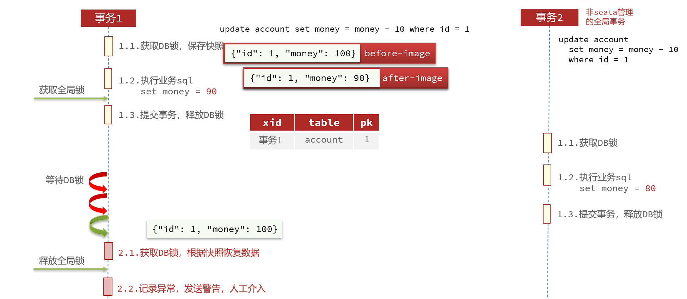


### 实现AT模式


#### 1. 导入表结构


表lock_table需要导入到TC服务关联的数据库：

```sql
SET NAMES utf8mb4;
SET FOREIGN_KEY_CHECKS = 0;

-- ----------------------------
-- Table structure for lock_table
-- ----------------------------
DROP TABLE IF EXISTS `lock_table`;
CREATE TABLE `lock_table`  (
  `row_key` varchar(128) CHARACTER SET utf8 COLLATE utf8_general_ci NOT NULL,
  `xid` varchar(96) CHARACTER SET utf8 COLLATE utf8_general_ci NULL DEFAULT NULL,
  `transaction_id` bigint(20) NULL DEFAULT NULL,
  `branch_id` bigint(20) NOT NULL,
  `resource_id` varchar(256) CHARACTER SET utf8 COLLATE utf8_general_ci NULL DEFAULT NULL,
  `table_name` varchar(32) CHARACTER SET utf8 COLLATE utf8_general_ci NULL DEFAULT NULL,
  `pk` varchar(36) CHARACTER SET utf8 COLLATE utf8_general_ci NULL DEFAULT NULL,
  `gmt_create` datetime NULL DEFAULT NULL,
  `gmt_modified` datetime NULL DEFAULT NULL,
  PRIMARY KEY (`row_key`) USING BTREE,
  INDEX `idx_branch_id`(`branch_id`) USING BTREE
) ENGINE = InnoDB CHARACTER SET = utf8 COLLATE = utf8_general_ci ROW_FORMAT = Compact;


SET FOREIGN_KEY_CHECKS = 1;
```


表undo_log需要导入到微服务关联的数据库：

```sql
SET NAMES utf8mb4;
SET FOREIGN_KEY_CHECKS = 0;

-- ----------------------------
-- Table structure for undo_log
-- ----------------------------
DROP TABLE IF EXISTS `undo_log`;
CREATE TABLE `undo_log`  (
  `branch_id` bigint(20) NOT NULL COMMENT 'branch transaction id',
  `xid` varchar(100) CHARACTER SET utf8 COLLATE utf8_general_ci NOT NULL COMMENT 'global transaction id',
  `context` varchar(128) CHARACTER SET utf8 COLLATE utf8_general_ci NOT NULL COMMENT 'undo_log context,such as serialization',
  `rollback_info` longblob NOT NULL COMMENT 'rollback info',
  `log_status` int(11) NOT NULL COMMENT '0:normal status,1:defense status',
  `log_created` datetime(6) NOT NULL COMMENT 'create datetime',
  `log_modified` datetime(6) NOT NULL COMMENT 'modify datetime',
  UNIQUE INDEX `ux_undo_log`(`xid`, `branch_id`) USING BTREE
) ENGINE = InnoDB CHARACTER SET = utf8 COLLATE = utf8_general_ci COMMENT = 'AT transaction mode undo table' ROW_FORMAT = Compact;

SET FOREIGN_KEY_CHECKS = 1;
```


```sh
C:\Users\mao>mysql -u root -p
Enter password: ********
Welcome to the MySQL monitor.  Commands end with ; or \g.
Your MySQL connection id is 8
Server version: 8.0.27 MySQL Community Server - GPL

Copyright (c) 2000, 2021, Oracle and/or its affiliates.

Oracle is a registered trademark of Oracle Corporation and/or its
affiliates. Other names may be trademarks of their respective
owners.

Type 'help;' or '\h' for help. Type '\c' to clear the current input statement.

mysql> show databases;
+--------------------+
| Database           |
+--------------------+
| cloud_order        |
| cloud_user         |
| hotel              |
| information_schema |
| mysql              |
| nacos              |
| performance_schema |
| sakila             |
| seata              |
| seata_demo         |
| shop               |
| student            |
| student1           |
| student_test       |
| sys                |
| test               |
| tx                 |
| world              |
+--------------------+
18 rows in set (0.03 sec)

mysql> use seata;
Database changed
mysql> show tables;
+-----------------+
| Tables_in_seata |
+-----------------+
| branch_table    |
| global_table    |
+-----------------+
2 rows in set (0.01 sec)

mysql> SET NAMES utf8mb4;
Query OK, 0 rows affected (0.00 sec)

mysql> SET FOREIGN_KEY_CHECKS = 0;
Query OK, 0 rows affected (0.00 sec)

mysql>
mysql> -- ----------------------------
mysql> -- Table structure for lock_table
mysql> -- ----------------------------
mysql> DROP TABLE IF EXISTS `lock_table`;
Query OK, 0 rows affected, 1 warning (0.01 sec)

mysql> CREATE TABLE `lock_table`  (
    ->   `row_key` varchar(128) CHARACTER SET utf8 COLLATE utf8_general_ci NOT NULL,
    ->   `xid` varchar(96) CHARACTER SET utf8 COLLATE utf8_general_ci NULL DEFAULT NULL,
    ->   `transaction_id` bigint(20) NULL DEFAULT NULL,
    ->   `branch_id` bigint(20) NOT NULL,
    ->   `resource_id` varchar(256) CHARACTER SET utf8 COLLATE utf8_general_ci NULL DEFAULT NULL,
    ->   `table_name` varchar(32) CHARACTER SET utf8 COLLATE utf8_general_ci NULL DEFAULT NULL,
    ->   `pk` varchar(36) CHARACTER SET utf8 COLLATE utf8_general_ci NULL DEFAULT NULL,
    ->   `gmt_create` datetime NULL DEFAULT NULL,
    ->   `gmt_modified` datetime NULL DEFAULT NULL,
    ->   PRIMARY KEY (`row_key`) USING BTREE,
    ->   INDEX `idx_branch_id`(`branch_id`) USING BTREE
    -> ) ENGINE = InnoDB CHARACTER SET = utf8 COLLATE = utf8_general_ci ROW_FORMAT = Compact;
Query OK, 0 rows affected, 14 warnings (0.04 sec)

mysql>
mysql>
mysql> SET FOREIGN_KEY_CHECKS = 1;
Query OK, 0 rows affected (0.00 sec)

mysql> show tables;
+-----------------+
| Tables_in_seata |
+-----------------+
| branch_table    |
| global_table    |
| lock_table      |
+-----------------+
3 rows in set (0.00 sec)

mysql> use seata_demo;
Database changed
mysql> show tables;
+----------------------+
| Tables_in_seata_demo |
+----------------------+
| account_tbl          |
| order_tbl            |
| storage_tbl          |
+----------------------+
3 rows in set (0.00 sec)

mysql> SET NAMES utf8mb4;
Query OK, 0 rows affected (0.00 sec)

mysql> SET FOREIGN_KEY_CHECKS = 0;
Query OK, 0 rows affected (0.00 sec)

mysql>
mysql> -- ----------------------------
mysql> -- Table structure for undo_log
mysql> -- ----------------------------
mysql> DROP TABLE IF EXISTS `undo_log`;
Query OK, 0 rows affected, 1 warning (0.00 sec)

mysql> CREATE TABLE `undo_log`  (
    ->   `branch_id` bigint(20) NOT NULL COMMENT 'branch transaction id',
    ->   `xid` varchar(100) CHARACTER SET utf8 COLLATE utf8_general_ci NOT NULL COMMENT 'global transaction id',
    ->   `context` varchar(128) CHARACTER SET utf8 COLLATE utf8_general_ci NOT NULL COMMENT 'undo_log context,such as serialization',
    ->   `rollback_info` longblob NOT NULL COMMENT 'rollback info',
    ->   `log_status` int(11) NOT NULL COMMENT '0:normal status,1:defense status',
    ->   `log_created` datetime(6) NOT NULL COMMENT 'create datetime',
    ->   `log_modified` datetime(6) NOT NULL COMMENT 'modify datetime',
    ->   UNIQUE INDEX `ux_undo_log`(`xid`, `branch_id`) USING BTREE
    -> ) ENGINE = InnoDB CHARACTER SET = utf8 COLLATE = utf8_general_ci COMMENT = 'AT transaction mode undo table' ROW_FORMAT = Compact;
Query OK, 0 rows affected, 8 warnings (0.02 sec)

mysql>
mysql> SET FOREIGN_KEY_CHECKS = 1;
Query OK, 0 rows affected (0.00 sec)

mysql> show tables;
+----------------------+
| Tables_in_seata_demo |
+----------------------+
| account_tbl          |
| order_tbl            |
| storage_tbl          |
| undo_log             |
+----------------------+
4 rows in set (0.00 sec)

mysql>
```


#### 2. 修改配置文件


修改application.yml文件，将事务模式修改为AT模式，三个项目都需要修改


```yaml

seata:
  # TC服务注册中心的配置，微服务根据这些信息去注册中心获取tc服务地址
  registry:
    # 类型，file, nacos, eureka, redis, zk, consul, etcd3, sofa
    type: nacos
    # 配置nacos信息，和registry.conf中的配置一致
    nacos:
      # nacos地址
      server-addr: localhost:8848
      # seata tc 服务注册到 nacos的服务名称，可以自定义
      application: seata-server
      # 命名空间
      namespace: ""
      # 用户名
      username: mao
      # 密码
      password: 123456
      # 分组
      group: DEFAULT_GROUP
      # 事务组，根据这个获取tc服务的cluster名称，将来可以通过集群名称做负载均衡，相同机房的优先
  tx-service-group: seata-tx-service-group
  service:
    # 事务组与TC服务cluster的映射关系
    vgroupMapping:
      seata-tx-service-group: default

  config:
    type: nacos
    nacos:
     server-addr: 127.0.0.1:8848
     username: mao
     password: 123456
     group: SEATA_GROUP

  data-source-proxy-mode: AT
```


#### 3. 重启服务


```sh
2022-07-27 13:20:33.669  INFO 13216 --- [           main] m.a.AccountServiceApplication            : No active profile set, falling back to default profiles: default
2022-07-27 13:20:34.435  INFO 13216 --- [           main] o.s.cloud.context.scope.GenericScope     : BeanFactory id=bc328c64-c76a-38e8-af4b-94347371b21e
2022-07-27 13:20:34.448  INFO 13216 --- [           main] trationDelegate$BeanPostProcessorChecker : Bean 'io.seata.spring.boot.autoconfigure.SeataAutoConfiguration' of type [io.seata.spring.boot.autoconfigure.SeataAutoConfiguration] is not eligible for getting processed by all BeanPostProcessors (for example: not eligible for auto-proxying)
2022-07-27 13:20:34.487  INFO 13216 --- [           main] trationDelegate$BeanPostProcessorChecker : Bean 'failureHandler' of type [io.seata.tm.api.DefaultFailureHandlerImpl] is not eligible for getting processed by all BeanPostProcessors (for example: not eligible for auto-proxying)
2022-07-27 13:20:34.493  INFO 13216 --- [           main] trationDelegate$BeanPostProcessorChecker : Bean 'springCloudAlibabaConfiguration' of type [io.seata.spring.boot.autoconfigure.properties.SpringCloudAlibabaConfiguration] is not eligible for getting processed by all BeanPostProcessors (for example: not eligible for auto-proxying)
2022-07-27 13:20:34.496  INFO 13216 --- [           main] trationDelegate$BeanPostProcessorChecker : Bean 'seataProperties' of type [io.seata.spring.boot.autoconfigure.properties.SeataProperties] is not eligible for getting processed by all BeanPostProcessors (for example: not eligible for auto-proxying)
2022-07-27 13:20:34.497  INFO 13216 --- [           main] i.s.s.b.a.SeataAutoConfiguration         : Automatically configure Seata
2022-07-27 13:20:34.501  INFO 13216 --- [           main] io.seata.config.FileConfiguration        : The file name of the operation is registry
2022-07-27 13:20:34.543  INFO 13216 --- [           main] io.seata.config.ConfigurationFactory     : load Configuration:FileConfiguration$$EnhancerByCGLIB$$862af1eb
2022-07-27 13:20:34.546  INFO 13216 --- [           main] trationDelegate$BeanPostProcessorChecker : Bean 'configProperties' of type [io.seata.spring.boot.autoconfigure.properties.config.ConfigProperties] is not eligible for getting processed by all BeanPostProcessors (for example: not eligible for auto-proxying)
2022-07-27 13:20:34.553  INFO 13216 --- [           main] trationDelegate$BeanPostProcessorChecker : Bean 'configNacosProperties' of type [io.seata.spring.boot.autoconfigure.properties.config.ConfigNacosProperties] is not eligible for getting processed by all BeanPostProcessors (for example: not eligible for auto-proxying)
2022-07-27 13:20:34.844  INFO 13216 --- [           main] i.s.s.a.GlobalTransactionScanner         : Initializing Global Transaction Clients ... 
2022-07-27 13:20:34.987  INFO 13216 --- [           main] i.s.core.rpc.netty.NettyClientBootstrap  : NettyClientBootstrap has started
2022-07-27 13:20:34.988  INFO 13216 --- [           main] i.s.s.a.GlobalTransactionScanner         : Transaction Manager Client is initialized. applicationId[account-service] txServiceGroup[seata-tx-service-group]
2022-07-27 13:20:35.002  INFO 13216 --- [           main] io.seata.rm.datasource.AsyncWorker       : Async Commit Buffer Limit: 10000
2022-07-27 13:20:35.003  INFO 13216 --- [           main] i.s.rm.datasource.xa.ResourceManagerXA   : ResourceManagerXA init ...
2022-07-27 13:20:35.008  INFO 13216 --- [           main] i.s.core.rpc.netty.NettyClientBootstrap  : NettyClientBootstrap has started
2022-07-27 13:20:35.008  INFO 13216 --- [           main] i.s.s.a.GlobalTransactionScanner         : Resource Manager is initialized. applicationId[account-service] txServiceGroup[seata-tx-service-group]
2022-07-27 13:20:35.008  INFO 13216 --- [           main] i.s.s.a.GlobalTransactionScanner         : Global Transaction Clients are initialized. 
2022-07-27 13:20:35.010  INFO 13216 --- [           main] trationDelegate$BeanPostProcessorChecker : Bean 'io.seata.spring.boot.autoconfigure.SeataDataSourceAutoConfiguration' of type [io.seata.spring.boot.autoconfigure.SeataDataSourceAutoConfiguration] is not eligible for getting processed by all BeanPostProcessors (for example: not eligible for auto-proxying)
2022-07-27 13:20:35.296  INFO 13216 --- [           main] o.s.b.w.embedded.tomcat.TomcatWebServer  : Tomcat initialized with port(s): 8083 (http)
2022-07-27 13:20:35.306  INFO 13216 --- [           main] o.apache.catalina.core.StandardService   : Starting service [Tomcat]
2022-07-27 13:20:35.306  INFO 13216 --- [           main] org.apache.catalina.core.StandardEngine  : Starting Servlet engine: [Apache Tomcat/9.0.43]
2022-07-27 13:20:35.455  INFO 13216 --- [           main] o.a.c.c.C.[Tomcat].[localhost].[/]       : Initializing Spring embedded WebApplicationContext
2022-07-27 13:20:35.456  INFO 13216 --- [           main] w.s.c.ServletWebServerApplicationContext : Root WebApplicationContext: initialization completed in 1763 ms
2022-07-27 13:20:35.529  INFO 13216 --- [           main] c.a.d.s.b.a.DruidDataSourceAutoConfigure : Init DruidDataSource
2022-07-27 13:20:35.638  INFO 13216 --- [           main] com.alibaba.druid.pool.DruidDataSource   : {dataSource-1} inited
2022-07-27 13:20:35.649  INFO 13216 --- [           main] .s.s.a.d.SeataAutoDataSourceProxyCreator : Auto proxy of [dataSource]
2022-07-27 13:20:35.998  INFO 13216 --- [           main] i.s.c.r.netty.NettyClientChannelManager  : will connect to 172.31.160.1:8091
2022-07-27 13:20:35.998  INFO 13216 --- [           main] i.s.c.rpc.netty.RmNettyRemotingClient    : RM will register :jdbc:mysql://localhost:3306/seata_demo
2022-07-27 13:20:36.000  INFO 13216 --- [           main] i.s.core.rpc.netty.NettyPoolableFactory  : NettyPool create channel to transactionRole:RMROLE,address:172.31.160.1:8091,msg:< RegisterRMRequest{resourceIds='jdbc:mysql://localhost:3306/seata_demo', applicationId='account-service', transactionServiceGroup='seata-tx-service-group'} >
2022-07-27 13:20:36.310  INFO 13216 --- [           main] i.s.c.rpc.netty.RmNettyRemotingClient    : register RM success. client version:1.4.2, server version:1.4.2,channel:[id: 0x3a545958, L:/172.31.160.1:50118 - R:/172.31.160.1:8091]
2022-07-27 13:20:36.316  INFO 13216 --- [           main] i.s.core.rpc.netty.NettyPoolableFactory  : register success, cost 192 ms, version:1.4.2,role:RMROLE,channel:[id: 0x3a545958, L:/172.31.160.1:50118 - R:/172.31.160.1:8091]
 _ _   |_  _ _|_. ___ _ |    _ 
| | |\/|_)(_| | |_\  |_)||_|_\ 
     /               |         
                        3.5.1 
2022-07-27 13:20:36.698  WARN 13216 --- [           main] c.n.c.sources.URLConfigurationSource     : No URLs will be polled as dynamic configuration sources.
2022-07-27 13:20:36.698  INFO 13216 --- [           main] c.n.c.sources.URLConfigurationSource     : To enable URLs as dynamic configuration sources, define System property archaius.configurationSource.additionalUrls or make config.properties available on classpath.
2022-07-27 13:20:36.701  WARN 13216 --- [           main] c.n.c.sources.URLConfigurationSource     : No URLs will be polled as dynamic configuration sources.
2022-07-27 13:20:36.702  INFO 13216 --- [           main] c.n.c.sources.URLConfigurationSource     : To enable URLs as dynamic configuration sources, define System property archaius.configurationSource.additionalUrls or make config.properties available on classpath.
2022-07-27 13:20:36.822  INFO 13216 --- [           main] o.s.s.concurrent.ThreadPoolTaskExecutor  : Initializing ExecutorService 'applicationTaskExecutor'
2022-07-27 13:20:37.071  INFO 13216 --- [           main] o.s.s.c.ThreadPoolTaskScheduler          : Initializing ExecutorService 'Nacos-Watch-Task-Scheduler'
2022-07-27 13:20:37.483  INFO 13216 --- [           main] o.s.b.w.embedded.tomcat.TomcatWebServer  : Tomcat started on port(s): 8083 (http) with context path ''
2022-07-27 13:20:37.500  INFO 13216 --- [           main] c.a.c.n.registry.NacosServiceRegistry    : nacos registry, DEFAULT_GROUP account-service 192.168.202.1:8083 register finished
2022-07-27 13:20:37.625  INFO 13216 --- [           main] m.a.AccountServiceApplication            : Started AccountServiceApplication in 4.86 seconds (JVM running for 8.498)
2022-07-27 13:21:34.979  INFO 13216 --- [eoutChecker_1_1] i.s.c.r.netty.NettyClientChannelManager  : will connect to 172.31.160.1:8091
2022-07-27 13:21:34.980  INFO 13216 --- [eoutChecker_1_1] i.s.core.rpc.netty.NettyPoolableFactory  : NettyPool create channel to transactionRole:TMROLE,address:172.31.160.1:8091,msg:< RegisterTMRequest{applicationId='account-service', transactionServiceGroup='seata-tx-service-group'} >
2022-07-27 13:21:34.991  INFO 13216 --- [eoutChecker_1_1] i.s.c.rpc.netty.TmNettyRemotingClient    : register TM success. client version:1.4.2, server version:1.4.2,channel:[id: 0x7ae5eec0, L:/172.31.160.1:50361 - R:/172.31.160.1:8091]
2022-07-27 13:21:34.991  INFO 13216 --- [eoutChecker_1_1] i.s.core.rpc.netty.NettyPoolableFactory  : register success, cost 9 ms, version:1.4.2,role:TMROLE,channel:[id: 0x7ae5eec0, L:/172.31.160.1:50361 - R:/172.31.160.1:8091]
```


```sh
2022-07-27 13:20:33.672  INFO 780 --- [           main] m.orderservice.OrderServiceApplication   : No active profile set, falling back to default profiles: default
2022-07-27 13:20:34.442  INFO 780 --- [           main] o.s.cloud.context.scope.GenericScope     : BeanFactory id=49e36265-0346-35d4-84fb-39196acbeec2
2022-07-27 13:20:34.454  INFO 780 --- [           main] trationDelegate$BeanPostProcessorChecker : Bean 'io.seata.spring.boot.autoconfigure.SeataAutoConfiguration' of type [io.seata.spring.boot.autoconfigure.SeataAutoConfiguration] is not eligible for getting processed by all BeanPostProcessors (for example: not eligible for auto-proxying)
2022-07-27 13:20:34.487  INFO 780 --- [           main] trationDelegate$BeanPostProcessorChecker : Bean 'failureHandler' of type [io.seata.tm.api.DefaultFailureHandlerImpl] is not eligible for getting processed by all BeanPostProcessors (for example: not eligible for auto-proxying)
2022-07-27 13:20:34.492  INFO 780 --- [           main] trationDelegate$BeanPostProcessorChecker : Bean 'springCloudAlibabaConfiguration' of type [io.seata.spring.boot.autoconfigure.properties.SpringCloudAlibabaConfiguration] is not eligible for getting processed by all BeanPostProcessors (for example: not eligible for auto-proxying)
2022-07-27 13:20:34.495  INFO 780 --- [           main] trationDelegate$BeanPostProcessorChecker : Bean 'seataProperties' of type [io.seata.spring.boot.autoconfigure.properties.SeataProperties] is not eligible for getting processed by all BeanPostProcessors (for example: not eligible for auto-proxying)
2022-07-27 13:20:34.496  INFO 780 --- [           main] i.s.s.b.a.SeataAutoConfiguration         : Automatically configure Seata
2022-07-27 13:20:34.501  INFO 780 --- [           main] io.seata.config.FileConfiguration        : The file name of the operation is registry
2022-07-27 13:20:34.538  INFO 780 --- [           main] io.seata.config.ConfigurationFactory     : load Configuration:FileConfiguration$$EnhancerByCGLIB$$862af1eb
2022-07-27 13:20:34.542  INFO 780 --- [           main] trationDelegate$BeanPostProcessorChecker : Bean 'configProperties' of type [io.seata.spring.boot.autoconfigure.properties.config.ConfigProperties] is not eligible for getting processed by all BeanPostProcessors (for example: not eligible for auto-proxying)
2022-07-27 13:20:34.551  INFO 780 --- [           main] trationDelegate$BeanPostProcessorChecker : Bean 'configNacosProperties' of type [io.seata.spring.boot.autoconfigure.properties.config.ConfigNacosProperties] is not eligible for getting processed by all BeanPostProcessors (for example: not eligible for auto-proxying)
2022-07-27 13:20:34.846  INFO 780 --- [           main] i.s.s.a.GlobalTransactionScanner         : Initializing Global Transaction Clients ... 
2022-07-27 13:20:34.987  INFO 780 --- [           main] i.s.core.rpc.netty.NettyClientBootstrap  : NettyClientBootstrap has started
2022-07-27 13:20:34.987  INFO 780 --- [           main] i.s.s.a.GlobalTransactionScanner         : Transaction Manager Client is initialized. applicationId[order-service] txServiceGroup[seata-tx-service-group]
2022-07-27 13:20:35.002  INFO 780 --- [           main] io.seata.rm.datasource.AsyncWorker       : Async Commit Buffer Limit: 10000
2022-07-27 13:20:35.003  INFO 780 --- [           main] i.s.rm.datasource.xa.ResourceManagerXA   : ResourceManagerXA init ...
2022-07-27 13:20:35.007  INFO 780 --- [           main] i.s.core.rpc.netty.NettyClientBootstrap  : NettyClientBootstrap has started
2022-07-27 13:20:35.008  INFO 780 --- [           main] i.s.s.a.GlobalTransactionScanner         : Resource Manager is initialized. applicationId[order-service] txServiceGroup[seata-tx-service-group]
2022-07-27 13:20:35.008  INFO 780 --- [           main] i.s.s.a.GlobalTransactionScanner         : Global Transaction Clients are initialized. 
2022-07-27 13:20:35.010  INFO 780 --- [           main] trationDelegate$BeanPostProcessorChecker : Bean 'io.seata.spring.boot.autoconfigure.SeataDataSourceAutoConfiguration' of type [io.seata.spring.boot.autoconfigure.SeataDataSourceAutoConfiguration] is not eligible for getting processed by all BeanPostProcessors (for example: not eligible for auto-proxying)
2022-07-27 13:20:35.082  INFO 780 --- [           main] trationDelegate$BeanPostProcessorChecker : Bean 'com.alibaba.cloud.seata.feign.SeataFeignClientAutoConfiguration$FeignBeanPostProcessorConfiguration' of type [com.alibaba.cloud.seata.feign.SeataFeignClientAutoConfiguration$FeignBeanPostProcessorConfiguration] is not eligible for getting processed by all BeanPostProcessors (for example: not eligible for auto-proxying)
2022-07-27 13:20:35.086  INFO 780 --- [           main] trationDelegate$BeanPostProcessorChecker : Bean 'seataFeignObjectWrapper' of type [com.alibaba.cloud.seata.feign.SeataFeignObjectWrapper] is not eligible for getting processed by all BeanPostProcessors (for example: not eligible for auto-proxying)
2022-07-27 13:20:35.295  INFO 780 --- [           main] o.s.b.w.embedded.tomcat.TomcatWebServer  : Tomcat initialized with port(s): 8082 (http)
2022-07-27 13:20:35.306  INFO 780 --- [           main] o.apache.catalina.core.StandardService   : Starting service [Tomcat]
2022-07-27 13:20:35.306  INFO 780 --- [           main] org.apache.catalina.core.StandardEngine  : Starting Servlet engine: [Apache Tomcat/9.0.43]
2022-07-27 13:20:35.455  INFO 780 --- [           main] o.a.c.c.C.[Tomcat].[localhost].[/]       : Initializing Spring embedded WebApplicationContext
2022-07-27 13:20:35.455  INFO 780 --- [           main] w.s.c.ServletWebServerApplicationContext : Root WebApplicationContext: initialization completed in 1753 ms
2022-07-27 13:20:35.830  INFO 780 --- [           main] c.a.d.s.b.a.DruidDataSourceAutoConfigure : Init DruidDataSource
2022-07-27 13:20:35.925  INFO 780 --- [           main] com.alibaba.druid.pool.DruidDataSource   : {dataSource-1} inited
2022-07-27 13:20:35.935  INFO 780 --- [           main] .s.s.a.d.SeataAutoDataSourceProxyCreator : Auto proxy of [dataSource]
2022-07-27 13:20:36.287  INFO 780 --- [           main] i.s.c.r.netty.NettyClientChannelManager  : will connect to 172.31.160.1:8091
2022-07-27 13:20:36.287  INFO 780 --- [           main] i.s.c.rpc.netty.RmNettyRemotingClient    : RM will register :jdbc:mysql://localhost:3306/seata_demo
2022-07-27 13:20:36.290  INFO 780 --- [           main] i.s.core.rpc.netty.NettyPoolableFactory  : NettyPool create channel to transactionRole:RMROLE,address:172.31.160.1:8091,msg:< RegisterRMRequest{resourceIds='jdbc:mysql://localhost:3306/seata_demo', applicationId='order-service', transactionServiceGroup='seata-tx-service-group'} >
2022-07-27 13:20:36.445  INFO 780 --- [           main] i.s.c.rpc.netty.RmNettyRemotingClient    : register RM success. client version:1.4.2, server version:1.4.2,channel:[id: 0x9741ebc0, L:/172.31.160.1:50122 - R:/172.31.160.1:8091]
2022-07-27 13:20:36.452  INFO 780 --- [           main] i.s.core.rpc.netty.NettyPoolableFactory  : register success, cost 55 ms, version:1.4.2,role:RMROLE,channel:[id: 0x9741ebc0, L:/172.31.160.1:50122 - R:/172.31.160.1:8091]
 _ _   |_  _ _|_. ___ _ |    _ 
| | |\/|_)(_| | |_\  |_)||_|_\ 
     /               |         
                        3.5.1 
2022-07-27 13:20:36.747  INFO 780 --- [           main] i.s.s.a.GlobalTransactionScanner         : Bean[mao.orderservice.service.impl.OrderServiceImpl] with name [orderServiceImpl] would use interceptor [io.seata.spring.annotation.GlobalTransactionalInterceptor]
2022-07-27 13:20:36.785  WARN 780 --- [           main] c.n.c.sources.URLConfigurationSource     : No URLs will be polled as dynamic configuration sources.
2022-07-27 13:20:36.785  INFO 780 --- [           main] c.n.c.sources.URLConfigurationSource     : To enable URLs as dynamic configuration sources, define System property archaius.configurationSource.additionalUrls or make config.properties available on classpath.
2022-07-27 13:20:36.788  WARN 780 --- [           main] c.n.c.sources.URLConfigurationSource     : No URLs will be polled as dynamic configuration sources.
2022-07-27 13:20:36.788  INFO 780 --- [           main] c.n.c.sources.URLConfigurationSource     : To enable URLs as dynamic configuration sources, define System property archaius.configurationSource.additionalUrls or make config.properties available on classpath.
2022-07-27 13:20:36.883  INFO 780 --- [           main] o.s.s.concurrent.ThreadPoolTaskExecutor  : Initializing ExecutorService 'applicationTaskExecutor'
2022-07-27 13:20:36.941  INFO 780 --- [           main] o.s.b.a.w.s.WelcomePageHandlerMapping    : Adding welcome page: class path resource [static/index.html]
2022-07-27 13:20:37.113  INFO 780 --- [           main] o.s.s.c.ThreadPoolTaskScheduler          : Initializing ExecutorService 'Nacos-Watch-Task-Scheduler'
2022-07-27 13:20:37.477  INFO 780 --- [           main] o.s.b.w.embedded.tomcat.TomcatWebServer  : Tomcat started on port(s): 8082 (http) with context path ''
2022-07-27 13:20:37.500  INFO 780 --- [           main] c.a.c.n.registry.NacosServiceRegistry    : nacos registry, DEFAULT_GROUP order-service 192.168.202.1:8082 register finished
2022-07-27 13:20:37.625  INFO 780 --- [           main] m.orderservice.OrderServiceApplication   : Started OrderServiceApplication in 4.86 seconds (JVM running for 6.214)
2022-07-27 13:21:34.979  INFO 780 --- [eoutChecker_1_1] i.s.c.r.netty.NettyClientChannelManager  : will connect to 172.31.160.1:8091
2022-07-27 13:21:34.981  INFO 780 --- [eoutChecker_1_1] i.s.core.rpc.netty.NettyPoolableFactory  : NettyPool create channel to transactionRole:TMROLE,address:172.31.160.1:8091,msg:< RegisterTMRequest{applicationId='order-service', transactionServiceGroup='seata-tx-service-group'} >
2022-07-27 13:21:34.990  INFO 780 --- [eoutChecker_1_1] i.s.c.rpc.netty.TmNettyRemotingClient    : register TM success. client version:1.4.2, server version:1.4.2,channel:[id: 0x1d4dfae2, L:/172.31.160.1:50362 - R:/172.31.160.1:8091]
2022-07-27 13:21:34.991  INFO 780 --- [eoutChecker_1_1] i.s.core.rpc.netty.NettyPoolableFactory  : register success, cost 8 ms, version:1.4.2,role:TMROLE,channel:[id: 0x1d4dfae2, L:/172.31.160.1:50362 - R:/172.31.160.1:8091]
2022-07-27 13:21:35.683  INFO 780 --- [h_RMROLE_1_1_32] i.s.c.r.p.client.RmUndoLogProcessor      : rm handle undo log process:UndoLogDeleteRequest{resourceId='jdbc:mysql://localhost:3306/seata_demo', saveDays=7, branchType=AT}
```


```sh
2022-07-27 13:20:35.190  INFO 17528 --- [           main] m.s.StorageServiceApplication            : No active profile set, falling back to default profiles: default
2022-07-27 13:20:35.803  INFO 17528 --- [           main] o.s.cloud.context.scope.GenericScope     : BeanFactory id=915700d7-6bb2-3380-b35c-2d5799dffea2
2022-07-27 13:20:35.812  INFO 17528 --- [           main] trationDelegate$BeanPostProcessorChecker : Bean 'io.seata.spring.boot.autoconfigure.SeataAutoConfiguration' of type [io.seata.spring.boot.autoconfigure.SeataAutoConfiguration] is not eligible for getting processed by all BeanPostProcessors (for example: not eligible for auto-proxying)
2022-07-27 13:20:35.836  INFO 17528 --- [           main] trationDelegate$BeanPostProcessorChecker : Bean 'failureHandler' of type [io.seata.tm.api.DefaultFailureHandlerImpl] is not eligible for getting processed by all BeanPostProcessors (for example: not eligible for auto-proxying)
2022-07-27 13:20:35.841  INFO 17528 --- [           main] trationDelegate$BeanPostProcessorChecker : Bean 'springCloudAlibabaConfiguration' of type [io.seata.spring.boot.autoconfigure.properties.SpringCloudAlibabaConfiguration] is not eligible for getting processed by all BeanPostProcessors (for example: not eligible for auto-proxying)
2022-07-27 13:20:35.844  INFO 17528 --- [           main] trationDelegate$BeanPostProcessorChecker : Bean 'seataProperties' of type [io.seata.spring.boot.autoconfigure.properties.SeataProperties] is not eligible for getting processed by all BeanPostProcessors (for example: not eligible for auto-proxying)
2022-07-27 13:20:35.845  INFO 17528 --- [           main] i.s.s.b.a.SeataAutoConfiguration         : Automatically configure Seata
2022-07-27 13:20:35.848  INFO 17528 --- [           main] io.seata.config.FileConfiguration        : The file name of the operation is registry
2022-07-27 13:20:35.884  INFO 17528 --- [           main] io.seata.config.ConfigurationFactory     : load Configuration:FileConfiguration$$EnhancerByCGLIB$$862af1eb
2022-07-27 13:20:35.887  INFO 17528 --- [           main] trationDelegate$BeanPostProcessorChecker : Bean 'configProperties' of type [io.seata.spring.boot.autoconfigure.properties.config.ConfigProperties] is not eligible for getting processed by all BeanPostProcessors (for example: not eligible for auto-proxying)
2022-07-27 13:20:35.892  INFO 17528 --- [           main] trationDelegate$BeanPostProcessorChecker : Bean 'configNacosProperties' of type [io.seata.spring.boot.autoconfigure.properties.config.ConfigNacosProperties] is not eligible for getting processed by all BeanPostProcessors (for example: not eligible for auto-proxying)
2022-07-27 13:20:36.129  INFO 17528 --- [           main] i.s.s.a.GlobalTransactionScanner         : Initializing Global Transaction Clients ... 
2022-07-27 13:20:36.273  INFO 17528 --- [           main] i.s.core.rpc.netty.NettyClientBootstrap  : NettyClientBootstrap has started
2022-07-27 13:20:36.274  INFO 17528 --- [           main] i.s.s.a.GlobalTransactionScanner         : Transaction Manager Client is initialized. applicationId[storage-service] txServiceGroup[seata-tx-service-group]
2022-07-27 13:20:36.287  INFO 17528 --- [           main] io.seata.rm.datasource.AsyncWorker       : Async Commit Buffer Limit: 10000
2022-07-27 13:20:36.288  INFO 17528 --- [           main] i.s.rm.datasource.xa.ResourceManagerXA   : ResourceManagerXA init ...
2022-07-27 13:20:36.306  INFO 17528 --- [           main] i.s.core.rpc.netty.NettyClientBootstrap  : NettyClientBootstrap has started
2022-07-27 13:20:36.306  INFO 17528 --- [           main] i.s.s.a.GlobalTransactionScanner         : Resource Manager is initialized. applicationId[storage-service] txServiceGroup[seata-tx-service-group]
2022-07-27 13:20:36.306  INFO 17528 --- [           main] i.s.s.a.GlobalTransactionScanner         : Global Transaction Clients are initialized. 
2022-07-27 13:20:36.308  INFO 17528 --- [           main] trationDelegate$BeanPostProcessorChecker : Bean 'io.seata.spring.boot.autoconfigure.SeataDataSourceAutoConfiguration' of type [io.seata.spring.boot.autoconfigure.SeataDataSourceAutoConfiguration] is not eligible for getting processed by all BeanPostProcessors (for example: not eligible for auto-proxying)
2022-07-27 13:20:36.554  INFO 17528 --- [           main] o.s.b.w.embedded.tomcat.TomcatWebServer  : Tomcat initialized with port(s): 8081 (http)
2022-07-27 13:20:36.561  INFO 17528 --- [           main] o.apache.catalina.core.StandardService   : Starting service [Tomcat]
2022-07-27 13:20:36.561  INFO 17528 --- [           main] org.apache.catalina.core.StandardEngine  : Starting Servlet engine: [Apache Tomcat/9.0.43]
2022-07-27 13:20:36.681  INFO 17528 --- [           main] o.a.c.c.C.[Tomcat].[localhost].[/]       : Initializing Spring embedded WebApplicationContext
2022-07-27 13:20:36.682  INFO 17528 --- [           main] w.s.c.ServletWebServerApplicationContext : Root WebApplicationContext: initialization completed in 1470 ms
2022-07-27 13:20:36.753  INFO 17528 --- [           main] c.a.d.s.b.a.DruidDataSourceAutoConfigure : Init DruidDataSource
2022-07-27 13:20:36.860  INFO 17528 --- [           main] com.alibaba.druid.pool.DruidDataSource   : {dataSource-1} inited
2022-07-27 13:20:36.872  INFO 17528 --- [           main] .s.s.a.d.SeataAutoDataSourceProxyCreator : Auto proxy of [dataSource]
2022-07-27 13:20:37.237  INFO 17528 --- [           main] i.s.c.r.netty.NettyClientChannelManager  : will connect to 172.31.160.1:8091
2022-07-27 13:20:37.238  INFO 17528 --- [           main] i.s.c.rpc.netty.RmNettyRemotingClient    : RM will register :jdbc:mysql://localhost:3306/seata_demo
2022-07-27 13:20:37.240  INFO 17528 --- [           main] i.s.core.rpc.netty.NettyPoolableFactory  : NettyPool create channel to transactionRole:RMROLE,address:172.31.160.1:8091,msg:< RegisterRMRequest{resourceIds='jdbc:mysql://localhost:3306/seata_demo', applicationId='storage-service', transactionServiceGroup='seata-tx-service-group'} >
2022-07-27 13:20:37.399  INFO 17528 --- [           main] i.s.c.rpc.netty.RmNettyRemotingClient    : register RM success. client version:1.4.2, server version:1.4.2,channel:[id: 0x09158c44, L:/172.31.160.1:50131 - R:/172.31.160.1:8091]
2022-07-27 13:20:37.405  INFO 17528 --- [           main] i.s.core.rpc.netty.NettyPoolableFactory  : register success, cost 50 ms, version:1.4.2,role:RMROLE,channel:[id: 0x09158c44, L:/172.31.160.1:50131 - R:/172.31.160.1:8091]
 _ _   |_  _ _|_. ___ _ |    _ 
| | |\/|_)(_| | |_\  |_)||_|_\ 
     /               |         
                        3.5.1 
2022-07-27 13:20:37.739  WARN 17528 --- [           main] c.n.c.sources.URLConfigurationSource     : No URLs will be polled as dynamic configuration sources.
2022-07-27 13:20:37.739  INFO 17528 --- [           main] c.n.c.sources.URLConfigurationSource     : To enable URLs as dynamic configuration sources, define System property archaius.configurationSource.additionalUrls or make config.properties available on classpath.
2022-07-27 13:20:37.741  WARN 17528 --- [           main] c.n.c.sources.URLConfigurationSource     : No URLs will be polled as dynamic configuration sources.
2022-07-27 13:20:37.741  INFO 17528 --- [           main] c.n.c.sources.URLConfigurationSource     : To enable URLs as dynamic configuration sources, define System property archaius.configurationSource.additionalUrls or make config.properties available on classpath.
2022-07-27 13:20:37.843  INFO 17528 --- [           main] o.s.s.concurrent.ThreadPoolTaskExecutor  : Initializing ExecutorService 'applicationTaskExecutor'
2022-07-27 13:20:38.022  INFO 17528 --- [           main] o.s.s.c.ThreadPoolTaskScheduler          : Initializing ExecutorService 'Nacos-Watch-Task-Scheduler'
2022-07-27 13:20:38.383  INFO 17528 --- [           main] o.s.b.w.embedded.tomcat.TomcatWebServer  : Tomcat started on port(s): 8081 (http) with context path ''
2022-07-27 13:20:38.391  INFO 17528 --- [           main] c.a.c.n.registry.NacosServiceRegistry    : nacos registry, DEFAULT_GROUP storage-service 192.168.202.1:8081 register finished
2022-07-27 13:20:38.501  INFO 17528 --- [           main] m.s.StorageServiceApplication            : Started StorageServiceApplication in 4.205 seconds (JVM running for 4.88)
2022-07-27 13:21:36.265  INFO 17528 --- [eoutChecker_1_1] i.s.c.r.netty.NettyClientChannelManager  : will connect to 172.31.160.1:8091
2022-07-27 13:21:36.266  INFO 17528 --- [eoutChecker_1_1] i.s.core.rpc.netty.NettyPoolableFactory  : NettyPool create channel to transactionRole:TMROLE,address:172.31.160.1:8091,msg:< RegisterTMRequest{applicationId='storage-service', transactionServiceGroup='seata-tx-service-group'} >
2022-07-27 13:21:36.275  INFO 17528 --- [eoutChecker_1_1] i.s.c.rpc.netty.TmNettyRemotingClient    : register TM success. client version:1.4.2, server version:1.4.2,channel:[id: 0xfbfbc6e0, L:/172.31.160.1:50374 - R:/172.31.160.1:8091]
2022-07-27 13:21:36.275  INFO 17528 --- [eoutChecker_1_1] i.s.core.rpc.netty.NettyPoolableFactory  : register success, cost 7 ms, version:1.4.2,role:TMROLE,channel:[id: 0xfbfbc6e0, L:/172.31.160.1:50374 - R:/172.31.160.1:8091]
```


#### 4. 访问页面


http://localhost:8082/


#### 5. 修改页面内容


#### 6. 发起ajax请求


#### 7. 查看日志


account：

```sh
2022-07-27 13:33:40.435  INFO 13216 --- [nio-8083-exec-9] o.a.c.c.C.[Tomcat].[localhost].[/]       : Initializing Spring DispatcherServlet 'dispatcherServlet'
2022-07-27 13:33:40.436  INFO 13216 --- [nio-8083-exec-9] o.s.web.servlet.DispatcherServlet        : Initializing Servlet 'dispatcherServlet'
2022-07-27 13:33:40.440  INFO 13216 --- [nio-8083-exec-9] o.s.web.servlet.DispatcherServlet        : Completed initialization in 4 ms
2022-07-27 13:33:40.470  WARN 13216 --- [nio-8083-exec-9] c.a.druid.pool.DruidAbstractDataSource   : discard long time none received connection. , jdbcUrl : jdbc:mysql://localhost:3306/seata_demo?useUnicode=true&characterEncoding=utf8&allowMultiQueries=true&useSSL=false, version : 1.2.8, lastPacketReceivedIdleMillis : 784678
2022-07-27 13:33:40.484  INFO 13216 --- [nio-8083-exec-9] m.a.service.impl.AccountServiceImpl      : 开始扣款
2022-07-27 13:33:40.503 DEBUG 13216 --- [nio-8083-exec-9] m.a.mapper.AccountMapper.deduct          : ==>  Preparing: update account_tbl set money = money - 10 where user_id = ?
2022-07-27 13:33:40.550 DEBUG 13216 --- [nio-8083-exec-9] m.a.mapper.AccountMapper.deduct          : ==> Parameters: user202103032042012(String)
2022-07-27 13:33:40.623 DEBUG 13216 --- [nio-8083-exec-9] m.a.mapper.AccountMapper.deduct          : <==    Updates: 1
2022-07-27 13:33:40.623  INFO 13216 --- [nio-8083-exec-9] m.a.service.impl.AccountServiceImpl      : 扣款成功
2022-07-27 13:33:41.056  INFO 13216 --- [h_RMROLE_1_1_32] i.s.c.r.p.c.RmBranchRollbackProcessor    : rm handle branch rollback process:xid=172.31.160.1:8091:8683228701762637825,branchId=8683228701762637829,branchType=AT,resourceId=jdbc:mysql://localhost:3306/seata_demo,applicationData=null
2022-07-27 13:33:41.057  INFO 13216 --- [h_RMROLE_1_1_32] io.seata.rm.AbstractRMHandler            : Branch Rollbacking: 172.31.160.1:8091:8683228701762637825 8683228701762637829 jdbc:mysql://localhost:3306/seata_demo
2022-07-27 13:33:41.084  INFO 13216 --- [h_RMROLE_1_1_32] i.s.r.d.undo.AbstractUndoLogManager      : xid 172.31.160.1:8091:8683228701762637825 branch 8683228701762637829, undo_log deleted with GlobalFinished
2022-07-27 13:33:41.085  INFO 13216 --- [h_RMROLE_1_1_32] io.seata.rm.AbstractRMHandler            : Branch Rollbacked result: PhaseTwo_Rollbacked
```


order：

```sh
2022-07-27 13:31:16.851  INFO 780 --- [nio-8082-exec-5] o.a.c.c.C.[Tomcat].[localhost].[/]       : Initializing Spring DispatcherServlet 'dispatcherServlet'
2022-07-27 13:31:16.851  INFO 780 --- [nio-8082-exec-5] o.s.web.servlet.DispatcherServlet        : Initializing Servlet 'dispatcherServlet'
2022-07-27 13:31:16.857  INFO 780 --- [nio-8082-exec-5] o.s.web.servlet.DispatcherServlet        : Completed initialization in 6 ms
2022-07-27 13:33:39.825  INFO 780 --- [nio-8082-exec-1] io.seata.tm.TransactionManagerHolder     : TransactionManager Singleton io.seata.tm.DefaultTransactionManager@21007d0a
2022-07-27 13:33:39.931  INFO 780 --- [nio-8082-exec-1] i.seata.tm.api.DefaultGlobalTransaction  : Begin new global transaction [172.31.160.1:8091:8683228701762637825]
2022-07-27 13:33:39.974  WARN 780 --- [nio-8082-exec-1] c.a.druid.pool.DruidAbstractDataSource   : discard long time none received connection. , jdbcUrl : jdbc:mysql://localhost:3306/seata_demo?useUnicode=true&characterEncoding=utf8&allowMultiQueries=true&useSSL=false, version : 1.2.8, lastPacketReceivedIdleMillis : 724248
2022-07-27 13:33:39.986 DEBUG 780 --- [nio-8082-exec-1] m.o.mapper.OrderMapper.insert            : ==>  Preparing: INSERT INTO order_tbl ( user_id, commodity_code, count, money ) VALUES ( ?, ?, ?, ? )
2022-07-27 13:33:39.995 DEBUG 780 --- [nio-8082-exec-1] m.o.mapper.OrderMapper.insert            : ==> Parameters: user202103032042012(String), 100202003032041(String), 9(Integer), 10(Integer)
2022-07-27 13:33:40.202 DEBUG 780 --- [nio-8082-exec-1] m.o.mapper.OrderMapper.insert            : <==    Updates: 1
2022-07-27 13:33:40.206 DEBUG 780 --- [nio-8082-exec-1] m.orderservice.feign.AccountFeignClient  : [AccountFeignClient#deduct] ---> PUT http://account-service/account/user202103032042012/10 HTTP/1.1
2022-07-27 13:33:40.285  INFO 780 --- [nio-8082-exec-1] c.netflix.config.ChainedDynamicProperty  : Flipping property: account-service.ribbon.ActiveConnectionsLimit to use NEXT property: niws.loadbalancer.availabilityFilteringRule.activeConnectionsLimit = 2147483647
2022-07-27 13:33:40.297  INFO 780 --- [nio-8082-exec-1] c.netflix.loadbalancer.BaseLoadBalancer  : Client: account-service instantiated a LoadBalancer: DynamicServerListLoadBalancer:{NFLoadBalancer:name=account-service,current list of Servers=[],Load balancer stats=Zone stats: {},Server stats: []}ServerList:null
2022-07-27 13:33:40.309  INFO 780 --- [nio-8082-exec-1] c.n.l.DynamicServerListLoadBalancer      : Using serverListUpdater PollingServerListUpdater
2022-07-27 13:33:40.327  INFO 780 --- [nio-8082-exec-1] c.netflix.config.ChainedDynamicProperty  : Flipping property: account-service.ribbon.ActiveConnectionsLimit to use NEXT property: niws.loadbalancer.availabilityFilteringRule.activeConnectionsLimit = 2147483647
2022-07-27 13:33:40.331  INFO 780 --- [nio-8082-exec-1] c.n.l.DynamicServerListLoadBalancer      : DynamicServerListLoadBalancer for client account-service initialized: DynamicServerListLoadBalancer:{NFLoadBalancer:name=account-service,current list of Servers=[192.168.202.1:8083],Load balancer stats=Zone stats: {unknown=[Zone:unknown;	Instance count:1;	Active connections count: 0;	Circuit breaker tripped count: 0;	Active connections per server: 0.0;]
},Server stats: [[Server:192.168.202.1:8083;	Zone:UNKNOWN;	Total Requests:0;	Successive connection failure:0;	Total blackout seconds:0;	Last connection made:Thu Jan 01 08:00:00 CST 1970;	First connection made: Thu Jan 01 08:00:00 CST 1970;	Active Connections:0;	total failure count in last (1000) msecs:0;	average resp time:0.0;	90 percentile resp time:0.0;	95 percentile resp time:0.0;	min resp time:0.0;	max resp time:0.0;	stddev resp time:0.0]
]}ServerList:com.alibaba.cloud.nacos.ribbon.NacosServerList@30bd5e51
2022-07-27 13:33:40.695 DEBUG 780 --- [nio-8082-exec-1] m.orderservice.feign.AccountFeignClient  : [AccountFeignClient#deduct] <--- HTTP/1.1 204  (488ms)
2022-07-27 13:33:40.697 DEBUG 780 --- [nio-8082-exec-1] m.orderservice.feign.StorageFeignClient  : [StorageFeignClient#deduct] ---> PUT http://storage-service/storage/100202003032041/9 HTTP/1.1
2022-07-27 13:33:40.715  INFO 780 --- [nio-8082-exec-1] c.netflix.config.ChainedDynamicProperty  : Flipping property: storage-service.ribbon.ActiveConnectionsLimit to use NEXT property: niws.loadbalancer.availabilityFilteringRule.activeConnectionsLimit = 2147483647
2022-07-27 13:33:40.718  INFO 780 --- [nio-8082-exec-1] c.netflix.loadbalancer.BaseLoadBalancer  : Client: storage-service instantiated a LoadBalancer: DynamicServerListLoadBalancer:{NFLoadBalancer:name=storage-service,current list of Servers=[],Load balancer stats=Zone stats: {},Server stats: []}ServerList:null
2022-07-27 13:33:40.725  INFO 780 --- [nio-8082-exec-1] c.n.l.DynamicServerListLoadBalancer      : Using serverListUpdater PollingServerListUpdater
2022-07-27 13:33:40.737  INFO 780 --- [nio-8082-exec-1] c.netflix.config.ChainedDynamicProperty  : Flipping property: storage-service.ribbon.ActiveConnectionsLimit to use NEXT property: niws.loadbalancer.availabilityFilteringRule.activeConnectionsLimit = 2147483647
2022-07-27 13:33:40.740  INFO 780 --- [nio-8082-exec-1] c.n.l.DynamicServerListLoadBalancer      : DynamicServerListLoadBalancer for client storage-service initialized: DynamicServerListLoadBalancer:{NFLoadBalancer:name=storage-service,current list of Servers=[192.168.202.1:8081],Load balancer stats=Zone stats: {unknown=[Zone:unknown;	Instance count:1;	Active connections count: 0;	Circuit breaker tripped count: 0;	Active connections per server: 0.0;]
},Server stats: [[Server:192.168.202.1:8081;	Zone:UNKNOWN;	Total Requests:0;	Successive connection failure:0;	Total blackout seconds:0;	Last connection made:Thu Jan 01 08:00:00 CST 1970;	First connection made: Thu Jan 01 08:00:00 CST 1970;	Active Connections:0;	total failure count in last (1000) msecs:0;	average resp time:0.0;	90 percentile resp time:0.0;	95 percentile resp time:0.0;	min resp time:0.0;	max resp time:0.0;	stddev resp time:0.0]
]}ServerList:com.alibaba.cloud.nacos.ribbon.NacosServerList@497e9952
2022-07-27 13:33:41.037 DEBUG 780 --- [nio-8082-exec-1] m.orderservice.feign.StorageFeignClient  : [StorageFeignClient#deduct] <--- HTTP/1.1 500  (340ms)
2022-07-27 13:33:41.041 ERROR 780 --- [nio-8082-exec-1] m.o.service.impl.OrderServiceImpl        : 下单失败，原因:{"timestamp":"2022-07-27T05:33:41.020+00:00","status":500,"error":"Internal Server Error","message":"","path":"/storage/100202003032041/9"}

feign.FeignException$InternalServerError: [500 ] during [PUT] to [http://storage-service/storage/100202003032041/9] [StorageFeignClient#deduct(String,Integer)]: [{"timestamp":"2022-07-27T05:33:41.020+00:00","status":500,"error":"Internal Server Error","message":"","path":"/storage/100202003032041/9"}]
	at feign.FeignException.serverErrorStatus(FeignException.java:231) ~[feign-core-10.10.1.jar:na]
	at feign.FeignException.errorStatus(FeignException.java:180) ~[feign-core-10.10.1.jar:na]
...
...
...

2022-07-27 13:33:41.094  INFO 780 --- [h_RMROLE_1_2_32] i.s.c.r.p.c.RmBranchRollbackProcessor    : rm handle branch rollback process:xid=172.31.160.1:8091:8683228701762637825,branchId=8683228701762637827,branchType=AT,resourceId=jdbc:mysql://localhost:3306/seata_demo,applicationData=null
2022-07-27 13:33:41.095  INFO 780 --- [h_RMROLE_1_2_32] io.seata.rm.AbstractRMHandler            : Branch Rollbacking: 172.31.160.1:8091:8683228701762637825 8683228701762637827 jdbc:mysql://localhost:3306/seata_demo
2022-07-27 13:33:41.121  INFO 780 --- [h_RMROLE_1_2_32] i.s.r.d.undo.AbstractUndoLogManager      : xid 172.31.160.1:8091:8683228701762637825 branch 8683228701762637827, undo_log deleted with GlobalFinished
2022-07-27 13:33:41.122  INFO 780 --- [h_RMROLE_1_2_32] io.seata.rm.AbstractRMHandler            : Branch Rollbacked result: PhaseTwo_Rollbacked
2022-07-27 13:33:41.135  INFO 780 --- [nio-8082-exec-1] i.seata.tm.api.DefaultGlobalTransaction  : Suspending current transaction, xid = 172.31.160.1:8091:8683228701762637825
2022-07-27 13:33:41.135  INFO 780 --- [nio-8082-exec-1] i.seata.tm.api.DefaultGlobalTransaction  : [172.31.160.1:8091:8683228701762637825] rollback status: Rollbacked
2022-07-27 13:33:41.140 ERROR 780 --- [nio-8082-exec-1] o.a.c.c.C.[.[.[/].[dispatcherServlet]    : Servlet.service() for servlet [dispatcherServlet] in context with path [] threw exception [Request processing failed; nested exception is java.lang.RuntimeException: {"timestamp":"2022-07-27T05:33:41.020+00:00","status":500,"error":"Internal Server Error","message":"","path":"/storage/100202003032041/9"}] with root cause

feign.FeignException$InternalServerError: [500 ] during [PUT] to [http://storage-service/storage/100202003032041/9] [StorageFeignClient#deduct(String,Integer)]: [{"timestamp":"2022-07-27T05:33:41.020+00:00","status":500,"error":"Internal Server Error","message":"","path":"/storage/100202003032041/9"}]
	at feign.FeignException.serverErrorStatus(FeignException.java:231) ~[feign-core-10.10.1.jar:na]
	at feign.FeignException.errorStatus(FeignException.java:180) ~[feign-core-10.10.1.jar:na]
	at feign.FeignException.errorStatus(FeignException.java:169) ~[feign-core-10.10.1.jar:na]
...
...
...

2022-07-27 13:33:41.312  INFO 780 --- [erListUpdater-0] c.netflix.config.ChainedDynamicProperty  : Flipping property: account-service.ribbon.ActiveConnectionsLimit to use NEXT property: niws.loadbalancer.availabilityFilteringRule.activeConnectionsLimit = 2147483647
2022-07-27 13:33:41.727  INFO 780 --- [erListUpdater-1] c.netflix.config.ChainedDynamicProperty  : Flipping property: storage-service.ribbon.ActiveConnectionsLimit to use NEXT property: niws.loadbalancer.availabilityFilteringRule.activeConnectionsLimit = 2147483647

```


storage：

```sh
2022-07-27 13:33:40.781  INFO 17528 --- [nio-8081-exec-8] o.a.c.c.C.[Tomcat].[localhost].[/]       : Initializing Spring DispatcherServlet 'dispatcherServlet'
2022-07-27 13:33:40.781  INFO 17528 --- [nio-8081-exec-8] o.s.web.servlet.DispatcherServlet        : Initializing Servlet 'dispatcherServlet'
2022-07-27 13:33:40.785  INFO 17528 --- [nio-8081-exec-8] o.s.web.servlet.DispatcherServlet        : Completed initialization in 4 ms
2022-07-27 13:33:40.815  WARN 17528 --- [nio-8081-exec-8] c.a.druid.pool.DruidAbstractDataSource   : discard long time none received connection. , jdbcUrl : jdbc:mysql://localhost:3306/seata_demo?useUnicode=true&characterEncoding=utf8&allowMultiQueries=true&useSSL=false, version : 1.2.8, lastPacketReceivedIdleMillis : 783789
2022-07-27 13:33:40.830  INFO 17528 --- [nio-8081-exec-8] m.s.service.impl.StorageServiceImpl      : 开始扣减库存
2022-07-27 13:33:40.843 DEBUG 17528 --- [nio-8081-exec-8] m.s.mapper.StorageMapper.deduct          : ==>  Preparing: update storage_tbl set `count` = `count` - ? where commodity_code = ?
2022-07-27 13:33:40.885 DEBUG 17528 --- [nio-8081-exec-8] m.s.mapper.StorageMapper.deduct          : ==> Parameters: 9(Integer), 100202003032041(String)
2022-07-27 13:33:41.008 ERROR 17528 --- [nio-8081-exec-8] o.a.c.c.C.[.[.[/].[dispatcherServlet]    : Servlet.service() for servlet [dispatcherServlet] in context with path [] threw exception [Request processing failed; nested exception is java.lang.RuntimeException: 扣减库存失败！] with root cause

com.mysql.cj.jdbc.exceptions.MysqlDataTruncation: Data truncation: BIGINT UNSIGNED value is out of range in '(`seata_demo`.`storage_tbl`.`count` - 9)'
	at com.mysql.cj.jdbc.exceptions.SQLExceptionsMapping.translateException(SQLExceptionsMapping.java:104) ~[mysql-connector-java-8.0.27.jar:8.0.27]
	at com.mysql.cj.jdbc.ClientPreparedStatement.executeInternal(ClientPreparedStatement.java:953) ~[mysql-connector-java-8.0.27.jar:8.0.27]
...
...
...
```


#### 8. 查看数据库


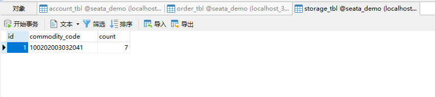


回滚成功


#### 9. 更改页面内容


#### 10. 发起ajax请求


#### 11. 查看日志


account：

```sh
2022-07-27 13:43:37.478  WARN 13216 --- [nio-8083-exec-3] c.a.druid.pool.DruidAbstractDataSource   : discard long time none received connection. , jdbcUrl : jdbc:mysql://localhost:3306/seata_demo?useUnicode=true&characterEncoding=utf8&allowMultiQueries=true&useSSL=false, version : 1.2.8, lastPacketReceivedIdleMillis : 596394
2022-07-27 13:43:37.481  INFO 13216 --- [nio-8083-exec-3] m.a.service.impl.AccountServiceImpl      : 开始扣款
2022-07-27 13:43:37.482 DEBUG 13216 --- [nio-8083-exec-3] m.a.mapper.AccountMapper.deduct          : ==>  Preparing: update account_tbl set money = money - 10 where user_id = ?
2022-07-27 13:43:37.482 DEBUG 13216 --- [nio-8083-exec-3] m.a.mapper.AccountMapper.deduct          : ==> Parameters: user202103032042012(String)
2022-07-27 13:43:37.484 DEBUG 13216 --- [nio-8083-exec-3] m.a.mapper.AccountMapper.deduct          : <==    Updates: 1
2022-07-27 13:43:37.484  INFO 13216 --- [nio-8083-exec-3] m.a.service.impl.AccountServiceImpl      : 扣款成功
2022-07-27 13:43:37.688  INFO 13216 --- [h_RMROLE_1_2_32] i.s.c.r.p.c.RmBranchCommitProcessor      : rm client handle branch commit process:xid=172.31.160.1:8091:8683228701762637833,branchId=8683228701762637837,branchType=AT,resourceId=jdbc:mysql://localhost:3306/seata_demo,applicationData=null
2022-07-27 13:43:37.688  INFO 13216 --- [h_RMROLE_1_2_32] io.seata.rm.AbstractRMHandler            : Branch committing: 172.31.160.1:8091:8683228701762637833 8683228701762637837 jdbc:mysql://localhost:3306/seata_demo null
2022-07-27 13:43:37.689  INFO 13216 --- [h_RMROLE_1_2_32] io.seata.rm.AbstractRMHandler            : Branch commit result: PhaseTwo_Committed
```


order：

```sh
2022-07-27 13:43:37.456  INFO 780 --- [nio-8082-exec-5] i.seata.tm.api.DefaultGlobalTransaction  : Begin new global transaction [172.31.160.1:8091:8683228701762637833]
2022-07-27 13:43:37.457  WARN 780 --- [nio-8082-exec-5] c.a.druid.pool.DruidAbstractDataSource   : discard long time none received connection. , jdbcUrl : jdbc:mysql://localhost:3306/seata_demo?useUnicode=true&characterEncoding=utf8&allowMultiQueries=true&useSSL=false, version : 1.2.8, lastPacketReceivedIdleMillis : 596335
2022-07-27 13:43:37.460 DEBUG 780 --- [nio-8082-exec-5] m.o.mapper.OrderMapper.insert            : ==>  Preparing: INSERT INTO order_tbl ( user_id, commodity_code, count, money ) VALUES ( ?, ?, ?, ? )
2022-07-27 13:43:37.461 DEBUG 780 --- [nio-8082-exec-5] m.o.mapper.OrderMapper.insert            : ==> Parameters: user202103032042012(String), 100202003032041(String), 1(Integer), 10(Integer)
2022-07-27 13:43:37.474 DEBUG 780 --- [nio-8082-exec-5] m.o.mapper.OrderMapper.insert            : <==    Updates: 1
2022-07-27 13:43:37.475 DEBUG 780 --- [nio-8082-exec-5] m.orderservice.feign.AccountFeignClient  : [AccountFeignClient#deduct] ---> PUT http://account-service/account/user202103032042012/10 HTTP/1.1
2022-07-27 13:43:37.497 DEBUG 780 --- [nio-8082-exec-5] m.orderservice.feign.AccountFeignClient  : [AccountFeignClient#deduct] <--- HTTP/1.1 204  (21ms)
2022-07-27 13:43:37.497 DEBUG 780 --- [nio-8082-exec-5] m.orderservice.feign.StorageFeignClient  : [StorageFeignClient#deduct] ---> PUT http://storage-service/storage/100202003032041/1 HTTP/1.1
2022-07-27 13:43:37.553 DEBUG 780 --- [nio-8082-exec-5] m.orderservice.feign.StorageFeignClient  : [StorageFeignClient#deduct] <--- HTTP/1.1 204  (55ms)
2022-07-27 13:43:37.564  INFO 780 --- [nio-8082-exec-5] i.seata.tm.api.DefaultGlobalTransaction  : Suspending current transaction, xid = 172.31.160.1:8091:8683228701762637833
2022-07-27 13:43:37.564  INFO 780 --- [nio-8082-exec-5] i.seata.tm.api.DefaultGlobalTransaction  : [172.31.160.1:8091:8683228701762637833] commit status: Committed
2022-07-27 13:43:37.681  INFO 780 --- [h_RMROLE_1_3_32] i.s.c.r.p.c.RmBranchCommitProcessor      : rm client handle branch commit process:xid=172.31.160.1:8091:8683228701762637833,branchId=8683228701762637835,branchType=AT,resourceId=jdbc:mysql://localhost:3306/seata_demo,applicationData=null
2022-07-27 13:43:37.683  INFO 780 --- [h_RMROLE_1_3_32] io.seata.rm.AbstractRMHandler            : Branch committing: 172.31.160.1:8091:8683228701762637833 8683228701762637835 jdbc:mysql://localhost:3306/seata_demo null
2022-07-27 13:43:37.683  INFO 780 --- [h_RMROLE_1_3_32] io.seata.rm.AbstractRMHandler            : Branch commit result: PhaseTwo_Committed
```


storage：

```sh
2022-07-27 13:43:37.500  WARN 17528 --- [nio-8081-exec-3] c.a.druid.pool.DruidAbstractDataSource   : discard long time none received connection. , jdbcUrl : jdbc:mysql://localhost:3306/seata_demo?useUnicode=true&characterEncoding=utf8&allowMultiQueries=true&useSSL=false, version : 1.2.8, lastPacketReceivedIdleMillis : 596502
2022-07-27 13:43:37.503  INFO 17528 --- [nio-8081-exec-3] m.s.service.impl.StorageServiceImpl      : 开始扣减库存
2022-07-27 13:43:37.504 DEBUG 17528 --- [nio-8081-exec-3] m.s.mapper.StorageMapper.deduct          : ==>  Preparing: update storage_tbl set `count` = `count` - ? where commodity_code = ?
2022-07-27 13:43:37.504 DEBUG 17528 --- [nio-8081-exec-3] m.s.mapper.StorageMapper.deduct          : ==> Parameters: 1(Integer), 100202003032041(String)
2022-07-27 13:43:37.509 DEBUG 17528 --- [nio-8081-exec-3] m.s.mapper.StorageMapper.deduct          : <==    Updates: 1
2022-07-27 13:43:37.509  INFO 17528 --- [nio-8081-exec-3] m.s.service.impl.StorageServiceImpl      : 扣减库存成功
2022-07-27 13:43:37.695  INFO 17528 --- [h_RMROLE_1_1_32] i.s.c.r.p.c.RmBranchCommitProcessor      : rm client handle branch commit process:xid=172.31.160.1:8091:8683228701762637833,branchId=8683228701762637839,branchType=AT,resourceId=jdbc:mysql://localhost:3306/seata_demo,applicationData=null
2022-07-27 13:43:37.696  INFO 17528 --- [h_RMROLE_1_1_32] io.seata.rm.AbstractRMHandler            : Branch committing: 172.31.160.1:8091:8683228701762637833 8683228701762637839 jdbc:mysql://localhost:3306/seata_demo null
2022-07-27 13:43:37.697  INFO 17528 --- [h_RMROLE_1_1_32] io.seata.rm.AbstractRMHandler            : Branch commit result: PhaseTwo_Committed
```


#### 12. 查看数据库


提交成功


## TCC模式

### 原理

TCC模式与AT模式非常相似，每阶段都是独立事务，不同的是TCC通过人工编码来实现数据恢复。需要实现三个方法

* Try：资源的检测和预留
* Confirm：完成资源操作业务；要求 Try 成功 Confirm 一定要能成功
* Cancel：预留资源释放，可以理解为try的反向操作


一个扣减用户余额的业务。假设账户A原来余额是100，需要余额扣减30元

* 阶段一（ Try ）：检查余额是否充足，如果充足则冻结金额增加30元，可用余额扣除30
* 阶段二：假如要提交（Confirm），则冻结金额扣减30
* 阶段二：如果要回滚（Cancel），则冻结金额扣减30，可用余额增加30


TCC的优点：

* 一阶段完成直接提交事务，释放数据库资源，性能好
* 相比AT模型，无需生成快照，无需使用全局锁，性能最强
* 不依赖数据库事务，而是依赖补偿操作，可以用于非事务型数据库

TCC的缺点：

* 有代码侵入，需要人为编写try、Confirm和Cancel接口，太麻烦
* 软状态，事务是最终一致
* 需要考虑Confirm和Cancel的失败情况，做好幂等处理


### 空回滚和业务悬挂

**空回滚：**

当某分支事务的try阶段阻塞时，可能导致全局事务超时而触发二阶段的cancel操作。在未执行try操作时先执行了cancel操作，这时cancel不能做回滚，就是空回滚


**业务悬挂：**

对于已经空回滚的业务，如果以后继续执行try，就永远不可能confirm或cancel，这就是业务悬挂。应当阻止执行空回滚后的try操作，避免悬挂


### 业务分析

为了实现空回滚、防止业务悬挂，以及幂等性要求。我们必须在数据库记录冻结金额的同时，记录当前事务id和执行状态


表：

```sql
CREATE TABLE `account_freeze_tbl` (
  `xid` varchar(128) NOT NULL,
  `user_id` varchar(255) DEFAULT NULL COMMENT '用户id',
  `freeze_money` int(11) unsigned DEFAULT '0' COMMENT '冻结金额',
  `state` int(1) DEFAULT NULL COMMENT '事务状态，0:try，1:confirm，2:cancel',
  PRIMARY KEY (`xid`) USING BTREE
) ENGINE=InnoDB DEFAULT CHARSET=utf8 ROW_FORMAT=COMPACT;
```


**Try业务：**

* 记录冻结金额和事务状态到account_freeze表
* 扣减account表可用金额


**Confirm业务：**

* 根据xid删除account_freeze表的冻结记录


**Cancel业务：**

* 修改account_freeze表，冻结金额为0，state为2
* 修改account表，恢复可用金额


**如何判断是否空回滚：**

* cancel业务中，根据xid查询account_freeze，如果为null则说明try还没做，需要空回滚


**如何避免业务悬挂：**

* try业务中，根据xid查询account_freeze ，如果已经存在则证明Cancel已经执行，拒绝执行try业务


TCC的Try、Confirm、Cancel方法都需要在接口中基于注解来声明，语法如下：


```java
@LocalTCC
public interface TCCService
{
    /**
     * Try逻辑 @TwoPhaseBusinessAction中的name属性要与当前方法名一致，用于指定Try逻辑对应的方法
     *
     * @param param 参数
     */
    @TwoPhaseBusinessAction(name = "prepare", commitMethod = "confirm", rollbackMethod = "cancel")
    void prepare(@BusinessActionContextParameter(paramName = "param") String param);

    /**
     * 二阶段confirm确认方法、可以另命名，但要保证与commitMethod一致
     *
     * @param context BusinessActionContext 上下文,可以传递try方法的参数
     * @return 执行是否成功
     */
    boolean confirm(BusinessActionContext context);

    /**
     * 二阶段回滚方法，名称要保证与rollbackMethod一致
     *
     * @param context BusinessActionContext 上下文,可以传递try方法的参数
     * @return 执行是否成功
     */
    boolean cancel(BusinessActionContext context);
}
```


### 实现TCC模式


1. 导入数据表


```sh
CREATE TABLE `account_freeze_tbl` (
  `xid` varchar(128) NOT NULL,
  `user_id` varchar(255) DEFAULT NULL COMMENT '用户id',
  `freeze_money` int(11) unsigned DEFAULT '0' COMMENT '冻结金额',
  `state` int(1) DEFAULT NULL COMMENT '事务状态，0:try，1:confirm，2:cancel',
  PRIMARY KEY (`xid`) USING BTREE
) ENGINE=InnoDB DEFAULT CHARSET=utf8 ROW_FORMAT=COMPACT;
```


```sh
C:\Users\mao>mysql -u root -p
Enter password: ********
Welcome to the MySQL monitor.  Commands end with ; or \g.
Your MySQL connection id is 8
Server version: 8.0.27 MySQL Community Server - GPL

Copyright (c) 2000, 2021, Oracle and/or its affiliates.

Oracle is a registered trademark of Oracle Corporation and/or its
affiliates. Other names may be trademarks of their respective
owners.

Type 'help;' or '\h' for help. Type '\c' to clear the current input statement.

mysql> use seata_demo;
Database changed
mysql>
mysql> show tables;
+----------------------+
| Tables_in_seata_demo |
+----------------------+
| account_tbl          |
| order_tbl            |
| storage_tbl          |
| undo_log             |
+----------------------+
4 rows in set (0.02 sec)

mysql> CREATE TABLE `account_freeze_tbl` (
    ->   `xid` varchar(128) NOT NULL,
    ->   `user_id` varchar(255) DEFAULT NULL COMMENT '用户id',
    ->   `freeze_money` int(11) unsigned DEFAULT '0' COMMENT '冻结金额',
    ->   `state` int(1) DEFAULT NULL COMMENT '事务状态，0:try，1:confirm，2:cancel',
    ->   PRIMARY KEY (`xid`) USING BTREE
    -> ) ENGINE=InnoDB DEFAULT CHARSET=utf8 ROW_FORMAT=COMPACT;
Query OK, 0 rows affected, 3 warnings (0.03 sec)

mysql> show tables;
+----------------------+
| Tables_in_seata_demo |
+----------------------+
| account_freeze_tbl   |
| account_tbl          |
| order_tbl            |
| storage_tbl          |
| undo_log             |
+----------------------+
5 rows in set (0.00 sec)

mysql>
```


2. 编写实体类AccountFreeze


```java
package mao.accountservice.entity;

import com.baomidou.mybatisplus.annotation.IdType;
import com.baomidou.mybatisplus.annotation.TableId;
import com.baomidou.mybatisplus.annotation.TableName;

/**
 * Project name(项目名称)：spring_cloud_distributed_transaction_seata
 * Package(包名): mao.accountservice.entity
 * Class(类名): AccountFreeze
 * Author(作者）: mao
 * Author QQ：1296193245
 * GitHub：https://github.com/maomao124/
 * Date(创建日期)： 2022/7/24
 * Time(创建时间)： 20:29
 * Version(版本): 1.0
 * Description(描述)： 无
 */

@TableName("account_freeze_tbl")
public class AccountFreeze
{
    @TableId(type = IdType.INPUT)
    private String xid;
    private String userId;
    private Integer freezeMoney;
    private Integer state;

    /**
     * The type State.
     */
    public static abstract class State
    {
        /**
         * The constant TRY.
         */
        public final static int TRY = 0;
        /**
         * The constant CONFIRM.
         */
        public final static int CONFIRM = 1;
        /**
         * The constant CANCEL.
         */
        public final static int CANCEL = 2;
    }

    /**
     * Instantiates a new Account freeze.
     */
    public AccountFreeze()
    {

    }

    /**
     * Instantiates a new Account freeze.
     *
     * @param xid         the xid
     * @param userId      the user id
     * @param freezeMoney the freeze money
     * @param state       the state
     */
    public AccountFreeze(String xid, String userId, Integer freezeMoney, Integer state)
    {
        this.xid = xid;
        this.userId = userId;
        this.freezeMoney = freezeMoney;
        this.state = state;
    }

    /**
     * Gets xid.
     *
     * @return the xid
     */
    public String getXid()
    {
        return xid;
    }

    /**
     * Sets xid.
     *
     * @param xid the xid
     */
    public void setXid(String xid)
    {
        this.xid = xid;
    }

    /**
     * Gets user id.
     *
     * @return the user id
     */
    public String getUserId()
    {
        return userId;
    }

    /**
     * Sets user id.
     *
     * @param userId the user id
     */
    public void setUserId(String userId)
    {
        this.userId = userId;
    }

    /**
     * Gets freeze money.
     *
     * @return the freeze money
     */
    public Integer getFreezeMoney()
    {
        return freezeMoney;
    }

    /**
     * Sets freeze money.
     *
     * @param freezeMoney the freeze money
     */
    public void setFreezeMoney(Integer freezeMoney)
    {
        this.freezeMoney = freezeMoney;
    }

    /**
     * Gets state.
     *
     * @return the state
     */
    public Integer getState()
    {
        return state;
    }

    /**
     * Sets state.
     *
     * @param state the state
     */
    public void setState(Integer state)
    {
        this.state = state;
    }

    @Override
    @SuppressWarnings("all")
    public String toString()
    {
        final StringBuilder stringbuilder = new StringBuilder();
        stringbuilder.append("xid：").append(xid).append('\n');
        stringbuilder.append("userId：").append(userId).append('\n');
        stringbuilder.append("freezeMoney：").append(freezeMoney).append('\n');
        stringbuilder.append("state：").append(state).append('\n');
        return stringbuilder.toString();
    }
}

```


3. 编写mapper接口AccountFreezeMapper


```java
package mao.accountservice.mapper;

import com.baomidou.mybatisplus.core.mapper.BaseMapper;
import mao.accountservice.entity.AccountFreeze;
import org.apache.ibatis.annotations.Mapper;

/**
 * Project name(项目名称)：spring_cloud_distributed_transaction_seata
 * Package(包名): mao.accountservice.mapper
 * Interface(接口名): AccountFreezeMapper
 * Author(作者）: mao
 * Author QQ：1296193245
 * GitHub：https://github.com/maomao124/
 * Date(创建日期)： 2022/7/28
 * Time(创建时间)： 13:06
 * Version(版本): 1.0
 * Description(描述)： 无
 */

@Mapper
public interface AccountFreezeMapper extends BaseMapper<AccountFreeze>
{

}
```


4. 编写业务接口AccountTCCService


```java
package mao.accountservice.service;

import io.seata.rm.tcc.api.BusinessActionContext;
import io.seata.rm.tcc.api.BusinessActionContextParameter;
import io.seata.rm.tcc.api.LocalTCC;
import io.seata.rm.tcc.api.TwoPhaseBusinessAction;

/**
 * Project name(项目名称)：spring_cloud_distributed_transaction_seata
 * Package(包名): mao.accountservice.service
 * Interface(接口名): AccountTCCService
 * Author(作者）: mao
 * Author QQ：1296193245
 * GitHub：https://github.com/maomao124/
 * Date(创建日期)： 2022/7/28
 * Time(创建时间)： 13:23
 * Version(版本): 1.0
 * Description(描述)： 无
 */

@LocalTCC
public interface AccountTCCService
{
    /**
     * Try逻辑 @TwoPhaseBusinessAction中的name属性要与当前方法名一致，用于指定Try逻辑对应的方法
     *
     * @param userId 用户的id
     * @param money  要扣减的金额
     */
    @TwoPhaseBusinessAction(name = "prepare", commitMethod = "confirm", rollbackMethod = "cancel")
    void prepare(@BusinessActionContextParameter(paramName = "userId") String userId,
                 @BusinessActionContextParameter(paramName = "money") int money);

    /**
     * 二阶段confirm确认方法、可以另命名，但要保证与commitMethod一致
     *
     * @param context BusinessActionContext 上下文,可以传递try方法的参数
     * @return 执行是否成功
     */
    boolean confirm(BusinessActionContext context);

    /**
     * 二阶段回滚方法，名称要保证与rollbackMethod一致
     *
     * @param context BusinessActionContext 上下文,可以传递try方法的参数
     * @return 执行是否成功
     */
    boolean cancel(BusinessActionContext context);
}

```


5. 编写实现类


```java
package mao.accountservice.service.impl;

import io.seata.core.context.RootContext;
import io.seata.rm.tcc.api.BusinessActionContext;
import lombok.extern.slf4j.Slf4j;
import mao.accountservice.entity.AccountFreeze;
import mao.accountservice.mapper.AccountFreezeMapper;
import mao.accountservice.mapper.AccountMapper;
import mao.accountservice.service.AccountTCCService;
import org.springframework.stereotype.Service;
import org.springframework.transaction.annotation.Transactional;

import javax.annotation.Resource;

/**
 * Project name(项目名称)：spring_cloud_distributed_transaction_seata
 * Package(包名): mao.accountservice.service.impl
 * Class(类名): AccountTCCServiceImpl
 * Author(作者）: mao
 * Author QQ：1296193245
 * GitHub：https://github.com/maomao124/
 * Date(创建日期)： 2022/7/28
 * Time(创建时间)： 13:27
 * Version(版本): 1.0
 * Description(描述)： 无
 */

@Slf4j
@Service
public class AccountTCCServiceImpl implements AccountTCCService
{

    @Resource
    private AccountMapper accountMapper;

    @Resource
    private AccountFreezeMapper accountFreezeMapper;


    @Override
    @Transactional
    public void prepare(String userId, int money)
    {
        //try方法，资源的检测和预留

        //获得事务的xid
        String xid = RootContext.getXID();
        //打印日志
        log.debug("开始执行prepare方法，用户id为" + userId + "，事务id为" + xid);

        //查询冻结记录，解决业务悬挂问题
        log.debug("开始查询冻结记录");
        AccountFreeze accountFreeze1 = accountFreezeMapper.selectById(xid);
        if ((accountFreeze1 != null) && (accountFreeze1.getState() == AccountFreeze.State.CANCEL))
        {
            //如果已经存在则证明Cancel已经执行，拒绝执行try业务
            log.warn("出现业务悬挂！，事务id为" + xid);
            return;
        }

        //构建一个实体类对象
        AccountFreeze accountFreeze = new AccountFreeze();
        //设置xid
        accountFreeze.setXid(xid);
        //设置用户的id
        accountFreeze.setUserId(userId);
        //设置冻结的金额
        accountFreeze.setFreezeMoney(money);
        //设置事务状态
        accountFreeze.setState(AccountFreeze.State.TRY);
        //记录冻结金额和事务状态到account_freeze表
        log.debug("开始冻结金额，金额为" + money);
        accountFreezeMapper.insert(accountFreeze);
        //扣除可用的余额
        log.debug("开始扣除可用的余额");
        accountMapper.deduct(userId, money);


    }

    @Override
    public boolean confirm(BusinessActionContext context)
    {
        //confirm方法，完成资源操作业务

        //获得xid
        String xid = context.getXid();
        log.debug("开始执行confirm方法，xid为" + xid);
        //根据xid删除account_freeze表的冻结记录
        log.debug("开始删除冻结记录");
        int delete = accountFreezeMapper.deleteById(xid);
        return delete == 1;
    }

    @Override
    @Transactional
    public boolean cancel(BusinessActionContext context)
    {
        //cancel，预留资源释放，try的反向操作

        //获得xid
        String xid = context.getXid();
        log.debug("开始执行cancel方法，xid为" + xid);


        //查询冻结记录
        log.debug("开始查询冻结记录");
        AccountFreeze accountFreeze = accountFreezeMapper.selectById(xid);
        //判断是否出现空回滚
        if (accountFreeze == null || accountFreeze.getXid() == null)
        {
            //出现空回滚，需要将冻结记录写入到表中，设置状态为cancel
            log.warn("出现空回滚！ 事务id为" + xid);
            //获得userId
            String userId = (String) context.getActionContext("userId");
            //构建一个实体类对象
            accountFreeze = new AccountFreeze();
            //设置xid
            accountFreeze.setXid(xid);
            //设置用户的id
            accountFreeze.setUserId(userId);
            //设置冻结的金额
            accountFreeze.setFreezeMoney(0);
            //设置事务状态
            accountFreeze.setState(AccountFreeze.State.CANCEL);
            log.debug("创建冻结记录，并将冻结金额设置为0");
            accountFreezeMapper.insert(accountFreeze);
            return true;
        }

        //判断幂等，也就是判断状态是否为cancel
        if (accountFreeze.getState() == AccountFreeze.State.CANCEL)
        {
            log.debug("出现幂等问题！ 事务id为" + xid);
            //已经执行过一次或者多次
            return true;
        }

        //设置金额
        accountFreeze.setFreezeMoney(0);
        //设置状态
        accountFreeze.setState(AccountFreeze.State.CANCEL);
        log.debug("开始将冻结金额设置为0");
        int update = accountFreezeMapper.updateById(accountFreeze);
        //恢复可用余额
        log.debug("开始恢复可用余额");
        accountMapper.refund(accountFreeze.getUserId(), accountFreeze.getFreezeMoney());
        return update == 1;
    }
}
```


6. 修改AccountController类


```java
package mao.accountservice.controller;

import mao.accountservice.service.AccountService;
import mao.accountservice.service.AccountTCCService;
import org.springframework.http.ResponseEntity;
import org.springframework.web.bind.annotation.PathVariable;
import org.springframework.web.bind.annotation.PutMapping;
import org.springframework.web.bind.annotation.RequestMapping;
import org.springframework.web.bind.annotation.RestController;

import javax.annotation.Resource;

/**
 * Project name(项目名称)：spring_cloud_distributed_transaction_seata
 * Package(包名): mao.accountservice.controller
 * Class(类名): AccountController
 * Author(作者）: mao
 * Author QQ：1296193245
 * GitHub：https://github.com/maomao124/
 * Date(创建日期)： 2022/7/24
 * Time(创建时间)： 20:41
 * Version(版本): 1.0
 * Description(描述)： 无
 */

@RestController
@RequestMapping("account")
public class AccountController
{
    @Resource
    private AccountService accountService;

    @Resource
    private AccountTCCService accountTCCService;

    /**
     * 扣钱
     *
     * @param userId 要扣钱的用户id
     * @param money  扣的钱的数量
     * @return ResponseEntity
     */
    @PutMapping("/{userId}/{money}")
    public ResponseEntity<Void> deduct(@PathVariable("userId") String userId, @PathVariable("money") Integer money)
    {
        //accountService.deduct(userId, money);
        accountTCCService.prepare(userId, money);
        return ResponseEntity.noContent().build();
    }
}
```


